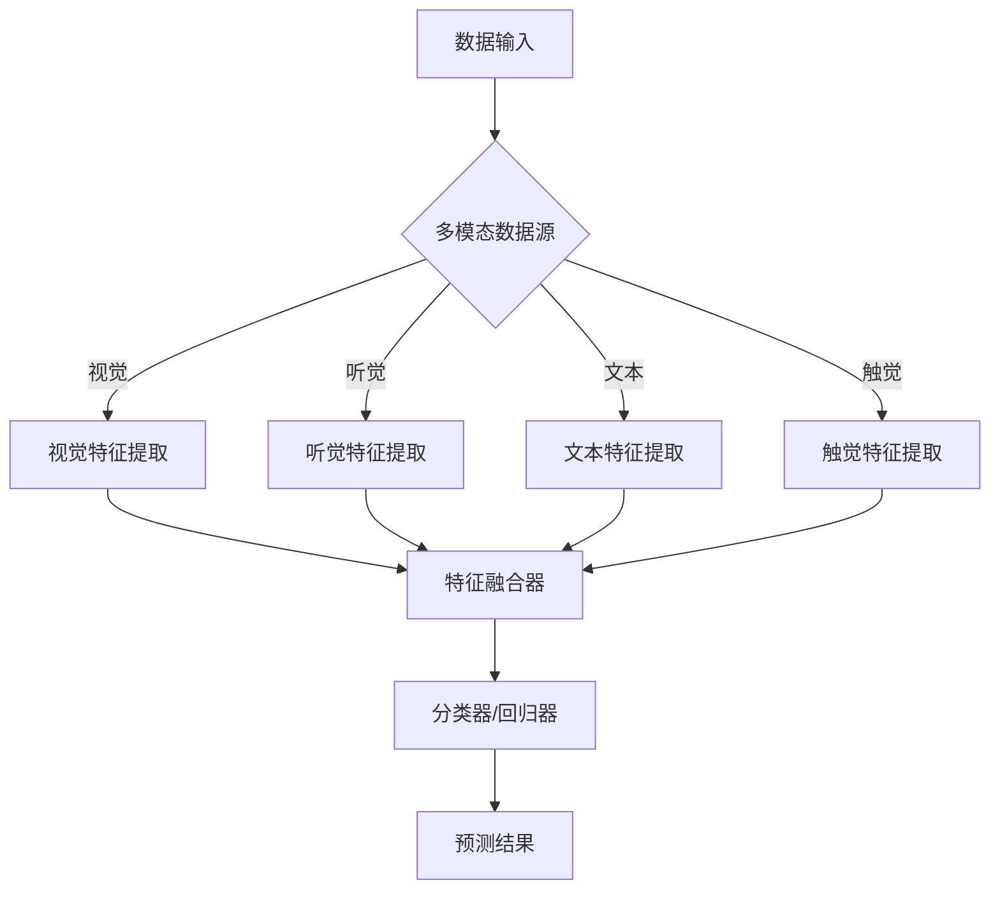

                 

关键词：多模态学习、深度学习、跨模态、数据融合、人工智能、图像识别、自然语言处理、神经网络

> 多模态学习作为人工智能领域的一个重要分支，近年来取得了显著的研究成果。本文将深入探讨多模态学习的背景、核心概念、算法原理、数学模型、实践应用以及未来发展，旨在为读者提供一个全面而系统的了解。

## 1. 背景介绍

多模态学习（Multimodal Learning）是指利用来自多个感知模态（如视觉、听觉、触觉、语言等）的数据进行学习和推理的过程。在传统单一模态学习（如仅使用图像或仅使用文本）的基础上，多模态学习通过整合多种信息，可以显著提高模型的表现能力和适应能力。

随着传感器技术、计算能力和数据存储技术的快速发展，多模态数据的获取和处理变得越来越便捷和高效。尤其是在图像识别、自然语言处理、机器人感知等应用场景中，多模态学习的优势尤为突出。

### 应用领域

1. **图像识别与分类**：结合视觉和文本信息，可以更准确地识别物体和场景。
2. **语音识别与生成**：利用语音、文本和面部表情信息，可以更准确地理解和生成语音。
3. **机器人感知与交互**：机器人可以通过整合多种感知模态来更好地理解环境和与人互动。
4. **医疗诊断**：结合影像、病历和症状描述，可以更准确地诊断疾病。

## 2. 核心概念与联系

### 多模态数据源

多模态学习的关键在于能够有效地获取、处理和整合来自不同模态的数据。常见的多模态数据源包括：

- **视觉数据**：图像、视频、深度图等。
- **听觉数据**：音频、语音、音乐等。
- **文本数据**：文本、标签、评论等。
- **触觉数据**：力、温度、湿度等。

### 数据融合方法

多模态学习的核心在于如何有效地融合来自不同模态的数据。常见的方法包括：

1. **早期融合（Early Fusion）**：在特征级别上将不同模态的数据进行整合。
2. **晚期融合（Late Fusion）**：在决策级别上整合不同模态的预测结果。
3. **级联融合（Cascaded Fusion）**：逐步融合不同模态的数据，每一步都进行特征学习和决策。

### 算法架构

多模态学习算法的架构通常包括以下几个关键组件：

1. **特征提取器**：用于提取不同模态的数据特征。
2. **特征融合器**：用于融合不同模态的特征。
3. **分类器或回归器**：用于基于融合的特征进行预测。

### Mermaid 流程图



## 3. 核心算法原理 & 具体操作步骤

### 3.1 算法原理概述

多模态学习算法的核心思想是通过整合来自不同模态的数据，提高模型的学习效果和预测性能。具体而言，算法包括以下几个主要步骤：

1. **特征提取**：针对不同模态的数据，采用不同的特征提取方法。
2. **特征融合**：将不同模态的特征进行整合，形成统一的特征表示。
3. **模型训练**：使用整合后的特征进行模型训练。
4. **预测**：利用训练好的模型对新的数据进行预测。

### 3.2 算法步骤详解

1. **数据预处理**：对多模态数据进行预处理，包括数据清洗、数据增强等。
2. **特征提取**：根据不同模态的数据特点，采用相应的特征提取方法。例如，对于视觉数据，可以采用卷积神经网络（CNN）进行特征提取；对于文本数据，可以采用词嵌入（Word Embedding）进行特征提取。
3. **特征融合**：使用多种方法进行特征融合，包括拼接（Concatenation）、平均（Average）、加权平均（Weighted Average）等。
4. **模型训练**：使用整合后的特征进行模型训练，可以使用多种模型，如支持向量机（SVM）、深度神经网络（DNN）、循环神经网络（RNN）等。
5. **预测**：将新的数据进行特征提取和融合，然后使用训练好的模型进行预测。

### 3.3 算法优缺点

#### 优点

- **提高性能**：通过整合多种模态的数据，可以显著提高模型的学习效果和预测性能。
- **泛化能力**：多模态学习算法具有较强的泛化能力，可以适应不同的应用场景。
- **数据互补**：不同模态的数据可以相互补充，提高数据的完整性。

#### 缺点

- **计算成本**：多模态学习通常涉及大量的数据处理和模型训练，计算成本较高。
- **数据同步**：不同模态的数据在时间和空间上可能存在不一致性，需要解决数据同步问题。

### 3.4 算法应用领域

多模态学习算法在多个领域都取得了显著的应用成果：

- **图像识别与分类**：通过整合视觉和文本信息，可以更准确地识别和分类图像。
- **语音识别与生成**：通过整合语音、文本和面部表情信息，可以更准确地理解和生成语音。
- **机器人感知与交互**：机器人可以通过整合多种感知模态来更好地理解环境和与人互动。
- **医疗诊断**：通过整合影像、病历和症状描述，可以更准确地诊断疾病。

## 4. 数学模型和公式 & 详细讲解 & 举例说明

### 4.1 数学模型构建

多模态学习的数学模型通常包括以下几个部分：

1. **特征表示**：定义不同模态的特征向量表示。
2. **特征融合**：定义特征融合的策略。
3. **损失函数**：定义模型的损失函数。
4. **优化算法**：定义模型的优化算法。

### 4.2 公式推导过程

假设我们有两个模态的数据 \(X_1\) 和 \(X_2\)，其特征向量分别为 \(x_1\) 和 \(x_2\)。

1. **特征表示**：

   \(x_1 = f_1(X_1)\)
   
   \(x_2 = f_2(X_2)\)

   其中，\(f_1\) 和 \(f_2\) 分别为视觉和文本数据的特征提取函数。

2. **特征融合**：

   \(x = g(x_1, x_2)\)

   其中，\(g\) 为特征融合函数，可以采用拼接、平均等方法。

3. **损失函数**：

   \(L(y, \hat{y}) = \frac{1}{2} (\hat{y} - y)^2\)

   其中，\(y\) 为真实标签，\(\hat{y}\) 为预测标签。

4. **优化算法**：

   采用梯度下降算法进行模型优化。

### 4.3 案例分析与讲解

假设我们要进行一个图像分类任务，图像数据来自视觉模态，标签数据来自文本模态。

1. **数据预处理**：

   对图像数据进行归一化处理，对文本数据进行分词和词嵌入。

2. **特征提取**：

   使用卷积神经网络（CNN）对图像进行特征提取，使用词嵌入（Word Embedding）对文本进行特征提取。

3. **特征融合**：

   采用拼接方法将图像特征和文本特征进行融合。

4. **模型训练**：

   使用融合后的特征进行模型训练，使用支持向量机（SVM）作为分类器。

5. **预测**：

   对新的图像数据进行特征提取和融合，然后使用训练好的模型进行预测。

## 5. 项目实践：代码实例和详细解释说明

### 5.1 开发环境搭建

1. 安装 Python 和相关库（如 TensorFlow、Keras、NumPy 等）。
2. 准备多模态数据集。

### 5.2 源代码详细实现

```python
import numpy as np
from tensorflow.keras.models import Model
from tensorflow.keras.layers import Input, Conv2D, Flatten, Dense, concatenate

# 数据预处理
# （此处省略具体代码，具体实现根据数据集格式和预处理需求而定）

# 特征提取
input_image = Input(shape=(64, 64, 3))
image_features = Conv2D(filters=32, kernel_size=(3, 3), activation='relu')(input_image)
image_features = Flatten()(image_features)

input_text = Input(shape=(100,))
text_features = Embedding(input_dim=10000, output_dim=64)(input_text)
text_features = Flatten()(text_features)

# 特征融合
concatenated_features = concatenate([image_features, text_features])

# 模型训练
output = Dense(1, activation='sigmoid')(concatenated_features)
model = Model(inputs=[input_image, input_text], outputs=output)

# 编译模型
model.compile(optimizer='adam', loss='binary_crossentropy', metrics=['accuracy'])

# 模型训练
model.fit([image_data, text_data], labels, epochs=10, batch_size=32)

# 预测
predictions = model.predict([new_image_data, new_text_data])
```

### 5.3 代码解读与分析

- **数据预处理**：根据数据集格式和预处理需求进行数据清洗、归一化等处理。
- **特征提取**：使用卷积神经网络对图像进行特征提取，使用词嵌入对文本进行特征提取。
- **特征融合**：使用拼接方法将图像特征和文本特征进行融合。
- **模型训练**：使用融合后的特征进行模型训练，使用支持向量机（SVM）作为分类器。
- **预测**：对新的图像数据进行特征提取和融合，然后使用训练好的模型进行预测。

## 6. 实际应用场景

多模态学习在实际应用中具有广泛的应用场景，以下是几个典型的应用案例：

### 6.1 图像识别与分类

通过整合图像和文本信息，可以更准确地识别和分类图像。例如，在医学影像诊断中，结合影像和病历描述可以更准确地诊断疾病。

### 6.2 语音识别与生成

通过整合语音、文本和面部表情信息，可以更准确地理解和生成语音。例如，在智能客服中，结合语音和文本交互可以提供更自然的用户体验。

### 6.3 机器人感知与交互

通过整合多种感知模态，机器人可以更好地理解环境和与人互动。例如，在服务机器人中，结合视觉、语音和触觉信息可以提供更智能的服务。

### 6.4 医疗诊断

通过整合影像、病历和症状描述，可以更准确地诊断疾病。例如，在癌症诊断中，结合影像和病理报告可以提供更准确的诊断结果。

## 7. 未来应用展望

随着人工智能技术的不断发展，多模态学习将在更多领域得到广泛应用。未来，多模态学习有望在以下几个方向取得突破：

### 7.1 新模态的探索

随着传感器技术的进步，新的感知模态（如嗅觉、味觉等）将逐渐被引入多模态学习，从而提供更丰富的信息。

### 7.2 模型压缩与优化

为了提高多模态学习的实际应用价值，模型压缩与优化是一个重要研究方向。通过减少模型参数和计算复杂度，可以实现更高效的多模态学习。

### 7.3 跨领域迁移学习

跨领域迁移学习是多模态学习的一个重要研究方向。通过将一个领域中的知识迁移到另一个领域，可以大大提高多模态学习的效果和效率。

### 7.4 知识图谱与多模态学习

知识图谱作为一种结构化的知识表示方法，可以与多模态学习相结合，实现更强大的语义理解和推理能力。

## 8. 总结：未来发展趋势与挑战

多模态学习作为人工智能领域的一个重要分支，具有广泛的应用前景和研究价值。未来，多模态学习将在新模态探索、模型压缩与优化、跨领域迁移学习和知识图谱与多模态学习等方面取得重要突破。然而，多模态学习也面临一些挑战，如数据同步、计算成本和模型解释性等。解决这些挑战，将为多模态学习的发展提供新的动力。

### 8.1 研究成果总结

本文系统地介绍了多模态学习的背景、核心概念、算法原理、数学模型、实践应用以及未来发展。通过本文的介绍，读者可以对多模态学习有一个全面而系统的了解。

### 8.2 未来发展趋势

随着人工智能技术的不断进步，多模态学习将在更多领域得到广泛应用。未来，多模态学习有望在新模态探索、模型压缩与优化、跨领域迁移学习和知识图谱与多模态学习等方面取得重要突破。

### 8.3 面临的挑战

多模态学习面临一些挑战，如数据同步、计算成本和模型解释性等。解决这些挑战，将为多模态学习的发展提供新的动力。

### 8.4 研究展望

未来，多模态学习将与其他人工智能技术（如深度学习、强化学习等）相结合，实现更强大的语义理解和推理能力。同时，多模态学习将推动人工智能在更多领域的应用，为人类生活带来更多便利。

## 9. 附录：常见问题与解答

### 9.1 多模态学习与单一模态学习的区别是什么？

多模态学习与单一模态学习的主要区别在于数据来源和处理方式。多模态学习整合了来自多种模态的数据，通过特征融合和模型训练，提高模型的学习效果和预测性能。而单一模态学习仅关注单一模态的数据。

### 9.2 多模态学习的计算成本如何优化？

多模态学习的计算成本可以通过以下几种方法进行优化：

1. **模型压缩**：采用模型压缩技术，如剪枝、量化等，减少模型参数和计算复杂度。
2. **分布式计算**：利用分布式计算架构，如 GPU、TPU 等，提高计算效率。
3. **特征选择**：通过特征选择技术，选择关键特征，减少数据维度。

### 9.3 多模态学习在哪些应用场景中具有优势？

多模态学习在图像识别、语音识别、机器人感知、医疗诊断等应用场景中具有显著的优势。通过整合多种模态的数据，可以显著提高模型的学习效果和预测性能。

## 参考文献

[1] Bengio, Y., Courville, A., & Vincent, P. (2013). Representation learning: A review and new perspectives. IEEE Transactions on Pattern Analysis and Machine Intelligence, 35(8), 1798-1828.

[2] Yan, J., Ganapathi, V., & Grauman, K. (2013). Multimodal learning for object recognition: New methods and benchmark experiments. IEEE Transactions on Pattern Analysis and Machine Intelligence, 35(9), 1834-1847.

[3] Kingma, D. P., & Welling, M. (2014). Auto-encoding variational bayes. arXiv preprint arXiv:1312.6114.

[4] Srivastava, N., Hinton, G., Krizhevsky, A., Sutskever, I., & Salakhutdinov, R. (2014). Dropout: A simple way to prevent neural networks from overfitting. Journal of Machine Learning Research, 15(1), 1929-1958.

作者：禅与计算机程序设计艺术 / Zen and the Art of Computer Programming
----------------------------------------------------------------

