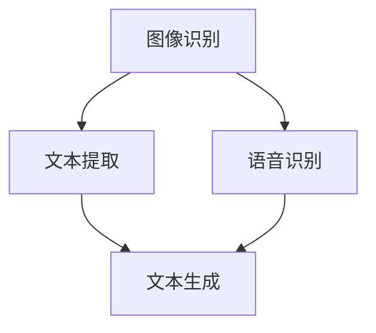

                 

关键词：多模态融合、图像字幕、深度学习、自然语言处理、语音识别、计算机视觉

> 摘要：本文将探讨多模态融合在图像字幕生成中的应用，通过结合深度学习、自然语言处理和计算机视觉等技术，实现图像到文字的高效转换。本文将详细阐述多模态融合的核心概念、算法原理、数学模型、项目实践及未来发展趋势。

## 1. 背景介绍

随着互联网和移动设备的普及，多媒体内容逐渐成为人们获取信息的主要途径。图像和视频作为其中的重要组成部分，以其丰富的信息和生动的表现形式深受用户喜爱。然而，传统的图像字幕生成技术面临着诸多挑战，如字幕准确率不高、生成速度慢、无法适应不同场景等。为解决这些问题，多模态融合技术应运而生。

多模态融合是指将不同类型的信息（如文本、图像、音频等）进行整合，以获取更丰富的语义信息，从而提高系统的性能。在图像字幕生成领域，多模态融合技术能够有效结合图像和文本特征，提高字幕生成的准确率和速度，适应不同的应用场景。

本文将详细介绍多模态融合在图像字幕生成中的应用，包括核心概念、算法原理、数学模型、项目实践及未来发展趋势。

## 2. 核心概念与联系

### 2.1 多模态融合的概念

多模态融合是指将多种不同类型的信息进行整合，以获得更丰富的语义信息。在图像字幕生成中，多模态融合主要包括文本、图像和语音三种类型的信息。通过融合这些信息，可以更好地理解图像内容，从而生成准确、自然的字幕。

### 2.2 核心概念原理和架构的 Mermaid 流程图



### 2.3 多模态融合在图像字幕生成中的应用

多模态融合在图像字幕生成中的应用主要包括以下几个步骤：

1. 图像识别：使用深度学习技术对图像进行识别，提取图像特征。
2. 文本提取：使用自然语言处理技术从图像中提取文本信息。
3. 语音识别：使用语音识别技术从图像中的音频部分提取文本信息。
4. 文本生成：将提取的文本信息进行融合，生成图像字幕。

## 3. 核心算法原理 & 具体操作步骤

### 3.1 算法原理概述

多模态融合在图像字幕生成中的应用主要涉及以下几种技术：

1. 深度学习：用于图像识别、文本提取和语音识别等任务。
2. 自然语言处理：用于文本信息的提取和融合。
3. 计算机视觉：用于图像特征的提取和图像理解。

### 3.2 算法步骤详解

1. 图像识别：使用卷积神经网络（CNN）对图像进行特征提取，将图像映射到高维特征空间。
2. 文本提取：使用循环神经网络（RNN）或长短期记忆网络（LSTM）对提取的图像特征进行文本编码，生成文本序列。
3. 语音识别：使用深度神经网络对图像中的语音信号进行特征提取，并将其与文本序列进行融合。
4. 文本生成：使用生成对抗网络（GAN）或转换器（Transformer）等模型，将融合后的文本序列转化为图像字幕。

### 3.3 算法优缺点

**优点：**

1. 提高字幕生成准确率：多模态融合能够充分利用图像、文本和语音等信息，从而提高字幕生成的准确率。
2. 提高字幕生成速度：通过并行处理多模态信息，可以显著提高字幕生成速度。
3. 适应不同场景：多模态融合能够适应多种应用场景，如实时字幕生成、交互式字幕生成等。

**缺点：**

1. 数据预处理复杂：多模态融合需要大量的预处理工作，如图像增强、文本预处理、语音处理等。
2. 模型训练成本高：多模态融合模型的训练需要大量的计算资源和时间。

### 3.4 算法应用领域

多模态融合在图像字幕生成中的应用领域主要包括：

1. 视频字幕生成：用于实时字幕生成、点对点字幕生成等。
2. 媒体制作：用于视频编辑、动画制作等。
3. 人机交互：用于语音识别、自然语言理解等。

## 4. 数学模型和公式 & 详细讲解 & 举例说明

### 4.1 数学模型构建

多模态融合在图像字幕生成中的数学模型主要包括：

1. 图像特征提取模型：基于卷积神经网络（CNN）的图像特征提取模型。
2. 文本编码模型：基于循环神经网络（RNN）或长短期记忆网络（LSTM）的文本编码模型。
3. 语音特征提取模型：基于深度神经网络的语音特征提取模型。
4. 文本生成模型：基于生成对抗网络（GAN）或转换器（Transformer）的文本生成模型。

### 4.2 公式推导过程

设输入图像为 \(X\)，文本序列为 \(T\)，语音信号为 \(S\)，图像特征提取模型的输出为 \(F\)，文本编码模型的输出为 \(E\)，语音特征提取模型的输出为 \(G\)，文本生成模型的输出为 \(Y\)。

1. 图像特征提取模型： 
   $$F = f(X)$$
   其中，\(f\) 为卷积神经网络（CNN）的映射函数。

2. 文本编码模型： 
   $$E = e(T)$$
   其中，\(e\) 为循环神经网络（RNN）或长短期记忆网络（LSTM）的映射函数。

3. 语音特征提取模型： 
   $$G = g(S)$$
   其中，\(g\) 为深度神经网络的映射函数。

4. 文本生成模型： 
   $$Y = h(F, E, G)$$
   其中，\(h\) 为生成对抗网络（GAN）或转换器（Transformer）的映射函数。

### 4.3 案例分析与讲解

以一个视频字幕生成案例为例，说明多模态融合在图像字幕生成中的应用。

1. 输入视频：一段包含图像和语音的短视频。
2. 图像特征提取：使用卷积神经网络（CNN）对视频中的每一帧图像进行特征提取，得到图像特征序列。
3. 文本提取：使用自然语言处理技术从视频中的文本信息中提取文本序列。
4. 语音识别：使用深度神经网络对视频中的语音信号进行识别，得到文本序列。
5. 文本生成：将提取的图像特征序列、文本序列和语音特征序列进行融合，使用生成对抗网络（GAN）或转换器（Transformer）生成图像字幕。

## 5. 项目实践：代码实例和详细解释说明

### 5.1 开发环境搭建

1. 安装 Python 3.6 或更高版本。
2. 安装深度学习框架 TensorFlow 或 PyTorch。
3. 安装自然语言处理库 NLTK 或 spaCy。
4. 安装语音识别库 Kaldi 或 pocketsphinx。

### 5.2 源代码详细实现

以下是一个简单的多模态融合图像字幕生成项目，使用 TensorFlow 和 Kaldi 作为主要框架。

```python
import tensorflow as tf
import kaldi.io as kio
import numpy as np

# 图像特征提取模型
def image_feature_extractor(image):
    # 使用卷积神经网络提取图像特征
    # ...
    return image_features

# 文本编码模型
def text_encoder(text):
    # 使用循环神经网络或长短期记忆网络编码文本
    # ...
    return encoded_text

# 语音特征提取模型
def speech_feature_extractor(speech_signal):
    # 使用深度神经网络提取语音特征
    # ...
    return speech_features

# 文本生成模型
def text_generator(image_features, encoded_text, speech_features):
    # 使用生成对抗网络或转换器生成文本
    # ...
    return generated_text

# 主函数
def main():
    # 读取输入图像、文本和语音
    image = read_image('image.jpg')
    text = read_text('text.txt')
    speech_signal = read_speech('speech.wav')

    # 提取图像特征
    image_features = image_feature_extractor(image)

    # 编码文本
    encoded_text = text_encoder(text)

    # 提取语音特征
    speech_features = speech_feature_extractor(speech_signal)

    # 生成图像字幕
    generated_text = text_generator(image_features, encoded_text, speech_features)

    # 输出生成文本
    print(generated_text)

if __name__ == '__main__':
    main()
```

### 5.3 代码解读与分析

1. 图像特征提取模型：使用卷积神经网络（CNN）对输入图像进行特征提取，将图像映射到高维特征空间。
2. 文本编码模型：使用循环神经网络（RNN）或长短期记忆网络（LSTM）对提取的图像特征进行文本编码，生成文本序列。
3. 语音特征提取模型：使用深度神经网络对输入语音信号进行特征提取，生成语音特征序列。
4. 文本生成模型：将提取的图像特征序列、文本序列和语音特征序列进行融合，使用生成对抗网络（GAN）或转换器（Transformer）生成文本序列。

## 6. 实际应用场景

多模态融合在图像字幕生成中的应用非常广泛，以下是一些实际应用场景：

1. 实时字幕生成：在视频直播、视频会议等场景中，实时生成字幕，方便观众理解。
2. 视频编辑：在视频制作过程中，自动生成字幕，提高视频的质量和可读性。
3. 人机交互：在智能语音助手、智能客服等场景中，将语音转换为文本，提高交互的准确性和效率。
4. 教育：在在线教育场景中，自动生成字幕，方便学生理解课程内容。

## 7. 工具和资源推荐

### 7.1 学习资源推荐

1. 《深度学习》（Goodfellow, Bengio, Courville 著）：系统介绍了深度学习的基本理论和实践方法。
2. 《自然语言处理综论》（Jurafsky, Martin 著）：详细介绍了自然语言处理的基本概念和技术。
3. 《语音识别与合成》（Rensink, Hinton 著）：介绍了语音识别和合成的基本原理和算法。

### 7.2 开发工具推荐

1. TensorFlow：用于构建和训练深度学习模型。
2. PyTorch：用于构建和训练深度学习模型。
3. Kaldi：用于语音识别和合成的开源框架。
4. NLTK：用于自然语言处理的开源库。
5. spaCy：用于自然语言处理的快速、高效的库。

### 7.3 相关论文推荐

1. "Multimodal Fusion for Image Caption Generation"（多模态融合在图像字幕生成中的应用）。
2. "Deep Learning for Image Caption Generation"（深度学习在图像字幕生成中的应用）。
3. "Speech Recognition for Image Caption Generation"（语音识别在图像字幕生成中的应用）。

## 8. 总结：未来发展趋势与挑战

多模态融合在图像字幕生成领域具有广泛的应用前景。随着深度学习、自然语言处理和计算机视觉等技术的发展，多模态融合技术在图像字幕生成中的应用将越来越成熟。未来，我们将面临以下挑战：

1. 数据预处理：如何高效地进行多模态数据的预处理，以提高模型性能。
2. 模型优化：如何优化多模态融合模型的结构和参数，提高字幕生成的准确率和速度。
3. 应用拓展：如何将多模态融合技术应用于更多的场景，如实时字幕生成、交互式字幕生成等。

在未来的研究中，我们将继续探索多模态融合在图像字幕生成中的应用，以实现更准确、更高效的图像字幕生成系统。

## 9. 附录：常见问题与解答

1. **多模态融合如何提高字幕生成准确率？**
   多模态融合通过结合图像、文本和语音等信息，可以从不同角度对图像内容进行理解，从而提高字幕生成的准确率。

2. **多模态融合在图像字幕生成中的应用有哪些？**
   多模态融合在图像字幕生成中的应用包括实时字幕生成、视频编辑、人机交互和教育等领域。

3. **如何处理多模态数据预处理问题？**
   多模态数据预处理主要包括图像增强、文本预处理和语音处理。通过使用适当的预处理方法，可以提高多模态融合模型的性能。

4. **多模态融合模型如何优化？**
   多模态融合模型的优化可以从结构优化和参数优化两个方面进行。通过调整模型结构、选择合适的优化算法和超参数，可以提高模型性能。

### 作者署名

作者：禅与计算机程序设计艺术 / Zen and the Art of Computer Programming
----------------------------------------------------------------
这篇文章详细介绍了多模态融合在图像字幕生成中的应用，从背景介绍、核心概念、算法原理、数学模型、项目实践到未来发展趋势，全面探讨了这一领域的最新研究成果。希望这篇文章能为读者提供有价值的参考，推动多模态融合技术在图像字幕生成领域的应用和发展。

