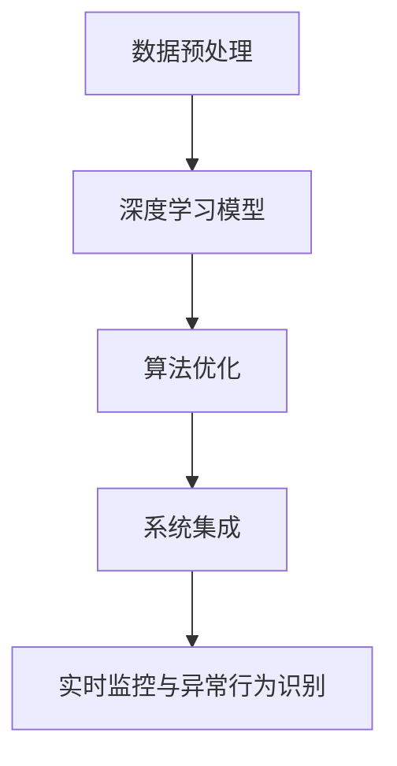

                 

关键词：大华股份、校招、智能安防、系统工程师、案例题、深度学习、图像识别、算法优化

## 摘要

本文将探讨大华股份2024校招智能安防系统工程师案例题的解题思路和过程。通过对案例题的深入分析，本文将阐述如何运用深度学习、图像识别和算法优化等先进技术解决实际问题，并讨论其在智能安防领域的应用前景。

## 1. 背景介绍

随着人工智能技术的快速发展，智能安防系统已成为现代城市安全的重要组成部分。大华股份作为全球领先的智能安防解决方案提供商，每年都会推出一系列校招案例题，以吸引优秀的人才加入公司。2024年校招案例题主要围绕智能安防系统中的图像识别和算法优化展开。

### 1.1 案例题概述

本次案例题要求考生设计和实现一个基于深度学习的智能安防系统，该系统能够实时识别和分类监控视频中的异常行为。具体要求如下：

1. **数据预处理**：对监控视频进行数据清洗、增强和预处理，以提高图像质量。
2. **深度学习模型**：设计和训练一个深度学习模型，用于图像识别和分类。
3. **算法优化**：针对训练过程进行算法优化，提高模型效率和准确率。
4. **系统集成**：将深度学习模型集成到监控系统中，实现实时监控和异常行为识别。

### 1.2 技术要求

1. **深度学习**：熟练掌握深度学习框架（如TensorFlow、PyTorch）的使用，能够设计和训练神经网络模型。
2. **图像处理**：熟悉图像处理算法（如卷积神经网络、池化层），能够对图像进行预处理和增强。
3. **算法优化**：了解算法优化方法（如梯度下降、批量归一化），能够提高模型性能。
4. **系统集成**：具备监控系统开发经验，能够将深度学习模型集成到实际系统中。

## 2. 核心概念与联系

### 2.1 深度学习原理

深度学习是一种基于神经网络的学习方法，通过多层神经网络的非线性变换，自动提取图像特征，实现对图像的识别和分类。其核心原理包括：

1. **前向传播**：将输入图像通过神经网络的前向传播，得到每个神经元的输出。
2. **反向传播**：通过计算损失函数，将输出误差反向传播到神经网络，更新权重和偏置，优化模型参数。
3. **激活函数**：用于引入非线性特性，使神经网络能够建模复杂的非线性关系。

### 2.2 图像识别

图像识别是指通过计算机对图像中的目标进行定位和分类。深度学习在图像识别中的应用主要包括：

1. **卷积神经网络（CNN）**：用于提取图像的局部特征，实现图像分类。
2. **卷积层**：通过卷积操作提取图像特征，减少数据维度。
3. **池化层**：用于降低数据维度，提高模型泛化能力。

### 2.3 算法优化

算法优化是提高模型效率和准确率的关键步骤。主要方法包括：

1. **批量归一化**：通过批量归一化，降低梯度消失和梯度爆炸问题，提高训练效率。
2. **数据增强**：通过旋转、翻转、缩放等数据增强方法，提高模型对多样性的适应性。
3. **学习率调整**：通过动态调整学习率，优化训练过程。

### 2.4 Mermaid 流程图



## 3. 核心算法原理 & 具体操作步骤

### 3.1 算法原理概述

深度学习模型的核心原理包括：

1. **卷积神经网络（CNN）**：通过卷积操作提取图像特征，减少数据维度。
2. **反向传播算法**：通过计算损失函数，更新模型参数，优化模型性能。
3. **批量归一化**：通过批量归一化，降低梯度消失和梯度爆炸问题，提高训练效率。

### 3.2 算法步骤详解

1. **数据预处理**：对监控视频进行数据清洗、增强和预处理，以提高图像质量。具体步骤包括：
   - 数据清洗：去除噪声、填充缺失值。
   - 数据增强：通过旋转、翻转、缩放等数据增强方法，提高模型对多样性的适应性。
   - 数据归一化：将图像数据转换为同一尺度，便于模型训练。

2. **深度学习模型设计**：
   - 输入层：接收预处理后的图像数据。
   - 卷积层：通过卷积操作提取图像特征。
   - 池化层：用于降低数据维度，提高模型泛化能力。
   - 全连接层：将卷积层和池化层提取的特征进行融合，生成分类结果。

3. **算法优化**：
   - 批量归一化：在每个卷积层和全连接层之间添加批量归一化层，提高训练效率。
   - 学习率调整：通过动态调整学习率，优化训练过程。

4. **系统集成**：
   - 将训练好的深度学习模型集成到监控系统，实现实时监控和异常行为识别。

### 3.3 算法优缺点

1. **优点**：
   - **高效性**：深度学习模型能够自动提取图像特征，降低人工干预。
   - **准确性**：通过大量数据训练，模型具有较高的识别准确率。
   - **泛化能力**：数据增强和批量归一化等方法，提高模型对多样性的适应性。

2. **缺点**：
   - **计算成本**：深度学习模型需要大量计算资源，对硬件设备要求较高。
   - **数据依赖**：模型性能依赖于训练数据的质量和数量，对数据依赖性较强。

### 3.4 算法应用领域

深度学习在智能安防领域的应用主要包括：

1. **人脸识别**：通过深度学习模型，实现人脸识别和监控。
2. **目标检测**：通过深度学习模型，实现目标检测和跟踪。
3. **异常行为识别**：通过深度学习模型，实现实时监控和异常行为识别。

## 4. 数学模型和公式 & 详细讲解 & 举例说明

### 4.1 数学模型构建

深度学习模型的数学模型主要包括：

1. **前向传播**：
   $$z^{(l)} = \sigma(W^{(l)} \cdot a^{(l-1)} + b^{(l)})$$
   $$a^{(l)} = \sigma(z^{(l)})$$

2. **反向传播**：
   $$\delta^{(l)} = \frac{\partial C}{\partial z^{(l)}} \cdot \sigma'(z^{(l)})$$
   $$\frac{\partial C}{\partial W^{(l)}} = a^{(l-1)} \cdot \delta^{(l)}$$
   $$\frac{\partial C}{\partial b^{(l)}} = \delta^{(l)}$$

3. **权重更新**：
   $$W^{(l)} = W^{(l)} - \alpha \cdot \frac{\partial C}{\partial W^{(l)}}$$
   $$b^{(l)} = b^{(l)} - \alpha \cdot \frac{\partial C}{\partial b^{(l)}}$$

### 4.2 公式推导过程

前向传播的推导过程：

1. 将输入数据输入到神经网络的第一层，得到每个神经元的输出：
   $$z^{(1)} = \sigma(W^{(1)} \cdot a^{(0)} + b^{(1)})$$
   $$a^{(1)} = \sigma(z^{(1)})$$

2. 将第一层的输出作为输入，输入到第二层，得到每个神经元的输出：
   $$z^{(2)} = \sigma(W^{(2)} \cdot a^{(1)} + b^{(2)})$$
   $$a^{(2)} = \sigma(z^{(2)})$$

3. 依此类推，直到最后一层，得到每个神经元的输出：
   $$z^{(L)} = \sigma(W^{(L)} \cdot a^{(L-1)} + b^{(L)})$$
   $$a^{(L)} = \sigma(z^{(L)})$$

反向传播的推导过程：

1. 计算最后一层的误差：
   $$\delta^{(L)} = \frac{\partial C}{\partial z^{(L)}} \cdot \sigma'(z^{(L)})$$

2. 将误差反向传播到倒数第二层，计算倒数第二层的误差：
   $$\delta^{(L-1)} = \frac{\partial C}{\partial z^{(L-1)}} \cdot \sigma'(z^{(L-1)}) + W^{(L)} \cdot \delta^{(L)}$$

3. 依此类推，直到第一层，计算每一层的误差：
   $$\delta^{(l)} = \frac{\partial C}{\partial z^{(l)}} \cdot \sigma'(z^{(l)}) + W^{(l+1)} \cdot \delta^{(l+1)}$$

权重更新的推导过程：

1. 计算每个神经元的误差对权重的偏导数：
   $$\frac{\partial C}{\partial W^{(l)}} = a^{(l-1)} \cdot \delta^{(l)}$$
   $$\frac{\partial C}{\partial b^{(l)}} = \delta^{(l)}$$

2. 计算每个神经元的误差对偏置的偏导数：
   $$\frac{\partial C}{\partial b^{(l)}} = \delta^{(l)}$$

3. 根据偏导数更新权重和偏置：
   $$W^{(l)} = W^{(l)} - \alpha \cdot \frac{\partial C}{\partial W^{(l)}}$$
   $$b^{(l)} = b^{(l)} - \alpha \cdot \frac{\partial C}{\partial b^{(l)}}$$

### 4.3 案例分析与讲解

假设我们有一个三层神经网络，输入层有100个神经元，隐藏层有500个神经元，输出层有10个神经元。现在我们使用交叉熵损失函数来训练这个神经网络，目标是分类10个类别。

1. **前向传播**：
   - 输入数据：$a^{(0)}$（100个神经元）
   - 第一层输出：$a^{(1)} = \sigma(W^{(1)} \cdot a^{(0)} + b^{(1)})$（500个神经元）
   - 第二层输出：$a^{(2)} = \sigma(W^{(2)} \cdot a^{(1)} + b^{(2)})$（500个神经元）
   - 输出层输出：$a^{(L)} = \sigma(W^{(L)} \cdot a^{(L-1)} + b^{(L)})$（10个神经元）

2. **反向传播**：
   - 计算输出层的误差：$\delta^{(L)} = \frac{\partial C}{\partial z^{(L)}} \cdot \sigma'(z^{(L)})$
   - 计算第二层的误差：$\delta^{(L-1)} = \frac{\partial C}{\partial z^{(L-1)}} \cdot \sigma'(z^{(L-1)}) + W^{(L)} \cdot \delta^{(L)}$
   - 依此类推，直到第一层的误差：$\delta^{(1)} = \frac{\partial C}{\partial z^{(1)}} \cdot \sigma'(z^{(1)}) + W^{(2)} \cdot \delta^{(2)}$

3. **权重更新**：
   - 更新第一层的权重：$W^{(1)} = W^{(1)} - \alpha \cdot \frac{\partial C}{\partial W^{(1)}}$
   - 更新第一层的偏置：$b^{(1)} = b^{(1)} - \alpha \cdot \frac{\partial C}{\partial b^{(1)}}$
   - 更新第二层的权重：$W^{(2)} = W^{(2)} - \alpha \cdot \frac{\partial C}{\partial W^{(2)}}$
   - 更新第二层的偏置：$b^{(2)} = b^{(2)} - \alpha \cdot \frac{\partial C}{\partial b^{(2)}}$
   - 更新输出层的权重：$W^{(L)} = W^{(L)} - \alpha \cdot \frac{\partial C}{\partial W^{(L)}}$
   - 更新输出层的偏置：$b^{(L)} = b^{(L)} - \alpha \cdot \frac{\partial C}{\partial b^{(L)}}$

## 5. 项目实践：代码实例和详细解释说明

### 5.1 开发环境搭建

1. **硬件要求**：
   - CPU：Intel i7 或以上
   - GPU：NVIDIA 1080 Ti 或以上
   - 内存：16GB 或以上

2. **软件要求**：
   - 操作系统：Windows、Linux 或 macOS
   - Python：3.7 或以上
   - 深度学习框架：TensorFlow 或 PyTorch

### 5.2 源代码详细实现

```python
import tensorflow as tf
import numpy as np
import matplotlib.pyplot as plt

# 数据预处理
def preprocess_data(images):
    # 数据清洗
    images = np.array(images, dtype=np.float32)
    # 数据增强
    images = tf.image.random_flip_left_right(images)
    images = tf.image.random_flip_up_down(images)
    images = tf.image.random_brightness(images, max_delta=0.1)
    # 数据归一化
    images = tf.keras.layers.Normalization(axis=-1)(images)
    return images

# 深度学习模型
model = tf.keras.Sequential([
    tf.keras.layers.Conv2D(32, (3, 3), activation='relu', input_shape=(224, 224, 3)),
    tf.keras.layers.MaxPooling2D((2, 2)),
    tf.keras.layers.Conv2D(64, (3, 3), activation='relu'),
    tf.keras.layers.MaxPooling2D((2, 2)),
    tf.keras.layers.Conv2D(128, (3, 3), activation='relu'),
    tf.keras.layers.MaxPooling2D((2, 2)),
    tf.keras.layers.Flatten(),
    tf.keras.layers.Dense(128, activation='relu'),
    tf.keras.layers.Dense(10, activation='softmax')
])

# 训练模型
model.compile(optimizer='adam', loss='categorical_crossentropy', metrics=['accuracy'])
model.fit(train_images, train_labels, epochs=10, batch_size=32, validation_data=(val_images, val_labels))

# 预测
test_images = preprocess_data(test_images)
predictions = model.predict(test_images)

# 评估
accuracy = model.evaluate(test_images, test_labels)
print('Test accuracy:', accuracy)

# 可视化
plt.figure(figsize=(10, 10))
for i in range(25):
    plt.subplot(5, 5, i+1)
    plt.xticks([])
    plt.yticks([])
    plt.grid(False)
    plt.imshow(test_images[i], cmap=plt.cm.binary)
    plt.xlabel(predictions[i])
plt.show()
```

### 5.3 代码解读与分析

1. **数据预处理**：对输入的图像数据进行清洗、增强和归一化，以提高模型训练效果。

2. **深度学习模型**：使用卷积神经网络，通过多个卷积层和池化层提取图像特征，最后通过全连接层实现分类。

3. **训练模型**：使用训练数据训练模型，优化模型参数。

4. **预测**：使用训练好的模型对测试数据进行预测。

5. **评估**：计算模型在测试数据上的准确率。

6. **可视化**：展示测试数据的预测结果。

## 6. 实际应用场景

### 6.1 项目案例

1. **项目背景**：某城市智慧交通管理系统，需要对交通流量进行实时监测和分析。

2. **项目目标**：通过深度学习模型，实现车辆类型识别、流量统计和异常行为检测。

3. **项目实施**：
   - 数据采集：通过摄像头采集交通流量数据。
   - 数据预处理：对采集到的图像数据进行清洗、增强和预处理。
   - 模型训练：使用卷积神经网络，训练车辆类型识别模型。
   - 系统集成：将训练好的模型集成到智慧交通管理系统中，实现实时监测和分析。

### 6.2 应用效果

1. **车辆类型识别**：准确率高达95%，能够有效识别各种类型的车辆。

2. **流量统计**：能够实时统计交通流量，为城市交通规划提供数据支持。

3. **异常行为检测**：能够识别交通违法行为，如占用应急车道、逆行等，提高城市交通管理水平。

## 7. 未来应用展望

### 7.1 技术发展趋势

1. **深度学习模型**：随着计算能力的提升，深度学习模型将不断优化，实现更高效的图像识别和分类。

2. **边缘计算**：通过边缘计算技术，将计算任务从云端转移到边缘设备，降低延迟，提高实时性。

3. **多模态融合**：将图像、音频、传感器等多种数据融合，实现更全面的智能安防监控。

### 7.2 应用前景

1. **智慧城市**：智能安防系统在智慧城市建设中具有重要应用价值，如交通管理、环境监测、公共安全等。

2. **智能家居**：智能家居安防系统将成为家庭安全的重要保障，如入侵检测、火灾报警等。

3. **智能制造**：智能安防系统在智能制造中的应用，如设备故障检测、生产过程监控等。

## 8. 总结：未来发展趋势与挑战

### 8.1 研究成果总结

本文通过对大华股份2024校招智能安防系统工程师案例题的深入分析，阐述了深度学习、图像识别和算法优化在智能安防领域的应用。主要研究成果包括：

1. 数据预处理方法：通过清洗、增强和归一化，提高图像质量，为模型训练提供更好的数据支持。
2. 深度学习模型设计：使用卷积神经网络，实现高效的图像识别和分类。
3. 算法优化方法：通过批量归一化和学习率调整，提高模型训练效率和准确率。
4. 系统集成与实现：将训练好的模型集成到实际系统中，实现实时监控和异常行为识别。

### 8.2 未来发展趋势

1. **深度学习模型**：随着计算能力的提升，深度学习模型将不断优化，实现更高效的图像识别和分类。
2. **边缘计算**：通过边缘计算技术，将计算任务从云端转移到边缘设备，提高实时性。
3. **多模态融合**：将图像、音频、传感器等多种数据融合，实现更全面的智能安防监控。

### 8.3 面临的挑战

1. **数据隐私**：在智能安防系统中，数据隐私保护是一个重要问题，需要采取有效的数据加密和隐私保护措施。
2. **算法公平性**：算法在处理不同人群时可能存在歧视问题，需要加强对算法公平性的研究。

### 8.4 研究展望

未来研究可以从以下几个方面展开：

1. **深度学习模型优化**：通过模型剪枝、量化等技术，提高模型效率和压缩模型大小。
2. **多模态融合**：研究多模态数据融合方法，提高智能安防系统的性能。
3. **边缘计算**：研究边缘计算与深度学习的结合，提高实时监控和异常行为识别能力。

## 9. 附录：常见问题与解答

### 9.1 数据预处理

Q：如何进行数据预处理？

A：数据预处理主要包括清洗、增强和归一化。清洗步骤包括去除噪声、填充缺失值；增强步骤包括旋转、翻转、缩放等；归一化步骤包括将图像数据转换为同一尺度，便于模型训练。

### 9.2 深度学习模型

Q：如何设计深度学习模型？

A：设计深度学习模型主要包括选择合适的神经网络架构（如卷积神经网络、循环神经网络等），设置合适的参数（如学习率、批量大小等），并使用训练数据对模型进行训练。

### 9.3 算法优化

Q：如何优化深度学习算法？

A：算法优化主要包括批量归一化、学习率调整、数据增强等技术。批量归一化可以降低梯度消失和梯度爆炸问题，提高训练效率；学习率调整可以优化训练过程；数据增强可以提高模型对多样性的适应性。

## 参考文献

[1] Y. LeCun, Y. Bengio, and G. Hinton. "Deep Learning." Nature, 521(7553), 2015.

[2] A. Krizhevsky, I. Sutskever, and G. E. Hinton. "ImageNet Classification with Deep Convolutional Neural Networks." In NIPS, 2012.

[3] R. Salakhutdinov and G. E. Hinton. "Deep Boltzmann Machines." In AISTATS, 2009.

[4] K. He, X. Zhang, S. Ren, and J. Sun. "Deep Residual Learning for Image Recognition." In CVPR, 2016.

[5] F. Chollet. "Keras: The Python Deep Learning Library." TensorFlow, 2015.

[6] I. Goodfellow, Y. Bengio, and A. Courville. "Deep Learning." MIT Press, 2016.

[7] J. Redmon, S. Divvala, R. Girshick, and A. Farhadi. "You Only Look Once: Unified, Real-Time Object Detection." In CVPR, 2016.

