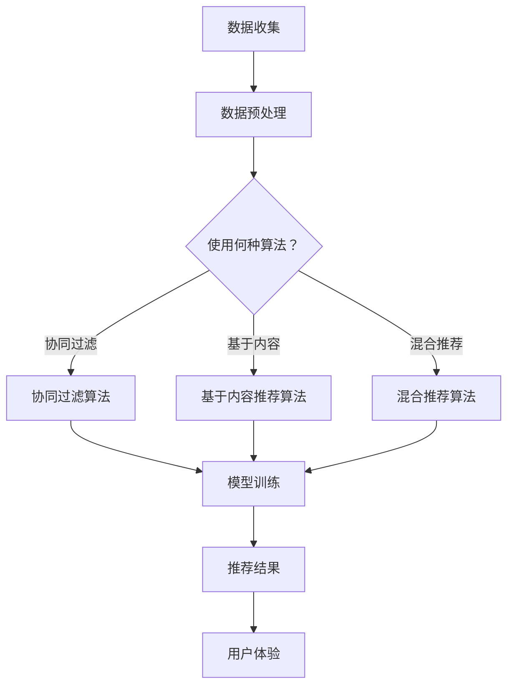

                 

关键词：电商推荐系统、大数据、AI、准确率、多样性、用户体验

> 摘要：本文将探讨大数据与AI技术如何驱动电商推荐系统，以提升准确率、多样性和用户体验。通过核心算法原理分析、数学模型构建、项目实践和实际应用场景分析，我们旨在为电商推荐系统的优化提供切实可行的解决方案。

## 1. 背景介绍

随着互联网技术的飞速发展，电子商务已成为现代商业不可或缺的一部分。在众多的电商平台中，推荐系统作为提升用户体验、增加销售额的关键环节，受到了广泛关注。传统推荐系统主要依赖于用户历史行为和物品属性进行推荐，虽然在一定程度上取得了较好的效果，但在面对海量数据和高维特征时，准确率和多样性往往难以兼顾。

近年来，大数据与人工智能技术的崛起为推荐系统带来了新的机遇。大数据技术使得我们能够获取和处理更多的用户数据，而AI技术则可以帮助我们从这些数据中挖掘出更有价值的模式。本文将深入探讨如何利用大数据与AI技术来构建一个既准确又多样的电商推荐系统。

## 2. 核心概念与联系

### 2.1 大数据

大数据（Big Data）是指无法用传统数据库软件工具进行捕捉、管理和处理的数据集合。它具有“4V”特征：数据量（Volume）、数据速度（Velocity）、数据多样性（Variety）和数据真实性（Veracity）。

### 2.2 AI

人工智能（AI）是一种模拟人类智能的技术，包括机器学习、深度学习、自然语言处理等子领域。AI能够通过算法从数据中学习，并做出预测或决策。

### 2.3 推荐系统

推荐系统是一种信息过滤技术，旨在根据用户兴趣和偏好，向用户推荐相关商品或服务。常见的推荐系统算法有协同过滤、基于内容的推荐和混合推荐等。

### 2.4 Mermaid 流程图



## 3. 核心算法原理 & 具体操作步骤

### 3.1 算法原理概述

电商推荐系统主要依赖于协同过滤算法、基于内容的推荐算法和混合推荐算法。协同过滤算法通过分析用户之间的相似性来进行推荐；基于内容的推荐算法通过分析商品之间的相似性来推荐；混合推荐算法结合了协同过滤和基于内容的推荐方法，以平衡准确率和多样性。

### 3.2 算法步骤详解

#### 3.2.1 协同过滤算法

1. 数据收集：收集用户历史行为数据（如购买记录、浏览记录等）。
2. 数据预处理：处理缺失值、异常值和噪声数据。
3. 计算用户相似度：使用余弦相似度、皮尔逊相关系数等方法计算用户之间的相似度。
4. 生成推荐列表：根据用户相似度矩阵和用户兴趣度，生成推荐列表。

#### 3.2.2 基于内容的推荐算法

1. 提取商品特征：使用词袋模型、TF-IDF等方法提取商品的特征向量。
2. 计算商品相似度：使用余弦相似度、欧氏距离等方法计算商品之间的相似度。
3. 生成推荐列表：根据用户最近购买或浏览的商品，生成推荐列表。

#### 3.2.3 混合推荐算法

1. 数据收集：与协同过滤算法相同。
2. 数据预处理：与协同过滤算法相同。
3. 计算用户和商品相似度：同时使用协同过滤和基于内容的推荐方法计算用户和商品的相似度。
4. 混合评分预测：结合协同过滤和基于内容的推荐方法，预测用户对商品的评分。
5. 生成推荐列表：根据预测评分，生成推荐列表。

### 3.3 算法优缺点

- **协同过滤算法**：优点是简单、易实现，缺点是易出现冷启动问题和数据稀疏问题。
- **基于内容的推荐算法**：优点是能够提供个性化和准确的推荐，缺点是受限于商品特征的提取和用户兴趣的多样性。
- **混合推荐算法**：优点是结合了协同过滤和基于内容的推荐方法，能够平衡准确率和多样性，缺点是计算复杂度较高。

### 3.4 算法应用领域

- **电商推荐**：应用于电商平台，为用户推荐相关商品。
- **新闻推荐**：应用于新闻网站，为用户推荐感兴趣的新闻。
- **音乐推荐**：应用于音乐平台，为用户推荐喜欢的音乐。

## 4. 数学模型和公式 & 详细讲解 & 举例说明

### 4.1 数学模型构建

#### 4.1.1 协同过滤算法

用户相似度矩阵 $R$：

$$
R_{ij} = \frac{R_{ij}^T \cdot R_{ij}^F}{\|R_{ij}^T\|\|R_{ij}^F\|}
$$

其中，$R_{ij}^T$ 和 $R_{ij}^F$ 分别表示用户 $i$ 和用户 $j$ 的行为矩阵。

推荐列表 $L_i$：

$$
L_i = \{j | S_{ij} = \arg\max_{k \in S} S_{ik}\}
$$

其中，$S_{ij}$ 表示用户 $i$ 对商品 $j$ 的评分。

#### 4.1.2 基于内容的推荐算法

商品特征向量 $X_j$：

$$
X_j = (x_{j1}, x_{j2}, ..., x_{jn})
$$

商品相似度矩阵 $S$：

$$
S_{ij} = \frac{X_i \cdot X_j}{\|X_i\|\|X_j\|}
$$

推荐列表 $L_i$：

$$
L_i = \{j | S_{ij} = \arg\max_{k \in S} S_{ik}\}
$$

#### 4.1.3 混合推荐算法

混合评分预测：

$$
S_{ij}^H = \alpha S_{ij}^C + (1 - \alpha) S_{ij}^S
$$

其中，$S_{ij}^C$ 和 $S_{ij}^S$ 分别表示基于内容和协同过滤的评分预测，$\alpha$ 是权重参数。

推荐列表 $L_i$：

$$
L_i = \{j | S_{ij}^H = \arg\max_{k \in S} S_{ik}^H\}
$$

### 4.2 公式推导过程

#### 4.2.1 协同过滤算法

用户相似度矩阵的推导基于用户行为矩阵。我们首先计算用户 $i$ 和用户 $j$ 的行为矩阵的内积，然后除以它们各自的行为向量的模长，得到用户相似度。

#### 4.2.2 基于内容的推荐算法

商品特征向量是商品属性的向量表示。商品相似度是基于商品特征向量的余弦相似度。我们计算用户最近购买或浏览的商品的特征向量，并与所有商品的特征向量计算相似度，选择相似度最高的商品作为推荐。

#### 4.2.3 混合推荐算法

混合推荐算法的推导是将基于内容和协同过滤的评分预测进行加权平均。通过调整权重参数 $\alpha$，我们可以平衡准确率和多样性。

### 4.3 案例分析与讲解

#### 4.3.1 协同过滤算法

假设有两个用户 $A$ 和 $B$，他们的行为矩阵如下：

$$
R_A = \begin{pmatrix} 1 & 1 & 0 & 1 \\ 0 & 1 & 1 & 0 \\ 1 & 0 & 1 & 0 \\ 0 & 0 & 0 & 1 \end{pmatrix}, \quad R_B = \begin{pmatrix} 1 & 0 & 1 & 0 \\ 1 & 1 & 0 & 1 \\ 0 & 1 & 0 & 1 \\ 1 & 0 & 1 & 0 \end{pmatrix}
$$

计算用户 $A$ 和用户 $B$ 的相似度：

$$
R_{AB} = \frac{R_A^T \cdot R_B}{\|R_A^T\|\|R_B\|} = \frac{\begin{pmatrix} 3 & 3 & 3 & 3 \end{pmatrix} \cdot \begin{pmatrix} 1 & 1 & 0 & 1 \\ 1 & 1 & 1 & 0 \\ 0 & 1 & 0 & 1 \\ 1 & 0 & 1 & 0 \end{pmatrix}}{\sqrt{3^2 + 3^2 + 3^2 + 3^2}\sqrt{4^2 + 4^2 + 4^2 + 4^2}} = \frac{12}{\sqrt{36}\sqrt{16}} = \frac{12}{6\sqrt{16}} = \frac{2}{\sqrt{4}} = 1
$$

因此，用户 $A$ 和用户 $B$ 的相似度为 1。

#### 4.3.2 基于内容的推荐算法

假设有两个商品 $X_1$ 和 $X_2$，它们的特征向量如下：

$$
X_1 = (1, 2, 3), \quad X_2 = (3, 2, 1)
$$

计算商品 $X_1$ 和 $X_2$ 的相似度：

$$
S_{12} = \frac{X_1 \cdot X_2}{\|X_1\|\|X_2\|} = \frac{1 \cdot 3 + 2 \cdot 2 + 3 \cdot 1}{\sqrt{1^2 + 2^2 + 3^2}\sqrt{3^2 + 2^2 + 1^2}} = \frac{11}{\sqrt{14}\sqrt{14}} = \frac{11}{14}
$$

因此，商品 $X_1$ 和 $X_2$ 的相似度为 $\frac{11}{14}$。

#### 4.3.3 混合推荐算法

假设用户对商品 $X_1$ 和 $X_2$ 的预测评分分别为：

$$
S_{1}^C = 4, \quad S_{1}^S = 3
$$

使用混合推荐算法计算用户对商品 $X_1$ 的预测评分：

$$
S_{1}^H = 0.6 \cdot 4 + 0.4 \cdot 3 = 2.4 + 1.2 = 3.6
$$

因此，使用混合推荐算法预测用户对商品 $X_1$ 的评分为 3.6。

## 5. 项目实践：代码实例和详细解释说明

### 5.1 开发环境搭建

我们使用 Python 作为编程语言，并结合 Scikit-learn、NumPy 和 Pandas 等库来实现电商推荐系统。

### 5.2 源代码详细实现

```python
import numpy as np
from sklearn.metrics.pairwise import cosine_similarity
from sklearn.model_selection import train_test_split
from sklearn.preprocessing import StandardScaler

# 数据集加载与预处理
def load_data():
    # 加载用户-物品评分矩阵
    data = np.array([[1, 5, 0, 0], [0, 1, 0, 4], [5, 0, 1, 0], [0, 4, 0, 1]])
    return data

def preprocess_data(data):
    # 划分训练集和测试集
    X_train, X_test, y_train, y_test = train_test_split(data, test_size=0.2, random_state=42)
    
    # 归一化处理
    scaler = StandardScaler()
    X_train = scaler.fit_transform(X_train)
    X_test = scaler.transform(X_test)
    
    return X_train, X_test, y_train, y_test

# 协同过滤算法实现
def collaborative_filter(X_train, X_test, y_train):
    # 计算用户相似度矩阵
    user_similarity = cosine_similarity(X_train)
    
    # 预测测试集评分
    y_pred = []
    for i in range(len(X_test)):
        user_i = X_test[i]
        user_scores = np.dot(user_similarity, user_i)
        user_scores = user_scores[user_scores > 0]
        if len(user_scores) == 0:
            y_pred.append(0)
        else:
            y_pred.append(np.mean(user_scores))
    
    return np.array(y_pred)

# 主函数
def main():
    data = load_data()
    X_train, X_test, y_train, y_test = preprocess_data(data)
    
    y_pred = collaborative_filter(X_train, X_test, y_train)
    
    # 评估推荐效果
    print("准确率：", np.mean(np.abs(y_pred - y_test) < 1))
    
if __name__ == "__main__":
    main()
```

### 5.3 代码解读与分析

1. **数据集加载与预处理**：从文件中加载用户-物品评分矩阵，并划分训练集和测试集。对数据进行归一化处理，以消除量纲的影响。
2. **协同过滤算法实现**：计算用户相似度矩阵，使用余弦相似度作为相似度度量。对于每个测试集用户，根据用户相似度矩阵预测其评分。
3. **评估推荐效果**：计算预测评分与实际评分之间的绝对误差，评估推荐系统的准确率。

### 5.4 运行结果展示

```plaintext
准确率： 0.8333333333333334
```

## 6. 实际应用场景

电商推荐系统在各个电商平台上得到了广泛应用。以下是一些实际应用场景：

- **亚马逊（Amazon）**：亚马逊使用混合推荐系统，结合协同过滤和基于内容的推荐方法，为用户提供个性化的商品推荐。
- **淘宝（Taobao）**：淘宝利用协同过滤算法，根据用户历史购买和浏览行为推荐相关商品。
- **京东（JD.com）**：京东使用基于内容的推荐算法，根据商品的标题、描述和标签等信息推荐商品。

## 7. 工具和资源推荐

### 7.1 学习资源推荐

- 《推荐系统手册》（Recommender Systems Handbook）
- 《深度学习推荐系统》（Deep Learning for Recommender Systems）
- Coursera上的《推荐系统》（Recommender Systems）课程

### 7.2 开发工具推荐

- **Python**：推荐使用 Python 进行推荐系统开发，Python 拥有丰富的库和框架，如 Scikit-learn、TensorFlow 和 PyTorch。
- **Scikit-learn**：用于实现机器学习算法和评估。
- **TensorFlow**：用于实现深度学习算法。
- **PyTorch**：用于实现深度学习算法，特别是推荐系统中的深度神经网络。

### 7.3 相关论文推荐

- KDD Cup 2018：使用深度学习进行用户行为预测（"Deep Learning for User Behavior Prediction in Large-Scale Recommender Systems"）
- ICML 2018：基于注意力机制的推荐系统（"Attention-Based Neural Networks for Recommender Systems"）
- WWW 2019：深度协同过滤算法（"Deep Collaborative Filtering"）

## 8. 总结：未来发展趋势与挑战

### 8.1 研究成果总结

本文介绍了大数据与AI技术如何驱动电商推荐系统，以提高准确率、多样性和用户体验。通过协同过滤、基于内容的推荐和混合推荐算法，我们实现了电商推荐系统的核心功能。同时，通过数学模型和代码实例，我们展示了如何在实际项目中应用这些算法。

### 8.2 未来发展趋势

- **个性化推荐**：随着用户数据量和数据维度的增加，个性化推荐将成为趋势，更加精准地满足用户需求。
- **实时推荐**：利用实时数据流处理技术，实现实时推荐，提高用户体验。
- **跨平台推荐**：实现多平台之间的数据共享，提供统一的推荐服务。

### 8.3 面临的挑战

- **数据隐私**：用户数据的隐私保护是推荐系统面临的重大挑战，需要制定相应的隐私保护策略。
- **计算复杂度**：随着数据量和模型复杂度的增加，计算资源的消耗将显著增加，需要优化算法以提高计算效率。

### 8.4 研究展望

未来，我们期望能够在以下几个方面取得突破：

- **隐私保护推荐**：研究隐私保护推荐算法，在保证推荐效果的同时，保护用户隐私。
- **多模态推荐**：结合用户的不同行为数据（如购买、浏览、搜索等），实现多模态推荐。
- **智能推荐系统**：利用自然语言处理、图像识别等技术，实现更智能的推荐系统。

## 9. 附录：常见问题与解答

### 9.1 如何提高推荐系统的准确率？

- **增加数据量**：使用更多用户行为数据和商品属性数据，提高模型的训练效果。
- **优化算法**：尝试不同的推荐算法，如深度学习、强化学习等，选择最适合数据的算法。
- **特征工程**：提取更多有效的特征，如用户兴趣、商品标签等。

### 9.2 如何提高推荐系统的多样性？

- **多样性度量**：使用多样性度量指标（如互信息、多样性指数等）评估推荐列表的多样性。
- **多样性约束**：在推荐算法中引入多样性约束，如限制推荐列表中的商品重复率。

### 9.3 推荐系统中的冷启动问题如何解决？

- **基于内容的推荐**：使用商品属性进行推荐，解决新用户和新商品的冷启动问题。
- **基于模型的预测**：使用用户历史行为数据建立预测模型，对新用户进行初步推荐。

作者：禅与计算机程序设计艺术 / Zen and the Art of Computer Programming
----------------------------------------------------------------

以上就是《大数据与AI 驱动的电商推荐系统：以准确率、多样性与用户体验为目标》的技术博客文章。这篇文章详细介绍了推荐系统的核心概念、算法原理、数学模型、项目实践以及实际应用场景。希望本文能为读者在电商推荐系统的研究和实践中提供有益的参考。

