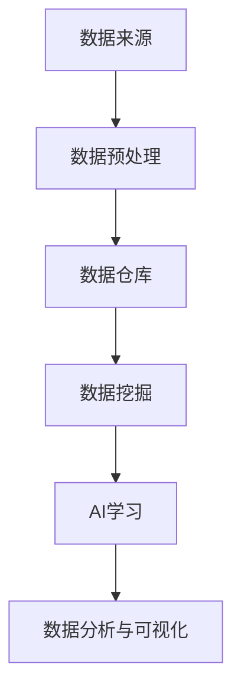

                 

关键词：大数据、人工智能、学习、算法、应用、模型、展望

> 摘要：随着大数据时代的到来，人工智能（AI）技术在各个领域得到了广泛应用。本文从大数据驱动的角度探讨了AI学习的可能性，包括核心概念、算法原理、数学模型、项目实践以及未来发展趋势和挑战。

## 1. 背景介绍

### 大数据的兴起

大数据（Big Data）是指数据量巨大、类型繁多、价值密度低的数据集合。随着互联网、物联网、社交媒体等技术的发展，人类在日常生活和工作中产生了海量的数据。这些数据中蕴含着大量的信息和知识，如何有效地挖掘和利用这些数据成为了一个重要课题。

### 人工智能的崛起

人工智能（Artificial Intelligence，简称AI）是指模拟人类智能的技术和系统。自21世纪以来，随着计算能力的提升和算法的优化，AI技术在图像识别、自然语言处理、自动驾驶等领域取得了显著的成果。AI的崛起为大数据的处理和分析提供了新的思路和方法。

### 大数据与人工智能的融合

大数据和人工智能的结合，使得AI具备了更强的学习能力和更广泛的应用场景。通过大数据的分析，AI可以更好地理解用户需求，优化产品设计，提升用户体验。同时，AI的技术也可以帮助大数据的挖掘和分析，提高数据的利用效率和价值。

## 2. 核心概念与联系

为了更好地理解大数据驱动AI学习的过程，我们需要了解以下几个核心概念：

### 数据来源

大数据的来源广泛，包括互联网日志、社交媒体、传感器数据、企业内部数据等。这些数据可以是结构化的，如数据库中的记录；也可以是非结构化的，如图像、音频、视频等。

### 数据预处理

数据预处理是大数据分析的第一步，主要包括数据清洗、数据集成、数据转换等操作。这一步骤的目的是提高数据质量，为后续的分析奠定基础。

### 数据仓库

数据仓库（Data Warehouse）是一种用于存储、管理和分析大量数据的数据管理系统。数据仓库可以将来自不同来源的数据整合到一个统一的平台上，为AI学习提供丰富的数据资源。

### 数据挖掘

数据挖掘（Data Mining）是指从大量数据中提取有价值信息的过程。数据挖掘技术可以帮助我们发现数据中的隐藏规律和模式，为AI学习提供指导。

### AI学习

AI学习是指通过算法和模型，使计算机能够自动地从数据中学习并获取知识。AI学习可以分为监督学习、无监督学习和强化学习等类型。

### 数据分析与可视化

数据分析与可视化是将数据转换为直观的图表和报告，以便更好地理解和传达数据中的信息。数据分析与可视化有助于我们更深入地了解数据的含义和应用。

### Mermaid 流程图



## 3. 核心算法原理 & 具体操作步骤

### 3.1 算法原理概述

大数据驱动的AI学习主要依赖于以下几种核心算法：

1. **机器学习算法**：通过数据训练，使计算机能够自动识别数据中的模式和规律。
2. **深度学习算法**：基于神经网络，通过多层非线性变换，对大量数据进行自动特征提取和学习。
3. **强化学习算法**：通过与环境的交互，不断调整策略，以达到最优行为。

### 3.2 算法步骤详解

1. **数据收集**：从各种来源收集数据，并进行初步清洗和预处理。
2. **数据存储**：将预处理后的数据存储到数据仓库中，以便后续分析和挖掘。
3. **数据挖掘**：利用数据挖掘技术，从数据仓库中提取有价值的信息和知识。
4. **特征工程**：根据挖掘结果，对数据进行特征提取和变换，为AI学习提供输入。
5. **模型训练**：使用机器学习、深度学习或强化学习算法，对特征数据集进行训练，构建预测模型。
6. **模型评估**：通过交叉验证、性能指标等手段，评估模型的准确性和可靠性。
7. **模型部署**：将训练好的模型部署到生产环境中，实现实际应用。

### 3.3 算法优缺点

- **机器学习算法**：优点是简单、易于实现；缺点是模型复杂度较低，对大量数据依赖较大。
- **深度学习算法**：优点是能够自动提取复杂特征，对大量数据有很强的适应性；缺点是训练过程复杂，对计算资源要求较高。
- **强化学习算法**：优点是能够通过与环境交互，不断优化策略；缺点是需要大量的样本数据，训练过程较慢。

### 3.4 算法应用领域

大数据驱动的AI学习在多个领域取得了显著成果，包括：

- **金融领域**：利用AI技术进行风险管理、信用评估、投资策略等。
- **医疗领域**：利用AI技术进行疾病诊断、药物研发、个性化治疗等。
- **交通领域**：利用AI技术进行交通流量预测、自动驾驶、智能调度等。
- **零售领域**：利用AI技术进行需求预测、商品推荐、库存管理等。

## 4. 数学模型和公式 & 详细讲解 & 举例说明

### 4.1 数学模型构建

在大数据驱动的AI学习中，常用的数学模型包括线性模型、逻辑回归模型、神经网络模型等。下面以神经网络模型为例，介绍数学模型的构建过程。

神经网络模型主要由输入层、隐藏层和输出层组成。每个层由多个神经元（节点）组成，神经元之间通过权重连接。神经元的激活函数通常采用Sigmoid函数或ReLU函数。

### 4.2 公式推导过程

神经网络的数学模型可以表示为：

\[ z_i = \sum_{j=1}^{n} w_{ij} x_j + b_i \]

其中，\( z_i \) 表示第 \( i \) 个神经元的输入，\( x_j \) 表示第 \( j \) 个神经元的输入值，\( w_{ij} \) 表示连接权重，\( b_i \) 表示偏置项。

神经元的激活函数为：

\[ a_i = \sigma(z_i) \]

其中，\( \sigma \) 表示激活函数，Sigmoid函数和ReLU函数分别为：

\[ \sigma(z) = \frac{1}{1 + e^{-z}} \]
\[ \sigma(z) = max(0, z) \]

### 4.3 案例分析与讲解

假设我们使用神经网络模型进行手写数字识别，数据集为MNIST。首先，我们需要对数据进行预处理，包括数据归一化、随机划分训练集和测试集等。然后，我们可以使用反向传播算法（Backpropagation Algorithm）对神经网络模型进行训练。

在训练过程中，我们需要计算损失函数（如均方误差MSE）的梯度，并更新网络权重和偏置项。具体过程如下：

1. **前向传播**：计算每个神经元的输入和激活值。
2. **计算损失函数**：计算预测值与真实值之间的差异。
3. **反向传播**：计算损失函数关于网络权重的梯度。
4. **权重更新**：根据梯度更新网络权重和偏置项。
5. **迭代训练**：重复前向传播、计算损失函数、反向传播和权重更新的过程，直至满足停止条件。

通过迭代训练，我们可以得到一个性能较好的神经网络模型，用于手写数字识别任务。

## 5. 项目实践：代码实例和详细解释说明

### 5.1 开发环境搭建

为了实现大数据驱动的AI学习，我们需要搭建一个适合的开发环境。以下是开发环境的搭建步骤：

1. **Python环境搭建**：安装Python和pip，用于安装相关库。
2. **Jupyter Notebook**：安装Jupyter Notebook，用于编写和运行代码。
3. **相关库安装**：安装NumPy、Pandas、Scikit-learn、TensorFlow等库，用于数据处理、机器学习模型训练等。

### 5.2 源代码详细实现

以下是一个基于TensorFlow实现手写数字识别的代码实例：

```python
import tensorflow as tf
from tensorflow import keras
import numpy as np

# 数据预处理
(x_train, y_train), (x_test, y_test) = keras.datasets.mnist.load_data()
x_train = x_train.astype("float32") / 255.0
x_test = x_test.astype("float32") / 255.0
y_train = keras.utils.to_categorical(y_train, 10)
y_test = keras.utils.to_categorical(y_test, 10)

# 构建模型
model = keras.Sequential([
    keras.layers.Flatten(input_shape=(28, 28)),
    keras.layers.Dense(128, activation="relu"),
    keras.layers.Dense(10, activation="softmax")
])

# 编译模型
model.compile(optimizer="adam",
              loss="categorical_crossentropy",
              metrics=["accuracy"])

# 训练模型
model.fit(x_train, y_train, epochs=10, batch_size=128, validation_split=0.1)

# 评估模型
test_score = model.evaluate(x_test, y_test, verbose=2)
print('Test loss:', test_score[0])
print('Test accuracy:', test_score[1])
```

### 5.3 代码解读与分析

1. **导入库和加载数据**：首先导入TensorFlow库，并加载MNIST手写数字数据集。
2. **数据预处理**：将数据集进行归一化处理，并转换为one-hot编码。
3. **构建模型**：使用Sequential模型，添加Flatten层、Dense层和Softmax层。
4. **编译模型**：指定优化器、损失函数和评估指标。
5. **训练模型**：使用fit方法进行模型训练，设置训练轮次、批量大小和验证比例。
6. **评估模型**：使用evaluate方法评估模型在测试集上的表现。

通过以上步骤，我们可以实现一个简单但有效的大数据驱动的AI学习项目。

## 6. 实际应用场景

### 金融领域

在金融领域，大数据驱动的AI学习可以应用于风险控制、信用评估、投资策略等方面。例如，通过分析用户的历史交易数据和信用记录，AI系统可以预测用户的信用风险，帮助金融机构做出更准确的信贷决策。

### 医疗领域

在医疗领域，大数据驱动的AI学习可以用于疾病诊断、药物研发、个性化治疗等方面。例如，通过分析患者的临床数据和基因组数据，AI系统可以识别疾病风险，为医生提供诊断建议和治疗方案。

### 交通领域

在交通领域，大数据驱动的AI学习可以用于交通流量预测、自动驾驶、智能调度等方面。例如，通过分析交通数据，AI系统可以预测交通流量，优化交通信号灯控制策略，提高交通效率。

### 零售领域

在零售领域，大数据驱动的AI学习可以用于需求预测、商品推荐、库存管理等方面。例如，通过分析消费者的购买行为和偏好，AI系统可以预测商品需求，优化库存水平，提高销售业绩。

## 7. 工具和资源推荐

### 7.1 学习资源推荐

- 《Python机器学习》（作者：塞巴斯蒂安·拉斯考纳克）
- 《深度学习》（作者：伊恩·古德费洛、约书亚·本吉奥、亚伦·库维尔）
- 《大数据之路：阿里巴巴大数据实践》（作者：涂子沛）

### 7.2 开发工具推荐

- TensorFlow：一款开源的深度学习框架，适用于大数据驱动的AI学习。
- Jupyter Notebook：一款交互式的计算环境，便于编写和运行代码。
- PyCharm：一款流行的Python集成开发环境（IDE），提供丰富的功能和工具。

### 7.3 相关论文推荐

- "Deep Learning for Text Classification"（作者：Daniel Cer,Nitish Shirish Keskar,Caiming Xiong）
- "Distributed Optimization for Machine Learning:pray it works!"（作者：Quoc V. Le）
- "Recurrent Neural Network Based Language Model"（作者：Yoshua Bengio,宋思宇，Patrice Simard）

## 8. 总结：未来发展趋势与挑战

### 8.1 研究成果总结

随着大数据和人工智能技术的不断发展，大数据驱动的AI学习在多个领域取得了显著成果。例如，在金融、医疗、交通和零售等领域，大数据驱动的AI学习已经为企业和个人带来了巨大的价值。

### 8.2 未来发展趋势

未来，大数据驱动的AI学习将继续深入发展，呈现以下趋势：

1. **算法优化**：随着计算能力的提升，AI算法将更加高效，能够处理更大规模的数据。
2. **多模态数据融合**：通过融合不同类型的数据（如图像、音频、文本等），AI系统将具备更全面的理解能力。
3. **个性化服务**：基于大数据的分析，AI系统将更加精准地满足用户需求，提供个性化的服务。

### 8.3 面临的挑战

大数据驱动的AI学习仍面临以下挑战：

1. **数据隐私**：在收集和使用数据时，如何保护用户隐私成为一个重要问题。
2. **数据质量**：高质量的数据是AI学习的基础，但如何保证数据的质量和准确性仍然是一个挑战。
3. **算法解释性**：目前，许多AI算法具有强大的预测能力，但其内部机制尚不透明，如何提高算法的解释性是一个重要课题。

### 8.4 研究展望

未来，大数据驱动的AI学习将继续向更广泛的应用领域拓展，推动人工智能技术的进步。同时，随着技术的不断发展，大数据驱动的AI学习将更加注重数据隐私、数据质量和算法解释性等方面的研究。

## 9. 附录：常见问题与解答

### 问题1：大数据和人工智能有何区别？

**解答**：大数据（Big Data）是指数据量巨大、类型繁多、价值密度低的数据集合。而人工智能（Artificial Intelligence，简称AI）是指模拟人类智能的技术和系统。大数据和人工智能是两个相互关联但有所不同的概念。大数据为人工智能提供了丰富的数据资源，而人工智能则通过对大数据的分析和学习，实现了智能决策和自动化操作。

### 问题2：大数据驱动的AI学习有哪些应用领域？

**解答**：大数据驱动的AI学习在多个领域取得了显著成果，包括金融、医疗、交通、零售等。例如，在金融领域，AI可以用于风险控制和信用评估；在医疗领域，AI可以用于疾病诊断和药物研发；在交通领域，AI可以用于交通流量预测和自动驾驶；在零售领域，AI可以用于需求预测和商品推荐等。

### 问题3：如何保证大数据驱动的AI学习的数据质量？

**解答**：为了保证大数据驱动的AI学习的数据质量，需要从以下几个方面进行：

1. **数据清洗**：对数据进行预处理，去除错误、重复和无关的数据。
2. **数据集成**：将来自不同来源的数据进行整合，消除数据之间的矛盾和冲突。
3. **数据校验**：对数据进行验证，确保数据的准确性和一致性。
4. **数据标注**：对数据标注正确的标签，为后续的训练和评估提供依据。

通过以上措施，可以有效提高大数据驱动的AI学习的数据质量。

### 问题4：大数据驱动的AI学习是否会替代人类？

**解答**：大数据驱动的AI学习不会完全替代人类，而是作为人类智能的补充和延伸。AI系统在处理大量数据和复杂任务方面具有优势，但它们缺乏人类的创造力、情感和道德判断能力。因此，AI将在特定领域发挥重要作用，但人类仍然在决策、创新和道德等方面具有不可替代的价值。人类和AI将共同推动社会的发展。

