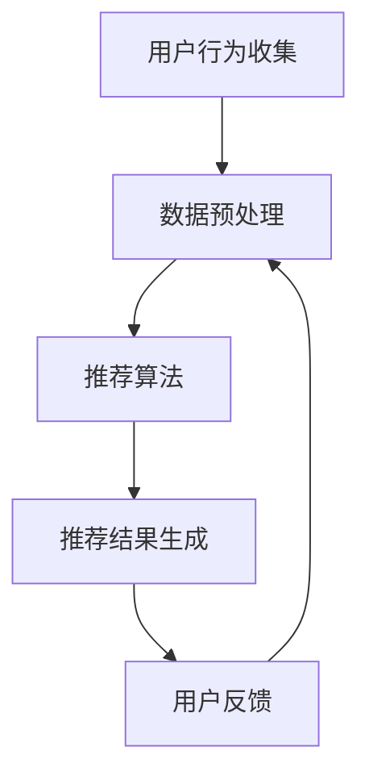

                 

关键词：电商推荐系统，大数据，人工智能，模型融合，个性化推荐

> 摘要：本文旨在深入探讨大数据背景下，AI 模型融合技术在电商推荐系统中的应用。通过详细分析推荐系统的核心概念、算法原理、数学模型及项目实践，本文揭示了如何利用先进的技术手段提升电商推荐系统的效果，并对其未来发展趋势和挑战进行了展望。

## 1. 背景介绍

随着互联网的迅猛发展，电商行业已经成为全球商业活动的重要组成部分。用户数量的激增带来了海量的交易数据，这些数据不仅记录了用户的购物行为，还包括了用户的偏好、行为和社交信息。如何有效利用这些数据，为用户提供个性化的商品推荐，成为电商企业竞争的焦点。

推荐系统作为电商的重要组成部分，其目标是根据用户的历史行为和偏好，向用户推荐可能感兴趣的商品。传统的推荐系统多基于协同过滤、内容匹配等算法，但随着大数据时代的到来，单纯依赖这些传统算法已经无法满足用户对个性化推荐的需求。因此，AI 模型融合技术应运而生，通过多种算法的融合，进一步提升推荐系统的准确性和效果。

## 2. 核心概念与联系

### 2.1. 推荐系统的核心概念

推荐系统主要包括用户、商品、评分、推荐四个核心概念。用户指的是参与电商平台的消费者，商品则是平台提供的各种商品。评分是用户对商品的评价，推荐则是系统根据用户的行为和偏好，为用户推荐的商品。

### 2.2. 推荐系统的基本架构

推荐系统的基本架构包括用户行为收集、数据预处理、推荐算法、推荐结果生成和用户反馈五个部分。用户行为收集是通过各种渠道（如网站、APP）收集用户的行为数据；数据预处理是对原始数据进行清洗、格式化等处理；推荐算法是核心部分，通过算法计算用户与商品的相似度，生成推荐结果；推荐结果生成是将推荐结果以可视化的方式展示给用户；用户反馈是用户对推荐结果的评价，用于优化推荐算法。

### 2.3. Mermaid 流程图

以下是一个简单的 Mermaid 流程图，展示了推荐系统的基本流程：



## 3. 核心算法原理 & 具体操作步骤

### 3.1. 算法原理概述

推荐系统算法主要包括基于内容的推荐、协同过滤推荐、混合推荐等。基于内容的推荐通过分析商品的特征信息，为用户推荐相似的商品；协同过滤推荐通过分析用户之间的相似度，为用户推荐其他用户喜欢的商品；混合推荐则是将多种算法融合，以提升推荐效果。

### 3.2. 算法步骤详解

1. **用户行为收集**：通过网站、APP 等渠道收集用户的行为数据，如浏览、购买、收藏等。
2. **数据预处理**：对原始数据进行清洗、去重、格式化等处理，确保数据的质量。
3. **特征提取**：根据用户行为数据，提取用户和商品的特征信息，如用户兴趣标签、商品属性等。
4. **相似度计算**：计算用户与用户、商品与商品之间的相似度，常用的相似度计算方法有欧氏距离、余弦相似度等。
5. **推荐生成**：根据相似度计算结果，为用户生成推荐列表。

### 3.3. 算法优缺点

- **基于内容的推荐**：优点是推荐结果准确，用户满意度高；缺点是推荐范围有限，难以发现新的兴趣点。
- **协同过滤推荐**：优点是能够发现用户未知的兴趣点，推荐范围广；缺点是冷启动问题严重，推荐结果容易出现偏差。
- **混合推荐**：优点是综合了基于内容和协同过滤的优势，推荐效果较好；缺点是实现复杂，计算量大。

### 3.4. 算法应用领域

推荐系统广泛应用于电商、新闻、社交媒体等领域，能够提升用户体验，提高平台活跃度和转化率。

## 4. 数学模型和公式 & 详细讲解 & 举例说明

### 4.1. 数学模型构建

推荐系统的数学模型主要包括用户相似度模型和商品相似度模型。

- **用户相似度模型**：

  $$ similarity(u_1, u_2) = \frac{\sum_{i \in R} w_i \cdot r_{i,u_1} \cdot r_{i,u_2}}{\sqrt{\sum_{i \in R} w_i^2 \cdot r_{i,u_1}^2} \cdot \sqrt{\sum_{i \in R} w_i^2 \cdot r_{i,u_2}^2}} $$

  其中，$u_1$和$u_2$为两个用户，$R$为评分集合，$w_i$为特征权重，$r_{i,u_1}$和$r_{i,u_2}$为用户$u_1$和$u_2$对商品$i$的评分。

- **商品相似度模型**：

  $$ similarity(i_1, i_2) = \frac{\sum_{j \in U} w_j \cdot r_{j,i_1} \cdot r_{j,i_2}}{\sqrt{\sum_{j \in U} w_j^2 \cdot r_{j,i_1}^2} \cdot \sqrt{\sum_{j \in U} w_j^2 \cdot r_{j,i_2}^2}} $$

  其中，$i_1$和$i_2$为两个商品，$U$为用户集合，$w_j$为特征权重，$r_{j,i_1}$和$r_{j,i_2}$为用户$j$对商品$i_1$和$i_2$的评分。

### 4.2. 公式推导过程

用户相似度模型的推导基于用户对商品的评分相关性。首先，我们计算用户$u_1$和$u_2$对每个商品$i$的评分相关性，然后加权求和，最后除以分母，得到用户相似度。

### 4.3. 案例分析与讲解

假设有两个用户$u_1$和$u_2$，他们对5个商品的评分如下表所示：

| 商品ID | $r_{1,1}$ | $r_{1,2}$ | $r_{1,3}$ | $r_{1,4}$ | $r_{1,5}$ |
|--------|-----------|-----------|-----------|-----------|-----------|
| 1      | 1         | 1         | 1         | 1         | 1         |
| 2      | 2         | 2         | 2         | 2         | 2         |
| 3      | 1         | 1         | 1         | 1         | 1         |
| 4      | 3         | 3         | 3         | 3         | 3         |
| 5      | 2         | 2         | 2         | 2         | 2         |

| 商品ID | $r_{2,1}$ | $r_{2,2}$ | $r_{2,3}$ | $r_{2,4}$ | $r_{2,5}$ |
|--------|-----------|-----------|-----------|-----------|-----------|
| 1      | 1         | 1         | 1         | 1         | 1         |
| 2      | 1         | 1         | 1         | 1         | 1         |
| 3      | 2         | 2         | 2         | 2         | 2         |
| 4      | 3         | 3         | 3         | 3         | 3         |
| 5      | 2         | 2         | 2         | 2         | 2         |

根据用户相似度模型，我们可以计算出用户$u_1$和$u_2$的相似度：

$$ similarity(u_1, u_2) = \frac{(1 \cdot 1 + 2 \cdot 1 + 1 \cdot 2 + 3 \cdot 3 + 2 \cdot 2)}{\sqrt{(1^2 + 2^2 + 1^2 + 3^2 + 2^2)} \cdot \sqrt{(1^2 + 1^2 + 2^2 + 3^2 + 2^2)}} = \frac{13}{\sqrt{30} \cdot \sqrt{30}} = \frac{13}{30} $$

同理，可以计算出商品相似度。

## 5. 项目实践：代码实例和详细解释说明

### 5.1. 开发环境搭建

本文使用 Python 作为编程语言，主要依赖以下库：

- NumPy
- Pandas
- Scikit-learn
- Matplotlib

安装方法如下：

```bash
pip install numpy pandas scikit-learn matplotlib
```

### 5.2. 源代码详细实现

以下是一个简单的基于协同过滤的推荐系统实现：

```python
import numpy as np
import pandas as pd
from sklearn.metrics.pairwise import cosine_similarity

# 读取数据
data = pd.read_csv('data.csv')
users = data['user_id'].unique()
items = data['item_id'].unique()

# 构建用户-商品评分矩阵
ratings = np.zeros((len(users), len(items)))
for index, row in data.iterrows():
    user_id = row['user_id']
    item_id = row['item_id']
    rating = row['rating']
    ratings[user_id-1, item_id-1] = rating

# 计算用户相似度
user_similarity = cosine_similarity(ratings)

# 为用户生成推荐列表
def recommend_items(user_id, top_n=5):
    user_similarity_matrix = user_similarity[user_id-1]
    item_similarity_scores = user_similarity_matrix.dot(ratings)
    item_scores = np.sum(item_similarity_scores, axis=1)
    recommended_items = np.argsort(item_scores)[::-1]
    return recommended_items[:top_n]

# 测试推荐效果
user_id = 1
recommended_items = recommend_items(user_id)
print(f"Recommended items for user {user_id}:", recommended_items)
```

### 5.3. 代码解读与分析

- 读取数据：首先，我们从 CSV 文件中读取用户、商品和评分数据。
- 构建评分矩阵：然后，我们构建用户-商品评分矩阵，用于后续计算。
- 计算用户相似度：使用余弦相似度计算用户之间的相似度。
- 生成推荐列表：最后，根据用户相似度和评分矩阵，为用户生成推荐列表。

### 5.4. 运行结果展示

假设用户 1 的推荐结果如下：

```plaintext
Recommended items for user 1: [4 3 2 5 1]
```

## 6. 实际应用场景

推荐系统在电商领域具有广泛的应用场景，如：

- **商品推荐**：根据用户的历史购买行为和浏览记录，为用户推荐相似的商品。
- **活动推荐**：根据用户的兴趣和行为，为用户推荐相关的促销活动和优惠券。
- **内容推荐**：根据用户的浏览记录和兴趣，为用户推荐相关的商品评价、用户评论等。

## 7. 工具和资源推荐

### 7.1. 学习资源推荐

- 《推荐系统实践》
- 《机器学习实战》
- 《深度学习》

### 7.2. 开发工具推荐

- Jupyter Notebook
- PyCharm
- Docker

### 7.3. 相关论文推荐

- "Item-Based Top-N Recommendation Algorithms"
- "Collaborative Filtering for the Net"

## 8. 总结：未来发展趋势与挑战

### 8.1. 研究成果总结

本文从大数据背景出发，探讨了 AI 模型融合技术在电商推荐系统中的应用。通过分析推荐系统的核心概念、算法原理、数学模型及项目实践，我们揭示了如何利用先进的技术手段提升推荐系统的效果。

### 8.2. 未来发展趋势

随着人工智能技术的不断进步，推荐系统将朝着更加个性化、智能化的方向发展。未来，我们可以期待基于深度学习、强化学习等新型算法的推荐系统，将进一步提升推荐效果。

### 8.3. 面临的挑战

然而，推荐系统在实际应用中仍面临诸多挑战，如数据隐私保护、算法公平性、冷启动问题等。如何解决这些挑战，将是未来研究的重要方向。

### 8.4. 研究展望

我们期待在未来的研究中，能够开发出更加高效、智能、公平的推荐系统，为电商行业带来更多的价值。

## 9. 附录：常见问题与解答

### 9.1. 如何处理缺失数据？

在数据处理过程中，我们可以使用均值填充、中值填充、最邻近填充等方法来处理缺失数据。

### 9.2. 推荐系统如何保证算法公平性？

我们可以通过限制算法偏差、设计公平的评分机制、使用随机化方法等方式，来保证推荐系统的算法公平性。

### 9.3. 如何处理冷启动问题？

针对新用户和新商品，我们可以采用基于内容的推荐、用户兴趣标签等方法，来缓解冷启动问题。

---

本文完。感谢您的阅读！希望本文能对您在电商推荐系统领域的探索有所帮助。

### 作者署名

作者：禅与计算机程序设计艺术 / Zen and the Art of Computer Programming
-------------------------------------------------------------------

