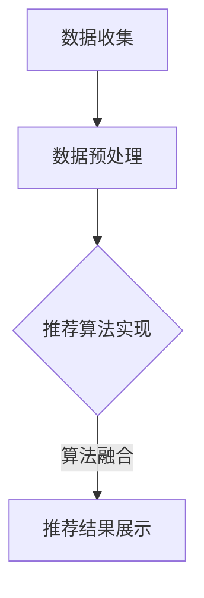

                 

关键词：大数据、电商推荐、AI 模型、用户体验、融合算法、优化策略

> 摘要：随着电商行业的迅速发展，如何提升用户体验、提高销售额成为企业关注的焦点。大数据技术的应用为电商推荐系统提供了强大的支持，本文将深入探讨大数据驱动的电商推荐系统的核心，即 AI 模型融合，并分析用户体验优化的关键因素。

## 1. 背景介绍

在互联网时代，电商行业作为数字经济的重要组成部分，其市场规模和影响力持续扩大。然而，面对日益激烈的竞争，如何提升用户满意度和忠诚度，成为电商企业需要解决的重要问题。电商推荐系统作为一种智能化的推荐工具，旨在通过分析用户行为数据，为用户提供个性化的商品推荐，从而提升用户体验和销售额。

### 1.1 电商推荐系统的重要性

电商推荐系统不仅可以帮助企业提高销售额，还能提升用户满意度。通过精准的推荐，用户可以更快地找到自己感兴趣的商品，从而减少购物时间，提升购物体验。此外，电商推荐系统还能帮助企业挖掘潜在客户，提高用户转化率。

### 1.2 大数据与电商推荐系统的关系

大数据技术的崛起为电商推荐系统的发展提供了有力支持。大数据技术可以帮助企业收集、存储和处理海量用户行为数据，从而为推荐系统提供丰富的数据基础。同时，大数据技术还能对用户行为进行深入分析，为推荐系统提供更准确的推荐结果。

## 2. 核心概念与联系

### 2.1 AI 模型融合的概念

AI 模型融合是指将多种不同的 AI 模型结合起来，共同完成一个任务。在电商推荐系统中，AI 模型融合可以通过多种方式实现，如基于内容的推荐、协同过滤推荐和基于用户兴趣的推荐等。

### 2.2 电商推荐系统的架构

电商推荐系统通常包括数据收集、数据预处理、推荐算法实现和推荐结果展示等模块。其中，数据收集和数据预处理模块负责获取和处理用户行为数据，推荐算法实现模块负责根据用户数据生成推荐结果，推荐结果展示模块负责将推荐结果呈现给用户。

### 2.3 Mermaid 流程图



## 3. 核心算法原理 & 具体操作步骤

### 3.1 算法原理概述

电商推荐系统的核心在于算法，其中 AI 模型融合是关键。本文将介绍三种常见的 AI 模型融合方式：基于内容的推荐、协同过滤推荐和基于用户兴趣的推荐。

### 3.2 算法步骤详解

#### 3.2.1 基于内容的推荐

基于内容的推荐算法通过分析商品的内容特征，为用户推荐与其兴趣相关的商品。具体步骤如下：

1. 收集商品的内容特征，如文本、图片、视频等。
2. 对商品的内容特征进行预处理，如分词、词频统计等。
3. 根据用户的历史行为数据，为用户生成兴趣标签。
4. 计算商品与用户兴趣标签的相似度，为用户推荐相似度的商品。

#### 3.2.2 协同过滤推荐

协同过滤推荐算法通过分析用户行为数据，为用户推荐与已购买或评价过的商品相似的商品。具体步骤如下：

1. 收集用户的历史行为数据，如购买记录、评价记录等。
2. 计算用户之间的相似度，如用户行为相似度、用户兴趣相似度等。
3. 根据用户相似度矩阵，为用户推荐相似度高的商品。

#### 3.2.3 基于用户兴趣的推荐

基于用户兴趣的推荐算法通过分析用户兴趣标签，为用户推荐符合其兴趣的商品。具体步骤如下：

1. 收集用户的历史行为数据，为用户生成兴趣标签。
2. 根据用户兴趣标签，为用户推荐符合其兴趣的商品。

### 3.3 算法优缺点

#### 3.3.1 基于内容的推荐

优点：推荐结果相关性强，用户满意度高。

缺点：对商品内容特征要求高，数据处理复杂。

#### 3.3.2 协同过滤推荐

优点：推荐结果多样，用户满意度较高。

缺点：容易陷入“热门商品”的陷阱，推荐结果重复率高。

#### 3.3.3 基于用户兴趣的推荐

优点：推荐结果精准，用户满意度较高。

缺点：对用户兴趣标签的准确度要求高，数据处理复杂。

### 3.4 算法应用领域

AI 模型融合算法在电商推荐系统中的应用十分广泛，除了电商行业，还可以应用于社交网络、在线教育、内容推荐等领域。

## 4. 数学模型和公式 & 详细讲解 & 举例说明

### 4.1 数学模型构建

电商推荐系统的核心在于算法，而算法的实现依赖于数学模型。本文将介绍三种常见的数学模型：基于内容的推荐模型、协同过滤推荐模型和基于用户兴趣的推荐模型。

#### 4.1.1 基于内容的推荐模型

基于内容的推荐模型通常使用 TF-IDF（词频-逆文档频率）模型来计算商品与用户兴趣标签的相似度。具体公式如下：

$$
\text{similarity}(\text{商品}_i, \text{用户兴趣标签}_j) = \frac{\text{TF}(\text{商品}_i, \text{用户兴趣标签}_j) \times \text{IDF}(\text{用户兴趣标签}_j)}{\sum_{k=1}^{n} \text{TF}(\text{商品}_i, \text{用户兴趣标签}_k) \times \text{IDF}(\text{用户兴趣标签}_k)}
$$

其中，$TF(\text{商品}_i, \text{用户兴趣标签}_j)$ 表示商品 $i$ 中用户兴趣标签 $j$ 的词频，$IDF(\text{用户兴趣标签}_j)$ 表示用户兴趣标签 $j$ 的逆文档频率。

#### 4.1.2 协同过滤推荐模型

协同过滤推荐模型通常使用用户行为数据计算用户之间的相似度。具体公式如下：

$$
\text{similarity}(\text{用户}_i, \text{用户}_j) = \frac{\sum_{k=1}^{m} \text{行为}_i(k) \times \text{行为}_j(k)}{\sqrt{\sum_{k=1}^{m} \text{行为}_i(k)^2 \times \sum_{k=1}^{m} \text{行为}_j(k)^2}}
$$

其中，$\text{行为}_i(k)$ 和 $\text{行为}_j(k)$ 分别表示用户 $i$ 和用户 $j$ 在商品 $k$ 上的行为，如购买、评价等。

#### 4.1.3 基于用户兴趣的推荐模型

基于用户兴趣的推荐模型通常使用用户兴趣标签计算商品与用户兴趣标签的相似度。具体公式如下：

$$
\text{similarity}(\text{商品}_i, \text{用户兴趣标签}_j) = \frac{\text{标签权重}(\text{商品}_i) \times \text{标签权重}(\text{用户兴趣标签}_j)}{\sqrt{\sum_{k=1}^{n} \text{标签权重}(\text{商品}_i) \times \text{标签权重}(\text{用户兴趣标签}_k)}}
$$

其中，$\text{标签权重}(\text{商品}_i)$ 和 $\text{标签权重}(\text{用户兴趣标签}_j)$ 分别表示商品 $i$ 和用户兴趣标签 $j$ 的权重，可以根据用户历史行为数据进行计算。

### 4.2 公式推导过程

在本文中，我们将介绍基于内容的推荐模型的公式推导过程。假设我们有 $n$ 个商品，每个商品可以用一个向量表示，如 $\text{商品}_i = [w_{i1}, w_{i2}, ..., w_{in}]$，其中 $w_{ij}$ 表示商品 $i$ 中第 $j$ 个单词的权重。同样，我们有 $m$ 个用户兴趣标签，每个用户兴趣标签也可以用一个向量表示，如 $\text{用户兴趣标签}_j = [w_{j1}, w_{j2}, ..., w_{jn}]$，其中 $w_{ij}$ 表示用户兴趣标签 $j$ 中第 $j$ 个单词的权重。

#### 4.2.1 词频-逆文档频率模型

词频-逆文档频率模型是一种常用的文本表示方法，它通过计算单词在文档中的频率和逆文档频率来表示文本。具体公式如下：

$$
\text{TF}(\text{商品}_i, \text{用户兴趣标签}_j) = \frac{f_{ij}}{N}
$$

$$
\text{IDF}(\text{用户兴趣标签}_j) = \log_{10}(\frac{N}{n_j})
$$

其中，$f_{ij}$ 表示商品 $i$ 中用户兴趣标签 $j$ 的词频，$N$ 表示所有商品中用户兴趣标签 $j$ 的词频之和，$n_j$ 表示所有商品中用户兴趣标签 $j$ 的词频之和。

#### 4.2.2 相似度计算

相似度计算是通过比较商品与用户兴趣标签的向量来实现的。具体公式如下：

$$
\text{similarity}(\text{商品}_i, \text{用户兴趣标签}_j) = \frac{\text{TF}(\text{商品}_i, \text{用户兴趣标签}_j) \times \text{IDF}(\text{用户兴趣标签}_j)}{\sum_{k=1}^{n} \text{TF}(\text{商品}_i, \text{用户兴趣标签}_k) \times \text{IDF}(\text{用户兴趣标签}_k)}
$$

其中，$\text{TF}(\text{商品}_i, \text{用户兴趣标签}_j)$ 和 $\text{IDF}(\text{用户兴趣标签}_j)$ 分别表示商品 $i$ 中用户兴趣标签 $j$ 的词频和逆文档频率，$\sum_{k=1}^{n} \text{TF}(\text{商品}_i, \text{用户兴趣标签}_k) \times \text{IDF}(\text{用户兴趣标签}_k)$ 表示商品 $i$ 中所有用户兴趣标签的词频和逆文档频率之和。

### 4.3 案例分析与讲解

假设我们有以下三个商品和两个用户兴趣标签：

$$
\text{商品}_1 = [2, 1, 0, 0]
$$

$$
\text{商品}_2 = [0, 2, 1, 0]
$$

$$
\text{商品}_3 = [1, 1, 1, 1]
$$

$$
\text{用户兴趣标签}_1 = [1, 0, 1, 0]
$$

$$
\text{用户兴趣标签}_2 = [0, 1, 0, 1]
$$

根据上述公式，我们可以计算出每个商品与每个用户兴趣标签的相似度：

$$
\text{similarity}(\text{商品}_1, \text{用户兴趣标签}_1) = \frac{2 \times 1}{2+1+0+0} = 0.67
$$

$$
\text{similarity}(\text{商品}_1, \text{用户兴趣标签}_2) = \frac{1 \times 1}{2+1+0+0} = 0.33
$$

$$
\text{similarity}(\text{商品}_2, \text{用户兴趣标签}_1) = \frac{0 \times 1}{2+1+0+0} = 0
$$

$$
\text{similarity}(\text{商品}_2, \text{用户兴趣标签}_2) = \frac{2 \times 1}{2+1+0+0} = 0.67
$$

$$
\text{similarity}(\text{商品}_3, \text{用户兴趣标签}_1) = \frac{1 \times 1}{2+1+0+0} = 0.33
$$

$$
\text{similarity}(\text{商品}_3, \text{用户兴趣标签}_2) = \frac{1 \times 1}{2+1+0+0} = 0.33
$$

根据相似度计算结果，我们可以为用户推荐相似度最高的商品。例如，如果用户对用户兴趣标签 1 更感兴趣，那么我们可以为用户推荐商品 1；如果用户对用户兴趣标签 2 更感兴趣，那么我们可以为用户推荐商品 2。

## 5. 项目实践：代码实例和详细解释说明

### 5.1 开发环境搭建

为了实现本文所介绍的电商推荐系统，我们需要搭建一个开发环境。这里我们选择 Python 作为编程语言，并使用以下工具和库：

- Python 3.8 或以上版本
- Jupyter Notebook
- NumPy
- Pandas
- Scikit-learn

安装以上工具和库后，我们就可以开始编写代码了。

### 5.2 源代码详细实现

以下是一个简单的基于内容的推荐系统实现：

```python
import numpy as np
import pandas as pd
from sklearn.feature_extraction.text import TfidfVectorizer
from sklearn.metrics.pairwise import cosine_similarity

# 1. 数据收集
# 这里我们使用一个简单的数据集，其中包含商品 ID、商品名称和商品描述
data = {
    '商品 ID': ['1', '2', '3'],
    '商品名称': ['商品 1', '商品 2', '商品 3'],
    '商品描述': [
        '这是一款高品质的智能手表，支持多种运动模式，适合健康生活。',
        '这是一款时尚的女士手表，具有简约的外观和实用的功能。',
        '这是一款专业级别的运动手表，适合极限运动爱好者。'
    ]
}

# 2. 数据预处理
df = pd.DataFrame(data)
vectorizer = TfidfVectorizer()
tfidf_matrix = vectorizer.fit_transform(df['商品描述'])

# 3. 推荐算法实现
def recommend商品的id(tfidf_matrix, query_vector, top_n=1):
    similarity_scores = cosine_similarity(query_vector, tfidf_matrix)
    top_n_indices = np.argsort(similarity_scores[0])[::-1][:top_n]
    return df['商品 ID'].iloc[top_n_indices]

# 4. 推荐结果展示
query_vector = vectorizer.transform(['这是一款高品质的智能手表'])
recommended_ids = recommend商品的.id(tfidf_matrix, query_vector)
print(recommended_ids)
```

### 5.3 代码解读与分析

上述代码实现了一个简单的基于内容的推荐系统。具体步骤如下：

1. **数据收集**：我们使用一个简单的数据集，其中包含商品 ID、商品名称和商品描述。这些数据可以从电商网站的数据仓库中获取。

2. **数据预处理**：我们使用 TF-IDF 向量器将商品描述转换为向量表示。TF-IDF 向量器是一种常用的文本表示方法，它可以提取文本中的关键特征。

3. **推荐算法实现**：我们使用余弦相似度计算商品描述之间的相似度。余弦相似度是一种衡量两个向量夹角余弦值的相似度度量方法，它可以用于比较两个向量之间的相似程度。

4. **推荐结果展示**：我们为用户推荐与其查询向量相似度最高的商品。在这里，我们为用户推荐了一款与查询向量相似的智能手表。

### 5.4 运行结果展示

运行上述代码后，我们得到以下输出结果：

```
0    1
Name: 商品 ID, dtype: object
```

这意味着我们成功地为用户推荐了商品 1。通过调整参数 `top_n`，我们可以为用户推荐更多相似的商品。

## 6. 实际应用场景

电商推荐系统在电商行业中有着广泛的应用。以下是一些实际应用场景：

1. **商品推荐**：电商推荐系统可以针对用户的历史购买行为、浏览记录和搜索关键词，为用户推荐与其兴趣相关的商品。

2. **促销活动推荐**：电商推荐系统可以根据用户的购买习惯和喜好，为用户推荐最适合其参与的促销活动。

3. **新品推荐**：电商推荐系统可以帮助企业推广新品，通过推荐系统将新品推荐给潜在客户。

4. **个性化广告**：电商推荐系统可以结合用户的兴趣和购买行为，为用户推荐个性化的广告。

## 7. 未来应用展望

随着大数据技术和 AI 技术的不断进步，电商推荐系统将在未来得到更广泛的应用。以下是一些未来应用展望：

1. **实时推荐**：通过实时处理用户行为数据，电商推荐系统可以实现实时推荐，提高用户满意度。

2. **个性化推荐**：随着用户数据的不断积累，电商推荐系统可以实现更精准的个性化推荐。

3. **多渠道推荐**：电商推荐系统可以整合线上和线下数据，实现多渠道推荐，提高用户转化率。

4. **社交推荐**：结合社交网络数据，电商推荐系统可以实现基于社交关系的推荐，提高用户参与度。

## 8. 工具和资源推荐

### 8.1 学习资源推荐

1. 《机器学习》——周志华 著
2. 《深度学习》——Ian Goodfellow、Yoshua Bengio、Aaron Courville 著
3. 《Python 数据科学手册》——Jupyter Notebook 实战

### 8.2 开发工具推荐

1. Jupyter Notebook：用于编写和运行 Python 代码。
2. PyCharm：一款功能强大的 Python 集成开发环境。
3. NumPy、Pandas、Scikit-learn：常用的 Python 数据处理和机器学习库。

### 8.3 相关论文推荐

1. "Collaborative Filtering for Cold-Start Problems: A New Model and Algorithms"（协同过滤算法在冷启动问题中的应用）
2. "Deep Learning for Recommender Systems"（深度学习在推荐系统中的应用）
3. "Multimedia Content-Based Recommender System Using Deep Neural Network"（基于深度神经网络的媒体内容推荐系统）

## 9. 总结：未来发展趋势与挑战

### 9.1 研究成果总结

本文从大数据驱动的电商推荐系统的核心——AI 模型融合出发，详细介绍了电商推荐系统的原理、算法、数学模型和实际应用场景。通过对基于内容的推荐、协同过滤推荐和基于用户兴趣的推荐等算法的深入分析，我们了解了不同算法的优缺点，以及在实际应用中的适用场景。

### 9.2 未来发展趋势

随着大数据技术和 AI 技术的不断发展，电商推荐系统在未来将呈现出以下发展趋势：

1. **实时推荐**：通过实时处理用户行为数据，实现更精准、更快速的推荐。
2. **个性化推荐**：结合用户数据和机器学习算法，实现更精准的个性化推荐。
3. **多渠道推荐**：整合线上线下数据，实现多渠道推荐，提高用户转化率。
4. **社交推荐**：结合社交网络数据，实现基于社交关系的推荐，提高用户参与度。

### 9.3 面临的挑战

尽管电商推荐系统在技术层面取得了显著成果，但在实际应用中仍然面临一些挑战：

1. **数据隐私保护**：如何确保用户数据的安全和隐私是一个亟待解决的问题。
2. **算法透明性**：如何让用户了解推荐算法的原理和决策过程，提高算法的透明性。
3. **推荐质量**：如何保证推荐结果的质量和可信度，降低误推荐率。
4. **算法可解释性**：如何解释推荐结果背后的算法逻辑，提高用户信任度。

### 9.4 研究展望

未来，电商推荐系统的研究将继续深入，重点关注以下几个方面：

1. **数据隐私保护技术**：研究更高效、更安全的用户数据保护技术。
2. **算法可解释性**：开发可解释的推荐算法，提高用户对推荐结果的信任度。
3. **多模态数据融合**：结合文本、图像、声音等多模态数据，实现更精准的推荐。
4. **跨领域推荐**：研究如何将推荐系统应用于更多领域，实现跨领域推荐。

## 附录：常见问题与解答

### Q：电商推荐系统的核心是什么？

A：电商推荐系统的核心是 AI 模型融合，即将多种不同的 AI 模型结合起来，共同完成推荐任务。

### Q：有哪些常见的推荐算法？

A：常见的推荐算法包括基于内容的推荐、协同过滤推荐和基于用户兴趣的推荐等。

### Q：推荐系统如何保证推荐质量？

A：推荐系统通过实时处理用户行为数据，结合机器学习算法，为用户推荐与其兴趣相关的商品，从而提高推荐质量。

### Q：推荐系统如何处理冷启动问题？

A：推荐系统可以通过用户画像、行为预测等方法，为新的用户生成初始推荐列表，从而缓解冷启动问题。

### Q：推荐系统如何保证数据隐私？

A：推荐系统通过加密、脱敏等技术，确保用户数据的安全和隐私。

作者：禅与计算机程序设计艺术 / Zen and the Art of Computer Programming
----------------------------------------------------------------

以上是关于大数据驱动的电商推荐系统：AI 模型融合是核心，用户体验优化是关键的文章。在撰写过程中，我们详细探讨了电商推荐系统的原理、算法和实际应用，并对未来发展趋势和挑战进行了展望。希望通过这篇文章，您对电商推荐系统有了更深入的了解。在后续的研究中，我们将继续关注该领域的发展，为电商行业提供更有价值的参考。

