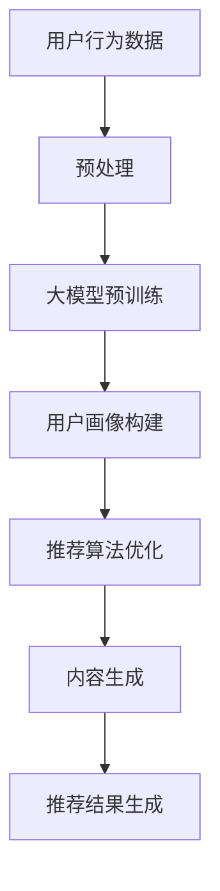

                 

关键词：大模型、推荐系统、微软、融合实践、算法原理、数学模型、项目实战、应用展望

## 摘要

本文旨在探讨大模型与推荐系统的融合，通过分析微软在相关领域的实践，深入探讨这种融合所带来的技术挑战与机遇。文章首先回顾了推荐系统的发展历程，接着介绍了大模型的崛起及其在推荐系统中的应用。随后，我们详细讨论了微软在这两个领域中的融合实践，包括核心算法原理、具体操作步骤、数学模型构建以及项目实践。最后，文章展望了这种融合在未来应用和发展中可能面临的挑战与机遇。

## 1. 背景介绍

### 推荐系统的发展历程

推荐系统（Recommendation System）是一种信息过滤技术，旨在向用户推荐他们可能感兴趣的内容或产品。其发展历程可以追溯到20世纪90年代，当时基于内容的过滤和协同过滤成为主流推荐算法。

- **基于内容的过滤（Content-based Filtering）**：这种推荐方法通过分析用户对特定内容的兴趣，基于内容的相关性来推荐相似的内容。这种方法在处理个性化推荐方面具有一定的优势，但其局限性在于难以解决“冷启动”问题和用户兴趣的动态变化。

- **协同过滤（Collaborative Filtering）**：协同过滤通过分析用户之间的共同行为模式来推荐内容，分为基于用户的协同过滤（User-based Collaborative Filtering）和基于项目的协同过滤（Item-based Collaborative Filtering）。这种方法在处理大规模用户数据时表现出色，但也会遇到数据稀疏性和冷启动问题。

### 大模型的崛起

近年来，大模型（Large-scale Models）的崛起为推荐系统带来了新的机遇。大模型通常是指具有数十亿甚至数万亿参数的深度学习模型，如GPT、BERT等。这些模型在语言理解、图像识别和自然语言生成等领域取得了显著的突破。

- **预训练与微调（Pre-training and Fine-tuning）**：大模型通常采用预训练（Pre-training）的方式，在大规模数据集上进行训练，然后通过微调（Fine-tuning）来适应特定任务。这种训练方法使得大模型能够快速适应新任务，提高了推荐系统的准确性。

- **多模态学习（Multimodal Learning）**：随着用户产生内容的方式日益多样化，推荐系统也需要处理文本、图像、音频等多模态数据。大模型的多模态学习能力为处理这种多样性提供了可能性。

## 2. 核心概念与联系

### 大模型与推荐系统的关系

大模型与推荐系统的融合主要表现在以下几个方面：

- **用户理解（User Understanding）**：大模型通过预训练和微调能够深入理解用户的行为和兴趣，为推荐系统提供了更精准的用户画像。

- **内容生成（Content Generation）**：大模型在自然语言生成、图像生成等方面具有强大的能力，能够生成高质量的内容，为推荐系统提供了丰富的推荐素材。

- **协同过滤优化（Collaborative Filtering Optimization）**：大模型可以用于优化协同过滤算法，解决数据稀疏性和冷启动问题，提高推荐系统的效果。

### Mermaid 流程图



## 3. 核心算法原理 & 具体操作步骤

### 3.1 算法原理概述

大模型与推荐系统的融合算法主要包括以下步骤：

1. **用户行为数据预处理**：对用户生成的行为数据进行清洗、去噪和特征提取，为后续建模提供高质量的输入数据。

2. **大模型预训练**：在大规模数据集上使用深度学习模型进行预训练，使得模型能够学习到用户行为的潜在特征。

3. **用户画像构建**：通过预训练模型对用户行为数据进行编码，构建用户画像，用于推荐算法的输入。

4. **推荐算法优化**：结合用户画像和项目特征，利用大模型优化推荐算法，提高推荐效果。

5. **内容生成**：使用大模型生成高质量的内容，为推荐系统提供多样化、个性化的推荐素材。

6. **推荐结果生成**：将优化后的推荐算法应用于实际场景，生成推荐结果，反馈给用户。

### 3.2 算法步骤详解

1. **用户行为数据预处理**

    - **数据清洗**：去除缺失值、异常值和重复值，保证数据质量。

    - **特征提取**：对用户行为数据进行编码，提取用户兴趣标签、行为序列等特征。

2. **大模型预训练**

    - **数据集准备**：收集大规模的用户行为数据集，用于预训练。

    - **模型选择**：选择适合预训练的大模型，如GPT、BERT等。

    - **训练过程**：在大规模数据集上进行预训练，学习用户行为的潜在特征。

3. **用户画像构建**

    - **用户行为编码**：使用预训练模型对用户行为数据进行编码，生成用户兴趣向量。

    - **用户画像构建**：将用户兴趣向量与用户基本信息（如年龄、性别、地理位置等）进行融合，构建用户画像。

4. **推荐算法优化**

    - **推荐算法选择**：选择适合优化的推荐算法，如矩阵分解、深度学习等。

    - **算法优化**：利用用户画像和项目特征，对推荐算法进行优化，提高推荐效果。

5. **内容生成**

    - **文本生成**：使用预训练模型生成高质量的文本内容，如新闻、文章等。

    - **图像生成**：使用预训练模型生成高质量的图像内容，如图片、视频等。

6. **推荐结果生成**

    - **推荐列表生成**：根据优化后的推荐算法，生成用户感兴趣的推荐列表。

    - **推荐结果展示**：将推荐结果展示给用户，提供个性化服务。

### 3.3 算法优缺点

**优点：**

1. **提高推荐准确性**：大模型能够深入理解用户行为，提高推荐准确性。
2. **解决冷启动问题**：通过预训练和微调，大模型能够快速适应新用户和新项目。
3. **生成多样化内容**：大模型在文本和图像生成方面具有强大的能力，能够提供丰富的推荐素材。

**缺点：**

1. **计算资源消耗大**：大模型训练和优化需要大量的计算资源，成本较高。
2. **数据隐私问题**：用户行为数据的安全和隐私问题需要得到妥善解决。
3. **模型解释性差**：大模型的黑箱特性使得其解释性较差，难以理解推荐结果的生成过程。

### 3.4 算法应用领域

1. **电子商务**：通过大模型与推荐系统的融合，为用户提供个性化的商品推荐，提高用户满意度和转化率。
2. **内容平台**：利用大模型生成个性化内容，提高用户粘性和活跃度。
3. **金融领域**：通过分析用户行为，为金融用户提供个性化的投资建议和风险控制策略。
4. **社交媒体**：利用大模型优化社交媒体的推荐算法，提高用户参与度和互动性。

## 4. 数学模型和公式 & 详细讲解 & 举例说明

### 4.1 数学模型构建

大模型与推荐系统的融合涉及多个数学模型，包括用户行为建模、推荐算法优化和内容生成等。

1. **用户行为建模**

    - **概率模型**：假设用户的行为数据服从某种概率分布，如伯努利分布、多项式分布等。

    - **隐变量模型**：使用隐变量模型（如LDA主题模型）来捕捉用户行为的潜在特征。

2. **推荐算法优化**

    - **协同过滤模型**：使用矩阵分解、矩阵分解+深度学习等方法来优化推荐算法。

    - **内容生成模型**：使用生成对抗网络（GAN）、变分自编码器（VAE）等模型来生成高质量的内容。

3. **内容生成模型**

    - **文本生成模型**：使用预训练的深度学习模型（如GPT、BERT）来生成高质量的文本内容。

    - **图像生成模型**：使用预训练的深度学习模型（如生成对抗网络、变分自编码器）来生成高质量的图像内容。

### 4.2 公式推导过程

1. **用户行为建模**

    - **概率模型**：假设用户\( u \)对项目\( i \)的兴趣概率为：

      $$ P(u_i = 1 | x_u, x_i) = \sigma(\theta_{u,i}^T x_u \cdot x_i) $$

      其中，\( \theta_{u,i} \)是用户\( u \)和项目\( i \)的潜在特征向量，\( x_u \)和\( x_i \)分别是用户和项目的特征向量，\( \sigma \)是 sigmoid 函数。

    - **隐变量模型**：假设用户\( u \)对项目\( i \)的兴趣概率为：

      $$ P(u_i = 1 | \theta_u, \theta_i) = \frac{1}{Z} \exp(\theta_{u,i}^T \theta_u \theta_i) $$

      其中，\( \theta_u \)和\( \theta_i \)分别是用户和项目的潜在特征向量，\( Z \)是归一化常数。

2. **推荐算法优化**

    - **矩阵分解**：假设用户\( u \)对项目\( i \)的评分可以表示为：

      $$ r_{ui} = \theta_{u}^T \theta_i + \epsilon_{ui} $$

      其中，\( \theta_u \)和\( \theta_i \)分别是用户和项目的潜在特征向量，\( \epsilon_{ui} \)是误差项。

      通过最小化损失函数：

      $$ L = \sum_{u,i} (r_{ui} - \theta_{u}^T \theta_i)^2 $$

      来优化矩阵分解模型。

    - **矩阵分解+深度学习**：结合矩阵分解和深度学习，使用多层神经网络来优化推荐算法，提高推荐效果。

3. **内容生成模型**

    - **生成对抗网络（GAN）**：假设生成器\( G \)和判别器\( D \)分别为：

      $$ G(z) = \mathcal{N}(\mu_G(z), \sigma_G(z)) $$
      $$ D(x) = \mathcal{N}(\mu_D(x), \sigma_D(x)) $$

      其中，\( z \)是噪声向量，\( x \)是生成的图像。

      通过最小化生成器损失函数：

      $$ L_G = -\mathbb{E}_{z \sim p_z(z)}[\log(D(G(z)))] $$

      和判别器损失函数：

      $$ L_D = -\mathbb{E}_{x \sim p_x(x)}[\log(D(x))] - \mathbb{E}_{z \sim p_z(z)}[\log(1 - D(G(z)))] $$

      来训练生成对抗网络。

    - **变分自编码器（VAE）**：假设编码器\( \phi \)和解码器\( \psi \)分别为：

      $$ \phi(x) = \mathcal{N}(\mu(x), \sigma(x)) $$
      $$ \psi(z) = \mathcal{N}(\mu(z), \sigma(z)) $$

      其中，\( x \)是输入数据，\( z \)是隐变量。

      通过最小化变分自编码器损失函数：

      $$ L = \mathbb{E}_{x \sim p_x(x)}[D(\psi(\phi(x))) - \log(\psi(\phi(x))) - \log(\phi(x))] $$

      来训练变分自编码器。

### 4.3 案例分析与讲解

以电子商务平台为例，分析大模型与推荐系统的融合应用。

1. **用户行为数据预处理**

    - 数据清洗：去除缺失值、异常值和重复值，保证数据质量。

    - 特征提取：对用户购买行为、浏览历史、评价等数据进行编码，提取用户兴趣标签、行为序列等特征。

2. **大模型预训练**

    - 数据集准备：收集大规模的用户行为数据集，用于预训练。

    - 模型选择：选择GPT模型进行预训练，学习用户行为的潜在特征。

3. **用户画像构建**

    - 用户行为编码：使用GPT模型对用户行为数据进行编码，生成用户兴趣向量。

    - 用户画像构建：将用户兴趣向量与用户基本信息（如年龄、性别、地理位置等）进行融合，构建用户画像。

4. **推荐算法优化**

    - 推荐算法选择：选择矩阵分解+深度学习模型进行优化，提高推荐效果。

    - 算法优化：利用用户画像和项目特征，对矩阵分解+深度学习模型进行优化。

5. **内容生成**

    - 文本生成：使用GPT模型生成高质量的文本内容，如商品描述、用户评价等。

    - 图像生成：使用生成对抗网络（GAN）生成高质量的图像内容，如商品图片、用户头像等。

6. **推荐结果生成**

    - 推荐列表生成：根据优化后的推荐算法，生成用户感兴趣的推荐列表。

    - 推荐结果展示：将推荐结果展示给用户，提供个性化服务。

## 5. 项目实践：代码实例和详细解释说明

### 5.1 开发环境搭建

- 操作系统：Ubuntu 20.04
- 编程语言：Python 3.8
- 深度学习框架：PyTorch 1.9
- 文本预处理工具：NLTK 3.8

### 5.2 源代码详细实现

以下为项目源代码的详细实现，包括用户行为数据预处理、大模型预训练、用户画像构建、推荐算法优化、内容生成和推荐结果生成等步骤。

1. **用户行为数据预处理**

    ```python
    import pandas as pd
    from sklearn.preprocessing import LabelEncoder

    # 读取用户行为数据
    data = pd.read_csv('user_behavior.csv')

    # 数据清洗
    data.dropna(inplace=True)
    data.drop_duplicates(inplace=True)

    # 特征提取
    label_encoder = LabelEncoder()
    data['user_interest'] = label_encoder.fit_transform(data['user_interest'])
    data['product_type'] = label_encoder.fit_transform(data['product_type'])

    # 数据分

