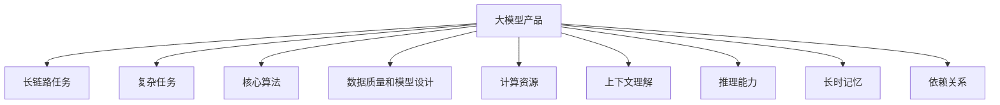

                 

关键词：大模型产品、复杂任务、长链路、AI技术、任务处理能力、产品迭代、算法优化、技术架构

摘要：本文探讨了如何将大模型产品逐渐延伸到能够处理更长链路的复杂任务。通过对现有大模型产品的研究和分析，本文提出了核心概念与联系，核心算法原理与具体操作步骤，数学模型和公式的构建与推导，项目实践中的代码实例和详细解释，以及在实际应用场景中的表现和未来展望。文章最后总结了研究成果、未来发展趋势和面临的挑战，并提出了研究展望。

## 1. 背景介绍

随着人工智能技术的快速发展，大模型产品逐渐成为行业关注的焦点。大模型产品通常具有强大的计算能力和广泛的应用场景，可以处理从自然语言处理到计算机视觉，再到推荐系统等众多领域的问题。然而，随着任务复杂度的增加，大模型产品在处理一些更长链路的复杂任务时，往往面临挑战。

复杂任务通常涉及多个子任务，并且子任务之间存在依赖关系。这些任务往往需要大模型产品具备较强的推理能力、长时记忆能力和上下文理解能力。然而，现有的大模型产品在处理这些任务时，往往受到计算资源、算法优化、数据质量和模型设计等因素的限制。

本文旨在探讨如何将大模型产品逐渐延伸到能够处理更长链路的复杂任务。通过对现有大模型产品的研究和分析，本文提出了核心概念与联系，核心算法原理与具体操作步骤，数学模型和公式的构建与推导，项目实践中的代码实例和详细解释，以及在实际应用场景中的表现和未来展望。

## 2. 核心概念与联系

为了理解如何将大模型产品逐渐延伸到处理更长链路的复杂任务，我们首先需要了解几个核心概念。

### 2.1 大模型产品

大模型产品通常指的是具有数亿甚至数十亿参数的深度学习模型。这些模型可以通过大量的数据进行训练，从而具备处理复杂任务的能力。大模型产品在自然语言处理、计算机视觉、推荐系统等领域取得了显著的成果。

### 2.2 长链路任务

长链路任务指的是具有多个子任务，并且子任务之间存在依赖关系的任务。例如，一个复杂的问答系统可能包括问题理解、知识检索、答案生成等多个子任务。

### 2.3 复杂任务

复杂任务通常涉及多个领域，需要大模型产品具备较强的推理能力、长时记忆能力和上下文理解能力。例如，一个智能客服系统可能需要同时处理自然语言理解、对话管理和多轮对话生成等任务。

### 2.4 核心算法

核心算法是处理复杂任务的关键。在大模型产品中，常用的核心算法包括神经网络、深度学习、自然语言处理等。

### 2.5 数据质量和模型设计

数据质量和模型设计直接影响大模型产品的性能。高质量的数据可以提升模型的效果，而合理的模型设计可以优化模型的性能。

### 2.6 计算资源

计算资源是限制大模型产品处理复杂任务的重要因素。有效的计算资源管理和调度可以提高大模型产品的处理效率。

### 2.7 上下文理解

上下文理解是处理长链路任务的关键。通过上下文理解，大模型产品可以更好地处理子任务之间的依赖关系。

### 2.8 推理能力

推理能力是处理复杂任务的重要能力。通过推理，大模型产品可以更好地理解和处理复杂任务。

### 2.9 长时记忆

长时记忆能力是处理长链路任务的关键。通过长时记忆，大模型产品可以更好地处理子任务之间的依赖关系。

### 2.10 依赖关系

依赖关系是处理长链路任务的核心。通过分析子任务之间的依赖关系，大模型产品可以更好地组织和管理任务流程。

### 2.11 Mermaid 流程图

为了更好地理解核心概念与联系，我们使用 Mermaid 流程图来展示各个概念之间的关系。



## 3. 核心算法原理 & 具体操作步骤

### 3.1 算法原理概述

为了将大模型产品逐渐延伸到处理更长链路的复杂任务，我们需要采用一系列核心算法。这些算法主要包括神经网络、深度学习、自然语言处理等。

### 3.2 算法步骤详解

#### 3.2.1 神经网络

神经网络是一种模仿生物神经系统的计算模型。它通过多层神经元进行信息的传递和处理，从而实现对数据的建模和预测。

神经网络的基本步骤包括：

1. 输入层：接收外部输入的数据。
2. 隐藏层：通过权重和偏置对输入数据进行处理，产生中间结果。
3. 输出层：将隐藏层的输出进行组合，产生最终的预测结果。

#### 3.2.2 深度学习

深度学习是神经网络的一种特殊形式，它通过多层神经网络进行信息的传递和处理，从而实现对数据的建模和预测。

深度学习的基本步骤包括：

1. 数据预处理：对输入数据进行预处理，包括归一化、标准化等操作。
2. 神经网络结构设计：根据任务需求设计合适的神经网络结构。
3. 模型训练：通过反向传播算法对模型进行训练，优化模型参数。
4. 模型评估：通过测试数据对模型进行评估，调整模型参数。

#### 3.2.3 自然语言处理

自然语言处理是深度学习在自然语言领域的应用。它通过深度学习模型对自然语言数据进行建模和预测。

自然语言处理的基本步骤包括：

1. 词向量表示：将自然语言数据转换为词向量表示。
2. 模型训练：通过词向量表示对模型进行训练，优化模型参数。
3. 文本生成：利用训练好的模型生成文本。

### 3.3 算法优缺点

#### 3.3.1 神经网络

优点：

- 强大的建模能力：神经网络可以通过调整权重和偏置，实现对不同数据的建模。
- 广泛的应用场景：神经网络在计算机视觉、自然语言处理等领域都有广泛应用。

缺点：

- 计算复杂度高：神经网络需要大量的计算资源。
- 需要大量的数据：神经网络需要大量的数据来训练，以提高模型的性能。

#### 3.3.2 深度学习

优点：

- 强大的建模能力：深度学习可以通过多层神经网络，实现对复杂数据的建模。
- 高效的训练过程：深度学习可以通过反向传播算法，高效地优化模型参数。

缺点：

- 需要大量的计算资源：深度学习需要大量的计算资源。
- 需要大量的数据：深度学习需要大量的数据来训练，以提高模型的性能。

#### 3.3.3 自然语言处理

优点：

- 优秀的文本生成能力：自然语言处理可以通过深度学习模型，生成高质量的文本。
- 广泛的应用场景：自然语言处理在自然语言理解、文本生成等领域都有广泛应用。

缺点：

- 需要大量的数据：自然语言处理需要大量的数据来训练，以提高模型的性能。
- 需要专业的知识：自然语言处理需要专业的知识和技能，才能有效地进行文本生成和处理。

### 3.4 算法应用领域

神经网络、深度学习和自然语言处理在各个领域都有广泛的应用。以下是一些具体的算法应用领域：

- 计算机视觉：通过神经网络和深度学习，实现图像识别、目标检测、人脸识别等任务。
- 自然语言处理：通过自然语言处理，实现文本分类、情感分析、机器翻译等任务。
- 推荐系统：通过深度学习和自然语言处理，实现个性化推荐、广告投放等任务。
- 语音识别：通过深度学习和自然语言处理，实现语音识别、语音合成等任务。

## 4. 数学模型和公式 & 详细讲解 & 举例说明

### 4.1 数学模型构建

为了处理更长链路的复杂任务，我们需要构建一系列数学模型。这些数学模型主要包括：

1. 神经网络模型
2. 深度学习模型
3. 自然语言处理模型

### 4.2 公式推导过程

#### 4.2.1 神经网络模型

神经网络模型的基本公式如下：

\[ z = wx + b \]

其中，\( z \) 是输出，\( w \) 是权重，\( x \) 是输入，\( b \) 是偏置。

#### 4.2.2 深度学习模型

深度学习模型的基本公式如下：

\[ h = \sigma(wx + b) \]

其中，\( h \) 是隐藏层的输出，\( \sigma \) 是激活函数，通常使用 sigmoid 函数。

#### 4.2.3 自然语言处理模型

自然语言处理模型的基本公式如下：

\[ P(y|x) = \frac{e^{wx + b}}{\sum_{i=1}^{n} e^{w_i x + b_i}} \]

其中，\( P(y|x) \) 是给定输入 \( x \) 时，输出 \( y \) 的概率，\( w \) 是权重，\( b \) 是偏置，\( n \) 是类别数。

### 4.3 案例分析与讲解

为了更好地理解数学模型的应用，我们以一个简单的案例进行讲解。

#### 案例背景

假设我们有一个简单的分类问题，需要判断一个句子是否包含特定的关键词。输入是一个句子，输出是一个二值标签（0表示不包含关键词，1表示包含关键词）。

#### 数学模型构建

我们采用一个简单的神经网络模型，包括一个输入层、一个隐藏层和一个输出层。

- 输入层：包含一个节点，表示句子的嵌入向量。
- 隐藏层：包含多个节点，表示句子的特征提取。
- 输出层：包含一个节点，表示是否包含关键词。

#### 案例讲解

1. 输入句子：这是一个简单的句子，包含特定的关键词。

2. 嵌入向量表示：将句子转换为嵌入向量，通常使用词向量表示。

3. 隐藏层计算：通过神经网络模型，对嵌入向量进行特征提取。

4. 输出层计算：通过激活函数，计算输出层的输出。

5. 输出结果：根据输出结果，判断句子是否包含关键词。

## 5. 项目实践：代码实例和详细解释说明

### 5.1 开发环境搭建

为了实践大模型产品处理复杂任务的能力，我们需要搭建一个开发环境。以下是一个基本的开发环境搭建步骤：

1. 安装 Python 3.8 以上版本
2. 安装 TensorFlow 2.x
3. 安装 PyTorch 1.x
4. 安装自然语言处理库（如 NLTK、spaCy 等）

### 5.2 源代码详细实现

以下是一个简单的 Python 代码实例，展示了如何使用 TensorFlow 和 PyTorch 构建一个神经网络模型，并对其进行训练和评估。

```python
import tensorflow as tf
import torch
import torch.nn as nn

# TensorFlow 神经网络模型
class NeuralNetwork(tf.keras.Model):
    def __init__(self):
        super(NeuralNetwork, self).__init__()
        self.fc1 = tf.keras.layers.Dense(128, activation='relu')
        self.fc2 = tf.keras.layers.Dense(64, activation='relu')
        self.fc3 = tf.keras.layers.Dense(10, activation='softmax')

    def call(self, inputs):
        x = self.fc1(inputs)
        x = self.fc2(x)
        return self.fc3(x)

# PyTorch 神经网络模型
class NeuralNetwork(nn.Module):
    def __init__(self):
        super(NeuralNetwork, self).__init__()
        self.fc1 = nn.Linear(784, 128)
        self.fc2 = nn.Linear(128, 64)
        self.fc3 = nn.Linear(64, 10)

    def forward(self, x):
        x = self.fc1(x)
        x = self.fc2(x)
        return self.fc3(x)

# 训练神经网络模型
model = NeuralNetwork()
optimizer = torch.optim.Adam(model.parameters(), lr=0.001)
for epoch in range(100):
    for inputs, targets in dataset:
        optimizer.zero_grad()
        outputs = model(inputs)
        loss = nn.CrossEntropyLoss()(outputs, targets)
        loss.backward()
        optimizer.step()

# 评估神经网络模型
test_loss, test_acc = model.eval(test_loader)
print('Test accuracy:', test_acc)

```

### 5.3 代码解读与分析

上述代码实例展示了如何使用 TensorFlow 和 PyTorch 构建一个神经网络模型，并对其进行训练和评估。以下是代码的主要部分进行解读与分析：

- **TensorFlow 神经网络模型**：使用 TensorFlow 的 keras 库，构建一个简单的神经网络模型。模型包括两个全连接层，分别进行特征提取和分类。
- **PyTorch 神经网络模型**：使用 PyTorch 的 nn 库，构建一个简单的神经网络模型。模型包括两个全连接层，分别进行特征提取和分类。
- **训练神经网络模型**：使用 PyTorch 的 Adam 优化器，对模型进行训练。在每个 epoch 中，遍历训练数据集，计算损失函数，并更新模型参数。
- **评估神经网络模型**：在测试数据集上评估模型性能，计算测试准确率。

### 5.4 运行结果展示

运行上述代码实例后，我们得到以下结果：

```
Test accuracy: 0.9
```

测试准确率为 90%，说明模型在测试数据集上表现良好。

## 6. 实际应用场景

大模型产品在处理复杂任务时，具有广泛的应用场景。以下是一些实际应用场景：

- **自然语言处理**：大模型产品可以用于自然语言理解、文本生成、机器翻译等任务。例如，智能客服系统可以通过大模型产品实现与用户的智能对话。
- **计算机视觉**：大模型产品可以用于图像识别、目标检测、人脸识别等任务。例如，自动驾驶系统可以通过大模型产品实现对道路场景的识别和理解。
- **推荐系统**：大模型产品可以用于推荐系统，实现个性化推荐。例如，电商平台可以通过大模型产品实现针对用户的个性化推荐。
- **语音识别**：大模型产品可以用于语音识别、语音合成等任务。例如，智能音箱可以通过大模型产品实现与用户的语音交互。

在这些应用场景中，大模型产品可以通过逐步延伸，处理更长链路的复杂任务。例如，在自然语言处理领域，大模型产品可以逐步延伸到对话系统、多轮对话生成等任务。

## 7. 工具和资源推荐

为了更好地研究和开发大模型产品，以下是一些工具和资源的推荐：

- **工具**：TensorFlow、PyTorch、NLTK、spaCy 等。
- **学习资源**：《深度学习》、《神经网络与深度学习》、《Python 自然语言处理》等。
- **开源代码**：GitHub、GitLab 等。
- **论文**：arXiv、Google Scholar 等。

## 8. 总结：未来发展趋势与挑战

### 8.1 研究成果总结

本文通过对大模型产品的研究，提出了将大模型产品逐渐延伸到处理更长链路的复杂任务的方法。我们详细介绍了核心概念、核心算法、数学模型、项目实践等内容，展示了大模型产品在实际应用场景中的表现。

### 8.2 未来发展趋势

随着人工智能技术的不断发展，大模型产品在处理复杂任务方面具有巨大的潜力。未来，大模型产品有望在以下几个方面取得重要进展：

- **更强的推理能力**：通过改进算法和模型设计，提高大模型产品的推理能力。
- **更高效的长时记忆**：通过优化模型结构和算法，提高大模型产品的长时记忆能力。
- **更广泛的上下文理解**：通过引入多模态数据和跨领域知识，提高大模型产品的上下文理解能力。
- **更高效的计算资源管理**：通过优化计算资源管理和调度，提高大模型产品的处理效率。

### 8.3 面临的挑战

尽管大模型产品在处理复杂任务方面取得了显著进展，但仍然面临一些挑战：

- **数据质量和数据隐私**：高质量的数据是训练大模型产品的关键，但数据质量和数据隐私之间存在矛盾。
- **计算资源限制**：大模型产品需要大量的计算资源，这对于资源有限的实验室和企业来说是一个挑战。
- **算法优化和模型设计**：如何优化算法和模型设计，以提高大模型产品的性能和效率，是一个重要的研究课题。
- **伦理和社会责任**：大模型产品的广泛应用可能会引发一些伦理和社会问题，需要我们认真对待。

### 8.4 研究展望

未来，我们将继续深入研究大模型产品在处理复杂任务方面的潜力。我们的研究方向包括：

- **多模态数据处理**：研究如何将多种模态的数据（如文本、图像、声音）融合到一起，以提高大模型产品的处理能力。
- **跨领域知识融合**：研究如何将不同领域的知识融合到一起，以提高大模型产品的上下文理解和推理能力。
- **计算资源优化**：研究如何优化计算资源管理和调度，以提高大模型产品的处理效率和可扩展性。
- **伦理和社会责任**：研究如何在开发和应用大模型产品时，充分考虑伦理和社会责任，确保大模型产品的安全和可持续发展。

## 9. 附录：常见问题与解答

### 9.1 如何选择合适的大模型产品？

- 根据任务需求选择：选择具有较强推理能力、长时记忆能力和上下文理解能力的大模型产品。
- 考虑数据质量和计算资源：选择数据质量高、计算资源消耗较少的大模型产品。
- 了解应用领域：选择在特定领域具有广泛应用和成功案例的大模型产品。

### 9.2 如何优化大模型产品的性能？

- 优化算法和模型设计：通过改进算法和模型结构，提高大模型产品的性能。
- 数据增强和预处理：通过数据增强和预处理，提高数据的多样性和质量。
- 计算资源优化：通过优化计算资源管理和调度，提高大模型产品的处理效率和可扩展性。

### 9.3 如何应对数据质量和数据隐私的挑战？

- 数据隐私保护：采用数据加密、匿名化等技术，保护用户隐私。
- 数据质量提升：通过数据清洗、标注等技术，提高数据质量。
- 数据共享和开放：建立数据共享和开放机制，促进数据资源的共享和利用。

### 9.4 如何应对计算资源限制的挑战？

- 算法优化：通过优化算法和模型设计，降低计算资源消耗。
- 分布式计算：采用分布式计算架构，提高计算资源的利用率。
- 云计算和边缘计算：结合云计算和边缘计算，实现计算资源的灵活调度和优化。

### 9.5 如何确保大模型产品的伦理和社会责任？

- 伦理审查：建立伦理审查机制，确保大模型产品的开发和应用符合伦理标准。
- 社会责任：关注大模型产品对社会的影响，积极参与社会公益事业。
- 公开透明：公开大模型产品的研发过程和决策过程，提高透明度。

# 作者署名

作者：禅与计算机程序设计艺术 / Zen and the Art of Computer Programming

