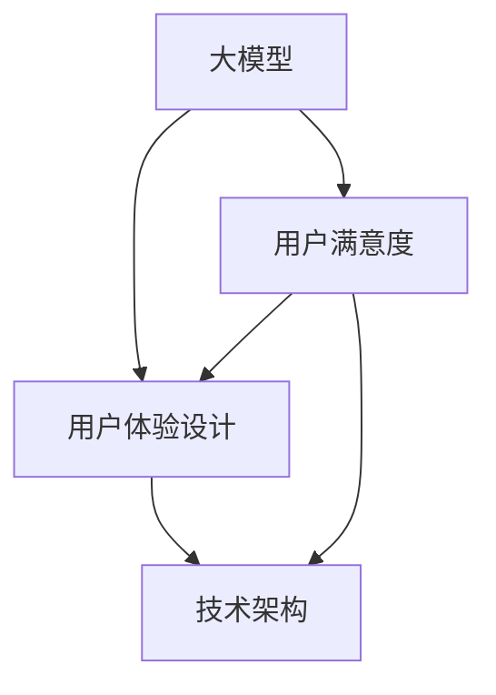

                 

关键词：大模型，产品体验，优化，用户满意度，技术架构，用户体验设计，算法改进

> 摘要：本文将探讨大模型企业如何通过优化产品体验来提升用户满意度。我们将深入分析大模型产品中的核心概念与联系，探讨核心算法原理与操作步骤，构建数学模型并进行公式推导，提供项目实践中的代码实例，最后讨论实际应用场景和未来展望，以及相关工具和资源的推荐。

## 1. 背景介绍

随着人工智能技术的飞速发展，大模型（如大型语言模型、图像生成模型等）在各个领域得到了广泛应用。然而，大模型的应用不仅需要强大的计算能力和先进的算法，还需要注重产品的用户体验。用户体验是影响用户满意度的重要因素，直接关系到产品的市场竞争力和长期发展。因此，大模型企业必须关注产品体验的优化，从而提升用户满意度，增强用户粘性和品牌忠诚度。

本文将从多个角度探讨大模型企业的产品体验优化策略，包括核心概念的理解、算法改进、数学模型构建、项目实践和未来展望等。希望通过本文的探讨，能够为从事大模型产品开发的企业和团队提供一些有价值的参考和启示。

## 2. 核心概念与联系

在探讨大模型企业的产品体验优化之前，我们首先需要了解几个核心概念：

### 2.1 大模型

大模型通常指的是具有数十亿甚至数万亿参数的深度学习模型。这些模型能够处理海量数据，并在特定任务上实现高精度的预测和生成。

### 2.2 用户体验设计

用户体验设计（User Experience Design，简称UXD）是一种设计方法，旨在提高用户在使用产品时的满意度和幸福感。它包括界面设计、交互设计、内容策略等多个方面。

### 2.3 用户满意度

用户满意度是指用户在使用产品后的主观感受。高满意度通常意味着用户对产品的认可和信任，进而增加用户粘性和品牌忠诚度。

### 2.4 技术架构

技术架构是指产品背后所使用的技术框架和基础设施。一个良好的技术架构能够提高产品的稳定性、扩展性和用户体验。

为了更好地理解这些概念之间的联系，我们使用Mermaid流程图进行展示。



在这个流程图中，我们可以看到大模型、用户体验设计、用户满意度和技术架构之间的紧密联系。大模型是产品的基础，用户体验设计和技术架构则是实现良好用户满意度的重要手段。

## 3. 核心算法原理 & 具体操作步骤

### 3.1 算法原理概述

在优化产品体验的过程中，核心算法的改进至关重要。大模型企业通常会采用以下几种算法来提升产品性能：

- **深度学习**：通过神经网络模拟人脑的学习过程，处理复杂数据和任务。
- **强化学习**：通过试错和奖励机制，不断优化策略，提升模型性能。
- **生成对抗网络（GAN）**：通过生成器和判别器的对抗训练，生成逼真的数据。

### 3.2 算法步骤详解

以下是上述算法的具体操作步骤：

#### 深度学习

1. **数据预处理**：清洗和预处理输入数据，确保数据质量。
2. **模型选择**：选择合适的神经网络结构，如卷积神经网络（CNN）、循环神经网络（RNN）等。
3. **训练**：使用预处理后的数据训练模型，通过反向传播和梯度下降优化模型参数。
4. **评估与调整**：评估模型性能，根据评估结果调整模型参数和结构。

#### 强化学习

1. **环境设置**：定义环境和动作空间，为模型提供决策环境。
2. **策略初始化**：初始化策略参数，通常采用随机初始化。
3. **策略迭代**：通过不断尝试和奖励机制，更新策略参数，优化决策。
4. **策略评估**：评估策略性能，确保策略能够实现期望的目标。

#### 生成对抗网络（GAN）

1. **生成器与判别器初始化**：初始化生成器和判别器参数。
2. **对抗训练**：生成器生成数据，判别器判断生成数据与真实数据之间的差异。
3. **生成器更新**：根据判别器的反馈，更新生成器参数，优化数据生成质量。
4. **判别器更新**：根据生成器和真实数据的综合反馈，更新判别器参数。

### 3.3 算法优缺点

#### 深度学习

- 优点：能够处理复杂数据和任务，实现高精度的预测和生成。
- 缺点：需要大量数据和计算资源，模型复杂度高，训练时间较长。

#### 强化学习

- 优点：能够通过试错学习优化策略，适应动态环境。
- 缺点：训练过程复杂，需要大量时间和计算资源，对环境有较高依赖。

#### 生成对抗网络（GAN）

- 优点：能够生成高质量的数据，实现数据的自我增强。
- 缺点：训练不稳定，容易出现模式崩溃和生成数据质量下降。

### 3.4 算法应用领域

- **图像识别与生成**：深度学习和GAN在图像识别和生成方面具有广泛的应用。
- **自然语言处理**：强化学习在自然语言处理中的应用逐渐增加，如聊天机器人、文本生成等。
- **游戏与虚拟现实**：通过强化学习优化游戏AI和虚拟现实体验。

## 4. 数学模型和公式 & 详细讲解 & 举例说明

### 4.1 数学模型构建

在大模型企业中，数学模型的构建是优化产品体验的关键。以下是一个简化的数学模型构建过程：

#### 4.1.1 数据集准备

假设我们有一个图像数据集，其中包含10,000张图片和对应的标签。

#### 4.1.2 模型定义

我们选择一个简单的卷积神经网络（CNN）模型，包括卷积层、池化层和全连接层。

#### 4.1.3 损失函数

选择交叉熵损失函数，用于衡量模型预测与实际标签之间的差异。

$$
L(y, \hat{y}) = -\sum_{i=1}^{n} y_i \log(\hat{y}_i)
$$

其中，$y$ 是实际标签，$\hat{y}$ 是模型预测的概率分布。

#### 4.1.4 优化器

选择随机梯度下降（SGD）优化器，用于更新模型参数。

$$
\theta_{t+1} = \theta_{t} - \alpha \nabla_{\theta}L(\theta)
$$

其中，$\theta$ 是模型参数，$\alpha$ 是学习率。

### 4.2 公式推导过程

#### 4.2.1 损失函数推导

交叉熵损失函数的推导过程如下：

首先，我们定义一个概率分布 $\hat{y}$，表示模型对每个类别的预测概率。

$$
\hat{y} = \sigma(\theta^T x)
$$

其中，$\sigma$ 是sigmoid函数，$x$ 是输入特征，$\theta$ 是模型参数。

接下来，我们定义实际标签 $y$，其中 $y_i = 1$ 表示第 $i$ 个类别是实际标签，$y_i = 0$ 表示其他类别。

损失函数可以表示为：

$$
L(y, \hat{y}) = -\sum_{i=1}^{n} y_i \log(\hat{y}_i)
$$

#### 4.2.2 优化器推导

随机梯度下降（SGD）的推导过程如下：

首先，我们定义损失函数关于模型参数的梯度：

$$
\nabla_{\theta}L(\theta) = \frac{\partial L}{\partial \theta}
$$

然后，我们选择一个学习率 $\alpha$，更新模型参数：

$$
\theta_{t+1} = \theta_{t} - \alpha \nabla_{\theta}L(\theta)
$$

### 4.3 案例分析与讲解

#### 4.3.1 图像分类案例

假设我们有一个图像分类任务，其中包含10个类别。我们使用CNN模型对图像进行分类，并使用交叉熵损失函数和SGD优化器进行训练。

#### 4.3.2 数据预处理

我们对图像进行归一化处理，并将标签编码为独热向量。

#### 4.3.3 训练过程

我们使用随机梯度下降（SGD）对模型进行训练。在训练过程中，我们不断更新模型参数，并记录损失函数的值。

#### 4.3.4 评估与调整

在训练完成后，我们对模型进行评估，计算分类准确率。如果准确率不理想，我们可以通过调整模型结构、损失函数和优化器来优化模型性能。

## 5. 项目实践：代码实例和详细解释说明

### 5.1 开发环境搭建

为了实现上述算法和模型，我们需要搭建一个合适的开发环境。以下是具体步骤：

#### 5.1.1 硬件要求

- GPU：NVIDIA GeForce GTX 1080 Ti 或更高版本
- CPU：Intel Core i7 或 AMD Ryzen 7 或更高版本
- 内存：16 GB 或更高

#### 5.1.2 软件要求

- 操作系统：Linux、macOS 或 Windows
- Python：3.7 或更高版本
- TensorFlow：2.0 或更高版本

#### 5.1.3 安装与配置

1. 安装操作系统和硬件设备。
2. 安装Python和相关依赖库，如NumPy、Pandas、TensorFlow等。
3. 配置GPU支持，确保TensorFlow能够使用GPU进行计算。

### 5.2 源代码详细实现

以下是使用TensorFlow实现一个简单的图像分类模型的代码示例。

```python
import tensorflow as tf
from tensorflow.keras.models import Sequential
from tensorflow.keras.layers import Conv2D, MaxPooling2D, Flatten, Dense

# 数据预处理
(x_train, y_train), (x_test, y_test) = tf.keras.datasets.cifar10.load_data()
x_train, x_test = x_train / 255.0, x_test / 255.0

# 模型定义
model = Sequential([
    Conv2D(32, (3, 3), activation='relu', input_shape=(32, 32, 3)),
    MaxPooling2D((2, 2)),
    Flatten(),
    Dense(10, activation='softmax')
])

# 模型编译
model.compile(optimizer='adam',
              loss=tf.keras.losses.SparseCategoricalCrossentropy(from_logits=True),
              metrics=['accuracy'])

# 模型训练
model.fit(x_train, y_train, epochs=10, validation_data=(x_test, y_test))

# 模型评估
test_loss, test_acc = model.evaluate(x_test,  y_test, verbose=2)
print('\nTest accuracy:', test_acc)
```

### 5.3 代码解读与分析

1. **数据预处理**：我们使用TensorFlow内置的CIFAR-10数据集进行训练。数据集包含10个类别，每个类别有6000张训练图像和1000张测试图像。我们对图像进行归一化处理，使像素值在0到1之间。

2. **模型定义**：我们使用Sequential模型定义一个简单的卷积神经网络（CNN），包括一个卷积层、一个池化层和一个全连接层。卷积层用于提取图像特征，池化层用于下采样特征图，全连接层用于分类。

3. **模型编译**：我们使用adam优化器和稀疏分类交叉熵损失函数编译模型。稀疏分类交叉熵损失函数适用于多分类问题，它的目标是最小化模型预测与实际标签之间的差异。

4. **模型训练**：我们使用fit方法对模型进行训练，训练过程中会不断更新模型参数，并计算损失函数的值。我们在训练集和测试集上分别进行训练和验证，以评估模型性能。

5. **模型评估**：我们使用evaluate方法对模型进行评估，计算测试集上的准确率。准确率越高，说明模型性能越好。

## 6. 实际应用场景

大模型企业的产品体验优化在多个实际应用场景中具有重要意义。以下是一些典型应用场景：

### 6.1 智能客服

智能客服是当前大模型应用的一个重要领域。通过优化产品体验，智能客服系统能够更准确地理解用户需求，提供高效的解决方案，从而提高用户满意度和用户体验。

### 6.2 聊天机器人

聊天机器人也是大模型应用的重要方向之一。通过优化产品体验，聊天机器人可以更好地模拟人类对话，提供更自然、流畅的交流体验，从而增强用户粘性和品牌忠诚度。

### 6.3 图像识别与生成

图像识别与生成是另一个应用广泛的领域。通过优化产品体验，图像识别系统能够更准确地识别图像内容，生成对抗网络（GAN）能生成更逼真的图像，从而提高用户满意度和产品价值。

### 6.4 医疗诊断

医疗诊断是大模型应用的一个重要领域。通过优化产品体验，医疗诊断系统能够更准确地识别疾病，提供更详细的诊断报告，从而提高医生的工作效率和患者满意度。

## 7. 未来应用展望

随着人工智能技术的不断进步，大模型企业的产品体验优化将迎来更多的机遇和挑战。以下是一些未来应用展望：

### 7.1 自动驾驶

自动驾驶是人工智能的一个重要应用领域。通过优化产品体验，自动驾驶系统能够更准确地感知环境，提供更安全、可靠的驾驶体验。

### 7.2 智能家居

智能家居是另一个快速发展的领域。通过优化产品体验，智能家居系统能够更好地满足用户需求，提高生活品质。

### 7.3 虚拟现实

虚拟现实（VR）和增强现实（AR）技术也在不断发展。通过优化产品体验，VR/AR应用能够提供更沉浸、互动的体验，为用户提供全新的娱乐和交互方式。

## 8. 工具和资源推荐

为了更好地进行大模型企业的产品体验优化，以下是几个推荐的工具和资源：

### 8.1 学习资源推荐

- 《深度学习》（Goodfellow et al.）：介绍深度学习的基本概念和技术，适合初学者。
- 《强化学习》（Sutton et al.）：详细介绍强化学习的基本理论和方法，适合对强化学习感兴趣的读者。
- 《生成对抗网络：理论基础与应用》（吴恩达）：讲解GAN的基本概念和实现方法，适合对图像生成感兴趣的研究者。

### 8.2 开发工具推荐

- TensorFlow：由Google开发的开源深度学习框架，支持多种算法和模型。
- PyTorch：由Facebook开发的开源深度学习框架，具有灵活的动态计算图和高效的模型构建。
- Keras：基于TensorFlow和Theano的开源深度学习库，提供简洁的API和丰富的预训练模型。

### 8.3 相关论文推荐

- Generative Adversarial Nets（GANs）（Goodfellow et al., 2014）：介绍了GAN的基本概念和实现方法，是GAN领域的经典论文。
- Deep Learning for Natural Language Processing（NLP）（Mikolov et al., 2013）：介绍了深度学习在自然语言处理领域的应用，包括词向量模型和序列模型。
- Deep Reinforcement Learning（Deep RL）（Sutton et al., 2017）：介绍了深度强化学习的基本理论和方法，包括DQN、PPO等算法。

## 9. 总结：未来发展趋势与挑战

### 9.1 研究成果总结

本文通过深入探讨大模型企业的产品体验优化，总结了以下几个关键点：

1. 大模型企业需要关注用户体验，提高用户满意度。
2. 核心算法的改进对产品体验优化至关重要。
3. 数学模型的构建和公式推导是优化过程的重要环节。
4. 实际应用场景的探索和未来展望为产品体验优化提供了新的方向。

### 9.2 未来发展趋势

随着人工智能技术的不断进步，大模型企业的产品体验优化将呈现以下发展趋势：

1. 深度学习、强化学习和GAN等算法将在更多领域得到应用。
2. 跨学科研究将成为优化产品体验的重要趋势，如心理学、认知科学和设计学等。
3. 开源框架和工具的不断发展将为产品体验优化提供更多支持。

### 9.3 面临的挑战

虽然大模型企业的产品体验优化具有广泛的应用前景，但仍面临以下挑战：

1. 计算资源的需求不断增加，对硬件和基础设施提出了更高要求。
2. 数据质量和数据隐私问题需要得到有效解决。
3. 用户体验设计的复杂度增加，需要更全面、深入的解决方案。

### 9.4 研究展望

未来的研究可以从以下几个方面展开：

1. 开发更高效、稳定的深度学习算法，降低计算资源的需求。
2. 研究数据隐私保护和数据质量提升的方法，为产品体验优化提供数据支持。
3. 探索跨学科的研究方法，提高用户体验设计的整体水平。

## 附录：常见问题与解答

### Q1：如何优化大模型产品的用户体验？

A1：优化大模型产品的用户体验可以从以下几个方面入手：

1. **了解用户需求**：通过用户调研和反馈，了解用户的具体需求和痛点。
2. **优化界面设计**：提高界面设计的简洁性和易用性，使用户能够轻松操作。
3. **提升响应速度**：优化模型算法和后台服务，提高系统的响应速度。
4. **增加互动性**：增加用户与产品的互动性，提高用户参与度和满意度。

### Q2：大模型算法改进对产品体验优化有何作用？

A2：大模型算法改进对产品体验优化具有以下作用：

1. **提高模型性能**：改进算法能够提高模型的预测准确率和生成质量，从而提升产品功能。
2. **优化用户体验**：通过算法改进，产品能够更快速、准确地响应用户需求，提高用户满意度。
3. **降低计算资源需求**：改进算法能够提高计算效率，降低对硬件和基础设施的需求，为产品体验优化提供更好的支持。

### Q3：如何评估大模型产品的用户体验？

A3：评估大模型产品的用户体验可以从以下几个方面入手：

1. **用户满意度调查**：通过问卷调查、用户访谈等方式，了解用户对产品的满意程度。
2. **使用行为分析**：通过分析用户的使用行为，如使用时长、操作频率等，评估产品的易用性和用户参与度。
3. **系统性能指标**：评估系统的响应速度、稳定性等性能指标，以评估产品的整体质量。
4. **用户反馈机制**：建立用户反馈机制，及时收集和处理用户意见，不断改进产品体验。

### Q4：大模型产品体验优化中的数据隐私问题如何解决？

A4：在解决大模型产品体验优化中的数据隐私问题时，可以从以下几个方面入手：

1. **数据匿名化处理**：对用户数据进行匿名化处理，确保用户隐私不受侵犯。
2. **数据加密传输**：使用加密技术对数据进行传输和存储，防止数据泄露。
3. **权限控制**：建立严格的权限控制机制，确保只有授权人员能够访问和处理用户数据。
4. **法律法规遵循**：遵守相关法律法规，确保数据处理过程合法合规。

### Q5：如何平衡大模型产品体验优化与开发成本之间的关系？

A5：在平衡大模型产品体验优化与开发成本之间的关系时，可以从以下几个方面入手：

1. **明确优化目标**：根据产品需求和用户反馈，明确优化目标，确保优化工作有针对性。
2. **合理分配资源**：合理分配开发资源，优先考虑关键功能和用户体验的优化。
3. **分阶段实施**：将优化工作分成多个阶段，逐步实施，避免一次性投入过多成本。
4. **持续监控与改进**：持续监控产品性能和用户体验，及时发现问题并进行改进，以最小化开发成本。

通过以上措施，可以在保证产品体验优化的同时，合理控制开发成本，实现可持续的发展。

