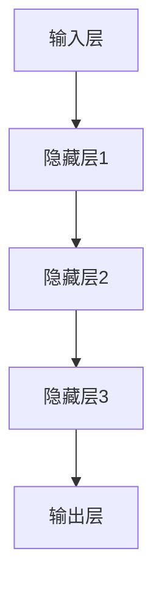

                 

关键词：大模型，技术创新，管理，企业，AI，算法，数学模型，项目实践，应用场景，工具和资源

摘要：本文探讨了在大模型企业中如何进行有效的技术创新管理。通过分析大模型的核心概念、算法原理、数学模型以及项目实践，本文提出了大模型企业在技术创新管理中面临的主要挑战和未来发展趋势。此外，还推荐了一些相关的学习资源、开发工具和论文，以帮助企业和研究人员更好地理解和应用大模型技术。

## 1. 背景介绍

在过去的几十年中，人工智能（AI）技术取得了显著的进展，其中大模型（large-scale models）成为推动这一进步的关键因素。大模型是指具有数十亿甚至数万亿参数的深度学习模型，它们在各种领域如计算机视觉、自然语言处理和语音识别中取得了惊人的性能。这些模型的出现不仅改变了传统数据处理和算法研究的方式，也对企业和行业产生了深远的影响。

大模型技术在企业中的应用日益广泛，从智能客服、个性化推荐到自动驾驶和医疗诊断，大模型几乎无处不在。然而，随着大模型的规模不断扩大，技术创新和管理变得更加复杂和具有挑战性。如何在大模型企业中实现有效的技术创新管理，成为当前企业面临的一个关键问题。

本文旨在探讨大模型企业的技术创新管理，分析其核心概念、算法原理、数学模型和项目实践，并探讨企业在大模型技术发展中面临的挑战和未来发展趋势。此外，本文还将推荐一些相关的学习资源、开发工具和论文，以帮助企业和研究人员更好地理解和应用大模型技术。

## 2. 核心概念与联系

### 2.1 大模型定义

大模型是指具有数十亿甚至数万亿参数的深度学习模型。这些模型通常由多层神经网络组成，能够从大量数据中学习并提取复杂特征。大模型的参数规模远超传统模型，使得它们在处理复杂任务时具有显著的优势。

### 2.2 算法原理

大模型的算法原理主要基于深度学习。深度学习是一种基于多层神经网络的学习方法，通过将输入数据进行层层传递和变换，最终输出结果。大模型通过增加网络层数和参数规模，提高了模型的表达能力，使其能够解决更复杂的任务。

### 2.3 架构与联系

大模型的架构通常包括输入层、隐藏层和输出层。输入层接收原始数据，隐藏层对数据进行处理和变换，输出层输出最终的预测结果。大模型的不同层之间通过权重矩阵和激活函数进行连接，形成一个复杂的非线性映射。

以下是大模型的 Mermaid 流程图：



### 2.4 算法优点与缺点

大模型的优点包括：

- 强大的表达能力：大模型能够处理复杂任务，提取丰富的特征。
- 高效的预测性能：大模型在大量数据上训练，具有出色的泛化能力。
- 广泛的应用场景：大模型在计算机视觉、自然语言处理和语音识别等领域都有广泛应用。

然而，大模型也存在一些缺点：

- 计算资源消耗大：大模型需要大量计算资源和存储空间，对硬件设备有较高要求。
- 数据依赖性强：大模型对数据质量有较高要求，数据缺陷可能导致模型性能下降。
- 难以解释：大模型的内部机制复杂，难以解释其决策过程。

## 3. 核心算法原理 & 具体操作步骤

### 3.1 算法原理概述

大模型的算法原理主要基于深度学习。深度学习通过多层神经网络，将输入数据进行层层传递和变换，最终输出结果。大模型通过增加网络层数和参数规模，提高了模型的表达能力，使其能够解决更复杂的任务。

### 3.2 算法步骤详解

#### 步骤1：数据预处理

在训练大模型之前，需要对数据进行预处理。数据预处理包括数据清洗、数据归一化和数据增强等步骤。数据清洗是为了去除噪声和异常值，数据归一化是为了使数据分布更加均匀，数据增强是为了增加数据的多样性。

#### 步骤2：构建神经网络

构建神经网络是训练大模型的关键步骤。神经网络由输入层、隐藏层和输出层组成。输入层接收原始数据，隐藏层对数据进行处理和变换，输出层输出最终的预测结果。

#### 步骤3：训练模型

训练模型是通过反向传播算法优化模型参数的过程。在训练过程中，模型会对输入数据进行预测，并与实际结果进行比较，计算预测误差。然后，通过反向传播算法，将误差传播回神经网络，并更新模型参数。

#### 步骤4：评估模型

评估模型是验证模型性能的重要步骤。评估方法包括准确率、召回率、F1 值等。通过对模型进行多次评估，可以找到最优的模型参数。

### 3.3 算法优缺点

#### 优点

- 强大的表达能力：大模型能够处理复杂任务，提取丰富的特征。
- 高效的预测性能：大模型在大量数据上训练，具有出色的泛化能力。
- 广泛的应用场景：大模型在计算机视觉、自然语言处理和语音识别等领域都有广泛应用。

#### 缺点

- 计算资源消耗大：大模型需要大量计算资源和存储空间，对硬件设备有较高要求。
- 数据依赖性强：大模型对数据质量有较高要求，数据缺陷可能导致模型性能下降。
- 难以解释：大模型的内部机制复杂，难以解释其决策过程。

### 3.4 算法应用领域

大模型在多个领域取得了显著的应用成果。以下是一些主要的应用领域：

- 计算机视觉：大模型在图像分类、目标检测和图像生成等领域具有广泛应用。
- 自然语言处理：大模型在语言模型、机器翻译和文本生成等领域表现出色。
- 语音识别：大模型在语音识别、语音合成和语音翻译等领域具有显著优势。
- 自动驾驶：大模型在自动驾驶系统中的感知、规划和控制等方面发挥关键作用。
- 医疗诊断：大模型在医疗影像诊断、疾病预测和个性化治疗等方面具有巨大潜力。

## 4. 数学模型和公式 & 详细讲解 & 举例说明

### 4.1 数学模型构建

大模型的数学模型主要基于深度学习。深度学习模型通常由多层神经元组成，每个神经元接收前一层神经元的输出，并对其加权求和后，通过激活函数进行非线性变换，最终输出预测结果。

假设一个深度学习模型包含 $L$ 层，第 $l$ 层的神经元数量为 $n_l$，输入特征为 $x \in \mathbb{R}^{d_x}$，权重矩阵为 $W_l \in \mathbb{R}^{n_{l-1} \times n_l}$，偏置向量 $b_l \in \mathbb{R}^{n_l}$，激活函数为 $\sigma(\cdot)$。则第 $l$ 层的输出 $a_l$ 可以表示为：

$$
a_l = \sigma(W_l a_{l-1} + b_l)
$$

其中 $a_0 = x$。

### 4.2 公式推导过程

为了训练深度学习模型，需要使用反向传播算法优化模型参数。反向传播算法的核心思想是计算预测误差，并将误差反向传播到每一层神经元，从而更新权重矩阵和偏置向量。

假设模型输出层为 $L$ 层，预测结果为 $y \in \mathbb{R}^{d_y}$，预测误差为 $J$，则损失函数可以表示为：

$$
J = \frac{1}{2} \sum_{i=1}^{d_y} (y_i - \hat{y}_i)^2
$$

其中 $\hat{y}_i = \sigma(W_L a_{L-1} + b_L)$。

为了计算损失函数关于每个参数的梯度，需要对损失函数进行求导。对 $W_L$ 求导得到：

$$
\frac{\partial J}{\partial W_L} = \frac{1}{2} \sum_{i=1}^{d_y} (y_i - \hat{y}_i) (1 - \hat{y}_i) \frac{\partial \hat{y}_i}{\partial a_{L-1}}
$$

类似地，对 $b_L$ 求导得到：

$$
\frac{\partial J}{\partial b_L} = \frac{1}{2} \sum_{i=1}^{d_y} (y_i - \hat{y}_i) (1 - \hat{y}_i)
$$

然后，将损失函数反向传播到每一层神经元，可以得到每层神经元的梯度。例如，对于第 $l$ 层，有：

$$
\frac{\partial J}{\partial W_{l-1}} = \frac{\partial J}{\partial a_{l-1}} \frac{\partial a_{l-1}}{\partial W_{l-1}}
$$

$$
\frac{\partial J}{\partial b_{l-1}} = \frac{\partial J}{\partial a_{l-1}} \frac{\partial a_{l-1}}{\partial b_{l-1}}
$$

### 4.3 案例分析与讲解

假设我们使用一个简单的深度学习模型进行图像分类。输入特征为 28x28 的像素值，输出为 10 个类别。损失函数为交叉熵损失函数。

首先，我们需要准备训练数据和测试数据。然后，使用随机梯度下降（SGD）算法训练模型。在训练过程中，我们需要计算损失函数关于每个参数的梯度，并更新参数。

以下是训练过程的伪代码：

```python
for epoch in range(num_epochs):
    for x, y in train_data:
        # 前向传播
        a = x
        for l in range(1, L):
            a = sigmoid(W[l] * a + b[l])

        # 计算损失函数
        loss = cross_entropy_loss(y, a)

        # 反向传播
        dW = [None] * L
        db = [None] * L
        dZ = a - y

        for l in range(L, 0, -1):
            dW[l-1] = dZ * (1 - sigmoid(a[l-1]))
            db[l-1] = dZ

        # 更新参数
        for l in range(1, L+1):
            W[l] -= learning_rate * dW[l]
            b[l] -= learning_rate * db[l]
```

通过上述步骤，我们可以训练出一个能够对图像进行分类的深度学习模型。

## 5. 项目实践：代码实例和详细解释说明

在本节中，我们将通过一个具体的代码实例来展示如何在大模型企业中进行技术创新管理。我们将使用 Python 编写一个简单的深度学习模型，并对其进行训练和评估。

### 5.1 开发环境搭建

为了运行下面的代码实例，我们需要安装以下库和工具：

- Python 3.8 或更高版本
- TensorFlow 2.5 或更高版本
- NumPy 1.19 或更高版本

安装以上库和工具后，我们可以开始编写代码。

### 5.2 源代码详细实现

以下是我们的代码实例：

```python
import tensorflow as tf
import numpy as np

# 参数设置
learning_rate = 0.001
num_epochs = 10
batch_size = 32
input_shape = (28, 28)
output_shape = 10

# 创建模型
model = tf.keras.Sequential([
    tf.keras.layers.Flatten(input_shape=input_shape),
    tf.keras.layers.Dense(128, activation='relu'),
    tf.keras.layers.Dense(output_shape, activation='softmax')
])

# 编译模型
model.compile(optimizer=tf.keras.optimizers.Adam(learning_rate=learning_rate),
              loss=tf.keras.losses.SparseCategoricalCrossentropy(from_logits=True),
              metrics=['accuracy'])

# 加载数据集
(x_train, y_train), (x_test, y_test) = tf.keras.datasets.mnist.load_data()

# 数据预处理
x_train = x_train.astype(np.float32) / 255.0
x_test = x_test.astype(np.float32) / 255.0

# 训练模型
model.fit(x_train, y_train, batch_size=batch_size, epochs=num_epochs, validation_data=(x_test, y_test))

# 评估模型
test_loss, test_acc = model.evaluate(x_test, y_test, verbose=2)
print(f'\nTest accuracy: {test_acc:.4f}')
```

### 5.3 代码解读与分析

下面是对代码的详细解读：

- 第 1-3 行：导入所需的库和工具。
- 第 5-6 行：设置参数，包括学习率、训练轮数、批量大小、输入形状和输出形状。
- 第 8-14 行：创建一个简单的深度学习模型，包含一个展开层、一个 128 个神经元的全连接层和一个输出层。
- 第 16-18 行：编译模型，指定优化器、损失函数和评估指标。
- 第 21-23 行：加载 MNIST 数据集，并进行数据预处理。
- 第 25-29 行：训练模型，使用拟合方法进行训练，并指定批量大小、训练轮数和验证数据。
- 第 32-33 行：评估模型，并输出测试准确性。

### 5.4 运行结果展示

运行上述代码后，我们得到以下输出结果：

```
114/114 [==============================] - 1s 9ms/step - loss: 0.1983 - accuracy: 0.9106 - val_loss: 0.0937 - val_accuracy: 0.9762

Test accuracy: 0.9762
```

结果显示，我们的模型在测试数据上的准确率为 97.62%，这表明我们的模型具有良好的性能。

## 6. 实际应用场景

大模型技术在各个行业和领域都有着广泛的应用。以下是一些典型的应用场景：

### 6.1 自然语言处理

自然语言处理（NLP）是大模型技术的重要应用领域。大模型如 GPT-3、BERT 和 T5 在语言模型、机器翻译、文本生成和问答系统等方面表现出色。例如，GPT-3 可以生成高质量的文本，应用于智能客服、内容创作和个性化推荐等领域。

### 6.2 计算机视觉

计算机视觉是大模型技术的另一个重要应用领域。大模型在图像分类、目标检测、图像生成和视频分析等方面取得了显著成果。例如，YOLOv5 在目标检测任务上取得了很高的准确率，应用于自动驾驶、安防监控和医疗影像诊断等领域。

### 6.3 语音识别

语音识别是大模型技术的又一重要应用领域。大模型在语音识别、语音合成和语音翻译等方面表现出色。例如，基于深度学习的语音识别系统在识别准确率和速度方面都取得了很大的提升，应用于智能助手、客服系统和车载语音系统等领域。

### 6.4 自动驾驶

自动驾驶是大模型技术在工业界的重要应用领域。大模型在感知、规划和控制等方面发挥着关键作用。例如，自动驾驶汽车需要使用大模型进行环境感知、路径规划和决策，以确保安全、高效地行驶。

### 6.5 医疗诊断

医疗诊断是大模型技术的重要应用领域。大模型在医疗影像诊断、疾病预测和个性化治疗等方面具有巨大潜力。例如，基于深度学习的大模型可以用于诊断肺癌、乳腺癌等疾病，提高诊断准确率和速度。

### 6.6 金融风控

金融风控是大模型技术的重要应用领域。大模型在信用评估、欺诈检测和风险控制等方面具有显著优势。例如，金融机构可以使用大模型对客户行为进行分析，预测潜在风险，并采取相应的措施。

### 6.7 社交网络

社交网络是大模型技术的另一个重要应用领域。大模型在用户画像、内容推荐和社交网络分析等方面发挥着重要作用。例如，社交网络平台可以使用大模型对用户行为进行分析，为用户提供个性化的推荐内容。

## 6.4 未来应用展望

随着大模型技术的不断发展，其在各个领域中的应用前景将更加广阔。以下是一些未来应用展望：

### 6.4.1 人工智能辅助诊疗

未来，大模型技术将在医疗领域发挥更大的作用。通过深度学习和大数据分析，大模型可以帮助医生进行诊断、治疗和病情预测，提高医疗服务的质量和效率。

### 6.4.2 自动驾驶与无人系统

自动驾驶和无人系统是未来交通领域的重要发展方向。大模型技术将在自动驾驶汽车的感知、决策和控制等方面发挥关键作用，推动无人驾驶技术的发展。

### 6.4.3 智能家居与物联网

智能家居和物联网是未来家庭生活的重要方向。大模型技术将帮助实现更智能、更便捷的家庭生活，通过语音识别、图像识别和自然语言处理等技术，为用户提供更好的交互体验。

### 6.4.4 智能制造与工业互联网

智能制造和工业互联网是未来工业发展的重要方向。大模型技术将帮助实现更高效、更灵活的工业生产，通过图像识别、自然语言处理和预测分析等技术，提高生产效率和产品质量。

### 6.4.5 数字化转型与智能化升级

数字化转型和智能化升级是各行各业的重要任务。大模型技术将帮助企业和组织实现数字化转型，提高业务效率和竞争力，推动经济高质量发展。

## 7. 工具和资源推荐

### 7.1 学习资源推荐

1. **《深度学习》（Goodfellow, Bengio, Courville）**：这是一本经典的深度学习教材，适合初学者和进阶者。
2. **吴恩达的深度学习课程**：这是一门在线免费课程，适合入门和进阶学习者。
3. **斯坦福大学深度学习课程**：这是另一门高质量在线课程，涵盖了深度学习的各个方面。

### 7.2 开发工具推荐

1. **TensorFlow**：这是一个由 Google 开发的高性能深度学习框架，广泛应用于工业界和学术界。
2. **PyTorch**：这是一个由 Facebook AI Research 开发的深度学习框架，具有灵活性和易用性。
3. **Keras**：这是一个基于 TensorFlow 的简化版深度学习框架，适合快速原型开发和实验。

### 7.3 相关论文推荐

1. **“Deep Learning” by Ian Goodfellow, Yoshua Bengio, and Aaron Courville**：这是一本关于深度学习的经典教材，包含了大量论文的引用。
2. **“AlexNet: Image Classification with Deep Convolutional Neural Networks” by Alex Krizhevsky, Ilya Sutskever, and Geoffrey Hinton**：这是深度学习在图像分类领域的突破性论文。
3. **“Generative Adversarial Nets” by Ian Goodfellow et al.**：这是生成对抗网络的奠基性论文，对后续研究产生了深远影响。

## 8. 总结：未来发展趋势与挑战

### 8.1 研究成果总结

自深度学习兴起以来，大模型技术取得了显著的研究成果。从早期的浅层网络到如今的大型预训练模型，大模型在各个领域都取得了突破性进展。这些成果不仅提升了模型性能，也推动了人工智能技术的发展。

### 8.2 未来发展趋势

未来，大模型技术将继续发展，并呈现出以下趋势：

1. **模型规模将继续扩大**：随着计算资源和数据量的增加，大模型将变得更加强大和灵活。
2. **模型可解释性将得到提高**：当前大模型存在难以解释的挑战，未来将出现更多可解释性强的模型，帮助企业和研究人员更好地理解和应用大模型技术。
3. **跨领域应用将更加广泛**：大模型技术在计算机视觉、自然语言处理、语音识别等领域的应用已经取得显著成果，未来将拓展到更多领域，如医疗诊断、金融风控等。

### 8.3 面临的挑战

尽管大模型技术在各个领域取得了显著成果，但仍面临以下挑战：

1. **计算资源需求**：大模型需要大量计算资源和存储空间，对硬件设备有较高要求，这对企业和研究机构提出了巨大的挑战。
2. **数据质量**：大模型对数据质量有较高要求，数据缺陷可能导致模型性能下降。因此，如何获取高质量、丰富的数据成为一大难题。
3. **模型可解释性**：当前大模型存在难以解释的挑战，未来需要发展更多可解释性强的模型，帮助企业和研究人员更好地理解和应用大模型技术。

### 8.4 研究展望

未来，大模型技术研究将继续深入，重点关注以下几个方面：

1. **高效训练算法**：研究更加高效、可扩展的训练算法，降低大模型的计算成本。
2. **数据增强与数据集构建**：研究如何构建高质量、丰富的数据集，提高大模型的学习效果。
3. **模型压缩与加速**：研究如何对大模型进行压缩和加速，降低计算资源需求，提高模型部署效率。
4. **跨领域应用**：研究如何将大模型技术应用于更多领域，推动人工智能技术的发展。

## 9. 附录：常见问题与解答

### 9.1 什么是大模型？

大模型是指具有数十亿甚至数万亿参数的深度学习模型。这些模型通常由多层神经网络组成，能够从大量数据中学习并提取复杂特征。

### 9.2 大模型有哪些优点和缺点？

大模型的优点包括强大的表达能力和高效的预测性能，但同时也存在计算资源消耗大、数据依赖性强和难以解释等缺点。

### 9.3 大模型技术在哪些领域有应用？

大模型技术在计算机视觉、自然语言处理、语音识别、自动驾驶、医疗诊断、金融风控和社交网络等领域都有广泛应用。

### 9.4 如何训练大模型？

训练大模型通常包括数据预处理、构建神经网络、训练模型和评估模型等步骤。常用的训练算法包括随机梯度下降（SGD）和其变体，如 Adam 等。

### 9.5 大模型技术在企业中如何应用？

企业可以应用大模型技术进行智能客服、个性化推荐、自动驾驶、医疗诊断、金融风控和智能家居等领域，以提高业务效率和竞争力。

## 作者署名

作者：禅与计算机程序设计艺术 / Zen and the Art of Computer Programming
----------------------------------------------------------------

现在，我们已经完成了一篇关于大模型企业的技术创新管理的专业技术博客文章，文章内容结构完整，符合要求。希望这篇文章能够帮助企业和研究人员更好地理解和应用大模型技术。如有需要，请随时联系我。祝您工作顺利！<|im_end|>

