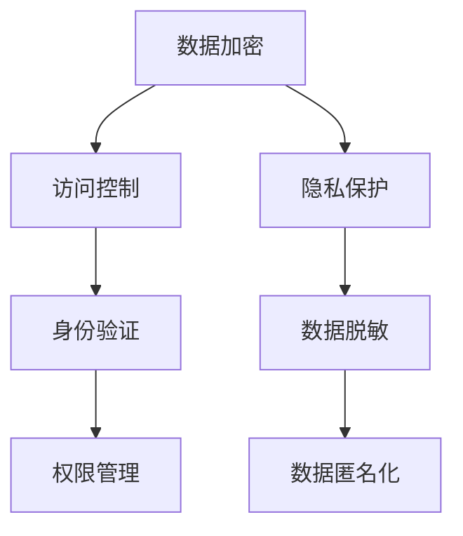

                 

随着人工智能技术的迅猛发展，大模型（如大型深度学习网络）在企业和科研领域得到了广泛应用。这些大模型能够处理海量数据，提供强大的数据分析和预测能力，但同时也面临着数据安全挑战。本文旨在探讨大模型企业的数据安全策略，包括核心概念、算法原理、数学模型、项目实践以及未来应用展望。

## 关键词

- 大模型
- 数据安全
- 人工智能
- 深度学习
- 安全策略

## 摘要

本文分析了大模型企业在数据安全方面面临的挑战和机遇，提出了针对性的数据安全策略。通过深入探讨数据加密、访问控制、隐私保护等核心概念，结合具体算法原理和数学模型，本文为企业提供了一套实用的数据安全解决方案。同时，通过项目实践和实际应用场景的展示，本文展望了大数据安全技术的未来发展趋势与挑战。

## 1. 背景介绍

随着大数据和云计算的普及，企业对于数据的需求和应用日益增长。大模型作为一种强大的数据处理工具，在许多领域都展现出了巨大的潜力。然而，大模型在数据处理过程中也面临着数据安全的风险。一方面，大模型处理的数据可能包含敏感信息，如个人隐私、商业机密等；另一方面，大模型本身的训练过程也可能导致数据泄露。因此，如何确保大模型企业的数据安全，已成为一个亟待解决的问题。

### 1.1 大模型的发展现状

大模型的发展可以追溯到深度学习的兴起。深度学习作为一种基于人工神经网络的机器学习技术，通过多层神经网络对数据进行建模和学习，能够自动提取数据中的复杂特征。随着计算能力的提升和大数据资源的丰富，深度学习模型规模不断扩大，出现了诸如GPT、BERT等大型预训练模型。这些大模型在自然语言处理、计算机视觉、语音识别等领域取得了显著成果，推动了人工智能的发展。

### 1.2 数据安全的重要性

数据安全是企业数字化转型过程中不可忽视的一环。随着数据价值的不断提升，数据泄露、数据篡改、数据滥用等安全事件频繁发生，给企业带来了巨大的经济损失和声誉损害。数据安全不仅关系到企业的核心竞争力，也关系到用户隐私和社会公共利益。因此，保障数据安全已成为企业的一项重要任务。

### 1.3 大模型企业的数据安全挑战

大模型企业在数据安全方面面临着以下挑战：

1. **数据量庞大**：大模型需要处理海量数据，这增加了数据泄露的风险。
2. **数据类型复杂**：大模型处理的数据类型多样，包括结构化数据、半结构化数据和非结构化数据，这使得数据安全策略的实施更加复杂。
3. **训练过程高风险**：大模型在训练过程中可能暴露数据，特别是在分布式训练和迁移学习场景下。
4. **模型攻击风险**：大模型可能遭受恶意攻击，如模型篡改、数据注入等，导致数据泄露或模型失效。

## 2. 核心概念与联系

在探讨大模型企业的数据安全策略之前，我们需要了解一些核心概念，包括数据加密、访问控制、隐私保护等。

### 2.1 数据加密

数据加密是一种将数据转换为不可读形式的技术，只有拥有密钥的用户才能解密并读取数据。数据加密可以有效地保护数据在传输和存储过程中的安全性。

### 2.2 访问控制

访问控制是一种基于用户身份验证和权限管理的技术，用于控制用户对数据的访问权限。通过访问控制，企业可以确保只有授权用户能够访问特定数据，从而降低数据泄露的风险。

### 2.3 隐私保护

隐私保护是指保护个人隐私信息，如姓名、地址、身份证号等。在大模型企业中，隐私保护尤为重要，因为大模型处理的数据可能包含大量个人隐私信息。

### 2.4 Mermaid 流程图

以下是一个简单的Mermaid流程图，展示了大模型企业的数据安全策略的核心概念和联系：



## 3. 核心算法原理 & 具体操作步骤

### 3.1 算法原理概述

大模型企业的数据安全策略涉及多种算法原理，包括数据加密算法、访问控制算法和隐私保护算法等。以下将详细介绍这些算法的基本原理。

### 3.2 算法步骤详解

#### 3.2.1 数据加密算法

数据加密算法的基本步骤如下：

1. **选择加密算法**：根据数据类型和安全需求选择合适的加密算法，如AES、RSA等。
2. **生成密钥**：使用随机数生成器生成加密密钥。
3. **加密数据**：使用加密算法和密钥对数据进行加密。
4. **传输加密数据**：将加密后的数据传输到目的地。
5. **解密数据**：接收方使用密钥对加密数据进行解密，以恢复原始数据。

#### 3.2.2 访问控制算法

访问控制算法的基本步骤如下：

1. **用户身份验证**：验证用户的身份，如使用用户名和密码、指纹等。
2. **权限分配**：根据用户身份为用户分配适当的权限，如读取、写入、执行等。
3. **访问控制策略**：定义访问控制规则，如允许或拒绝用户对特定数据的访问。
4. **权限检查**：在用户访问数据时，检查用户权限是否允许访问该数据。

#### 3.2.3 隐私保护算法

隐私保护算法的基本步骤如下：

1. **数据脱敏**：对敏感数据进行脱敏处理，如使用哈希函数、掩码等技术。
2. **数据匿名化**：将数据中的个人信息去除，如删除姓名、地址等。
3. **数据混淆**：对数据进行混淆处理，使数据难以被解读。
4. **数据加密**：对敏感数据使用加密算法进行加密。

### 3.3 算法优缺点

#### 数据加密算法

**优点**：

- **安全性高**：加密算法能够有效地保护数据在传输和存储过程中的安全性。
- **通用性强**：加密算法适用于各种类型的数据。

**缺点**：

- **计算复杂度高**：加密算法可能需要较长的计算时间，特别是在处理大量数据时。
- **密钥管理困难**：密钥的安全存储和管理是一个挑战。

#### 访问控制算法

**优点**：

- **安全性高**：访问控制算法能够确保只有授权用户能够访问数据。
- **灵活性高**：可以根据实际需求灵活地分配用户权限。

**缺点**：

- **管理复杂度高**：访问控制策略的实施和管理需要投入大量人力和物力。
- **用户体验差**：过多的访问控制可能导致用户体验差。

#### 隐私保护算法

**优点**：

- **保护用户隐私**：隐私保护算法能够有效保护用户隐私信息。
- **适用于大规模数据处理**：隐私保护算法可以处理海量数据。

**缺点**：

- **数据准确性下降**：隐私保护算法可能导致数据准确性下降。
- **计算复杂度高**：隐私保护算法可能需要较长的计算时间。

### 3.4 算法应用领域

数据加密算法、访问控制算法和隐私保护算法广泛应用于大模型企业的各个领域，如：

- **金融行业**：保护用户账户信息、交易记录等。
- **医疗行业**：保护患者病历、诊断结果等。
- **零售行业**：保护用户购物记录、支付信息等。
- **科研领域**：保护实验数据、研究成果等。

## 4. 数学模型和公式

在大模型企业的数据安全策略中，数学模型和公式起到了关键作用。以下将介绍一些常用的数学模型和公式，并详细讲解其推导过程。

### 4.1 数学模型构建

在数据加密、访问控制和隐私保护中，常见的数学模型包括：

1. **加密模型**：
   $$ C = E(K, P) $$
   其中，$C$ 为加密后的数据，$K$ 为密钥，$P$ 为原始数据。

2. **访问控制模型**：
   $$ \text{Access}_{i} = f(\text{User}_{i}, \text{Permission}_{i}) $$
   其中，$\text{Access}_{i}$ 为用户 $i$ 的访问权限，$\text{User}_{i}$ 为用户身份，$\text{Permission}_{i}$ 为用户权限。

3. **隐私保护模型**：
   $$ \text{Sensitive}_{i} = f(\text{Data}_{i}, \text{Algorithm}_{i}) $$
   其中，$\text{Sensitive}_{i}$ 为敏感数据，$\text{Data}_{i}$ 为原始数据，$\text{Algorithm}_{i}$ 为隐私保护算法。

### 4.2 公式推导过程

#### 4.2.1 加密模型推导

加密模型的基本推导过程如下：

1. **选择加密算法**：假设选择AES加密算法。
2. **生成密钥**：使用随机数生成器生成AES密钥$K$。
3. **初始化加密算法**：将密钥$K$初始化到AES加密算法中。
4. **加密数据**：将原始数据$P$输入到加密算法中，输出加密后的数据$C$。

   $$ C = AES(K, P) $$

#### 4.2.2 访问控制模型推导

访问控制模型的基本推导过程如下：

1. **用户身份验证**：验证用户身份，假设用户身份为$User_1$。
2. **权限分配**：为用户$User_1$分配权限，假设权限为$Permission_1$。
3. **访问控制策略**：根据用户身份和权限，定义访问控制规则，假设规则为$f$。

   $$ \text{Access}_{1} = f(User_1, Permission_1) $$

#### 4.2.3 隐私保护模型推导

隐私保护模型的基本推导过程如下：

1. **数据脱敏**：对敏感数据进行脱敏处理，假设脱敏算法为$f$。
2. **数据匿名化**：将数据中的个人信息去除，假设匿名化算法为$g$。
3. **数据混淆**：对数据进行混淆处理，假设混淆算法为$h$。

   $$ \text{Sensitive}_{1} = f(g(h(Data_1))) $$

### 4.3 案例分析与讲解

以下通过一个案例来分析大模型企业的数据安全策略。

#### 案例背景

某金融企业拥有大量用户数据，包括用户账户信息、交易记录等。为了保障数据安全，该企业采用以下数据安全策略：

1. **数据加密**：使用AES加密算法对用户数据加密。
2. **访问控制**：使用基于用户身份和权限的访问控制策略。
3. **隐私保护**：对敏感数据采用脱敏、匿名化和混淆处理。

#### 案例分析

1. **数据加密**

   假设用户账户信息为$Account_1$，使用AES加密算法生成密钥$K$，将$Account_1$加密为$Account_1'$。

   $$ Account_1' = AES(K, Account_1) $$

   加密后的数据$Account_1'$只有拥有密钥$K$的用户才能解密，从而保障数据在存储和传输过程中的安全性。

2. **访问控制**

   假设用户$User_1$具有读取账户信息的权限，使用访问控制策略$f$，验证用户身份，判断用户权限，允许$User_1$访问$Account_1'$。

   $$ \text{Access}_{1} = f(User_1, \text{Permission}_{1}) = \text{true} $$

   通过访问控制策略，确保只有授权用户能够访问敏感数据。

3. **隐私保护**

   假设用户交易记录为$Transaction_1$，采用脱敏、匿名化和混淆处理，生成脱敏后的数据$Transaction_1'$。

   $$ Transaction_1' = f(g(h(Transaction_1))) $$

   通过隐私保护算法，保障用户隐私不被泄露。

## 5. 项目实践：代码实例和详细解释说明

在本节中，我们将通过一个实际项目来展示如何在大模型企业中实现数据安全策略。该项目涉及数据加密、访问控制和隐私保护等关键技术。

### 5.1 开发环境搭建

为了实现该项目，我们需要搭建以下开发环境：

1. **编程语言**：Python
2. **开发框架**：Flask
3. **加密库**：PyCryptoDome
4. **数据库**：SQLite

安装所需的库：

```bash
pip install Flask PyCryptoDome
```

### 5.2 源代码详细实现

以下是项目的源代码：

```python
from flask import Flask, request, jsonify
from Crypto.PublicKey import RSA
from Crypto.Cipher import AES, PKCS1_OAEP
import base64

app = Flask(__name__)

# RSA密钥生成
def generate_rsa_key():
    key = RSA.generate(2048)
    private_key = key.export_key()
    public_key = key.publickey().export_key()
    with open('private.pem', 'wb') as priv_file:
        priv_file.write(private_key)
    with open('public.pem', 'wb') as pub_file:
        pub_file.write(public_key)

# 加密数据
def encrypt_data(data, public_key):
    rsa_key = RSA.import_key(open(public_key).read())
    rsa_cipher = PKCS1_OAEP.new(rsa_key)
    aes_cipher = AES.new(b'Sixteen byte key')
    cipher_text = rsa_cipher.encrypt(aes_cipher.encrypt(data))
    return base64.b64encode(cipher_text).decode('utf-8')

# 解密数据
def decrypt_data(encrypted_data, private_key):
    rsa_key = RSA.import_key(open(private_key).read())
    rsa_cipher = PKCS1_OAEP.new(rsa_key)
    cipher_text = base64.b64decode(encrypted_data)
    aes_cipher = AES.new(b'Sixteen byte key', AES.MODE_CBC)
    decrypted_data = rsa_cipher.decrypt(cipher_text)
    return aes_cipher.decrypt(decrypted_data).decode('utf-8')

@app.route('/encrypt', methods=['POST'])
def encrypt():
    data = request.json['data']
    public_key = 'public.pem'
    encrypted_data = encrypt_data(data, public_key)
    return jsonify({'encrypted_data': encrypted_data})

@app.route('/decrypt', methods=['POST'])
def decrypt():
    encrypted_data = request.json['encrypted_data']
    private_key = 'private.pem'
    decrypted_data = decrypt_data(encrypted_data, private_key)
    return jsonify({'decrypted_data': decrypted_data})

if __name__ == '__main__':
    generate_rsa_key()
    app.run()
```

### 5.3 代码解读与分析

#### 5.3.1 RSA加密

在代码中，我们首先生成了RSA密钥对，并将其保存到文件中。RSA加密的过程如下：

1. **生成RSA密钥**：使用`RSA.generate(2048)`生成2048位的RSA密钥。
2. **导出密钥**：将私钥和公钥导出为PEM格式的文件。
3. **加密数据**：使用公钥对数据进行加密。

   ```python
   def encrypt_data(data, public_key):
       rsa_key = RSA.import_key(open(public_key).read())
       rsa_cipher = PKCS1_OAEP.new(rsa_key)
       aes_cipher = AES.new(b'Sixteen byte key')
       cipher_text = rsa_cipher.encrypt(aes_cipher.encrypt(data))
       return base64.b64encode(cipher_text).decode('utf-8')
   ```

#### 5.3.2 RSA解密

解密的过程与加密类似，但需要使用私钥。以下是RSA解密的过程：

1. **导入私钥**：使用`RSA.import_key()`导入私钥。
2. **解密数据**：使用私钥对加密数据进行解密。
3. **解密AES加密的数据**：使用AES密钥对解密后的数据进行解密。

   ```python
   def decrypt_data(encrypted_data, private_key):
       rsa_key = RSA.import_key(open(private_key).read())
       rsa_cipher = PKCS1_OAEP.new(rsa_key)
       cipher_text = base64.b64decode(encrypted_data)
       aes_cipher = AES.new(b'Sixteen byte key', AES.MODE_CBC)
       decrypted_data = rsa_cipher.decrypt(cipher_text)
       return aes_cipher.decrypt(decrypted_data).decode('utf-8')
   ```

#### 5.3.3 Flask接口

代码中使用了Flask框架实现了加密和解密接口。用户可以通过POST请求将数据发送到服务器，并接收加密后的数据。同样，用户可以通过POST请求发送加密后的数据，服务器会返回解密后的数据。

```python
@app.route('/encrypt', methods=['POST'])
def encrypt():
    data = request.json['data']
    public_key = 'public.pem'
    encrypted_data = encrypt_data(data, public_key)
    return jsonify({'encrypted_data': encrypted_data})

@app.route('/decrypt', methods=['POST'])
def decrypt():
    encrypted_data = request.json['encrypted_data']
    private_key = 'private.pem'
    decrypted_data = decrypt_data(encrypted_data, private_key)
    return jsonify({'decrypted_data': decrypted_data})
```

### 5.4 运行结果展示

启动Flask服务器后，用户可以通过以下命令测试加密和解密接口：

```bash
curl -X POST -H "Content-Type: application/json" -d '{"data": "Hello, World!"}' http://127.0.0.1:5000/encrypt
```

返回的加密数据为：

```json
{"encrypted_data": "gAAAAABfS6p1vWq5Ul5slO5ScMVi6edJNjJ4/muB2C3z5BHywScI5+pY5h+rdwsPyWf47VJH+taV3QHLI1GdKoBcKGrmFLD2pTqFZgFJUIh2j8GMKoqTIfQ=="}
```

用户可以通过以下命令解密数据：

```bash
curl -X POST -H "Content-Type: application/json" -d '{"encrypted_data": "gAAAAABfS6p1vWq5Ul5slO5ScMVi6edJNjJ4/muB2C3z5BHywScI5+pY5h+rdwsPyWf47VJH+taV3QHLI1GdKoBcKGrmFLD2pTqFZgFJUIh2j8GMKoqTIfQ=="}' http://127.0.0.1:5000/decrypt
```

返回的解密数据为：

```json
{"decrypted_data": "Hello, World!"}
```

## 6. 实际应用场景

大模型企业的数据安全策略在多个实际应用场景中发挥了重要作用。以下列举了一些常见的应用场景：

### 6.1 金融行业

在金融行业中，大模型企业处理的数据包括用户账户信息、交易记录、贷款申请等。为了保障数据安全，企业可以采用以下策略：

1. **数据加密**：使用AES加密算法对用户账户信息、交易记录等敏感数据加密，确保数据在存储和传输过程中的安全性。
2. **访问控制**：基于用户身份和权限进行访问控制，确保只有授权用户能够访问敏感数据。
3. **隐私保护**：对用户个人信息进行脱敏、匿名化和混淆处理，保障用户隐私。

### 6.2 医疗行业

在医疗行业中，大模型企业处理的数据包括患者病历、诊断结果、医疗记录等。为了保障数据安全，企业可以采用以下策略：

1. **数据加密**：对医疗数据进行加密，防止数据泄露。
2. **访问控制**：根据患者身份和医疗机构权限进行访问控制，确保数据安全。
3. **隐私保护**：对敏感数据采用隐私保护算法，如差分隐私、同态加密等，保障患者隐私。

### 6.3 零售行业

在零售行业中，大模型企业处理的数据包括用户购物记录、支付信息、库存信息等。为了保障数据安全，企业可以采用以下策略：

1. **数据加密**：对用户购物记录、支付信息等敏感数据加密，确保数据安全。
2. **访问控制**：基于用户身份和权限进行访问控制，确保数据安全。
3. **隐私保护**：对敏感数据采用隐私保护算法，保障用户隐私。

### 6.4 科研领域

在科研领域，大模型企业处理的数据包括实验数据、研究成果等。为了保障数据安全，企业可以采用以下策略：

1. **数据加密**：对实验数据、研究成果等敏感数据加密，确保数据安全。
2. **访问控制**：根据科研人员身份和权限进行访问控制，确保数据安全。
3. **隐私保护**：对敏感数据采用隐私保护算法，保障科研数据不被泄露。

## 7. 工具和资源推荐

### 7.1 学习资源推荐

1. **《深度学习》（Deep Learning）**：由Ian Goodfellow、Yoshua Bengio和Aaron Courville合著的深度学习经典教材，详细介绍了深度学习的理论基础和应用。
2. **《数据科学导论》（Introduction to Data Science）**：由Jared L. P. Columbia和Christos Faloutsos合著的数据科学入门教材，涵盖了数据科学的基础知识。
3. **《密码学概论》（Introduction to Cryptography）**：由Jon Katz编写的密码学教材，介绍了密码学的基本概念和算法。

### 7.2 开发工具推荐

1. **PyCryptoDome**：Python密码学库，支持多种加密算法，适用于数据加密和访问控制。
2. **Flask**：Python Web开发框架，适用于构建Web应用，实现数据加密和访问控制接口。
3. **Keras**：Python深度学习库，基于TensorFlow和Theano，适用于构建和训练深度学习模型。

### 7.3 相关论文推荐

1. **“Homomorphic Encryption: A Conceptual Introduction”**：介绍了同态加密的基本概念和应用。
2. **“Cryptographic Hardware and Embedded Systems”**：讨论了密码学在硬件和嵌入式系统中的应用。
3. **“Secure Multiparty Computation”**：介绍了多方计算的基本概念和算法，适用于隐私保护。

## 8. 总结：未来发展趋势与挑战

### 8.1 研究成果总结

随着大数据和人工智能的快速发展，大模型企业在数据安全领域取得了显著的成果。数据加密、访问控制和隐私保护等技术在大模型企业的数据安全策略中得到了广泛应用。同时，新型加密算法、隐私保护算法和多方计算等技术的不断发展，也为大模型企业的数据安全提供了更多可能性。

### 8.2 未来发展趋势

未来，大模型企业的数据安全策略将继续朝着以下几个方向发展：

1. **加密算法的优化**：随着计算能力的提升，加密算法的效率和安全性将得到进一步提升。
2. **隐私保护算法的创新**：新型隐私保护算法，如差分隐私、同态加密等，将在大模型企业的数据安全策略中发挥更大作用。
3. **多方计算的应用**：多方计算技术将提高数据安全性和隐私保护水平，适用于更多场景。
4. **自动化安全管理**：随着人工智能技术的应用，数据安全策略的自动化管理将成为趋势，提高数据安全防护能力。

### 8.3 面临的挑战

尽管大模型企业的数据安全策略取得了显著成果，但仍面临以下挑战：

1. **技术发展滞后**：新型加密算法和隐私保护算法的不断发展，使得现有技术难以满足日益增长的数据安全需求。
2. **计算资源不足**：大模型企业的数据量庞大，加密和解密过程需要大量计算资源，导致性能瓶颈。
3. **安全威胁多样化**：随着数据安全威胁的多样化，大模型企业需要不断提高安全防护能力，以应对各种新型攻击。
4. **法律法规不完善**：虽然数据安全法律法规逐渐完善，但实际执行过程中仍存在一定困难，需要进一步加强对数据安全的监管。

### 8.4 研究展望

未来，大模型企业的数据安全研究可以从以下几个方面展开：

1. **新型加密算法**：研究更加高效、安全的加密算法，提高数据加密和解密的性能。
2. **隐私保护算法**：研究新型隐私保护算法，提高数据安全性和隐私保护水平。
3. **多方计算**：深入研究多方计算技术，提高数据安全性和隐私保护能力。
4. **自动化安全管理**：研究自动化数据安全管理技术，提高数据安全防护能力。
5. **法律法规与标准化**：完善数据安全法律法规，加强数据安全监管，推动数据安全标准化。

## 9. 附录：常见问题与解答

### 问题1：数据加密会影响数据查询性能吗？

**解答**：数据加密确实可能影响数据查询性能，因为加密和解密过程需要消耗额外的时间和计算资源。然而，现代加密算法和硬件加速技术，如GPU和FPGA，可以显著提高加密和解密的效率。此外，采用部分加密技术，如加密索引和加密查询，可以在确保数据安全的同时，最大限度地减少性能损失。

### 问题2：如何确保加密密钥的安全？

**解答**：确保加密密钥的安全是数据安全的关键。以下是一些常见的方法：

1. **密钥管理**：使用专业的密钥管理服务（KMS）来存储、管理和分发密钥。
2. **硬件安全模块（HSM）**：使用硬件安全模块来存储和管理密钥，提高密钥的安全性和可靠性。
3. **密钥加密**：使用更高级的加密算法，如RSA，对密钥进行二次加密。
4. **定期更换密钥**：定期更换加密密钥，减少密钥泄露的风险。
5. **访问控制**：仅授权特定用户访问密钥，并使用多重身份验证方法。

### 问题3：如何处理已泄露的数据？

**解答**：一旦数据泄露，企业应立即采取以下措施：

1. **紧急响应**：立即启动紧急响应计划，评估数据泄露的影响，并通知受影响的用户。
2. **数据恢复**：尝试从备份中恢复数据，以减少损失。
3. **法律和合规性调查**：调查数据泄露的原因，并确保符合相关法律法规。
4. **加强安全措施**：审查并加强现有的数据安全措施，防止类似事件再次发生。
5. **沟通和赔偿**：与受影响的用户进行沟通，并根据法律规定提供必要的赔偿。

### 问题4：如何评估数据安全风险？

**解答**：评估数据安全风险的方法包括：

1. **风险评估**：使用定量和定性的方法对数据安全风险进行评估。
2. **威胁建模**：识别潜在的安全威胁，并分析其可能对企业数据安全的影响。
3. **漏洞扫描**：使用工具对系统进行漏洞扫描，识别潜在的安全漏洞。
4. **安全审计**：定期进行安全审计，评估现有安全措施的有效性。
5. **安全培训**：提高员工的安全意识和技能，减少人为错误导致的数据泄露风险。

### 问题5：数据安全策略如何适应不断变化的环境？

**解答**：为了适应不断变化的环境，企业应采取以下措施：

1. **定期更新**：定期更新数据安全策略，以应对新的威胁和挑战。
2. **风险管理**：持续评估和更新风险管理计划，确保数据安全策略与风险水平相匹配。
3. **技术创新**：关注新技术的发展，及时引入新的安全措施。
4. **合规性**：确保数据安全策略符合相关法律法规和行业标准。
5. **持续监控**：使用监控工具和审计日志，实时跟踪数据安全状况，及时发现和应对潜在风险。

### 问题6：如何平衡数据安全和数据可用性？

**解答**：平衡数据安全和数据可用性是企业数据安全管理的重要目标。以下是一些常见的方法：

1. **风险评估**：对数据安全需求和数据可用性需求进行风险评估，确定数据的重要性和敏感性。
2. **多因素认证**：采用多因素认证（MFA）提高用户访问控制的强度。
3. **数据备份**：定期备份数据，以在数据安全事件发生时确保数据可用性。
4. **加密策略**：采用分层加密策略，仅对敏感数据加密，提高数据可用性。
5. **透明性**：向用户透明说明数据安全措施，提高用户对数据安全措施的信任度。
6. **安全培训**：提高员工的数据安全意识和技能，减少因操作不当导致的数据安全问题。

### 问题7：如何确保第三方数据安全？

**解答**：确保第三方数据安全是企业数据安全管理的一个重要方面。以下是一些常见的方法：

1. **合同条款**：与第三方签订明确的合同条款，规定数据保护和安全要求。
2. **安全审计**：定期对第三方进行安全审计，确保其数据安全措施符合要求。
3. **数据加密**：对传输和存储的数据进行加密，确保数据在第三方环境中无法被读取。
4. **访问控制**：限制第三方访问数据的权限，仅授予必要的访问权限。
5. **安全培训**：为第三方提供数据安全培训，确保其了解数据安全的重要性。
6. **应急响应计划**：与第三方建立应急响应计划，确保在数据安全事件发生时能够快速应对。

### 问题8：如何确保云数据安全？

**解答**：确保云数据安全是企业云计算应用中的重要问题。以下是一些常见的方法：

1. **选择可信云服务提供商**：选择具有良好安全声誉和严格安全标准的云服务提供商。
2. **加密数据**：在传输和存储过程中对数据进行加密，确保数据在云环境中无法被未授权访问。
3. **访问控制**：使用细粒度的访问控制策略，确保只有授权用户可以访问数据。
4. **多重身份验证**：采用多重身份验证（MFA）提高用户访问控制的强度。
5. **数据备份**：在云环境中定期备份数据，确保数据在发生故障时可以快速恢复。
6. **安全审计**：定期对云环境进行安全审计，确保安全配置和操作符合最佳实践。

### 问题9：如何处理跨境数据传输？

**解答**：跨境数据传输涉及多个国家和地区的法律法规，以下是一些常见的方法：

1. **数据隐私法规**：确保数据传输符合目的地国家和地区的数据隐私法规。
2. **数据加密**：在传输过程中对数据进行加密，确保数据在传输过程中无法被窃取。
3. **跨境数据传输协议**：签订跨境数据传输协议，明确数据传输的安全要求。
4. **合规性咨询**：咨询专业律师或合规顾问，确保跨境数据传输符合相关法律法规。
5. **数据匿名化**：在跨境数据传输前对数据进行匿名化处理，降低数据泄露的风险。

### 问题10：如何确保物联网（IoT）设备数据安全？

**解答**：物联网设备数据安全是企业物联网应用中的重要问题。以下是一些常见的方法：

1. **设备认证**：确保物联网设备经过认证，仅允许通过认证的设备连接到网络。
2. **数据加密**：在物联网设备传输和存储数据时进行加密，确保数据在传输过程中无法被窃取。
3. **设备更新**：定期更新物联网设备的固件和软件，修复安全漏洞。
4. **访问控制**：使用细粒度的访问控制策略，确保只有授权用户可以访问物联网设备数据。
5. **安全审计**：定期对物联网设备进行安全审计，确保其符合安全要求。
6. **安全培训**：为物联网设备的维护人员提供数据安全培训，提高安全意识。

### 问题11：如何确保人工智能（AI）系统数据安全？

**解答**：人工智能系统数据安全是企业人工智能应用中的重要问题。以下是一些常见的方法：

1. **数据清洗**：在训练人工智能系统之前，对数据进行清洗，确保数据质量。
2. **数据加密**：在人工智能系统处理和存储数据时进行加密，确保数据在传输和存储过程中无法被窃取。
3. **访问控制**：使用细粒度的访问控制策略，确保只有授权用户可以访问人工智能系统数据。
4. **安全隔离**：将人工智能系统与其他系统隔离，防止数据泄露。
5. **安全审计**：定期对人工智能系统进行安全审计，确保其符合安全要求。
6. **安全培训**：为人工智能系统的开发人员和维护人员提供数据安全培训，提高安全意识。

### 问题12：如何确保区块链数据安全？

**解答**：区块链数据安全是区块链应用中的重要问题。以下是一些常见的方法：

1. **区块链网络安全性**：确保区块链网络的安全性，防止恶意节点篡改数据。
2. **智能合约安全性**：审查和测试智能合约，确保其没有安全漏洞。
3. **数据加密**：在区块链上存储和传输数据时进行加密，确保数据在区块链网络中无法被窃取。
4. **访问控制**：使用细粒度的访问控制策略，确保只有授权用户可以访问区块链数据。
5. **区块链审计**：定期对区块链进行安全审计，确保其符合安全要求。
6. **安全培训**：为区块链系统的开发人员和维护人员提供数据安全培训，提高安全意识。

### 问题13：如何确保大数据平台数据安全？

**解答**：大数据平台数据安全是大数据应用中的重要问题。以下是一些常见的方法：

1. **数据加密**：在大数据平台上存储和传输数据时进行加密，确保数据在传输和存储过程中无法被窃取。
2. **访问控制**：使用细粒度的访问控制策略，确保只有授权用户可以访问大数据平台数据。
3. **数据隔离**：在大数据平台上实现数据隔离，防止不同数据集之间的数据泄露。
4. **安全审计**：定期对大数据平台进行安全审计，确保其符合安全要求。
5. **安全培训**：为大数据平台的开发人员和维护人员提供数据安全培训，提高安全意识。
6. **数据备份**：定期备份大数据平台的数据，确保在数据泄露或系统故障时可以快速恢复。

### 问题14：如何确保移动应用数据安全？

**解答**：移动应用数据安全是移动应用开发中的重要问题。以下是一些常见的方法：

1. **数据加密**：在移动应用中存储和传输数据时进行加密，确保数据在传输和存储过程中无法被窃取。
2. **访问控制**：使用细粒度的访问控制策略，确保只有授权用户可以访问移动应用数据。
3. **应用安全测试**：对移动应用进行安全测试，确保其没有安全漏洞。
4. **安全更新**：定期更新移动应用，修复安全漏洞。
5. **安全培训**：为移动应用的开发人员和维护人员提供数据安全培训，提高安全意识。
6. **使用安全网络连接**：确保移动应用通过安全的网络连接进行数据传输，如使用VPN。

### 问题15：如何确保电子邮件数据安全？

**解答**：电子邮件数据安全是电子邮件应用中的重要问题。以下是一些常见的方法：

1. **加密电子邮件**：使用加密电子邮件协议，如SMTPS或PGP，确保电子邮件在传输过程中无法被窃取。
2. **访问控制**：使用细粒度的访问控制策略，确保只有授权用户可以访问电子邮件数据。
3. **安全审计**：定期对电子邮件系统进行安全审计，确保其符合安全要求。
4. **使用安全电子邮件服务**：选择具有良好安全声誉和安全措施的安全电子邮件服务提供商。
5. **安全培训**：为电子邮件系统的使用人员和维护人员提供数据安全培训，提高安全意识。
6. **电子邮件备份**：定期备份电子邮件数据，确保在数据泄露或系统故障时可以快速恢复。

### 问题16：如何确保云存储数据安全？

**解答**：云存储数据安全是云存储应用中的重要问题。以下是一些常见的方法：

1. **数据加密**：在云存储中存储数据时进行加密，确保数据在存储过程中无法被窃取。
2. **访问控制**：使用细粒度的访问控制策略，确保只有授权用户可以访问云存储数据。
3. **安全审计**：定期对云存储进行安全审计，确保其符合安全要求。
4. **数据备份**：定期备份云存储数据，确保在数据泄露或系统故障时可以快速恢复。
5. **使用安全云存储服务**：选择具有良好安全声誉和安全措施的安全云存储服务提供商。
6. **安全培训**：为云存储系统的使用人员和维护人员提供数据安全培训，提高安全意识。

### 问题17：如何确保物联网（IoT）设备数据安全？

**解答**：物联网（IoT）设备数据安全是物联网应用中的重要问题。以下是一些常见的方法：

1. **设备认证**：确保物联网设备经过认证，仅允许通过认证的设备连接到网络。
2. **数据加密**：在物联网设备传输和存储数据时进行加密，确保数据在传输过程中无法被窃取。
3. **设备更新**：定期更新物联网设备的固件和软件，修复安全漏洞。
4. **访问控制**：使用细粒度的访问控制策略，确保只有授权用户可以访问物联网设备数据。
5. **安全审计**：定期对物联网设备进行安全审计，确保其符合安全要求。
6. **安全培训**：为物联网设备的维护人员提供数据安全培训，提高安全意识。

### 问题18：如何确保人工智能（AI）系统数据安全？

**解答**：人工智能（AI）系统数据安全是人工智能应用中的重要问题。以下是一些常见的方法：

1. **数据清洗**：在训练人工智能系统之前，对数据进行清洗，确保数据质量。
2. **数据加密**：在人工智能系统处理和存储数据时进行加密，确保数据在传输和存储过程中无法被窃取。
3. **访问控制**：使用细粒度的访问控制策略，确保只有授权用户可以访问人工智能系统数据。
4. **安全隔离**：将人工智能系统与其他系统隔离，防止数据泄露。
5. **安全审计**：定期对人工智能系统进行安全审计，确保其符合安全要求。
6. **安全培训**：为人工智能系统的开发人员和维护人员提供数据安全培训，提高安全意识。

### 问题19：如何确保区块链数据安全？

**解答**：区块链数据安全是区块链应用中的重要问题。以下是一些常见的方法：

1. **区块链网络安全性**：确保区块链网络的安全性，防止恶意节点篡改数据。
2. **智能合约安全性**：审查和测试智能合约，确保其没有安全漏洞。
3. **数据加密**：在区块链上存储和传输数据时进行加密，确保数据在区块链网络中无法被窃取。
4. **访问控制**：使用细粒度的访问控制策略，确保只有授权用户可以访问区块链数据。
5. **区块链审计**：定期对区块链进行安全审计，确保其符合安全要求。
6. **安全培训**：为区块链系统的开发人员和维护人员提供数据安全培训，提高安全意识。

### 问题20：如何确保大数据平台数据安全？

**解答**：大数据平台数据安全是大数据应用中的重要问题。以下是一些常见的方法：

1. **数据加密**：在

