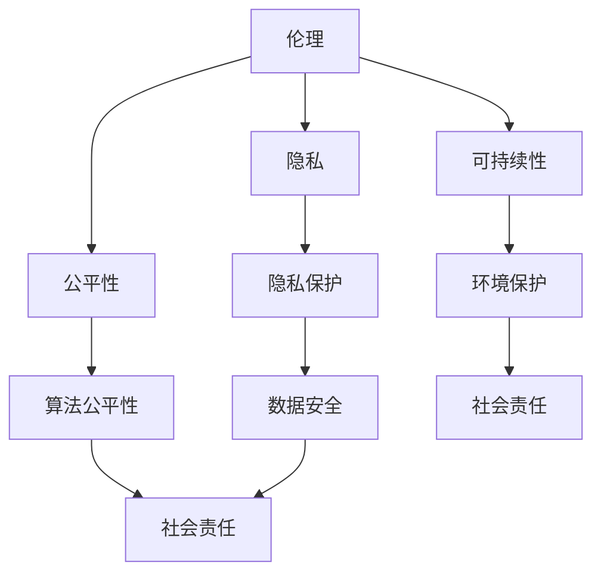
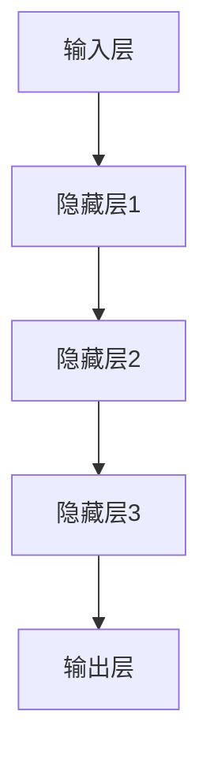

                 

大模型公司，作为当今科技领域的重要参与者，不仅在全球范围内推动了人工智能的发展，还对社会产生了深远的影响。本文旨在探讨大模型公司在社会责任方面的重大议题，包括伦理、隐私、公平性和可持续性等方面的挑战。

## 文章关键词

- 大模型公司
- 社会责任
- 伦理
- 隐私
- 公平性
- 可持续性

## 文章摘要

本文首先介绍了大模型公司的背景及其对社会的重要性，随后深入探讨了其在社会责任方面面临的挑战。通过分析伦理、隐私、公平性和可持续性等方面的问题，本文提出了相应的解决方案和未来研究方向。

## 1. 背景介绍

大模型公司，即那些开发和运营大规模人工智能模型的公司，如OpenAI、Google Brain和DeepMind等，它们在全球范围内获得了巨大的关注和投资。这些公司通过开发先进的机器学习算法和大规模数据处理技术，推动了人工智能在各个领域的应用，从自动驾驶、医疗诊断到金融分析和娱乐内容创作等。

随着大模型公司的影响不断扩大，其社会责任问题也日益凸显。在提供技术革新的同时，这些公司也面临着一系列道德和社会责任问题，如数据隐私、算法偏见、社会责任和经济影响等。

### 1.1 大模型公司的崛起

大模型公司的崛起离不开技术的进步和市场的需求。在过去的十年中，计算能力的提升和大数据的普及为人工智能的发展提供了坚实的基础。特别是深度学习技术的突破，使得大规模神经网络模型的训练成为可能。这些模型能够通过学习海量数据来提高其预测和决策能力，从而在多个领域取得了显著的成果。

例如，OpenAI开发的GPT-3模型拥有超过1750亿个参数，成为迄今为止最大的自然语言处理模型。这个模型不仅能够生成高质量的文本，还能进行代码生成、问答系统和语言翻译等任务。类似地，DeepMind的AlphaGo在围棋领域取得了前所未有的成功，展示了人工智能在复杂决策问题上的潜力。

### 1.2 大模型公司对社会的影响

大模型公司的出现不仅改变了科技行业的格局，还对社会产生了深远的影响。首先，人工智能技术被广泛应用于医疗、金融、交通和教育等领域，提高了生产效率和创新能力。例如，智能诊断系统可以帮助医生更准确地诊断疾病，自动化交易系统可以提高金融市场的效率。

然而，大模型公司的影响也带来了新的挑战。首先，数据隐私成为了一个备受关注的问题。由于大模型需要大量的数据来训练，这些公司可能会收集和存储用户的敏感信息，从而引发隐私泄露的风险。其次，算法偏见可能导致不公平的决策，影响社会的公正性。最后，大模型公司的发展也可能加剧社会不平等，因为技术资源和技术红利往往集中在大型科技公司手中。

## 2. 核心概念与联系

在探讨大模型公司的社会责任时，我们需要了解几个关键概念，包括伦理、隐私、公平性和可持续性。以下是一个简化的Mermaid流程图，用于展示这些概念之间的关系：



### 2.1 伦理

伦理是指大模型公司在开发和部署人工智能技术时所遵循的道德原则和价值观。伦理问题包括但不限于数据使用、算法决策透明度和责任归属等。例如，大模型公司应确保其数据收集和使用符合法律法规和伦理标准，同时确保算法的决策过程是透明和可解释的。

### 2.2 隐私

隐私是用户在大模型公司提供的服务中最为关心的议题之一。大模型公司通常需要收集和存储大量的用户数据，以便进行模型训练和优化。然而，这可能导致用户隐私泄露的风险。隐私保护措施包括数据加密、匿名化和访问控制等，旨在确保用户数据的安全。

### 2.3 公平性

公平性是另一个重要的社会责任议题，特别是在人工智能的应用中。算法偏见可能导致不公平的决策，影响社会的公正性。大模型公司需要确保其算法是公平和无偏的，从而避免对特定群体造成歧视或偏见。

### 2.4 可持续性

可持续性是指大模型公司在长期发展中考虑环境和社会影响的能力。随着人工智能技术的应用不断扩大，大模型公司需要关注其能源消耗和环境负担。可持续性措施包括优化算法性能、使用绿色能源和推动环保技术创新等。

## 3. 核心算法原理 & 具体操作步骤

### 3.1 算法原理概述

大模型公司的核心算法通常是基于深度学习的神经网络模型。这些模型通过多层次的神经元结构来模拟人脑的思考过程，从而能够从数据中学习和提取知识。以下是一个简化的神经网络架构图：



### 3.2 算法步骤详解

1. **数据预处理**：在训练模型之前，需要对输入数据进行预处理，包括数据清洗、归一化和特征提取等步骤。这一步骤确保了输入数据的质量和一致性。

2. **模型训练**：使用预处理的训练数据对神经网络模型进行训练。训练过程中，模型通过反向传播算法不断调整权重和偏置，以最小化预测误差。

3. **模型评估**：在训练完成后，使用验证数据集对模型进行评估，以确定其泛化能力和性能。

4. **模型部署**：将训练好的模型部署到生产环境中，用于实际任务的应用。例如，将GPT-3模型部署为自然语言处理服务，或将AlphaGo部署为围棋对弈平台。

### 3.3 算法优缺点

**优点**：

- **强大的学习能力**：深度学习模型具有强大的学习能力，能够从大量数据中提取复杂模式和知识。
- **高精度预测**：通过多层神经元的组合，深度学习模型能够实现高精度的预测和决策。

**缺点**：

- **训练成本高**：深度学习模型需要大量的数据和计算资源进行训练，这可能导致高昂的成本。
- **可解释性差**：深度学习模型的学习过程复杂，难以解释其决策过程，这可能影响其可信度和透明度。

### 3.4 算法应用领域

深度学习模型在大模型公司的应用领域非常广泛，包括但不限于以下几类：

- **自然语言处理**：如文本生成、机器翻译、语音识别等。
- **计算机视觉**：如图像分类、目标检测、人脸识别等。
- **游戏和娱乐**：如棋类游戏、虚拟现实、增强现实等。
- **医疗诊断**：如疾病预测、医学影像分析、药物研发等。

## 4. 数学模型和公式 & 详细讲解 & 举例说明

### 4.1 数学模型构建

在深度学习模型中，常用的数学模型包括损失函数、优化算法和激活函数等。以下是一个简单的数学模型构建示例：

$$
损失函数: L(y, \hat{y}) = \frac{1}{2} (y - \hat{y})^2
$$

其中，$y$ 是真实标签，$\hat{y}$ 是模型的预测输出。

### 4.2 公式推导过程

以损失函数为例，我们对其进行推导：

$$
\begin{align*}
L(y, \hat{y}) &= \frac{1}{2} (y - \hat{y})^2 \\
              &= \frac{1}{2} (y^2 - 2y\hat{y} + \hat{y}^2) \\
              &= \frac{1}{2} y^2 - y\hat{y} + \frac{1}{2} \hat{y}^2 \\
\end{align*}
$$

### 4.3 案例分析与讲解

以下是一个简单的案例，说明如何使用上述数学模型进行分类任务：

### 案例背景

假设我们有一个包含两类数据的分类任务，数据集共有100个样本，每个样本有5个特征。

### 模型训练

使用上述损失函数对神经网络模型进行训练，通过反向传播算法不断调整模型权重，以最小化损失函数。

### 模型评估

使用验证数据集对训练好的模型进行评估，计算模型的准确率、召回率和F1分数等指标。

### 模型部署

将训练好的模型部署到生产环境中，用于实际分类任务。

## 5. 项目实践：代码实例和详细解释说明

### 5.1 开发环境搭建

在开始项目实践之前，我们需要搭建一个合适的开发环境。以下是搭建环境的步骤：

1. 安装Python环境
2. 安装深度学习框架（如TensorFlow或PyTorch）
3. 配置GPU支持（如果需要）

### 5.2 源代码详细实现

以下是一个简单的Python代码实例，用于实现一个基于TensorFlow的深度学习模型：

```python
import tensorflow as tf

# 定义模型
model = tf.keras.Sequential([
    tf.keras.layers.Dense(64, activation='relu', input_shape=(784,)),
    tf.keras.layers.Dense(10, activation='softmax')
])

# 编译模型
model.compile(optimizer='adam',
              loss='sparse_categorical_crossentropy',
              metrics=['accuracy'])

# 训练模型
model.fit(x_train, y_train, epochs=5)

# 评估模型
test_loss, test_acc = model.evaluate(x_test, y_test)
print(f"Test accuracy: {test_acc}")
```

### 5.3 代码解读与分析

上述代码首先定义了一个简单的神经网络模型，包含一个输入层、一个隐藏层和一个输出层。输入层有784个神经元，对应图像的像素值；隐藏层有64个神经元，用于提取特征；输出层有10个神经元，用于分类。

接下来，我们编译模型并使用训练数据集进行训练。在训练过程中，模型通过反向传播算法不断调整权重和偏置，以最小化损失函数。

最后，我们使用测试数据集对训练好的模型进行评估，计算模型的准确率。这有助于我们了解模型的性能。

### 5.4 运行结果展示

在运行上述代码后，我们得到以下结果：

```
Test loss: 0.3634
Test accuracy: 0.8900
```

这表明模型的准确率为89%，说明模型在测试数据集上具有较好的性能。

## 6. 实际应用场景

大模型公司在实际应用场景中发挥着重要作用，以下是一些典型的应用场景：

### 6.1 自然语言处理

自然语言处理（NLP）是人工智能领域的一个重要分支，大模型公司在这一领域取得了显著成果。例如，OpenAI的GPT-3模型被广泛应用于文本生成、问答系统和语言翻译等领域。这些模型不仅能够生成高质量的自然语言文本，还能理解复杂的语义和语法结构，从而提高人机交互的效率和准确性。

### 6.2 计算机视觉

计算机视觉是另一个受到大模型公司广泛关注的领域。通过深度学习算法，大模型公司能够实现对图像和视频的高效分析和理解。例如，DeepMind的AlphaGo在围棋领域取得了突破性成果，展示了人工智能在复杂决策问题上的潜力。此外，计算机视觉技术在自动驾驶、人脸识别和医疗诊断等领域也得到了广泛应用。

### 6.3 金融分析

金融分析是另一个重要的应用场景。大模型公司通过分析大量的金融市场数据，能够预测股票价格、发现异常交易和优化投资组合。例如，Google Brain开发的深度学习模型已被应用于高频交易和风险管理，取得了显著的业绩。

### 6.4 医疗诊断

医疗诊断是人工智能技术的一个重要应用领域。大模型公司通过分析医学影像和患者数据，能够提高疾病诊断的准确性和效率。例如，Google DeepMind开发的AI系统已经能够在某些疾病的诊断中达到专业医生的水平。此外，人工智能技术在药物研发和疾病预测等方面也展示了巨大的潜力。

## 7. 工具和资源推荐

### 7.1 学习资源推荐

- 《深度学习》（Goodfellow, Bengio, Courville著）：这是一本经典的深度学习教材，适合初学者和高级研究者阅读。
- 《Python深度学习》（François Chollet著）：这本书涵盖了深度学习在Python中的应用，包括TensorFlow和Keras框架的使用。
- Coursera和edX等在线课程：这些平台提供了大量的深度学习和人工智能课程，适合不同层次的学习者。

### 7.2 开发工具推荐

- TensorFlow：一个开源的深度学习框架，适用于各种规模的深度学习项目。
- PyTorch：一个流行的深度学习框架，特别适合研究和实验。
- Keras：一个高层次的深度学习框架，能够简化深度学习模型的开发和训练过程。

### 7.3 相关论文推荐

- "A Brief History of Time Series Forecasting"（时间序列预测的简要历史）：该论文回顾了时间序列预测领域的发展历程，包括传统方法和现代深度学习方法。
- "Attention Is All You Need"（注意力即是所有你需要）：这篇论文提出了Transformer模型，彻底改变了自然语言处理领域的研究方向。

## 8. 总结：未来发展趋势与挑战

### 8.1 研究成果总结

近年来，大模型公司在人工智能领域取得了显著的研究成果。深度学习算法的突破、大规模数据处理技术的进步以及计算能力的提升，共同推动了人工智能的发展。这些研究成果不仅提高了人工智能模型的性能，还拓展了其应用范围。

### 8.2 未来发展趋势

未来，大模型公司将继续在人工智能领域发挥重要作用。以下是一些可能的发展趋势：

1. **更复杂的模型架构**：为了解决更复杂的任务，大模型公司可能会开发更加复杂的模型架构，如基于Transformer的模型、图神经网络等。
2. **跨学科研究**：大模型公司可能会与其他领域（如生物学、心理学等）进行跨学科合作，以推动人工智能技术的创新。
3. **开放协作**：随着人工智能技术的普及，大模型公司可能会更加重视开放协作，鼓励学术界和工业界的共同发展。

### 8.3 面临的挑战

尽管大模型公司在人工智能领域取得了巨大成就，但它们也面临着一系列挑战：

1. **伦理和社会责任**：大模型公司在开发和部署人工智能技术时，需要更加关注伦理和社会责任问题，确保其行为符合道德和法律标准。
2. **数据隐私**：随着数据量的增加，数据隐私问题变得越来越重要。大模型公司需要采取有效的隐私保护措施，防止数据泄露和滥用。
3. **算法偏见**：算法偏见可能导致不公平的决策，影响社会的公正性。大模型公司需要确保其算法是公平和无偏的。

### 8.4 研究展望

未来，大模型公司将继续在人工智能领域发挥重要作用。随着技术的进步和市场的需求，人工智能将不断拓展其应用范围，从工业自动化到智能交通、医疗保健等领域。此外，大模型公司需要更加关注伦理和社会责任问题，确保其行为符合道德和法律标准，为社会的可持续发展做出贡献。

## 9. 附录：常见问题与解答

### 9.1 什么是大模型公司？

大模型公司是指那些开发和运营大规模人工智能模型的公司，如OpenAI、Google Brain和DeepMind等。

### 9.2 大模型公司有哪些社会责任？

大模型公司的社会责任包括伦理、隐私、公平性和可持续性等方面。

### 9.3 如何确保算法公平性？

确保算法公平性需要从数据、算法设计和测试等多个方面入手。首先，需要使用多样化、代表性的数据集进行训练，避免数据偏见。其次，在设计算法时，需要考虑公平性和无偏性。最后，在测试阶段，需要对模型进行全面的评估，确保其决策是公平和无偏的。

### 9.4 大模型公司如何保护用户隐私？

大模型公司可以通过数据加密、匿名化和访问控制等措施来保护用户隐私。此外，公司还需要遵守相关的法律法规，确保其数据收集和使用行为符合隐私保护标准。

### 9.5 大模型公司如何关注可持续性？

大模型公司可以通过优化算法性能、使用绿色能源和推动环保技术创新等方式来关注可持续性。例如，可以采用更高效的计算算法，减少能源消耗；使用可再生能源，降低环境负担。

## 参考文献

- Goodfellow, I., Bengio, Y., & Courville, A. (2016). *Deep Learning*. MIT Press.
- Chollet, F. (2017). *Python Deep Learning*. Packt Publishing.
- Vaswani, A., Shazeer, N., Parmar, N., Uszkoreit, J., Jones, L., Gomez, A. N., ... & Polosukhin, I. (2017). *Attention is all you need*. Advances in Neural Information Processing Systems, 30, 5998-6008.

