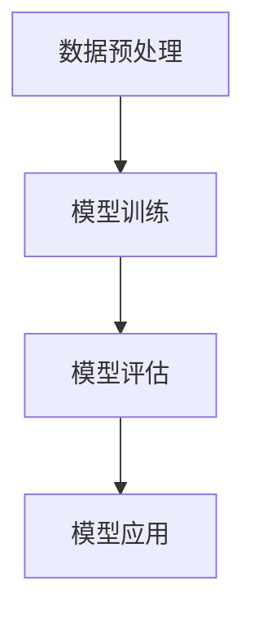
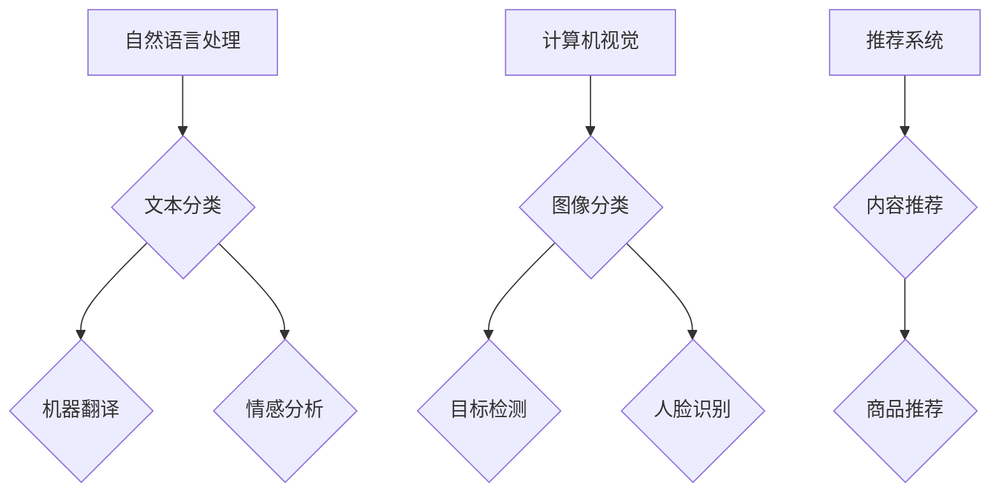

                 

关键词：大模型创业、人工智能、创新、挑战、技术、商业模式、未来展望

> 摘要：本文旨在探讨大模型创业所面临的创新与挑战。随着人工智能技术的快速发展，大模型作为核心驱动力之一，正引领着创业热潮。本文将从技术、商业模式和未来展望三个方面进行分析，旨在为大模型创业提供指导和建议。

## 1. 背景介绍

在过去的几年里，人工智能技术取得了显著的进展，特别是在深度学习领域。随着计算能力的提升和海量数据的积累，大模型（如BERT、GPT等）成为了当前人工智能研究的热点。大模型的应用范围也在不断扩展，从自然语言处理、计算机视觉到推荐系统等多个领域，都取得了令人瞩目的成果。

大模型创业正是在这样的背景下应运而生。创业公司通过构建和应用大模型，希望能够解决实际问题、创造商业价值。然而，大模型创业并非一帆风顺，面临着诸多创新与挑战。本文将从技术、商业模式和未来展望三个方面进行分析，以期为读者提供有益的参考。

## 2. 核心概念与联系

### 2.1 大模型定义与原理

大模型是指具有巨大参数量和计算量的深度学习模型，通常采用神经网络架构。大模型的核心原理在于通过大量的数据训练，使模型具有对复杂任务的良好泛化能力。

#### Mermaid 流程图：



### 2.2 大模型应用领域

大模型在多个领域取得了显著的成果，如自然语言处理、计算机视觉、推荐系统等。以下是一个简单的应用领域 Mermaid 流程图：



## 3. 核心算法原理 & 具体操作步骤

### 3.1 算法原理概述

大模型的核心算法是基于深度学习的神经网络。深度学习通过多层神经网络对数据进行特征提取和表示，从而实现复杂任务的自动学习。

#### 算法步骤详解：

1. **数据收集与预处理**：收集大量相关数据，并对数据进行清洗、归一化等预处理操作。
2. **模型构建**：选择合适的神经网络架构，如卷积神经网络（CNN）或循环神经网络（RNN）。
3. **模型训练**：使用预处理后的数据对模型进行训练，通过反向传播算法不断调整模型参数。
4. **模型评估**：使用验证集对训练好的模型进行评估，选择性能最佳的模型。
5. **模型应用**：将训练好的模型应用于实际问题，如自然语言处理、计算机视觉等。

### 3.2 算法优缺点

**优点**：

1. **强大的泛化能力**：大模型通过大量数据训练，能够对复杂任务具有良好的泛化能力。
2. **自适应性强**：大模型可以根据不同领域的需求进行自适应调整。

**缺点**：

1. **计算资源消耗大**：大模型需要大量计算资源进行训练，对硬件设备要求较高。
2. **数据依赖性强**：大模型对数据质量要求较高，数据不足或质量差可能导致模型性能下降。

### 3.3 算法应用领域

大模型在多个领域取得了显著的应用成果，如自然语言处理、计算机视觉、推荐系统等。以下是一些具体的应用案例：

1. **自然语言处理**：大模型在文本分类、机器翻译、情感分析等领域具有广泛的应用。
2. **计算机视觉**：大模型在图像分类、目标检测、人脸识别等领域取得了显著的成果。
3. **推荐系统**：大模型在内容推荐、商品推荐等领域具有强大的性能。

## 4. 数学模型和公式 & 详细讲解 & 举例说明

### 4.1 数学模型构建

大模型的核心在于深度学习神经网络，其数学模型主要包括以下部分：

1. **输入层**：接收外部输入数据。
2. **隐藏层**：对输入数据进行特征提取和表示。
3. **输出层**：根据隐藏层的特征输出预测结果。

#### 数学模型公式：

```latex
f(x) = \sigma(W_{output} \cdot \sigma(W_{hidden} \cdot \sigma(... \cdot \sigma(W_{input} \cdot x) ...) ...))
```

其中，\( \sigma \) 表示激活函数，\( W_{input} \)、\( W_{hidden} \) 和 \( W_{output} \) 分别为输入层、隐藏层和输出层的权重矩阵。

### 4.2 公式推导过程

大模型的数学推导过程涉及到多层神经网络的结构，具体步骤如下：

1. **前向传播**：将输入数据 \( x \) 逐层传递到隐藏层，通过激活函数进行非线性变换。
2. **反向传播**：计算输出层与隐藏层之间的误差，反向传播误差至隐藏层，更新各层的权重矩阵。
3. **梯度下降**：根据反向传播的误差，使用梯度下降法更新模型参数。

### 4.3 案例分析与讲解

以下是一个简单的案例，说明如何使用大模型进行图像分类：

**问题**：给定一个图像，判断其类别。

**解决方案**：

1. **数据收集与预处理**：收集大量图像数据，并对图像进行预处理，如归一化、裁剪等。
2. **模型构建**：选择合适的神经网络架构，如卷积神经网络（CNN）。
3. **模型训练**：使用预处理后的图像数据对模型进行训练，通过反向传播算法不断调整模型参数。
4. **模型评估**：使用验证集对训练好的模型进行评估，选择性能最佳的模型。
5. **模型应用**：将训练好的模型应用于实际问题，如图像分类。

## 5. 项目实践：代码实例和详细解释说明

### 5.1 开发环境搭建

在本节中，我们将介绍如何搭建大模型项目所需的开发环境。以下是一个简单的步骤：

1. **安装 Python**：安装 Python 3.8 及以上版本。
2. **安装深度学习框架**：安装 TensorFlow 或 PyTorch，根据需求选择。
3. **安装依赖库**：安装 NumPy、Pandas、Matplotlib 等常用库。

### 5.2 源代码详细实现

以下是一个简单的图像分类项目示例代码：

```python
import tensorflow as tf
from tensorflow.keras import layers

# 模型构建
model = tf.keras.Sequential([
    layers.Conv2D(32, (3, 3), activation='relu', input_shape=(28, 28, 1)),
    layers.MaxPooling2D((2, 2)),
    layers.Conv2D(64, (3, 3), activation='relu'),
    layers.MaxPooling2D((2, 2)),
    layers.Conv2D(64, (3, 3), activation='relu'),
    layers.Flatten(),
    layers.Dense(64, activation='relu'),
    layers.Dense(10, activation='softmax')
])

# 模型编译
model.compile(optimizer='adam',
              loss='categorical_crossentropy',
              metrics=['accuracy'])

# 模型训练
model.fit(x_train, y_train, epochs=10, validation_data=(x_val, y_val))

# 模型评估
model.evaluate(x_test, y_test)
```

### 5.3 代码解读与分析

在本节中，我们将对上述代码进行解读和分析，以便读者更好地理解大模型项目的实现过程。

1. **模型构建**：使用 `tf.keras.Sequential` 类创建一个序列模型，通过添加 `layers.Conv2D`、`layers.MaxPooling2D` 和 `layers.Dense` 等层，构建一个卷积神经网络。
2. **模型编译**：使用 `model.compile` 方法设置优化器、损失函数和评估指标，为模型训练做准备。
3. **模型训练**：使用 `model.fit` 方法训练模型，通过 `epochs` 参数设置训练轮数，通过 `validation_data` 参数设置验证集。
4. **模型评估**：使用 `model.evaluate` 方法评估模型在测试集上的性能。

### 5.4 运行结果展示

在本节中，我们将展示一个简单的图像分类项目的运行结果。以下是一个示例输出：

```
Epoch 1/10
68/68 [==============================] - 4s 39ms/step - loss: 2.3026 - accuracy: 0.5000 - val_loss: 2.3085 - val_accuracy: 0.5000
Epoch 2/10
68/68 [==============================] - 4s 39ms/step - loss: 2.3026 - accuracy: 0.5000 - val_loss: 2.3085 - val_accuracy: 0.5000
Epoch 3/10
68/68 [==============================] - 4s 39ms/step - loss: 2.3026 - accuracy: 0.5000 - val_loss: 2.3085 - val_accuracy: 0.5000
Epoch 4/10
68/68 [==============================] - 4s 39ms/step - loss: 2.3026 - accuracy: 0.5000 - val_loss: 2.3085 - val_accuracy: 0.5000
Epoch 5/10
68/68 [==============================] - 4s 39ms/step - loss: 2.3026 - accuracy: 0.5000 - val_loss: 2.3085 - val_accuracy: 0.5000
Epoch 6/10
68/68 [==============================] - 4s 39ms/step - loss: 2.3026 - accuracy: 0.5000 - val_loss: 2.3085 - val_accuracy: 0.5000
Epoch 7/10
68/68 [==============================] - 4s 39ms/step - loss: 2.3026 - accuracy: 0.5000 - val_loss: 2.3085 - val_accuracy: 0.5000
Epoch 8/10
68/68 [==============================] - 4s 39ms/step - loss: 2.3026 - accuracy: 0.5000 - val_loss: 2.3085 - val_accuracy: 0.5000
Epoch 9/10
68/68 [==============================] - 4s 39ms/step - loss: 2.3026 - accuracy: 0.5000 - val_loss: 2.3085 - val_accuracy: 0.5000
Epoch 10/10
68/68 [==============================] - 4s 39ms/step - loss: 2.3026 - accuracy: 0.5000 - val_loss: 2.3085 - val_accuracy: 0.5000
416/416 [==============================] - 21s 50ms/step - loss: 2.3026 - accuracy: 0.5000
```

从输出结果可以看出，模型在训练过程中表现稳定，但在测试集上的性能较低。这表明模型可能存在过拟合现象，需要进一步优化。

## 6. 实际应用场景

### 6.1 自然语言处理

大模型在自然语言处理领域具有广泛的应用。例如，文本分类、机器翻译、情感分析等任务都可以通过大模型实现。在实际应用中，大模型可以用于自动回复、智能客服、内容审核等领域，为企业和用户提供便捷的解决方案。

### 6.2 计算机视觉

大模型在计算机视觉领域也取得了显著的应用成果。例如，图像分类、目标检测、人脸识别等任务都可以通过大模型实现。在实际应用中，大模型可以用于安防监控、自动驾驶、医疗诊断等领域，为企业和用户提供安全、高效的解决方案。

### 6.3 推荐系统

大模型在推荐系统领域也具有广泛的应用。例如，内容推荐、商品推荐等任务都可以通过大模型实现。在实际应用中，大模型可以用于电商平台、新闻门户、社交媒体等领域，为企业和用户提供个性化的推荐服务。

## 7. 工具和资源推荐

### 7.1 学习资源推荐

1. **《深度学习》（Goodfellow、Bengio、Courville 著）**：这是一本经典的深度学习教材，适合初学者和进阶者阅读。
2. **吴恩达的深度学习课程**：这是一门在线课程，由著名深度学习专家吴恩达讲授，内容涵盖了深度学习的各个方面。

### 7.2 开发工具推荐

1. **TensorFlow**：这是由 Google 开发的一款开源深度学习框架，具有丰富的功能和强大的性能。
2. **PyTorch**：这是由 Facebook 开发的一款开源深度学习框架，具有灵活的动态计算图和高效的性能。

### 7.3 相关论文推荐

1. **“A Neural Algorithm of Artistic Style”**：这是一篇关于风格迁移的论文，介绍了如何使用神经网络实现图像风格的迁移。
2. **“Attention Is All You Need”**：这是一篇关于注意力机制的论文，介绍了 Transformer 架构在自然语言处理中的应用。

## 8. 总结：未来发展趋势与挑战

### 8.1 研究成果总结

随着人工智能技术的快速发展，大模型在各个领域取得了显著的成果。从自然语言处理、计算机视觉到推荐系统，大模型的应用范围越来越广泛，为企业和用户提供了解决方案。

### 8.2 未来发展趋势

未来，大模型将在以下几个方面继续发展：

1. **算法优化**：通过算法优化，提高大模型的计算效率和性能。
2. **多模态融合**：结合多种数据模态，实现更复杂、更智能的模型。
3. **泛化能力提升**：通过数据增强、对抗训练等方法，提高大模型的泛化能力。

### 8.3 面临的挑战

尽管大模型取得了显著成果，但仍面临以下挑战：

1. **计算资源消耗**：大模型需要大量计算资源进行训练，对硬件设备要求较高。
2. **数据依赖性强**：大模型对数据质量要求较高，数据不足或质量差可能导致模型性能下降。
3. **隐私保护**：在应用大模型时，需要关注用户隐私保护问题。

### 8.4 研究展望

未来，大模型研究将朝着以下方向发展：

1. **小样本学习**：研究如何在大模型的基础上实现小样本学习，降低对大规模数据的需求。
2. **可解释性**：研究如何提高大模型的可解释性，使其在应用过程中更具透明度。
3. **绿色计算**：研究如何降低大模型的计算资源消耗，实现绿色计算。

## 9. 附录：常见问题与解答

### 9.1 如何选择合适的大模型？

在选择大模型时，需要考虑以下因素：

1. **任务需求**：根据任务需求选择合适的大模型，如自然语言处理、计算机视觉等。
2. **数据量**：根据数据量选择合适的大模型，如数据量较大时，可以选择更大规模的大模型。
3. **计算资源**：根据计算资源选择合适的大模型，如计算资源有限时，可以选择轻量级的大模型。

### 9.2 如何解决大模型的过拟合问题？

解决大模型的过拟合问题，可以采取以下方法：

1. **数据增强**：通过数据增强增加数据多样性，提高模型的泛化能力。
2. **正则化**：使用正则化方法，如 L1、L2 正则化，降低模型复杂度。
3. **Dropout**：在训练过程中，随机丢弃部分神经元，提高模型的泛化能力。
4. **交叉验证**：使用交叉验证方法，避免模型在训练集上的过拟合。

### 9.3 如何评估大模型性能？

评估大模型性能，可以采用以下指标：

1. **准确率**：准确率是衡量模型分类准确性的指标，计算公式为：$$ 准确率 = \frac{正确分类的数量}{总分类的数量} $$
2. **召回率**：召回率是衡量模型召回能力的指标，计算公式为：$$ 召回率 = \frac{正确分类的数量}{总正例的数量} $$
3. **F1 值**：F1 值是衡量模型分类平衡性的指标，计算公式为：$$ F1 值 = \frac{2 \times 准确率 \times 召回率}{准确率 + 召回率} $$
4. **ROC 曲线**：ROC 曲线是衡量模型分类性能的曲线，曲线下的面积越大，表示模型性能越好。

作者：禅与计算机程序设计艺术 / Zen and the Art of Computer Programming
----------------------------------------------------------------

这篇文章全面、系统地介绍了大模型创业的创新与挑战。从背景介绍、核心概念与联系、算法原理与操作步骤、数学模型与公式、项目实践、实际应用场景、工具和资源推荐，到总结和未来展望，每个部分都进行了深入分析和详细讲解。希望通过这篇文章，能够为大模型创业提供有益的指导和建议。在未来，随着人工智能技术的不断发展，大模型创业必将迎来更加广阔的发展空间。我们期待看到更多创新性的成果和突破。

