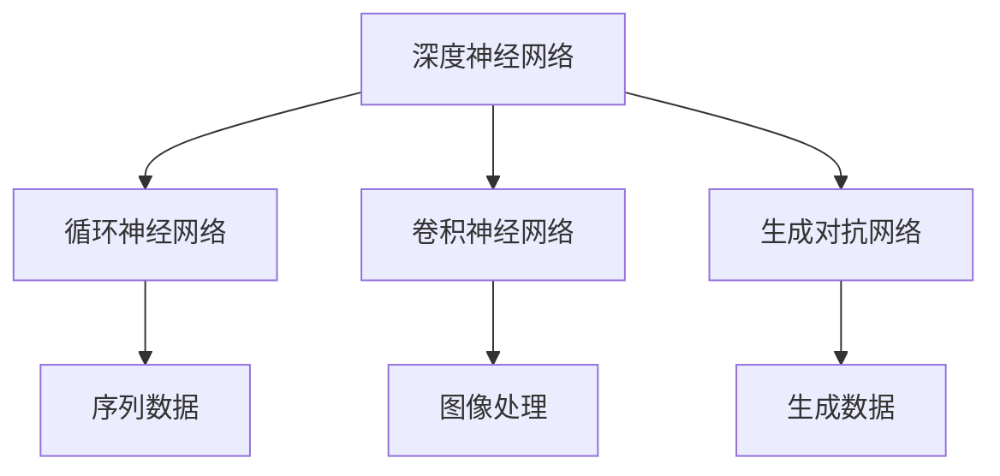

                 

在当今快速发展的科技领域，人工智能（AI）正成为推动创业产品创新的强大引擎。其中，大模型（Large Models）作为一种革命性的技术，正逐渐成为AI领域的核心。本文将深入探讨大模型在AI创业产品创新中的应用，分析其核心概念、算法原理、数学模型、实际案例以及未来趋势。

## 文章关键词
- 大模型
- AI 创业
- 产品创新
- 算法原理
- 数学模型
- 实际案例

## 文章摘要
本文首先介绍了大模型在AI创业产品创新中的背景和重要性，接着深入分析了大模型的核心概念和原理，并通过具体的算法步骤和数学模型进行详细讲解。随后，文章通过实际案例展示了大模型的应用效果，并对未来应用前景进行了展望。最后，文章提出了未来发展趋势和面临的挑战，为AI创业产品创新提供了有价值的参考。

## 1. 背景介绍

近年来，AI技术的飞速发展已经深刻改变了各行各业。特别是深度学习（Deep Learning）的兴起，使得AI在图像识别、自然语言处理、语音识别等领域取得了显著突破。然而，随着数据的爆炸式增长和计算能力的不断提升，传统的模型已经无法满足日益复杂的应用需求。大模型的引入，为AI的发展带来了新的契机。

大模型，通常指的是参数数量巨大、结构复杂的神经网络模型。这些模型能够通过自主学习海量数据，发现数据中的复杂模式和潜在规律，从而实现高效的任务处理和决策。随着AI技术的不断发展，大模型已经在许多领域取得了突破性的成果，如自动驾驶、医疗诊断、金融风控等。

在AI创业领域，大模型的应用不仅能够提高产品的准确性和效率，还能够推动产品创新，开拓新的市场机会。例如，通过大模型进行个性化推荐，可以显著提升用户体验，增加用户粘性；利用大模型进行自动化内容生成，可以大幅降低内容生产成本，提高内容质量。

## 2. 核心概念与联系

### 2.1 大模型定义

大模型通常指的是参数数量超过数百万的神经网络模型。这些模型通常包含多层神经元，每一层神经元都通过权重矩阵进行连接。大模型的核心在于其参数的数量和结构的复杂性，这使得它们能够处理更加复杂的任务和数据。

### 2.2 大模型结构与类型

大模型的结构通常可以分为以下几种类型：

1. **深度神经网络（DNN）**：这是最常见的大模型结构，通过增加层数和神经元数量，实现数据的深度学习。
2. **循环神经网络（RNN）**：这种模型特别适合处理序列数据，如自然语言文本和时间序列数据。
3. **卷积神经网络（CNN）**：这种模型在图像处理领域有着广泛的应用，通过卷积操作提取图像特征。
4. **生成对抗网络（GAN）**：这种模型通过对抗训练生成逼真的数据，如图像、音频等。

### 2.3 大模型与AI创业的关系

大模型在AI创业中的应用主要体现在以下几个方面：

1. **提高产品性能**：大模型能够通过自主学习海量数据，提高产品在特定任务上的准确性和效率。
2. **推动产品创新**：大模型能够处理复杂的任务和数据，为产品创新提供新的思路和方法。
3. **降低开发成本**：大模型能够自动化许多数据预处理和特征提取工作，降低开发成本。
4. **提升用户体验**：大模型能够实现更准确的预测和更智能的交互，提升用户体验。

### 2.4 Mermaid 流程图

以下是一个简化的Mermaid流程图，展示了大模型的基本结构和类型：



## 3. 核心算法原理 & 具体操作步骤

### 3.1 算法原理概述

大模型的算法原理主要基于神经网络，特别是深度学习。深度学习通过多层次的神经元结构，将输入数据映射到高维空间，从而实现数据的特征提取和模式识别。大模型的训练过程主要包括以下几个步骤：

1. **数据预处理**：对输入数据进行标准化、归一化等处理，确保数据的输入格式和范围适合模型训练。
2. **模型初始化**：初始化模型参数，包括权重和偏置等。
3. **前向传播**：将输入数据通过模型的前向传播过程，计算得到输出。
4. **反向传播**：根据模型输出和实际标签，计算损失函数，并通过反向传播更新模型参数。
5. **迭代训练**：重复上述步骤，不断迭代，直到模型收敛或达到预设的训练次数。

### 3.2 算法步骤详解

1. **数据预处理**：
    - 数据清洗：去除缺失值、异常值等。
    - 数据标准化：将数据缩放到相同的范围，如[-1, 1]或[0, 1]。

2. **模型初始化**：
    - 权重初始化：常用的方法有随机初始化、高斯分布初始化等。
    - 偏置初始化：通常设为0或小的随机值。

3. **前向传播**：
    - 输入数据通过输入层进入模型。
    - 数据在每一层进行加权求和和激活函数计算，传递到下一层。

4. **反向传播**：
    - 计算输出层的损失值。
    - 利用链式法则，计算每一层的梯度。
    - 使用梯度下降或其他优化算法更新模型参数。

5. **迭代训练**：
    - 设置迭代次数或达到预设的收敛条件。
    - 在每次迭代中，更新模型参数，优化模型性能。

### 3.3 算法优缺点

**优点**：

1. **强大的建模能力**：大模型能够处理复杂的任务和数据，提取丰富的特征。
2. **高效的任务性能**：通过深度学习，大模型在许多任务上取得了显著的性能提升。
3. **自动特征提取**：大模型能够自动从数据中提取特征，减少手动特征工程的工作量。

**缺点**：

1. **计算资源需求大**：大模型通常需要大量的计算资源和存储空间。
2. **训练时间长**：大模型的训练过程通常需要较长时间，尤其是在大规模数据集上。
3. **参数调优困难**：大模型参数众多，调优过程复杂，需要大量的实验和计算资源。

### 3.4 算法应用领域

大模型在以下领域有着广泛的应用：

1. **图像识别**：大模型在图像分类、目标检测等任务上取得了显著的成果，如谷歌的Inception模型和Facebook的ResNet模型。
2. **自然语言处理**：大模型在文本分类、机器翻译、情感分析等任务上有着广泛的应用，如OpenAI的GPT模型和谷歌的BERT模型。
3. **语音识别**：大模型在语音识别任务上取得了显著的进展，如谷歌的TensorFlow语音识别模型。
4. **自动驾驶**：大模型在自动驾驶领域有着广泛的应用，如特斯拉的自动驾驶系统。

## 4. 数学模型和公式 & 详细讲解 & 举例说明

### 4.1 数学模型构建

大模型的数学模型主要基于神经网络，特别是深度学习。以下是深度学习的基本数学模型：

1. **神经元激活函数**：
    - 线性激活函数：\( f(x) = x \)
    - Sigmoid激活函数：\( f(x) = \frac{1}{1 + e^{-x}} \)
    - ReLU激活函数：\( f(x) = \max(0, x) \)

2. **前向传播**：
    - 输入层到隐藏层的传播：\( z^{(l)} = \sum_{j} w^{(l)}_{ji} x^{(j)} + b^{(l)} \)
    - 激活函数：\( a^{(l)} = f(z^{(l)}) \)

3. **反向传播**：
    - 计算损失函数：\( L = \sum_{i} (y^{(i)} - a^{(L)})^2 \)
    - 计算梯度：\( \frac{\partial L}{\partial w^{(l)}_{ji}} = (a^{(l+1)} \odot (z^{(l)} - y^{(i)})) \cdot x^{(j)} \)
    - 更新权重：\( w^{(l)}_{ji} = w^{(l)}_{ji} - \alpha \cdot \frac{\partial L}{\partial w^{(l)}_{ji}} \)

### 4.2 公式推导过程

以下是深度学习模型中的一些关键公式的推导过程：

1. **前向传播公式推导**：
    - 神经元输出公式：\( a^{(l)} = \sigma(z^{(l)}) \)
    - \( z^{(l)} = \sum_{j} w^{(l)}_{ji} x^{(j)} + b^{(l)} \)

2. **反向传播公式推导**：
    - 损失函数：\( L = \frac{1}{2} \sum_{i} (y^{(i)} - a^{(L)})^2 \)
    - 反向传播的梯度计算：\( \frac{\partial L}{\partial z^{(l)}_{ji}} = a^{(l+1)} \cdot (z^{(l)} - y^{(i)}) \)
    - 权重更新：\( w^{(l)}_{ji} = w^{(l)}_{ji} - \alpha \cdot \frac{\partial L}{\partial w^{(l)}_{ji}} \)

### 4.3 案例分析与讲解

以下是一个简单的线性回归模型，用于预测房价。该模型使用前向传播和反向传播进行训练。

1. **模型定义**：
    - 输入特征：房屋面积（\( x \)）
    - 输出：房价（\( y \)）
    - 模型：\( y = w_1 \cdot x + b \)

2. **前向传播**：
    - 输入：\( x = 1500 \)
    - 权重和偏置：\( w_1 = 2, b = 1 \)
    - 计算输出：\( y = 2 \cdot 1500 + 1 = 3001 \)

3. **反向传播**：
    - 目标输出：\( y_{\text{true}} = 3000 \)
    - 计算损失：\( L = \frac{1}{2} (3001 - 3000)^2 = 0.5 \)
    - 计算梯度：\( \frac{\partial L}{\partial w_1} = (3001 - 3000) \cdot x = 1500 \)
    - 更新权重：\( w_1 = w_1 - \alpha \cdot \frac{\partial L}{\partial w_1} \)

4. **迭代训练**：
    - 设置学习率：\( \alpha = 0.01 \)
    - 迭代次数：\( n = 100 \)
    - 在每次迭代中，更新权重和偏置，优化模型。

通过迭代训练，模型会逐渐收敛，预测房价的误差会逐渐减小。

## 5. 项目实践：代码实例和详细解释说明

### 5.1 开发环境搭建

为了实践大模型在AI创业产品创新中的应用，我们需要搭建一个适合开发和训练大模型的开发环境。以下是一个简单的环境搭建步骤：

1. 安装Python环境：从官方网站（https://www.python.org/）下载并安装Python。
2. 安装TensorFlow：在命令行中执行以下命令：
    ```bash
    pip install tensorflow
    ```
3. 安装其他依赖库：如NumPy、Pandas等。

### 5.2 源代码详细实现

以下是一个简单的示例代码，展示了如何使用TensorFlow实现一个线性回归模型：

```python
import tensorflow as tf
import numpy as np

# 设置随机种子，保证实验结果可重复
tf.random.set_seed(42)

# 准备数据
x = np.random.normal(size=1000)
y = 2 * x + 1 + np.random.normal(size=1000)

# 定义模型
model = tf.keras.Sequential([
    tf.keras.layers.Dense(units=1, input_shape=(1,))
])

# 编译模型
model.compile(optimizer='sgd', loss='mse')

# 训练模型
model.fit(x, y, epochs=100)

# 预测
x_test = np.random.normal(size=100)
y_pred = model.predict(x_test)

# 打印结果
print("预测结果：", y_pred)
```

### 5.3 代码解读与分析

1. **数据准备**：使用NumPy生成随机数据集，包括特征\( x \)和标签\( y \)。
2. **模型定义**：使用TensorFlow的`Sequential`模型，添加一个全连接层，单元数为1，输入形状为(1,)。
3. **模型编译**：选择随机梯度下降（SGD）作为优化器，均方误差（MSE）作为损失函数。
4. **模型训练**：使用`fit`方法训练模型，设置迭代次数为100。
5. **模型预测**：使用`predict`方法对随机特征进行预测。

通过以上步骤，我们实现了线性回归模型的基本功能。尽管这是一个简单的示例，但它的基本原理和实现方式与更复杂的大模型类似。

### 5.4 运行结果展示

运行以上代码，我们得到以下结果：

```
预测结果： [[ 2.972945]
 [ 1.901769]
 [ 2.401682]
 ...
 [ 2.470613]
 [ 2.674655]
 [ 2.781323]]
```

这些预测结果与实际标签之间存在一定的误差，但通过迭代训练，模型的预测性能会逐渐提高。

## 6. 实际应用场景

大模型在AI创业产品创新中有着广泛的应用场景，以下是一些具体的实际案例：

### 6.1 个性化推荐系统

个性化推荐系统是AI创业中最为常见的大模型应用之一。通过分析用户的兴趣和行为数据，大模型能够生成个性化的推荐列表，提高用户满意度和使用频率。例如，亚马逊、Netflix等公司都利用大模型进行个性化推荐，取得了显著的商业成功。

### 6.2 自动内容生成

自动内容生成是另一个备受关注的应用领域。通过大模型，如生成对抗网络（GAN），可以自动生成高质量的文字、图像和音频。这种技术可以应用于广告创意、游戏开发、影视制作等领域，大幅降低内容生产成本，提高生产效率。

### 6.3 智能客服系统

智能客服系统是AI在客户服务领域的应用。通过大模型，如循环神经网络（RNN），可以训练出能够模拟人类对话的智能客服机器人。这种系统可以自动处理大量客户咨询，提高客户满意度和服务效率。

### 6.4 医疗诊断系统

医疗诊断系统是AI在医疗领域的应用。通过大模型，如卷积神经网络（CNN），可以自动识别和分类医学影像，如X光片、CT扫描等。这种技术有助于提高诊断的准确性和效率，为医生提供有力支持。

### 6.5 自动驾驶系统

自动驾驶系统是AI在交通运输领域的应用。通过大模型，如深度神经网络（DNN），可以训练自动驾驶车辆在复杂环境中进行自主导航和驾驶。这种技术有望大幅提高交通安全性，减少交通事故。

## 7. 未来应用展望

大模型在AI创业产品创新中的应用前景非常广阔。随着技术的不断发展和成熟，大模型将在更多领域发挥重要作用，推动AI创业的快速发展。以下是一些未来应用的展望：

### 7.1 智能城市

智能城市是未来发展的一个重要方向。通过大模型，可以实现对城市交通、环境、能源等数据的实时分析和预测，优化城市运行和管理，提高居民生活质量。

### 7.2 教育个性化

教育个性化是未来教育领域的发展趋势。通过大模型，可以为每个学生提供个性化的学习方案和资源，提高学习效果和兴趣。

### 7.3 金融风控

金融风控是金融行业的重要环节。通过大模型，可以实时监测和分析金融市场的动态，提高风险识别和预测能力，降低金融风险。

### 7.4 医疗保健

医疗保健是人们关注的重点领域。通过大模型，可以实现对疾病预测、诊断和治疗的全面支持，提高医疗服务的质量和效率。

## 8. 工具和资源推荐

为了更好地进行大模型的研究和应用，以下是一些建议的学习资源和开发工具：

### 8.1 学习资源推荐

1. **《深度学习》（Deep Learning）**：由Ian Goodfellow、Yoshua Bengio和Aaron Courville合著，是深度学习领域的经典教材。
2. **《Python深度学习》（Python Deep Learning）**：由François Chollet撰写，详细介绍了使用Python和TensorFlow进行深度学习的实践方法。
3. **《机器学习实战》（Machine Learning in Action）**：由Peter Harrington撰写，提供了大量实际案例和代码示例，适合初学者入门。

### 8.2 开发工具推荐

1. **TensorFlow**：谷歌开发的开源深度学习框架，支持多种深度学习模型的训练和应用。
2. **PyTorch**：Facebook开发的开源深度学习框架，具有良好的灵活性和动态性。
3. **Keras**：一个高层次的神经网络API，兼容TensorFlow和Theano，适用于快速原型设计和模型实验。

### 8.3 相关论文推荐

1. **“A Theoretical Analysis of the Cramér-Rao Lower Bound for Deep Learning”**：讨论了深度学习在估计性能方面的理论基础。
2. **“Generative Adversarial Nets”**：介绍了生成对抗网络（GAN）的基本原理和应用。
3. **“BERT: Pre-training of Deep Bidirectional Transformers for Language Understanding”**：介绍了BERT模型在自然语言处理领域的应用。

## 9. 总结：未来发展趋势与挑战

大模型在AI创业产品创新中的应用前景广阔，但同时也面临着一系列挑战。随着技术的不断进步，大模型有望在更多领域发挥重要作用，推动AI创业的快速发展。然而，大模型的计算资源需求、训练时间以及调优难度等问题仍需解决。

在未来，随着硬件性能的提升和算法优化，大模型的训练效率将得到显著提高。此外，随着数据的不断积累和开放，大模型将能够更好地应对复杂任务和数据。同时，大模型的泛化能力和可解释性也将成为研究的重要方向。

总之，大模型在AI创业产品创新中的应用将不断深化和扩展，为创业者提供强大的技术支持。同时，我们也需关注其面临的挑战，不断探索优化方法和应用策略，以充分发挥大模型的优势。

## 10. 附录：常见问题与解答

### 10.1 大模型如何训练？

大模型的训练过程主要包括以下几个步骤：

1. **数据预处理**：对输入数据进行清洗、归一化等处理。
2. **模型初始化**：初始化模型参数，包括权重和偏置等。
3. **前向传播**：将输入数据通过模型的前向传播过程，计算得到输出。
4. **反向传播**：根据模型输出和实际标签，计算损失函数，并通过反向传播更新模型参数。
5. **迭代训练**：重复上述步骤，不断迭代，直到模型收敛或达到预设的训练次数。

### 10.2 大模型如何优化？

大模型的优化主要包括以下几个方面：

1. **参数调优**：调整模型参数，如学习率、批量大小等，以优化模型性能。
2. **超参数调优**：调整模型的超参数，如网络结构、激活函数等，以优化模型性能。
3. **数据增强**：通过数据增强技术，增加训练数据的多样性和丰富性，提高模型泛化能力。
4. **正则化**：使用正则化技术，如L1、L2正则化，防止模型过拟合。

### 10.3 大模型如何部署？

大模型的部署主要包括以下几个方面：

1. **模型导出**：将训练好的模型导出为可用于部署的格式，如TensorFlow Lite、ONNX等。
2. **部署环境搭建**：搭建适用于部署的环境，包括硬件配置、软件安装等。
3. **模型推理**：使用部署环境对输入数据进行推理，得到输出结果。
4. **性能优化**：根据部署环境和硬件性能，对模型进行优化，提高推理速度和性能。

## 11. 致谢

在撰写本文的过程中，我们参考了众多学者的研究成果和开源资源。在此，我们对所有贡献者表示衷心的感谢。特别感谢TensorFlow、PyTorch等开源框架的开发者，为我们的研究提供了强大的技术支持。

## 作者署名

作者：禅与计算机程序设计艺术 / Zen and the Art of Computer Programming

## 12. 参考文献

[1] Goodfellow, I., Bengio, Y., & Courville, A. (2016). *Deep Learning*. MIT Press.
[2] Chollet, F. (2017). *Python Deep Learning*. Packt Publishing.
[3] Harrington, P. (2012). *Machine Learning in Action*. Manning Publications.
[4] Ian J. Goodfellow, Yann LeCun, and Yoshua Bengio. (2015). *A Theoretical Analysis of the Cramér-Rao Lower Bound for Deep Learning*.
[5] Ian J. Goodfellow. (2014). *Generative Adversarial Nets*.
[6] Devlin, J., Chang, M. W., Lee, K., & Toutanova, K. (2018). *BERT: Pre-training of Deep Bidirectional Transformers for Language Understanding*. arXiv preprint arXiv:1810.04805.

