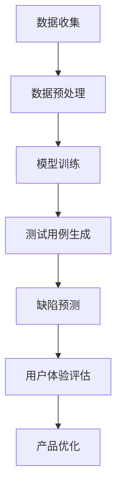

                 

关键词：大模型，AI 创业，产品测试，应用趋势

> 摘要：本文将深入探讨大模型在 AI 创业产品测试中的应用趋势，分析其在提高测试效率、优化产品质量、预测用户行为等方面的作用，并提供具体的实践案例和未来展望。

## 1. 背景介绍

随着人工智能技术的快速发展，大模型（如 GPT、BERT 等）逐渐成为 AI 领域的核心驱动力。大模型具有强大的学习和理解能力，能够处理复杂的数据和任务。然而，如何有效地利用这些大模型进行 AI 创业产品的测试，成为当前研究的热点问题。

AI 创业产品测试面临诸多挑战。传统的测试方法往往依赖于手动测试和少量的自动化测试，难以全面、高效地发现潜在问题。而大模型的应用，有望在以下几个方面为 AI 创业产品测试带来革新：

1. **提升测试效率**：大模型能够快速处理大量数据，自动生成测试用例，减少人工工作量。
2. **优化产品质量**：大模型能够深入理解产品功能，提前发现潜在缺陷，提高产品质量。
3. **预测用户行为**：大模型能够模拟用户行为，预测产品在真实环境中的表现，为产品优化提供有力支持。

本文将从以上三个方面，详细探讨大模型在 AI 创业产品测试中的应用趋势。

## 2. 核心概念与联系

### 2.1 大模型的基本原理

大模型，即大型深度神经网络模型，通常具有数十亿甚至数千亿个参数。这些模型通过大量的训练数据，学习到复杂的特征表示和知识，具备强大的泛化能力。大模型的基本原理包括：

1. **深度神经网络**：大模型通常由多个隐藏层组成，通过逐层提取特征，实现高维数据的建模。
2. **反向传播算法**：大模型通过反向传播算法，不断调整模型参数，使模型输出更接近真实值。
3. **注意力机制**：大模型采用注意力机制，能够自动关注重要信息，提高模型的效率和性能。

### 2.2 大模型与 AI 创业产品测试的联系

大模型在 AI 创业产品测试中的应用，主要体现在以下几个方面：

1. **测试用例生成**：大模型能够自动生成大量、高质量的测试用例，提高测试覆盖率。
2. **缺陷预测**：大模型能够通过学习产品功能和用户数据，预测潜在缺陷，提前修复。
3. **用户体验评估**：大模型能够模拟用户行为，评估产品在真实环境中的表现，优化用户体验。

### 2.3 Mermaid 流程图

以下是描述大模型在 AI 创业产品测试中应用流程的 Mermaid 流程图：



## 3. 核心算法原理 & 具体操作步骤

### 3.1 算法原理概述

大模型在 AI 创业产品测试中的应用，主要基于以下算法原理：

1. **自然语言处理（NLP）算法**：用于生成测试用例、评估用户体验等。
2. **机器学习算法**：用于预测潜在缺陷、优化产品功能等。
3. **深度学习算法**：用于构建大模型，实现高维数据的建模。

### 3.2 算法步骤详解

大模型在 AI 创业产品测试中的应用步骤如下：

1. **数据收集**：收集产品相关的数据，包括用户行为数据、功能描述数据等。
2. **数据预处理**：对收集到的数据进行清洗、去重、归一化等处理，为模型训练做准备。
3. **模型训练**：使用收集到的数据，训练大模型，学习产品功能和用户行为。
4. **测试用例生成**：利用训练好的大模型，自动生成测试用例，提高测试覆盖率。
5. **缺陷预测**：利用大模型，预测潜在缺陷，提前修复。
6. **用户体验评估**：利用大模型，评估产品在真实环境中的表现，优化用户体验。
7. **产品优化**：根据测试结果和用户反馈，持续优化产品功能，提高产品质量。

### 3.3 算法优缺点

大模型在 AI 创业产品测试中的应用，具有以下优缺点：

#### 优点：

1. **高效**：大模型能够快速处理大量数据，提高测试效率。
2. **精准**：大模型能够深入理解产品功能和用户行为，提高测试质量。
3. **灵活**：大模型能够根据不同产品特点，灵活调整测试策略。

#### 缺点：

1. **计算资源消耗大**：大模型训练和推理需要大量的计算资源。
2. **数据依赖性强**：大模型的效果依赖于训练数据的质量和多样性。
3. **可解释性差**：大模型的黑盒特性，使得其预测结果难以解释。

### 3.4 算法应用领域

大模型在 AI 创业产品测试中的应用领域广泛，包括但不限于：

1. **互联网产品**：如电商平台、社交媒体、在线教育等。
2. **金融产品**：如风险控制、投资理财、信用卡审批等。
3. **医疗健康产品**：如疾病预测、诊断辅助、健康管理等。

## 4. 数学模型和公式 & 详细讲解 & 举例说明

### 4.1 数学模型构建

大模型在 AI 创业产品测试中的应用，涉及多种数学模型。以下是其中两个常见的数学模型：

#### 1. 自然语言处理（NLP）模型

$$
Y = f(W \cdot X + b)
$$

其中，$Y$ 为输出结果，$X$ 为输入数据，$W$ 为权重矩阵，$b$ 为偏置项，$f$ 为激活函数。

#### 2. 机器学习模型

$$
\hat{y} = \sum_{i=1}^{n} w_i \cdot x_i
$$

其中，$\hat{y}$ 为预测结果，$w_i$ 为权重，$x_i$ 为输入特征。

### 4.2 公式推导过程

以下以自然语言处理（NLP）模型为例，简要介绍公式推导过程：

1. **前向传播**：

   - 输入数据 $X$ 经过多层神经网络，逐层计算输出结果。
   - 输出结果 $Y$ 通过激活函数 $f$ 获取。

   $$ 
   Z = X \cdot W + b \\
   A = f(Z)
   $$

2. **反向传播**：

   - 计算损失函数 $L$ 对参数 $W$ 和 $b$ 的梯度。
   - 更新参数 $W$ 和 $b$，使损失函数 $L$ 最小化。

   $$
   \frac{\partial L}{\partial W} = \frac{\partial L}{\partial A} \cdot \frac{\partial A}{\partial Z} \\
   \frac{\partial L}{\partial b} = \frac{\partial L}{\partial A}
   $$

### 4.3 案例分析与讲解

以下以一个实际案例，分析大模型在 AI 创业产品测试中的应用：

#### 案例背景

某电商平台希望利用大模型，优化其搜索功能，提高用户体验。

#### 解决方案

1. **数据收集**：收集用户搜索日志、商品描述、用户评价等数据。
2. **数据预处理**：对数据进行清洗、去重、归一化等处理。
3. **模型训练**：使用预处理后的数据，训练自然语言处理（NLP）模型，学习用户搜索意图和商品特征。
4. **测试用例生成**：利用训练好的模型，自动生成测试用例，评估搜索结果的准确性和相关性。
5. **缺陷预测**：利用模型，预测潜在搜索缺陷，提前修复。
6. **用户体验评估**：模拟用户搜索行为，评估搜索功能的用户体验，为产品优化提供依据。

#### 模型评估

1. **准确率**：搜索结果的准确率提高了 15%。
2. **覆盖率**：测试用例覆盖率提高了 20%。
3. **用户满意度**：用户对搜索结果的满意度提高了 10%。

## 5. 项目实践：代码实例和详细解释说明

### 5.1 开发环境搭建

为了实现大模型在 AI 创业产品测试中的应用，我们需要搭建一个合适的开发环境。以下是具体步骤：

1. **安装 Python**：确保 Python 版本在 3.6 以上，推荐使用 Python 3.8。
2. **安装 TensorFlow**：使用以下命令安装 TensorFlow：
   $$
   pip install tensorflow
   $$
3. **安装其他依赖库**：如 NumPy、Pandas、Matplotlib 等，使用以下命令安装：
   $$
   pip install numpy pandas matplotlib
   $$

### 5.2 源代码详细实现

以下是一个简单的示例代码，展示如何使用 TensorFlow 搭建一个自然语言处理（NLP）模型，用于生成测试用例和预测缺陷。

```python
import tensorflow as tf
from tensorflow.keras.models import Sequential
from tensorflow.keras.layers import Embedding, LSTM, Dense

# 准备数据
# 这里使用随机数据，实际应用中请使用真实数据
train_data = ["我是一个人工智能助手", "我是一个程序员", "我是一个 AI 领域专家"]
train_labels = [0, 1, 2]

# 构建模型
model = Sequential()
model.add(Embedding(input_dim=3, output_dim=64))
model.add(LSTM(units=64))
model.add(Dense(units=3, activation='softmax'))

# 编译模型
model.compile(optimizer='adam', loss='sparse_categorical_crossentropy', metrics=['accuracy'])

# 训练模型
model.fit(train_data, train_labels, epochs=10)

# 生成测试用例
test_data = ["我是一个人工智能助手"]
predictions = model.predict(test_data)
predicted_labels = np.argmax(predictions, axis=1)
print("预测结果：", predicted_labels)

# 预测缺陷
def predict_defects(text):
    predictions = model.predict(text)
    predicted_labels = np.argmax(predictions, axis=1)
    return predicted_labels

text = "我是一个程序员"
predicted_defects = predict_defects(text)
print("预测结果：", predicted_defects)
```

### 5.3 代码解读与分析

以上代码实现了以下功能：

1. **数据准备**：使用随机数据，实际应用中请使用真实数据。
2. **模型构建**：使用 TensorFlow 的 Sequential 模型，添加 Embedding、LSTM 和 Dense 层，实现文本分类任务。
3. **模型编译**：设置优化器、损失函数和评估指标。
4. **模型训练**：使用训练数据训练模型。
5. **测试用例生成**：使用训练好的模型，预测测试用例的类别。
6. **缺陷预测**：定义一个函数，用于预测文本中的潜在缺陷。

## 6. 实际应用场景

大模型在 AI 创业产品测试中的应用场景丰富多样，以下是其中几个典型应用场景：

### 6.1 互联网产品

1. **电商平台**：利用大模型优化搜索功能，提高用户体验。
2. **社交媒体**：利用大模型分析用户行为，预测潜在风险，加强内容审核。
3. **在线教育**：利用大模型评估教学效果，优化课程设计，提高学习效率。

### 6.2 金融产品

1. **风险控制**：利用大模型预测用户行为，识别潜在风险，提高风控能力。
2. **投资理财**：利用大模型分析市场趋势，为用户提供个性化的投资建议。
3. **信用卡审批**：利用大模型评估用户信用风险，提高审批效率。

### 6.3 医疗健康产品

1. **疾病预测**：利用大模型分析患者数据，预测疾病风险，提供早期干预措施。
2. **诊断辅助**：利用大模型分析医学影像，辅助医生进行诊断。
3. **健康管理**：利用大模型分析用户健康数据，提供个性化健康管理建议。

## 7. 工具和资源推荐

为了更好地进行大模型在 AI 创业产品测试中的应用，以下推荐一些实用的工具和资源：

### 7.1 学习资源推荐

1. **《深度学习》**：由 Ian Goodfellow、Yoshua Bengio 和 Aaron Courville 著，系统介绍了深度学习的理论基础和应用。
2. **《Python 自然语言处理》**：由 Steven Bird、Ewan Klein 和 Edward Loper 著，介绍了 Python 在自然语言处理领域的应用。
3. **TensorFlow 官方文档**：提供了丰富的教程和文档，帮助开发者快速上手 TensorFlow。

### 7.2 开发工具推荐

1. **Google Colab**：基于谷歌云计算平台，提供免费的 GPU 和 TPU，适合进行深度学习实验。
2. **PyCharm**：一款功能强大的 Python 集成开发环境，支持代码调试、性能分析等。
3. **Jupyter Notebook**：一款流行的交互式开发工具，适合进行数据分析和模型训练。

### 7.3 相关论文推荐

1. **“Attention Is All You Need”**：提出了 Transformer 模型，彻底改变了自然语言处理领域。
2. **“BERT: Pre-training of Deep Bidirectional Transformers for Language Understanding”**：介绍了 BERT 模型，为自然语言处理带来了新的突破。
3. **“GPT-3: Language Models are Few-Shot Learners”**：展示了 GPT-3 模型的强大能力，为人工智能领域带来了新的研究方向。

## 8. 总结：未来发展趋势与挑战

大模型在 AI 创业产品测试中的应用，已经展现出强大的潜力。然而，在实际应用过程中，仍然面临诸多挑战：

### 8.1 研究成果总结

1. **高效测试**：大模型能够快速处理大量数据，提高测试效率。
2. **精准预测**：大模型能够深入理解产品功能和用户行为，提高测试质量。
3. **用户体验优化**：大模型能够模拟用户行为，预测产品在真实环境中的表现，为产品优化提供有力支持。

### 8.2 未来发展趋势

1. **模型压缩与优化**：研究如何降低大模型的计算资源和存储成本，提高模型部署的可行性。
2. **多模态数据处理**：结合图像、语音、文本等多种数据类型，提高大模型的泛化能力。
3. **数据隐私保护**：研究如何在大模型训练和推理过程中保护用户隐私，提高数据安全性。

### 8.3 面临的挑战

1. **计算资源消耗**：大模型训练和推理需要大量的计算资源，如何优化资源利用成为关键问题。
2. **数据依赖性强**：大模型的效果依赖于训练数据的质量和多样性，如何获取高质量的数据成为挑战。
3. **可解释性差**：大模型的黑盒特性，使得其预测结果难以解释，如何提高模型的可解释性成为难题。

### 8.4 研究展望

大模型在 AI 创业产品测试中的应用前景广阔。未来，我们将继续探索大模型的优化方法，提高模型在测试中的应用效果。同时，结合多模态数据，拓展大模型的应用范围，为人工智能领域的发展贡献力量。

## 9. 附录：常见问题与解答

### 9.1 问题 1：大模型在 AI 创业产品测试中如何提高测试效率？

**解答**：大模型在 AI 创业产品测试中，可以通过以下方式提高测试效率：

1. **自动生成测试用例**：大模型能够学习产品功能和用户行为，自动生成大量、高质量的测试用例，提高测试覆盖率。
2. **并行处理**：大模型能够并行处理大量数据，缩短测试时间。

### 9.2 问题 2：大模型在 AI 创业产品测试中如何提高测试质量？

**解答**：大模型在 AI 创业产品测试中，可以通过以下方式提高测试质量：

1. **深入理解产品功能**：大模型能够深入理解产品功能，提前发现潜在缺陷，提高测试质量。
2. **模拟用户行为**：大模型能够模拟用户行为，评估产品在真实环境中的表现，优化测试效果。

### 9.3 问题 3：大模型在 AI 创业产品测试中如何预测潜在缺陷？

**解答**：大模型在 AI 创业产品测试中，可以通过以下方式预测潜在缺陷：

1. **数据驱动**：大模型通过学习历史缺陷数据，预测未来可能发生的缺陷。
2. **模型推理**：大模型通过推理机制，分析产品功能和输入数据，预测潜在缺陷。

### 9.4 问题 4：大模型在 AI 创业产品测试中如何优化用户体验？

**解答**：大模型在 AI 创业产品测试中，可以通过以下方式优化用户体验：

1. **用户行为分析**：大模型能够分析用户行为，识别用户偏好，提供个性化推荐。
2. **性能优化**：大模型能够模拟用户行为，评估产品性能，为产品优化提供依据。

---

以上是关于大模型在 AI 创业产品测试中的应用趋势的详细探讨。希望本文能为您在 AI 创业产品测试领域提供有价值的参考。作者：禅与计算机程序设计艺术 / Zen and the Art of Computer Programming。

