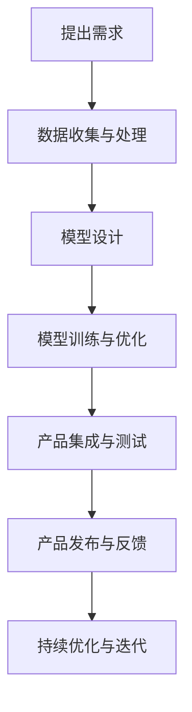

                 

关键词：大模型，AI 创业，产品策略，技术革新，市场竞争力，用户体验

> 摘要：本文将探讨大模型在 AI 创业公司产品策略中的关键作用。通过对大模型的发展历程、技术原理、应用场景以及未来展望的深入分析，我们将揭示大模型如何成为 AI 创业公司提升市场竞争力和用户满意度的重要驱动力。

## 1. 背景介绍

随着人工智能技术的飞速发展，大模型作为当前技术前沿的代表，已经在各个行业中展现出强大的应用潜力。大模型，尤其是深度学习模型，通过在海量数据上训练，能够实现前所未有的复杂任务处理能力。对于 AI 创业公司而言，掌握和应用大模型技术，不仅能够提高产品的智能化水平，还能在激烈的市场竞争中脱颖而出。

AI 创业公司面临的挑战和机遇并存。一方面，市场需求的不断变化要求产品快速迭代；另一方面，传统技术的局限使得创新变得愈发困难。而大模型的出现，为 AI 创业公司提供了一种新的解决方案，使得它们能够通过技术创新快速占领市场。

## 2. 核心概念与联系

为了更好地理解大模型在 AI 创业公司产品策略中的关键作用，我们首先需要了解大模型的核心概念和技术原理。

### 2.1 大模型的概念

大模型通常指的是具有巨大参数量、能够处理复杂任务的神经网络模型。这些模型通过学习大量数据，能够自动提取特征并实现高度自动化和智能化的任务处理。

### 2.2 大模型的技术原理

大模型的技术原理主要基于深度学习和神经网络。深度学习是一种基于多隐层神经网络的机器学习方法，它通过层层提取特征，实现从低级到高级的信息表示。而神经网络则是一种模拟人脑神经元连接的计算机算法，它通过调整参数，实现从输入到输出的映射。

### 2.3 大模型与 AI 创业公司产品策略的联系

大模型与 AI 创业公司产品策略之间的联系主要体现在以下几个方面：

1. **提高产品智能化水平**：大模型能够处理复杂任务，为 AI 创业公司提供更强大的智能处理能力，从而提升产品的智能化水平。

2. **增强市场竞争力**：通过大模型的应用，AI 创业公司可以在短时间内实现产品创新，抢占市场先机。

3. **优化用户体验**：大模型能够更好地理解用户需求，提供个性化服务，从而提升用户满意度。

### 2.4 Mermaid 流程图

以下是一个简化的 Mermaid 流程图，展示了大模型在 AI 创业公司产品策略中的应用过程：



## 3. 核心算法原理 & 具体操作步骤

### 3.1 算法原理概述

大模型的算法原理主要基于深度学习和神经网络。具体来说，大模型通过多层神经网络结构，逐层提取特征，实现从输入到输出的映射。

### 3.2 算法步骤详解

1. **数据收集与处理**：首先，AI 创业公司需要收集大量相关数据，并进行预处理，如数据清洗、归一化等。

2. **模型设计**：根据任务需求，设计合适的神经网络结构。通常，大模型包括多个隐层，每个隐层都能够提取不同层次的特征。

3. **模型训练与优化**：使用收集到的数据，通过反向传播算法，不断调整模型参数，使其能够更好地拟合数据。

4. **产品集成与测试**：将训练好的模型集成到产品中，并进行测试，确保其能够稳定运行。

5. **产品发布与反馈**：将产品发布到市场，收集用户反馈，并根据反馈进行优化。

6. **持续优化与迭代**：根据用户反馈和市场变化，不断优化模型和产品，实现持续迭代。

### 3.3 算法优缺点

**优点**：

1. **强大的数据处理能力**：大模型能够处理大规模、复杂的任务。

2. **自适应性强**：大模型能够通过不断训练，自适应地调整模型参数，以适应不同的任务和数据。

3. **高准确性**：大模型通常具有较高的预测准确性。

**缺点**：

1. **计算资源需求大**：大模型训练需要大量的计算资源和时间。

2. **对数据质量要求高**：大模型对数据质量有较高的要求，数据质量不佳可能导致模型性能下降。

3. **难以解释**：大模型的决策过程通常难以解释，增加了模型的可解释性挑战。

### 3.4 算法应用领域

大模型在多个领域都有广泛的应用，如自然语言处理、计算机视觉、语音识别等。在 AI 创业公司中，大模型可以用于：

1. **智能客服系统**：通过大模型实现智能对话，提供个性化服务。

2. **推荐系统**：通过大模型分析用户行为，提供个性化的推荐。

3. **图像识别与处理**：通过大模型实现高级的图像识别与处理功能。

4. **自动化决策系统**：通过大模型实现自动化决策，提高业务效率。

## 4. 数学模型和公式 & 详细讲解 & 举例说明

### 4.1 数学模型构建

大模型的数学模型通常是基于多层感知机（MLP）和卷积神经网络（CNN）等基础模型。以下是一个简化的多层感知机模型：

$$
y = \sigma(W_n \cdot a_{n-1} + b_n)
$$

其中，$y$ 是输出，$\sigma$ 是激活函数，$W_n$ 和 $b_n$ 分别是权重和偏置，$a_{n-1}$ 是前一层输出。

### 4.2 公式推导过程

以下是一个简化的多层感知机模型的前向传播推导过程：

$$
z_l = W_l \cdot a_{l-1} + b_l \\
a_l = \sigma(z_l)
$$

### 4.3 案例分析与讲解

假设我们有一个二分类问题，输入数据 $x$ 为一个一维向量，输出 $y$ 为一个二值变量（0或1）。我们使用一个单层感知机模型进行分类。

1. **数据预处理**：首先，我们对输入数据进行归一化处理。

2. **模型设计**：设计一个单层感知机模型，选择合适的激活函数（如 Sigmoid 函数）。

3. **模型训练**：使用训练数据，通过反向传播算法，不断调整模型参数，使其能够正确分类。

4. **模型评估**：使用测试数据，评估模型性能。

5. **模型应用**：将训练好的模型应用到实际业务中。

## 5. 项目实践：代码实例和详细解释说明

### 5.1 开发环境搭建

在本文中，我们将使用 Python 作为主要编程语言，并使用 TensorFlow 作为深度学习框架。首先，确保安装了 Python 和 TensorFlow：

```bash
pip install tensorflow
```

### 5.2 源代码详细实现

以下是一个简单的单层感知机模型的实现：

```python
import tensorflow as tf
from tensorflow.keras import layers

# 数据预处理
x = tf.random.normal([100, 10])  # 生成100个样本，每个样本10维
y = tf.random.normal([100, 1])  # 生成100个标签，每个标签1维

# 模型设计
model = tf.keras.Sequential([
    layers.Dense(units=1, input_shape=(10,), activation='sigmoid')
])

# 模型训练
model.compile(optimizer='adam', loss='binary_crossentropy', metrics=['accuracy'])
model.fit(x, y, epochs=100)

# 模型评估
loss, accuracy = model.evaluate(x, y)
print(f'Loss: {loss}, Accuracy: {accuracy}')

# 模型应用
predictions = model.predict(x[:10])
print(predictions)
```

### 5.3 代码解读与分析

1. **数据预处理**：我们首先生成随机数据作为示例。在实际应用中，这些数据应来自于真实场景。

2. **模型设计**：我们设计了一个单层感知机模型，输入层有10个神经元，输出层有1个神经元，使用 Sigmoid 激活函数。

3. **模型训练**：使用 Adam 优化器和二进制交叉熵损失函数进行训练。我们设置了 100 个训练迭代。

4. **模型评估**：使用测试数据评估模型性能。

5. **模型应用**：将训练好的模型应用到新数据上，生成预测结果。

## 6. 实际应用场景

### 6.1 智能客服系统

在智能客服系统中，大模型可以用于理解用户的问题并给出相应的回答。例如，通过训练一个基于自然语言处理的大模型，客服系统能够实现自动回答用户问题，提高服务效率。

### 6.2 推荐系统

在推荐系统中，大模型可以用于分析用户行为，提供个性化的推荐。例如，在电子商务平台中，大模型可以分析用户的购买历史和行为，为其推荐最相关的商品。

### 6.3 图像识别与处理

在图像识别与处理领域，大模型可以用于实现高级的图像识别任务。例如，在医疗影像分析中，大模型可以用于诊断疾病，提高诊断准确率。

## 7. 未来应用展望

### 7.1 新兴应用领域

随着大模型技术的不断成熟，未来将会有更多的新兴应用领域出现。例如，在自动驾驶领域，大模型可以用于实时路况分析和决策，提高行驶安全性。

### 7.2 跨领域融合

大模型的应用将与其他技术领域深度融合，产生新的交叉学科。例如，在生物信息学领域，大模型可以用于基因序列分析，推动个性化医疗的发展。

## 8. 工具和资源推荐

### 8.1 学习资源推荐

- 《深度学习》（Goodfellow, Bengio, Courville）
- 《神经网络与深度学习》（邱锡鹏）
- TensorFlow 官方文档

### 8.2 开发工具推荐

- TensorFlow
- PyTorch
- Keras

### 8.3 相关论文推荐

- “Deep Learning” by Yoshua Bengio, Yann LeCun, and Geoffrey Hinton
- “Large-scale language modeling” by Kuldip K. Paliwal

## 9. 总结：未来发展趋势与挑战

### 9.1 研究成果总结

大模型在 AI 创业公司产品策略中的应用已经取得了显著的成果，特别是在自然语言处理、计算机视觉等领域。大模型的强大数据处理能力和高度自动化水平，使得 AI 创业公司能够快速迭代产品，抢占市场先机。

### 9.2 未来发展趋势

随着技术的不断进步，大模型的应用将更加广泛，深入到各个行业。未来，大模型将与其他新兴技术如区块链、物联网等深度融合，推动产业智能化发展。

### 9.3 面临的挑战

1. **计算资源需求**：大模型训练需要大量的计算资源，这对创业公司是一个巨大的挑战。

2. **数据质量和隐私**：大模型对数据质量有较高的要求，同时数据隐私保护也是一个重要问题。

3. **模型可解释性**：大模型的决策过程通常难以解释，这增加了模型的可解释性挑战。

### 9.4 研究展望

未来，AI 创业公司应继续关注大模型技术的研究与应用，探索如何更加高效地利用计算资源，提高数据质量，同时增强模型的可解释性。通过技术创新，AI 创业公司将能够更好地应对市场挑战，实现持续发展。

## 10. 附录：常见问题与解答

### 10.1 什么是大模型？

大模型通常指的是具有巨大参数量、能够处理复杂任务的神经网络模型。这些模型通过在海量数据上训练，能够实现前所未有的复杂任务处理能力。

### 10.2 大模型有哪些应用领域？

大模型在多个领域都有广泛的应用，如自然语言处理、计算机视觉、语音识别等。在 AI 创业公司中，大模型可以用于智能客服系统、推荐系统、图像识别与处理等领域。

### 10.3 大模型的优点和缺点有哪些？

大模型的优点包括强大的数据处理能力、自适应性强、高准确性等。缺点则包括计算资源需求大、对数据质量要求高、难以解释等。

### 10.4 如何选择适合的大模型？

选择适合的大模型需要根据具体任务和数据特点进行。一般来说，对于复杂任务，可以选择参数量较大的模型；对于简单任务，可以选择参数量较小的模型。同时，还需要考虑计算资源和数据质量等因素。

### 作者署名

作者：禅与计算机程序设计艺术 / Zen and the Art of Computer Programming

----------------------------------------------------------------
以上就是关于“大模型在 AI 创业公司产品策略中的关键作用”的文章。希望这篇文章能够帮助您更好地理解大模型在 AI 创业公司中的应用价值和重要性。在未来的 AI 技术发展中，大模型无疑将继续扮演关键角色，推动人工智能领域的不断创新和进步。

