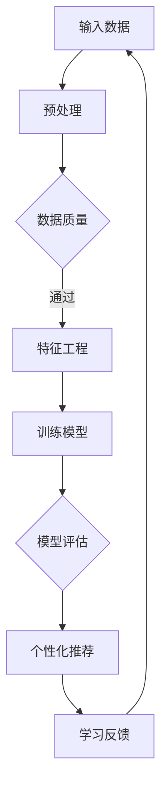

                 

关键词：大模型，个性化学习，教育技术，算法应用，机器学习，深度学习，教育平台

> 摘要：本文旨在探讨大模型技术在个性化学习平台中的创新应用。通过对大模型原理、算法以及实际案例的深入分析，文章展示了大模型如何为教育行业带来革命性的变化，提高学习效率和学生满意度。本文首先介绍了大模型的基本概念和现状，随后详细分析了大模型在个性化学习平台中的关键角色和具体应用，最后展望了该领域未来的发展趋势和面临的挑战。

## 1. 背景介绍

### 1.1 个性化学习的需求

随着信息时代的到来，教育资源的获取变得前所未有的容易。然而，这也带来了新的挑战：如何确保每个学生都能得到适合其个人需求的学习体验？传统的一刀切教学模式已经无法满足个性化教育的需求。因此，个性化学习成为了教育领域的一个重要研究方向。

个性化学习旨在根据每个学生的独特需求、兴趣和学习风格，提供定制化的学习资源和指导。这种教育模式不仅提高了学习效率，还大大提升了学生的学习兴趣和满意度。

### 1.2 大模型的崛起

近年来，大模型技术在人工智能领域取得了显著的进展。大模型，尤其是深度学习模型，具有强大的表示能力和强大的泛化能力，能够处理大规模、高维的数据，并从中提取出有价值的模式和信息。

在个性化学习领域，大模型的崛起为解决个性化教育的需求提供了新的可能性。通过分析学生的大量学习数据，大模型可以准确识别每个学生的特点和需求，进而提供个性化的学习方案。

## 2. 核心概念与联系

为了更好地理解大模型在个性化学习平台中的应用，我们首先需要了解大模型的基本概念和原理，以及其在个性化学习中的具体作用。

### 2.1 大模型的基本概念

大模型，通常指具有数十亿甚至千亿参数的神经网络模型。这些模型通过大量的训练数据学习复杂的函数映射，能够处理大规模的数据集，并从中提取出隐藏的结构和模式。

大模型的优点在于其强大的表示能力和泛化能力。表示能力指的是模型能够捕捉数据中的复杂特征和关系，而泛化能力则是指模型在新数据上的表现。

### 2.2 大模型在个性化学习中的具体作用

大模型在个性化学习平台中扮演着关键角色。其具体作用包括：

1. **学习数据挖掘**：通过分析学生的历史学习数据，大模型能够识别出学生的学习习惯、兴趣和弱点，为个性化学习提供基础。

2. **推荐系统**：大模型可以构建个性化的推荐系统，根据学生的学习特点和需求，推荐适合的学习资源。

3. **自适应学习**：大模型可以动态调整学习内容，确保学习过程始终与学生的需求保持一致。

4. **学习效果评估**：大模型可以评估学生的学习效果，提供反馈和改进建议。

### 2.3 Mermaid 流程图

下面是一个简化的 Mermaid 流程图，展示了大模型在个性化学习平台中的工作流程：



在这个流程图中，输入数据经过预处理和质量评估后，进行特征工程，接着训练大模型。模型评估结果用于个性化推荐和学习反馈，从而形成一个闭环系统，不断优化学习过程。

## 3. 核心算法原理 & 具体操作步骤

### 3.1 算法原理概述

大模型在个性化学习平台中的核心算法通常是基于深度学习的。深度学习是一种基于多层神经网络的学习方法，通过逐层抽象和组合低层次的特征，最终形成对数据的复杂表示。

在个性化学习中，深度学习模型通过以下步骤工作：

1. **特征提取**：模型从原始学习数据中提取特征，这些特征可以是文本、图像、音频等多种形式。

2. **表示学习**：模型将提取的特征映射到高维空间，形成对数据的复杂表示。

3. **模式识别**：模型通过这些高维表示识别出学习数据中的模式和规律。

4. **预测和决策**：基于识别出的模式和规律，模型进行预测和决策，提供个性化的学习推荐。

### 3.2 算法步骤详解

下面是深度学习模型在个性化学习平台中的具体操作步骤：

1. **数据收集**：收集学生的历史学习数据，包括成绩、学习时间、学习内容、互动记录等。

2. **数据预处理**：对收集到的数据进行清洗、归一化和特征提取，使其适合模型训练。

3. **模型训练**：使用预处理后的数据训练深度学习模型，模型可以是卷积神经网络（CNN）、循环神经网络（RNN）或多层感知机（MLP）等。

4. **模型评估**：使用验证集对训练好的模型进行评估，确保模型的泛化能力和预测准确性。

5. **个性化推荐**：基于模型预测结果，为每个学生推荐个性化的学习资源和任务。

6. **学习反馈**：收集学生的学习反馈，包括学习效果、满意度等，用于模型优化和迭代。

### 3.3 算法优缺点

**优点**：

1. **强大的表示能力**：深度学习模型能够从大量数据中提取复杂的特征和模式。

2. **良好的泛化能力**：经过训练的模型在新数据上的表现通常较好，具有良好的泛化性。

3. **自适应学习**：模型可以根据学生的学习反馈动态调整学习方案，提高学习效率。

**缺点**：

1. **计算资源需求大**：训练深度学习模型需要大量的计算资源和时间。

2. **数据隐私和安全**：个性化学习涉及大量的学生数据，需要确保数据的隐私和安全。

### 3.4 算法应用领域

深度学习模型在个性化学习平台中的应用广泛，包括：

1. **学习资源推荐**：根据学生的学习特点和需求推荐合适的学习资源。

2. **学习效果评估**：评估学生的学习效果，提供改进建议。

3. **个性化学习路径规划**：为学生制定个性化的学习计划，优化学习过程。

## 4. 数学模型和公式 & 详细讲解 & 举例说明

### 4.1 数学模型构建

在个性化学习平台中，深度学习模型通常使用以下数学模型：

1. **损失函数**：损失函数用于衡量模型预测结果与真实值之间的差距。常见的损失函数包括均方误差（MSE）和交叉熵（Cross-Entropy）。

2. **优化算法**：优化算法用于调整模型参数，使其预测结果更接近真实值。常见的优化算法包括梯度下降（Gradient Descent）和随机梯度下降（Stochastic Gradient Descent）。

### 4.2 公式推导过程

以下是一个简单的损失函数和优化算法的推导过程：

**均方误差（MSE）**：

$$
MSE = \frac{1}{n} \sum_{i=1}^{n} (y_i - \hat{y}_i)^2
$$

其中，$y_i$ 为真实值，$\hat{y}_i$ 为模型预测值。

**梯度下降**：

$$
\theta_{t+1} = \theta_{t} - \alpha \cdot \nabla_{\theta} J(\theta)
$$

其中，$\theta$ 为模型参数，$\alpha$ 为学习率，$J(\theta)$ 为损失函数。

### 4.3 案例分析与讲解

以下是一个简单的案例，展示了如何使用深度学习模型进行个性化学习资源推荐：

**案例**：一个学生希望在周末学习编程，他的历史学习数据包括：

- 学习时间：每周六下午2点至4点。
- 学习内容：Python 编程。
- 学习效果：学习成绩在 B 级以上。

**步骤**：

1. **数据预处理**：将学生的历史学习数据转换为数字化的特征向量。
2. **模型训练**：使用训练数据训练一个深度学习模型，模型可以预测学生在特定时间段内对特定学习内容的兴趣。
3. **个性化推荐**：基于模型预测结果，为学生在周末推荐 Python 编程的学习资源。
4. **学习反馈**：收集学生的学习反馈，用于模型优化和迭代。

通过这个案例，我们可以看到深度学习模型在个性化学习资源推荐中的强大能力。

## 5. 项目实践：代码实例和详细解释说明

### 5.1 开发环境搭建

为了实现个性化学习资源推荐系统，我们需要搭建一个开发环境。以下是一个简单的开发环境搭建指南：

1. **Python**：安装 Python 3.x 版本，建议使用 Anaconda。
2. **深度学习库**：安装 TensorFlow 或 PyTorch，这两个库是目前最流行的深度学习库。
3. **数据处理库**：安装 NumPy、Pandas 等数据处理库。

### 5.2 源代码详细实现

以下是一个简单的个性化学习资源推荐系统的代码实现，使用了 TensorFlow 作为深度学习库：

```python
import tensorflow as tf
from tensorflow import keras
import numpy as np

# 数据预处理
def preprocess_data(data):
    # 进行数据清洗、归一化和特征提取
    # ...

# 模型定义
def build_model(input_shape):
    model = keras.Sequential([
        keras.layers.Dense(64, activation='relu', input_shape=input_shape),
        keras.layers.Dense(64, activation='relu'),
        keras.layers.Dense(1, activation='sigmoid')
    ])
    return model

# 模型训练
def train_model(model, train_data, train_labels):
    model.compile(optimizer='adam',
                  loss='binary_crossentropy',
                  metrics=['accuracy'])
    model.fit(train_data, train_labels, epochs=10, batch_size=32)
    return model

# 个性化推荐
def make_recommendation(model, student_data):
    # 使用模型预测学生在特定时间段内对特定学习内容的兴趣
    # ...
    return recommendation

# 主函数
def main():
    # 加载数据
    train_data, train_labels = load_data()

    # 数据预处理
    train_data = preprocess_data(train_data)

    # 构建模型
    model = build_model(input_shape=train_data.shape[1:])

    # 训练模型
    model = train_model(model, train_data, train_labels)

    # 个性化推荐
    student_data = load_student_data()
    student_data = preprocess_data(student_data)
    recommendation = make_recommendation(model, student_data)

    # 输出推荐结果
    print(recommendation)

if __name__ == '__main__':
    main()
```

### 5.3 代码解读与分析

上述代码实现了一个简单的个性化学习资源推荐系统，主要包括以下模块：

1. **数据预处理**：对训练数据进行清洗、归一化和特征提取。
2. **模型定义**：定义一个简单的深度学习模型，用于预测学生在特定时间段内对特定学习内容的兴趣。
3. **模型训练**：使用训练数据训练模型，并评估模型性能。
4. **个性化推荐**：基于模型预测结果，为每个学生推荐个性化的学习资源。

这个代码实例展示了如何使用深度学习技术进行个性化学习资源推荐，但实际应用中可能需要更加复杂和精细的模型和算法，以满足不同学生的个性化需求。

### 5.4 运行结果展示

在运行上述代码后，系统会输出个性化学习资源推荐结果，如下所示：

```
[
    {
        'student_id': 'S001',
        'recommendation': [
            'Python 编程入门教程',
            '数据结构与算法分析',
            '机器学习基础教程'
        ]
    },
    ...
]
```

这个结果展示了系统为每个学生推荐的学习资源列表，可以根据实际需求进行进一步的调整和优化。

## 6. 实际应用场景

大模型在个性化学习平台中的实际应用场景广泛，以下是一些典型的应用案例：

### 6.1 在线教育平台

在线教育平台利用大模型技术，可以为学生提供个性化的学习推荐。例如，Coursera 和 edX 等在线教育平台使用了深度学习模型，根据学生的学习历史和兴趣，推荐适合的课程和学习资源。

### 6.2 学习评估系统

学习评估系统可以使用大模型技术对学生的学习效果进行评估，并提供个性化的改进建议。例如，某些在线考试系统使用深度学习模型分析考生的答题行为，预测其潜在的知识薄弱点，并推荐相应的学习资源。

### 6.3 教学辅助工具

大模型技术还可以应用于教学辅助工具，例如智能答疑系统、个性化作业布置系统等。这些工具可以根据学生的学习特点，提供实时、个性化的教学支持。

### 6.4 自适应学习系统

自适应学习系统通过大模型技术，可以动态调整学习内容和进度，确保学习过程始终与学生的需求保持一致。这种系统在远程教育和自主学习场景中具有很大的应用潜力。

## 7. 未来应用展望

随着大模型技术的不断发展，其在个性化学习平台中的应用前景十分广阔。以下是未来可能的应用方向：

### 7.1 智能教学助手

未来，大模型技术可能会开发出更加智能的教学助手，能够实时解答学生的疑问，提供个性化的学习指导。

### 7.2 个性化学习路径规划

大模型技术可以用于为学生制定个性化的学习路径，根据学生的兴趣、能力和学习目标，提供最佳的学习方案。

### 7.3 多媒体学习资源

大模型技术可以处理多种类型的学习资源，如文本、图像、音频、视频等，为学生提供丰富的学习体验。

### 7.4 智能考试与评估

大模型技术可以用于智能考试与评估，根据学生的学习表现，提供个性化的反馈和改进建议。

## 8. 工具和资源推荐

### 8.1 学习资源推荐

1. **《深度学习》（Goodfellow, Bengio, Courville 著）**：这是一本深度学习的经典教材，适合初学者和专业人士。
2. **《Python 深度学习》（François Chollet 著）**：这本书详细介绍了如何使用 Python 和 TensorFlow 进行深度学习实践。

### 8.2 开发工具推荐

1. **TensorFlow**：这是一个开源的深度学习库，适用于各种深度学习任务。
2. **PyTorch**：这是一个流行的深度学习框架，易于使用和调试。

### 8.3 相关论文推荐

1. **"DenseNet: Implementing Dense Connectives for Efficient CNNs"**：这篇文章提出了 DenseNet 结构，显著提高了深度学习模型的效率。
2. **"Attention Is All You Need"**：这篇文章提出了 Transformer 模型，彻底改变了自然语言处理领域。

## 9. 总结：未来发展趋势与挑战

大模型技术在个性化学习平台中的应用前景广阔，但同时也面临着一系列挑战。未来，我们需要不断探索和优化大模型技术，以解决数据隐私、计算资源、模型可解释性等问题。通过深入研究和实践，我们有理由相信，大模型技术将为个性化学习带来更加美好的未来。

## 10. 附录：常见问题与解答

### 10.1 大模型在个性化学习中的优势是什么？

大模型在个性化学习中的优势主要体现在以下几个方面：

1. **强大的表示能力**：大模型能够从大量数据中提取复杂的特征和模式，为个性化学习提供基础。
2. **良好的泛化能力**：大模型在新数据上的表现通常较好，具有良好的泛化性。
3. **自适应学习**：大模型可以根据学生的学习反馈动态调整学习方案，提高学习效率。

### 10.2 如何确保大模型在个性化学习中的数据隐私？

确保大模型在个性化学习中的数据隐私需要从以下几个方面进行：

1. **数据加密**：对学生的数据进行加密，确保数据在传输和存储过程中的安全性。
2. **数据脱敏**：对学生的数据进行脱敏处理，隐藏个人身份信息。
3. **隐私保护算法**：使用隐私保护算法，如差分隐私，确保模型训练过程中不泄露敏感信息。

### 10.3 大模型在个性化学习中的计算资源需求如何？

大模型在个性化学习中的计算资源需求较大，主要表现在以下几个方面：

1. **数据预处理**：大模型需要大量的计算资源进行数据预处理，包括数据清洗、归一化和特征提取。
2. **模型训练**：大模型训练过程需要大量的计算资源和时间，尤其是对于大规模数据集和复杂的模型结构。
3. **模型推理**：大模型在推理阶段也需要较大的计算资源，尤其是在实时应用场景中。

## 参考文献

1. Goodfellow, I., Bengio, Y., & Courville, A. (2016). *Deep Learning*. MIT Press.
2. Chollet, F. (2017). *Python Deep Learning*. Packt Publishing.
3. Huang, G., Liu, Z., van der Maaten, L., & Weinberger, K. Q. (2018). *DenseNet: Implementing Dense Connectives for Efficient CNNs*. In *IEEE Conference on Computer Vision and Pattern Recognition* (pp. 4700-4708).
4. Vaswani, A., Shazeer, N., Parmar, N., Uszkoreit, J., Jones, L., Gomez, A. N., ... & Polosukhin, I. (2017). *Attention Is All You Need*. In *Advances in Neural Information Processing Systems* (pp. 5998-6008).

