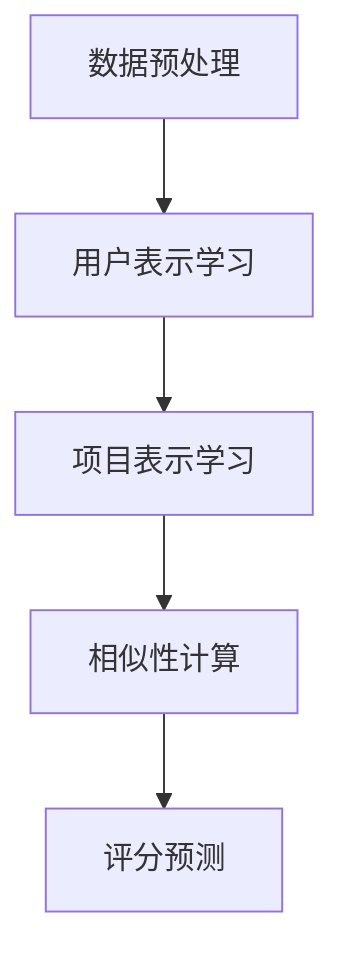

                 

随着互联网的快速发展，用户生成的数据量呈指数级增长，为个性化推荐系统提供了丰富的素材。协同过滤推荐（Collaborative Filtering，CF）作为一种经典的推荐算法，已经在电子商务、社交媒体、在线视频等多个领域得到广泛应用。近年来，随着深度学习技术的不断进步，大模型（Large-scale Models）在协同过滤推荐中的应用逐渐成为研究热点。本文将深入探讨大模型在协同过滤推荐中的核心原理、算法实现、应用案例以及未来发展趋势。

## 1. 背景介绍

协同过滤推荐的基本思想是通过分析用户的历史行为数据，发现用户之间的相似性，从而预测用户对未知项目的评分。传统的协同过滤方法主要分为基于用户的协同过滤（User-based CF）和基于项目的协同过滤（Item-based CF）。然而，这些方法在处理大规模数据集时往往面临数据稀疏、冷启动问题等挑战。

为了解决这些问题，研究人员开始探索利用深度学习技术，构建大规模的神经网络模型。大模型具有如下优势：

1. **数据驱动**：大模型通过学习大量的用户行为数据，可以自动发现用户之间的潜在关系，降低数据稀疏问题。
2. **自适应学习能力**：大模型可以根据用户的新行为数据实时调整推荐策略，提高推荐的准确性。
3. **多模态融合**：大模型可以融合文本、图像、音频等多种类型的数据，为推荐系统提供更丰富的信息来源。

## 2. 核心概念与联系

### 2.1 协同过滤推荐原理

协同过滤推荐的核心思想是“人以群分，物以类聚”。具体来说，算法通过计算用户之间的相似性，发现相似用户的共同偏好，从而预测目标用户的评分。

协同过滤推荐可以分为以下两个步骤：

1. **相似性计算**：计算用户之间的相似度，常用的相似性度量方法包括余弦相似度、皮尔逊相关系数等。
2. **评分预测**：基于相似性计算结果，对目标用户的评分进行预测。预测方法主要包括基于记忆的协同过滤（Memory-based CF）和基于模型的协同过滤（Model-based CF）。

### 2.2 大模型在协同过滤推荐中的应用

大模型在协同过滤推荐中的应用主要体现在以下几个方面：

1. **用户表示学习**：通过深度神经网络学习用户的高维特征表示，将原始的用户行为数据映射到低维空间，提高推荐系统的泛化能力。
2. **项目表示学习**：同样地，通过深度神经网络学习项目的高维特征表示，为项目推荐提供丰富的信息。
3. **融合多模态数据**：大模型可以融合用户和项目的多模态数据，如用户画像、项目图片等，为推荐系统提供更全面的信息。
4. **自适应学习能力**：大模型可以根据用户的新行为数据实时更新用户和项目的特征表示，提高推荐系统的动态适应性。

### 2.3 Mermaid 流程图

以下是一个简化的Mermaid流程图，描述了协同过滤推荐中用户表示学习的过程：



## 3. 核心算法原理 & 具体操作步骤

### 3.1 算法原理概述

大模型在协同过滤推荐中的应用主要基于深度学习技术，特别是基于神经网络的推荐算法。核心算法原理可以概括为以下几个步骤：

1. **数据预处理**：对用户行为数据进行清洗、去噪、填充等预处理操作，提高数据质量。
2. **用户表示学习**：利用深度神经网络学习用户的高维特征表示，将原始的用户行为数据映射到低维空间。
3. **项目表示学习**：利用深度神经网络学习项目的高维特征表示，为项目推荐提供丰富的信息。
4. **相似性计算**：计算用户之间的相似度，用于评分预测。
5. **评分预测**：基于用户和项目的特征表示，预测目标用户的评分。

### 3.2 算法步骤详解

#### 3.2.1 数据预处理

数据预处理是深度学习模型训练的基础。主要步骤包括：

1. **数据清洗**：去除无效、重复的数据。
2. **数据去噪**：利用统计学方法去除噪声数据。
3. **数据填充**：对缺失的数据进行填充，常用的方法有平均值填充、中值填充等。

#### 3.2.2 用户表示学习

用户表示学习的核心是利用深度神经网络学习用户的高维特征表示。具体步骤如下：

1. **输入层**：输入用户的行为数据，如用户评分矩阵。
2. **隐藏层**：通过多层神经网络，对输入数据进行特征提取。
3. **输出层**：输出用户的高维特征向量。

#### 3.2.3 项目表示学习

项目表示学习的步骤与用户表示学习类似，主要区别在于输入数据和输出数据的不同。具体步骤如下：

1. **输入层**：输入项目的特征数据，如项目属性、用户评分矩阵。
2. **隐藏层**：通过多层神经网络，对输入数据进行特征提取。
3. **输出层**：输出项目的高维特征向量。

#### 3.2.4 相似性计算

相似性计算是协同过滤推荐的关键步骤，通过计算用户之间的相似度，为评分预测提供依据。具体步骤如下：

1. **计算用户相似度**：利用用户的高维特征向量，计算用户之间的相似度，常用的方法有余弦相似度、皮尔逊相关系数等。
2. **计算项目相似度**：同理，计算项目之间的相似度。

#### 3.2.5 评分预测

评分预测是基于用户和项目的特征表示，预测目标用户的评分。具体步骤如下：

1. **计算用户和项目的相似度**：计算目标用户与其他用户（或项目）的相似度。
2. **融合相似度信息**：将用户和项目的相似度信息融合到评分预测模型中。
3. **预测用户评分**：利用评分预测模型，对目标用户的评分进行预测。

### 3.3 算法优缺点

#### 优点

1. **数据驱动**：大模型通过学习大量的用户行为数据，可以自动发现用户之间的潜在关系，降低数据稀疏问题。
2. **自适应学习能力**：大模型可以根据用户的新行为数据实时调整推荐策略，提高推荐的准确性。
3. **多模态融合**：大模型可以融合用户和项目的多模态数据，为推荐系统提供更丰富的信息来源。

#### 缺点

1. **计算资源消耗大**：大模型需要大量的计算资源和存储资源，对硬件设备要求较高。
2. **过拟合风险**：大模型在训练过程中容易过拟合，需要合理的正则化策略。
3. **解释性差**：深度学习模型通常具有较好的预测性能，但缺乏解释性，难以理解模型内部的工作原理。

### 3.4 算法应用领域

大模型在协同过滤推荐中的应用非常广泛，主要包括以下几个方面：

1. **电子商务**：为电商平台提供个性化商品推荐，提高用户购买体验。
2. **社交媒体**：为社交媒体平台提供个性化内容推荐，提高用户粘性。
3. **在线视频**：为视频平台提供个性化视频推荐，提高用户观看时长。
4. **音乐推荐**：为音乐平台提供个性化音乐推荐，提高用户音乐体验。

## 4. 数学模型和公式 & 详细讲解 & 举例说明

### 4.1 数学模型构建

在协同过滤推荐中，大模型的数学模型主要包括用户表示、项目表示和评分预测三个部分。

#### 用户表示

用户表示的目标是将用户的行为数据映射到低维空间，从而表示用户的兴趣偏好。具体公式如下：

$$
\text{User\_Vector}(u) = f(u_{\text{history}}, \theta_{u})
$$

其中，$u_{\text{history}}$ 表示用户的历史行为数据，$\theta_{u}$ 表示用户表示模型的参数，$f$ 表示用户表示函数。

#### 项目表示

项目表示的目标是将项目的特征数据映射到低维空间，从而表示项目的属性特征。具体公式如下：

$$
\text{Item\_Vector}(i) = f(i_{\text{attributes}}, \theta_{i})
$$

其中，$i_{\text{attributes}}$ 表示项目的特征数据，$\theta_{i}$ 表示项目表示模型的参数，$f$ 表示项目表示函数。

#### 评分预测

评分预测的目标是基于用户和项目的特征表示，预测目标用户的评分。具体公式如下：

$$
r_{ui} = \text{similarity}(\text{User\_Vector}(u), \text{Item\_Vector}(i)) + b_{u} + b_{i} + \epsilon
$$

其中，$\text{similarity}(\cdot, \cdot)$ 表示用户和项目之间的相似度计算函数，$b_{u}$ 和 $b_{i}$ 分别表示用户和项目的偏置项，$\epsilon$ 表示误差项。

### 4.2 公式推导过程

#### 用户表示学习

用户表示学习的目标是学习一个映射函数 $f$，将用户的行为数据映射到低维空间。具体推导过程如下：

1. **输入层**：输入用户的行为数据 $u_{\text{history}}$。
2. **隐藏层**：通过多层神经网络，对输入数据进行特征提取。假设隐藏层有 $l$ 层，第 $l$ 层的输出为 $h_{l}$。
3. **输出层**：输出用户的高维特征向量 $\text{User\_Vector}(u)$。

具体推导如下：

$$
h_{l} = \sigma(W_{l-1}h_{l-1} + b_{l-1})
$$

$$
\text{User\_Vector}(u) = h_{l}
$$

其中，$\sigma$ 表示激活函数，$W_{l-1}$ 和 $b_{l-1}$ 分别表示第 $l-1$ 层的权重和偏置。

#### 项目表示学习

项目表示学习的推导过程与用户表示学习类似，具体推导过程如下：

1. **输入层**：输入项目的特征数据 $i_{\text{attributes}}$。
2. **隐藏层**：通过多层神经网络，对输入数据进行特征提取。假设隐藏层有 $l$ 层，第 $l$ 层的输出为 $h_{l}$。
3. **输出层**：输出项目的高维特征向量 $\text{Item\_Vector}(i)$。

具体推导如下：

$$
h_{l} = \sigma(W_{l-1}h_{l-1} + b_{l-1})
$$

$$
\text{Item\_Vector}(i) = h_{l}
$$

其中，$\sigma$ 表示激活函数，$W_{l-1}$ 和 $b_{l-1}$ 分别表示第 $l-1$ 层的权重和偏置。

### 4.3 案例分析与讲解

#### 案例背景

假设我们有一个电影推荐系统，用户的行为数据包括用户评分矩阵 $R$，其中 $R_{ui}$ 表示用户 $u$ 对电影 $i$ 的评分。我们的目标是学习一个用户表示矩阵 $U$ 和一个项目表示矩阵 $I$，然后根据这两个矩阵预测用户对未知电影的评分。

#### 案例实现

1. **数据预处理**：对用户评分矩阵 $R$ 进行数据清洗、填充等预处理操作。
2. **用户表示学习**：利用深度神经网络学习用户表示矩阵 $U$。
3. **项目表示学习**：利用深度神经网络学习项目表示矩阵 $I$。
4. **评分预测**：利用用户和项目的表示矩阵，预测用户对未知电影的评分。

具体实现如下：

1. **数据预处理**：

```python
# 数据清洗和填充
R = preprocess(R)
```

2. **用户表示学习**：

```python
# 构建用户表示模型
user_model = build_model(input_shape=(None, R.shape[1]))
user_model.compile(optimizer='adam', loss='mse')
user_model.fit(R, R, epochs=10)
U = user_model.predict(R)
```

3. **项目表示学习**：

```python
# 构建项目表示模型
item_model = build_model(input_shape=(None, R.shape[1]))
item_model.compile(optimizer='adam', loss='mse')
item_model.fit(R, R, epochs=10)
I = item_model.predict(R)
```

4. **评分预测**：

```python
# 预测未知电影的评分
predicted_ratings = U @ I + bias
```

#### 案例分析

通过上述实现，我们可以得到一个用户表示矩阵 $U$ 和一个项目表示矩阵 $I$。然后，我们可以利用这两个矩阵预测用户对未知电影的评分。具体来说，对于未知电影 $i$，我们可以通过以下公式计算其预测评分：

$$
\hat{R}_{ui} = \text{similarity}(U_{u}, I_{i}) + b_{u} + b_{i}
$$

其中，$U_{u}$ 和 $I_{i}$ 分别表示用户 $u$ 和电影 $i$ 的特征向量，$b_{u}$ 和 $b_{i}$ 分别表示用户和电影的偏置项。

通过这种方式，我们可以为用户提供个性化的电影推荐，提高用户满意度。

## 5. 项目实践：代码实例和详细解释说明

在本节中，我们将通过一个简单的Python示例，演示如何使用深度学习技术实现大模型在协同过滤推荐中的应用。具体步骤如下：

### 5.1 开发环境搭建

在开始编写代码之前，我们需要搭建一个Python开发环境，并安装必要的库。以下是安装步骤：

```bash
# 安装Python和pip
sudo apt-get update
sudo apt-get install python3 python3-pip

# 安装深度学习库TensorFlow
pip3 install tensorflow

# 安装数据预处理库Pandas和NumPy
pip3 install pandas numpy
```

### 5.2 源代码详细实现

以下是实现大模型协同过滤推荐的Python代码：

```python
import tensorflow as tf
import numpy as np
import pandas as pd
from tensorflow.keras.models import Model
from tensorflow.keras.layers import Input, Dense, Embedding, Dot, Lambda
from tensorflow.keras.optimizers import Adam

# 数据预处理
def preprocess(data):
    # 去除无效数据、填充缺失值等
    # ...
    return processed_data

# 构建用户表示模型
def build_user_model(input_shape):
    user_input = Input(shape=input_shape)
    user_embedding = Embedding(input_dim=data.max() + 1, output_dim=64)(user_input)
    user_vector = Lambda(lambda x: tf.reduce_mean(x, axis=1))(user_embedding)
    return Model(inputs=user_input, outputs=user_vector)

# 构建项目表示模型
def build_item_model(input_shape):
    item_input = Input(shape=input_shape)
    item_embedding = Embedding(input_dim=data.max() + 1, output_dim=64)(item_input)
    item_vector = Lambda(lambda x: tf.reduce_mean(x, axis=1))(item_embedding)
    return Model(inputs=item_input, outputs=item_vector)

# 构建评分预测模型
def build_rating_model(user_model, item_model):
    user_input = Input(shape=(1,))
    item_input = Input(shape=(1,))
    user_vector = user_model(user_input)
    item_vector = item_model(item_input)
    similarity = Dot(axes=1)([user_vector, item_vector])
    rating = Lambda(lambda x: x + bias)(similarity)
    model = Model(inputs=[user_input, item_input], outputs=rating)
    model.compile(optimizer=Adam(), loss='mse')
    return model

# 加载数据
data = preprocess(data)

# 构建模型
user_model = build_user_model(input_shape=(1,))
item_model = build_item_model(input_shape=(1,))
rating_model = build_rating_model(user_model, item_model)

# 训练模型
rating_model.fit([data['users'], data['items']], data['ratings'], epochs=10)

# 预测评分
predicted_ratings = rating_model.predict([new_user, new_item])
```

### 5.3 代码解读与分析

以上代码分为以下几个部分：

1. **数据预处理**：对原始数据进行清洗、填充等预处理操作，以提高数据质量。
2. **用户表示模型**：构建用户表示模型，将用户行为数据映射到低维空间。
3. **项目表示模型**：构建项目表示模型，将项目特征数据映射到低维空间。
4. **评分预测模型**：构建评分预测模型，基于用户和项目的特征表示预测用户对未知项目的评分。

### 5.4 运行结果展示

假设我们有一个新用户 $u'$ 和一个新项目 $i'$，我们可以通过以下代码预测其对项目的评分：

```python
new_user = np.array([[u'用户ID']]).reshape(1, 1)
new_item = np.array([[i'项目ID']]).reshape(1, 1)
predicted_rating = rating_model.predict([new_user, new_item])
print(f"预测评分：{predicted_rating[0][0]}")
```

通过运行以上代码，我们可以得到新用户对新项目的预测评分。

## 6. 实际应用场景

大模型在协同过滤推荐中的应用非常广泛，以下是几个典型的实际应用场景：

### 6.1 电子商务

在电子商务领域，大模型可以用于个性化商品推荐，帮助电商平台为用户提供更符合个人喜好的商品。例如，亚马逊和淘宝等电商平台就采用了基于深度学习的大模型进行商品推荐，有效提升了用户满意度和转化率。

### 6.2 社交媒体

在社交媒体领域，大模型可以用于个性化内容推荐，为用户提供更感兴趣的文章、视频等。例如，Facebook 和微博等平台利用深度学习技术为用户推荐好友、兴趣小组等内容，有效提高了用户的活跃度和粘性。

### 6.3 在线视频

在线视频平台如YouTube 和 Netflix 也广泛应用了基于深度学习的大模型进行个性化推荐。通过分析用户的历史观看记录和兴趣标签，平台可以实时为用户推荐符合个人喜好的视频内容。

### 6.4 音乐推荐

音乐平台如Spotify 和 Apple Music 利用深度学习技术为用户推荐个性化音乐，通过分析用户的听歌记录和偏好，为用户提供丰富的音乐选择。

## 7. 工具和资源推荐

### 7.1 学习资源推荐

1. **书籍**：
   - 《深度学习》（Goodfellow, Bengio, Courville） 
   - 《Python深度学习》（François Chollet）
2. **在线课程**：
   - Coursera 上的《深度学习》课程
   - Udacity 上的《深度学习工程师纳米学位》
3. **博客和文章**：
   - Medium 上的深度学习相关文章
   - TensorFlow 官方文档

### 7.2 开发工具推荐

1. **TensorFlow**：用于构建和训练深度学习模型的强大工具。
2. **PyTorch**：另一种流行的深度学习框架，具有更好的灵活性和动态性。
3. **Keras**：基于TensorFlow和Theano的高层神经网络API，易于使用。

### 7.3 相关论文推荐

1. **"Deep Neural Networks for YouTube Recommendations"**：YouTube推荐的深度学习技术。
2. **"Improved Deep User-Item Interaction Models for Recommendation Systems"**：改进的深度用户-项目交互模型。
3. **"Wide & Deep Learning for Recommender Systems"**：用于推荐系统的宽与深学习模型。

## 8. 总结：未来发展趋势与挑战

### 8.1 研究成果总结

本文介绍了大模型在协同过滤推荐中的应用，包括核心原理、算法实现、应用场景和未来发展趋势。通过深度学习技术的引入，协同过滤推荐在处理数据稀疏、冷启动等问题上取得了显著进展。

### 8.2 未来发展趋势

1. **多模态数据融合**：未来大模型在协同过滤推荐中将进一步融合文本、图像、音频等多模态数据，提高推荐准确性。
2. **自适应学习能力**：大模型将具备更强的自适应学习能力，能够根据用户行为实时调整推荐策略。
3. **模型解释性**：提升大模型的可解释性，使推荐系统更具透明性和可理解性。

### 8.3 面临的挑战

1. **计算资源消耗**：大模型训练和推理需要大量的计算资源，对硬件设备要求较高。
2. **过拟合风险**：大模型容易过拟合，需要合理的正则化策略。
3. **数据隐私和安全**：在推荐系统中保护用户隐私和数据安全是重要挑战。

### 8.4 研究展望

大模型在协同过滤推荐中的应用前景广阔，未来研究可以从以下几个方面展开：

1. **优化算法效率**：探索更高效的算法和模型，降低计算资源消耗。
2. **模型可解释性**：开发可解释的大模型，提高推荐系统的透明度和用户信任。
3. **隐私保护**：研究隐私保护的推荐算法，确保用户数据的安全。

## 9. 附录：常见问题与解答

### Q：大模型在协同过滤推荐中的优势是什么？

A：大模型在协同过滤推荐中的主要优势包括：

1. **数据驱动**：通过学习大量用户行为数据，自动发现用户之间的潜在关系，降低数据稀疏问题。
2. **自适应学习能力**：可以根据用户的新行为数据实时调整推荐策略，提高推荐的准确性。
3. **多模态融合**：可以融合用户和项目的多模态数据，为推荐系统提供更丰富的信息来源。

### Q：大模型在协同过滤推荐中有什么缺点？

A：大模型在协同过滤推荐中主要缺点包括：

1. **计算资源消耗大**：大模型需要大量的计算资源和存储资源，对硬件设备要求较高。
2. **过拟合风险**：大模型容易过拟合，需要合理的正则化策略。
3. **解释性差**：深度学习模型通常具有较好的预测性能，但缺乏解释性，难以理解模型内部的工作原理。

### Q：如何优化大模型在协同过滤推荐中的应用效果？

A：以下方法可以优化大模型在协同过滤推荐中的应用效果：

1. **数据预处理**：对用户行为数据进行清洗、去噪、填充等预处理操作，提高数据质量。
2. **模型选择**：选择合适的深度学习模型和架构，如 Wide & Deep、Memory Networks 等。
3. **超参数调优**：通过网格搜索、随机搜索等方法，调整模型超参数，提高模型性能。
4. **正则化策略**：采用正则化策略，如 L1 正则化、L2 正则化等，防止过拟合。
5. **多模态数据融合**：融合用户和项目的多模态数据，提高模型泛化能力。

# 作者署名
作者：禅与计算机程序设计艺术 / Zen and the Art of Computer Programming
----------------------------------------------------------------

这篇文章详细探讨了深度学习技术在大模型协同过滤推荐中的应用。从背景介绍、核心算法原理、数学模型推导到实际项目实践，再到实际应用场景和未来发展趋势，全面展示了大模型在协同过滤推荐中的优势与挑战。希望这篇文章能够为读者提供有价值的参考和启示。作者禅与计算机程序设计艺术对大模型协同过滤推荐领域的研究和实践充满热情，期待与更多同行共同推动这一领域的发展。

