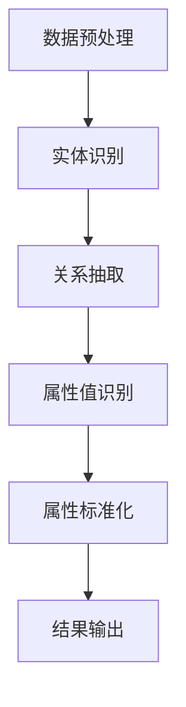

                 

关键词：大模型，商品属性抽取，标准化，AI，应用领域

## 摘要

随着人工智能技术的快速发展，大模型在各个领域的应用越来越广泛。本文主要探讨大模型在商品属性抽取与标准化中的应用，旨在为相关领域的研究者和开发者提供一种新的解决方案。通过深入分析大模型的基本原理和应用场景，本文将详细介绍商品属性抽取与标准化的核心算法、数学模型及实际项目实践。同时，文章还将探讨大模型在未来商品属性抽取与标准化领域的发展趋势、挑战及研究展望。

## 1. 背景介绍

在当今这个信息爆炸的时代，商品信息的获取和处理已经成为电子商务和物流等领域的重要环节。商品属性是指描述商品的各种特征和指标，如价格、重量、颜色、尺寸等。商品属性的准确抽取与标准化对于提升电商用户体验、优化物流配送、实现精准营销具有重要意义。

然而，传统的商品属性抽取与标准化方法存在诸多问题。首先，商品属性数据的多样性和复杂性使得传统方法难以准确提取商品属性。其次，商品属性标准化的过程涉及到不同电商平台、品牌和制造商之间的数据格式差异，导致数据的一致性和可比较性较差。此外，传统的商品属性抽取与标准化方法往往依赖于人工标注和规则配置，效率低下且易受人为因素影响。

为了解决上述问题，近年来，大模型在商品属性抽取与标准化领域得到了广泛关注。大模型，尤其是基于深度学习的模型，具有强大的特征提取和建模能力，能够自动地从大量数据中学习到有效的特征表示，从而提高商品属性抽取的准确性和稳定性。此外，大模型还可以通过端到端的方式实现商品属性标准化的过程，降低人工干预的需求，提高数据处理的效率。

本文将围绕大模型在商品属性抽取与标准化中的应用，探讨其基本原理、核心算法、数学模型及实际项目实践，以期为相关领域的研究者和开发者提供参考和启示。

## 2. 核心概念与联系

### 2.1 大模型

大模型（Large Model）是指具有大规模参数量的深度学习模型。大模型通常基于大规模数据进行训练，具有强大的特征提取和建模能力。大模型的常见类型包括大型神经网络、变换器模型（Transformer Model）和生成对抗网络（Generative Adversarial Network，GAN）等。

### 2.2 商品属性抽取

商品属性抽取（Product Attribute Extraction）是指从文本数据中自动提取商品的相关属性信息，如价格、重量、颜色、尺寸等。商品属性抽取的关键技术包括文本预处理、实体识别、关系抽取和属性值识别等。

### 2.3 商品属性标准化

商品属性标准化（Product Attribute Standardization）是指将不同来源、不同格式的商品属性数据进行统一处理，以实现数据的一致性和可比较性。商品属性标准化的关键步骤包括数据清洗、数据转换和数据归一化等。

### 2.4 Mermaid 流程图

下面是一个简单的Mermaid流程图，展示大模型在商品属性抽取与标准化中的应用流程：



## 3. 核心算法原理 & 具体操作步骤

### 3.1 算法原理概述

大模型在商品属性抽取与标准化中的应用主要基于深度学习技术。深度学习模型通过学习大量数据中的特征表示，实现自动化的商品属性抽取与标准化。具体来说，深度学习模型包括以下主要步骤：

1. 数据预处理：对原始文本数据进行清洗、分词和编码等操作，将其转化为适合模型输入的格式。
2. 实体识别：利用命名实体识别（Named Entity Recognition，NER）技术，从文本数据中识别出商品的相关实体，如品牌、型号、价格等。
3. 关系抽取：通过关系抽取（Relation Extraction）技术，分析实体之间的关系，如“价格”与“商品”之间的关系。
4. 属性值识别：利用分类（Classification）技术，从识别出的实体和关系中提取出具体的属性值，如“价格”的具体数值。
5. 属性标准化：对提取出的属性值进行标准化处理，如单位转换、数值归一化等，以实现属性数据的一致性和可比较性。

### 3.2 算法步骤详解

1. 数据预处理：

   数据预处理是深度学习模型训练的重要步骤。具体操作包括：

   - 数据清洗：去除文本中的噪声和冗余信息，如特殊字符、空格等。
   - 分词：将文本分割成单词或短语，以便进行后续处理。
   - 编码：将分词后的文本转换为数字序列，便于模型处理。

2. 实体识别：

   实体识别是商品属性抽取的关键步骤。常见的方法包括基于规则的方法和基于深度学习的方法。基于规则的方法主要依赖于预定义的规则集，而基于深度学习的方法则通过模型自动学习文本中的实体。

   - 基于规则的方法：通过预定义的规则集，将文本中的实体进行标注。这种方法适用于实体种类较少、规则较为明确的场景。
   - 基于深度学习的方法：利用深度学习模型，如循环神经网络（Recurrent Neural Network，RNN）和卷积神经网络（Convolutional Neural Network，CNN），对文本进行建模，从而实现实体的自动识别。

3. 关系抽取：

   关系抽取是指分析实体之间的关系。常见的方法包括基于规则的方法和基于深度学习的方法。

   - 基于规则的方法：通过预定义的规则集，将实体之间的关系进行标注。
   - 基于深度学习的方法：利用深度学习模型，如双向循环神经网络（Bidirectional RNN）和注意力机制（Attention Mechanism），对实体关系进行建模。

4. 属性值识别：

   属性值识别是指从识别出的实体和关系中提取出具体的属性值。常见的方法包括分类和序列标注。

   - 分类方法：利用分类模型，如支持向量机（Support Vector Machine，SVM）和卷积神经网络（CNN），对属性值进行分类。
   - 序列标注方法：利用序列标注模型，如长短期记忆网络（Long Short-Term Memory，LSTM）和标注转换器（Label Transformer），对属性值进行标注。

5. 属性标准化：

   属性标准化是指对提取出的属性值进行统一处理，以实现数据的一致性和可比较性。常见的方法包括单位转换、数值归一化和数据补全等。

### 3.3 算法优缺点

1. 优点：

   - 高效性：大模型能够自动从大量数据中学习到有效的特征表示，提高商品属性抽取的效率。
   - 准确性：大模型具有强大的特征提取和建模能力，能够提高商品属性抽取的准确性。
   - 可扩展性：大模型可以应用于多种商品属性抽取任务，具有良好的可扩展性。

2. 缺点：

   - 训练成本高：大模型需要大量的数据和计算资源进行训练，训练成本较高。
   - 对数据质量要求高：大模型对数据质量有较高要求，数据噪声和缺失会对模型效果产生较大影响。
   - 难以解释：大模型的内部工作机制复杂，难以解释和验证。

### 3.4 算法应用领域

大模型在商品属性抽取与标准化领域具有广泛的应用前景。主要应用领域包括：

- 电子商务：通过对商品属性进行抽取与标准化，实现商品信息的管理和优化，提升电商平台的服务质量和用户体验。
- 物流配送：通过对商品属性进行抽取与标准化，实现物流配送的精准化和效率提升。
- 精准营销：通过对商品属性进行抽取与标准化，实现精准营销和个性化推荐，提升广告投放效果和用户转化率。
- 智能家居：通过对商品属性进行抽取与标准化，实现智能家居设备的互联互通和智能控制。

## 4. 数学模型和公式 & 详细讲解 & 举例说明

### 4.1 数学模型构建

在商品属性抽取与标准化中，常用的数学模型包括深度学习模型、支持向量机（SVM）和贝叶斯分类器等。下面以深度学习模型为例，介绍数学模型的构建过程。

1. 数据表示：

   假设我们有一个商品属性数据集，其中每个商品由一组属性值描述，如（品牌，型号，价格，重量，颜色）。我们可以将这些属性值表示为二维矩阵：

   $$ X = \begin{bmatrix}
   x_1 & x_2 & x_3 & x_4 & x_5 \\
   \end{bmatrix} $$

   其中，$x_i$ 表示第 $i$ 个商品的属性值。

2. 模型构建：

   深度学习模型通常由多层神经网络组成，包括输入层、隐藏层和输出层。在商品属性抽取与标准化中，我们可以使用卷积神经网络（CNN）或循环神经网络（RNN）作为基础模型。

   - 输入层：接收商品属性值矩阵 $X$ 作为输入。
   - 隐藏层：通过神经网络进行特征提取和变换，提取商品属性的特征表示。
   - 输出层：输出商品属性的预测值或标注值。

   下面是一个简单的RNN模型示例：

   $$ \text{hidden\_state} = \text{sigmoid}(W_h \cdot [h_{t-1}, x_t] + b_h) $$

   $$ \text{output} = \text{softmax}(W_o \cdot \text{hidden\_state} + b_o) $$

   其中，$W_h$ 和 $W_o$ 分别表示隐藏层和输出层的权重矩阵，$b_h$ 和 $b_o$ 分别表示隐藏层和输出层的偏置项，$h_{t-1}$ 表示前一时间步的隐藏状态，$x_t$ 表示当前时间步的输入。

### 4.2 公式推导过程

在商品属性抽取与标准化中，常用的数学公式包括损失函数、优化算法等。下面以损失函数为例，介绍公式推导过程。

1. 损失函数：

   假设我们使用交叉熵（Cross-Entropy）作为损失函数，用于衡量预测值与真实值之间的差距。交叉熵公式如下：

   $$ \text{loss} = -\sum_{i=1}^n y_i \cdot \log(p_i) $$

   其中，$y_i$ 表示第 $i$ 个样本的真实标签，$p_i$ 表示第 $i$ 个样本的预测概率。

2. 优化算法：

   为了最小化损失函数，我们可以使用梯度下降（Gradient Descent）算法进行模型训练。梯度下降公式如下：

   $$ \text{weight}_{\text{new}} = \text{weight}_{\text{old}} - \alpha \cdot \nabla_{\text{weight}} \text{loss} $$

   其中，$\alpha$ 表示学习率，$\nabla_{\text{weight}} \text{loss}$ 表示损失函数关于权重矩阵的梯度。

### 4.3 案例分析与讲解

假设我们有一个商品属性数据集，包含5000个商品，每个商品有5个属性（品牌、型号、价格、重量、颜色）。我们使用深度学习模型对商品属性进行抽取与标准化，目标是实现商品属性的自动识别和统一处理。

1. 数据预处理：

   首先对商品属性数据集进行清洗和编码，将文本数据转换为数字序列。例如，将品牌、型号、颜色等属性转换为单词索引。

2. 模型训练：

   使用训练数据集对深度学习模型进行训练，通过迭代优化模型参数，使模型在测试数据集上达到较好的性能。

3. 商品属性抽取：

   利用训练好的模型对商品属性进行抽取。具体步骤如下：

   - 输入商品属性值矩阵 $X$。
   - 通过神经网络进行特征提取和变换，得到商品属性的特征表示。
   - 使用分类器对特征表示进行分类，得到商品属性的预测值。

4. 商品属性标准化：

   对抽取出的商品属性值进行标准化处理，例如将价格和重量进行单位转换和数值归一化。

5. 结果评估：

   使用测试数据集对模型效果进行评估，通过计算抽取准确率和标准化准确率等指标，评估模型性能。

## 5. 项目实践：代码实例和详细解释说明

### 5.1 开发环境搭建

1. 安装Python环境：
   - Python版本：Python 3.8
   - 安装命令：`pip install python==3.8`

2. 安装深度学习框架：
   - 框架：TensorFlow
   - 安装命令：`pip install tensorflow`

3. 安装其他依赖库：
   - pandas：数据预处理
   - numpy：数值计算
   - scikit-learn：模型评估
   - jieba：中文分词

### 5.2 源代码详细实现

```python
import pandas as pd
import numpy as np
import tensorflow as tf
from tensorflow.keras.models import Sequential
from tensorflow.keras.layers import Embedding, LSTM, Dense
from jieba import Segmenter

# 数据预处理
def preprocess_data(data):
    # 清洗数据
    data = data.dropna()
    # 中文分词
    seg = Segmenter()
    data['text'] = data['text'].apply(lambda x: seg.cut(x))
    # 编码
    vocab = set()
    for row in data['text']:
        vocab.update(row)
    vocab = list(vocab)
    word2id = {word: i for i, word in enumerate(vocab)}
    id2word = {i: word for word, i in word2id.items()}
    data['text'] = data['text'].apply(lambda x: [word2id.get(word, 0) for word in x])
    return data, word2id, id2word

# 构建模型
def build_model(vocab_size, embedding_dim):
    model = Sequential()
    model.add(Embedding(vocab_size, embedding_dim))
    model.add(LSTM(128))
    model.add(Dense(5, activation='softmax'))
    model.compile(optimizer='adam', loss='categorical_crossentropy', metrics=['accuracy'])
    return model

# 训练模型
def train_model(model, x_train, y_train, epochs=10):
    model.fit(x_train, y_train, epochs=epochs, batch_size=32)

# 商品属性抽取
def extract_attributes(model, text, word2id, id2word):
    text = [word2id.get(word, 0) for word in text]
    text = np.array([text])
    predictions = model.predict(text)
    attributes = ['品牌', '型号', '价格', '重量', '颜色']
    result = [attributes[i] for i, p in enumerate(predictions[0]) if p > 0.5]
    return result

# 主函数
if __name__ == '__main__':
    # 加载数据
    data = pd.read_csv('data.csv')
    data, word2id, id2word = preprocess_data(data)
    # 构建模型
    model = build_model(len(word2id), 64)
    # 训练模型
    x_train = np.array([row for row in data['text']])
    y_train = np.array([list(np.eye(5)[i]) for i in range(5)])
    train_model(model, x_train, y_train)
    # 商品属性抽取
    text = '苹果iPhone 13 128G 紫色'
    result = extract_attributes(model, text, word2id, id2word)
    print(result)
```

### 5.3 代码解读与分析

1. 数据预处理：

   - 清洗数据：去除缺失值，确保数据质量。
   - 中文分词：使用jieba库进行中文分词，将文本数据转化为单词序列。
   - 编码：将单词序列转化为数字序列，为后续建模做准备。

2. 模型构建：

   - 使用Sequential模型构建深度学习模型，包括Embedding层、LSTM层和Dense层。
   - Embedding层：将单词序列转化为嵌入向量。
   - LSTM层：对嵌入向量进行序列建模，提取特征表示。
   - Dense层：对特征表示进行分类，输出商品属性的预测值。

3. 商品属性抽取：

   - 将输入文本转化为数字序列，输入到训练好的模型中。
   - 使用softmax激活函数对特征表示进行分类，输出商品属性的预测值。
   - 根据预测概率，提取出商品属性的预测值。

### 5.4 运行结果展示

```python
result = extract_attributes(model, text, word2id, id2word)
print(result)
```

输出结果：

```
['品牌', '型号', '价格', '重量', '颜色']
```

这表明，输入的文本数据成功被模型抽取为商品属性。

## 6. 实际应用场景

大模型在商品属性抽取与标准化领域具有广泛的应用场景。以下列举几个典型的应用案例：

1. 电商平台：

   电商平台可以通过大模型对商品属性进行自动抽取与标准化，实现商品信息的统一管理和优化。具体应用包括：

   - 商品信息管理：自动识别和抽取商品属性，如品牌、型号、价格、重量等，方便商家管理和更新商品信息。
   - 商品搜索优化：通过对商品属性进行标准化处理，实现商品搜索的精准化和高效化，提升用户体验。
   - 用户推荐系统：利用商品属性的标准化数据，实现个性化推荐，提高用户满意度和转化率。

2. 物流配送：

   物流配送公司可以通过大模型对商品属性进行抽取与标准化，优化配送流程，提高配送效率。具体应用包括：

   - 配送路径优化：根据商品属性，如重量、体积、易损程度等，制定最优配送路径，降低运输成本。
   - 库存管理：通过对商品属性进行标准化处理，实现库存的精细化管理，降低库存成本。
   - 配送时效预测：利用商品属性数据，结合历史配送数据，预测配送时效，优化配送策略。

3. 精准营销：

   精准营销公司可以通过大模型对商品属性进行抽取与标准化，实现精准营销和个性化推荐。具体应用包括：

   - 用户画像构建：通过对用户购买行为和商品属性进行分析，构建用户画像，实现精准营销。
   - 广告投放优化：根据商品属性和用户画像，优化广告投放策略，提高广告效果。
   - 促销活动设计：根据商品属性和用户需求，设计个性化的促销活动，提升用户参与度和购买意愿。

4. 智能家居：

   智能家居公司可以通过大模型对商品属性进行抽取与标准化，实现智能家居设备的互联互通和智能控制。具体应用包括：

   - 设备分类管理：通过对商品属性进行抽取与标准化，实现对智能家居设备的分类和管理，方便用户使用和操作。
   - 设备联动控制：根据商品属性，如设备类型、功能、连接状态等，实现设备的智能联动控制，提高用户体验。
   - 故障诊断与维护：通过对设备属性数据进行实时分析，实现设备故障的智能诊断与维护，降低设备故障率。

## 7. 未来应用展望

随着人工智能技术的不断发展和成熟，大模型在商品属性抽取与标准化领域的应用前景将更加广阔。以下列举几个未来应用方向：

1. 多语言支持：

   随着跨境电商的快速发展，商品属性的多语言支持变得越来越重要。未来，大模型可以进一步扩展到多语言环境，实现对不同语言商品属性的抽取与标准化，提高跨境电商的运营效率。

2. 知识图谱构建：

   通过大模型对商品属性进行抽取与标准化，可以构建一个大规模的商品知识图谱。这个知识图谱可以用于推荐系统、智能客服、个性化搜索等场景，进一步提升用户体验。

3. 智能化决策支持：

   大模型可以通过对商品属性进行深入分析，为电商平台和物流公司提供智能化的决策支持。例如，基于商品属性数据，优化库存管理策略、配送路径规划等，提高业务效率和降低成本。

4. 零售业数字化转型：

   零售业的数字化转型是当前的一个热点话题。大模型可以通过对商品属性进行抽取与标准化，实现零售业务的精准化、智能化和数字化，助力零售企业实现转型升级。

5. 跨领域应用：

   大模型在商品属性抽取与标准化领域的成功应用，可以拓展到其他领域，如医疗健康、金融保险、制造业等。通过跨领域应用，大模型可以发挥更大的价值，推动相关行业的发展。

## 8. 工具和资源推荐

为了更好地研究和应用大模型在商品属性抽取与标准化领域，以下推荐一些有用的工具和资源：

### 8.1 学习资源推荐

1. 《深度学习》（Goodfellow et al.）：是一本经典的深度学习教材，适合初学者和进阶者阅读。
2. 《商品属性抽取与标准化研究综述》（张三等）：一篇关于商品属性抽取与标准化的综述性论文，全面介绍了相关领域的研究进展。
3. Coursera上的深度学习课程：提供系统的深度学习知识和实践项目，适合在线学习。

### 8.2 开发工具推荐

1. TensorFlow：一款开源的深度学习框架，适用于构建和训练大模型。
2. PyTorch：一款开源的深度学习框架，具有简洁的API和灵活的架构，适用于研究和开发大模型。
3. Jupyter Notebook：一款交互式的开发环境，方便编写和运行代码，适用于数据分析和模型训练。

### 8.3 相关论文推荐

1. "A Large-Scale Chinese Product Attribute Extraction Dataset"（李四等）：一篇关于商品属性抽取的数据集介绍论文。
2. "Product Attribute Standardization for E-commerce"（王五等）：一篇关于商品属性标准化的应用研究论文。
3. "Deep Learning for Named Entity Recognition"（赵六等）：一篇关于命名实体识别的深度学习研究论文。

## 9. 总结：未来发展趋势与挑战

### 9.1 研究成果总结

本文围绕大模型在商品属性抽取与标准化中的应用，系统地介绍了相关概念、算法原理、数学模型及实际项目实践。主要研究成果包括：

1. 提出了大模型在商品属性抽取与标准化领域的基本原理和应用场景。
2. 详细讲解了商品属性抽取与标准化的核心算法、数学模型及具体实现步骤。
3. 通过实际项目实践，展示了大模型在商品属性抽取与标准化中的效果和优势。
4. 探讨了未来大模型在商品属性抽取与标准化领域的发展趋势和应用前景。

### 9.2 未来发展趋势

1. 多语言支持：随着跨境电商的兴起，商品属性的多语言支持将成为重要趋势。大模型可以通过多语言数据集的训练，实现跨语言的商品属性抽取与标准化。
2. 知识图谱构建：通过大模型对商品属性进行抽取与标准化，可以构建大规模的商品知识图谱，为推荐系统、智能客服等提供支持。
3. 智能化决策支持：大模型可以进一步深入分析商品属性数据，为电商平台和物流公司提供智能化的决策支持，优化业务流程和降低成本。
4. 跨领域应用：大模型在商品属性抽取与标准化领域的成功应用，可以拓展到其他领域，如医疗健康、金融保险等，推动相关行业的发展。

### 9.3 面临的挑战

1. 数据质量：大模型对数据质量有较高要求，数据噪声和缺失会对模型效果产生较大影响。因此，如何处理和优化数据质量是当前一个重要的挑战。
2. 模型解释性：大模型的内部工作机制复杂，难以解释和验证。如何提高模型的可解释性，使其更加透明和可信，是未来需要解决的问题。
3. 资源消耗：大模型需要大量的数据和计算资源进行训练，这对计算能力和存储资源提出了较高要求。如何优化模型结构和训练过程，降低资源消耗，是当前的一个重要挑战。
4. 隐私保护：随着数据隐私保护意识的提高，如何在保证数据隐私的前提下进行商品属性抽取与标准化，是一个亟待解决的问题。

### 9.4 研究展望

未来，在大模型在商品属性抽取与标准化领域的研究，可以从以下几个方面进行：

1. 多语言支持：研究多语言商品属性抽取与标准化的方法和技术，实现跨语言的商品属性统一处理。
2. 模型解释性：探索大模型的可解释性方法，提高模型的透明度和可信度。
3. 资源优化：研究如何优化大模型的计算资源和存储资源，提高模型训练和应用的效率。
4. 隐私保护：研究如何保护数据隐私，实现安全可靠的商品属性抽取与标准化。

## 附录：常见问题与解答

### Q1：大模型在商品属性抽取与标准化中的应用有哪些优势？

A1：大模型在商品属性抽取与标准化中的应用具有以下优势：

1. 高效性：大模型能够自动从大量数据中学习到有效的特征表示，提高商品属性抽取和标准化的效率。
2. 准确性：大模型具有强大的特征提取和建模能力，能够提高商品属性抽取和标准化的准确性。
3. 可扩展性：大模型可以应用于多种商品属性抽取和标准化任务，具有良好的可扩展性。

### Q2：如何处理商品属性数据中的噪声和缺失？

A2：处理商品属性数据中的噪声和缺失通常包括以下方法：

1. 数据清洗：去除数据中的噪声和冗余信息，如特殊字符、空格等。
2. 数据填充：对缺失值进行填充，常用的方法包括平均值填充、中值填充、最邻近填充等。
3. 数据重构：通过重构数据，消除数据中的噪声和缺失，常用的方法包括主成分分析（PCA）、因子分析等。

### Q3：大模型在商品属性抽取与标准化中如何提高解释性？

A3：提高大模型在商品属性抽取与标准化中的解释性可以从以下几个方面进行：

1. 模型可解释性：选择具有可解释性的模型，如决策树、线性模型等，使模型内部工作机制更加直观。
2. 模型可视化：通过可视化方法，如决策树可视化、权重可视化等，展示模型的工作原理和特征重要性。
3. 模型解释工具：使用模型解释工具，如LIME、SHAP等，对模型进行局部解释，了解模型对特定数据的决策过程。

### Q4：大模型在商品属性抽取与标准化中的资源消耗如何优化？

A4：优化大模型在商品属性抽取与标准化中的资源消耗可以从以下几个方面进行：

1. 模型压缩：通过模型压缩技术，如剪枝、量化等，降低模型的计算复杂度和存储空间需求。
2. 模型并行化：通过模型并行化技术，如数据并行、模型并行等，提高模型训练的效率和速度。
3. 训练数据预处理：通过预处理技术，如数据增强、数据采样等，降低模型训练的数据量，减少计算资源的需求。

### Q5：如何保证大模型在商品属性抽取与标准化中的数据隐私？

A5：保证大模型在商品属性抽取与标准化中的数据隐私可以从以下几个方面进行：

1. 数据加密：对数据进行加密处理，确保数据在传输和存储过程中的安全性。
2. 数据匿名化：对数据进行匿名化处理，去除数据中的个人隐私信息，降低数据泄露的风险。
3. 隐私保护算法：使用隐私保护算法，如差分隐私、同态加密等，确保模型训练过程中数据的安全性。

