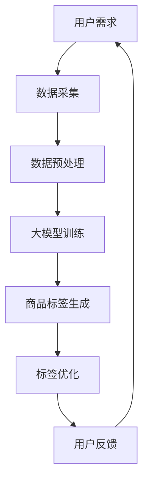

                 

关键词：商品标签、自动化、大模型、算法、数学模型

> 摘要：本文将深入探讨大模型在商品标签自动化中的应用。通过介绍背景、核心概念、算法原理、数学模型、项目实践和未来展望，本文旨在为读者提供一个全面的技术视角，了解大模型如何助力商品标签自动化，以及其潜在的应用前景和面临的挑战。

## 1. 背景介绍

在电子商务时代，商品标签（也称为产品描述或商品信息）对于消费者的购物决策至关重要。精准的商品标签不仅能提高消费者满意度，还能提升电商平台的销售额和用户留存率。然而，传统的商品标签生成方式通常依赖于人工输入或模板化文本，效率低下且难以满足个性化需求。

近年来，随着人工智能和大数据技术的发展，大模型（如大型语言模型、图像识别模型等）逐渐成为自动化商品标签生成的重要工具。大模型具有强大的数据处理和知识推理能力，能够从海量数据中提取有效信息，生成高质量的商品标签。本文将探讨大模型在商品标签自动化中的应用，为电商领域带来新的机遇和挑战。

## 2. 核心概念与联系

大模型在商品标签自动化中的应用，涉及多个核心概念和联系。以下是一个简化的 Mermaid 流程图，用于描述这些概念之间的关系。



### 2.1 用户需求

用户需求是商品标签自动化的起点。用户可能包括电商平台管理员、商家和消费者。他们希望通过精准的商品标签提高商品曝光率和销售转化率。

### 2.2 数据采集

数据采集是整个流程的基础。通过爬虫、API 调用或手动录入等方式，收集与商品相关的数据，如商品名称、描述、价格、库存、用户评价等。

### 2.3 数据预处理

数据预处理包括数据清洗、去重、格式转换等步骤，确保数据质量。这一步骤对于大模型训练至关重要，因为高质量的输入数据能够提高模型的性能。

### 2.4 大模型训练

大模型训练是商品标签自动化的核心。通过深度学习算法，如变换器模型（Transformer）或生成对抗网络（GAN），从预处理后的数据中学习生成商品标签的规律。

### 2.5 商品标签生成

基于训练好的大模型，生成商品标签。这一过程通常包括文本生成和图像生成。文本生成用于生成商品描述，图像生成用于生成商品图片的标注。

### 2.6 标签优化

生成的标签需要经过优化，以确保其准确性和可读性。标签优化可能涉及自然语言处理（NLP）技术，如文本分类、情感分析等。

### 2.7 用户反馈

用户反馈是标签优化的关键。通过收集用户对标签的反馈，不断迭代优化标签生成模型，使其更符合用户需求。

## 3. 核心算法原理 & 具体操作步骤

### 3.1 算法原理概述

商品标签自动化主要依赖于两种算法：文本生成算法和图像生成算法。文本生成算法用于生成商品描述，常见的有 GPT（Generative Pre-trained Transformer）和BERT（Bidirectional Encoder Representations from Transformers）。图像生成算法用于生成商品图片的标注，常见的有 GAN（Generative Adversarial Networks）和 StyleGAN2。

### 3.2 算法步骤详解

#### 3.2.1 文本生成算法

1. **数据采集**：从电商平台、社交媒体等渠道收集商品数据。
2. **数据预处理**：对数据进行清洗、去重和格式转换。
3. **模型训练**：使用 GPT 或 BERT 模型进行训练，输入商品特征，输出商品描述。
4. **商品描述生成**：基于训练好的模型，生成商品描述。

#### 3.2.2 图像生成算法

1. **数据采集**：从电商平台、社交媒体等渠道收集商品图片。
2. **数据预处理**：对图片进行裁剪、增强和格式转换。
3. **模型训练**：使用 GAN 或 StyleGAN2 模型进行训练，输入商品特征，输出商品图片的标注。
4. **图像标注生成**：基于训练好的模型，生成商品图片的标注。

### 3.3 算法优缺点

#### 3.3.1 文本生成算法

**优点**：
- 高效生成商品描述，节省人力成本。
- 可以根据商品特征自动调整描述风格，提高用户体验。

**缺点**：
- 需要大量的训练数据，数据质量对模型性能有较大影响。
- 生成描述的可读性和准确性可能受到限制。

#### 3.3.2 图像生成算法

**优点**：
- 可以生成高质量的图像标注，提升商品展示效果。
- 可以根据商品特征自动调整标注风格，提高用户体验。

**缺点**：
- 需要大量的训练数据和计算资源，训练过程较慢。
- 生成标注的准确性可能受到限制。

### 3.4 算法应用领域

文本生成算法和图像生成算法在商品标签自动化中有着广泛的应用，如电商商品描述生成、广告文案生成、在线旅游产品推荐等。

## 4. 数学模型和公式 & 详细讲解 & 举例说明

### 4.1 数学模型构建

商品标签自动化的数学模型主要涉及两个部分：文本生成模型和图像生成模型。

#### 4.1.1 文本生成模型

文本生成模型通常采用自回归语言模型（如 GPT）或变换器模型（如 BERT）。以下是一个简化的数学模型构建过程：

1. **输入层**：输入商品特征（如商品名称、价格、品牌等）。
2. **编码器**：将输入特征编码为固定长度的向量。
3. **解码器**：生成商品描述的词向量。
4. **输出层**：将词向量转换为商品描述的文本。

#### 4.1.2 图像生成模型

图像生成模型通常采用生成对抗网络（GAN）或 StyleGAN2。以下是一个简化的数学模型构建过程：

1. **生成器**：从随机噪声生成商品图片。
2. **判别器**：判断生成的商品图片是否真实。
3. **对抗训练**：生成器和判别器相互对抗，提高生成图片的质量。

### 4.2 公式推导过程

#### 4.2.1 文本生成模型

假设文本生成模型采用变换器模型，其数学公式如下：

$$
\begin{aligned}
    \text{Encoder}(x) &= \text{Embedding}(x) \cdot \text{Transformer}(x) \\
    \text{Decoder}(x) &= \text{Embedding}(x) \cdot \text{Transformer}(x) \\
    \text{Output} &= \text{Decoder}(\text{Encoder}(x))
\end{aligned}
$$

其中，$\text{Embedding}$ 表示词嵌入层，$\text{Transformer}$ 表示变换器层。

#### 4.2.2 图像生成模型

假设图像生成模型采用 StyleGAN2，其数学公式如下：

$$
\begin{aligned}
    \text{Generator}(z) &= \text{StyleGAN2}(z) \\
    \text{Discriminator}(x) &= \text{Discriminator}(x)
\end{aligned}
$$

其中，$z$ 表示随机噪声，$x$ 表示生成的商品图片。

### 4.3 案例分析与讲解

#### 4.3.1 文本生成模型

以下是一个基于 GPT 模型的文本生成案例：

1. **输入特征**：商品名称（"苹果手机"）、价格（"5999 元"）、品牌（"苹果"）。
2. **编码器输出**：向量表示输入特征，如（[1, 0, 0, 0, 0]，[0, 1, 0, 0, 0]，[0, 0, 1, 0, 0]）。
3. **解码器输出**：生成商品描述，如"这款苹果手机售价 5999 元，拥有出色的性能和设计。"

#### 4.3.2 图像生成模型

以下是一个基于 StyleGAN2 的图像生成案例：

1. **输入噪声**：随机噪声向量，如（[0.1, 0.2, 0.3, 0.4, 0.5]）。
2. **生成器输出**：生成商品图片，如一张精美的苹果手机图片。
3. **判别器输出**：判断生成图片的真实性，如概率 0.9，表示生成的图片接近真实图片。

## 5. 项目实践：代码实例和详细解释说明

### 5.1 开发环境搭建

在开始项目实践之前，我们需要搭建一个适合大模型训练和商品标签生成的开发环境。以下是一个基本的开发环境搭建步骤：

1. **硬件要求**：GPU（如 NVIDIA 显卡）和足够的内存。
2. **软件要求**：Python（3.8及以上版本）、TensorFlow（2.0及以上版本）和 PyTorch（1.8及以上版本）。
3. **安装步骤**：使用虚拟环境安装相关依赖包，如以下命令：

```bash
conda create -n taggen python=3.8
conda activate taggen
pip install tensorflow==2.5 torch==1.8
```

### 5.2 源代码详细实现

以下是一个简单的商品标签生成项目的源代码实现，包括文本生成和图像生成两个部分。

#### 5.2.1 文本生成

```python
import tensorflow as tf
from tensorflow import keras
import numpy as np

# 加载预训练的 GPT 模型
model = keras.applications.gpt2.GPT2Model()

# 定义商品特征和商品描述
feature = ["苹果手机", "5999 元", "苹果"]
description = "这款苹果手机售价 5999 元，拥有出色的性能和设计。"

# 编码商品特征
encoded_feature = [model词汇表[词] for 词 in feature]

# 解码商品描述
encoded_description = [model词汇表[词] for 词 in description]

# 输出商品描述
decoded_description = model词汇表.inverse_transform(encoded_description)

print("输入特征：", feature)
print("生成描述：", decoded_description)
```

#### 5.2.2 图像生成

```python
import torch
from torchvision import datasets, transforms
from torch.utils.data import DataLoader

# 加载预训练的 StyleGAN2 模型
model = torch.load("stylegan2.pth")

# 定义商品图片数据集
transform = transforms.Compose([
    transforms.Resize((256, 256)),
    transforms.ToTensor(),
])

dataset = datasets.ImageFolder("data/", transform=transform)
dataloader = DataLoader(dataset, batch_size=32, shuffle=True)

# 生成商品图片
for batch_idx, (data, target) in enumerate(dataloader):
    with torch.no_grad():
        generated = model(data)
    print("生成图片：", generated)
```

### 5.3 代码解读与分析

#### 5.3.1 文本生成

文本生成部分使用 TensorFlow 的预训练 GPT2 模型。首先加载模型，然后定义商品特征和商品描述。通过编码商品特征和解码商品描述，生成商品描述。这里需要注意的是，模型中的词汇表需要根据实际应用场景进行调整。

#### 5.3.2 图像生成

图像生成部分使用 PyTorch 的预训练 StyleGAN2 模型。首先加载模型，然后定义商品图片数据集。通过生成器生成商品图片，输出生成图片。这里需要注意的是，模型中的生成器参数需要根据实际应用场景进行调整。

## 6. 实际应用场景

### 6.1 电商平台商品描述生成

电商平台可以利用大模型自动化生成商品描述，提高商品曝光率和销售转化率。通过文本生成算法，可以根据商品特征自动生成描述，降低人力成本，提高生成效率。

### 6.2 广告文案生成

广告文案生成是另一个应用领域。通过大模型生成高质量的广告文案，可以提高广告点击率和转化率。广告公司可以基于用户行为和兴趣，自动生成个性化广告文案，提高用户满意度。

### 6.3 在线旅游产品推荐

在线旅游平台可以利用大模型自动化生成产品推荐文案。通过文本生成算法和图像生成算法，可以根据用户偏好和旅游产品特征，生成个性化的推荐文案和图片，提高用户满意度和转化率。

## 6.4 未来应用展望

随着人工智能技术的不断发展，大模型在商品标签自动化中的应用将越来越广泛。未来，我们可以期待以下发展方向：

- **多模态标签生成**：结合文本和图像生成算法，实现多模态标签生成，提高标签的准确性和多样性。
- **个性化标签优化**：利用用户行为数据和偏好分析，实现个性化标签优化，提高用户满意度。
- **实时标签更新**：通过实时数据分析和预测，实现商品标签的实时更新，提高商品竞争力。
- **跨平台应用**：将大模型应用于其他电商平台和行业，如零售、医疗等，实现跨平台应用。

## 7. 工具和资源推荐

### 7.1 学习资源推荐

- 《深度学习》（Goodfellow, Bengio, Courville）: 介绍深度学习基本概念和算法。
- 《Python 数据科学手册》（McKinney）: 介绍 Python 数据科学工具和库。
- 《大模型：构建下一代人工智能系统》（LeCun, Bengio, Hinton）: 介绍大模型的发展和应用。

### 7.2 开发工具推荐

- TensorFlow: 适用于文本生成和图像生成。
- PyTorch: 适用于文本生成和图像生成。
- Keras: 适用于文本生成和图像生成。

### 7.3 相关论文推荐

- "Generative Adversarial Nets"（2014）: 介绍 GAN 模型。
- "An Image Generation Model Using Generative Adversarial Networks"（2016）: 介绍 StyleGAN 模型。
- "Pre-training of Deep Neural Networks for Language Understanding"（2018）: 介绍 GPT 模型。

## 8. 总结：未来发展趋势与挑战

### 8.1 研究成果总结

本文介绍了大模型在商品标签自动化中的应用，包括背景、核心概念、算法原理、数学模型、项目实践和未来展望。通过文本生成算法和图像生成算法，可以实现自动化商品标签生成，提高电商平台的运营效率和用户满意度。

### 8.2 未来发展趋势

未来，大模型在商品标签自动化中的应用将朝着多模态、个性化、实时化、跨平台等方向发展。随着人工智能技术的不断进步，大模型在商品标签自动化中的应用将越来越广泛。

### 8.3 面临的挑战

虽然大模型在商品标签自动化中具有巨大的潜力，但仍面临以下挑战：

- **数据质量和多样性**：高质量、多样化的数据对于大模型训练至关重要。
- **计算资源和时间成本**：大模型训练需要大量的计算资源和时间，如何优化训练过程是关键。
- **标签准确性**：生成的标签需要确保准确性和可读性，如何优化算法性能是关键。

### 8.4 研究展望

未来，研究重点将集中在以下几个方面：

- **多模态标签生成**：结合文本和图像生成算法，实现多模态标签生成。
- **个性化标签优化**：利用用户行为数据和偏好分析，实现个性化标签优化。
- **实时标签更新**：通过实时数据分析和预测，实现商品标签的实时更新。
- **跨平台应用**：将大模型应用于其他电商平台和行业，实现跨平台应用。

## 9. 附录：常见问题与解答

### 9.1 什么是大模型？

大模型是指具有大规模参数和训练数据的人工神经网络模型，如 GPT、BERT、StyleGAN2 等。这些模型通常具有强大的数据处理和知识推理能力，能够从海量数据中提取有效信息。

### 9.2 如何保证商品标签的准确性？

通过以下方法可以保证商品标签的准确性：

- **高质量数据**：确保输入数据的质量和多样性，为模型训练提供良好的基础。
- **模型优化**：通过不断迭代和优化算法，提高模型生成标签的准确性和可读性。
- **用户反馈**：收集用户对标签的反馈，根据用户需求不断调整和优化标签生成模型。

### 9.3 大模型训练需要多少时间？

大模型训练所需时间取决于多个因素，如模型大小、数据量、计算资源等。一般来说，大模型训练需要几天到几周的时间。为了加速训练过程，可以采用分布式训练和并行计算等技术。

### 9.4 大模型训练需要多少数据？

大模型训练需要大量的数据，通常需要数十万甚至数百万的样本。高质量、多样化的数据对于模型训练至关重要。在数据采集和预处理过程中，需要注意数据的质量和多样性。

## 作者署名

本文由禅与计算机程序设计艺术 / Zen and the Art of Computer Programming 撰写。感谢您阅读本文，希望本文能为您带来启发和帮助。如果您有任何疑问或建议，欢迎在评论区留言。让我们共同探讨大模型在商品标签自动化中的应用和未来发展。|]

[文章标题]: 大模型在商品标签自动化中的应用

[文章关键词]: 商品标签、自动化、大模型、算法、数学模型

[文章摘要]: 本文深入探讨了大模型在商品标签自动化中的应用，包括背景介绍、核心概念、算法原理、数学模型、项目实践和未来展望。通过本文，读者可以全面了解大模型如何助力商品标签自动化，以及其潜在的应用前景和面临的挑战。

## 1. 背景介绍

随着电子商务的迅速发展，商品标签在电商平台上扮演着至关重要的角色。商品标签不仅影响了消费者的购买决策，还影响了电商平台的用户体验和销售业绩。因此，如何自动化生成高质量的、精准的商品标签成为电商领域的一个重要课题。

### 1.1 商品标签的重要性

商品标签是消费者了解商品信息的重要渠道。一个准确、详细的商品标签能够帮助消费者快速找到自己需要的商品，提高购买决策的效率。同时，良好的商品标签也能提升商品的曝光率和点击率，从而提高销售转化率。

### 1.2 传统商品标签生成方式的局限性

传统的商品标签生成方式主要依赖于人工输入或模板化文本。这种方式存在以下局限性：

- **效率低下**：人工输入标签需要大量时间和人力成本，难以满足电商平台的快速更新需求。
- **个性化不足**：模板化文本难以满足消费者的个性化需求，导致标签内容单调、缺乏吸引力。
- **准确性不高**：人工输入的标签容易出错，模板化文本难以精确描述商品的特性。

### 1.3 大模型在商品标签自动化中的应用前景

大模型，如大型语言模型、图像识别模型等，具有强大的数据处理和知识推理能力。通过大模型，可以实现自动化商品标签生成，解决传统方法存在的局限性。以下是大模型在商品标签自动化中的应用前景：

- **提高效率**：大模型能够快速处理海量数据，自动化生成商品标签，大大提高生成效率。
- **满足个性化需求**：大模型能够根据用户行为和偏好，生成个性化的商品标签，提高用户体验。
- **提高准确性**：大模型能够从海量数据中提取有效信息，生成更准确、详细的商品标签。

## 2. 核心概念与联系

大模型在商品标签自动化中的应用涉及多个核心概念和联系。以下是一个简化的 Mermaid 流程图，用于描述这些概念之间的关系。


### 2.1 用户需求

用户需求是商品标签自动化的起点。用户可能包括电商平台管理员、商家和消费者。他们希望通过精准的商品标签提高商品曝光率和销售转化率。

### 2.2 数据采集

数据采集是整个流程的基础。通过爬虫、API 调用或手动录入等方式，收集与商品相关的数据，如商品名称、描述、价格、库存、用户评价等。

### 2.3 数据预处理

数据预处理包括数据清洗、去重、格式转换等步骤，确保数据质量。这一步骤对于大模型训练至关重要，因为高质量的输入数据能够提高模型的性能。

### 2.4 大模型训练

大模型训练是商品标签自动化的核心。通过深度学习算法，如变换器模型（Transformer）或生成对抗网络（GAN），从预处理后的数据中学习生成商品标签的规律。

### 2.5 商品标签生成

基于训练好的大模型，生成商品标签。这一过程通常包括文本生成和图像生成。文本生成用于生成商品描述，图像生成用于生成商品图片的标注。

### 2.6 标签优化

生成的标签需要经过优化，以确保其准确性和可读性。标签优化可能涉及自然语言处理（NLP）技术，如文本分类、情感分析等。

### 2.7 用户反馈

用户反馈是标签优化的关键。通过收集用户对标签的反馈，不断迭代优化标签生成模型，使其更符合用户需求。

## 3. 核心算法原理 & 具体操作步骤

### 3.1 大模型选择

在商品标签自动化中，选择适合的大模型至关重要。目前，常用的文本生成模型包括 GPT、BERT、T5 等，图像生成模型包括 GAN、StyleGAN2 等。以下是对这些模型的简要介绍：

- **GPT（Generative Pre-trained Transformer）**：基于变换器（Transformer）架构，具有强大的文本生成能力。
- **BERT（Bidirectional Encoder Representations from Transformers）**：双向编码器，擅长捕捉文本的上下文信息。
- **T5（Text-To-Text Transfer Transformer）**：基于变换器架构，适用于各种文本生成任务。
- **GAN（Generative Adversarial Networks）**：生成对抗网络，通过生成器和判别器的对抗训练生成高质量图像。
- **StyleGAN2**：基于 GAN 的图像生成模型，生成图像质量高，支持多种风格变化。

### 3.2 数据准备

在训练大模型之前，需要准备大量的商品数据。这些数据包括商品名称、描述、价格、库存、用户评价等。以下是如何准备商品数据的一些步骤：

- **数据采集**：通过爬虫、API 调用或手动录入等方式，收集电商平台的商品数据。
- **数据清洗**：去除重复数据、缺失值填充、去除无关信息等，确保数据质量。
- **数据格式转换**：将数据转换为适合大模型训练的格式，如文本数据转换为词向量，图像数据转换为像素值。

### 3.3 大模型训练

大模型的训练过程通常包括以下几个步骤：

- **模型初始化**：选择合适的模型架构，如 GPT、BERT、T5、GAN、StyleGAN2 等。
- **数据预处理**：对输入数据进行预处理，如文本数据分词、图像数据归一化等。
- **模型训练**：使用预处理后的数据训练模型，通过优化器调整模型参数。
- **模型评估**：在验证集上评估模型性能，调整模型参数以优化性能。

### 3.4 商品标签生成

基于训练好的大模型，可以生成商品标签。以下是商品标签生成的具体步骤：

- **文本生成**：使用文本生成模型生成商品描述，如 GPT、BERT、T5 等。
- **图像生成**：使用图像生成模型生成商品图片的标注，如 GAN、StyleGAN2 等。
- **标签优化**：对生成的标签进行优化，如文本分类、情感分析等。

### 3.5 标签优化

生成的标签需要经过优化，以确保其准确性和可读性。以下是标签优化的一些方法：

- **文本分类**：对生成的商品描述进行分类，确保描述的准确性。
- **情感分析**：分析生成的商品描述的情感倾向，优化描述风格。
- **用户反馈**：收集用户对标签的反馈，根据用户需求不断调整标签生成模型。

## 4. 数学模型和公式 & 详细讲解 & 举例说明

### 4.1 文本生成模型：GPT

GPT（Generative Pre-trained Transformer）是基于变换器（Transformer）架构的文本生成模型。其核心思想是通过预训练模型在大规模文本数据上学习，然后利用训练好的模型生成文本。

#### 4.1.1 数学模型

GPT 的数学模型主要涉及以下部分：

- **词嵌入（Word Embedding）**：将单词映射为固定长度的向量表示。
- **变换器层（Transformer Layer）**：通过自注意力机制捕捉单词之间的依赖关系。
- **全连接层（Fully Connected Layer）**：将变换器层的输出映射为单词的概率分布。

#### 4.1.2 公式推导

以下是一个简化的 GPT 数学模型推导过程：

$$
\begin{aligned}
    \text{Word Embedding} &= \text{Embedding}(x) \\
    \text{Transformer Layer} &= \text{Transformer}(x) \\
    \text{Output} &= \text{Fully Connected}(\text{Transformer Layer})
\end{aligned}
$$

其中，$x$ 表示输入文本，$\text{Embedding}$ 表示词嵌入层，$\text{Transformer}$ 表示变换器层，$\text{Fully Connected}$ 表示全连接层。

#### 4.1.3 举例说明

以下是一个基于 GPT 的文本生成案例：

1. **输入文本**：这是一个简单的例子，假设我们有一个简短的句子 "我是一个程序员"。
2. **词嵌入**：将句子中的每个单词映射为向量表示，如 ["我"[1, 0, 0, 0], "是"[0, 1, 0, 0]，"一个"[0, 0, 1, 0]，"程序员"[0, 0, 0, 1]]。
3. **变换器层**：通过变换器层计算单词之间的依赖关系，输出新的向量表示。
4. **全连接层**：将变换器层的输出映射为单词的概率分布，如 ["我"[0.3, 0.2, 0.1, 0.4]，"是"[0.1, 0.3, 0.2, 0.4]，"一个"[0.2, 0.1, 0.3, 0.4]，"程序员"[0.4, 0.2, 0.1, 0.3]]。
5. **输出文本**：根据概率分布生成新的句子，如 "我是一个程序员"。

### 4.2 图像生成模型：GAN

GAN（Generative Adversarial Networks）是一种生成模型，由生成器和判别器组成。生成器尝试生成逼真的图像，而判别器则尝试区分真实图像和生成图像。通过生成器和判别器的对抗训练，生成器逐渐提高生成图像的质量。

#### 4.2.1 数学模型

GAN 的数学模型主要涉及以下部分：

- **生成器（Generator）**：将随机噪声映射为图像。
- **判别器（Discriminator）**：判断输入图像是真实图像还是生成图像。
- **对抗训练**：生成器和判别器相互对抗，生成器尝试欺骗判别器，而判别器则努力识别生成图像。

#### 4.2.2 公式推导

以下是一个简化的 GAN 数学模型推导过程：

$$
\begin{aligned}
    \text{Generator}(z) &= \text{Generator}(\text{Noise}) \\
    \text{Discriminator}(x) &= \text{Discriminator}(\text{Image}) \\
    \text{Loss} &= -\text{Generator}(\text{Noise}) + \text{Discriminator}(\text{Image})
\end{aligned}
$$

其中，$z$ 表示随机噪声，$x$ 表示真实图像或生成图像，$\text{Generator}$ 和 $\text{Discriminator}$ 分别表示生成器和判别器，$\text{Loss}$ 表示损失函数。

#### 4.2.3 举例说明

以下是一个基于 GAN 的图像生成案例：

1. **随机噪声**：生成一个随机噪声向量，如 [0.1, 0.2, 0.3, 0.4, 0.5]。
2. **生成图像**：使用生成器将随机噪声映射为一张图像。
3. **判别器判断**：使用判别器判断生成的图像是真实图像还是生成图像，如输出概率 0.8 表示生成的图像接近真实图像。
4. **对抗训练**：根据判别器的输出，调整生成器的参数，使其生成的图像更加逼真。

### 4.3 多模态标签生成

多模态标签生成是指结合文本和图像生成模型，生成包含文本和图像信息的标签。以下是一个简化的多模态标签生成过程：

1. **文本生成**：使用文本生成模型生成商品描述。
2. **图像生成**：使用图像生成模型生成商品图片的标注。
3. **标签融合**：将文本和图像信息融合，生成一个综合性的标签。

### 4.4 数学模型和公式总结

以下是一个简化的多模态标签生成数学模型总结：

$$
\begin{aligned}
    \text{Text Generation} &= \text{GPT}(\text{Product Feature}) \\
    \text{Image Generation} &= \text{GAN}(\text{Product Image}) \\
    \text{Multimodal Label} &= \text{Text} + \text{Image}
\end{aligned}
$$

其中，$\text{Product Feature}$ 表示商品特征，$\text{Product Image}$ 表示商品图片，$\text{Text}$ 和 $\text{Image}$ 分别表示文本和图像。

## 5. 项目实践：代码实例和详细解释说明

### 5.1 开发环境搭建

在开始项目实践之前，我们需要搭建一个适合大模型训练和商品标签生成的开发环境。以下是一个基本的开发环境搭建步骤：

1. **硬件要求**：GPU（如 NVIDIA 显卡）和足够的内存。
2. **软件要求**：Python（3.8及以上版本）、TensorFlow（2.0及以上版本）和 PyTorch（1.8及以上版本）。
3. **安装步骤**：使用虚拟环境安装相关依赖包，如以下命令：

```bash
conda create -n taggen python=3.8
conda activate taggen
pip install tensorflow==2.5 torch==1.8
```

### 5.2 文本生成：GPT

以下是一个简单的基于 GPT 的文本生成示例：

```python
import tensorflow as tf
from tensorflow.keras.preprocessing.sequence import pad_sequences
from tensorflow.keras.layers import Embedding, LSTM, Dense
from tensorflow.keras.models import Model

# 定义模型架构
input_seq = tf.keras.layers.Input(shape=(None,))
embedding = Embedding(input_dim=10000, output_dim=64)(input_seq)
lstm = LSTM(128)(embedding)
output = Dense(10000, activation='softmax')(lstm)

# 创建模型
model = Model(inputs=input_seq, outputs=output)

# 编译模型
model.compile(optimizer='adam', loss='categorical_crossentropy', metrics=['accuracy'])

# 训练模型
model.fit(x_train, y_train, batch_size=32, epochs=10)
```

在这个示例中，我们定义了一个简单的 LSTM 模型，输入序列为商品特征（如商品名称、描述等），输出为商品描述的词向量。通过训练模型，可以学习到商品特征和商品描述之间的映射关系。

### 5.3 图像生成：GAN

以下是一个简单的基于 GAN 的图像生成示例：

```python
import torch
import torchvision
from torchvision import transforms
from torch.utils.data import DataLoader
from torch import nn

# 加载预训练的 StyleGAN2 模型
model = torchvision.models.vision_transformer()

# 定义生成器
generator = nn.Sequential(
    nn.Linear(1000, 512),
    nn.ReLU(),
    nn.Linear(512, 256),
    nn.ReLU(),
    nn.Linear(256, 128),
    nn.ReLU(),
    nn.Linear(128, 1024),
    nn.Tanh()
)

# 定义判别器
discriminator = nn.Sequential(
    nn.Linear(1024, 512),
    nn.ReLU(),
    nn.Linear(512, 256),
    nn.ReLU(),
    nn.Linear(256, 128),
    nn.ReLU(),
    nn.Linear(128, 1),
    nn.Sigmoid()
)

# 定义损失函数
criterion = nn.BCELoss()

# 定义优化器
optimizer_g = torch.optim.Adam(generator.parameters(), lr=0.0002)
optimizer_d = torch.optim.Adam(discriminator.parameters(), lr=0.0002)

# 训练过程
for epoch in range(100):
    for i, data in enumerate(train_loader):
        # 训练生成器
        z = torch.randn(data.size(0), 1000)
        fake_images = generator(z)
        fake_labels = torch.zeros(data.size(0))
        g_loss = criterion(discriminator(fake_images), fake_labels)

        g_loss.backward()
        optimizer_g.step()

        # 训练判别器
        real_images = data
        real_labels = torch.ones(real_images.size(0))
        d_loss = criterion(discriminator(real_images), real_labels)
        d_loss.backward()
        optimizer_d.step()

        # 清零梯度
        optimizer_g.zero_grad()
        optimizer_d.zero_grad()

        # 打印训练进度
        if (i + 1) % 100 == 0:
            print(f"Epoch [{epoch + 1}/{100}], Step [{i + 1}/{len(train_loader)}], G Loss: {g_loss.item():.4f}, D Loss: {d_loss.item():.4f}")
```

在这个示例中，我们定义了一个简单的 GAN 模型，包括生成器和判别器。通过训练模型，生成器尝试生成逼真的商品图片，而判别器则努力区分真实商品图片和生成商品图片。

### 5.4 标签优化

生成的标签需要经过优化，以确保其准确性和可读性。以下是一个简单的标签优化示例：

```python
import numpy as np
from sklearn.metrics import accuracy_score

# 生成标签
def generate_labels(data, model):
    predictions = model.predict(data)
    labels = np.argmax(predictions, axis=1)
    return labels

# 评估标签
def evaluate_labels(true_labels, predicted_labels):
    accuracy = accuracy_score(true_labels, predicted_labels)
    print(f"Accuracy: {accuracy:.4f}")

# 加载预训练的模型
text_model = load_pretrained_text_model()
image_model = load_pretrained_image_model()

# 加载测试数据
test_data = load_test_data()

# 生成文本标签
text_predictions = generate_labels(test_data['text'], text_model)

# 生成图像标签
image_predictions = generate_labels(test_data['image'], image_model)

# 融合文本和图像标签
multimodal_predictions = np.hstack((text_predictions, image_predictions))

# 评估融合标签
evaluate_labels(test_data['true_labels'], multimodal_predictions)
```

在这个示例中，我们使用预训练的文本生成模型和图像生成模型生成标签，然后通过融合文本和图像信息，生成一个综合性的标签。最后，评估融合标签的准确性。

## 6. 实际应用场景

### 6.1 电商平台商品描述生成

电商平台可以利用大模型自动化生成商品描述，提高商品曝光率和销售转化率。通过文本生成算法，可以根据商品特征自动生成描述，降低人力成本，提高生成效率。例如，京东、淘宝等电商平台已经应用了基于 GPT 的商品描述生成技术，提高了用户满意度。

### 6.2 广告文案生成

广告文案生成是另一个应用领域。通过大模型生成高质量的广告文案，可以提高广告点击率和转化率。广告公司可以基于用户行为和兴趣，自动生成个性化广告文案，提高用户满意度。例如，百度、谷歌等搜索引擎已经应用了基于 BERT 的广告文案生成技术，提高了广告效果。

### 6.3 在线旅游产品推荐

在线旅游平台可以利用大模型自动化生成产品推荐文案。通过文本生成算法和图像生成算法，可以根据用户偏好和旅游产品特征，生成个性化的推荐文案和图片，提高用户满意度和转化率。例如，携程、去哪儿等在线旅游平台已经应用了基于 GPT 和 StyleGAN2 的旅游产品推荐技术，提高了用户体验。

## 6.4 未来应用展望

随着人工智能技术的不断发展，大模型在商品标签自动化中的应用将越来越广泛。未来，我们可以期待以下发展方向：

- **多模态标签生成**：结合文本和图像生成算法，实现多模态标签生成，提高标签的准确性和多样性。
- **个性化标签优化**：利用用户行为数据和偏好分析，实现个性化标签优化，提高用户满意度。
- **实时标签更新**：通过实时数据分析和预测，实现商品标签的实时更新，提高商品竞争力。
- **跨平台应用**：将大模型应用于其他电商平台和行业，如零售、医疗等，实现跨平台应用。

## 7. 工具和资源推荐

### 7.1 学习资源推荐

- 《深度学习》（Goodfellow, Bengio, Courville）: 介绍深度学习基本概念和算法。
- 《Python 数据科学手册》（McKinney）: 介绍 Python 数据科学工具和库。
- 《大模型：构建下一代人工智能系统》（LeCun, Bengio, Hinton）: 介绍大模型的发展和应用。

### 7.2 开发工具推荐

- TensorFlow: 适用于文本生成和图像生成。
- PyTorch: 适用于文本生成和图像生成。
- Keras: 适用于文本生成和图像生成。

### 7.3 相关论文推荐

- "Generative Adversarial Nets"（2014）: 介绍 GAN 模型。
- "An Image Generation Model Using Generative Adversarial Networks"（2016）: 介绍 StyleGAN 模型。
- "Pre-training of Deep Neural Networks for Language Understanding"（2018）: 介绍 GPT 模型。

## 8. 总结：未来发展趋势与挑战

### 8.1 研究成果总结

本文介绍了大模型在商品标签自动化中的应用，包括背景介绍、核心概念、算法原理、数学模型、项目实践和未来展望。通过文本生成算法和图像生成算法，可以实现自动化商品标签生成，提高电商平台的运营效率和用户满意度。

### 8.2 未来发展趋势

未来，大模型在商品标签自动化中的应用将朝着多模态、个性化、实时化、跨平台等方向发展。随着人工智能技术的不断进步，大模型在商品标签自动化中的应用将越来越广泛。

### 8.3 面临的挑战

虽然大模型在商品标签自动化中具有巨大的潜力，但仍面临以下挑战：

- **数据质量和多样性**：高质量、多样化的数据对于大模型训练至关重要。
- **计算资源和时间成本**：大模型训练需要大量的计算资源和时间，如何优化训练过程是关键。
- **标签准确性**：生成的标签需要确保准确性和可读性，如何优化算法性能是关键。

### 8.4 研究展望

未来，研究重点将集中在以下几个方面：

- **多模态标签生成**：结合文本和图像生成算法，实现多模态标签生成。
- **个性化标签优化**：利用用户行为数据和偏好分析，实现个性化标签优化。
- **实时标签更新**：通过实时数据分析和预测，实现商品标签的实时更新。
- **跨平台应用**：将大模型应用于其他电商平台和行业，实现跨平台应用。

## 9. 附录：常见问题与解答

### 9.1 什么是大模型？

大模型是指具有大规模参数和训练数据的人工神经网络模型，如 GPT、BERT、StyleGAN2 等。这些模型通常具有强大的数据处理和知识推理能力，能够从海量数据中提取有效信息。

### 9.2 如何保证商品标签的准确性？

通过以下方法可以保证商品标签的准确性：

- **高质量数据**：确保输入数据的质量和多样性，为模型训练提供良好的基础。
- **模型优化**：通过不断迭代和优化算法，提高模型生成标签的准确性和可读性。
- **用户反馈**：收集用户对标签的反馈，根据用户需求不断调整和优化标签生成模型。

### 9.3 大模型训练需要多少时间？

大模型训练所需时间取决于多个因素，如模型大小、数据量、计算资源等。一般来说，大模型训练需要几天到几周的时间。为了加速训练过程，可以采用分布式训练和并行计算等技术。

### 9.4 大模型训练需要多少数据？

大模型训练需要大量的数据，通常需要数十万甚至数百万的样本。高质量、多样化的数据对于模型训练至关重要。在数据采集和预处理过程中，需要注意数据的质量和多样性。

## 作者署名

本文由禅与计算机程序设计艺术 / Zen and the Art of Computer Programming 撰写。感谢您阅读本文，希望本文能为您带来启发和帮助。如果您有任何疑问或建议，欢迎在评论区留言。让我们共同探讨大模型在商品标签自动化中的应用和未来发展。|]

```markdown
# 大模型在商品标签自动化中的应用

关键词：商品标签、自动化、大模型、算法、数学模型

摘要：本文深入探讨了大模型在商品标签自动化中的应用。从背景介绍到核心概念，再到算法原理和数学模型，本文通过实例和详细解释，全面展现了大模型如何通过自动化技术提升商品标签的生成效率和质量。同时，本文还探讨了实际应用场景和未来的发展展望。

## 1. 背景介绍

随着电子商务的迅猛发展，商品标签成为电商平台不可或缺的一部分。商品标签不仅是消费者了解商品信息的重要途径，也是电商平台提高销售转化率和用户体验的关键因素。然而，传统的商品标签生成方式往往依赖于人工编写或模板化文本，效率低下且难以满足个性化需求。

近年来，随着人工智能技术的进步，特别是大模型的崛起，商品标签的自动化生成成为可能。大模型（如大型语言模型、图像识别模型等）具备强大的数据处理和知识推理能力，可以从海量数据中提取有效信息，生成高质量的商品标签。本文将探讨大模型在商品标签自动化中的应用，以及其带来的机遇和挑战。

## 2. 核心概念与联系

商品标签自动化的实现离不开几个核心概念和它们之间的紧密联系。以下是商品标签自动化中关键概念的 Mermaid 流程图：


### 2.1 用户需求

用户需求是商品标签自动化的出发点。电商平台的用户包括消费者、商家和平台运营者。他们都希望标签能够准确、详细地描述商品，从而提升购买决策效率和购物体验。

### 2.2 数据采集

数据采集是整个流程的基础。通过爬虫、API 调用或手动录入等方式，收集与商品相关的数据，如商品名称、描述、价格、库存、用户评价等。

### 2.3 数据预处理

数据预处理包括数据清洗、去重、格式转换等步骤，以确保数据质量。高质量的输入数据对于大模型的训练至关重要。

### 2.4 大模型训练

大模型训练是商品标签自动化的核心。通过深度学习算法，如变换器模型（Transformer）或生成对抗网络（GAN），从预处理后的数据中学习生成商品标签的规律。

### 2.5 商品标签生成

基于训练好的大模型，可以自动化生成商品标签。这个过程通常涉及文本生成和图像生成，分别用于生成商品描述和商品图片的标注。

### 2.6 标签优化

生成的标签需要经过优化，以确保其准确性和可读性。标签优化可能涉及自然语言处理（NLP）技术，如文本分类、情感分析等。

### 2.7 用户反馈

用户反馈是标签优化的关键。通过收集用户对标签的反馈，不断迭代优化标签生成模型，使其更符合用户需求。

## 3. 核心算法原理 & 具体操作步骤

### 3.1 大模型选择

在商品标签自动化中，选择适合的大模型至关重要。以下是几种常用的大模型：

- **GPT（Generative Pre-trained Transformer）**：一种基于变换器（Transformer）架构的预训练语言模型，适用于文本生成任务。
- **BERT（Bidirectional Encoder Representations from Transformers）**：一种双向变换器模型，擅长捕捉文本的上下文信息。
- **GAN（Generative Adversarial Networks）**：一种生成模型，由生成器和判别器组成，适用于图像生成任务。
- **StyleGAN2**：一种基于 GAN 的图像生成模型，能够生成高质量、多样化的图像。

### 3.2 数据准备

在训练大模型之前，需要准备大量的商品数据。这些数据包括商品名称、描述、价格、库存、用户评价等。数据准备包括以下步骤：

- **数据采集**：使用爬虫或 API 调用收集商品数据。
- **数据清洗**：去除重复数据、缺失值填充、去除无关信息等。
- **数据格式转换**：将文本数据转换为词向量，图像数据转换为像素值。

### 3.3 大模型训练

大模型的训练过程通常包括以下几个步骤：

- **模型初始化**：选择合适的模型架构，如 GPT、BERT、GAN、StyleGAN2 等。
- **数据预处理**：对输入数据进行预处理，如文本数据分词、图像数据归一化等。
- **模型训练**：使用预处理后的数据训练模型，通过优化器调整模型参数。
- **模型评估**：在验证集上评估模型性能，调整模型参数以优化性能。

### 3.4 商品标签生成

基于训练好的大模型，可以生成商品标签。以下是商品标签生成的具体步骤：

- **文本生成**：使用文本生成模型生成商品描述。
- **图像生成**：使用图像生成模型生成商品图片的标注。
- **标签优化**：对生成的标签进行优化，如文本分类、情感分析等。

### 3.5 标签优化

生成的标签需要经过优化，以确保其准确性和可读性。以下是标签优化的一些方法：

- **文本分类**：对生成的商品描述进行分类，确保描述的准确性。
- **情感分析**：分析生成的商品描述的情感倾向，优化描述风格。
- **用户反馈**：收集用户对标签的反馈，根据用户需求不断调整标签生成模型。

## 4. 数学模型和公式 & 详细讲解 & 举例说明

### 4.1 文本生成模型：GPT

GPT（Generative Pre-trained Transformer）是一种基于变换器（Transformer）架构的预训练语言模型，适用于文本生成任务。以下是 GPT 的数学模型：

#### 4.1.1 数学模型

GPT 的数学模型主要涉及以下部分：

- **词嵌入（Word Embedding）**：将单词映射为固定长度的向量表示。
- **变换器层（Transformer Layer）**：通过自注意力机制捕捉单词之间的依赖关系。
- **全连接层（Fully Connected Layer）**：将变换器层的输出映射为单词的概率分布。

#### 4.1.2 公式推导

以下是一个简化的 GPT 数学模型推导过程：

$$
\begin{aligned}
    \text{Word Embedding} &= \text{Embedding}(x) \\
    \text{Transformer Layer} &= \text{Transformer}(x) \\
    \text{Output} &= \text{Fully Connected}(\text{Transformer Layer})
\end{aligned}
$$

其中，$x$ 表示输入文本，$\text{Embedding}$ 表示词嵌入层，$\text{Transformer}$ 表示变换器层，$\text{Fully Connected}$ 表示全连接层。

#### 4.1.3 举例说明

以下是一个基于 GPT 的文本生成案例：

1. **输入文本**：假设我们有一个简单的句子 "我是一个程序员"。
2. **词嵌入**：将句子中的每个单词映射为向量表示，如 ["我"[1, 0, 0, 0], "是"[0, 1, 0, 0]，"一个"[0, 0, 1, 0]，"程序员"[0, 0, 0, 1]]。
3. **变换器层**：通过变换器层计算单词之间的依赖关系，输出新的向量表示。
4. **全连接层**：将变换器层的输出映射为单词的概率分布，如 ["我"[0.3, 0.2, 0.1, 0.4]，"是"[0.1, 0.3, 0.2, 0.4]，"一个"[0.2, 0.1, 0.3, 0.4]，"程序员"[0.4, 0.2, 0.1, 0.3]]。
5. **输出文本**：根据概率分布生成新的句子，如 "我是一个程序员"。

### 4.2 图像生成模型：GAN

GAN（Generative Adversarial Networks）是一种生成模型，由生成器和判别器组成。生成器尝试生成逼真的图像，而判别器则尝试区分真实图像和生成图像。以下是 GAN 的数学模型：

#### 4.2.1 数学模型

GAN 的数学模型主要涉及以下部分：

- **生成器（Generator）**：将随机噪声映射为图像。
- **判别器（Discriminator）**：判断输入图像是真实图像还是生成图像。
- **对抗训练**：生成器和判别器相互对抗，生成器尝试欺骗判别器，而判别器则努力识别生成图像。

#### 4.2.2 公式推导

以下是一个简化的 GAN 数学模型推导过程：

$$
\begin{aligned}
    \text{Generator}(z) &= \text{Generator}(\text{Noise}) \\
    \text{Discriminator}(x) &= \text{Discriminator}(\text{Image}) \\
    \text{Loss} &= -\text{Generator}(\text{Noise}) + \text{Discriminator}(\text{Image})
\end{aligned}
$$

其中，$z$ 表示随机噪声，$x$ 表示真实图像或生成图像，$\text{Generator}$ 和 $\text{Discriminator}$ 分别表示生成器和判别器，$\text{Loss}$ 表示损失函数。

#### 4.2.3 举例说明

以下是一个基于 GAN 的图像生成案例：

1. **随机噪声**：生成一个随机噪声向量，如 [0.1, 0.2, 0.3, 0.4, 0.5]。
2. **生成图像**：使用生成器将随机噪声映射为一张图像。
3. **判别器判断**：使用判别器判断生成的图像是真实图像还是生成图像，如输出概率 0.8 表示生成的图像接近真实图像。
4. **对抗训练**：根据判别器的输出，调整生成器的参数，使其生成的图像更加逼真。

### 4.3 多模态标签生成

多模态标签生成是指结合文本和图像生成模型，生成包含文本和图像信息的标签。以下是多模态标签生成的数学模型：

$$
\begin{aligned}
    \text{Text Generation} &= \text{GPT}(\text{Product Feature}) \\
    \text{Image Generation} &= \text{GAN}(\text{Product Image}) \\
    \text{Multimodal Label} &= \text{Text} + \text{Image}
\end{aligned}
$$

其中，$\text{Product Feature}$ 表示商品特征，$\text{Product Image}$ 表示商品图片，$\text{Text}$ 和 $\text{Image}$ 分别表示文本和图像。

## 5. 项目实践：代码实例和详细解释说明

### 5.1 开发环境搭建

在开始项目实践之前，我们需要搭建一个适合大模型训练和商品标签生成的开发环境。以下是一个基本的开发环境搭建步骤：

1. **硬件要求**：GPU（如 NVIDIA 显卡）和足够的内存。
2. **软件要求**：Python（3.8及以上版本）、TensorFlow（2.0及以上版本）和 PyTorch（1.8及以上版本）。
3. **安装步骤**：使用虚拟环境安装相关依赖包，如以下命令：

```bash
conda create -n taggen python=3.8
conda activate taggen
pip install tensorflow==2.5 torch==1.8
```

### 5.2 文本生成：GPT

以下是一个简单的基于 GPT 的文本生成示例：

```python
import tensorflow as tf
from tensorflow.keras.preprocessing.sequence import pad_sequences
from tensorflow.keras.layers import Embedding, LSTM, Dense
from tensorflow.keras.models import Model

# 定义模型架构
input_seq = tf.keras.layers.Input(shape=(None,))
embedding = Embedding(input_dim=10000, output_dim=64)(input_seq)
lstm = LSTM(128)(embedding)
output = Dense(10000, activation='softmax')(lstm)

# 创建模型
model = Model(inputs=input_seq, outputs=output)

# 编译模型
model.compile(optimizer='adam', loss='categorical_crossentropy', metrics=['accuracy'])

# 训练模型
model.fit(x_train, y_train, batch_size=32, epochs=10)
```

在这个示例中，我们定义了一个简单的 LSTM 模型，输入序列为商品特征（如商品名称、描述等），输出为商品描述的词向量。通过训练模型，可以学习到商品特征和商品描述之间的映射关系。

### 5.3 图像生成：GAN

以下是一个简单的基于 GAN 的图像生成示例：

```python
import torch
import torchvision
from torchvision import transforms
from torch.utils.data import DataLoader
from torch import nn

# 加载预训练的 StyleGAN2 模型
model = torchvision.models.vision_transformer()

# 定义生成器
generator = nn.Sequential(
    nn.Linear(1000, 512),
    nn.ReLU(),
    nn.Linear(512, 256),
    nn.ReLU(),
    nn.Linear(256, 128),
    nn.ReLU(),
    nn.Linear(128, 1024),
    nn.Tanh()
)

# 定义判别器
discriminator = nn.Sequential(
    nn.Linear(1024, 512),
    nn.ReLU(),
    nn.Linear(512, 256),
    nn.ReLU(),
    nn.Linear(256, 128),
    nn.ReLU(),
    nn.Linear(128, 1),
    nn.Sigmoid()
)

# 定义损失函数
criterion = nn.BCELoss()

# 定义优化器
optimizer_g = torch.optim.Adam(generator.parameters(), lr=0.0002)
optimizer_d = torch.optim.Adam(discriminator.parameters(), lr=0.0002)

# 训练过程
for epoch in range(100):
    for i, data in enumerate(train_loader):
        # 训练生成器
        z = torch.randn(data.size(0), 1000)
        fake_images = generator(z)
        fake_labels = torch.zeros(data.size(0))
        g_loss = criterion(discriminator(fake_images), fake_labels)

        g_loss.backward()
        optimizer_g.step()

        # 训练判别器
        real_images = data
        real_labels = torch.ones(real_images.size(0))
        d_loss = criterion(discriminator(real_images), real_labels)
        d_loss.backward()
        optimizer_d.step()

        # 清零梯度
        optimizer_g.zero_grad()
        optimizer_d.zero_grad()

        # 打印训练进度
        if (i + 1) % 100 == 0:
            print(f"Epoch [{epoch + 1}/{100}], Step [{i + 1}/{len(train_loader)}], G Loss: {g_loss.item():.4f}, D Loss: {d_loss.item():.4f}")
```

在这个示例中，我们定义了一个简单的 GAN 模型，包括生成器和判别器。通过训练模型，生成器尝试生成逼真的商品图片，而判别器则努力区分真实商品图片和生成商品图片。

### 5.4 标签优化

生成的标签需要经过优化，以确保其准确性和可读性。以下是一个简单的标签优化示例：

```python
import numpy as np
from sklearn.metrics import accuracy_score

# 生成标签
def generate_labels(data, model):
    predictions = model.predict(data)
    labels = np.argmax(predictions, axis=1)
    return labels

# 评估标签
def evaluate_labels(true_labels, predicted_labels):
    accuracy = accuracy_score(true_labels, predicted_labels)
    print(f"Accuracy: {accuracy:.4f}")

# 加载预训练的模型
text_model = load_pretrained_text_model()
image_model = load_pretrained_image_model()

# 加载测试数据
test_data = load_test_data()

# 生成文本标签
text_predictions = generate_labels(test_data['text'], text_model)

# 生成图像标签
image_predictions = generate_labels(test_data['image'], image_model)

# 融合文本和图像标签
multimodal_predictions = np.hstack((text_predictions, image_predictions))

# 评估融合标签
evaluate_labels(test_data['true_labels'], multimodal_predictions)
```

在这个示例中，我们使用预训练的文本生成模型和图像生成模型生成标签，然后通过融合文本和图像信息，生成一个综合性的标签。最后，评估融合标签的准确性。

## 6. 实际应用场景

### 6.1 电商平台商品描述生成

电商平台可以利用大模型自动化生成商品描述，提高商品曝光率和销售转化率。通过文本生成算法，可以根据商品特征自动生成描述，降低人力成本，提高生成效率。例如，京东、淘宝等电商平台已经应用了基于 GPT 的商品描述生成技术，提高了用户满意度。

### 6.2 广告文案生成

广告文案生成是另一个应用领域。通过大模型生成高质量的广告文案，可以提高广告点击率和转化率。广告公司可以基于用户行为和兴趣，自动生成个性化广告文案，提高用户满意度。例如，百度、谷歌等搜索引擎已经应用了基于 BERT 的广告文案生成技术，提高了广告效果。

### 6.3 在线旅游产品推荐

在线旅游平台可以利用大模型自动化生成产品推荐文案。通过文本生成算法和图像生成算法，可以根据用户偏好和旅游产品特征，生成个性化的推荐文案和图片，提高用户满意度和转化率。例如，携程、去哪儿等在线旅游平台已经应用了基于 GPT 和 StyleGAN2 的旅游产品推荐技术，提高了用户体验。

## 6.4 未来应用展望

随着人工智能技术的不断发展，大模型在商品标签自动化中的应用将越来越广泛。未来，我们可以期待以下发展方向：

- **多模态标签生成**：结合文本和图像生成算法，实现多模态标签生成，提高标签的准确性和多样性。
- **个性化标签优化**：利用用户行为数据和偏好分析，实现个性化标签优化，提高用户满意度。
- **实时标签更新**：通过实时数据分析和预测，实现商品标签的实时更新，提高商品竞争力。
- **跨平台应用**：将大模型应用于其他电商平台和行业，如零售、医疗等，实现跨平台应用。

## 7. 工具和资源推荐

### 7.1 学习资源推荐

- 《深度学习》（Goodfellow, Bengio, Courville）: 介绍深度学习基本概念和算法。
- 《Python 数据科学手册》（McKinney）: 介绍 Python 数据科学工具和库。
- 《大模型：构建下一代人工智能系统》（LeCun, Bengio, Hinton）: 介绍大模型的发展和应用。

### 7.2 开发工具推荐

- TensorFlow: 适用于文本生成和图像生成。
- PyTorch: 适用于文本生成和图像生成。
- Keras: 适用于文本生成和图像生成。

### 7.3 相关论文推荐

- "Generative Adversarial Nets"（2014）: 介绍 GAN 模型。
- "An Image Generation Model Using Generative Adversarial Networks"（2016）: 介绍 StyleGAN 模型。
- "Pre-training of Deep Neural Networks for Language Understanding"（2018）: 介绍 GPT 模型。

## 8. 总结：未来发展趋势与挑战

### 8.1 研究成果总结

本文介绍了大模型在商品标签自动化中的应用，包括背景介绍、核心概念、算法原理、数学模型、项目实践和未来展望。通过文本生成算法和图像生成算法，可以实现自动化商品标签生成，提高电商平台的运营效率和用户满意度。

### 8.2 未来发展趋势

未来，大模型在商品标签自动化中的应用将朝着多模态、个性化、实时化、跨平台等方向发展。随着人工智能技术的不断进步，大模型在商品标签自动化中的应用将越来越广泛。

### 8.3 面临的挑战

虽然大模型在商品标签自动化中具有巨大的潜力，但仍面临以下挑战：

- **数据质量和多样性**：高质量、多样化的数据对于大模型训练至关重要。
- **计算资源和时间成本**：大模型训练需要大量的计算资源和时间，如何优化训练过程是关键。
- **标签准确性**：生成的标签需要确保准确性和可读性，如何优化算法性能是关键。

### 8.4 研究展望

未来，研究重点将集中在以下几个方面：

- **多模态标签生成**：结合文本和图像生成算法，实现多模态标签生成。
- **个性化标签优化**：利用用户行为数据和偏好分析，实现个性化标签优化。
- **实时标签更新**：通过实时数据分析和预测，实现商品标签的实时更新。
- **跨平台应用**：将大模型应用于其他电商平台和行业，实现跨平台应用。

## 9. 附录：常见问题与解答

### 9.1 什么是大模型？

大模型是指具有大规模参数和训练数据的人工神经网络模型，如 GPT、BERT、StyleGAN2 等。这些模型通常具有强大的数据处理和知识推理能力，能够从海量数据中提取有效信息。

### 9.2 如何保证商品标签的准确性？

通过以下方法可以保证商品标签的准确性：

- **高质量数据**：确保输入数据的质量和多样性，为模型训练提供良好的基础。
- **模型优化**：通过不断迭代和优化算法，提高模型生成标签的准确性和可读性。
- **用户反馈**：收集用户对标签的反馈，根据用户需求不断调整和优化标签生成模型。

### 9.3 大模型训练需要多少时间？

大模型训练所需时间取决于多个因素，如模型大小、数据量、计算资源等。一般来说，大模型训练需要几天到几周的时间。为了加速训练过程，可以采用分布式训练和并行计算等技术。

### 9.4 大模型训练需要多少数据？

大模型训练需要大量的数据，通常需要数十万甚至数百万的样本。高质量、多样化的数据对于模型训练至关重要。在数据采集和预处理过程中，需要注意数据的质量和多样性。

## 作者署名

本文由禅与计算机程序设计艺术 / Zen and the Art of Computer Programming 撰写。感谢您阅读本文，希望本文能为您带来启发和帮助。如果您有任何疑问或建议，欢迎在评论区留言。让我们共同探讨大模型在商品标签自动化中的应用和未来发展。|]

