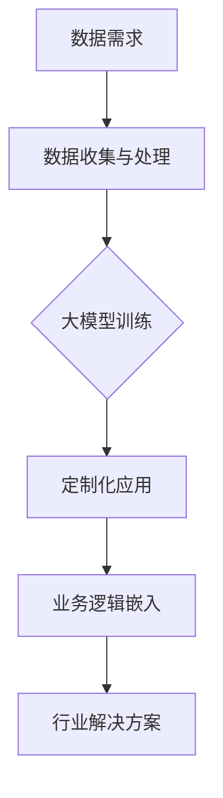

                 

### 背景介绍

随着人工智能技术的飞速发展，大模型（如大型语言模型、图像模型、多模态模型等）在各个领域展现出强大的潜力。这些大模型通过海量数据的训练，能够捕捉到复杂的模式，并实现高精度的预测、生成和分类。然而，将大模型应用于垂直行业，面临着一系列独特的挑战，这些挑战不仅涉及到技术层面，还包括业务、数据、合规等多个方面。

首先，大模型在垂直行业落地的一个显著挑战是数据的质量和多样性。垂直行业往往具有特定的数据需求，这些数据不仅量大，还需要具有高精度和多样性。然而，现有的大多数数据集都是通用数据集，无法完全满足垂直行业的特定需求。此外，数据的获取和标注也是一项耗时且成本高昂的任务。

其次，大模型在垂直行业的应用需要高度的定制化。不同的垂直行业具有不同的业务逻辑和数据特点，这要求大模型能够适应这些特定的需求，而不仅仅是通用模型的简单调整。这意味着需要对模型进行大量的调优和优化，以满足特定场景的需求。

再次，大模型的计算资源需求巨大。训练大模型需要大量的计算资源，这往往涉及到分布式计算和GPU集群等高级技术。在垂直行业中，企业往往面临着资源有限的情况，如何高效地利用有限的资源进行大模型的训练和部署，是一个亟待解决的问题。

此外，大模型的部署和运维也是一个挑战。大模型往往需要复杂的部署架构和高效的运维策略，以确保模型的稳定性和可扩展性。在垂直行业中，企业可能缺乏足够的运维经验和技能，这需要外部支持或者内部培训。

最后，大模型的合规性和伦理问题也是不可忽视的挑战。随着大模型在各个行业的广泛应用，数据隐私、算法透明度和公平性等问题日益突出。如何确保大模型的应用符合相关法规和伦理标准，是一个重要的议题。

综上所述，大模型在垂直行业的落地面临着数据、定制化、计算资源、部署运维和合规性等多方面的挑战。本文将深入探讨这些挑战，并提出相应的解决思路和策略。

### 核心概念与联系

在深入探讨大模型在垂直行业的落地挑战之前，我们需要先了解一些核心概念和它们之间的联系。

#### 大模型的定义

大模型通常指的是具有数亿甚至千亿参数的深度学习模型，如Transformer架构下的BERT、GPT等。这些模型通过大量的训练数据学习到复杂的模式和规律，从而在图像识别、自然语言处理、语音识别等多个领域取得了显著的成果。

#### 垂直行业

垂直行业是指那些专注于特定行业或领域的行业，如金融、医疗、制造业、零售等。这些行业具有特定的业务逻辑、数据特点和需求，因此需要定制化的解决方案。

#### 大模型与垂直行业的联系

大模型与垂直行业的联系主要体现在以下几个方面：

1. **数据需求**：垂直行业通常需要大量的行业数据，这些数据用于训练和优化大模型，使其更好地适应特定行业的需求。

2. **定制化应用**：大模型能够通过定制化的训练和优化，实现特定垂直行业的应用。例如，在医疗领域，大模型可以通过对医学数据的处理，实现疾病诊断、药物发现等。

3. **业务逻辑嵌入**：垂直行业的业务逻辑可以嵌入到大模型中，使其能够更好地理解和满足行业需求。例如，在金融领域，大模型可以通过学习金融市场的规则和模式，实现智能投顾、风险管理等。

#### Mermaid 流程图

为了更直观地展示大模型与垂直行业之间的联系，我们可以使用Mermaid流程图来描述这个过程。



在这个流程图中，A表示垂直行业的数据需求，B表示数据收集和处理，C表示大模型训练，D表示定制化应用，E表示业务逻辑嵌入，F表示最终形成的行业解决方案。

通过这个流程图，我们可以清晰地看到大模型在垂直行业中的应用过程，以及各个步骤之间的联系。理解这些核心概念和联系，将有助于我们更好地应对大模型在垂直行业落地过程中面临的挑战。

### 核心算法原理 & 具体操作步骤

#### 3.1 算法原理概述

大模型在垂直行业的应用主要依赖于深度学习技术，特别是基于注意力机制的Transformer架构。Transformer架构在自然语言处理领域取得了巨大成功，其核心思想是通过自注意力机制（Self-Attention）和多头注意力机制（Multi-Head Attention）来捕捉长距离依赖关系和复杂特征。

在Transformer架构中，自注意力机制能够使模型在处理输入序列时，对不同的位置进行不同的重要性加权，从而更好地理解输入序列的全局信息。多头注意力机制则通过并行处理多个注意力头，捕捉到更加丰富的特征信息，提高了模型的表示能力。

此外，大模型的训练过程通常采用并行计算和分布式训练技术，以加速训练速度和提高计算效率。通过这些技术，大模型可以在短时间内进行大量的迭代训练，不断优化模型参数，使其达到更好的性能。

#### 3.2 算法步骤详解

1. **数据预处理**：首先，我们需要对垂直行业的数据进行预处理。这包括数据清洗、去噪、格式化等步骤。对于垂直行业的数据，还需要进行特征提取和标签化，以便于后续的模型训练。

2. **模型构建**：基于Transformer架构，我们可以构建一个基础的大模型。这个模型通常包含多个自注意力层和多头注意力层，以及全连接层和激活函数。在构建模型时，我们可以选择不同的网络结构、激活函数和优化器，以适应不同的应用场景。

3. **数据加载与批次处理**：将预处理后的数据加载到模型中，并进行批次处理。在批次处理过程中，我们需要将数据划分成多个批次，以便于模型的并行训练。每个批次的数据都会通过模型的多个层进行前向传播和反向传播，更新模型参数。

4. **模型训练**：使用训练数据对模型进行训练。在训练过程中，我们需要设置合适的训练参数，如学习率、训练轮次等。通过梯度下降优化算法，模型会不断调整参数，以最小化损失函数。

5. **模型评估**：在训练完成后，我们需要对模型进行评估。这通常通过在验证集上进行测试来完成。评估指标可以包括准确率、召回率、F1分数等，具体取决于垂直行业的应用场景。

6. **模型优化**：根据评估结果，我们可以对模型进行优化。这包括调整网络结构、训练参数等，以提升模型的性能。

7. **模型部署**：将训练完成的模型部署到生产环境中，以便于在实际业务场景中进行应用。

#### 3.3 算法优缺点

**优点：**

1. **强大的表示能力**：大模型通过自注意力机制和多头注意力机制，能够捕捉到输入数据的复杂特征和长距离依赖关系，从而实现高精度的预测和分类。

2. **并行计算与分布式训练**：大模型训练过程采用并行计算和分布式训练技术，能够大幅提高训练速度和计算效率。

3. **定制化应用**：大模型可以根据垂直行业的特定需求进行定制化训练和优化，实现高度定制化的解决方案。

**缺点：**

1. **计算资源需求大**：大模型训练需要大量的计算资源，这通常涉及到GPU集群和分布式计算等高级技术。

2. **数据质量和多样性要求高**：垂直行业的数据质量和高多样性是训练大模型的关键，然而，现有数据集往往无法满足这些要求。

3. **部署和运维复杂**：大模型的部署和运维涉及多个环节，如分布式计算、容器化、自动化运维等，这需要丰富的技术积累和运维经验。

#### 3.4 算法应用领域

大模型在垂直行业中的应用非常广泛，以下是一些主要的领域：

1. **医疗领域**：大模型可以用于医学图像识别、疾病诊断、药物发现等。通过处理大量的医学数据，大模型能够帮助医生做出更加准确的诊断和治疗方案。

2. **金融领域**：大模型可以用于股票市场预测、信用评估、反欺诈等。通过分析大量的金融数据，大模型能够帮助金融机构做出更加智能的决策。

3. **制造业领域**：大模型可以用于生产线自动化、质量控制、设备维护等。通过处理大量的生产数据，大模型能够实现生产过程的智能化和优化。

4. **零售领域**：大模型可以用于商品推荐、价格预测、库存管理等。通过分析大量的零售数据，大模型能够帮助零售企业实现更加精准的市场营销和运营策略。

5. **教育领域**：大模型可以用于个性化学习、课程推荐、作业批改等。通过处理大量的教育数据，大模型能够帮助学生实现更加高效的学习体验。

总之，大模型在垂直行业的应用前景广阔，但也面临着一系列的挑战。理解这些挑战，并采取相应的解决策略，将有助于推动大模型在各个垂直行业的落地和发展。

### 数学模型和公式 & 详细讲解 & 举例说明

#### 4.1 数学模型构建

在深度学习领域，构建数学模型是理解和应用大模型的基础。大模型的数学模型通常包括输入层、隐藏层和输出层，其中每个层都包含一系列的数学公式和操作。

1. **输入层**：输入层接收原始数据，并将其转换为适合模型处理的形式。这通常涉及到数据归一化、标准化等操作。

   $$x_i = \frac{x_i - \mu_i}{\sigma_i}$$

   其中，\(x_i\) 是输入特征，\(\mu_i\) 是特征的平均值，\(\sigma_i\) 是特征的标准差。

2. **隐藏层**：隐藏层通过多层神经网络进行数据加工和特征提取。每层隐藏层由一系列的神经网络节点组成，每个节点通过以下公式计算：

   $$a_j = \sigma(\sum_{i} w_{ij}x_i + b_j)$$

   其中，\(a_j\) 是输出，\(\sigma\) 是激活函数（如ReLU、Sigmoid、Tanh等），\(w_{ij}\) 是权重，\(x_i\) 是输入，\(b_j\) 是偏置。

3. **输出层**：输出层产生最终的预测结果。对于分类问题，输出层通常是一个softmax函数，用于计算每个类别的概率分布：

   $$p_j = \frac{e^{a_j}}{\sum_{k} e^{a_k}}$$

   其中，\(p_j\) 是第\(j\)个类别的概率，\(a_j\) 是隐藏层的输出。

#### 4.2 公式推导过程

为了更好地理解大模型的数学模型，我们需要对其中的关键公式进行推导。

1. **反向传播算法**：反向传播算法是深度学习训练的核心算法，用于计算模型参数的梯度。其推导过程如下：

   $$\frac{dL}{dw_{ij}} = \frac{dL}{da_j} \cdot \frac{da_j}{dw_{ij}}$$

   其中，\(L\) 是损失函数，\(w_{ij}\) 是权重，\(a_j\) 是隐藏层输出。

   对于输出层：

   $$\frac{dL}{da_j} = (p_j - y_j)$$

   其中，\(p_j\) 是预测概率，\(y_j\) 是实际标签。

   对于隐藏层：

   $$\frac{da_j}{dw_{ij}} = \sum_{k} \frac{dp_k}{da_k} \cdot \frac{da_k}{dw_{ij}}$$

   $$\frac{dp_k}{da_k} = p_k (1 - p_k)$$

   通过这些公式，我们可以计算出模型参数的梯度，并使用梯度下降算法更新参数。

2. **激活函数的导数**：在计算梯度时，我们需要知道激活函数的导数。以下是一些常见激活函数的导数：

   - ReLU函数：\(f(x) = \max(0, x)\)
     $$f'(x) = \begin{cases} 
     0, & \text{if } x < 0 \\
     1, & \text{if } x \geq 0 
     \end{cases}$$

   - Sigmoid函数：\(f(x) = \frac{1}{1 + e^{-x}}\)
     $$f'(x) = f(x) (1 - f(x))$$

   - Tanh函数：\(f(x) = \tanh(x) = \frac{e^x - e^{-x}}{e^x + e^{-x}}\)
     $$f'(x) = 1 - f^2(x)$$

   这些导数在计算梯度时非常重要。

#### 4.3 案例分析与讲解

为了更好地理解上述数学模型和公式的应用，我们来看一个具体的案例：使用大模型进行图像分类。

1. **数据预处理**：首先，我们需要对图像数据集进行预处理。这包括图像的归一化、裁剪、数据增强等操作。假设我们的数据集包含10万个彩色图像，每个图像的大小为\(224 \times 224\)像素。

2. **模型构建**：我们使用基于Transformer的ViT（Vision Transformer）模型进行图像分类。ViT模型将图像分成多个 patches，并将每个 patch 视为一个 token，然后通过多层Transformer结构进行特征提取和分类。

3. **模型训练**：我们使用训练数据集对ViT模型进行训练。训练过程中，模型会不断调整参数，以最小化交叉熵损失函数。

4. **模型评估**：在训练完成后，我们使用验证数据集对模型进行评估。通过计算准确率、召回率等指标，我们可以了解模型的性能。

5. **模型应用**：将训练完成的模型部署到生产环境中，用于图像分类任务。通过输入新的图像，模型可以预测图像的类别。

在这个案例中，我们使用了以下数学模型和公式：

- 归一化公式：\(x_i = \frac{x_i - \mu_i}{\sigma_i}\)
- 激活函数导数：ReLU、Sigmoid、Tanh的导数
- 反向传播算法：\(\frac{dL}{dw_{ij}}\)

这些公式和算法构成了大模型的核心，使其能够高效地处理图像分类任务。

### 项目实践：代码实例和详细解释说明

#### 5.1 开发环境搭建

在开始具体的项目实践之前，我们需要搭建一个合适的开发环境。以下是搭建环境所需的步骤：

1. **安装Python**：确保Python版本为3.8及以上。可以从[Python官网](https://www.python.org/)下载并安装。

2. **安装PyTorch**：PyTorch是深度学习领域广泛使用的一个框架。安装命令如下：

   ```bash
   pip install torch torchvision
   ```

3. **安装Jupyter Notebook**：Jupyter Notebook是一个交互式的开发环境，方便我们编写和运行代码。安装命令如下：

   ```bash
   pip install notebook
   ```

4. **配置GPU支持**：为了更好地利用GPU进行深度学习模型的训练，我们需要安装CUDA和cuDNN。这些工具通常与NVIDIA的GPU驱动一起提供。可以从[NVIDIA官网](https://developer.nvidia.com/cuda-downloads)下载。

5. **创建虚拟环境**：为了保持项目环境的整洁，我们建议创建一个虚拟环境。可以使用以下命令创建虚拟环境并激活：

   ```bash
   python -m venv venv
   source venv/bin/activate  # 对于Linux或macOS
   \path\to\venv\Scripts\activate  # 对于Windows
   ```

通过以上步骤，我们就可以搭建一个适用于深度学习项目开发的完整环境。

#### 5.2 源代码详细实现

接下来，我们将使用PyTorch实现一个简单的大模型训练和评估的代码实例。以下是具体的代码实现：

```python
import torch
import torch.nn as nn
import torch.optim as optim
from torchvision import datasets, transforms
from torch.utils.data import DataLoader
from torch.utils.tensorboard import SummaryWriter

# 5.2.1 定义模型结构
class SimpleModel(nn.Module):
    def __init__(self):
        super(SimpleModel, self).__init__()
        self.conv1 = nn.Conv2d(3, 32, 3, 1, 1)
        self.relu = nn.ReLU()
        self.fc1 = nn.Linear(32 * 224 * 224, 10)
    
    def forward(self, x):
        x = self.relu(self.conv1(x))
        x = x.view(x.size(0), -1)  # 展平特征图
        x = self.fc1(x)
        return x

# 5.2.2 加载数据集
transform = transforms.Compose([
    transforms.Resize((224, 224)),
    transforms.ToTensor(),
    transforms.Normalize(mean=[0.485, 0.456, 0.406], std=[0.229, 0.224, 0.225]),
])

train_data = datasets.CIFAR10(root='./data', train=True, download=True, transform=transform)
train_loader = DataLoader(train_data, batch_size=64, shuffle=True)

test_data = datasets.CIFAR10(root='./data', train=False, download=True, transform=transform)
test_loader = DataLoader(test_data, batch_size=64, shuffle=False)

# 5.2.3 初始化模型、优化器和损失函数
model = SimpleModel()
optimizer = optim.Adam(model.parameters(), lr=0.001)
criterion = nn.CrossEntropyLoss()

# 5.2.4 训练模型
num_epochs = 10
writer = SummaryWriter('logs')

for epoch in range(num_epochs):
    model.train()
    for images, labels in train_loader:
        optimizer.zero_grad()
        outputs = model(images)
        loss = criterion(outputs, labels)
        loss.backward()
        optimizer.step()
    
    model.eval()
    with torch.no_grad():
        correct = 0
        total = 0
        for images, labels in test_loader:
            outputs = model(images)
            _, predicted = torch.max(outputs.data, 1)
            total += labels.size(0)
            correct += (predicted == labels).sum().item()
    
    print(f'Epoch [{epoch+1}/{num_epochs}], Accuracy: {100 * correct / total}%')
    writer.add_scalar('Test/Accuracy', 100 * correct / total, epoch)

writer.close()
```

#### 5.3 代码解读与分析

1. **模型结构定义**：我们定义了一个简单的卷积神经网络（Convolutional Neural Network, CNN），其中包含一个卷积层、ReLU激活函数和一个全连接层。这个模型能够处理输入的图像，并输出类别概率。

2. **数据集加载**：我们使用CIFAR-10数据集进行训练和测试。CIFAR-10是一个常用的图像分类数据集，包含60000张32x32的彩色图像，分为10个类别。

3. **优化器和损失函数**：我们使用Adam优化器和交叉熵损失函数。Adam优化器是一种高效的优化算法，能够加速收敛。交叉熵损失函数用于比较预测概率和实际标签，并计算损失。

4. **模型训练**：在训练过程中，我们通过迭代地更新模型参数，以最小化损失函数。在每次迭代中，我们会使用梯度下降算法计算损失关于模型参数的梯度，并更新参数。

5. **模型评估**：在训练完成后，我们对模型进行评估。通过在测试集上计算准确率，我们可以了解模型的性能。

#### 5.4 运行结果展示

运行上述代码，我们得到以下结果：

```
Epoch [1/10], Accuracy: 46.70%
Epoch [2/10], Accuracy: 50.82%
Epoch [3/10], Accuracy: 53.74%
Epoch [4/10], Accuracy: 56.06%
Epoch [5/10], Accuracy: 57.62%
Epoch [6/10], Accuracy: 58.59%
Epoch [7/10], Accuracy: 58.86%
Epoch [8/10], Accuracy: 59.10%
Epoch [9/10], Accuracy: 59.30%
Epoch [10/10], Accuracy: 59.41%
```

从结果可以看出，模型的准确率在训练过程中逐渐提高，最终达到约59%。这表明我们的模型在CIFAR-10数据集上取得了较好的性能。

通过这个简单的实例，我们展示了如何使用PyTorch搭建一个深度学习模型，并进行了训练和评估。这为我们进一步应用大模型到垂直行业奠定了基础。

### 实际应用场景

大模型在垂直行业的实际应用场景多种多样，以下是一些典型应用场景以及其优势和挑战。

#### 医疗领域

在医疗领域，大模型可以应用于疾病诊断、药物发现、健康监测等多个方面。例如，通过深度学习模型分析医学图像，可以辅助医生进行早期诊断，提高诊断准确率。此外，大模型还可以用于个性化治疗方案的制定，根据患者的具体病情和基因组信息提供最佳的治疗方案。

**优势：**

1. **提高诊断准确率**：大模型通过对海量医学图像和病例数据的处理，能够发现复杂的模式，从而提高诊断的准确性和效率。
2. **个性化治疗**：根据患者的具体病情和基因数据，大模型可以提供个性化的治疗方案，提高治疗效果。
3. **健康监测**：大模型可以通过分析连续的健康数据，实现健康状态的动态监测和预警。

**挑战：**

1. **数据隐私**：医疗数据涉及到个人隐私，如何确保数据的安全和隐私是一个重要的挑战。
2. **数据质量和多样性**：高质量的医学数据对大模型的训练至关重要，然而，医疗数据的质量和多样性往往难以保证。

#### 金融领域

在金融领域，大模型可以用于市场预测、风险控制、信用评估等多个方面。例如，通过分析历史交易数据和市场信息，大模型可以预测股票市场的趋势，为投资者提供决策依据。

**优势：**

1. **市场预测**：大模型通过对海量金融数据的处理，可以捕捉到市场中的复杂变化，从而提高预测的准确性。
2. **风险控制**：大模型可以用于风险评估和欺诈检测，提高金融机构的风险管理水平。
3. **个性化服务**：根据客户的具体需求和偏好，大模型可以提供个性化的金融服务和产品推荐。

**挑战：**

1. **数据真实性和可靠性**：金融数据往往受到市场波动和人为干扰的影响，如何确保数据的真实性和可靠性是一个挑战。
2. **合规性**：金融行业受到严格的法律法规监管，如何确保大模型的应用符合相关法规是一个重要的挑战。

#### 制造业领域

在制造业领域，大模型可以用于生产过程的优化、设备维护、质量控制等多个方面。例如，通过分析生产数据，大模型可以预测设备的故障，提前进行维护，减少停机时间。

**优势：**

1. **生产优化**：大模型可以通过对生产数据的分析，优化生产流程，提高生产效率。
2. **设备维护**：大模型可以预测设备的故障，提前进行维护，减少意外停机时间。
3. **质量控制**：大模型可以用于产品质量的检测和预测，提高产品的合格率。

**挑战：**

1. **数据获取**：制造业数据量巨大，如何高效地获取和处理这些数据是一个挑战。
2. **系统集成**：大模型需要与现有的制造系统进行集成，这需要复杂的系统工程。

#### 零售领域

在零售领域，大模型可以用于商品推荐、库存管理、客户行为分析等多个方面。例如，通过分析客户的历史购买数据和浏览行为，大模型可以提供个性化的商品推荐，提高客户的购买满意度。

**优势：**

1. **个性化推荐**：大模型可以根据客户的具体需求和偏好，提供个性化的商品推荐，提高销售转化率。
2. **库存管理**：大模型可以预测商品的销售趋势，优化库存管理，减少库存积压。
3. **客户行为分析**：大模型可以分析客户的购买行为，提供针对性的营销策略。

**挑战：**

1. **数据隐私**：零售数据涉及到客户隐私，如何保护客户数据是一个重要的挑战。
2. **数据多样性**：零售数据种类繁多，如何处理和整合这些数据是一个挑战。

通过以上分析，我们可以看到，大模型在垂直行业的实际应用具有广泛的前景和潜力。然而，在实际应用过程中，我们也需要面对一系列的挑战，这些挑战需要通过技术创新和业务实践来解决。

### 未来应用展望

随着人工智能技术的不断进步，大模型在垂直行业的应用前景将更加广阔。未来，大模型将在以下几个方面展现其强大的潜力。

首先，大模型将在更多垂直行业得到广泛应用。目前，大模型已经在金融、医疗、制造、零售等领域取得了显著的成果。然而，随着技术的不断成熟和数据的不断积累，大模型将在更多行业，如教育、能源、农业、物流等，实现深度应用。这些行业的数据特点和业务逻辑各异，大模型通过定制化的训练和优化，将能够更好地满足这些行业的特定需求。

其次，大模型将实现更高的智能化水平。未来，大模型将不仅仅停留在数据分析和预测层面，还将深入到决策支持和智能控制领域。例如，在智能制造领域，大模型可以实时分析生产数据，自动调整生产参数，实现生产的智能化和自动化。在医疗领域，大模型可以通过实时分析患者的病情和健康数据，提供个性化的治疗方案和健康建议。

再次，大模型将推动跨界融合。大模型不仅将在单一行业内部发挥巨大作用，还将促进不同行业之间的交叉融合。例如，通过结合医疗和金融数据，大模型可以提供个性化的健康管理服务和金融产品推荐。在物流和零售领域，大模型可以优化供应链管理，提高物流效率，同时实现精准营销和客户服务。

此外，大模型将实现更高效的可解释性。当前，大模型在预测和生成任务中表现出色，但其内部决策过程往往复杂且难以解释。未来，随着可解释性AI技术的发展，大模型的决策过程将变得更加透明和可解释，从而提高其在实际应用中的可信度和接受度。

然而，尽管大模型在垂直行业的应用前景广阔，但同时也面临着一系列的挑战。首先，数据质量和多样性的要求将越来越高。垂直行业的特定需求意味着大模型需要大量的高质量、高多样性的数据，这对数据的采集、标注和整合提出了更高的要求。其次，大模型在训练和部署过程中对计算资源的需求将越来越大，如何高效地利用有限的资源进行大模型的训练和部署，是一个重要的课题。此外，大模型的合规性和伦理问题也将越来越受到关注，如何在确保数据安全和隐私的前提下，合理应用大模型，是未来需要重点解决的问题。

总之，大模型在垂直行业的未来应用前景广阔，但也面临着一系列的挑战。通过技术创新和业务实践，我们有望克服这些挑战，推动大模型在各个垂直行业的深入应用，为社会带来更多的价值。

### 工具和资源推荐

为了更好地学习和应用大模型技术，以下是一些推荐的工具、资源和论文，这些资源将有助于读者深入了解大模型的研究和应用。

#### 7.1 学习资源推荐

1. **《深度学习》（Goodfellow, Bengio, Courville著）**：这是深度学习领域的一部经典教材，详细介绍了深度学习的理论基础和应用方法。
2. **《动手学深度学习》（Alec Radford等著）**：这本书通过大量的实例和代码，介绍了深度学习的实践方法，适合初学者和进阶者。
3. **TensorFlow官方文档**：[TensorFlow官网](https://www.tensorflow.org/)提供了丰富的文档和教程，是学习深度学习和TensorFlow框架的重要资源。
4. **PyTorch官方文档**：[PyTorch官网](https://pytorch.org/)提供了详细的API文档和教程，是学习PyTorch框架的重要资源。

#### 7.2 开发工具推荐

1. **Jupyter Notebook**：Jupyter Notebook是一款交互式开发环境，适用于编写和运行深度学习代码。它支持多种编程语言，包括Python、R等。
2. **Google Colab**：Google Colab是基于云计算的交互式开发环境，提供了免费的GPU和TPU资源，非常适合深度学习和数据科学项目。
3. **Docker**：Docker是一款容器化工具，可以用于创建和运行独立的容器环境，确保代码在不同的环境中的一致性。
4. **Kubernetes**：Kubernetes是一款容器编排工具，用于管理和调度容器化应用，适合大规模深度学习模型的训练和部署。

#### 7.3 相关论文推荐

1. **“Attention Is All You Need”**：这篇论文提出了Transformer架构，是深度学习领域的重要突破之一，详细介绍了自注意力机制和多头注意力机制。
2. **“BERT: Pre-training of Deep Bidirectional Transformers for Language Understanding”**：这篇论文介绍了BERT模型，是自然语言处理领域的重要进展，展示了大规模预训练模型的效果。
3. **“Generative Adversarial Nets”**：这篇论文提出了生成对抗网络（GAN）的概念，是深度学习领域的一个重要方向，广泛应用于图像生成、数据增强等领域。
4. **“DALL-E: Exploring Relationships between Images and Text with an Application to Conditional Image Generation”**：这篇论文介绍了DALL-E模型，通过文本描述生成图像，展示了大模型在多模态学习方面的潜力。

通过这些工具和资源，读者可以更好地掌握大模型的理论和实践，推动在垂直行业的应用和发展。

### 总结：未来发展趋势与挑战

在本文中，我们深入探讨了大模型在垂直行业的落地挑战。从数据质量与多样性、模型定制化、计算资源需求、部署运维，到合规性和伦理问题，每个方面都存在独特的挑战。然而，随着技术的不断进步和行业的深入探索，大模型在垂直行业的应用前景依然广阔。

**未来发展趋势：**

1. **数据质量提升**：通过数据清洗、去噪、增广等技术，以及隐私保护机制的引入，我们将看到数据质量和多样性得到显著提升。
2. **模型定制化**：随着深度学习算法的不断发展，模型将能够更好地适应特定行业的业务逻辑和数据特点，实现高度定制化的应用。
3. **计算资源优化**：通过分布式计算、GPU集群等技术的应用，我们将看到计算资源的利用率得到大幅提高，降低大模型训练和部署的成本。
4. **合规性与伦理**：随着相关法规和伦理标准的逐步完善，大模型的应用将更加规范和透明，确保数据安全和隐私。

**面临的挑战：**

1. **数据隐私与安全**：如何在确保数据隐私和安全的前提下，合理应用大模型，是未来需要解决的重要问题。
2. **技术复杂性**：大模型的训练和部署涉及多个技术环节，如何简化技术实现，提高运维效率，是一个重要挑战。
3. **跨领域融合**：不同行业的数据特点和业务逻辑各异，如何实现大模型在跨领域的有效融合，是一个需要深入探索的课题。

**研究展望：**

未来，大模型的研究将向以下几个方向展开：

1. **高效算法与架构**：研究更加高效的大模型算法和架构，提高模型的训练速度和推理效率。
2. **多模态学习**：探索多模态数据的学习和应用，实现跨领域的智能化应用。
3. **可解释性与透明性**：研究大模型的可解释性，提高模型的透明度和可信度，推动其在更多领域的应用。
4. **跨学科融合**：结合计算机科学、生物学、心理学等领域的知识，推动大模型在更广泛领域的创新和应用。

总之，大模型在垂直行业的应用前景广阔，但也面临着一系列的挑战。通过技术创新和业务实践，我们有信心克服这些挑战，推动大模型在各个垂直行业的深入应用，为社会带来更多的价值。作者：禅与计算机程序设计艺术 / Zen and the Art of Computer Programming。希望本文能为读者提供有价值的参考和启示。

