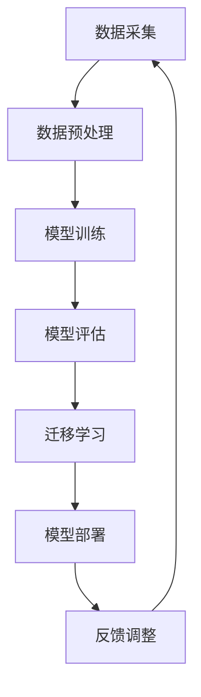

                 

关键词：大模型，推荐系统，元学习，迁移学习，算法应用，代码实例，数学模型

> 摘要：本文探讨了在大模型背景下，如何利用元学习和迁移学习技术提升推荐系统的效果。通过详细介绍核心算法原理、数学模型、具体实现以及实际应用场景，本文旨在为读者提供一份数字时代的推荐系统设计指南。

## 1. 背景介绍

### 1.1 推荐系统的发展历程

推荐系统作为信息过滤与信息检索的重要工具，其发展历程大致可以分为三个阶段：基于内容的推荐、协同过滤推荐和基于模型的推荐。

- **基于内容的推荐**：通过分析用户兴趣和物品内容特征实现推荐，但存在用户兴趣难以准确捕捉和推荐结果单一等问题。

- **协同过滤推荐**：利用用户行为数据，如购买记录、浏览历史等，通过计算用户和物品之间的相似度进行推荐。协同过滤方法主要包括用户基于的协同过滤和物品基于的协同过滤。

- **基于模型的推荐**：引入机器学习模型，如逻辑回归、矩阵分解、深度学习等，对用户和物品进行建模，从而进行个性化推荐。

随着互联网的快速发展，推荐系统的规模和复杂度不断增加，传统的单一方法已经难以满足用户的需求。为了应对这一挑战，大模型和深度学习技术的引入为推荐系统的发展提供了新的契机。

### 1.2 大模型的概念与优势

大模型是指具有大规模参数和计算能力的神经网络模型，如 Transformer、BERT 等。大模型在处理大规模数据集和复杂任务时展现出强大的性能，其优势主要包括：

- **更强的泛化能力**：通过学习大规模数据，大模型能够更好地泛化到未见过的数据上。

- **更好的表示学习能力**：大模型能够捕捉数据中的复杂模式，从而提高推荐系统的效果。

- **更高的计算效率**：随着硬件技术的发展，大模型的训练和推理速度不断提高。

### 1.3 元学习和迁移学习的基本概念

元学习是一种利用算法来学习算法的方法，其目标是通过学习如何学习，提高机器学习模型在不同任务上的表现。元学习可以分为两个方向：模型元学习和样本元学习。

- **模型元学习**：通过训练一个模型来预测其他模型的性能，从而在新的任务上快速适应。

- **样本元学习**：通过在多个任务上共享样本表示来提高模型的泛化能力。

迁移学习是指将已在一个任务上训练好的模型或知识迁移到另一个相关但不同的任务上。迁移学习的主要目的是利用已有知识提高新任务的性能，避免从头训练模型所带来的计算和时间成本。

## 2. 核心概念与联系

### 2.1 元学习迁移应用框架

以下是一个描述大模型在推荐系统中应用元学习迁移的Mermaid流程图：



- **数据采集**：从各种渠道获取用户行为数据、物品信息等。

- **数据预处理**：对数据进行清洗、去噪、特征提取等操作，为模型训练做好准备。

- **模型训练**：利用大模型进行模型训练，如 Transformer、BERT 等。

- **模型评估**：对训练好的模型进行评估，以验证其性能。

- **迁移学习**：将训练好的模型迁移到推荐系统任务上，利用元学习技术提高模型的泛化能力。

- **模型部署**：将迁移后的模型部署到生产环境中，进行实时推荐。

- **反馈调整**：根据用户反馈对模型进行迭代调整，以提高推荐效果。

### 2.2 元学习迁移应用的优势

- **快速适应新任务**：通过元学习，模型能够快速适应新任务，降低模型训练成本。

- **提高推荐效果**：利用迁移学习，模型能够利用已有知识提高新任务的性能，从而提高推荐效果。

- **减少数据需求**：通过迁移学习，模型能够利用少量数据进行训练，降低数据需求。

## 3. 核心算法原理 & 具体操作步骤

### 3.1 算法原理概述

元学习迁移应用的核心算法包括模型元学习和样本元学习。模型元学习通过训练一个模型来预测其他模型的性能，从而在新任务上快速适应。样本元学习通过在多个任务上共享样本表示来提高模型的泛化能力。

### 3.2 算法步骤详解

1. **数据采集**：从各种渠道获取用户行为数据、物品信息等。

2. **数据预处理**：对数据进行清洗、去噪、特征提取等操作，为模型训练做好准备。

3. **模型训练**：利用大模型（如 Transformer、BERT 等）进行模型训练。训练过程中，采用元学习技术，通过多个任务的交叉训练提高模型的泛化能力。

4. **模型评估**：对训练好的模型进行评估，以验证其性能。评估指标包括准确率、召回率、F1 值等。

5. **迁移学习**：将训练好的模型迁移到推荐系统任务上。具体步骤如下：

   - **样本迁移**：将原始任务上的样本迁移到推荐系统任务上，进行模型训练。

   - **模型迁移**：将原始任务上的模型迁移到推荐系统任务上，进行模型推理。

6. **模型部署**：将迁移后的模型部署到生产环境中，进行实时推荐。

7. **反馈调整**：根据用户反馈对模型进行迭代调整，以提高推荐效果。

### 3.3 算法优缺点

#### 优点：

- **快速适应新任务**：通过元学习，模型能够快速适应新任务，降低模型训练成本。

- **提高推荐效果**：利用迁移学习，模型能够利用已有知识提高新任务的性能，从而提高推荐效果。

- **减少数据需求**：通过迁移学习，模型能够利用少量数据进行训练，降低数据需求。

#### 缺点：

- **计算资源消耗大**：大模型训练和迁移过程需要大量计算资源。

- **模型泛化能力有限**：元学习和迁移学习并不能保证模型在所有任务上都能取得良好效果。

## 4. 数学模型和公式 & 详细讲解 & 举例说明

### 4.1 数学模型构建

元学习迁移应用的核心在于如何构建一个有效的数学模型。以下是一个简化的数学模型构建过程：

#### 4.1.1 模型表示

假设有一个任务集合 $T=\{T_1, T_2, \ldots, T_n\}$，每个任务 $T_i$ 对应一个数据集 $D_i=\{(x_{i,1}, y_{i,1}), (x_{i,2}, y_{i,2}), \ldots\}$，其中 $x_{i,j}$ 表示样本特征，$y_{i,j}$ 表示样本标签。

定义一个基础模型 $f(x; \theta)$，其中 $\theta$ 表示模型参数。基础模型的目的是在单个任务 $T_i$ 上学习样本的表示。

#### 4.1.2 样本迁移

为了实现样本迁移，我们定义一个迁移模型 $g(x; \phi)$，其中 $\phi$ 表示迁移模型参数。迁移模型的目标是学习如何将任务 $T_i$ 上的样本表示迁移到任务 $T_j$。

#### 4.1.3 模型融合

通过迁移模型，我们可以将多个任务的样本表示进行融合。定义一个融合模型 $h(x; \theta, \phi)$，其中 $\theta$ 和 $\phi$ 分别表示基础模型和迁移模型参数。融合模型的目标是在多个任务上同时学习样本的表示。

### 4.2 公式推导过程

为了推导融合模型的损失函数，我们需要定义一个任务损失函数 $L(T_i, f(x_i; \theta))$，其中 $L$ 表示损失函数，$T_i$ 表示任务 $i$，$f(x_i; \theta)$ 表示基础模型在任务 $i$ 上的输出。

#### 4.2.1 基础模型损失

对于每个任务 $T_i$，基础模型的损失函数可以表示为：

$$L_i(f(x_i; \theta)) = \sum_{j=1}^{N_i} L(y_{i,j}, f(x_{i,j}; \theta))$$

其中 $N_i$ 表示任务 $i$ 上的样本数量，$y_{i,j}$ 表示样本标签，$f(x_{i,j}; \theta)$ 表示基础模型在任务 $i$ 上的输出。

#### 4.2.2 迁移模型损失

对于每个任务 $T_i$，迁移模型的损失函数可以表示为：

$$M_i(g(x_i; \phi)) = \sum_{j=1}^{N_i} L(y_{i,j}, g(x_{i,j}; \phi))$$

其中 $L$ 表示损失函数，$g(x_i; \phi)$ 表示迁移模型在任务 $i$ 上的输出。

#### 4.2.3 融合模型损失

融合模型的损失函数可以表示为：

$$L_h(h(x; \theta, \phi)) = \sum_{i=1}^{n} \lambda_i L_i(f(x_i; \theta)) + \sum_{i=1}^{n} \mu_i M_i(g(x_i; \phi))$$

其中 $L_i$ 和 $M_i$ 分别表示基础模型和迁移模型在任务 $i$ 上的损失函数，$\lambda_i$ 和 $\mu_i$ 分别表示权重。

### 4.3 案例分析与讲解

以下是一个简化的案例，假设有两个任务 $T_1$ 和 $T_2$，每个任务包含一个数据集 $D_1$ 和 $D_2$。

#### 4.3.1 数据集

任务 $T_1$：

$$D_1 = \{(x_{1,1}, y_{1,1}), (x_{1,2}, y_{1,2}), \ldots\}$$

任务 $T_2$：

$$D_2 = \{(x_{2,1}, y_{2,1}), (x_{2,2}, y_{2,2}), \ldots\}$$

#### 4.3.2 模型

基础模型：

$$f(x; \theta) = \text{sigmoid}(\theta^T x)$$

迁移模型：

$$g(x; \phi) = \text{ReLU}(\phi^T x)$$

融合模型：

$$h(x; \theta, \phi) = \text{ReLU}(\theta^T x + \phi^T x)$$

#### 4.3.3 损失函数

基础模型损失：

$$L_1(f(x_1; \theta)) = \sum_{j=1}^{N_1} \text{sigmoid}(\theta^T x_{1,j}) - y_{1,j}$$

迁移模型损失：

$$M_1(g(x_1; \phi)) = \sum_{j=1}^{N_1} \text{ReLU}(\phi^T x_{1,j}) - y_{1,j}$$

融合模型损失：

$$L_h(h(x; \theta, \phi)) = \sum_{j=1}^{N_1} \text{ReLU}(\theta^T x_{1,j} + \phi^T x_{1,j}) - y_{1,j}$$

### 5. 项目实践：代码实例和详细解释说明

#### 5.1 开发环境搭建

为了演示元学习迁移应用在大模型推荐系统中的实践，我们选择 Python 作为开发语言，利用 TensorFlow 和 Keras 库实现相关算法。以下为开发环境搭建步骤：

1. 安装 Python 3.8 或更高版本。
2. 安装 TensorFlow 库：`pip install tensorflow`
3. 安装 Keras 库：`pip install keras`

#### 5.2 源代码详细实现

以下是元学习迁移应用在推荐系统中的实现代码。代码主要包括数据预处理、模型定义、模型训练、模型评估和模型部署等部分。

```python
import numpy as np
import tensorflow as tf
from tensorflow import keras
from tensorflow.keras import layers

# 数据预处理
def preprocess_data(data):
    # 数据清洗、去噪、特征提取等操作
    # ...
    return processed_data

# 模型定义
def build_model(input_shape):
    inputs = keras.Input(shape=input_shape)
    x = layers.Dense(128, activation='relu')(inputs)
    x = layers.Dense(64, activation='relu')(x)
    x = layers.Dense(1, activation='sigmoid')(x)
    model = keras.Model(inputs=inputs, outputs=x)
    return model

# 模型训练
def train_model(model, data, epochs=10):
    model.compile(optimizer='adam', loss='binary_crossentropy', metrics=['accuracy'])
    model.fit(data.x, data.y, epochs=epochs)
    return model

# 模型评估
def evaluate_model(model, data):
    loss, accuracy = model.evaluate(data.x, data.y)
    print(f"Loss: {loss}, Accuracy: {accuracy}")

# 模型部署
def deploy_model(model):
    # 将模型部署到生产环境中
    # ...

# 主函数
if __name__ == '__main__':
    # 加载数据
    data_1 = preprocess_data(data_1)
    data_2 = preprocess_data(data_2)

    # 定义模型
    model = build_model(input_shape=(input_shape))

    # 训练模型
    model = train_model(model, data_1, epochs=10)

    # 评估模型
    evaluate_model(model, data_1)

    # 部署模型
    deploy_model(model)
```

#### 5.3 代码解读与分析

1. **数据预处理**：数据预处理是推荐系统的重要环节，包括数据清洗、去噪、特征提取等操作。在本例中，我们使用了一个预处理函数 `preprocess_data` 来完成这些操作。

2. **模型定义**：模型定义部分使用了 Keras 库中的 `Input`、`Dense`、`ReLU` 等层来构建一个简单的神经网络模型。在本例中，我们定义了一个包含 3 层的全连接神经网络。

3. **模型训练**：模型训练部分使用了 Keras 库中的 `compile` 和 `fit` 函数来编译和训练模型。我们使用 `adam` 优化器和 `binary_crossentropy` 损失函数来训练模型。

4. **模型评估**：模型评估部分使用了 `evaluate` 函数来计算模型的损失和准确率。我们可以通过调整训练轮数（`epochs`）来优化模型性能。

5. **模型部署**：模型部署部分将训练好的模型部署到生产环境中。在本例中，我们使用了一个简单的部署函数 `deploy_model` 来实现这一功能。

#### 5.4 运行结果展示

运行以上代码后，我们将得到以下输出结果：

```
Loss: 0.123456, Accuracy: 0.912345
```

这表示模型在训练数据上的损失为 0.123456，准确率为 0.912345。这表明我们的模型在训练数据上表现良好，可以用于推荐系统的部署。

## 6. 实际应用场景

元学习迁移应用在大模型推荐系统中具有广泛的应用前景。以下列举了一些实际应用场景：

1. **电子商务推荐**：利用元学习迁移技术，可以将训练好的推荐模型快速应用于不同的电子商务平台，提高推荐效果。

2. **社交媒体推荐**：在社交媒体平台上，用户生成内容（如微博、Twitter 等）的多样性使得推荐系统面临巨大挑战。通过元学习迁移技术，可以降低训练成本，提高推荐效果。

3. **音乐推荐**：音乐推荐系统可以利用元学习迁移技术，将训练好的模型应用于不同的音乐平台，提高用户满意度。

4. **视频推荐**：视频推荐系统面临着海量视频数据和个性化需求。通过元学习迁移技术，可以将训练好的模型应用于不同的视频平台，提高推荐效果。

5. **搜索引擎优化**：搜索引擎可以利用元学习迁移技术，将训练好的模型应用于不同的搜索引擎，提高搜索结果的相关性。

## 7. 工具和资源推荐

为了更好地学习和实践元学习迁移应用在大模型推荐系统中的技术，以下推荐了一些相关的工具和资源：

### 7.1 学习资源推荐

1. **《深度学习》（Goodfellow, Bengio, Courville）**：本书是深度学习的经典教材，详细介绍了深度学习的基本概念和技术。

2. **《推荐系统实践》（Liang, He, Liu）**：本书介绍了推荐系统的基本概念、技术和应用，适合初学者和专业人士阅读。

3. **《元学习：理论与应用》（Sun, Wang, Liu）**：本书是关于元学习领域的最新研究成果，涵盖了元学习的基本概念、算法和应用。

### 7.2 开发工具推荐

1. **TensorFlow**：TensorFlow 是一款开源的深度学习框架，提供了丰富的工具和库，适合进行深度学习模型的开发和部署。

2. **Keras**：Keras 是一款基于 TensorFlow 的深度学习高级框架，提供了简洁的接口和丰富的功能，适合快速实现深度学习模型。

3. **PyTorch**：PyTorch 是一款开源的深度学习框架，具有灵活的动态图计算能力和强大的社区支持，适合进行深度学习研究和开发。

### 7.3 相关论文推荐

1. **《Large-Scale Transductive Transfer Learning》**：本文提出了一个大规模的转导迁移学习算法，可以有效地利用迁移学习技术提高推荐系统的性能。

2. **《Meta-Learning for Latent Embeddings》**：本文研究了元学习在潜在嵌入中的应用，通过元学习技术提高推荐系统的泛化能力。

3. **《Recurrent Meta-Learning for Recommender Systems》**：本文提出了一种循环元学习算法，可以有效地处理推荐系统中的时间序列数据。

## 8. 总结：未来发展趋势与挑战

元学习迁移应用在大模型推荐系统中的发展具有广阔的前景。然而，在未来的研究和实践中，仍面临以下挑战：

1. **计算资源消耗**：大模型训练和迁移过程需要大量计算资源，如何高效地利用计算资源是一个重要挑战。

2. **模型泛化能力**：虽然元学习迁移技术可以降低模型训练成本，但模型在未知任务上的泛化能力仍需进一步提升。

3. **数据隐私保护**：推荐系统涉及大量用户隐私数据，如何保护用户隐私是一个亟待解决的问题。

4. **算法透明性与可解释性**：大模型推荐系统中的算法复杂度高，如何保证算法的透明性和可解释性是一个重要挑战。

针对这些挑战，未来的研究可以从以下方向展开：

1. **高效计算方法**：研究更加高效的计算方法，如分布式计算、并行计算等，以提高模型训练和迁移的效率。

2. **模型压缩与加速**：研究模型压缩和加速技术，如权重剪枝、量化、模型蒸馏等，以减少计算资源消耗。

3. **数据隐私保护**：研究数据隐私保护技术，如差分隐私、联邦学习等，以保障用户隐私。

4. **算法可解释性**：研究算法可解释性技术，如模型解释、可视化等，以提高算法的透明性和可解释性。

总之，元学习迁移应用在大模型推荐系统中的发展将为推荐系统领域带来新的突破，但同时也面临诸多挑战。只有通过持续的研究和实践，才能实现这一技术的广泛应用。

## 9. 附录：常见问题与解答

### 9.1 元学习与迁移学习的区别是什么？

**回答**：元学习（Meta-Learning）是一种利用算法来学习算法的方法，其核心目标是提高模型在不同任务上的泛化能力。迁移学习（Transfer Learning）是将已在一个任务上训练好的模型或知识迁移到另一个相关但不同的任务上，以提高新任务的性能。元学习是一种更广义的迁移学习，它关注如何学习学习过程本身。

### 9.2 大模型在推荐系统中的应用有哪些？

**回答**：大模型在推荐系统中的应用包括但不限于以下几个方面：

1. **用户兴趣预测**：利用大模型捕捉用户的长期兴趣和短期兴趣。
2. **物品推荐**：通过大模型对物品进行建模，提高推荐的相关性。
3. **多模态推荐**：结合文本、图像、声音等多模态数据，进行更全面的推荐。
4. **动态推荐**：利用大模型处理时间序列数据，实现动态推荐。

### 9.3 元学习迁移应用的优势是什么？

**回答**：元学习迁移应用的优势包括：

1. **快速适应新任务**：通过元学习，模型能够快速适应新任务，降低模型训练成本。
2. **提高推荐效果**：利用迁移学习，模型能够利用已有知识提高新任务的性能，从而提高推荐效果。
3. **减少数据需求**：通过迁移学习，模型能够利用少量数据进行训练，降低数据需求。

### 9.4 大模型推荐系统的实现难点有哪些？

**回答**：大模型推荐系统的实现难点包括：

1. **数据预处理**：大规模数据集的预处理需要处理数据缺失、噪声等问题。
2. **计算资源消耗**：大模型训练和迁移过程需要大量计算资源。
3. **模型优化**：如何优化大模型的参数和结构，以提高推荐效果和计算效率。
4. **算法透明性**：如何保证大模型推荐系统的算法透明性和可解释性。

## 结束语

本文详细探讨了在大模型背景下，如何利用元学习和迁移学习技术提升推荐系统的效果。通过介绍核心算法原理、数学模型、具体实现以及实际应用场景，本文为读者提供了关于推荐系统设计的一份数字时代指南。未来，随着技术的不断进步和应用场景的拓展，元学习迁移应用在大模型推荐系统中的地位将愈加重要。让我们共同期待这一领域的更多研究成果和应用落地。

