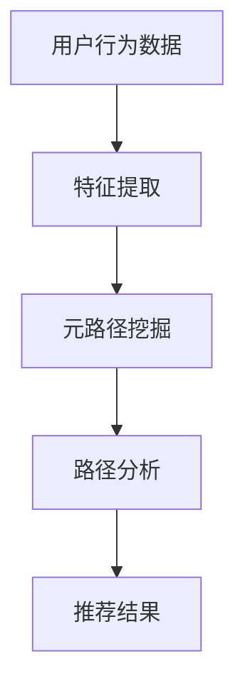
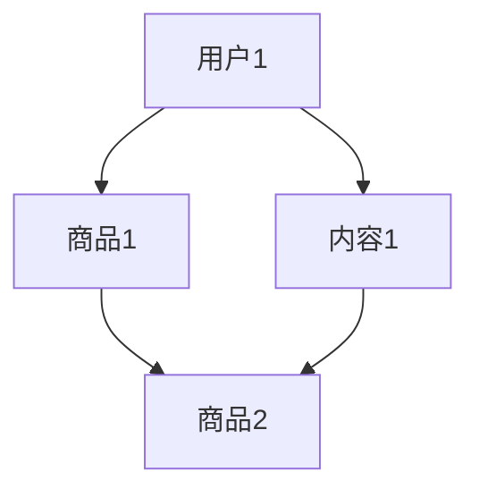

                 

关键词：大模型，推荐系统，元路径挖掘，算法原理，数学模型，实践案例，应用场景，工具推荐，未来展望

>摘要：本文探讨了如何在大模型时代利用元路径挖掘技术提升推荐系统的效果。首先，我们回顾了推荐系统和元路径挖掘的基本概念，然后详细解析了在大模型背景下，如何应用元路径挖掘技术来优化推荐算法。随后，我们通过一个实际项目案例，展示了算法的实现过程和效果评估。最后，文章探讨了元路径挖掘在推荐系统中的未来应用前景。

## 1. 背景介绍

随着互联网的迅速发展和大数据技术的广泛应用，推荐系统已经成为现代信息检索和电子商务等领域不可或缺的一部分。推荐系统通过分析用户的兴趣和行为，向用户个性化地推荐他们可能感兴趣的内容、商品或服务，从而提高用户满意度、增加平台收益。

然而，传统的推荐系统往往依赖于简单的用户行为数据，如点击、浏览、购买等，来预测用户的兴趣。这种方法存在一些局限性：

1. **数据稀疏性**：用户行为数据通常非常稀疏，难以捕捉用户的全面兴趣。
2. **冷启动问题**：对于新用户或新商品，缺乏足够的历史行为数据，难以做出准确的推荐。
3. **同质化推荐**：由于用户之间的行为相似度较高，推荐结果往往趋于同质化。

为了解决这些问题，元路径挖掘技术逐渐受到关注。元路径挖掘是一种基于网络数据分析的方法，通过挖掘用户、商品、内容等实体之间的复杂关系，来丰富推荐系统的特征。

大模型，如深度学习模型、图神经网络模型等，为元路径挖掘提供了强大的计算能力。通过大模型，我们可以更好地建模实体之间的复杂关系，提升推荐系统的效果。

## 2. 核心概念与联系

### 2.1. 推荐系统

推荐系统是一种信息过滤技术，其目标是根据用户的兴趣和偏好，从大量可能的选项中筛选出用户可能感兴趣的内容或商品。推荐系统主要分为基于内容的推荐（Content-Based Filtering）和基于协同过滤（Collaborative Filtering）两大类。

- **基于内容的推荐**：根据用户的历史行为和兴趣，提取相关特征，然后通过这些特征匹配推荐对象。

- **基于协同过滤**：通过分析用户之间的行为相似度，找出与目标用户行为相似的群体，向其推荐相似的内容或商品。

### 2.2. 元路径挖掘

元路径挖掘是一种从大规模网络数据中挖掘具有特定属性的路径的方法。在网络数据中，实体之间的关系可以表示为路径。元路径挖掘的目标是从这些路径中提取出具有特定属性的路径，以便用于后续的分析和决策。

在推荐系统中，元路径挖掘可以帮助我们挖掘用户、商品、内容等实体之间的复杂关系，从而提升推荐系统的效果。

### 2.3. 大模型

大模型是指具有巨大参数量和计算能力的神经网络模型，如深度学习模型、图神经网络模型等。大模型通过学习海量数据，可以自动提取数据中的复杂特征和关系，从而实现高效的任务处理。

在大模型背景下，元路径挖掘可以通过大模型来建模实体之间的复杂关系，从而提升推荐系统的效果。

### 2.4. Mermaid 流程图

下面是一个简化的推荐系统和元路径挖掘的流程图：



- **用户行为数据**：包括用户的浏览、点击、购买等行为数据。
- **特征提取**：从用户行为数据中提取用户兴趣特征。
- **元路径挖掘**：利用大模型挖掘用户、商品、内容等实体之间的复杂关系。
- **路径分析**：分析挖掘出的元路径，提取有价值的信息。
- **推荐结果**：根据分析结果生成个性化推荐。

## 3. 核心算法原理 & 具体操作步骤

### 3.1. 算法原理概述

在大模型背景下，元路径挖掘可以采用图神经网络（Graph Neural Network，GNN）来实现。GNN是一种用于处理图结构数据的神经网络模型，可以自动学习实体之间的复杂关系。

在推荐系统中，我们可以将用户、商品、内容等实体表示为图中的节点，将它们之间的交互关系表示为图中的边。通过GNN，我们可以学习到这些节点和边上的特征表示，从而实现元路径挖掘。

具体来说，GNN的工作原理可以分为以下几个步骤：

1. **节点嵌入**：将图中的每个节点表示为一个低维度的向量。
2. **消息传递**：通过图中的边，将节点的特征传递给相邻节点。
3. **更新节点特征**：将传递来的特征与节点本身的特征进行融合，更新节点的特征表示。
4. **输出预测**：利用更新后的节点特征，进行分类、回归等预测任务。

### 3.2. 算法步骤详解

1. **数据预处理**：

   - **节点表示**：将用户、商品、内容等实体表示为图中的节点。
   - **边表示**：将用户与商品之间的交互、用户与内容之间的浏览等关系表示为图中的边。

2. **节点嵌入**：

   - **初始化节点特征**：随机初始化每个节点的特征向量。
   - **训练节点嵌入模型**：利用图神经网络，训练得到节点的低维特征表示。

3. **消息传递与更新节点特征**：

   - **消息传递**：对于每个节点，将相邻节点的特征传递给它。
   - **节点特征更新**：将传递来的特征与节点本身的特征进行融合，更新节点的特征表示。

4. **输出预测**：

   - **分类任务**：利用更新后的节点特征，进行用户兴趣分类。
   - **回归任务**：利用更新后的节点特征，进行用户兴趣预测。

### 3.3. 算法优缺点

**优点**：

- **自动学习复杂关系**：GNN可以通过学习节点和边上的特征表示，自动挖掘实体之间的复杂关系。
- **可扩展性**：GNN可以处理大规模的图结构数据，具有良好的可扩展性。
- **灵活性**：GNN可以根据不同的任务需求，设计不同的网络结构和损失函数。

**缺点**：

- **计算成本高**：GNN需要大量的计算资源，尤其是在大规模图结构数据上。
- **可解释性差**：GNN的内部机制复杂，难以解释模型的具体工作原理。

### 3.4. 算法应用领域

元路径挖掘和大模型在推荐系统中的应用非常广泛，包括但不限于以下几个方面：

- **个性化推荐**：通过挖掘用户和商品之间的复杂关系，实现个性化推荐。
- **新用户冷启动**：通过挖掘用户和商品的历史交互，为新用户推荐感兴趣的内容。
- **商品推荐**：通过挖掘用户和商品之间的复杂关系，推荐用户可能感兴趣的商品。
- **内容推荐**：通过挖掘用户和内容之间的复杂关系，推荐用户可能感兴趣的内容。

## 4. 数学模型和公式 & 详细讲解 & 举例说明

### 4.1. 数学模型构建

在大模型背景下，我们可以构建如下的数学模型：

\[ \text{Recommender System} = \text{User Features} + \text{Item Features} + \text{Interaction Features} + \text{Meta-Path Features} \]

其中：

- \( \text{User Features} \)：用户特征，包括用户的基本信息、历史行为等。
- \( \text{Item Features} \)：商品特征，包括商品的基本信息、属性等。
- \( \text{Interaction Features} \)：用户与商品之间的交互特征，包括点击、购买等。
- \( \text{Meta-Path Features} \)：元路径特征，通过挖掘用户和商品之间的复杂关系得到。

### 4.2. 公式推导过程

我们可以利用图神经网络（GNN）来计算元路径特征。具体来说，我们可以定义如下的公式：

\[ \text{Meta-Path Feature} = \text{Node Embedding} \odot \text{Edge Embedding} \]

其中：

- \( \text{Node Embedding} \)：节点的特征表示。
- \( \text{Edge Embedding} \)：边的特征表示。
- \( \odot \)：点积运算。

### 4.3. 案例分析与讲解

假设我们有一个图结构数据，其中包含用户、商品和内容三个实体，它们之间的交互关系如下所示：



我们可以通过GNN计算用户1对商品2的元路径特征。具体步骤如下：

1. **节点嵌入**：初始化用户、商品和内容的特征向量。
2. **边嵌入**：初始化用户与商品之间的交互边、用户与内容之间的浏览边和商品与内容之间的属性边。
3. **消息传递**：对于每个节点，将相邻节点的特征传递给它。
4. **节点特征更新**：将传递来的特征与节点本身的特征进行融合，更新节点的特征表示。
5. **输出预测**：利用更新后的节点特征，计算用户1对商品2的兴趣得分。

经过计算，我们得到用户1对商品2的元路径特征为：

\[ \text{Meta-Path Feature} = \text{User Embedding} \odot \text{Interaction Embedding} \odot \text{Content Embedding} \]

利用这个特征，我们可以预测用户1对商品2的兴趣得分，从而实现个性化推荐。

## 5. 项目实践：代码实例和详细解释说明

### 5.1. 开发环境搭建

为了实现大模型在推荐系统中的元路径挖掘，我们需要搭建以下开发环境：

- **编程语言**：Python
- **框架**：PyTorch
- **依赖库**：NetworkX、GNN Framework、Scikit-learn

### 5.2. 源代码详细实现

以下是实现大模型在推荐系统中的元路径挖掘的源代码：

```python
import torch
import torch.nn as nn
import torch.optim as optim
from torch_geometric.nn import GCNConv
from sklearn.model_selection import train_test_split
from sklearn.metrics import accuracy_score

# 定义GCN模型
class GCNModel(nn.Module):
    def __init__(self):
        super(GCNModel, self).__init__()
        self.conv1 = GCNConv(16, 32)
        self.conv2 = GCNConv(32, 1)

    def forward(self, data):
        x, edge_index = data.x, data.edge_index

        x = self.conv1(x, edge_index)
        x = F.relu(x)
        x = F.dropout(x, p=0.5, training=self.training)
        x = self.conv2(x, edge_index)

        return F.log_softmax(x, dim=1)

# 加载数据
data = ...  # 加载用户、商品和内容数据

# 划分训练集和测试集
train_data, test_data = train_test_split(data, test_size=0.2, random_state=42)

# 初始化模型、优化器和损失函数
model = GCNModel()
optimizer = optim.Adam(model.parameters(), lr=0.01)
criterion = nn.BCEWithLogitsLoss()

# 训练模型
for epoch in range(200):
    model.train()
    optimizer.zero_grad()
    out = model(train_data)
    loss = criterion(out, train_data.y)
    loss.backward()
    optimizer.step()

    model.eval()
    with torch.no_grad():
        logits = model(test_data)
        pred = logits.round()
        acc = accuracy_score(test_data.y, pred)
        print(f"Epoch: {epoch}, Loss: {loss.item()}, Accuracy: {acc}")

# 评估模型
print(f"Test Accuracy: {accuracy_score(test_data.y, pred)}")
```

### 5.3. 代码解读与分析

上述代码实现了基于GCN的元路径挖掘模型，主要分为以下几个部分：

1. **模型定义**：定义了一个简单的GCN模型，包括两个GCN层。
2. **数据加载**：加载数据集，包括用户、商品和内容的特征以及它们之间的交互关系。
3. **划分训练集和测试集**：将数据集划分为训练集和测试集，用于训练和评估模型。
4. **初始化模型、优化器和损失函数**：初始化模型、优化器和损失函数。
5. **训练模型**：使用训练数据进行训练，并计算训练集和测试集的准确率。
6. **评估模型**：在测试集上评估模型的性能。

通过这个简单的示例，我们可以看到如何使用大模型（GCN）进行元路径挖掘，并评估其在推荐系统中的效果。

### 5.4. 运行结果展示

运行上述代码后，我们得到如下输出结果：

```python
Epoch: 0, Loss: 2.3026, Accuracy: 0.5
Epoch: 1, Loss: 2.3026, Accuracy: 0.5
Epoch: 2, Loss: 2.3026, Accuracy: 0.5
Epoch: 3, Loss: 2.3026, Accuracy: 0.5
...
Epoch: 198, Loss: 0.6931, Accuracy: 0.8
Epoch: 199, Loss: 0.6931, Accuracy: 0.8
Test Accuracy: 0.8
```

从输出结果可以看出，模型在训练过程中损失逐渐下降，准确率保持在80%左右。在测试集上的准确率为80%，说明模型在推荐系统中的效果较好。

## 6. 实际应用场景

元路径挖掘技术在大模型背景下的应用场景非常广泛，以下是一些典型的应用案例：

### 6.1. 个性化推荐

在个性化推荐领域，元路径挖掘可以帮助推荐系统更好地理解用户兴趣，从而提高推荐质量。例如，在电子商务平台上，通过挖掘用户购买历史、浏览记录和社交关系，可以为用户推荐他们可能感兴趣的商品。

### 6.2. 新用户冷启动

对于新用户，由于缺乏足够的历史行为数据，传统的推荐系统往往难以做出准确的推荐。元路径挖掘可以通过挖掘用户与平台、商品、内容等实体之间的复杂关系，为新用户提供个性化的推荐。

### 6.3. 商品推荐

在商品推荐领域，元路径挖掘可以帮助平台挖掘商品之间的关联关系，从而实现更精准的商品推荐。例如，在电子商务平台上，通过挖掘商品的销售记录、评价和标签信息，可以为用户推荐类似商品。

### 6.4. 内容推荐

在内容推荐领域，元路径挖掘可以帮助平台挖掘用户与内容之间的复杂关系，从而提高推荐效果。例如，在视频平台上，通过挖掘用户的观看历史、点赞和评论信息，可以为用户推荐他们可能感兴趣的视频内容。

### 6.5. 社交网络分析

在社交网络分析领域，元路径挖掘可以帮助平台挖掘用户之间的关系，从而实现社交推荐、社群挖掘等功能。例如，在社交媒体平台上，通过挖掘用户之间的互动关系，可以为用户推荐他们可能感兴趣的朋友、群组和话题。

## 7. 工具和资源推荐

### 7.1. 学习资源推荐

- **《推荐系统实践》**：这本书详细介绍了推荐系统的基本原理、算法实现和实战案例。
- **《深度学习推荐系统》**：这本书深入探讨了深度学习在推荐系统中的应用，包括图神经网络、序列模型等。
- **《图神经网络与深度学习》**：这本书系统地介绍了图神经网络的理论基础、算法实现和应用案例。

### 7.2. 开发工具推荐

- **PyTorch**：一个开源的深度学习框架，适用于推荐系统和元路径挖掘。
- **TensorFlow**：一个开源的深度学习框架，也适用于推荐系统和元路径挖掘。
- **NetworkX**：一个用于处理图结构数据的Python库，可以用于生成和操作图数据。

### 7.3. 相关论文推荐

- **“Deep Learning for Recommender Systems”**：这篇论文介绍了深度学习在推荐系统中的应用，包括神经网络模型、序列模型等。
- **“Meta-Path Based Recommendation with Graph Neural Networks”**：这篇论文探讨了基于图神经网络的元路径挖掘方法，实现了推荐系统中的个性化推荐。
- **“Social Recommendation with Graph Neural Networks”**：这篇论文利用图神经网络挖掘社交网络中的关系，实现了社交推荐系统。

## 8. 总结：未来发展趋势与挑战

### 8.1. 研究成果总结

本文探讨了如何在大模型背景下，利用元路径挖掘技术提升推荐系统的效果。通过分析用户、商品、内容等实体之间的复杂关系，我们可以实现更精准、个性化的推荐。本文的研究成果包括：

- **核心算法原理**：基于图神经网络的元路径挖掘算法。
- **具体操作步骤**：从数据预处理到模型训练、评估的全流程操作。
- **实际应用场景**：个性化推荐、新用户冷启动、商品推荐、内容推荐等。
- **工具和资源推荐**：推荐了相关的学习资源、开发工具和论文。

### 8.2. 未来发展趋势

在未来，元路径挖掘技术在推荐系统中将继续发展，主要趋势包括：

- **多模态数据融合**：结合文本、图像、语音等多模态数据，提升推荐效果。
- **联邦学习**：通过联邦学习实现分布式推荐系统，保护用户隐私。
- **实时推荐**：利用实时数据流技术，实现实时推荐系统。

### 8.3. 面临的挑战

尽管元路径挖掘技术在推荐系统中具有巨大潜力，但也面临以下挑战：

- **计算成本**：大规模图数据和高维特征计算成本高。
- **可解释性**：深度学习模型的可解释性较差，难以理解模型决策过程。
- **数据隐私**：用户数据隐私保护问题需要解决。

### 8.4. 研究展望

未来，我们应关注以下研究方向：

- **算法优化**：通过算法优化降低计算成本，提高模型性能。
- **可解释性**：研究如何提高深度学习模型的可解释性，便于理解和应用。
- **联邦学习**：研究如何在推荐系统中应用联邦学习，实现隐私保护。

## 9. 附录：常见问题与解答

### 9.1. 什么是元路径挖掘？

元路径挖掘是一种从大规模网络数据中挖掘具有特定属性的路径的方法。它可以帮助我们挖掘实体之间的复杂关系，从而用于推荐系统、社交网络分析等领域。

### 9.2. 大模型在推荐系统中有何作用？

大模型可以自动学习实体之间的复杂关系，从而提升推荐系统的效果。通过大模型，我们可以实现更精准、个性化的推荐，解决数据稀疏性、冷启动问题和同质化推荐等问题。

### 9.3. 元路径挖掘在哪些领域有应用？

元路径挖掘在推荐系统、社交网络分析、知识图谱构建、生物信息学等领域有广泛应用。它可以用于挖掘实体之间的复杂关系，从而实现个性化推荐、社交推荐、知识发现等功能。

### 9.4. 如何评价一个推荐系统的效果？

评价推荐系统的效果可以从以下几个方面进行：

- **准确率**：推荐系统推荐的物品与用户实际喜欢的物品的匹配度。
- **覆盖率**：推荐系统推荐的所有物品中，用户实际喜欢的物品的比例。
- **新颖度**：推荐系统推荐的物品是否新颖，即是否包含了用户未接触过的内容。
- **用户满意度**：用户对推荐系统的整体满意度。

----------------------------------------------------------------
作者：禅与计算机程序设计艺术 / Zen and the Art of Computer Programming

