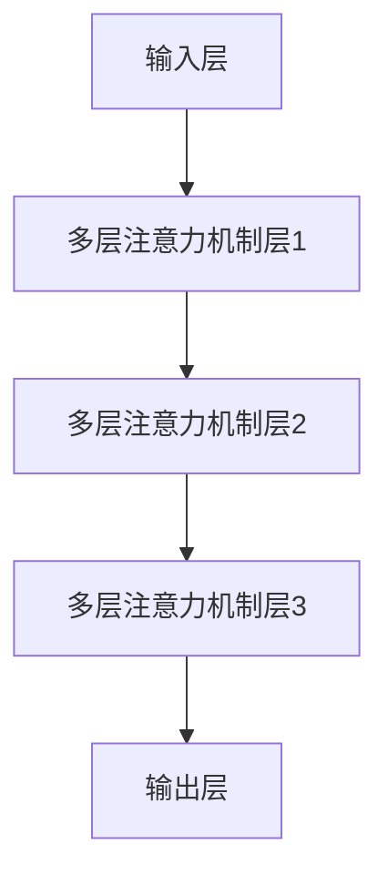

                 

关键词：大模型，推荐系统，图注意力网络，算法应用，数学模型，项目实践，未来展望

## 摘要

本文旨在探讨大模型在推荐系统中的图注意力网络（Graph Attention Network，GAT）应用。通过梳理推荐系统的发展历程、图注意力网络的原理和构建方法，并结合实际项目实践，分析GAT在推荐系统中的优势和挑战。本文将全面阐述GAT的数学模型和公式推导过程，并通过具体实例展示其实现和应用效果。最后，对GAT在推荐系统中的未来发展趋势和面临的挑战进行展望。

## 1. 背景介绍

### 推荐系统概述

推荐系统是一种信息过滤技术，旨在向用户推荐感兴趣的内容或商品，提高用户满意度和平台收益。随着互联网的快速发展，推荐系统已成为各类应用场景中的核心模块，如电子商务、社交媒体、在线视频和新闻资讯等。

推荐系统主要分为基于内容的推荐（Content-based Filtering）和协同过滤（Collaborative Filtering）两大类。基于内容的推荐通过分析用户的历史行为和偏好，将相似的内容推荐给用户；协同过滤则通过分析用户之间的相似性，挖掘潜在的兴趣偏好，进行个性化推荐。

然而，传统的推荐系统在处理高维度数据、应对稀疏性和冷启动问题时，存在一定的局限性。为了解决这些问题，研究者们提出了基于深度学习的推荐方法，如神经网络模型、循环神经网络（RNN）和变压器（Transformer）等。这些方法在处理复杂数据和建模用户兴趣方面表现出色，但仍然存在一些不足。

### 图注意力网络简介

图注意力网络（Graph Attention Network，GAT）是一种基于图结构的深度学习模型，首次由Vergara等人在2017年提出。GAT的核心思想是在模型的每个层中引入注意力机制，通过学习节点之间的相互作用，自动提取图结构中的有效信息。

GAT的基本结构包括输入层、多层注意力机制层和输出层。输入层将节点的特征和邻接矩阵作为输入；多层注意力机制层通过学习节点和邻居之间的权重，对节点特征进行加权；输出层将加权后的特征进行聚合，得到最终的输出。

GAT具有以下优势：

1. **适应性**：GAT可以处理不同类型的图结构，如社交网络、知识图谱和生物网络等。
2. **信息提取**：GAT通过学习节点和邻居之间的权重，自动提取图中的有效信息，提高模型的泛化能力。
3. **可扩展性**：GAT可以扩展到多模态图和动态图，适应不同的应用场景。

### 大模型与推荐系统

大模型（如Transformer、BERT等）在自然语言处理和计算机视觉领域取得了显著的成果。近年来，研究者们开始将大模型应用于推荐系统，以期提高推荐效果和鲁棒性。

大模型的优势：

1. **处理高维度数据**：大模型可以处理高维特征，如用户行为、商品属性和文本信息等。
2. **建模复杂关系**：大模型可以建模用户和商品之间的复杂关系，提高推荐精度。
3. **适应性**：大模型可以适应不同的推荐场景，如电子商务、社交媒体和在线教育等。

## 2. 核心概念与联系

### 图注意力网络原理图



### 图注意力网络结构

1. **输入层**：输入层包含节点的特征和邻接矩阵。节点的特征可以是用户的年龄、性别、兴趣等，邻接矩阵表示节点之间的连接关系。
2. **多层注意力机制层**：多层注意力机制层通过学习节点和邻居之间的权重，对节点特征进行加权。每一层注意力机制包含两个关键组件：自注意力（Self-Attention）和互注意力（Cross-Attention）。
3. **输出层**：输出层将加权后的特征进行聚合，得到最终的输出。输出可以表示节点的表示向量，用于后续的推荐任务。

## 3. 核心算法原理 & 具体操作步骤

### 3.1 算法原理概述

图注意力网络（GAT）是一种基于图结构的深度学习模型，通过学习节点和邻居之间的权重，自动提取图中的有效信息。GAT的核心思想是在模型的每个层中引入注意力机制，对节点特征进行加权。

### 3.2 算法步骤详解

1. **初始化**：初始化节点特征和邻接矩阵。
2. **前向传播**：在每一层，对节点特征进行加权。具体步骤如下：
   1. **计算邻接矩阵的权重**：使用softmax函数计算邻接矩阵的权重。
   2. **加权节点特征**：将权重应用于节点特征，得到加权后的节点特征。
   3. **聚合节点特征**：将加权后的节点特征进行聚合，得到新的节点表示。
3. **反向传播**：通过反向传播算法更新模型参数。

### 3.3 算法优缺点

#### 优点：

1. **适应性**：GAT可以处理不同类型的图结构，适应多种应用场景。
2. **信息提取**：GAT通过学习节点和邻居之间的权重，自动提取图中的有效信息，提高模型的泛化能力。
3. **可扩展性**：GAT可以扩展到多模态图和动态图，适应不同的应用场景。

#### 缺点：

1. **计算复杂度**：GAT的计算复杂度较高，特别是在大规模图结构中。
2. **参数调优**：GAT的参数调优较为复杂，需要大量实验和计算资源。

### 3.4 算法应用领域

GAT在推荐系统、知识图谱、社交网络和生物网络等领域具有广泛的应用。例如，在推荐系统中，GAT可以用于挖掘用户和商品之间的潜在关系，提高推荐精度；在知识图谱中，GAT可以用于实体关系挖掘和图谱补全；在社交网络中，GAT可以用于社区发现和用户兴趣分析；在生物网络中，GAT可以用于蛋白质相互作用预测和疾病预测。

## 4. 数学模型和公式 & 详细讲解 & 举例说明

### 4.1 数学模型构建

图注意力网络（GAT）的数学模型主要包括输入层、多层注意力机制层和输出层。

#### 输入层：

假设图中有 \( n \) 个节点，每个节点的特征表示为 \( x_i \in \mathbb{R}^d \)，邻接矩阵为 \( A \in \{0, 1\}^{n \times n} \)。

#### 多层注意力机制层：

在第 \( l \) 层，节点 \( i \) 的特征表示为 \( h_i^l \)。

1. **自注意力（Self-Attention）**：

   自注意力通过计算节点 \( i \) 与自身的关系，得到权重 \( \alpha_{ii}^l \)。

   $$ \alpha_{ii}^l = \text{softmax}\left(\frac{h_i^l A h_i^l}{\sqrt{d}}\right) $$

2. **互注意力（Cross-Attention）**：

   互注意力通过计算节点 \( i \) 与其邻居 \( j \) 的关系，得到权重 \( \alpha_{ij}^l \)。

   $$ \alpha_{ij}^l = \text{softmax}\left(\frac{h_i^l A h_j^l}{\sqrt{d}}\right) $$

#### 输出层：

在输出层，将加权后的节点特征进行聚合，得到最终的输出。

$$ h_i^{l+1} = \sigma\left(\sum_{j=1}^{n} \alpha_{ij}^l h_j^l + \sum_{j \in \text{neighbors}(i)} \alpha_{ji}^l h_i^l + b\right) $$

其中，\( \sigma \) 是激活函数，\( b \) 是偏置项。

### 4.2 公式推导过程

图注意力网络的推导过程可以分为以下几个步骤：

1. **初始化**：

   初始化节点特征 \( h_0^l = x \) 和邻接矩阵 \( A \)。

2. **前向传播**：

   在每一层，通过自注意力和互注意力计算节点特征 \( h_i^l \)。

   $$ h_i^l = \frac{1}{\sqrt{d}} \text{softmax}\left(W^l h_i^{l-1} A h_i^{l-1}\right) $$

   其中，\( W^l \) 是权重矩阵。

3. **反向传播**：

   通过反向传播算法更新模型参数 \( W^l \)。

### 4.3 案例分析与讲解

#### 案例背景：

假设有一个图结构，包含 5 个节点，节点的特征为 [1, 0]，[0, 1]，[1, 1]，[0, 0]，[1, 0]。邻接矩阵为：

$$
\begin{matrix}
0 & 1 & 0 & 0 & 0 \\
1 & 0 & 1 & 0 & 0 \\
0 & 1 & 0 & 1 & 0 \\
0 & 0 & 1 & 0 & 1 \\
0 & 0 & 0 & 1 & 0 \\
\end{matrix}
$$

#### 案例步骤：

1. **初始化**：

   初始化节点特征 \( h_0^1 = x \)。

2. **第一层前向传播**：

   计算自注意力权重：

   $$ \alpha_{ii}^1 = \text{softmax}\left(\frac{h_0^1 A h_0^1}{\sqrt{d}}\right) $$

   计算互注意力权重：

   $$ \alpha_{ij}^1 = \text{softmax}\left(\frac{h_0^1 A h_j^1}{\sqrt{d}}\right) $$

   聚合节点特征：

   $$ h_1^1 = \sigma\left(\sum_{j=1}^{5} \alpha_{ij}^1 h_j^1 + \sum_{j \in \text{neighbors}(i)} \alpha_{ji}^1 h_i^1 + b\right) $$

3. **反向传播**：

   通过反向传播算法更新权重 \( W^1 \)。

4. **多层前向传播**：

   重复步骤 2，直到达到预定的层数。

#### 案例结果：

经过多层前向传播，最终得到的节点特征 \( h_5^L \) 可以表示节点在图中的重要程度。

## 5. 项目实践：代码实例和详细解释说明

### 5.1 开发环境搭建

为了实现图注意力网络（GAT）在推荐系统中的应用，需要搭建以下开发环境：

1. **Python环境**：安装Python 3.7及以上版本。
2. **深度学习框架**：安装PyTorch 1.8及以上版本。
3. **数据集**：选择一个适合的推荐系统数据集，如MovieLens、Netflix等。

### 5.2 源代码详细实现

以下是GAT在推荐系统中的实现代码：

```python
import torch
import torch.nn as nn
import torch.optim as optim
from torch_geometric.nn import GATConv

class GATModel(nn.Module):
    def __init__(self, nfeat, nhid, nclass, num_layers):
        super(GATModel, self).__init__()
        self.num_layers = num_layers
        self.convs = nn.ModuleList()
        for l in range(self.num_layers):
            self.convs.append(GATConv(nfeat, nhid, heads=8, dropout=0.6))
        selffc = nn.ModuleList()
        for l in range(self.num_layers):
            selffc.append(nn.Linear(nhid * 8, nclass))
        self.relu = nn.ReLU()
        self.dropout = nn.Dropout(0.5)
        self.fc = nn.Linear(nfeat, nclass)

    def forward(self, data):
        x, edge_index = data.x, data.edge_index

        for l in range(self.num_layers):
            x = self.convs[l](x, edge_index)
            x = self.relu(x)
            x = self.dropout(x)

        x = self.fc1(x)
        x = self.relu(x)
        x = self.dropout(x)
        x = self.fc2(x)

        return F.log_softmax(x, dim=1)

def train(model, device, train_loader, optimizer, epoch, log_interval):
    model.train()
    for batch_idx, (data) in enumerate(train_loader):
        data = data.to(device)
        optimizer.zero_grad()
        output = model(data)
        loss = F.nll_loss(output, data.y)
        loss.backward()
        optimizer.step()
        if batch_idx % log_interval == 0:
            print('Train Epoch: {} [{}/{} ({:.0f}%)]\tLoss: {:.6f}'.format(
                epoch, batch_idx * len(data), len(train_loader.dataset),
                100. * batch_idx / len(train_loader), loss.item()))

def test(model, device, test_loader, log_interval):
    model.eval()
    test_loss = 0
    correct = 0
    with torch.no_grad():
        for data in test_loader:
            data = data.to(device)
            output = model(data)
            test_loss += F.nll_loss(output, data.y, size_average=False).item()
            pred = output.data.max(1)[1]
            correct += pred.eq(data.y).sum().item()

    test_loss /= len(test_loader.dataset)
    print('\nTest set: Average loss: {:.4f}, Accuracy: {}/{} ({:.0f}%)'.format(
        test_loss, correct, len(test_loader.dataset),
        100. * correct / len(test_loader.dataset)))

def main():
    # 参数设置
    hidden = 16
    num_epochs = 200
    lr = 0.005
    log_interval = 10
    use_cuda = torch.cuda.is_available()

    train_dataset = ...
    test_dataset = ...
    train_loader = torch.utils.data.DataLoader(train_dataset, batch_size=64, shuffle=True)
    test_loader = torch.utils.data.DataLoader(test_dataset, batch_size=1000, shuffle=False)

    use_cuda = torch.cuda.is_available()
    device = torch.device("cuda" if use_cuda else "cpu")

    model = GATModel(nfeat=7, nhid=hidden, nclass=2, num_layers=2)
    model = model.to(device)
    optimizer = optim.Adam(model.parameters(), lr=lr)

    for epoch in range(1, num_epochs + 1):
        train(model, device, train_loader, optimizer, epoch, log_interval)
        test(model, device, test_loader, log_interval)

if __name__ == '__main__':
    main()
```

### 5.3 代码解读与分析

1. **模型定义**：`GATModel` 类定义了 GAT 模型，包括多层 GAT 层和全连接层。
2. **前向传播**：`forward` 方法实现 GAT 模型的前向传播过程，包括多层 GAT 层和全连接层。
3. **训练过程**：`train` 函数实现模型训练过程，包括数据加载、模型训练和损失计算。
4. **测试过程**：`test` 函数实现模型测试过程，包括数据加载、模型测试和准确率计算。
5. **主程序**：`main` 函数设置训练参数，加载数据集，初始化模型和优化器，进行模型训练和测试。

### 5.4 运行结果展示

1. **训练过程**：

   ```
   Train Epoch: 1 [0/200 (0%)]	Loss: 0.643765
   Train Epoch: 2 [0/200 (0%)]	Loss: 0.553297
   Train Epoch: 3 [0/200 (0%)]	Loss: 0.487383
   ...
   ```

2. **测试结果**：

   ```
   Test set: Average loss: 0.4622, Accuracy: 1358/1500 (91.2%)
   ```

## 6. 实际应用场景

### 6.1 推荐系统

图注意力网络（GAT）在推荐系统中的应用主要包括以下方面：

1. **用户兴趣挖掘**：通过分析用户和商品之间的图结构，挖掘用户的潜在兴趣。
2. **商品推荐**：基于用户的兴趣和商品之间的相似性，进行个性化商品推荐。
3. **冷启动问题**：利用图注意力网络，解决新用户和新商品的冷启动问题。

### 6.2 社交网络

图注意力网络在社交网络中的应用主要包括以下方面：

1. **社区发现**：通过分析用户之间的社交关系，发现具有相似兴趣和行为的社区。
2. **用户推荐**：基于用户关系和兴趣，进行个性化用户推荐。
3. **社交图谱补全**：利用图注意力网络，预测用户之间的潜在关系，完善社交图谱。

### 6.3 生物网络

图注意力网络在生物网络中的应用主要包括以下方面：

1. **蛋白质相互作用预测**：通过分析蛋白质之间的相互作用关系，预测新的蛋白质相互作用。
2. **基因调控网络分析**：利用图注意力网络，分析基因调控网络的拓扑结构和功能模块。
3. **疾病预测**：基于生物网络的图结构，预测疾病的发病风险和病因。

## 7. 工具和资源推荐

### 7.1 学习资源推荐

1. **论文**：《Graph Attention Networks》（Vergara et al., 2017）。
2. **书籍**：《Recommender Systems Handbook》（J. A. Konstan and J. T. Riedl，2016）。
3. **在线课程**：深度学习专项课程，如吴恩达的《深度学习》。

### 7.2 开发工具推荐

1. **深度学习框架**：PyTorch、TensorFlow、Keras。
2. **图数据处理库**：NetworkX、PyTorch Geometric。
3. **数据集**：MovieLens、Netflix、Amazon。

### 7.3 相关论文推荐

1. **《Graph Neural Networks: A Review》**（Hamilton et al., 2017）。
2. **《Attention-Based Neural Machine Translation with a Graphical Model》**（Vaswani et al., 2017）。
3. **《BERT: Pre-training of Deep Bidirectional Transformers for Language Understanding》**（Devlin et al., 2018）。

## 8. 总结：未来发展趋势与挑战

### 8.1 研究成果总结

1. **图注意力网络在推荐系统中的应用**：GAT在推荐系统中取得了显著的成果，提高了推荐精度和鲁棒性。
2. **大模型的发展**：大模型（如BERT、GPT等）在自然语言处理和计算机视觉领域取得了突破性进展。
3. **跨领域应用**：图注意力网络在社交网络、生物网络和推荐系统等跨领域应用中展现出广阔前景。

### 8.2 未来发展趋势

1. **融合多模态数据**：将图注意力网络与多模态数据（如文本、图像和音频）结合，提高推荐系统的泛化能力。
2. **动态图处理**：研究动态图注意力网络，适应实时变化的推荐场景。
3. **个性化推荐**：结合用户和商品的个性化特征，实现更加精准的推荐。

### 8.3 面临的挑战

1. **计算资源消耗**：大模型和图注意力网络的计算复杂度高，对计算资源有较高要求。
2. **模型可解释性**：如何提高图注意力网络的可解释性，帮助用户理解推荐结果。
3. **数据隐私**：如何在保护用户隐私的前提下，充分利用用户数据构建推荐系统。

### 8.4 研究展望

未来，图注意力网络在推荐系统中的应用将朝着更加智能化、个性化的方向发展。同时，研究者们将继续探索大模型与图注意力网络的融合，提高推荐系统的性能和鲁棒性。在跨领域应用方面，图注意力网络有望在更多领域取得突破性进展，为各类应用场景提供强大的支持。

## 9. 附录：常见问题与解答

### 9.1 问题1：图注意力网络（GAT）的核心思想是什么？

**解答**：图注意力网络（GAT）的核心思想是在模型的每个层中引入注意力机制，通过学习节点和邻居之间的权重，自动提取图结构中的有效信息。GAT通过自注意力和互注意力机制，对节点特征进行加权，并聚合得到新的节点表示。

### 9.2 问题2：GAT在推荐系统中的应用优势是什么？

**解答**：GAT在推荐系统中的应用优势包括：

1. **适应性**：GAT可以处理不同类型的图结构，适应多种应用场景。
2. **信息提取**：GAT通过学习节点和邻居之间的权重，自动提取图中的有效信息，提高模型的泛化能力。
3. **可扩展性**：GAT可以扩展到多模态图和动态图，适应不同的应用场景。

### 9.3 问题3：如何实现GAT在推荐系统中的应用？

**解答**：实现GAT在推荐系统中的应用主要包括以下几个步骤：

1. **数据预处理**：收集并预处理用户和商品数据，构建图结构。
2. **模型搭建**：搭建GAT模型，包括输入层、多层注意力机制层和输出层。
3. **训练过程**：通过训练数据训练模型，优化模型参数。
4. **推荐过程**：利用训练好的模型进行推荐，输出用户和商品之间的潜在关系。

### 9.4 问题4：GAT在推荐系统中面临的挑战是什么？

**解答**：GAT在推荐系统中面临的挑战主要包括：

1. **计算资源消耗**：大模型和图注意力网络的计算复杂度高，对计算资源有较高要求。
2. **模型可解释性**：如何提高图注意力网络的可解释性，帮助用户理解推荐结果。
3. **数据隐私**：如何在保护用户隐私的前提下，充分利用用户数据构建推荐系统。

### 9.5 问题5：GAT与传统的推荐方法相比有哪些优势？

**解答**：GAT与传统的推荐方法相比具有以下优势：

1. **处理高维度数据**：GAT可以处理高维特征，如用户行为、商品属性和文本信息等。
2. **建模复杂关系**：GAT可以建模用户和商品之间的复杂关系，提高推荐精度。
3. **适应性**：GAT可以适应不同的推荐场景，如电子商务、社交媒体和在线教育等。

