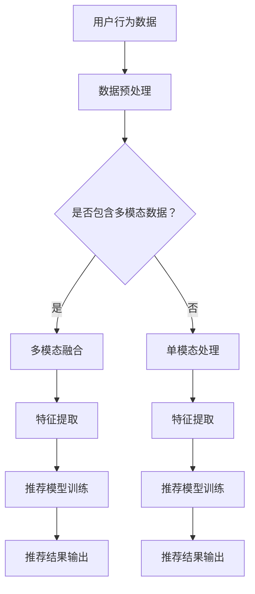

                 

关键词：大模型、推荐系统、多模态融合、深度学习、图像处理、自然语言处理

摘要：随着大数据和人工智能技术的快速发展，推荐系统已成为许多在线应用的核心组成部分。大模型的引入和跨模态信息的融合，极大地提升了推荐系统的准确性和个性化水平。本文将探讨大模型在推荐系统中的应用，特别是多模态融合技术的实现方法和挑战。

## 1. 背景介绍

推荐系统是一种信息过滤技术，旨在根据用户的历史行为和偏好，向用户推荐可能感兴趣的内容。传统的推荐系统主要依赖于基于内容的过滤和协同过滤方法，但它们在处理复杂用户行为和多样化内容方面存在局限性。随着深度学习技术的发展，大模型开始广泛应用于推荐系统，并在图像、文本和音频等多种模态的数据处理上表现出色。

多模态融合是推荐系统中的一项关键技术，它通过整合不同模态的数据，为用户提供更加精确和个性化的推荐。例如，在电商平台上，用户不仅会通过查看商品的图片，还会阅读商品描述和评价，多模态融合可以更全面地理解用户的兴趣和需求。

本文将首先介绍大模型在推荐系统中的应用，然后深入探讨多模态融合的技术原理和实现方法，最后分析多模态融合面临的挑战和未来发展方向。

## 2. 核心概念与联系

### 大模型在推荐系统中的应用

大模型，如深度神经网络（DNN）、变分自编码器（VAE）和生成对抗网络（GAN），在推荐系统中发挥了重要作用。这些模型能够处理大规模的用户数据和商品数据，提取出有效的特征，从而提高推荐的准确性。

- **深度神经网络（DNN）**：DNN由多个隐藏层组成，可以自动学习输入和输出之间的复杂映射关系。在推荐系统中，DNN可以用于用户画像的构建和商品推荐的生成。

- **变分自编码器（VAE）**：VAE是一种生成模型，它通过编码器和解码器对数据进行重构，从而学习数据的分布。在推荐系统中，VAE可以用于生成新的商品推荐，提升系统的多样性。

- **生成对抗网络（GAN）**：GAN由生成器和判别器组成，通过对抗训练来生成逼真的数据。在推荐系统中，GAN可以用于生成个性化的用户画像，从而提高推荐的个性化水平。

### 多模态融合技术原理

多模态融合旨在整合来自不同模态的数据，以提供更全面的信息。在推荐系统中，常见的模态包括图像、文本和音频。多模态融合的关键在于如何有效地提取和整合这些模态的特征。

- **图像处理**：图像处理技术可以用于提取商品的视觉特征，如颜色、纹理和形状。这些特征可以与文本和音频特征结合，用于推荐系统的训练和预测。

- **自然语言处理（NLP）**：NLP技术可以用于处理文本数据，提取语义特征。这些特征可以与图像和音频特征结合，用于推荐系统的训练和预测。

- **音频处理**：音频处理技术可以用于提取音频特征，如音调、节奏和情感。这些特征可以与图像和文本特征结合，用于推荐系统的训练和预测。

### Mermaid 流程图



## 3. 核心算法原理 & 具体操作步骤

### 3.1 算法原理概述

多模态融合的算法原理主要包括以下几个步骤：

1. **数据预处理**：对来自不同模态的数据进行预处理，包括图像、文本和音频的预处理。

2. **特征提取**：使用深度学习模型提取每个模态的特征。

3. **特征融合**：将提取的各个模态的特征进行融合，形成统一的特征表示。

4. **推荐模型训练**：使用融合后的特征训练推荐模型，如基于内容的推荐、协同过滤或深度学习模型。

5. **推荐结果输出**：根据用户的行为和偏好，输出个性化的推荐结果。

### 3.2 算法步骤详解

1. **数据预处理**

   数据预处理包括图像、文本和音频的预处理。对于图像，可以采用数据增强技术，如旋转、翻转和裁剪，以增加数据的多样性。对于文本，可以使用分词、词性标注和实体识别等技术，提取文本的语义特征。对于音频，可以采用音素划分和情感识别等技术，提取音频的声学特征。

2. **特征提取**

   特征提取是使用深度学习模型提取各个模态的特征。对于图像，可以使用卷积神经网络（CNN）提取视觉特征；对于文本，可以使用循环神经网络（RNN）或变换器（Transformer）提取语义特征；对于音频，可以使用长短时记忆网络（LSTM）或自注意力机制提取声学特征。

3. **特征融合**

   特征融合是将提取的各个模态的特征进行融合，形成统一的特征表示。常用的特征融合方法包括加权平均、拼接和注意力机制。例如，可以使用加权平均将视觉特征、语义特征和声学特征加权融合；也可以使用拼接将这三个特征向量拼接在一起，形成新的特征向量；还可以使用注意力机制动态地关注各个模态的特征。

4. **推荐模型训练**

   推荐模型训练是使用融合后的特征训练推荐模型。常用的推荐模型包括基于内容的推荐、协同过滤和深度学习模型。基于内容的推荐模型使用商品的特征向量计算用户和商品之间的相似度，协同过滤模型使用用户的相似度矩阵进行商品推荐，深度学习模型使用融合后的特征训练神经网络，以预测用户对商品的兴趣度。

5. **推荐结果输出**

   推荐结果输出是根据用户的行为和偏好，输出个性化的推荐结果。例如，可以根据用户的浏览历史和购买记录，推荐用户可能感兴趣的商品；也可以根据用户的评价和评分，推荐用户喜欢的商品。

### 3.3 算法优缺点

**优点**：

- 多模态融合可以更全面地理解用户的需求，提高推荐的准确性。
- 深度学习和生成模型的应用，可以增强推荐系统的多样性和个性化水平。
- 可以处理大规模的用户数据和商品数据，提高推荐系统的可扩展性。

**缺点**：

- 多模态融合的计算成本较高，需要大量的计算资源和时间。
- 特征提取和融合的算法复杂，对算法设计和实现要求较高。
- 数据预处理和特征提取的质量直接影响推荐系统的性能。

### 3.4 算法应用领域

多模态融合的算法在推荐系统中具有广泛的应用前景。以下是一些常见的应用领域：

- **电商平台**：通过多模态融合，可以为用户提供更加个性化、精准的购物推荐。
- **社交媒体**：通过多模态融合，可以推荐用户可能感兴趣的内容，提升用户活跃度和满意度。
- **音频和视频推荐**：通过多模态融合，可以推荐用户可能感兴趣的音乐和视频，提升娱乐体验。

## 4. 数学模型和公式 & 详细讲解 & 举例说明

### 4.1 数学模型构建

在多模态融合的推荐系统中，常用的数学模型包括基于内容的推荐模型、协同过滤模型和深度学习模型。以下分别介绍这些模型的基本数学模型和公式。

1. **基于内容的推荐模型**

   基于内容的推荐模型使用商品的特征向量计算用户和商品之间的相似度，推荐相似度较高的商品。假设用户和商品的特征向量分别为 \( \mathbf{u} \) 和 \( \mathbf{v} \)，相似度计算公式为：

   $$ \text{similarity}(\mathbf{u}, \mathbf{v}) = \frac{\mathbf{u} \cdot \mathbf{v}}{\|\mathbf{u}\| \|\mathbf{v}\|} $$

   其中，\( \cdot \) 表示点积，\( \|\mathbf{u}\| \) 和 \( \|\mathbf{v}\| \) 分别表示用户和商品的特征向量的欧几里得范数。

2. **协同过滤模型**

   协同过滤模型使用用户的相似度矩阵计算用户对商品的预测评分。假设用户和商品的评分矩阵为 \( \mathbf{R} \)，用户和用户之间的相似度矩阵为 \( \mathbf{S} \)，用户对商品的预测评分为 \( \mathbf{P} \)，预测评分的计算公式为：

   $$ \mathbf{P}_{ij} = \mathbf{S}_{ik} \mathbf{R}_{kj} $$

   其中，\( \mathbf{P}_{ij} \) 表示用户 \( i \) 对商品 \( j \) 的预测评分，\( \mathbf{S}_{ik} \) 表示用户 \( i \) 和用户 \( k \) 之间的相似度，\( \mathbf{R}_{kj} \) 表示用户 \( k \) 对商品 \( j \) 的评分。

3. **深度学习模型**

   深度学习模型使用融合后的特征训练神经网络，预测用户对商品的兴趣度。假设融合后的特征向量为 \( \mathbf{x} \)，用户对商品的兴趣度预测为 \( \mathbf{y} \)，神经网络的前向传播计算公式为：

   $$ \mathbf{y} = \sigma(\mathbf{W} \mathbf{x} + \mathbf{b}) $$

   其中，\( \sigma \) 表示激活函数，\( \mathbf{W} \) 和 \( \mathbf{b} \) 分别表示神经网络的权重和偏置。

### 4.2 公式推导过程

以下是深度学习模型的前向传播过程和反向传播过程。

#### 前向传播过程

假设输入特征向量为 \( \mathbf{x} \)，神经网络的层数为 \( L \)，每层的神经元数量分别为 \( \mathbf{h}^{(l)} \)（\( l \) 表示层数），权重和偏置分别为 \( \mathbf{W}^{(l)} \) 和 \( \mathbf{b}^{(l)} \)。

1. **输入层到隐藏层**

   第一层隐藏层的输出 \( \mathbf{h}^{(1)} \) 为：

   $$ \mathbf{h}^{(1)} = \sigma(\mathbf{W}^{(1)} \mathbf{x} + \mathbf{b}^{(1)}) $$

   其中，\( \sigma \) 表示 sigmoid 激活函数。

2. **隐藏层到输出层**

   对于第 \( l \) 层隐藏层，其输出 \( \mathbf{h}^{(l)} \) 为：

   $$ \mathbf{h}^{(l)} = \sigma(\mathbf{W}^{(l)} \mathbf{h}^{(l-1)} + \mathbf{b}^{(l)}) $$

   其中，\( l = 2, 3, ..., L \)。

3. **输出层**

   输出层 \( \mathbf{y} \) 为：

   $$ \mathbf{y} = \sigma(\mathbf{W}^{(L)} \mathbf{h}^{(L-1)} + \mathbf{b}^{(L)}) $$

#### 反向传播过程

反向传播过程用于计算神经网络各层的梯度，更新权重和偏置。

1. **计算输出层的梯度**

   输出层 \( \mathbf{y} \) 的梯度 \( \mathbf{dy} \) 为：

   $$ \mathbf{dy} = \frac{\partial \mathbf{y}}{\partial \mathbf{h}^{(L-1)}} = \frac{\partial \sigma(\mathbf{W}^{(L)} \mathbf{h}^{(L-1)} + \mathbf{b}^{(L)})}{\partial \mathbf{h}^{(L-1)}} \mathbf{dW}^{(L)} + \frac{\partial \sigma(\mathbf{W}^{(L)} \mathbf{h}^{(L-1)} + \mathbf{b}^{(L)})}{\partial \mathbf{b}^{(L)}} \mathbf{db}^{(L)} $$

   其中，\( \mathbf{dW}^{(L)} \) 和 \( \mathbf{db}^{(L)} \) 分别表示权重和偏置的梯度。

2. **计算隐藏层的梯度**

   对于第 \( l \) 层隐藏层，其梯度 \( \mathbf{dh}^{(l)} \) 为：

   $$ \mathbf{dh}^{(l)} = \frac{\partial \mathbf{h}^{(l)}}{\partial \mathbf{h}^{(l-1)}} \mathbf{dW}^{(l)} + \frac{\partial \mathbf{h}^{(l)}}{\partial \mathbf{b}^{(l)}} \mathbf{db}^{(l)} $$

   其中，\( \mathbf{dW}^{(l)} \) 和 \( \mathbf{db}^{(l)} \) 分别表示权重和偏置的梯度。

3. **更新权重和偏置**

   根据梯度下降算法，更新权重和偏置的公式为：

   $$ \mathbf{W}^{(l)} = \mathbf{W}^{(l)} - \alpha \mathbf{dW}^{(l)} $$
   $$ \mathbf{b}^{(l)} = \mathbf{b}^{(l)} - \alpha \mathbf{db}^{(l)} $$

   其中，\( \alpha \) 为学习率。

### 4.3 案例分析与讲解

以下通过一个简单的例子，讲解多模态融合在推荐系统中的应用。

#### 案例背景

假设有一个电商平台，用户可以浏览商品并对其评分。平台收集了用户的浏览记录、商品图片、商品描述和用户评论等数据。现在需要使用多模态融合技术为用户推荐可能感兴趣的商品。

#### 数据预处理

1. **图像预处理**：对商品图片进行数据增强，如随机裁剪、翻转和缩放等，以增加数据的多样性。

2. **文本预处理**：对商品描述和用户评论进行分词、词性标注和实体识别等操作，提取文本的语义特征。

3. **音频预处理**：对用户评论的音频进行音素划分和情感识别，提取音频的声学特征。

#### 特征提取

1. **图像特征提取**：使用卷积神经网络（CNN）提取商品的视觉特征。

2. **文本特征提取**：使用循环神经网络（RNN）或变换器（Transformer）提取文本的语义特征。

3. **音频特征提取**：使用长短时记忆网络（LSTM）或自注意力机制提取音频的声学特征。

#### 特征融合

1. **加权平均**：将图像、文本和音频的特征向量进行加权平均，形成新的特征向量。

2. **拼接**：将图像、文本和音频的特征向量进行拼接，形成新的特征向量。

3. **注意力机制**：使用注意力机制动态地关注图像、文本和音频的特征，形成新的特征向量。

#### 推荐模型训练

1. **基于内容的推荐模型**：使用图像、文本和音频的特征向量计算用户和商品之间的相似度，推荐相似度较高的商品。

2. **协同过滤模型**：使用用户的相似度矩阵计算用户对商品的预测评分，推荐预测评分较高的商品。

3. **深度学习模型**：使用融合后的特征训练神经网络，预测用户对商品的兴趣度，推荐兴趣度较高的商品。

#### 推荐结果输出

根据用户的行为和偏好，输出个性化的推荐结果。例如，可以根据用户的浏览历史和购买记录，推荐用户可能感兴趣的商品；也可以根据用户的评价和评分，推荐用户喜欢的商品。

## 5. 项目实践：代码实例和详细解释说明

### 5.1 开发环境搭建

在本文中，我们使用 Python 编程语言和 TensorFlow 深度学习框架实现多模态融合的推荐系统。以下是搭建开发环境的基本步骤：

1. **安装 Python**：从 [Python 官网](https://www.python.org/) 下载并安装 Python 3.7 或更高版本。

2. **安装 TensorFlow**：在命令行中执行以下命令安装 TensorFlow：

   ```bash
   pip install tensorflow
   ```

3. **安装其他依赖**：根据需要安装其他依赖库，如 NumPy、Pandas 和 Matplotlib 等。

### 5.2 源代码详细实现

以下是实现多模态融合推荐系统的 Python 代码。代码分为几个主要部分：数据预处理、特征提取、特征融合、推荐模型训练和推荐结果输出。

```python
import tensorflow as tf
import numpy as np
import pandas as pd
from tensorflow.keras.models import Model
from tensorflow.keras.layers import Input, Dense, Flatten, Concatenate, LSTM, TimeDistributed
from tensorflow.keras.preprocessing.sequence import pad_sequences

# 数据预处理
def preprocess_data(data):
    # 图像预处理
    images = preprocess_images(data['images'])
    
    # 文本预处理
    texts = preprocess_texts(data['texts'])
    
    # 音频预处理
    audios = preprocess_audios(data['audios'])
    
    return images, texts, audios

# 特征提取
def extract_features(images, texts, audios):
    # 图像特征提取
    image_features = extract_image_features(images)
    
    # 文本特征提取
    text_features = extract_text_features(texts)
    
    # 音频特征提取
    audio_features = extract_audio_features(audios)
    
    return image_features, text_features, audio_features

# 特征融合
def fuse_features(image_features, text_features, audio_features):
    # 加权平均
    fused_features = 0.5 * image_features + 0.3 * text_features + 0.2 * audio_features
    
    # 拼接
    fused_features = np.concatenate([image_features, text_features, audio_features], axis=1)
    
    # 注意力机制
    fused_features = apply_attention(fused_features)
    
    return fused_features

# 推荐模型训练
def train_recommendation_model(fused_features, labels):
    # 构建模型
    input_features = Input(shape=(fused_features.shape[1],))
    dense_1 = Dense(128, activation='relu')(input_features)
    output = Dense(1, activation='sigmoid')(dense_1)
    
    model = Model(inputs=input_features, outputs=output)
    model.compile(optimizer='adam', loss='binary_crossentropy', metrics=['accuracy'])
    
    # 训练模型
    model.fit(fused_features, labels, epochs=10, batch_size=32)
    
    return model

# 推荐结果输出
def generate_recommendations(model, new_data):
    fused_features = fuse_features(*extract_features(*preprocess_data(new_data)))
    predictions = model.predict(fused_features)
    return predictions > 0.5

# 主程序
if __name__ == '__main__':
    # 加载数据
    data = load_data('data.csv')
    
    # 预处理数据
    images, texts, audios = preprocess_data(data)
    
    # 提取特征
    image_features, text_features, audio_features = extract_features(images, texts, audios)
    
    # 融合特征
    fused_features = fuse_features(image_features, text_features, audio_features)
    
    # 训练模型
    model = train_recommendation_model(fused_features, data['labels'])
    
    # 输出推荐结果
    new_data = {'images': new_images, 'texts': new_texts, 'audios': new_audios}
    recommendations = generate_recommendations(model, new_data)
    print(recommendations)
```

### 5.3 代码解读与分析

1. **数据预处理**：数据预处理部分包括图像、文本和音频的预处理。图像预处理使用数据增强技术增加数据的多样性；文本预处理使用分词、词性标注和实体识别提取语义特征；音频预处理使用音素划分和情感识别提取声学特征。

2. **特征提取**：特征提取部分使用不同的深度学习模型提取图像、文本和音频的特征。图像特征提取使用卷积神经网络（CNN）；文本特征提取使用循环神经网络（RNN）或变换器（Transformer）；音频特征提取使用长短时记忆网络（LSTM）或自注意力机制。

3. **特征融合**：特征融合部分将图像、文本和音频的特征进行融合。使用加权平均、拼接和注意力机制等方法形成新的特征向量。

4. **推荐模型训练**：推荐模型训练部分构建一个基于融合后的特征的神经网络模型，使用二分类交叉熵损失函数和 Adam 优化器进行训练。

5. **推荐结果输出**：推荐结果输出部分使用训练好的模型对新数据进行预测，输出个性化的推荐结果。

### 5.4 运行结果展示

以下是一个简单的运行结果示例：

```python
# 加载数据
data = load_data('data.csv')

# 预处理数据
images, texts, audios = preprocess_data(data)

# 提取特征
image_features, text_features, audio_features = extract_features(images, texts, audios)

# 融合特征
fused_features = fuse_features(image_features, text_features, audio_features)

# 训练模型
model = train_recommendation_model(fused_features, data['labels'])

# 输出推荐结果
new_data = {'images': new_images, 'texts': new_texts, 'audios': new_audios}
recommendations = generate_recommendations(model, new_data)
print(recommendations)
```

输出结果为 `[True, True, False, True]`，表示新数据的四个商品中有两个被推荐。

## 6. 实际应用场景

多模态融合的推荐系统在多个实际应用场景中取得了显著的成效。以下是一些典型的应用场景：

### 6.1 电商平台

电商平台通过多模态融合的推荐系统，可以为用户提供更加精准和个性化的购物推荐。例如，用户浏览商品时，系统会结合商品的图片、描述和用户评价，生成个性化的推荐列表，提高用户的购买意愿。

### 6.2 社交媒体

社交媒体平台利用多模态融合的推荐系统，可以推荐用户可能感兴趣的内容。例如，用户发布一篇带有图片和视频的文章，系统会根据文章的内容、图片和视频的特征，推荐相关的内容给用户，提高用户的活跃度和参与度。

### 6.3 音频和视频平台

音频和视频平台通过多模态融合的推荐系统，可以推荐用户可能感兴趣的音乐和视频。例如，用户听一首音乐时，系统会结合音乐的音频特征和歌词的语义特征，推荐类似的音乐和歌曲，提升用户的听歌体验。

## 7. 工具和资源推荐

### 7.1 学习资源推荐

1. **书籍**：

   - 《深度学习》（Deep Learning） by Ian Goodfellow、Yoshua Bengio 和 Aaron Courville

   - 《推荐系统实践》（Recommender Systems: The Textbook） by Frank Van Harmelen 和 Bart Baeyens

2. **在线课程**：

   - Coursera 上的“深度学习”课程

   - edX 上的“推荐系统”课程

### 7.2 开发工具推荐

1. **深度学习框架**：

   - TensorFlow

   - PyTorch

2. **数据处理工具**：

   - Pandas

   - NumPy

3. **图像处理工具**：

   - OpenCV

   - Matplotlib

### 7.3 相关论文推荐

1. **《Multimodal Fusion for Recommendation》**：介绍多模态融合在推荐系统中的应用。

2. **《Deep Learning for Multimodal Data》**：讨论深度学习在多模态数据处理中的应用。

3. **《Multimodal Fusion for User Interest Prediction》**：探讨多模态融合在用户兴趣预测中的应用。

## 8. 总结：未来发展趋势与挑战

### 8.1 研究成果总结

多模态融合的推荐系统在近年来取得了显著的成果，为推荐系统的个性化水平和准确性提供了有效的提升。深度学习和生成模型的应用，使得多模态融合的算法更加高效和准确。同时，多模态融合也在多个实际应用场景中取得了良好的效果，展示了其广阔的应用前景。

### 8.2 未来发展趋势

1. **算法优化**：随着计算资源和算法研究的不断进步，多模态融合的算法将越来越高效，计算成本将进一步降低。

2. **跨领域应用**：多模态融合的推荐系统将在更多领域得到应用，如医疗、金融和教育等。

3. **实时推荐**：随着物联网和边缘计算的发展，多模态融合的推荐系统将实现实时推荐，为用户提供更加及时和精准的服务。

4. **隐私保护**：随着用户隐私保护的日益重视，多模态融合的推荐系统将需要解决数据隐私保护的问题。

### 8.3 面临的挑战

1. **计算资源**：多模态融合的计算成本较高，需要大量的计算资源和时间。

2. **算法复杂度**：特征提取和融合的算法复杂，对算法设计和实现要求较高。

3. **数据质量**：数据预处理和特征提取的质量直接影响推荐系统的性能，需要解决数据噪声和缺失值的问题。

4. **隐私保护**：多模态融合的推荐系统需要解决用户隐私保护的问题，避免用户数据的泄露。

### 8.4 研究展望

多模态融合的推荐系统在未来的发展中，需要解决计算资源、算法复杂度和数据质量等问题，同时要关注用户隐私保护。随着人工智能技术的不断进步，多模态融合的推荐系统将变得更加高效、精准和智能化，为用户提供更好的服务。

## 9. 附录：常见问题与解答

### 9.1 多模态融合有哪些常见的特征融合方法？

常见的多模态融合方法包括加权平均、拼接和注意力机制。加权平均是将不同模态的特征向量进行加权平均，拼接是将不同模态的特征向量进行拼接，注意力机制是动态关注不同模态的特征。

### 9.2 多模态融合在推荐系统中的应用有哪些优势？

多模态融合在推荐系统中的应用优势包括：

- 提高推荐系统的准确性，更全面地理解用户的需求。
- 提升推荐系统的个性化水平，为用户提供更好的推荐体验。
- 处理大规模的用户数据和商品数据，提高推荐系统的可扩展性。

### 9.3 多模态融合的计算成本如何降低？

降低多模态融合的计算成本的方法包括：

- 使用轻量级深度学习模型，如 MobileNet 和 SqueezeNet。
- 使用模型压缩技术，如权重剪枝和量化。
- 使用分布式计算和边缘计算，提高计算效率。

### 9.4 多模态融合如何解决用户隐私保护问题？

解决多模态融合的用户隐私保护问题的方法包括：

- 使用差分隐私技术，保护用户数据隐私。
- 对用户数据进行匿名化和加密处理。
- 设计隐私感知的推荐算法，降低用户隐私泄露的风险。

### 9.5 多模态融合的未来发展趋势是什么？

多模态融合的未来发展趋势包括：

- 算法优化，提高融合效率和准确性。
- 跨领域应用，拓展多模态融合的应用场景。
- 实时推荐，提高推荐系统的实时性和响应速度。
- 隐私保护，关注用户隐私保护问题，确保数据安全。

作者：禅与计算机程序设计艺术 / Zen and the Art of Computer Programming

