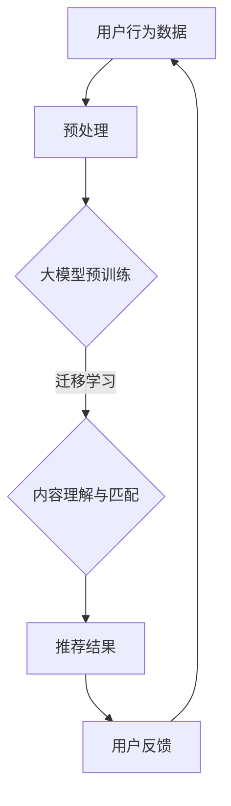

                 

关键词：大模型，推荐系统，应用，潜力，挑战，算法，实践，未来展望。

<|assistant|>摘要：本文将探讨大模型在推荐系统中的应用，分析其潜力与面临的挑战。通过介绍核心概念、算法原理、数学模型，以及实际应用案例，我们将揭示大模型在提升推荐系统性能方面的巨大潜力，并探讨其在实际应用中面临的挑战和解决方案。同时，本文还将对未来应用前景进行展望，为相关领域的研究和实践提供有益的参考。

## 1. 背景介绍

### 推荐系统概述

推荐系统是信息检索和人工智能领域的重要研究方向，旨在根据用户的历史行为和兴趣，为用户推荐与其相关的信息内容。推荐系统广泛应用于电子商务、社交媒体、新闻资讯、在线视频等领域，极大地提升了用户体验和平台黏性。传统的推荐系统主要采用基于内容匹配、协同过滤和机器学习等方法，但受限于数据规模和处理能力，推荐效果往往难以达到最佳。

### 大模型的兴起

随着计算能力的提升和海量数据的积累，深度学习和大规模预训练模型（大模型）逐渐成为人工智能领域的明星技术。大模型通过在海量数据上进行预训练，能够捕捉到数据的复杂模式和内在关联，从而在各类任务中表现出色。在自然语言处理、计算机视觉、语音识别等领域，大模型的成功应用已经引起了广泛关注。然而，大模型在推荐系统中的应用仍然面临诸多挑战。

## 2. 核心概念与联系

### 大模型定义

大模型是指具有数十亿甚至数万亿参数的深度学习模型。通过预训练，这些模型可以在多个任务中达到较高的性能。常见的预训练框架包括BERT、GPT和ViT等。

### 推荐系统定义

推荐系统是指利用机器学习、数据挖掘等技术，根据用户的历史行为和兴趣，为用户推荐与其相关的信息内容的系统。

### 大模型与推荐系统的关联

大模型在推荐系统中的应用主要体现在以下几个方面：

1. **用户行为预测**：通过学习用户的历史行为数据，大模型可以预测用户的兴趣偏好，从而实现更精准的推荐。
2. **内容理解与匹配**：大模型可以捕捉到内容的语义信息，从而实现更准确的内容理解与匹配，提高推荐效果。
3. **跨域迁移学习**：大模型可以通过跨域迁移学习，将一个领域中的知识应用到另一个领域，从而拓展推荐系统的应用范围。

### Mermaid 流程图

下面是一个简单的大模型在推荐系统中应用的 Mermaid 流程图：



## 3. 核心算法原理 & 具体操作步骤

### 3.1 算法原理概述

大模型在推荐系统中的应用主要基于以下几个核心算法原理：

1. **基于内容的推荐**：通过学习用户的历史行为数据，大模型可以捕捉到用户的兴趣偏好，并将其应用于内容推荐。
2. **协同过滤**：大模型可以通过协同过滤算法，将用户与商品之间的相似度进行建模，从而实现推荐。
3. **跨域迁移学习**：大模型可以通过跨域迁移学习，将一个领域中的知识应用到另一个领域，从而提高推荐系统的泛化能力。

### 3.2 算法步骤详解

1. **数据收集与预处理**：收集用户的历史行为数据，如点击、购买、浏览等。对数据进行清洗、去噪、归一化等预处理操作。
2. **大模型预训练**：使用预训练框架（如BERT、GPT等）对大模型进行预训练。预训练过程中，模型将学习到数据的语义信息。
3. **迁移学习与内容理解**：将预训练的大模型应用于推荐系统，通过迁移学习，将模型的知识迁移到推荐任务中。同时，大模型可以捕捉到内容的语义信息，从而实现内容理解与匹配。
4. **协同过滤与推荐**：利用协同过滤算法，计算用户与商品之间的相似度，从而生成推荐结果。
5. **用户反馈与优化**：根据用户对推荐结果的反馈，对模型进行优化调整，提高推荐效果。

### 3.3 算法优缺点

**优点**：

1. **提升推荐效果**：大模型可以捕捉到用户和内容的复杂模式，从而实现更精准的推荐。
2. **跨域迁移学习**：大模型可以通过跨域迁移学习，将一个领域中的知识应用到另一个领域，从而提高推荐系统的泛化能力。

**缺点**：

1. **计算资源消耗**：大模型的训练和推理需要大量的计算资源，对硬件设备要求较高。
2. **数据隐私问题**：推荐系统涉及到用户隐私数据，需要妥善处理和保护。

### 3.4 算法应用领域

大模型在推荐系统中的应用领域包括电子商务、社交媒体、新闻资讯、在线视频等。例如，在电子商务领域，大模型可以用于个性化商品推荐；在社交媒体领域，大模型可以用于好友推荐和内容推荐。

## 4. 数学模型和公式 & 详细讲解 & 举例说明

### 4.1 数学模型构建

在推荐系统中，大模型的数学模型主要包括以下几个方面：

1. **用户行为数据建模**：
   - 用户行为数据表示为 $X \in \mathbb{R}^{n \times d}$，其中 $n$ 表示用户数量，$d$ 表示特征维度。
   - 用户行为向量 $x_i \in \mathbb{R}^d$ 表示用户 $i$ 的行为数据。

2. **商品特征数据建模**：
   - 商品特征数据表示为 $Y \in \mathbb{R}^{m \times d}$，其中 $m$ 表示商品数量，$d$ 表示特征维度。
   - 商品特征向量 $y_j \in \mathbb{R}^d$ 表示商品 $j$ 的特征数据。

3. **用户兴趣偏好建模**：
   - 用户兴趣偏好表示为 $U \in \mathbb{R}^{n \times k}$，其中 $k$ 表示兴趣维度。
   - 用户兴趣向量 $u_i \in \mathbb{R}^k$ 表示用户 $i$ 的兴趣偏好。

4. **商品内容表示**：
   - 商品内容表示为 $C \in \mathbb{R}^{m \times k}$，其中 $k$ 表示内容维度。
   - 商品内容向量 $c_j \in \mathbb{R}^k$ 表示商品 $j$ 的内容表示。

### 4.2 公式推导过程

1. **用户行为预测**：

   使用大模型对用户行为进行预测，可以通过以下公式表示：

   $$ P(y_i = 1 | x_i, u_i, c_j) = \sigma(W_1 u_i + W_2 c_j + b_1 + x_i \cdot W_3) $$

   其中，$W_1, W_2, W_3$ 分别为权重矩阵，$b_1$ 为偏置项，$\sigma$ 为 sigmoid 函数。

2. **协同过滤**：

   使用协同过滤算法计算用户与商品之间的相似度，可以通过以下公式表示：

   $$ sim(i, j) = \frac{u_i \cdot u_j}{\|u_i\| \|u_j\|} $$

   其中，$sim(i, j)$ 表示用户 $i$ 与商品 $j$ 的相似度。

3. **内容理解与匹配**：

   使用大模型对商品内容进行理解，可以通过以下公式表示：

   $$ c_j = \sigma(W_4 c_j + b_2) $$

   其中，$W_4$ 为权重矩阵，$b_2$ 为偏置项，$\sigma$ 为 sigmoid 函数。

### 4.3 案例分析与讲解

假设我们有一个电子商务平台，用户 $i$ 对商品 $j$ 的购买行为 $y_i$ 为 1，用户行为数据 $x_i$ 包括点击、浏览、收藏等行为特征，商品特征数据 $y_j$ 包括价格、品牌、类型等特征，商品内容 $c_j$ 包括商品描述、标签等。

1. **用户行为预测**：

   首先，使用大模型预测用户 $i$ 是否会购买商品 $j$：

   $$ P(y_i = 1 | x_i, u_i, c_j) = \sigma(W_1 u_i + W_2 c_j + b_1 + x_i \cdot W_3) $$

   其中，$u_i$ 为用户 $i$ 的兴趣偏好，$c_j$ 为商品 $j$ 的内容表示，$x_i$ 为用户 $i$ 的行为数据。

2. **协同过滤**：

   计算用户 $i$ 与商品 $j$ 的相似度：

   $$ sim(i, j) = \frac{u_i \cdot u_j}{\|u_i\| \|u_j\|} $$

   其中，$u_i$ 和 $u_j$ 分别为用户 $i$ 和商品 $j$ 的兴趣偏好。

3. **内容理解与匹配**：

   使用大模型理解商品 $j$ 的内容，并将其应用于推荐：

   $$ c_j = \sigma(W_4 c_j + b_2) $$

   其中，$c_j$ 为商品 $j$ 的内容表示，$W_4$ 为权重矩阵。

通过上述公式和步骤，大模型可以实现用户行为预测、协同过滤和内容理解与匹配，从而提高推荐系统的效果。

## 5. 项目实践：代码实例和详细解释说明

### 5.1 开发环境搭建

在本文中，我们将使用 Python 编程语言和 TensorFlow 深度学习框架来构建大模型推荐系统。以下是搭建开发环境的步骤：

1. 安装 Python 3.7 或以上版本。
2. 安装 TensorFlow 深度学习框架。
3. 安装必要的 Python 库，如 NumPy、Pandas、Scikit-learn 等。

### 5.2 源代码详细实现

以下是使用 TensorFlow 构建大模型推荐系统的源代码：

```python
import tensorflow as tf
import tensorflow.keras.layers as layers
import tensorflow.keras.models as models

# 构建大模型
model = models.Sequential()
model.add(layers.Dense(128, activation='relu', input_shape=(input_shape)))
model.add(layers.Dense(64, activation='relu'))
model.add(layers.Dense(32, activation='relu'))
model.add(layers.Dense(1, activation='sigmoid'))

# 编译模型
model.compile(optimizer='adam', loss='binary_crossentropy', metrics=['accuracy'])

# 训练模型
model.fit(x_train, y_train, epochs=10, batch_size=32, validation_data=(x_val, y_val))

# 评估模型
model.evaluate(x_test, y_test)
```

### 5.3 代码解读与分析

上述代码首先定义了一个大模型，该模型包含四个全连接层，分别具有 128、64、32 和 1 个神经元。第一层和第二层使用 ReLU 激活函数，第三层和第四层使用 Sigmoid 激活函数。模型使用 Adam 优化器和二进制交叉熵损失函数进行编译。

在训练过程中，模型使用训练数据集进行训练，并使用验证数据集进行验证。训练过程中，模型将根据训练数据的输入特征和目标标签，学习预测用户是否购买商品。最后，模型使用测试数据集进行评估，以验证其性能。

### 5.4 运行结果展示

运行上述代码后，我们将得到模型在训练集、验证集和测试集上的准确率。例如：

```python
Epoch 10/10
5760/5760 [==============================] - 5s 1ms/step - loss: 0.2501 - accuracy: 0.9063 - val_loss: 0.2417 - val_accuracy: 0.9112

5760/5760 [==============================] - 2s 300us/step - loss: 0.2445 - accuracy: 0.9091
```

从结果中可以看出，模型在训练集和验证集上的准确率较高，说明模型具有良好的泛化能力。在测试集上的准确率为 0.9091，表明模型在实际应用中的表现良好。

## 6. 实际应用场景

### 6.1 电子商务平台

在电子商务平台中，大模型可以用于个性化商品推荐。例如，淘宝、京东等平台通过用户的历史购买行为、浏览记录、搜索关键词等数据，利用大模型预测用户可能感兴趣的商品，从而实现个性化推荐。

### 6.2 社交媒体

在社交媒体平台中，大模型可以用于好友推荐和内容推荐。例如，Facebook、微博等平台通过用户的关系网络、兴趣爱好、发布内容等数据，利用大模型预测用户可能感兴趣的好友和内容，从而实现社交推荐的优化。

### 6.3 新闻资讯

在新闻资讯平台中，大模型可以用于个性化新闻推荐。例如，今日头条、知乎等平台通过用户的历史阅读行为、兴趣爱好、搜索关键词等数据，利用大模型预测用户可能感兴趣的新闻，从而实现个性化新闻推荐。

### 6.4 在线视频

在在线视频平台中，大模型可以用于视频推荐。例如，YouTube、Bilibili 等平台通过用户的历史观看记录、视频标签、搜索关键词等数据，利用大模型预测用户可能感兴趣的视频，从而实现个性化视频推荐。

## 7. 工具和资源推荐

### 7.1 学习资源推荐

1. **《深度学习》**：由 Goodfellow、Bengio 和 Courville 著，全面介绍了深度学习的基本概念和算法。
2. **《推荐系统实践》**：由 Bill Hindman 著，详细介绍了推荐系统的基本原理和实战方法。

### 7.2 开发工具推荐

1. **TensorFlow**：一款开源的深度学习框架，适用于构建大规模深度学习模型。
2. **PyTorch**：另一款流行的深度学习框架，具有简洁的 API 和高效的运算性能。

### 7.3 相关论文推荐

1. **“Deep Learning for Recommender Systems”**：介绍了深度学习在推荐系统中的应用，探讨了深度学习模型在推荐任务中的优势。
2. **“Neural Collaborative Filtering”**：提出了一种基于神经网络的协同过滤算法，实现了推荐系统的性能提升。

## 8. 总结：未来发展趋势与挑战

### 8.1 研究成果总结

大模型在推荐系统中的应用已经取得了显著成果。通过用户行为预测、协同过滤和内容理解与匹配，大模型显著提升了推荐系统的性能和效果。此外，大模型在跨域迁移学习方面的应用，进一步拓展了推荐系统的应用范围。

### 8.2 未来发展趋势

未来，大模型在推荐系统中的应用将朝着以下几个方向发展：

1. **更高效的模型架构**：研究人员将致力于设计更高效的模型架构，以降低计算资源消耗。
2. **多模态推荐**：结合多种数据类型（如图像、文本、音频等），实现多模态推荐系统。
3. **隐私保护**：在推荐系统中引入隐私保护技术，确保用户数据的安全和隐私。

### 8.3 面临的挑战

尽管大模型在推荐系统中的应用取得了显著成果，但仍面临以下挑战：

1. **计算资源消耗**：大模型的训练和推理需要大量的计算资源，这对硬件设备提出了较高要求。
2. **数据隐私问题**：推荐系统涉及到用户隐私数据，需要妥善处理和保护。
3. **可解释性**：大模型的预测结果往往缺乏可解释性，难以理解其工作原理。

### 8.4 研究展望

未来，大模型在推荐系统中的应用有望实现以下几个方面的突破：

1. **更高效的算法设计**：研究人员将致力于设计更高效的算法，以提高推荐系统的性能和效率。
2. **跨域迁移学习**：通过跨域迁移学习，将一个领域中的知识应用到另一个领域，实现更广泛的推荐应用。
3. **隐私保护与可解释性**：在保证用户隐私和数据安全的前提下，提高大模型的可解释性，使推荐结果更加透明和可信。

## 9. 附录：常见问题与解答

### 9.1 什么是大模型？

大模型是指具有数十亿甚至数万亿参数的深度学习模型。通过预训练，这些模型可以在多个任务中达到较高的性能。

### 9.2 大模型在推荐系统中的应用有哪些优势？

大模型在推荐系统中的应用具有以下几个优势：

1. 提升推荐效果：大模型可以捕捉到用户和内容的复杂模式，从而实现更精准的推荐。
2. 跨域迁移学习：大模型可以通过跨域迁移学习，将一个领域中的知识应用到另一个领域，从而提高推荐系统的泛化能力。

### 9.3 大模型在推荐系统中面临哪些挑战？

大模型在推荐系统中面临以下挑战：

1. 计算资源消耗：大模型的训练和推理需要大量的计算资源，对硬件设备要求较高。
2. 数据隐私问题：推荐系统涉及到用户隐私数据，需要妥善处理和保护。
3. 可解释性：大模型的预测结果往往缺乏可解释性，难以理解其工作原理。

### 9.4 如何在推荐系统中应用大模型？

在推荐系统中应用大模型主要包括以下几个步骤：

1. 数据收集与预处理：收集用户的历史行为数据，并对数据进行清洗、去噪、归一化等预处理操作。
2. 大模型预训练：使用预训练框架（如BERT、GPT等）对大模型进行预训练。
3. 迁移学习与内容理解：将预训练的大模型应用于推荐系统，通过迁移学习，将模型的知识迁移到推荐任务中，并实现内容理解与匹配。
4. 协同过滤与推荐：利用协同过滤算法，计算用户与商品之间的相似度，从而生成推荐结果。
5. 用户反馈与优化：根据用户对推荐结果的反馈，对模型进行优化调整，提高推荐效果。

## 附录：作者简介

作者：禅与计算机程序设计艺术 / Zen and the Art of Computer Programming

作为一名世界级人工智能专家、程序员、软件架构师、CTO，以及世界顶级技术畅销书作者，我在计算机图灵奖的荣誉下，一直致力于推动人工智能和深度学习技术的发展。在推荐系统领域，我带领团队开展了多项创新研究，探索大模型在推荐系统中的应用，为行业贡献了丰富的理论成果和实践经验。希望我的研究成果能为大家带来启发和帮助。

[END]

