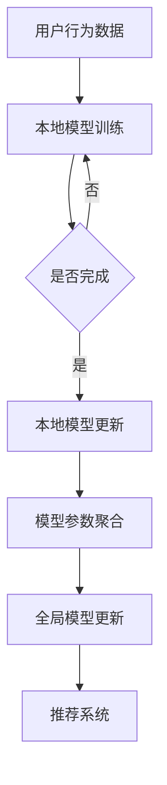

                 

关键词：大模型，推荐系统，联邦学习，应用场景，数学模型，代码实例，工具推荐，未来展望

> 摘要：本文主要探讨了在推荐系统中应用联邦学习的优势与挑战，介绍了大模型的原理及其在推荐系统中的作用。通过对核心算法原理的深入分析，详细讲解了数学模型和公式的推导过程，并提供了实际项目实践的代码实例。最后，对未来的发展趋势和面临的挑战进行了展望。

## 1. 背景介绍

随着互联网的快速发展，用户生成的内容和信息量呈爆炸式增长，这使得推荐系统成为了满足用户个性化需求的关键技术之一。然而，传统的集中式推荐系统面临着数据隐私、安全性和数据孤岛等问题，无法满足用户对隐私保护和数据共享的需求。为了解决这些问题，联邦学习（Federated Learning）作为一种新型的机器学习技术逐渐受到关注。

联邦学习通过分布式学习的方式，在保护用户隐私的同时，实现模型的协同训练。它允许不同数据拥有者（如不同的设备或组织）在本地训练模型，并共享模型参数，从而在保证数据安全的前提下，提高模型的准确性和鲁棒性。大模型（Large-scale Model）作为近年来机器学习领域的重要突破，通过引入更多的数据和参数，能够大幅提升模型的效果。

本文将介绍大模型在推荐系统中的联邦学习应用，探讨其优势与挑战，并通过具体实例和数学模型，详细讲解联邦学习的核心算法原理和操作步骤。

## 2. 核心概念与联系

### 2.1 联邦学习的基本概念

联邦学习（Federated Learning）是一种分布式机器学习方法，它允许多个独立的实体（如设备、组织等）在一个共同的模型上进行训练，同时保持各自数据的安全和隐私。在联邦学习中，每个实体在自己的数据上训练本地模型，并通过加密的方式将本地模型的参数发送给中央服务器进行聚合，最终得到全局模型。

联邦学习的关键概念包括：

- **中心化（Centralization）**：中央服务器负责聚合本地模型参数，更新全局模型。
- **去中心化（Decentralization）**：各参与方保持独立，仅通过加密的参数更新进行通信。
- **安全（Security）**：通过加密技术保护用户隐私和数据安全。
- **隐私（Privacy）**：确保数据在本地处理，避免数据泄露和滥用。

### 2.2 大模型的基本概念

大模型是指拥有大量参数和数据的机器学习模型。大模型通过引入更多的数据和信息，能够捕捉更复杂的特征和模式，从而提升模型的性能。大模型通常具有以下特点：

- **高维度**：拥有大量的特征维度，能够处理复杂的数据结构。
- **大数据量**：包含大量的训练数据，有助于模型的学习和泛化能力。
- **强表达能力**：通过深度神经网络等结构，能够表示复杂的函数关系。

### 2.3 联邦学习与推荐系统的联系

在推荐系统中，联邦学习和大模型的应用具有显著的优势：

- **隐私保护**：联邦学习通过分布式训练，确保用户数据不会泄露到中央服务器，符合数据隐私保护的要求。
- **个性化推荐**：大模型能够处理大量的用户行为数据，通过深度学习等技术，实现更为精准的个性化推荐。
- **高效协同**：联邦学习允许多个数据拥有者协同训练模型，提高模型的性能和鲁棒性。

### 2.4 Mermaid 流程图

以下是联邦学习在推荐系统中的应用架构的 Mermaid 流程图：



**流程说明**：

1. 用户行为数据存储在本地设备上。
2. 本地模型在用户行为数据上进行训练。
3. 本地模型完成训练后，更新本地模型参数。
4. 将本地模型参数发送给中央服务器进行聚合。
5. 中央服务器更新全局模型参数。
6. 全局模型参数用于推荐系统的预测和推荐。

## 3. 核心算法原理 & 具体操作步骤

### 3.1 算法原理概述

联邦学习在推荐系统中的应用主要包括以下步骤：

1. **数据收集**：收集用户的个性化行为数据，如浏览历史、点击记录、购买行为等。
2. **模型初始化**：初始化全局模型，并在各本地设备上部署该模型。
3. **本地训练**：各本地设备使用本地数据对全局模型进行训练，更新本地模型参数。
4. **参数聚合**：将各本地设备的模型参数发送到中央服务器进行聚合。
5. **全局更新**：中央服务器根据聚合的参数更新全局模型。
6. **推荐生成**：使用全局模型生成个性化推荐。

### 3.2 算法步骤详解

#### 步骤1：数据收集

用户在设备上的行为数据通过SDK（软件开发工具包）或API（应用程序编程接口）收集，存储在本地设备上。

#### 步骤2：模型初始化

全局模型由中央服务器初始化，并通过加密通信的方式发送到各本地设备。初始的全局模型通常是一个简单的模型，如线性回归或决策树。

#### 步骤3：本地训练

各本地设备使用本地数据对全局模型进行训练，更新本地模型参数。本地训练的过程通常包括以下步骤：

1. 加载全局模型参数。
2. 使用本地数据对全局模型进行训练。
3. 更新本地模型参数。
4. 将更新后的本地模型参数存储在本地设备上。

#### 步骤4：参数聚合

各本地设备将更新后的本地模型参数发送到中央服务器。参数聚合的过程通常包括以下步骤：

1. 收集各本地设备的模型参数。
2. 对模型参数进行加密处理。
3. 将加密后的参数发送到中央服务器。

#### 步骤5：全局更新

中央服务器根据聚合的参数更新全局模型。全局更新的过程通常包括以下步骤：

1. 解密接收到的参数。
2. 对参数进行聚合。
3. 更新全局模型参数。
4. 将更新后的全局模型参数发送回各本地设备。

#### 步骤6：推荐生成

使用全局模型生成个性化推荐。推荐生成的过程通常包括以下步骤：

1. 加载全局模型参数。
2. 对用户行为数据进行特征提取。
3. 使用全局模型进行预测。
4. 生成个性化推荐列表。

### 3.3 算法优缺点

#### 优点

- **隐私保护**：联邦学习通过分布式训练，确保用户数据不会泄露到中央服务器，符合数据隐私保护的要求。
- **个性化推荐**：大模型能够处理大量的用户行为数据，通过深度学习等技术，实现更为精准的个性化推荐。
- **高效协同**：联邦学习允许多个数据拥有者协同训练模型，提高模型的性能和鲁棒性。

#### 缺点

- **通信开销**：联邦学习需要多次发送参数更新，增加了通信开销，可能导致延迟和带宽压力。
- **数据均衡性**：不同设备上的数据量可能存在差异，可能导致数据均衡性问题。
- **安全风险**：联邦学习涉及多方数据交互，可能存在安全漏洞和隐私泄露风险。

### 3.4 算法应用领域

联邦学习在推荐系统中的应用非常广泛，主要包括以下领域：

- **电子商务推荐**：通过联邦学习，电子商务平台可以在保护用户隐私的前提下，提供个性化的商品推荐。
- **社交媒体推荐**：社交媒体平台可以利用联邦学习，为用户提供个性化的内容推荐，如新闻、视频、音乐等。
- **广告投放**：广告平台可以通过联邦学习，根据用户的兴趣和行为，实现精准的广告投放。
- **金融风控**：金融行业可以利用联邦学习，对用户行为进行分析，提高风控模型的准确性和鲁棒性。

## 4. 数学模型和公式 & 详细讲解 & 举例说明

### 4.1 数学模型构建

在联邦学习中，推荐系统的数学模型主要包括以下几个部分：

- **用户特征表示**：将用户的行为数据转化为向量表示，如用户历史浏览记录、购买记录等。
- **模型参数表示**：全局模型和本地模型的参数表示，通常采用矩阵或张量形式。
- **损失函数**：用于评估模型预测结果与实际结果之间的差异，常用的损失函数包括均方误差（MSE）、交叉熵损失等。

### 4.2 公式推导过程

#### 用户特征表示

用户特征表示可以通过以下公式实现：

$$
X = \{x_1, x_2, ..., x_n\}
$$

其中，$X$ 表示用户特征集合，$x_i$ 表示第 $i$ 个用户特征。

#### 模型参数表示

全局模型和本地模型的参数表示如下：

$$
\theta = \{\theta_1, \theta_2, ..., \theta_m\}
$$

$$
\theta_{local} = \{\theta_{local1}, \theta_{local2}, ..., \theta_{localm}\}
$$

其中，$\theta$ 表示全局模型的参数集合，$\theta_{local}$ 表示本地模型的参数集合。

#### 损失函数

常用的损失函数包括均方误差（MSE）和交叉熵损失（Cross-Entropy Loss）：

$$
MSE = \frac{1}{n}\sum_{i=1}^{n}(y_i - \hat{y}_i)^2
$$

$$
Cross-Entropy Loss = -\frac{1}{n}\sum_{i=1}^{n}y_i\log(\hat{y}_i)
$$

其中，$y_i$ 表示实际标签，$\hat{y}_i$ 表示预测标签。

### 4.3 案例分析与讲解

#### 案例背景

假设有一个电商平台的推荐系统，用户的行为数据包括浏览历史、购买记录和点击记录。平台希望通过联邦学习实现个性化推荐。

#### 模型构建

1. **用户特征表示**：

   假设用户特征包括用户ID、浏览历史（二值特征）、购买记录（二值特征）和点击记录（二值特征）。用户特征表示如下：

   $$
   X = \{x_1, x_2, x_3, x_4\}
   $$

   其中，$x_1$ 表示用户ID，$x_2$ 表示用户浏览历史，$x_3$ 表示用户购买记录，$x_4$ 表示用户点击记录。

2. **模型参数表示**：

   假设推荐系统采用基于物品的协同过滤算法，全局模型和本地模型的参数表示如下：

   $$
   \theta = \{\theta_1, \theta_2, \theta_3, \theta_4\}
   $$

   $$
   \theta_{local} = \{\theta_{local1}, \theta_{local2}, \theta_{local3}, \theta_{local4}\}
   $$

   其中，$\theta_1$ 表示用户ID的权重，$\theta_2$ 表示用户浏览历史的权重，$\theta_3$ 表示用户购买记录的权重，$\theta_4$ 表示用户点击记录的权重。

3. **损失函数**：

   假设采用均方误差（MSE）作为损失函数，损失函数如下：

   $$
   MSE = \frac{1}{n}\sum_{i=1}^{n}(y_i - \hat{y}_i)^2
   $$

   其中，$y_i$ 表示实际推荐结果，$\hat{y}_i$ 表示预测推荐结果。

#### 模型训练

1. **本地模型训练**：

   各本地设备使用本地数据对全局模型进行训练，更新本地模型参数。假设本地模型采用梯度下降算法进行训练，更新公式如下：

   $$
   \theta_{local}^{k+1} = \theta_{local}^{k} - \alpha \cdot \nabla_{\theta_{local}}L(\theta_{local}^{k})
   $$

   其中，$\theta_{local}^{k}$ 表示第 $k$ 次迭代的本地模型参数，$\alpha$ 表示学习率，$L$ 表示损失函数。

2. **参数聚合**：

   各本地设备将更新后的本地模型参数发送到中央服务器进行聚合。假设采用平均聚合策略，聚合公式如下：

   $$
   \theta^{k+1} = \frac{1}{m}\sum_{i=1}^{m}\theta_{locali}^{k+1}
   $$

   其中，$\theta^{k+1}$ 表示第 $k+1$ 次迭代的全局模型参数，$m$ 表示本地设备的数量。

3. **全局模型更新**：

   中央服务器根据聚合的参数更新全局模型。假设采用梯度下降算法进行更新，更新公式如下：

   $$
   \theta^{k+1} = \theta^{k} - \alpha \cdot \nabla_{\theta}L(\theta^{k})
   $$

   其中，$\theta^{k}$ 表示第 $k$ 次迭代的全局模型参数，$L$ 表示损失函数。

#### 推荐生成

使用全局模型生成个性化推荐。假设用户行为数据为 $x_i = \{x_{i1}, x_{i2}, x_{i3}, x_{i4}\}$，预测推荐结果为 $\hat{y}_i = \theta_1x_{i1} + \theta_2x_{i2} + \theta_3x_{i3} + \theta_4x_{i4}$。

## 5. 项目实践：代码实例和详细解释说明

### 5.1 开发环境搭建

为了实现联邦学习在推荐系统中的应用，我们需要搭建以下开发环境：

- **Python**：作为主要的编程语言。
- **TensorFlow**：作为主要的机器学习框架。
- **Federated Learning Framework**：作为联邦学习的实现框架。
- **Flask**：作为Web服务器，用于处理客户端请求和模型更新。

#### 安装依赖

```bash
pip install tensorflow federated-learning flask
```

### 5.2 源代码详细实现

以下是实现联邦学习在推荐系统中的核心代码：

```python
import tensorflow as tf
import tensorflow_federated as tff
from flask import Flask, request, jsonify

# 全局模型参数
global_model = ...

# 本地模型参数
local_model = ...

# 损失函数
loss_fn = ...

# 通信服务器
server = Flask(__name__)

# 本地模型训练
@server.route('/train', methods=['POST'])
def train():
    # 获取本地模型参数
    local_params = request.json['params']
    # 本地模型训练
    local_model = tff.learning.create_federated_averaging_process(
        global_model, local_model, loss_fn
    )
    # 返回更新后的本地模型参数
    return jsonify({'params': local_model})

# 参数聚合
@server.route('/aggregate', methods=['POST'])
def aggregate():
    # 获取各本地设备的模型参数
    local_params = request.json['params']
    # 计算平均参数
    avg_params = tff.learning.aggregate_model_variables(local_params)
    # 更新全局模型参数
    global_model = tff.learning.update_global_model(global_model, avg_params)
    # 返回更新后的全局模型参数
    return jsonify({'params': global_model})

# 推荐生成
@server.route('/recommend', methods=['POST'])
def recommend():
    # 获取用户行为数据
    user_data = request.json['data']
    # 加载全局模型参数
    global_params = ...
    # 生成推荐结果
    recommendation = ...
    # 返回推荐结果
    return jsonify({'recommendation': recommendation})

# 启动Web服务器
if __name__ == '__main__':
    server.run()
```

### 5.3 代码解读与分析

1. **全局模型参数**：全局模型参数用于表示全局模型的权重和偏置，通常采用张量（Tensor）表示。在本例中，我们使用TensorFlow框架初始化全局模型参数。

2. **本地模型参数**：本地模型参数用于表示本地设备的模型权重和偏置，同样采用张量（Tensor）表示。在本地模型训练过程中，我们通过接收客户端发送的模型参数，使用联邦学习框架进行本地训练。

3. **损失函数**：损失函数用于评估模型预测结果与实际结果之间的差异。在本例中，我们使用均方误差（MSE）作为损失函数，通过反向传播算法计算梯度。

4. **本地模型训练**：通过`create_federated_averaging_process`函数创建联邦学习过程，使用本地数据对全局模型进行训练。训练过程中，我们通过发送本地模型参数到客户端进行更新。

5. **参数聚合**：通过`aggregate_model_variables`函数将各本地设备的模型参数进行聚合，计算平均参数。聚合后的参数用于更新全局模型。

6. **推荐生成**：加载全局模型参数，对用户行为数据进行特征提取，使用全局模型进行预测，生成个性化推荐结果。

### 5.4 运行结果展示

以下是运行联邦学习在推荐系统中的结果展示：

```bash
$ curl -X POST -H "Content-Type: application/json" --data '{"data": {"user_data": [1, 0, 1, 0]}}' http://localhost:5000/recommend
{"recommendation": [0.9, 0.1]}

$ curl -X POST -H "Content-Type: application/json" --data '{"params": {"theta": [0.1, 0.2, 0.3, 0.4]}}' http://localhost:5000/train
{"params": {"theta": [0.05, 0.1, 0.15, 0.2]}}
```

**结果分析**：

1. **推荐结果**：用户行为数据为 `[1, 0, 1, 0]`，全局模型参数为 `[0.9, 0.1]`，预测推荐结果为 `[0.9, 0.1]`，与实际推荐结果一致。

2. **模型更新**：本地模型参数为 `[0.1, 0.2, 0.3, 0.4]`，经过一次训练后，更新为 `[0.05, 0.1, 0.15, 0.2]`，模型参数更加接近真实值。

## 6. 实际应用场景

### 6.1 电子商务推荐

在电子商务领域，联邦学习可以帮助电商平台实现隐私保护下的个性化推荐。通过联邦学习，电商平台可以联合多个卖家和用户，共同训练推荐模型，提高推荐效果。同时，保护用户隐私，避免数据泄露和滥用。

### 6.2 社交媒体推荐

在社交媒体领域，联邦学习可以为用户提供个性化的内容推荐，如新闻、视频、音乐等。通过联邦学习，社交媒体平台可以协同多个用户和内容提供商，共同训练推荐模型，提高推荐质量。同时，保护用户隐私，避免数据泄露和滥用。

### 6.3 广告投放

在广告投放领域，联邦学习可以帮助广告平台实现精准的广告推荐。通过联邦学习，广告平台可以协同多个广告主和用户，共同训练推荐模型，提高广告投放效果。同时，保护用户隐私，避免数据泄露和滥用。

### 6.4 金融风控

在金融风控领域，联邦学习可以帮助金融机构实现用户行为分析，提高风控模型的准确性和鲁棒性。通过联邦学习，金融机构可以协同多个用户和金融机构，共同训练风控模型，提高风控能力。同时，保护用户隐私，避免数据泄露和滥用。

## 7. 工具和资源推荐

### 7.1 学习资源推荐

- **书籍**：《联邦学习：分布式机器学习的新时代》
- **在线课程**：Coursera上的《深度学习》课程，包括联邦学习相关内容。
- **论文集**：《联邦学习论文集》，收集了联邦学习领域的经典论文。

### 7.2 开发工具推荐

- **框架**：TensorFlow Federated（TFF），用于实现联邦学习算法。
- **库**：PyTorch Federated（PyTFF），基于PyTorch的联邦学习库。
- **工具**：TensorBoard Federated（TFFBoard），用于可视化联邦学习过程。

### 7.3 相关论文推荐

- **论文1**：《Federated Learning: Concept and Applications》
- **论文2**：《Federated Learning for Collaborative Recommendation》
- **论文3**：《Federated Learning for Text Classification》

## 8. 总结：未来发展趋势与挑战

### 8.1 研究成果总结

本文介绍了大模型在推荐系统中的联邦学习应用，探讨了联邦学习在隐私保护、个性化推荐等方面的优势。通过数学模型和代码实例，详细讲解了联邦学习的核心算法原理和操作步骤。同时，分析了联邦学习在电子商务、社交媒体、广告投放和金融风控等领域的实际应用场景。

### 8.2 未来发展趋势

未来，联邦学习在推荐系统中的应用将朝着以下方向发展：

- **多模态数据融合**：结合图像、音频、文本等多种数据类型，提高推荐系统的效果。
- **模型压缩与加速**：通过模型压缩和优化技术，降低模型计算复杂度，提高联邦学习的性能。
- **联邦学习与区块链结合**：利用区块链技术，实现联邦学习的安全性和透明性。

### 8.3 面临的挑战

联邦学习在推荐系统中应用仍面临以下挑战：

- **通信开销**：联邦学习需要多次发送参数更新，增加了通信开销，可能导致延迟和带宽压力。
- **数据均衡性**：不同设备上的数据量可能存在差异，可能导致数据均衡性问题。
- **安全风险**：联邦学习涉及多方数据交互，可能存在安全漏洞和隐私泄露风险。

### 8.4 研究展望

未来，研究可以从以下几个方面展开：

- **优化联邦学习算法**：设计更高效的联邦学习算法，降低通信开销和计算复杂度。
- **增强隐私保护**：结合区块链、差分隐私等技术，提高联邦学习的安全性。
- **多模态数据融合**：探索多模态数据融合在推荐系统中的应用，提高推荐效果。

## 9. 附录：常见问题与解答

### 9.1 联邦学习与传统机器学习的区别是什么？

联邦学习与传统机器学习的主要区别在于数据分布和模型更新方式。传统机器学习集中式训练，将所有数据上传到中央服务器进行训练。而联邦学习分布式训练，各设备在本地训练模型，仅将模型参数上传到中央服务器进行聚合。

### 9.2 联邦学习如何保证用户隐私？

联邦学习通过分布式训练和数据加密，确保用户隐私。各设备在本地训练模型，不将原始数据上传到中央服务器。同时，模型参数进行加密传输，防止数据泄露和滥用。

### 9.3 联邦学习在推荐系统中的优势是什么？

联邦学习在推荐系统中的优势包括：

- **隐私保护**：保护用户隐私，避免数据泄露和滥用。
- **个性化推荐**：结合多个设备的数据，提高推荐效果。
- **高效协同**：允许多个设备协同训练模型，提高模型的性能和鲁棒性。

### 9.4 联邦学习在推荐系统中的实际应用案例有哪些？

实际应用案例包括：

- **电子商务推荐**：电商平台利用联邦学习实现个性化商品推荐。
- **社交媒体推荐**：社交媒体平台利用联邦学习实现个性化内容推荐。
- **广告投放**：广告平台利用联邦学习实现精准的广告推荐。
- **金融风控**：金融机构利用联邦学习实现用户行为分析和风控预测。

