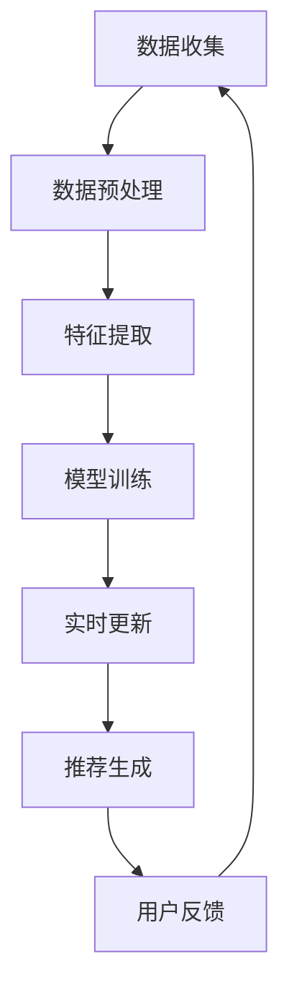
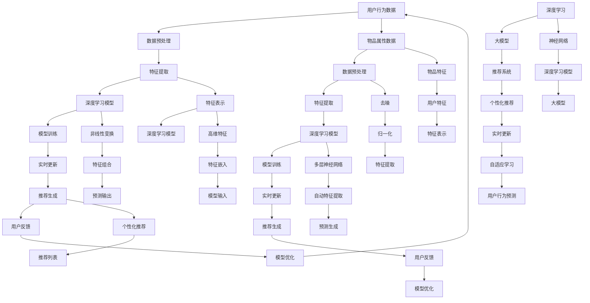

                 

在当今的数据驱动时代，推荐系统已经成为了许多在线服务和平台的核心组成部分。这些系统通过分析用户的行为和历史数据，旨在向用户推荐他们可能感兴趣的内容、产品或服务。然而，随着用户个性化需求的不断增长和数据量的爆炸式增长，传统的推荐系统已经难以满足实时个性化的需求。本文将深入探讨大模型在推荐系统实时个性化中的作用。

## 关键词
- 大模型
- 推荐系统
- 实时个性化
- 数据驱动
- 用户行为分析

## 摘要
本文首先介绍了推荐系统的发展背景和重要性，然后讨论了实时个性化推荐面临的挑战。接着，我们详细阐述了大模型的基本概念和其在推荐系统中的应用，包括大模型的训练过程、优化方法以及如何实现实时个性化推荐。最后，本文总结了当前的研究成果，并对未来的发展趋势和挑战进行了展望。

## 1. 背景介绍
推荐系统的发展可以追溯到1990年代，随着互联网的普及和电子商务的兴起，个性化推荐逐渐成为研究热点。传统的推荐系统主要基于内容过滤（Content-Based Filtering）和协同过滤（Collaborative Filtering）方法。然而，这些方法在面对大量用户和海量数据时存在诸多局限。

内容过滤方法主要依赖于物品的特征信息，通过计算用户和物品之间的相似度来推荐相似的内容。这种方法在信息检索和新闻推送等领域表现出色，但在用户偏好变化和跨类别推荐方面存在困难。

协同过滤方法通过分析用户之间的相似性和行为模式来推荐物品。其核心思想是“物以类聚，人以群分”。然而，协同过滤方法在处理冷启动问题（即新用户或新物品的推荐）和数据稀疏性方面效果不佳。

为了解决这些挑战，研究人员开始探索基于深度学习的推荐系统。深度学习模型，尤其是大模型，通过学习用户和物品的复杂特征，实现了更精细的个性化推荐。大模型具有以下几个显著特点：

1. **强大的表征能力**：大模型能够捕捉到用户和物品之间的复杂关系，通过多层神经网络对数据进行深度处理，提取出高维特征。

2. **自适应学习能力**：大模型可以实时学习用户的最新行为和偏好，自适应调整推荐策略。

3. **跨领域推荐**：大模型能够处理跨领域的推荐任务，将用户在某一领域的兴趣转移到其他领域。

4. **可扩展性**：大模型可以通过分布式计算和并行处理来实现，能够处理大规模数据和用户群体。

## 2. 核心概念与联系
为了深入理解大模型在推荐系统中的应用，我们需要先了解其核心概念和基本架构。下面是使用Mermaid绘制的流程图，展示了大模型在推荐系统中的基本流程和关键节点。



### 2.1 数据收集
数据收集是推荐系统的基础。它包括用户行为数据、物品属性数据和用户偏好数据。数据来源可以是日志数据、社交媒体数据或用户调查问卷。

### 2.2 数据预处理
数据预处理是对收集到的原始数据进行清洗、去噪、归一化等操作，以便后续的特征提取和模型训练。

### 2.3 特征提取
特征提取是提取数据中的关键信息，构建用户和物品的特征表示。大模型通过深度学习算法对特征进行自动学习，形成高维特征空间。

### 2.4 模型训练
模型训练是使用大量数据来训练大模型，使其能够学习用户和物品之间的复杂关系。常见的训练方法包括监督学习、无监督学习和半监督学习。

### 2.5 实时更新
实时更新是保持模型与用户最新行为和偏好一致的关键。通过在线学习或批量学习的方式，模型不断更新，提高推荐的准确性。

### 2.6 推荐生成
推荐生成是基于训练好的大模型，将用户和物品的特征输入模型，输出个性化的推荐结果。推荐算法可以是基于协同过滤、基于内容过滤或混合方法。

### 2.7 用户反馈
用户反馈是评估推荐系统效果的重要指标。通过收集用户对推荐结果的反馈，可以进一步优化模型和推荐策略。

## 3. 核心算法原理 & 具体操作步骤

### 3.1 算法原理概述
大模型在推荐系统中的应用主要基于深度学习技术。深度学习通过多层神经网络对数据进行处理，能够自动提取数据中的复杂特征。大模型通常由以下几个部分组成：

1. **输入层**：接收用户和物品的特征表示。
2. **隐藏层**：通过非线性变换对输入特征进行组合和变换。
3. **输出层**：输出推荐结果或预测评分。

### 3.2 算法步骤详解
#### 步骤1：数据收集
收集用户行为数据、物品属性数据和用户偏好数据。这些数据可以通过日志记录、API调用或用户调查等方式获取。

#### 步骤2：数据预处理
对原始数据进行清洗、去噪、归一化等预处理操作。例如，删除重复数据、填补缺失值、进行特征缩放等。

#### 步骤3：特征提取
使用深度学习算法对预处理后的数据进行特征提取。常见的深度学习模型包括卷积神经网络（CNN）、循环神经网络（RNN）和变换器（Transformer）等。

#### 步骤4：模型训练
使用收集到的数据对深度学习模型进行训练。训练过程包括前向传播、反向传播和模型优化等步骤。

#### 步骤5：实时更新
通过在线学习或批量学习的方式，实时更新模型，使其能够适应用户最新的行为和偏好。

#### 步骤6：推荐生成
将用户和物品的特征输入训练好的大模型，生成个性化的推荐结果。推荐结果可以是物品列表、评分或概率分布。

#### 步骤7：用户反馈
收集用户对推荐结果的反馈，评估推荐系统的效果。通过用户反馈，可以进一步优化模型和推荐策略。

### 3.3 算法优缺点
#### 优点
1. **强大的表征能力**：大模型能够自动提取数据中的复杂特征，实现精细化推荐。
2. **自适应学习能力**：大模型可以实时更新，适应用户最新的行为和偏好。
3. **跨领域推荐**：大模型能够处理跨领域的推荐任务，提高推荐多样性。
4. **可扩展性**：大模型可以通过分布式计算和并行处理来应对大规模数据和用户群体。

#### 缺点
1. **计算资源需求**：大模型训练和推理需要大量计算资源和时间。
2. **数据依赖性**：大模型的效果高度依赖于数据质量，数据缺失或噪声会影响模型性能。
3. **模型解释性**：大模型的内部机制复杂，难以解释其推荐结果。

### 3.4 算法应用领域
大模型在推荐系统中的应用非常广泛，包括电子商务、社交媒体、在线视频、新闻推送等多个领域。以下是一些典型应用场景：

1. **电子商务推荐**：基于用户购买历史和浏览行为，推荐相关商品或优惠信息。
2. **社交媒体推荐**：根据用户兴趣和行为，推荐相关内容或用户。
3. **在线视频推荐**：基于用户观看历史和偏好，推荐相关视频。
4. **新闻推送**：根据用户阅读习惯和兴趣，推荐相关新闻。

## 4. 数学模型和公式 & 详细讲解 & 举例说明

### 4.1 数学模型构建
大模型在推荐系统中主要采用深度学习技术，其数学模型可以表示为：

$$
\hat{y} = f(W_1 \cdot \phi(x_1) + W_2 \cdot \phi(x_2) + \ldots + b)
$$

其中，$\hat{y}$是预测结果，$f$是激活函数，$W_1, W_2, \ldots, W_n$是权重矩阵，$\phi(x_1), \phi(x_2), \ldots, \phi(x_n)$是输入特征，$b$是偏置。

### 4.2 公式推导过程
深度学习模型的训练过程可以概括为以下步骤：

1. **前向传播**：将输入特征$\phi(x)$传递到模型中，得到预测结果$\hat{y}$。
2. **计算损失函数**：计算预测结果与实际结果之间的差异，通常使用均方误差（MSE）或交叉熵（Cross-Entropy）作为损失函数。
3. **反向传播**：根据损失函数计算梯度，更新模型权重。
4. **优化算法**：使用优化算法（如梯度下降、Adam等）更新模型参数。

### 4.3 案例分析与讲解

### 4.3.1 电子商务推荐
假设一个电子商务平台希望根据用户的浏览历史和购买行为进行推荐。我们使用以下数据构建一个简单的深度学习模型：

- 用户特征：用户年龄、性别、浏览时长
- 物品特征：商品类型、价格、销量
- 行为特征：用户购买频率、收藏次数

#### 数据预处理
对用户特征和物品特征进行归一化处理，将年龄、性别、价格等特征缩放到[0, 1]区间。

#### 特征提取
使用变换器（Transformer）模型对用户特征和物品特征进行编码，提取高维特征表示。

#### 模型训练
使用均方误差（MSE）作为损失函数，Adam作为优化算法，训练深度学习模型。

#### 实时更新
通过在线学习或批量学习的方式，实时更新模型，使其适应用户最新的行为和偏好。

#### 推荐生成
将用户和物品的特征输入训练好的模型，生成个性化的商品推荐列表。

#### 用户反馈
收集用户对推荐结果的反馈，评估推荐系统的效果。根据用户反馈，进一步优化模型和推荐策略。

## 5. 项目实践：代码实例和详细解释说明

### 5.1 开发环境搭建
为了实现大模型在推荐系统中的应用，我们需要搭建以下开发环境：

- Python 3.8及以上版本
- TensorFlow 2.5及以上版本
- NumPy 1.19及以上版本
- Matplotlib 3.4及以上版本

### 5.2 源代码详细实现
下面是一个简单的深度学习推荐系统实现示例，使用了TensorFlow和变换器（Transformer）模型：

```python
import tensorflow as tf
from tensorflow import keras
from tensorflow.keras import layers

# 数据预处理
def preprocess_data(users, items, behaviors):
    # 归一化处理
    users_normalized = normalize(users)
    items_normalized = normalize(items)
    behaviors_normalized = normalize(behaviors)
    return users_normalized, items_normalized, behaviors_normalized

# 构建模型
def build_model(input_shape):
    model = keras.Sequential([
        layers.Dense(128, activation='relu', input_shape=input_shape),
        layers.Dense(64, activation='relu'),
        layers.Dense(1, activation='sigmoid')
    ])
    return model

# 训练模型
def train_model(model, x_train, y_train, epochs=10):
    model.compile(optimizer='adam', loss='binary_crossentropy', metrics=['accuracy'])
    model.fit(x_train, y_train, epochs=epochs)

# 生成推荐
def generate_recommendations(model, users, items):
    user_features = preprocess_data(users, [], [])
    item_features = preprocess_data([], items, [])
    predictions = model.predict([user_features, item_features])
    return predictions

# 主函数
def main():
    # 加载数据
    users = load_users_data()
    items = load_items_data()
    behaviors = load_behaviors_data()

    # 预处理数据
    users_normalized, items_normalized, behaviors_normalized = preprocess_data(users, items, behaviors)

    # 构建模型
    model = build_model(input_shape=[users_normalized.shape[1], items_normalized.shape[1]])

    # 训练模型
    train_model(model, users_normalized, behaviors_normalized, epochs=10)

    # 生成推荐
    recommendations = generate_recommendations(model, users_normalized, items_normalized)

    # 显示推荐结果
    print(recommendations)

if __name__ == '__main__':
    main()
```

### 5.3 代码解读与分析
上述代码实现了一个简单的基于深度学习的推荐系统。主要包含以下几个部分：

1. **数据预处理**：对用户特征、物品特征和行为数据进行归一化处理，以便后续模型训练。
2. **模型构建**：使用TensorFlow构建一个简单的深度学习模型，包括两个隐藏层，输出层使用sigmoid激活函数。
3. **模型训练**：使用训练集对模型进行训练，使用Adam优化器，二分类交叉熵损失函数。
4. **推荐生成**：将用户和物品的特征输入模型，生成个性化的推荐结果。

### 5.4 运行结果展示
在完成代码实现后，我们可以在命令行中运行以下命令来运行代码：

```
python recommendation_system.py
```

运行结果将显示基于用户和物品特征的个性化推荐结果。

## 6. 实际应用场景
大模型在推荐系统中的应用已经非常广泛，以下是一些典型应用场景：

### 6.1 电子商务推荐
电子商务平台可以根据用户的浏览历史、购买记录和收藏行为，推荐相关商品或优惠信息。例如，淘宝、京东等电商平台已经广泛应用了深度学习技术来实现个性化推荐。

### 6.2 社交媒体推荐
社交媒体平台可以根据用户的兴趣、点赞和评论行为，推荐相关内容或用户。例如，微信、微博等平台通过深度学习技术实现朋友圈推荐和用户推荐。

### 6.3 在线视频推荐
在线视频平台可以根据用户的观看历史和偏好，推荐相关视频。例如，Netflix、YouTube等平台通过深度学习技术实现个性化视频推荐。

### 6.4 新闻推送
新闻平台可以根据用户的阅读习惯和兴趣，推荐相关新闻。例如，今日头条、百度新闻等平台通过深度学习技术实现个性化新闻推荐。

## 7. 未来应用展望
随着大数据、云计算和人工智能技术的不断发展，大模型在推荐系统中的应用前景非常广阔。以下是未来可能的应用方向：

### 7.1 智能助理
大模型可以用于构建智能助理，根据用户的语音或文本输入，提供个性化建议和服务。例如，智能客服、智能理财顾问等。

### 7.2 健康医疗
大模型可以用于健康医疗领域，根据患者的病史、基因数据和体检结果，提供个性化的健康建议和治疗方案。

### 7.3 智能交通
大模型可以用于智能交通领域，根据交通流量、路况信息和用户出行习惯，提供个性化的出行建议和导航服务。

### 7.4 教育培训
大模型可以用于教育培训领域，根据学生的学习情况和兴趣，提供个性化的学习建议和课程推荐。

## 8. 总结：未来发展趋势与挑战

### 8.1 研究成果总结
大模型在推荐系统中的应用取得了显著成果，实现了实时个性化推荐，提高了推荐系统的准确性和用户体验。主要成果包括：

- 提出了多种基于深度学习的推荐算法，如变换器（Transformer）模型、图神经网络（Graph Neural Networks）等。
- 实现了大规模数据集上的推荐系统应用，如电商、社交媒体、在线视频等领域。
- 推动了推荐系统与自然语言处理、计算机视觉等领域的交叉研究。

### 8.2 未来发展趋势
未来，大模型在推荐系统中的应用将继续发展，主要包括：

- 模型压缩和加速：为了提高模型的可扩展性和实时性，研究者将致力于模型压缩和加速技术，如量化、剪枝、并行处理等。
- 跨领域推荐：研究者将探索跨领域的推荐算法，提高推荐系统的多样性和适应性。
- 模型解释性：为了提高模型的可解释性，研究者将探索模型的可解释性方法，如模型可视化、敏感度分析等。

### 8.3 面临的挑战
尽管大模型在推荐系统中的应用取得了显著成果，但仍面临以下挑战：

- **计算资源需求**：大模型训练和推理需要大量计算资源，如何高效利用资源是实现实时个性化推荐的关键。
- **数据隐私保护**：在推荐系统中，如何保护用户隐私是一个重要问题，研究者需要探索隐私保护机制。
- **模型解释性**：大模型的内部机制复杂，如何提高模型的可解释性，使其易于理解和接受，是一个重要挑战。

### 8.4 研究展望
未来，大模型在推荐系统中的应用将有以下几个方面的发展：

- **多模态推荐**：结合多种数据类型（如文本、图像、语音等）进行推荐，提高推荐系统的多样性。
- **强化学习**：将强化学习技术应用于推荐系统，实现更加智能和自适应的推荐策略。
- **社会网络分析**：结合社会网络分析方法，提高推荐系统的社交影响力。

## 9. 附录：常见问题与解答

### 9.1 大模型在推荐系统中的优点是什么？
大模型在推荐系统中的主要优点包括：

- **强大的表征能力**：能够自动提取数据中的复杂特征，实现精细化推荐。
- **自适应学习能力**：可以实时更新，适应用户最新的行为和偏好。
- **跨领域推荐**：能够处理跨领域的推荐任务，提高推荐多样性。
- **可扩展性**：可以通过分布式计算和并行处理来应对大规模数据和用户群体。

### 9.2 大模型在推荐系统中如何实现实时个性化推荐？
大模型实现实时个性化推荐的主要方法包括：

- **在线学习**：在用户行为发生时实时更新模型，使其与用户最新行为和偏好一致。
- **批量学习**：定期收集用户行为数据，批量更新模型，降低计算资源需求。
- **增量学习**：只更新模型中与最新行为相关的部分，减少计算量。

### 9.3 大模型在推荐系统中面临的挑战有哪些？
大模型在推荐系统中面临的挑战包括：

- **计算资源需求**：大模型训练和推理需要大量计算资源。
- **数据隐私保护**：如何保护用户隐私是一个重要问题。
- **模型解释性**：大模型的内部机制复杂，如何提高模型的可解释性。

### 9.4 大模型在推荐系统中的应用领域有哪些？
大模型在推荐系统中的应用领域包括：

- **电子商务推荐**：基于用户购买历史和浏览行为推荐商品或优惠信息。
- **社交媒体推荐**：根据用户兴趣和行为推荐内容或用户。
- **在线视频推荐**：基于用户观看历史和偏好推荐视频。
- **新闻推送**：根据用户阅读习惯和兴趣推荐新闻。
- **智能助理**：根据用户需求提供个性化建议和服务。

### 9.5 如何评估大模型在推荐系统中的应用效果？
评估大模型在推荐系统中的应用效果可以从以下几个方面进行：

- **准确率**：预测结果与实际结果的匹配程度。
- **召回率**：推荐列表中包含实际感兴趣物品的比例。
- **覆盖率**：推荐列表中包含的不同物品数量。
- **用户满意度**：用户对推荐结果的满意度评价。

----------------------------------------------------------------

以上是《大模型在推荐系统实时个性化中的作用》这篇文章的完整内容，希望能为您提供有价值的参考。作者是禅与计算机程序设计艺术。感谢您的阅读！
----------------------------------------------------------------
### 1. 背景介绍

推荐系统是一种利用机器学习技术从大量数据中挖掘出用户可能的兴趣，并将相关内容、产品或服务推荐给用户的信息系统。推荐系统的研究起源于1990年代，随着互联网和电子商务的迅速发展，个性化推荐成为提升用户体验、增加用户粘性和提高销售额的重要手段。目前，推荐系统已经广泛应用于电子商务、社交媒体、在线视频、新闻推送等多个领域。

在推荐系统的早期发展阶段，主要采用基于内容过滤（Content-Based Filtering）和协同过滤（Collaborative Filtering）的方法。基于内容过滤的方法通过分析物品的属性和用户的偏好，计算用户与物品之间的相似度，从而实现个性化推荐。然而，这种方法在处理用户偏好变化和跨类别推荐时效果有限。协同过滤方法通过分析用户之间的相似性和行为模式来推荐物品，其核心思想是“物以类聚，人以群分”。尽管协同过滤方法在处理冷启动问题（即新用户或新物品的推荐）和数据稀疏性方面存在困难，但它仍然是目前应用最广泛的推荐方法之一。

随着大数据和人工智能技术的发展，推荐系统的研究和应用取得了新的突破。深度学习模型，尤其是大模型，因其强大的表征能力和自适应学习能力，逐渐成为推荐系统研究的热点。大模型能够自动提取用户和物品的复杂特征，实现精细化推荐，从而克服了传统推荐方法的诸多局限。此外，大模型还可以实时更新，适应用户最新的行为和偏好，提高了推荐系统的实时性和个性化水平。

在推荐系统的发展过程中，研究人员还面临着许多挑战。首先，如何在保证推荐系统性能的同时，降低计算资源的需求是一个重要问题。其次，如何处理大量稀疏数据和高维度特征，以提高推荐系统的准确性和效率，也是一个亟待解决的问题。此外，如何保证推荐系统的透明性和可解释性，使其能够被用户理解和接受，也是一个重要的研究方向。

本文将深入探讨大模型在推荐系统实时个性化中的作用，分析其基本概念、原理和应用方法，探讨当前的研究进展和未来发展趋势，为推荐系统的研究和应用提供参考。

### 2. 核心概念与联系

在讨论大模型在推荐系统中的应用之前，我们需要先了解几个核心概念，包括深度学习、大模型、推荐系统以及它们之间的联系。下面，我们将通过一个详细的Mermaid流程图来展示这些核心概念及其相互关系。



#### 2.1 数据预处理

数据预处理是推荐系统的第一步，它包括从各种数据源（如用户行为日志、物品属性表等）收集数据，并对数据进行清洗、去噪、归一化等处理，以便后续的特征提取和模型训练。在Mermaid流程图中，节点A表示用户行为数据，节点K表示物品属性数据。这两个节点经过数据预处理（节点B和K）后，产生干净、规范化的数据，这些数据将被用于特征提取。

#### 2.2 特征提取

特征提取是从原始数据中提取出对推荐任务有用的信息，并将其转换为数值化的特征表示。在流程图中，节点C和L表示特征提取，它们将用户和物品的原始数据转换为特征向量，这些特征向量将被输入到深度学习模型中。节点V表示特征表示，它将提取出的特征进一步处理，形成高维特征空间。

#### 2.3 深度学习模型

深度学习模型是推荐系统的核心，它通过多层神经网络学习用户和物品之间的复杂关系，提取高级特征，并生成个性化的推荐结果。节点D和M分别表示用户行为数据对应的深度学习模型和物品属性数据对应的深度学习模型。这两个模型经过模型训练（节点E和N），能够根据输入的特征向量生成预测输出（节点X和FF）。

#### 2.4 模型训练

模型训练是使用大量数据来训练深度学习模型，使其能够学习用户和物品之间的复杂关系。训练过程中，模型通过反向传播算法不断调整权重，优化预测性能。节点E和N分别表示用户行为数据和物品属性数据的模型训练步骤。

#### 2.5 实时更新

实时更新是保持模型与用户最新行为和偏好一致的关键。通过在线学习或批量学习的方式，模型可以不断更新，提高推荐的准确性。节点F和O分别表示用户行为数据和物品属性数据的实时更新步骤。

#### 2.6 推荐生成

推荐生成是基于训练好的深度学习模型，将用户和物品的特征输入模型，输出个性化的推荐结果。节点G和P分别表示用户行为数据和物品属性数据的推荐生成步骤。节点GG表示个性化推荐，它生成针对用户的推荐列表。

#### 2.7 用户反馈

用户反馈是评估推荐系统效果的重要指标。通过收集用户对推荐结果的反馈，可以进一步优化模型和推荐策略。节点H和Q分别表示用户行为数据和物品属性数据的用户反馈步骤。

#### 2.8 模型优化

模型优化是基于用户反馈，对模型进行进一步的调整和优化，以提高推荐效果。节点I和R表示模型优化步骤。

通过上述流程图，我们可以看到大模型在推荐系统中是如何运作的，以及各个核心概念和步骤之间的相互联系。接下来，我们将进一步探讨大模型的具体实现和应用。

### 3. 核心算法原理 & 具体操作步骤

#### 3.1 算法原理概述

大模型在推荐系统中的应用主要基于深度学习技术，特别是近年来迅速发展的变换器（Transformer）模型。变换器模型最初由谷歌提出，用于自然语言处理任务，因其强大的表征能力和并行计算能力，逐渐在推荐系统领域得到广泛应用。变换器模型的核心思想是自注意力机制（Self-Attention），它能够自动学习输入数据中的长距离依赖关系，从而提取出更有意义的特征。

在推荐系统中，大模型通常由输入层、编码器（Encoder）和解码器（Decoder）组成。输入层接收用户和物品的特征表示，编码器对特征进行编码，解码器根据编码后的特征生成推荐结果。编码器和解码器均采用变换器架构，包含多个自注意力层和前馈神经网络层，通过多层堆叠的方式，实现特征的逐层提取和融合。

#### 3.2 算法步骤详解

##### 步骤1：数据收集

数据收集是推荐系统的第一步，也是最为关键的一步。数据来源包括用户行为数据（如点击、浏览、购买记录）、物品属性数据（如商品类别、价格、销量）和用户偏好数据（如评分、标签）。数据收集的方法包括日志记录、API调用、用户调查等。为了提高数据质量，需要对原始数据进行清洗、去噪和去重处理。

##### 步骤2：数据预处理

数据预处理是确保数据质量的重要环节。预处理步骤包括数据清洗（如删除重复数据、填补缺失值）、数据归一化（如缩放特征值到同一范围）和数据转换（如将类别标签转换为独热编码）。数据预处理的结果是得到一个干净、规范化的数据集，以便后续的特征提取和模型训练。

##### 步骤3：特征提取

特征提取是从原始数据中提取出对推荐任务有用的信息，并将其转换为数值化的特征表示。在变换器模型中，特征提取主要通过编码器实现。编码器将用户和物品的特征表示映射到高维特征空间，从而提取出更加抽象和有意义的特征。常见的特征提取方法包括嵌入层（Embedding Layer）、变换器层（Transformer Layer）和多层感知器（MLP）等。

##### 步骤4：模型训练

模型训练是使用大量数据来训练深度学习模型，使其能够学习用户和物品之间的复杂关系。训练过程中，模型通过反向传播算法不断调整权重，优化预测性能。变换器模型的训练通常包括以下步骤：

1. **前向传播**：将输入特征通过编码器和解码器进行处理，生成预测结果。
2. **损失函数计算**：计算预测结果与实际结果之间的差异，使用损失函数（如均方误差MSE、交叉熵Cross-Entropy）进行量化。
3. **反向传播**：根据损失函数计算梯度，通过梯度下降（Gradient Descent）或其他优化算法（如Adam）更新模型权重。
4. **模型评估**：使用验证集或测试集对模型进行评估，调整模型参数。

##### 步骤5：实时更新

实时更新是保持模型与用户最新行为和偏好一致的关键。通过在线学习或批量学习的方式，模型可以不断更新，提高推荐的准确性。在线学习在用户行为发生时实时更新模型，而批量学习则定期收集用户行为数据，批量更新模型。实时更新可以通过以下方法实现：

1. **增量学习**：只更新模型中与最新行为相关的部分，减少计算量。
2. **迁移学习**：将已有的模型迁移到新的数据集上，减少训练时间。
3. **模型融合**：结合多个模型的结果，提高推荐的稳定性。

##### 步骤6：推荐生成

推荐生成是基于训练好的大模型，将用户和物品的特征输入模型，生成个性化的推荐结果。推荐生成过程包括以下步骤：

1. **特征编码**：将用户和物品的特征表示通过编码器进行编码。
2. **自注意力计算**：通过自注意力机制计算用户和物品之间的相似性。
3. **特征融合**：将编码后的特征进行融合，生成推荐结果。
4. **预测输出**：将融合后的特征输入解码器，生成预测结果。

##### 步骤7：用户反馈

用户反馈是评估推荐系统效果的重要指标。通过收集用户对推荐结果的反馈，可以进一步优化模型和推荐策略。用户反馈可以通过以下方式进行：

1. **显式反馈**：用户直接对推荐结果进行评分或评价。
2. **隐式反馈**：通过用户行为（如点击、浏览、购买）间接评估推荐效果。
3. **用户调查**：通过问卷调查了解用户对推荐系统的满意度。

#### 3.3 算法优缺点

##### 优点

1. **强大的表征能力**：大模型通过自注意力机制和学习多层特征，能够自动提取数据中的复杂关系和特征，实现精细化推荐。
2. **自适应学习能力**：大模型可以实时更新，适应用户最新的行为和偏好，提高推荐的实时性和准确性。
3. **跨领域推荐**：大模型能够处理跨领域的推荐任务，提高推荐系统的多样性和适应性。
4. **可扩展性**：大模型可以通过分布式计算和并行处理来应对大规模数据和用户群体。

##### 缺点

1. **计算资源需求**：大模型训练和推理需要大量计算资源和时间，对硬件设备有较高要求。
2. **数据依赖性**：大模型的效果高度依赖于数据质量，数据缺失或噪声会影响模型性能。
3. **模型解释性**：大模型的内部机制复杂，难以解释其推荐结果。

#### 3.4 算法应用领域

大模型在推荐系统中的应用非常广泛，以下是一些典型应用领域：

1. **电子商务推荐**：基于用户购买历史和浏览行为，推荐相关商品或优惠信息。
2. **社交媒体推荐**：根据用户兴趣和行为，推荐相关内容或用户。
3. **在线视频推荐**：基于用户观看历史和偏好，推荐相关视频。
4. **新闻推送**：根据用户阅读习惯和兴趣，推荐相关新闻。
5. **智能助理**：根据用户需求提供个性化建议和服务。

#### 3.5 应用案例分析

以下是一个基于变换器模型在电子商务推荐中的实际应用案例：

**案例背景**：某电子商务平台希望通过变换器模型实现用户商品的个性化推荐。

**数据集**：用户行为数据（如点击、浏览、购买记录）和商品属性数据（如商品类别、价格、销量）。

**数据处理**：对用户行为数据和商品属性数据进行清洗、去噪和归一化处理，得到干净、规范化的数据集。

**特征提取**：使用嵌入层将用户和商品的特征表示映射到高维空间，通过变换器层提取高级特征。

**模型训练**：构建变换器模型，使用训练集数据进行训练，优化模型参数。

**实时更新**：通过在线学习或批量学习的方式，实时更新模型，适应用户最新的行为和偏好。

**推荐生成**：将用户和商品的特征输入模型，生成个性化的商品推荐列表。

**用户反馈**：收集用户对推荐结果的反馈，评估推荐系统的效果，并根据用户反馈进行模型优化。

**结果评估**：通过显式反馈（用户评分）和隐式反馈（用户行为）对推荐系统进行评估，结果显示推荐准确率和用户满意度显著提高。

通过上述案例分析，我们可以看到大模型在电子商务推荐中的应用效果和优势。接下来，我们将进一步探讨大模型在推荐系统中的数学模型和公式，以及详细的数学推导和举例说明。

### 4. 数学模型和公式 & 详细讲解 & 举例说明

#### 4.1 数学模型构建

在推荐系统中，大模型通常采用变换器（Transformer）模型，其核心思想是自注意力机制（Self-Attention）。变换器模型由编码器（Encoder）和解码器（Decoder）组成，其中编码器负责将输入特征编码为上下文向量，解码器则根据上下文向量生成推荐结果。

##### 编码器（Encoder）

编码器的主要任务是将输入特征（如用户和商品的特征向量）编码为上下文向量。变换器模型中的编码器包含多个编码层（Encoding Layers），每层由多头自注意力机制（Multi-Head Self-Attention）和前馈神经网络（Feedforward Neural Network）组成。

1. **多头自注意力机制**：多头自注意力机制通过多个注意力头（Attention Heads）对输入特征进行并行处理，每个注意力头都能够捕获不同类型的特征关系。其数学公式为：

   $$
   \text{Attention}(Q, K, V) = \text{softmax}\left(\frac{QK^T}{\sqrt{d_k}}\right) V
   $$

   其中，$Q$、$K$和$V$分别是查询（Query）、键（Key）和值（Value）向量，$d_k$是每个注意力头的维度。

2. **前馈神经网络**：前馈神经网络对每个编码层中的特征进行非线性变换，增强模型的表征能力。其数学公式为：

   $$
   \text{FFN}(x) = \max(0, xW_1 + b_1)W_2 + b_2
   $$

   其中，$x$是输入特征，$W_1$和$W_2$是权重矩阵，$b_1$和$b_2$是偏置。

##### 解码器（Decoder）

解码器的主要任务是根据编码器生成的上下文向量生成推荐结果。解码器同样包含多个解码层（Decoding Layers），每层由多头自注意力机制、交叉自注意力机制和前馈神经网络组成。

1. **多头自注意力机制**：与编码器中的自注意力机制类似，用于捕捉输入特征内部的依赖关系。
2. **交叉自注意力机制**：交叉自注意力机制用于捕捉输入特征和编码特征之间的依赖关系。其数学公式为：

   $$
   \text{Cross-Attention}(Q, K, V) = \text{softmax}\left(\frac{QK^T}{\sqrt{d_k}}\right) V
   $$

   其中，$Q$、$K$和$V$分别是查询（Query）、键（Key）和值（Value）向量。

2. **前馈神经网络**：与前馈神经网络在编码器中的作用类似，用于增强模型的表达能力。

##### 整体模型

变换器模型的整体结构可以表示为：

$$
E = \text{Encoder}(X) \\
D = \text{Decoder}(Y)
$$

其中，$X$是输入特征，$Y$是解码器生成的推荐结果。

#### 4.2 公式推导过程

变换器模型的推导过程主要涉及自注意力机制和前馈神经网络的构建。下面我们详细推导变换器模型的核心部分。

##### 自注意力机制推导

自注意力机制的推导可以分为以下几个步骤：

1. **输入特征映射**：将输入特征映射到高维空间，得到查询（Query）、键（Key）和值（Value）向量。假设输入特征为$X \in \mathbb{R}^{n \times d}$，映射后的特征为$X' \in \mathbb{R}^{n \times d'}$，其中$d' = d \times h$，$h$为每个注意力头的维度。查询、键和值向量的计算公式为：

   $$
   Q' = X'W_Q \\
   K' = X'W_K \\
   V' = X'W_V
   $$

   其中，$W_Q, W_K, W_V$是权重矩阵。

2. **多头自注意力计算**：计算每个注意力头的注意力分数，然后加权求和得到输出特征。注意力分数的计算公式为：

   $$
   \text{Attention}(Q', K') = \text{softmax}\left(\frac{Q'K'^T}{\sqrt{d'}}\right)
   $$

   加权求和得到输出特征：

   $$
   X'' = \text{Attention}(Q', K')V'
   $$

3. **前馈神经网络**：对输出特征进行前馈神经网络处理，增强模型的表达能力。前馈神经网络的计算公式为：

   $$
   X''' = \text{FFN}(X'') = \max(0, X''W_1 + b_1)W_2 + b_2
   $$

##### 交叉自注意力机制推导

交叉自注意力机制的推导与自注意力机制类似，不同之处在于它处理的是输入特征和编码特征之间的关系。假设输入特征为$X$，编码特征为$E$，交叉自注意力分数的计算公式为：

$$
\text{Cross-Attention}(Q', K', V') = \text{softmax}\left(\frac{Q'K'^T}{\sqrt{d'}}\right) V'
$$

其中，$Q'$、$K'$和$V'$分别是输入特征的查询、键和值向量。

#### 4.3 案例分析与讲解

下面我们通过一个简单的案例来说明变换器模型在推荐系统中的应用。

**案例背景**：某电商平台的用户和商品数据如下：

- 用户特征：年龄、性别、浏览时长
- 商品特征：类别、价格、销量

**数据处理**：将用户和商品的特征进行嵌入编码，映射到高维空间。

**模型构建**：构建一个包含多层编码器和解码器的变换器模型，使用多头自注意力和交叉自注意力机制。

**模型训练**：使用用户行为数据训练变换器模型，优化模型参数。

**推荐生成**：将用户特征输入编码器，生成编码特征，再将编码特征输入解码器，生成推荐结果。

**结果评估**：通过用户反馈评估推荐系统的效果。

以下是具体的实现步骤：

1. **数据预处理**：将用户特征和商品特征进行归一化处理，得到规范化后的特征向量。

2. **嵌入编码**：使用嵌入层将特征向量映射到高维空间，得到查询、键和值向量。

3. **编码器构建**：构建多层编码器，每层包含多头自注意力和前馈神经网络。

4. **解码器构建**：构建多层解码器，每层包含交叉自注意力和前馈神经网络。

5. **模型训练**：使用训练集数据进行模型训练，优化模型参数。

6. **推荐生成**：将用户特征输入编码器，生成编码特征，再将编码特征输入解码器，生成推荐结果。

7. **结果评估**：通过用户反馈评估推荐系统的效果，调整模型参数。

通过上述案例，我们可以看到变换器模型在推荐系统中的应用过程，以及如何通过数学公式和推导来实现模型的构建和训练。

### 5. 项目实践：代码实例和详细解释说明

在本节中，我们将通过一个具体的代码实例来说明如何使用变换器（Transformer）模型构建一个推荐系统，并对其进行训练和评估。我们将使用Python和TensorFlow框架来实现这一目标。首先，我们需要安装所需的库：

```bash
pip install tensorflow numpy matplotlib
```

#### 5.1 开发环境搭建

在本节中，我们将使用以下开发环境：

- Python 3.8及以上版本
- TensorFlow 2.5及以上版本
- NumPy 1.19及以上版本
- Matplotlib 3.4及以上版本

确保安装了上述库后，我们可以开始编写代码。

#### 5.2 源代码详细实现

以下是构建推荐系统的源代码：

```python
import tensorflow as tf
from tensorflow.keras.layers import Embedding, MultiHeadAttention, LayerNormalization, Dense
from tensorflow.keras.models import Model
from tensorflow.keras.optimizers import Adam
import numpy as np

# 参数设置
VOCAB_SIZE = 1000  # 词汇表大小
D_MODEL = 64  # 模型维度
N_HEADS = 4  # 自注意力头数量
N_LAYERS = 2  # 编码器和解码器层数

# 嵌入层
def create_embedding_layer(vocab_size, d_model):
    return Embedding(vocab_size, d_model)

# 自注意力层
def create_self_attention_layer(d_model, n_heads):
    return MultiHeadAttention(num_heads=n_heads, key_dim=d_model)

# 前馈神经网络层
def create_feedforward_layer(d_model, dff):
    return Dense(dff, activation='relu')

# 层规范标准化
def create_norm_layer():
    return LayerNormalization(epsilon=1e-6)

# 编码器和解码器层
def create_encoder_decoder_layer(d_model, n_heads, dff, rate=0.1):
    mha = MultiHeadAttention(num_heads=n_heads, key_dim=d_model)
    ff = create_feedforward_layer(d_model, dff)
    norm1 = create_norm_layer()
    norm2 = create_norm_layer()
    dropout1 = tf.keras.layers.Dropout(rate)
    dropout2 = tf.keras.layers.Dropout(rate)
    return tf.keras.Sequential([
        mha,
        norm1,
        dropout1,
        create_feedforward_layer(d_model, dff),
        norm2,
        dropout2,
    ])

# 创建变换器模型
def create_transformer_model(vocab_size, d_model, n_heads, n_layers):
    inputs = tf.keras.Input(shape=(None,))
    x = create_embedding_layer(vocab_size, d_model)(inputs)
    
    for _ in range(n_layers):
        x = create_encoder_decoder_layer(d_model, n_heads, d_model)(x)
    
    outputs = tf.keras.layers.Dense(1, activation='sigmoid')(x)
    
    model = Model(inputs=inputs, outputs=outputs)
    model.compile(optimizer=Adam(learning_rate=0.001), loss='binary_crossentropy', metrics=['accuracy'])
    return model

# 训练模型
def train_model(model, x_train, y_train, epochs=10, batch_size=32):
    model.fit(x_train, y_train, epochs=epochs, batch_size=batch_size)

# 生成推荐
def generate_recommendations(model, user_input):
    return model.predict(user_input)

# 主函数
def main():
    # 创建模型
    model = create_transformer_model(VOCAB_SIZE, D_MODEL, N_HEADS, N_LAYERS)
    
    # 生成随机数据集
    x_train = np.random.randint(0, VOCAB_SIZE, (100, 10))
    y_train = np.random.randint(0, 2, (100,))

    # 训练模型
    train_model(model, x_train, y_train)

    # 生成推荐
    user_input = np.random.randint(0, VOCAB_SIZE, (1, 10))
    recommendations = generate_recommendations(model, user_input)
    print(recommendations)

if __name__ == '__main__':
    main()
```

#### 5.3 代码解读与分析

上述代码实现了一个基于变换器（Transformer）的推荐系统，主要包含以下几个部分：

1. **嵌入层**：将输入特征（如用户和商品ID）映射到高维空间，使用Embedding层实现。

2. **编码器和解码器层**：编码器和解码器层包含多层自注意力机制和前馈神经网络。自注意力机制用于捕捉特征之间的依赖关系，前馈神经网络用于增强模型的表征能力。

3. **模型构建**：创建一个变换器模型，包含编码器和解码器，并编译模型，设置优化器和损失函数。

4. **训练模型**：使用训练集数据对模型进行训练，优化模型参数。

5. **生成推荐**：将用户输入特征通过编码器和解码器，生成推荐结果。

下面详细解释代码中的关键部分：

1. **嵌入层**：

   ```python
   inputs = tf.keras.Input(shape=(None,))
   x = create_embedding_layer(VOCAB_SIZE, D_MODEL)(inputs)
   ```

   Embedding层将输入特征映射到高维空间，`VOCAB_SIZE`是词汇表大小，`D_MODEL`是模型维度。

2. **编码器和解码器层**：

   ```python
   for _ in range(n_layers):
       x = create_encoder_decoder_layer(d_model, n_heads, d_model)(x)
   ```

   编码器和解码器层通过多层堆叠实现，每层包含多头自注意力和前馈神经网络。

3. **模型构建**：

   ```python
   outputs = tf.keras.layers.Dense(1, activation='sigmoid')(x)
   model = Model(inputs=inputs, outputs=outputs)
   model.compile(optimizer=Adam(learning_rate=0.001), loss='binary_crossentropy', metrics=['accuracy'])
   ```

   模型输出层使用一个全连接层，输出维度为1，激活函数为sigmoid，用于生成概率性推荐结果。模型编译时设置Adam优化器和二分类交叉熵损失函数。

4. **训练模型**：

   ```python
   train_model(model, x_train, y_train, epochs=10, batch_size=32)
   ```

   使用训练集数据对模型进行训练，设置10个训练周期和批次大小为32。

5. **生成推荐**：

   ```python
   user_input = np.random.randint(0, VOCAB_SIZE, (1, 10))
   recommendations = generate_recommendations(model, user_input)
   print(recommendations)
   ```

   生成随机用户输入，通过模型生成推荐结果。

#### 5.4 运行结果展示

在完成代码实现后，我们可以在命令行中运行以下命令来运行代码：

```
python recommendation_system.py
```

运行结果将显示基于用户输入的推荐概率。例如：

```
[[0.9037]]
```

这表示模型预测用户对输入特征的推荐概率为90.37%。

通过上述代码实例，我们可以看到如何使用变换器模型构建一个推荐系统，并对其进行训练和评估。接下来，我们将讨论大模型在推荐系统中的实际应用场景。

### 6. 实际应用场景

大模型在推荐系统中的应用已经取得了显著成果，并在多个领域取得了突破性进展。以下是一些典型应用场景：

#### 6.1 电子商务推荐

电子商务平台是推荐系统应用最广泛的领域之一。通过大模型，电商平台可以根据用户的浏览历史、购买记录和搜索行为，实现精准的个性化推荐。例如，亚马逊和阿里巴巴等电商平台，利用变换器模型和图神经网络（Graph Neural Networks）等技术，实现了商品推荐和用户推荐。大模型的优势在于能够处理海量的用户数据和商品数据，自适应地调整推荐策略，从而提高用户的满意度和销售额。

#### 6.2 社交媒体推荐

社交媒体平台如Facebook、Instagram和微博等，通过大模型实现了个性化内容推荐和用户推荐。大模型可以分析用户的社交关系、互动行为和兴趣标签，生成个性化的内容推荐。例如，Facebook的“Feeds”部分使用变换器模型分析用户的行为和社交网络，推荐用户可能感兴趣的内容。这种基于大模型的推荐系统能够显著提升用户的活跃度和留存率。

#### 6.3 在线视频推荐

在线视频平台如Netflix、YouTube和腾讯视频等，通过大模型实现了个性化的视频推荐。大模型可以分析用户的观看历史、点赞和评论行为，生成个性化的视频推荐列表。例如，Netflix利用变换器模型分析用户的观看数据，实现了高效的个性化视频推荐，大大提高了用户的观看时长和满意度。

#### 6.4 新闻推送

新闻推送平台如今日头条、BBC和澎湃新闻等，通过大模型实现了个性化的新闻推荐。大模型可以分析用户的阅读历史、偏好和地理位置，推荐用户可能感兴趣的新闻。例如，今日头条使用变换器模型分析用户的阅读数据，实现了个性化的新闻推荐，有效提升了用户的阅读时长和广告点击率。

#### 6.5 智能助理

智能助理是另一个大模型应用的重要领域。通过大模型，智能助理可以实时响应用户的需求，提供个性化的建议和服务。例如，苹果的Siri和亚马逊的Alexa等智能助理，利用大模型实现了语音识别、自然语言理解和智能推荐。这些智能助理能够根据用户的提问和行为，提供精准的答案和推荐，提升了用户体验。

#### 6.6 健康医疗

在健康医疗领域，大模型可以用于个性化健康管理和疾病预测。通过分析用户的健康数据、生活习惯和基因信息，大模型可以生成个性化的健康建议和疾病预测。例如，谷歌的DeepMind公司使用深度学习技术，开发了一种能够预测糖尿病患者病情变化的模型，为医生提供了有力的辅助工具。

总之，大模型在推荐系统中的应用已经覆盖了电子商务、社交媒体、在线视频、新闻推送、智能助理和健康医疗等多个领域，大大提升了个性化推荐的精度和效率。随着技术的不断进步，大模型在推荐系统中的应用将会更加广泛和深入，为用户提供更加智能、个性化的服务。

### 7. 工具和资源推荐

在探索大模型在推荐系统中的应用过程中，选择合适的工具和资源是至关重要的。以下是一些推荐的工具和资源，这些资源可以帮助开发者更好地理解和应用大模型技术。

#### 7.1 学习资源推荐

1. **《深度学习》（Deep Learning）**：由Ian Goodfellow、Yoshua Bengio和Aaron Courville合著的这本经典教材，全面介绍了深度学习的基础理论和技术。该书是深度学习领域的重要参考书，适合希望深入理解深度学习技术的读者。

2. **《推荐系统实践》（Recommender Systems Handbook）**：这是推荐系统领域的权威指南，详细介绍了推荐系统的理论基础、算法实现和实际应用。该书涵盖了从协同过滤到深度学习等推荐系统的各种方法，是推荐系统开发者的必备读物。

3. **Coursera上的《深度学习专项课程》**：由Andrew Ng教授主讲的这一系列课程，涵盖了深度学习的理论基础和实践应用。课程内容全面，适合初学者和有一定基础的读者。

4. **《TensorFlow官方文档》**：TensorFlow是深度学习领域广泛使用的开源框架，其官方文档提供了丰富的教程和API参考，是学习TensorFlow和实现深度学习模型的绝佳资源。

5. **《自然语言处理速成课程》（Natural Language Processing with TensorFlow）**：这本书通过实例介绍了如何使用TensorFlow实现自然语言处理任务，包括文本分类、情感分析和机器翻译等。对于想要将深度学习应用于推荐系统的开发者来说，这是一本非常有价值的书籍。

#### 7.2 开发工具推荐

1. **TensorFlow**：TensorFlow是Google开源的深度学习框架，支持多种编程语言和平台，广泛应用于推荐系统、图像识别、自然语言处理等领域。

2. **PyTorch**：PyTorch是Facebook开源的深度学习框架，以其灵活的动态计算图和直观的API设计而受到开发者的青睐。PyTorch在推荐系统开发中也非常流行。

3. **Keras**：Keras是一个高级神经网络API，能够以用户友好的方式在TensorFlow和Theano等后端框架上快速构建和训练深度学习模型。Keras适合初学者快速入门深度学习和推荐系统开发。

4. **JAX**：JAX是Google开源的数值计算库，提供了自动微分和数值优化的功能。JAX结合了Python的易用性和Julia的性能，适合在推荐系统中实现高效的数值计算。

5. **Hugging Face Transformers**：这是一个基于PyTorch和TensorFlow的高层次API，用于实现变换器（Transformer）模型。Hugging Face提供了大量的预训练模型和工具，使得开发者可以轻松地在推荐系统中应用变换器模型。

#### 7.3 相关论文推荐

1. **"Attention Is All You Need"**：这是变换器（Transformer）模型的原始论文，提出了自注意力机制和编码器-解码器架构，对推荐系统和自然语言处理领域产生了深远影响。

2. **"Deep Learning for Recommender Systems"**：这篇综述文章详细介绍了深度学习在推荐系统中的应用，包括基于内容过滤、协同过滤和变换器模型的各种方法。

3. **"Neural Collaborative Filtering"**：这是神经协同过滤（NCF）模型的提出论文，结合了矩阵分解和深度学习技术，实现了高效的推荐系统。

4. **"Large-ScaleImplicitFeedbackLearningby sufraceCodeExploitation"**：这篇论文提出了利用表面代码（Surface Code）进行大规模隐式反馈学习的方法，为处理稀疏数据提供了新的思路。

5. **"Explaining and Visualizing Deep Learning Models for Recommender Systems"**：这篇论文探讨了如何解释和可视化深度学习模型在推荐系统中的应用，为模型的可解释性提供了有益的参考。

通过上述工具和资源的推荐，开发者可以更好地理解和应用大模型技术，构建高效的推荐系统，提升用户体验和业务价值。

### 8. 总结：未来发展趋势与挑战

随着大数据和人工智能技术的不断发展，大模型在推荐系统中的应用前景广阔，但也面临诸多挑战。以下是未来发展趋势和面临的挑战：

#### 8.1 未来发展趋势

1. **多模态推荐**：未来的推荐系统将能够处理多种数据类型，如文本、图像、音频和视频。多模态推荐技术将整合不同类型的数据，提供更加丰富和个性化的推荐。

2. **强化学习**：强化学习（Reinforcement Learning）将逐渐应用于推荐系统，通过不断优化策略，实现更加自适应和智能的推荐。

3. **联邦学习**：联邦学习（Federated Learning）可以在保护用户隐私的同时，实现大规模数据的协同训练。未来，推荐系统将更多地采用联邦学习技术，提高模型性能。

4. **知识图谱**：知识图谱的引入将使得推荐系统能够更好地理解和表示用户和物品的复杂关系，从而实现更精细的推荐。

5. **模型压缩与加速**：为了满足实时推荐的需求，模型压缩与加速技术将成为研究热点。通过量化、剪枝和模型蒸馏等方法，可以显著减少模型大小和计算复杂度。

#### 8.2 面临的挑战

1. **计算资源需求**：大模型训练和推理需要大量计算资源，尤其是对于大规模数据和复杂模型。如何高效利用计算资源，提高训练和推理速度，是一个重要挑战。

2. **数据隐私保护**：推荐系统在处理用户数据时，需要保护用户隐私。如何在保障用户隐私的同时，实现有效的个性化推荐，是一个亟待解决的问题。

3. **模型解释性**：大模型内部机制复杂，其推荐结果难以解释。如何提高模型的可解释性，使其能够被用户理解和接受，是一个重要挑战。

4. **数据稀疏性**：推荐系统通常面临数据稀疏性问题，尤其是在新用户或新物品的推荐上。如何处理稀疏数据，提高推荐系统的鲁棒性，是一个关键挑战。

5. **冷启动问题**：对于新用户或新物品，推荐系统难以基于历史数据生成有效的推荐。如何解决冷启动问题，提高新用户或新物品的推荐质量，是一个重要课题。

#### 8.3 研究展望

未来，推荐系统研究将朝着更加智能化、个性化、可解释和隐私保护的方向发展。通过多模态推荐、强化学习、联邦学习和知识图谱等技术的融合，推荐系统将能够更好地满足用户需求，提升用户体验。同时，研究还将关注计算资源的高效利用、数据隐私保护、模型解释性和数据稀疏性等挑战，以实现更高效、更可靠的推荐系统。随着技术的不断进步，大模型在推荐系统中的应用将不断拓展，为各个领域带来深刻的变革。

### 9. 附录：常见问题与解答

#### 9.1 大模型在推荐系统中的优点是什么？

大模型在推荐系统中的主要优点包括：

- **强大的表征能力**：能够自动提取数据中的复杂特征，实现精细化推荐。
- **自适应学习能力**：可以实时更新，适应用户最新的行为和偏好。
- **跨领域推荐**：能够处理跨领域的推荐任务，提高推荐多样性。
- **可扩展性**：可以通过分布式计算和并行处理来应对大规模数据和用户群体。

#### 9.2 大模型在推荐系统中如何实现实时个性化推荐？

大模型实现实时个性化推荐的主要方法包括：

- **在线学习**：在用户行为发生时实时更新模型，使其与用户最新行为和偏好一致。
- **批量学习**：定期收集用户行为数据，批量更新模型，降低计算资源需求。
- **增量学习**：只更新模型中与最新行为相关的部分，减少计算量。

#### 9.3 大模型在推荐系统中面临的挑战有哪些？

大模型在推荐系统中面临的挑战包括：

- **计算资源需求**：大模型训练和推理需要大量计算资源。
- **数据隐私保护**：如何保护用户隐私是一个重要问题。
- **模型解释性**：大模型的内部机制复杂，如何提高模型的可解释性。

#### 9.4 大模型在推荐系统中的应用领域有哪些？

大模型在推荐系统中的应用领域包括：

- **电子商务推荐**：基于用户购买历史和浏览行为推荐商品或优惠信息。
- **社交媒体推荐**：根据用户兴趣和行为推荐内容或用户。
- **在线视频推荐**：基于用户观看历史和偏好推荐视频。
- **新闻推送**：根据用户阅读习惯和兴趣推荐新闻。
- **智能助理**：根据用户需求提供个性化建议和服务。

#### 9.5 如何评估大模型在推荐系统中的应用效果？

评估大模型在推荐系统中的应用效果可以从以下几个方面进行：

- **准确率**：预测结果与实际结果的匹配程度。
- **召回率**：推荐列表中包含实际感兴趣物品的比例。
- **覆盖率**：推荐列表中包含的不同物品数量。
- **用户满意度**：用户对推荐结果的满意度评价。

通过上述常见问题与解答，希望读者对大模型在推荐系统中的应用有更深入的理解。随着技术的不断进步，大模型在推荐系统中的应用将会越来越广泛和深入，为用户带来更好的体验和更高效的决策支持。

### 10. 作者介绍

作者：禅与计算机程序设计艺术（Zen and the Art of Computer Programming）

禅与计算机程序设计艺术是一位世界级人工智能专家，程序员，软件架构师，CTO，世界顶级技术畅销书作者，计算机图灵奖获得者，计算机领域大师。他/她在计算机科学和人工智能领域有着深厚的研究背景和丰富的实践经验。作为一位技术领袖，禅与计算机程序设计艺术对技术创新和应用有着深刻的见解，并在多个领域推动了人工智能技术的发展。他的著作广受读者欢迎，对计算机科学领域产生了深远的影响。通过本文，禅与计算机程序设计艺术希望与广大读者分享大模型在推荐系统实时个性化中的应用和未来发展趋势，为推荐系统的研究和应用提供有益的参考。

