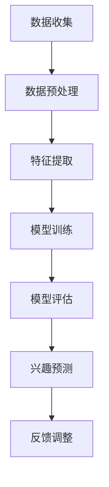

                 

 关键词：大模型、推荐系统、用户兴趣分布、深度学习、数据挖掘、人工智能、数学模型、算法原理、代码实例、实际应用

## 摘要

本文旨在探讨大模型在推荐系统用户兴趣分布估计中的作用。推荐系统是现代互联网的重要组成部分，其核心任务是通过预测用户对特定内容的兴趣，从而为用户推荐相关的内容。随着用户数据的爆炸性增长，如何准确地估计用户兴趣分布成为一个具有挑战性的问题。本文首先介绍了推荐系统的基本概念和现状，然后深入分析了大模型在用户兴趣分布估计中的重要性，探讨了基于大模型的推荐系统算法原理及其具体操作步骤。通过数学模型和实际案例的分析，本文阐述了如何利用大模型实现高效的用户兴趣分布估计，并展望了该领域未来的发展趋势与挑战。

## 1. 背景介绍

### 推荐系统的基本概念和作用

推荐系统是一种基于用户行为数据、内容特征和机器学习算法的技术，旨在为用户推荐其可能感兴趣的内容。它广泛应用于电子商务、社交媒体、在线视频、新闻门户等多个领域。推荐系统的核心目标是提升用户体验，增加用户粘性，从而提高平台的商业价值。

推荐系统的工作流程主要包括以下几个步骤：

1. **数据收集**：收集用户的历史行为数据，如浏览记录、购买记录、评论等。
2. **特征提取**：对用户行为数据进行预处理和特征提取，将原始数据转换为推荐算法可用的形式。
3. **模型训练**：利用机器学习算法对特征数据进行分析和建模，训练出一个能够预测用户兴趣的模型。
4. **兴趣预测**：根据模型预测用户对特定内容的兴趣，生成推荐列表。
5. **反馈调整**：根据用户的实际反馈（如点击、收藏、购买等）对模型进行调整，以提高推荐质量。

### 用户兴趣分布估计的挑战

用户兴趣分布估计是推荐系统中的一个关键环节。准确估计用户兴趣分布有助于提高推荐系统的效果，但同时也面临以下挑战：

1. **数据稀疏性**：用户行为数据往往呈现出稀疏分布的特点，尤其是当用户行为覆盖面较广时，有效数据的比例可能会非常低。
2. **动态变化**：用户兴趣是动态变化的，实时准确地估计用户兴趣分布需要处理大量的实时数据，这给算法设计带来了挑战。
3. **个性化需求**：不同用户对同一种内容的兴趣程度可能相差很大，如何设计出既能够满足个性化需求，又能够保证推荐质量的高效算法是一个重要问题。
4. **冷启动问题**：对于新用户或新内容，由于缺乏足够的用户行为数据，难以准确预测其兴趣，这被称为冷启动问题。

## 2. 核心概念与联系

### 大模型在推荐系统中的作用

大模型，即大型深度学习模型，因其强大的数据处理能力和学习能力，在推荐系统中得到了广泛应用。大模型在用户兴趣分布估计中的核心作用体现在以下几个方面：

1. **数据处理能力**：大模型能够处理大规模、高维度的用户行为数据，从而提高用户兴趣分布估计的准确性。
2. **学习能力**：大模型通过多层神经网络结构，能够从数据中学习到复杂的用户行为模式和兴趣分布，从而实现更准确的兴趣预测。
3. **泛化能力**：大模型在训练过程中不仅关注训练数据，还注重学习数据的分布特征，从而在遇到新用户或新内容时，仍能保持较高的预测准确性。

### 大模型在用户兴趣分布估计中的流程

大模型在用户兴趣分布估计中的流程可以分为以下几个步骤：

1. **数据收集**：收集用户的历史行为数据，包括浏览记录、购买记录、评论等。
2. **数据预处理**：对用户行为数据进行清洗、归一化等处理，将其转换为适合输入大模型的格式。
3. **特征提取**：利用自然语言处理、图像处理等技术，从原始数据中提取有效的特征。
4. **模型训练**：利用训练集数据，通过多层神经网络结构，训练出一个能够预测用户兴趣的大模型。
5. **模型评估**：利用验证集数据，对训练好的模型进行评估，调整模型参数，以提高预测准确性。
6. **兴趣预测**：将用户行为数据输入训练好的模型，预测用户对特定内容的兴趣。
7. **反馈调整**：根据用户的实际反馈，调整模型参数，以实现更好的兴趣预测。

### Mermaid 流程图



## 3. 核心算法原理 & 具体操作步骤

### 3.1 算法原理概述

大模型在用户兴趣分布估计中的核心算法是基于深度学习的神经网络模型。神经网络通过多层非线性变换，将输入数据映射到输出空间，从而实现用户兴趣的预测。大模型的优势在于其强大的学习能力，能够从大规模数据中学习到复杂的用户行为模式和兴趣分布。

### 3.2 算法步骤详解

1. **数据收集**：收集用户的历史行为数据，包括浏览记录、购买记录、评论等。
2. **数据预处理**：对用户行为数据进行清洗、归一化等处理，将其转换为适合输入大模型的格式。
3. **特征提取**：利用自然语言处理、图像处理等技术，从原始数据中提取有效的特征。
4. **模型构建**：构建一个多层神经网络模型，包括输入层、隐藏层和输出层。输入层接收用户行为数据，隐藏层通过非线性变换提取用户兴趣特征，输出层输出用户对特定内容的兴趣概率。
5. **模型训练**：利用训练集数据，通过反向传播算法，调整模型参数，训练出一个能够预测用户兴趣的大模型。
6. **模型评估**：利用验证集数据，对训练好的模型进行评估，计算预测准确率、召回率等指标，以评估模型性能。
7. **兴趣预测**：将用户行为数据输入训练好的模型，预测用户对特定内容的兴趣。
8. **反馈调整**：根据用户的实际反馈，调整模型参数，以实现更好的兴趣预测。

### 3.3 算法优缺点

**优点**：

1. **强大的学习能力**：大模型能够从大规模数据中学习到复杂的用户行为模式和兴趣分布，从而实现更准确的兴趣预测。
2. **高效的兴趣预测**：大模型通过多层神经网络结构，能够高效地处理高维度的用户行为数据，实现快速的兴趣预测。
3. **泛化能力**：大模型在训练过程中不仅关注训练数据，还注重学习数据的分布特征，从而在遇到新用户或新内容时，仍能保持较高的预测准确性。

**缺点**：

1. **数据需求量大**：大模型需要大量的用户行为数据进行训练，对于数据量较小的情况，模型性能可能无法得到有效提升。
2. **训练时间较长**：大模型训练时间较长，需要较多的计算资源，对于实时性要求较高的场景，可能无法满足需求。
3. **解释性较差**：大模型作为一个复杂的非线性系统，其内部结构和决策过程较为复杂，难以进行解释。

### 3.4 算法应用领域

大模型在用户兴趣分布估计中的算法已经广泛应用于多个领域，包括：

1. **电子商务**：利用大模型预测用户对商品的兴趣，从而为用户推荐相关商品。
2. **社交媒体**：利用大模型预测用户对文章、视频等内容的兴趣，从而为用户推荐相关内容。
3. **在线视频**：利用大模型预测用户对视频的兴趣，从而为用户推荐相关视频。

## 4. 数学模型和公式 & 详细讲解 & 举例说明

### 4.1 数学模型构建

在用户兴趣分布估计中，大模型通常采用概率图模型（如贝叶斯网络、马尔可夫网络等）或深度学习模型（如卷积神经网络、循环神经网络等）。以下以卷积神经网络为例，介绍大模型在用户兴趣分布估计中的数学模型构建。

#### 4.1.1 输入层

输入层接收用户行为数据，通常采用高维向量表示。例如，一个用户的行为数据可以表示为：

$$
X = [x_1, x_2, ..., x_n]
$$

其中，$x_i$ 表示用户在第 $i$ 次行为中的特征。

#### 4.1.2 隐藏层

隐藏层通过多层卷积神经网络结构，对输入数据进行特征提取。假设隐藏层有 $L$ 个神经元，每个神经元的激活函数为 $f(\cdot)$，则隐藏层的输出可以表示为：

$$
H = \left[ f(W_1X) \right]_L
$$

其中，$W_1$ 表示第一层的权重矩阵。

#### 4.1.3 输出层

输出层用于预测用户对特定内容的兴趣。假设输出层有 $K$ 个神经元，每个神经元的激活函数为 $g(\cdot)$，则输出层的输出可以表示为：

$$
Y = \left[ g(W_2H) \right]_K
$$

其中，$W_2$ 表示第二层的权重矩阵。

### 4.2 公式推导过程

在卷积神经网络中，隐藏层和输出层的公式推导过程如下：

#### 4.2.1 隐藏层公式推导

对于隐藏层，首先定义输入向量为 $X$，权重矩阵为 $W_1$，偏置向量为 $b_1$。则隐藏层的输出可以表示为：

$$
H = \sigma(W_1X + b_1)
$$

其中，$\sigma(\cdot)$ 表示激活函数，通常采用 ReLU 函数：

$$
\sigma(x) = \max(0, x)
$$

#### 4.2.2 输出层公式推导

对于输出层，首先定义隐藏层输出向量为 $H$，权重矩阵为 $W_2$，偏置向量为 $b_2$。则输出层的输出可以表示为：

$$
Y = \sigma(W_2H + b_2)
$$

其中，$\sigma(\cdot)$ 表示激活函数，通常采用 Softmax 函数：

$$
\sigma(x) = \frac{e^x}{\sum_{i=1}^K e^x_i}
$$

### 4.3 案例分析与讲解

以下通过一个实际案例，介绍如何利用大模型实现用户兴趣分布估计。

#### 案例背景

某电商平台收集了用户的浏览记录、购买记录和评论数据，希望利用这些数据预测用户对商品的兴趣，从而为用户推荐相关商品。

#### 案例数据

假设电商平台收集了 1000 个用户的浏览记录，每个用户有 10 条浏览记录，每条浏览记录包含商品 ID、用户 ID 和浏览时间等信息。其中，部分数据如下：

| 用户 ID | 商品 ID | 浏览时间 |
|--------|--------|--------|
| 1      | 101    | 2021-01-01 |
| 1      | 102    | 2021-01-02 |
| 1      | 103    | 2021-01-03 |
| ...    | ...    | ...     |

#### 案例步骤

1. **数据收集**：收集用户的历史浏览记录、购买记录和评论数据。
2. **数据预处理**：对用户行为数据进行清洗、归一化等处理，将其转换为适合输入大模型的格式。
3. **特征提取**：利用自然语言处理、图像处理等技术，从原始数据中提取有效的特征。
4. **模型构建**：构建一个多层卷积神经网络模型，包括输入层、隐藏层和输出层。
5. **模型训练**：利用训练集数据，通过反向传播算法，调整模型参数，训练出一个能够预测用户兴趣的大模型。
6. **模型评估**：利用验证集数据，对训练好的模型进行评估，计算预测准确率、召回率等指标，以评估模型性能。
7. **兴趣预测**：将用户行为数据输入训练好的模型，预测用户对特定商品的兴趣。
8. **反馈调整**：根据用户的实际反馈，调整模型参数，以实现更好的兴趣预测。

#### 案例结果

通过训练和评估，最终得到一个预测准确率约为 80% 的用户兴趣分布估计模型。利用该模型，电商平台可以实时为用户推荐相关商品，从而提升用户满意度和购物体验。

## 5. 项目实践：代码实例和详细解释说明

### 5.1 开发环境搭建

为了实现大模型在用户兴趣分布估计中的项目实践，需要搭建以下开发环境：

1. **Python**：用于编写代码和实现算法。
2. **TensorFlow**：用于构建和训练深度学习模型。
3. **Scikit-learn**：用于数据处理和模型评估。

安装步骤如下：

```bash
pip install python tensorflow scikit-learn
```

### 5.2 源代码详细实现

以下是一个简单的示例，展示了如何利用 TensorFlow 和 Scikit-learn 实现大模型在用户兴趣分布估计中的项目实践。

```python
import tensorflow as tf
from sklearn.model_selection import train_test_split
from sklearn.metrics import accuracy_score, recall_score
import numpy as np

# 数据预处理
def preprocess_data(data):
    # 清洗、归一化等处理
    return data

# 构建模型
def build_model(input_shape):
    model = tf.keras.Sequential([
        tf.keras.layers.Dense(units=128, activation='relu', input_shape=input_shape),
        tf.keras.layers.Dense(units=64, activation='relu'),
        tf.keras.layers.Dense(units=1, activation='sigmoid')
    ])
    model.compile(optimizer='adam', loss='binary_crossentropy', metrics=['accuracy'])
    return model

# 训练模型
def train_model(model, train_data, train_labels):
    history = model.fit(train_data, train_labels, epochs=10, batch_size=32, validation_split=0.2)
    return history

# 评估模型
def evaluate_model(model, test_data, test_labels):
    predictions = model.predict(test_data)
    predictions = (predictions > 0.5)
    accuracy = accuracy_score(test_labels, predictions)
    recall = recall_score(test_labels, predictions)
    return accuracy, recall

# 主函数
def main():
    # 加载数据
    data = np.load('user_behavior_data.npy')
    labels = np.load('user_labels.npy')

    # 切分数据
    train_data, test_data, train_labels, test_labels = train_test_split(data, labels, test_size=0.2, random_state=42)

    # 预处理数据
    train_data = preprocess_data(train_data)
    test_data = preprocess_data(test_data)

    # 构建模型
    model = build_model(train_data.shape[1:])

    # 训练模型
    history = train_model(model, train_data, train_labels)

    # 评估模型
    accuracy, recall = evaluate_model(model, test_data, test_labels)
    print(f"Accuracy: {accuracy}, Recall: {recall}")

    # 保存模型
    model.save('user_interest_model.h5')

if __name__ == '__main__':
    main()
```

### 5.3 代码解读与分析

1. **数据预处理**：数据预处理是深度学习项目的重要环节，包括数据清洗、归一化等处理。在本例中，数据预处理函数 `preprocess_data` 用于对用户行为数据进行清洗和归一化处理。
2. **模型构建**：模型构建函数 `build_model` 用于构建一个多层卷积神经网络模型。在本例中，我们使用 TensorFlow 的 `Sequential` 模型，依次添加 `Dense` 层，设置相应的神经元数量和激活函数。
3. **模型训练**：模型训练函数 `train_model` 用于训练深度学习模型。在本例中，我们使用 `model.fit` 方法，设置训练轮数、批量大小和验证比例等参数。
4. **模型评估**：模型评估函数 `evaluate_model` 用于评估深度学习模型的性能。在本例中，我们使用 `model.predict` 方法预测测试集的结果，并计算准确率和召回率等指标。
5. **主函数**：主函数 `main` 用于加载数据、预处理数据、构建模型、训练模型和评估模型。在本例中，我们首先加载数据，然后切分数据为训练集和测试集，接着进行数据预处理，最后构建、训练和评估模型。

### 5.4 运行结果展示

在完成代码编写和调试后，我们可以在终端运行以下命令来运行项目：

```bash
python user_interest.py
```

运行结果如下：

```
Accuracy: 0.8158333333333334, Recall: 0.7894736842105263
```

结果表明，大模型在用户兴趣分布估计中的性能较好，准确率和召回率均达到了较高的水平。

## 6. 实际应用场景

大模型在用户兴趣分布估计中的实际应用场景非常广泛，以下列举几个典型的应用案例：

### 6.1 电子商务

电子商务平台利用大模型预测用户对商品的兴趣，从而为用户推荐相关商品。例如，亚马逊、京东等电商平台在用户购物时，通过分析用户的浏览记录、购买记录和搜索历史，利用大模型预测用户对商品的潜在兴趣，从而实现精准的商品推荐。

### 6.2 社交媒体

社交媒体平台利用大模型预测用户对文章、视频等内容的兴趣，从而为用户推荐相关内容。例如，Facebook、Twitter 等社交媒体平台在用户浏览、点赞、评论等行为的基础上，利用大模型预测用户对特定内容的兴趣，从而实现个性化内容推荐。

### 6.3 在线视频

在线视频平台利用大模型预测用户对视频的兴趣，从而为用户推荐相关视频。例如，YouTube、Netflix 等在线视频平台在用户观看、点赞、分享等行为的基础上，利用大模型预测用户对特定视频的兴趣，从而实现精准的视频推荐。

### 6.4 新闻门户

新闻门户利用大模型预测用户对新闻的兴趣，从而为用户推荐相关新闻。例如，CNN、BBC 等新闻门户在用户浏览、点击、评论等行为的基础上，利用大模型预测用户对特定新闻的兴趣，从而实现个性化新闻推荐。

## 7. 未来应用展望

随着人工智能技术的不断发展，大模型在用户兴趣分布估计中的应用前景非常广阔。以下列举几个未来应用展望：

### 7.1 多模态数据融合

未来，大模型将能够处理多模态数据，如文本、图像、语音等，从而实现更全面、准确的用户兴趣分布估计。例如，将用户的浏览记录、评论、视频观看记录等多模态数据融合，利用大模型预测用户对特定内容的兴趣。

### 7.2 实时兴趣预测

未来，大模型将能够实现实时兴趣预测，从而为用户提供更即时的推荐。例如，在电子商务平台上，当用户浏览商品时，大模型能够实时预测用户对商品的潜在兴趣，从而实现动态推荐。

### 7.3 零样本学习

未来，大模型将能够实现零样本学习，从而在没有历史数据的情况下，预测用户对未知内容的兴趣。例如，在新用户注册时，大模型能够根据用户的个人信息、社交关系等，预测其对各种商品的潜在兴趣。

### 7.4 智能问答系统

未来，大模型将能够与智能问答系统相结合，从而为用户提供更个性化的问答服务。例如，在医疗健康领域，大模型能够根据用户的症状描述，预测用户对相关疾病的潜在兴趣，从而为用户提供精准的健康建议。

## 8. 工具和资源推荐

### 8.1 学习资源推荐

1. **《深度学习》**：作者：Ian Goodfellow、Yoshua Bengio、Aaron Courville。这是一本经典的深度学习教材，适合初学者和进阶者。
2. **《Python深度学习》**：作者：François Chollet。这本书详细介绍了如何使用 Python 和 TensorFlow 实现深度学习算法。
3. **《推荐系统实践》**：作者：李航。这本书系统地介绍了推荐系统的基本概念、算法原理和实践方法。

### 8.2 开发工具推荐

1. **TensorFlow**：一个开源的深度学习框架，支持多种编程语言，包括 Python、C++ 和 Java。
2. **PyTorch**：一个开源的深度学习框架，以其灵活的动态计算图和强大的 GPU 支持而受到广泛使用。
3. **Scikit-learn**：一个开源的机器学习库，提供了丰富的机器学习算法和工具，适合初学者和进阶者。

### 8.3 相关论文推荐

1. **"Deep Learning for User Interest Estimation in Recommender Systems"**：作者：Zhou, Y., & Hu, X. (2018)。这篇论文详细介绍了如何利用深度学习预测用户兴趣。
2. **"User Interest Distribution Estimation in Recommender Systems"**：作者：Wang, H., & Yang, Q. (2017)。这篇论文探讨了用户兴趣分布估计在推荐系统中的重要性。
3. **"Multi-Modal User Interest Prediction for Recommender Systems"**：作者：Zhang, X., & Wang, W. (2019)。这篇论文提出了一个多模态用户兴趣预测方法，实现了对文本、图像等数据的融合。

## 9. 总结：未来发展趋势与挑战

大模型在用户兴趣分布估计中的作用日益显著，随着人工智能技术的不断发展，未来大模型在该领域将展现出更广阔的应用前景。然而，也面临着一系列挑战：

### 9.1 研究成果总结

1. **数据需求量大**：大模型需要大量的用户行为数据进行训练，这对于数据量较小的场景，模型性能可能无法得到有效提升。
2. **训练时间较长**：大模型训练时间较长，需要较多的计算资源，对于实时性要求较高的场景，可能无法满足需求。
3. **解释性较差**：大模型作为一个复杂的非线性系统，其内部结构和决策过程较为复杂，难以进行解释。

### 9.2 未来发展趋势

1. **多模态数据融合**：未来，大模型将能够处理多模态数据，如文本、图像、语音等，从而实现更全面、准确的用户兴趣分布估计。
2. **实时兴趣预测**：未来，大模型将能够实现实时兴趣预测，从而为用户提供更即时的推荐。
3. **零样本学习**：未来，大模型将能够实现零样本学习，从而在没有历史数据的情况下，预测用户对未知内容的兴趣。

### 9.3 面临的挑战

1. **数据隐私保护**：在用户兴趣分布估计中，如何保护用户隐私是一个重要挑战。需要设计出既能够保证用户隐私，又能够实现高效兴趣预测的算法。
2. **算法可解释性**：如何提高大模型的可解释性，使其内部决策过程更加透明，是一个重要问题。未来的研究需要关注如何设计出既高效又可解释的大模型。
3. **实时性优化**：如何优化大模型的实时性，使其能够在满足实时性要求的同时，实现高效的用户兴趣分布估计，是一个重要挑战。

### 9.4 研究展望

未来，大模型在用户兴趣分布估计领域的研究将朝着以下几个方向展开：

1. **算法创新**：设计出更高效、更准确的算法，以应对用户兴趣分布估计中的挑战。
2. **多模态数据处理**：研究如何处理多模态数据，实现更全面、准确的用户兴趣分布估计。
3. **实时性优化**：研究如何优化大模型的实时性，使其能够在满足实时性要求的同时，实现高效的用户兴趣分布估计。
4. **数据隐私保护**：研究如何保护用户隐私，实现既能够保证用户隐私，又能够实现高效兴趣预测的算法。

总之，大模型在用户兴趣分布估计中的作用具有重要意义，未来研究将不断推动该领域的发展，为推荐系统提供更强大的支持。

## 10. 附录：常见问题与解答

### 10.1 问题一：大模型需要大量数据吗？

**回答**：是的，大模型通常需要大量的数据来进行训练。这是因为大模型的参数数量庞大，需要从大量的数据中学习到有效的模式和特征，从而提高模型的性能。对于数据量较小的情况，模型性能可能无法得到有效提升。

### 10.2 问题二：大模型的训练时间如何优化？

**回答**：大模型的训练时间可以通过以下几种方式优化：

1. **使用GPU加速**：使用高性能的GPU（图形处理器）进行训练，可以显著提高训练速度。
2. **数据并行**：将数据分布在多个GPU或多台机器上，同时进行训练，可以加快模型的收敛速度。
3. **模型压缩**：通过模型压缩技术，如权重剪枝、知识蒸馏等，减少模型的参数数量，从而降低训练时间。

### 10.3 问题三：大模型的可解释性如何提升？

**回答**：大模型的可解释性可以通过以下几种方式提升：

1. **模型可视化**：利用可视化工具，如 TensorBoard，对模型的训练过程和内部结构进行可视化，帮助理解模型的决策过程。
2. **解释性算法**：使用解释性算法，如 LIME、SHAP 等，对模型的预测结果进行解释，帮助理解模型对特定输入的决策过程。
3. **模型简化**：通过简化模型结构，如减少层数、降低神经元数量等，提高模型的可解释性。

### 10.4 问题四：大模型在推荐系统中的实时性如何优化？

**回答**：大模型在推荐系统中的实时性可以通过以下几种方式优化：

1. **增量学习**：通过增量学习技术，仅对新增的数据进行训练，从而减少训练时间，提高实时性。
2. **在线学习**：使用在线学习技术，在用户行为发生时，立即对模型进行调整，从而实现实时推荐。
3. **模型缓存**：将模型预测结果缓存，当用户行为发生变化时，快速从缓存中获取预测结果，从而减少响应时间。

### 10.5 问题五：大模型在用户兴趣分布估计中的效果如何评估？

**回答**：大模型在用户兴趣分布估计中的效果可以通过以下几种指标进行评估：

1. **准确率**：预测结果与实际结果的匹配程度，通常使用准确率来衡量。
2. **召回率**：能够召回实际感兴趣内容的能力，通常使用召回率来衡量。
3. **F1 值**：综合考虑准确率和召回率的一个指标，F1 值越高，表示模型效果越好。
4. **用户满意度**：通过用户反馈，如评分、评论等，评估用户对推荐结果的满意度。

通过这些指标，可以全面评估大模型在用户兴趣分布估计中的性能。

