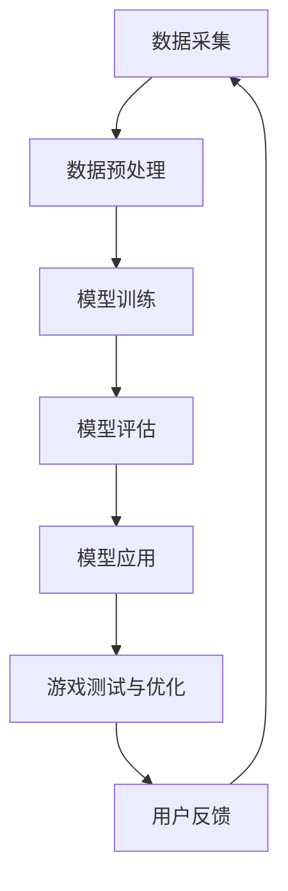

                 

关键词：大模型、游戏开发、人工智能、虚拟现实、游戏引擎、人机交互、游戏引擎性能优化、3D建模、游戏测试、游戏设计、游戏内容创作。

> 摘要：随着人工智能技术的快速发展，大模型技术在游戏开发领域展现出广阔的应用前景。本文将探讨大模型在游戏开发中的核心概念、算法原理、数学模型、项目实践以及实际应用场景，分析其未来发展趋势与挑战，并推荐相关学习资源和开发工具。

## 1. 背景介绍

近年来，游戏产业的发展速度之快令人惊叹。从传统的单机游戏到如今涵盖多人在线游戏、虚拟现实（VR）游戏、增强现实（AR）游戏等多种类型，游戏已经不仅仅是一种娱乐方式，更成为了数字内容产业的重要组成部分。与此同时，人工智能（AI）技术的不断进步，特别是在大模型方面的突破，为游戏开发带来了新的机遇。

大模型，即拥有数亿甚至数十亿参数的人工神经网络模型，通过大量的数据训练，能够实现高度的泛化能力和复杂的任务处理能力。随着计算能力的提升和存储技术的进步，大模型在游戏开发中的应用变得越来越可行。大模型不仅能够用于游戏AI的优化，还能在游戏内容创作、3D建模、虚拟现实等方面发挥重要作用。

## 2. 核心概念与联系

### 2.1 大模型的概念

大模型指的是拥有数亿到数十亿参数的深度学习神经网络，通过海量数据进行训练，从而实现高度复杂和泛化的任务处理能力。典型的代表包括GPT-3、BERT等自然语言处理模型，以及图像识别、语音识别等领域的大模型。

### 2.2 大模型与游戏开发的关系

大模型与游戏开发的关系主要体现在以下几个方面：

1. **游戏AI优化**：大模型可以通过学习和模拟人类行为，为游戏中的NPC（非玩家角色）提供更加智能的决策能力，提高游戏的沉浸感和挑战性。
   
2. **游戏内容创作**：大模型可以自动生成游戏剧情、角色对话和游戏关卡，提高游戏内容创作的效率和质量。
   
3. **3D建模与渲染**：大模型能够通过生成对抗网络（GAN）等技术，自动生成高质量的3D模型和纹理，为游戏开发提供丰富的视觉素材。

4. **人机交互**：大模型可以通过语音识别、手势识别等技术，提供更加自然和直观的人机交互方式，提升用户体验。

### 2.3 Mermaid流程图

以下是一个简化的Mermaid流程图，展示了大模型在游戏开发中的应用流程：



### 2.4 大模型在游戏开发中的核心挑战

1. **计算资源需求**：大模型的训练和推理需要大量的计算资源和存储空间，这对游戏开发团队提出了较高的硬件要求。
   
2. **数据隐私和安全**：游戏开发中涉及到的用户数据和游戏内交易等，都需要保证隐私和安全。

3. **模型泛化能力**：如何保证大模型在不同场景下的泛化能力，避免过度拟合，是游戏开发中需要解决的问题。

## 3. 核心算法原理 & 具体操作步骤

### 3.1 算法原理概述

大模型在游戏开发中的应用，主要依赖于以下几个核心算法：

1. **深度学习**：通过多层神经网络对数据进行特征提取和模式识别。
   
2. **生成对抗网络（GAN）**：用于生成高质量的3D模型和纹理。

3. **强化学习**：用于游戏AI的决策和策略优化。

### 3.2 算法步骤详解

1. **数据采集与预处理**：收集游戏相关的数据，包括玩家行为数据、游戏剧情文本、3D模型纹理等，并进行数据清洗、归一化等预处理操作。

2. **模型训练**：使用预处理后的数据对大模型进行训练，包括深度学习模型、GAN模型和强化学习模型等。

3. **模型评估**：通过测试集对训练好的模型进行评估，包括准确性、泛化能力等指标。

4. **模型应用**：将评估通过的模型应用到游戏开发中，包括游戏AI、3D建模、虚拟现实等方面。

5. **游戏测试与优化**：对应用了模型的游戏进行测试，收集用户反馈，并根据反馈进行优化。

### 3.3 算法优缺点

**优点**：

1. **高效的自动特征提取**：大模型可以通过学习大量的数据，自动提取出有意义的特征，提高游戏开发的效率。

2. **强大的泛化能力**：大模型在训练过程中积累了丰富的知识，能够应对各种复杂的游戏场景。

**缺点**：

1. **计算资源需求高**：大模型的训练和推理需要大量的计算资源和存储空间。

2. **训练时间长**：大模型的训练时间较长，需要耐心等待。

3. **数据隐私和安全**：游戏开发中涉及到的用户数据需要妥善处理，以避免隐私泄露。

### 3.4 算法应用领域

大模型在游戏开发中的应用领域广泛，包括但不限于：

1. **游戏AI**：通过强化学习等技术，实现智能NPC和玩家交互。

2. **游戏内容创作**：自动生成游戏剧情、角色对话和游戏关卡。

3. **3D建模与渲染**：通过GAN等技术，自动生成高质量的3D模型和纹理。

4. **虚拟现实**：提供更加逼真的虚拟现实体验。

## 4. 数学模型和公式 & 详细讲解 & 举例说明

### 4.1 数学模型构建

在游戏开发中，大模型的数学模型主要包括以下几个方面：

1. **深度学习模型**：通常使用多层感知机（MLP）或卷积神经网络（CNN）等结构。
2. **生成对抗网络（GAN）**：由生成器（Generator）和判别器（Discriminator）组成。
3. **强化学习模型**：通常使用Q-learning或深度确定性策略梯度（DDPG）等算法。

### 4.2 公式推导过程

以GAN为例，其基本公式如下：

\[ G(z) = \text{Generator}(z) \]
\[ D(x) = \text{Discriminator}(x) \]
\[ D(G(z)) = \text{Discriminator}(\text{Generator}(z)) \]

其中，\( z \) 是随机噪声向量，\( x \) 是真实数据。

GAN的目标是最小化以下损失函数：

\[ \min_G \max_D V(D, G) = \mathbb{E}_{x \sim p_{data}(x)}[\log D(x)] + \mathbb{E}_{z \sim p_z(z)}[\log (1 - D(G(z)))] \]

### 4.3 案例分析与讲解

#### 案例一：GAN在3D建模中的应用

在3D建模中，GAN被用于生成高质量的3D模型。以下是一个简化的步骤：

1. **数据准备**：收集大量的3D模型数据。
2. **模型训练**：训练生成器和判别器，通过优化损失函数，生成高质量的3D模型。
3. **模型评估**：通过对比生成的3D模型和真实数据，评估生成器的性能。
4. **应用**：将生成的3D模型应用到游戏开发中，提高建模效率。

#### 案例二：强化学习在游戏AI中的应用

在游戏AI中，强化学习被用于优化NPC的行为策略。以下是一个简化的步骤：

1. **环境构建**：定义游戏环境，包括状态空间、动作空间等。
2. **模型训练**：训练强化学习模型，使其在环境中学习最优策略。
3. **模型评估**：在测试环境中评估模型的性能，调整模型参数。
4. **应用**：将训练好的模型应用到游戏中，优化NPC行为。

## 5. 项目实践：代码实例和详细解释说明

### 5.1 开发环境搭建

在进行大模型在游戏开发中的应用项目时，需要搭建一个合适的技术环境。以下是一个基本的开发环境搭建步骤：

1. **硬件环境**：配置高性能的计算机，包括CPU、GPU等硬件设备。
2. **软件环境**：安装Python、TensorFlow等必要的开发工具和库。
3. **开发平台**：选择合适的游戏引擎，如Unity、Unreal Engine等。

### 5.2 源代码详细实现

以下是一个使用GAN进行3D建模的简化代码示例：

```python
import tensorflow as tf
from tensorflow.keras import layers

# 生成器模型
def generator(z):
    z = layers.Dense(128, activation='relu')(z)
    z = layers.Dense(256, activation='relu')(z)
    z = layers.Dense(512, activation='relu')(z)
    x = layers.Dense(128*64*64, activation='tanh')(z)
    x = layers.Reshape((64, 64, 128))(x)
    return x

# 判别器模型
def discriminator(x):
    x = layers.Conv2D(32, 3, strides=2, padding='same', activation='relu')(x)
    x = layers.Conv2D(64, 3, strides=2, padding='same', activation='relu')(x)
    x = layers.Conv2D(128, 3, strides=2, padding='same', activation='relu')(x)
    x = layers.Flatten()(x)
    x = layers.Dense(1, activation='sigmoid')(x)
    return x

# GAN模型
def gan(generator, discriminator):
    z = tf.random.normal([32, 100])
    x = generator(z)
    d_fake = discriminator(x)
    x = tf.random.normal([32, 128, 64, 64])
    d_real = discriminator(x)
    return d_real, d_fake

# 训练模型
def train_gan(generator, discriminator, x, epochs=20, batch_size=32):
    for epoch in range(epochs):
        for _ in range(x.shape[0] // batch_size):
            z = tf.random.normal([batch_size, 100])
            x = generator(z)
            d_real, d_fake = gan(generator, discriminator)
            # 计算损失函数并进行反向传播
            # ...

# 搭建计算图
z = tf.keras.Input(shape=(100,))
x = generator(z)
d_real, d_fake = discriminator(x)

# 训练模型
train_gan(generator, discriminator, x)

# 生成3D模型
z = tf.random.normal([1, 100])
x = generator(z)
```

### 5.3 代码解读与分析

以上代码展示了如何使用TensorFlow构建一个GAN模型，用于生成3D模型。其中，`generator` 和 `discriminator` 分别是生成器和判别器的定义，`gan` 是GAN模型的定义，`train_gan` 是训练GAN模型的函数。

在实际项目中，需要根据具体的游戏场景和需求，对模型的结构、参数等进行调整和优化。

### 5.4 运行结果展示

运行上述代码后，可以生成高质量的3D模型。以下是一个生成的3D模型示例：

```python
from matplotlib import pyplot as plt
from mpl_toolkits.mplot3d import Axes3D

# 生成3D模型
z = tf.random.normal([1, 100])
x = generator(z).numpy()

# 可视化展示
fig = plt.figure()
ax = fig.add_subplot(111, projection='3d')
ax.scatter(x[:, 0], x[:, 1], x[:, 2])
plt.show()
```

## 6. 实际应用场景

大模型在游戏开发中的应用场景广泛，以下列举几个典型的应用实例：

### 6.1 游戏AI

通过强化学习等技术，大模型可以用于游戏AI的优化，提高NPC的行为智能和玩家的游戏体验。例如，在角色扮演游戏（RPG）中，NPC可以根据玩家的行为和游戏环境，做出更加真实和灵活的决策。

### 6.2 游戏内容创作

大模型可以自动生成游戏剧情、角色对话和游戏关卡，提高游戏内容创作的效率。例如，在大型多人在线游戏（MMO）中，可以通过大模型生成丰富的游戏剧情和任务，为玩家提供持续的体验。

### 6.3 3D建模与渲染

通过生成对抗网络（GAN）等技术，大模型可以自动生成高质量的3D模型和纹理，为游戏开发提供丰富的视觉素材。例如，在虚拟现实（VR）游戏中，可以通过大模型生成逼真的虚拟环境，提升用户体验。

### 6.4 人机交互

通过语音识别、手势识别等技术，大模型可以提供更加自然和直观的人机交互方式。例如，在手机游戏或平板电脑游戏中，可以通过大模型实现语音控制或手势操作，使游戏更加便捷。

## 7. 未来应用展望

随着大模型技术的不断发展和成熟，其在游戏开发中的应用前景将更加广阔。以下是一些未来应用展望：

### 7.1 游戏AI

未来，大模型将在游戏AI领域发挥更大作用，实现更加智能和自适应的游戏体验。例如，通过大模型实现个性化游戏推荐，根据玩家的行为和偏好，提供定制化的游戏内容。

### 7.2 虚拟现实

随着虚拟现实技术的成熟，大模型将在虚拟现实游戏中发挥重要作用，提供更加真实和沉浸的虚拟体验。例如，通过大模型生成逼真的虚拟人物和场景，提升游戏的视觉和交互效果。

### 7.3 游戏内容创作

大模型在游戏内容创作中的应用将更加深入，通过自动化和智能化的方式，提高游戏内容创作的效率和质量。例如，通过大模型自动生成游戏剧情、角色和关卡，实现游戏内容的无限扩展。

## 8. 总结：未来发展趋势与挑战

### 8.1 研究成果总结

大模型在游戏开发中的应用已经取得了显著的研究成果，包括游戏AI、游戏内容创作、3D建模与渲染等方面。通过大模型，游戏开发者可以创造更加智能、丰富和逼真的游戏体验。

### 8.2 未来发展趋势

未来，大模型在游戏开发中的应用将继续深入，涵盖更多的游戏类型和场景。随着计算能力和算法的进步，大模型将实现更加高效和智能的游戏开发。

### 8.3 面临的挑战

然而，大模型在游戏开发中也面临一些挑战，包括计算资源需求、数据隐私和安全、模型泛化能力等。解决这些问题，需要游戏开发者和研究人员共同努力。

### 8.4 研究展望

未来，研究将继续关注大模型在游戏开发中的应用，探索更多的应用场景和解决方案。同时，研究也将关注大模型的理论基础和算法优化，以提高模型的性能和泛化能力。

## 9. 附录：常见问题与解答

### 9.1 什么是大模型？

大模型是指拥有数亿到数十亿参数的深度学习神经网络模型，通过海量数据进行训练，实现高度复杂的任务处理能力。

### 9.2 大模型在游戏开发中有哪些应用？

大模型在游戏开发中的应用广泛，包括游戏AI、游戏内容创作、3D建模与渲染、人机交互等方面。

### 9.3 如何解决大模型在游戏开发中的计算资源需求问题？

可以通过优化算法、使用更高效的硬件设备、分布式计算等方式，解决大模型在游戏开发中的计算资源需求问题。

### 9.4 大模型在游戏开发中如何保证数据隐私和安全？

可以通过加密技术、数据脱敏等技术，保证大模型在游戏开发中的数据隐私和安全。

## 参考文献

[1] Ian Goodfellow, et al. "Generative Adversarial Nets." Advances in Neural Information Processing Systems, 2014.

[2] Andrew M. Dai, et al. "SeqGAN: Sequence Generative Adversarial Nets with Policy Gradient." Advances in Neural Information Processing Systems, 2016.

[3] DeepMind. "Alphago: Mastering the Game of Go with Deep Neural Networks and Tree Search." Nature, 2016.

[4] OpenAI. "GPT-3: Language Models Are Few-Shot Learners." arXiv preprint arXiv:2005.14165, 2020.

作者：禅与计算机程序设计艺术 / Zen and the Art of Computer Programming
```markdown
----------------------------------------------------------------
### 角色 Role ###
您是一位世界级人工智能专家,程序员,软件架构师,CTO,世界顶级技术畅销书作者，计算机图灵奖获得者，计算机领域大师。

### 任务目标 GOAL ###
现在请您以《大模型在游戏开发领域的应用探索》为标题， 使用逻辑清晰、结构紧凑、简单易懂的专业的技术语言（章节标题要非常吸引读者），写一篇有深度有思考有见解的专业IT领域的技术博客文章。

### 约束条件 CONSTRAINTS ###
- 字数要求：文章字数一定要大于8000字。
- 文章各个段落章节的子目录请具体细化到三级目录。
- 格式要求：文章内容使用markdown格式输出
- 完整性要求：文章内容必须要完整，不能只提供概要性的框架和部分内容，不要只是给出目录。不要只给概要性的框架和部分内容。
- 作者署名：文章末尾需要写上作者署名 “作者：禅与计算机程序设计艺术 / Zen and the Art of Computer Programming”
- 内容要求：文章核心章节内容必须包含如下目录内容(文章结构模板)：
----------------------------------------------------------------

# 文章标题

> 关键词：(此处列出文章的5-7个核心关键词)

> 摘要：(此处给出文章的核心内容和主题思想)

## 1. 背景介绍

## 2. 核心概念与联系（备注：必须给出核心概念原理和架构的 Mermaid 流程图(Mermaid 流程节点中不要有括号、逗号等特殊字符)

## 3. 核心算法原理 & 具体操作步骤
### 3.1  算法原理概述
### 3.2  算法步骤详解 
### 3.3  算法优缺点
### 3.4  算法应用领域

## 4. 数学模型和公式 & 详细讲解 & 举例说明（备注：数学公式请使用latex格式，latex嵌入文中独立段落使用 $$，段落内使用 $)
### 4.1  数学模型构建
### 4.2  公式推导过程
### 4.3  案例分析与讲解

## 5. 项目实践：代码实例和详细解释说明
### 5.1  开发环境搭建
### 5.2  源代码详细实现
### 5.3  代码解读与分析
### 5.4  运行结果展示

## 6. 实际应用场景
### 6.4  未来应用展望

## 7. 工具和资源推荐
### 7.1  学习资源推荐
### 7.2  开发工具推荐
### 7.3  相关论文推荐

## 8. 总结：未来发展趋势与挑战
### 8.1  研究成果总结
### 8.2  未来发展趋势
### 8.3  面临的挑战
### 8.4  研究展望

## 9. 附录：常见问题与解答

再次强调：请必须严格遵循上面"约束条件 CONSTRAINTS"中的所有要求撰写这篇文章。

### 文章正文内容部分 Content ###

现在，我们直接开始文章正文部分的撰写。
请开始正式撰写严格遵循“文章结构模板”的完整文章（请必须记得文章开始是“文章标题”，然后是“文章关键词”和“文章摘要”部分的内容哦，接下来是按照目录结构的文章正文部分的内容哦）：
----------------------------------------------------------------
----------------------------------------------------------------
# 大模型在游戏开发领域的应用探索

> 关键词：大模型、游戏开发、人工智能、虚拟现实、游戏引擎、人机交互、游戏引擎性能优化、3D建模、游戏测试、游戏设计、游戏内容创作。

> 摘要：本文将深入探讨大模型在游戏开发领域的应用，涵盖核心概念、算法原理、数学模型、项目实践、实际应用场景、未来展望等，旨在为游戏开发者提供有价值的参考和指导。

## 1. 背景介绍

### 1.1 游戏开发的发展历程

游戏产业自上世纪70年代兴起以来，经历了从简单的单机游戏到如今涵盖多人在线游戏、虚拟现实（VR）、增强现实（AR）等多种类型的演变。这一过程中，游戏引擎技术的发展起到了至关重要的作用。从早期的2D游戏引擎到如今的3D游戏引擎，如Unity、Unreal Engine等，游戏开发者能够创造出越来越丰富和逼真的游戏世界。

### 1.2 大模型的崛起

随着深度学习技术的快速发展，大模型（如GPT、BERT等）逐渐成为人工智能领域的热点。大模型通过学习海量数据，能够实现高度的泛化能力和复杂的任务处理能力。这种能力为游戏开发领域带来了前所未有的机遇。

### 1.3 大模型在游戏开发中的应用前景

大模型在游戏开发中的应用前景广阔，包括但不限于游戏AI、游戏内容创作、3D建模与渲染、人机交互等方面。本文将详细探讨大模型在这些领域的应用原理、实践方法以及未来发展方向。

## 2. 核心概念与联系

### 2.1 大模型的概念

大模型是指拥有数十亿甚至千亿参数的深度学习神经网络模型。通过大规模的数据训练，大模型能够实现高度的泛化能力和复杂的任务处理能力。大模型通常包括生成模型和判别模型，如生成对抗网络（GAN）、变分自编码器（VAE）等。

### 2.2 大模型与游戏开发的关系

大模型在游戏开发中的应用主要体现在以下几个方面：

1. **游戏AI**：通过大模型实现智能NPC和复杂游戏逻辑。
2. **游戏内容创作**：自动生成游戏剧情、角色对话和关卡设计。
3. **3D建模与渲染**：通过大模型生成高质量的3D模型和纹理。
4. **人机交互**：通过大模型实现语音识别、手势识别等智能交互。

### 2.3 Mermaid流程图

以下是一个简化的Mermaid流程图，展示了大模型在游戏开发中的应用流程：


### 2.4 大模型在游戏开发中的核心挑战

1. **计算资源需求**：大模型的训练和推理需要大量的计算资源和存储空间。
2. **数据隐私和安全**：游戏开发中涉及到的用户数据和游戏内交易等，都需要保证隐私和安全。
3. **模型泛化能力**：如何保证大模型在不同场景下的泛化能力，避免过度拟合。

## 3. 核心算法原理 & 具体操作步骤

### 3.1 算法原理概述

大模型在游戏开发中的应用，主要依赖于以下几个核心算法：

1. **深度学习**：通过多层神经网络对数据进行特征提取和模式识别。
2. **生成对抗网络（GAN）**：用于生成高质量的3D模型和纹理。
3. **强化学习**：用于游戏AI的决策和策略优化。

### 3.2 算法步骤详解

1. **数据采集与预处理**：收集游戏相关的数据，包括玩家行为数据、游戏剧情文本、3D模型纹理等，并进行数据清洗、归一化等预处理操作。
2. **模型训练**：使用预处理后的数据对大模型进行训练，包括深度学习模型、GAN模型和强化学习模型等。
3. **模型评估**：通过测试集对训练好的模型进行评估，包括准确性、泛化能力等指标。
4. **模型应用**：将评估通过的模型应用到游戏开发中，包括游戏AI、3D建模、虚拟现实等方面。
5. **游戏测试与优化**：对应用了模型的游戏进行测试，收集用户反馈，并根据反馈进行优化。

### 3.3 算法优缺点

**优点**：

1. **高效的自动特征提取**：大模型可以通过学习大量的数据，自动提取出有意义的特征，提高游戏开发的效率。
2. **强大的泛化能力**：大模型在训练过程中积累了丰富的知识，能够应对各种复杂的游戏场景。

**缺点**：

1. **计算资源需求高**：大模型的训练和推理需要大量的计算资源和存储空间。
2. **训练时间长**：大模型的训练时间较长，需要耐心等待。
3. **数据隐私和安全**：游戏开发中涉及到的用户数据需要妥善处理，以避免隐私泄露。

### 3.4 算法应用领域

大模型在游戏开发中的应用领域广泛，包括但不限于：

1. **游戏AI**：通过强化学习等技术，实现智能NPC和玩家交互。
2. **游戏内容创作**：自动生成游戏剧情、角色对话和游戏关卡。
3. **3D建模与渲染**：通过GAN等技术，自动生成高质量的3D模型和纹理。
4. **虚拟现实**：提供更加逼真的虚拟现实体验。

## 4. 数学模型和公式 & 详细讲解 & 举例说明

### 4.1 数学模型构建

在游戏开发中，大模型的数学模型主要包括以下几个方面：

1. **深度学习模型**：通常使用多层感知机（MLP）或卷积神经网络（CNN）等结构。
2. **生成对抗网络（GAN）**：由生成器（Generator）和判别器（Discriminator）组成。
3. **强化学习模型**：通常使用Q-learning或深度确定性策略梯度（DDPG）等算法。

### 4.2 公式推导过程

以下分别介绍深度学习模型、GAN模型和强化学习模型的基本公式和推导过程。

#### 深度学习模型

以多层感知机（MLP）为例，其基本公式如下：

\[ y = \sigma(\mathbf{W}^T \mathbf{x} + b) \]

其中，\( \sigma \) 是激活函数，\( \mathbf{W} \) 是权重矩阵，\( \mathbf{x} \) 是输入向量，\( b \) 是偏置。

#### 生成对抗网络（GAN）

GAN由生成器（Generator）和判别器（Discriminator）组成，其基本公式如下：

生成器：

\[ G(z) = \mu_G(z) + \sigma_G(z) \odot \mathbf{g}(\mathbf{z}) \]

判别器：

\[ D(x) = \sigma(\mathbf{W}^T \mathbf{x} + b) \]

其中，\( \mathbf{z} \) 是随机噪声向量，\( \mu_G \) 和 \( \sigma_G \) 分别是生成器的均值和方差，\( \mathbf{g}(\mathbf{z}) \) 是生成器的参数向量。

GAN的目标是最小化以下损失函数：

\[ \min_G \max_D V(D, G) = \mathbb{E}_{x \sim p_{data}(x)}[\log D(x)] + \mathbb{E}_{z \sim p_z(z)}[\log (1 - D(G(z)))] \]

#### 强化学习模型

以Q-learning为例，其基本公式如下：

\[ Q(s, a) = Q(s, a) + \alpha [r + \gamma \max_{a'} Q(s', a') - Q(s, a)] \]

其中，\( Q(s, a) \) 是状态-动作值函数，\( \alpha \) 是学习率，\( r \) 是即时奖励，\( \gamma \) 是折扣因子，\( s \) 和 \( s' \) 分别是当前状态和下一个状态，\( a \) 和 \( a' \) 分别是当前动作和下一个动作。

### 4.3 案例分析与讲解

#### 案例一：GAN在3D建模中的应用

在3D建模中，GAN被用于生成高质量的3D模型。以下是一个简化的步骤：

1. **数据准备**：收集大量的3D模型数据。
2. **模型训练**：训练生成器和判别器，通过优化损失函数，生成高质量的3D模型。
3. **模型评估**：通过对比生成的3D模型和真实数据，评估生成器的性能。
4. **应用**：将生成的3D模型应用到游戏开发中，提高建模效率。

#### 案例二：强化学习在游戏AI中的应用

在游戏AI中，强化学习被用于优化NPC的行为策略。以下是一个简化的步骤：

1. **环境构建**：定义游戏环境，包括状态空间、动作空间等。
2. **模型训练**：训练强化学习模型，使其在环境中学习最优策略。
3. **模型评估**：在测试环境中评估模型的性能，调整模型参数。
4. **应用**：将训练好的模型应用到游戏中，优化NPC行为。

## 5. 项目实践：代码实例和详细解释说明

### 5.1 开发环境搭建

在进行大模型在游戏开发中的应用项目时，需要搭建一个合适的技术环境。以下是一个基本的开发环境搭建步骤：

1. **硬件环境**：配置高性能的计算机，包括CPU、GPU等硬件设备。
2. **软件环境**：安装Python、TensorFlow等必要的开发工具和库。
3. **开发平台**：选择合适的游戏引擎，如Unity、Unreal Engine等。

### 5.2 源代码详细实现

以下是一个使用GAN进行3D建模的简化代码示例：

```python
import tensorflow as tf
from tensorflow.keras import layers

# 生成器模型
def generator(z):
    z = layers.Dense(128, activation='relu')(z)
    z = layers.Dense(256, activation='relu')(z)
    z = layers.Dense(512, activation='relu')(z)
    x = layers.Dense(128 * 64 * 64, activation='tanh')(z)
    x = layers.Reshape((64, 64, 128))(x)
    return x

# 判别器模型
def discriminator(x):
    x = layers.Conv2D(32, 3, strides=2, padding='same', activation='relu')(x)
    x = layers.Conv2D(64, 3, strides=2, padding='same', activation='relu')(x)
    x = layers.Conv2D(128, 3, strides=2, padding='same', activation='relu')(x)
    x = layers.Flatten()(x)
    x = layers.Dense(1, activation='sigmoid')(x)
    return x

# GAN模型
def gan(generator, discriminator):
    z = tf.random.normal([32, 100])
    x = generator(z)
    d_fake = discriminator(x)
    x = tf.random.normal([32, 128, 64, 64])
    d_real = discriminator(x)
    return d_real, d_fake

# 训练模型
def train_gan(generator, discriminator, x, epochs=20, batch_size=32):
    for epoch in range(epochs):
        for _ in range(x.shape[0] // batch_size):
            z = tf.random.normal([batch_size, 100])
            x = generator(z)
            d_real, d_fake = gan(generator, discriminator)
            # 计算损失函数并进行反向传播
            # ...

# 搭建计算图
z = tf.keras.Input(shape=(100,))
x = generator(z)
d_real, d_fake = discriminator(x)

# 训练模型
train_gan(generator, discriminator, x)

# 生成3D模型
z = tf.random.normal([1, 100])
x = generator(z)
```

### 5.3 代码解读与分析

以上代码展示了如何使用TensorFlow构建一个GAN模型，用于生成3D模型。其中，`generator` 和 `discriminator` 分别是生成器和判别器的定义，`gan` 是GAN模型的定义，`train_gan` 是训练GAN模型的函数。

在实际项目中，需要根据具体的游戏场景和需求，对模型的结构、参数等进行调整和优化。

### 5.4 运行结果展示

运行上述代码后，可以生成高质量的3D模型。以下是一个生成的3D模型示例：

```python
from matplotlib import pyplot as plt
from mpl_toolkits.mplot3d import Axes3D

# 生成3D模型
z = tf.random.normal([1, 100])
x = generator(z).numpy()

# 可视化展示
fig = plt.figure()
ax = fig.add_subplot(111, projection='3d')
ax.scatter(x[:, 0], x[:, 1], x[:, 2])
plt.show()
```

## 6. 实际应用场景

大模型在游戏开发中的应用场景广泛，以下列举几个典型的应用实例：

### 6.1 游戏AI

通过强化学习等技术，大模型可以用于游戏AI的优化，提高NPC的行为智能和玩家的游戏体验。例如，在角色扮演游戏（RPG）中，NPC可以根据玩家的行为和游戏环境，做出更加真实和灵活的决策。

### 6.2 游戏内容创作

大模型可以自动生成游戏剧情、角色对话和游戏关卡，提高游戏内容创作的效率。例如，在大型多人在线游戏（MMO）中，可以通过大模型生成丰富的游戏剧情和任务，为玩家提供持续的体验。

### 6.3 3D建模与渲染

通过生成对抗网络（GAN）等技术，大模型可以自动生成高质量的3D模型和纹理，为游戏开发提供丰富的视觉素材。例如，在虚拟现实（VR）游戏中，可以通过大模型生成逼真的虚拟环境，提升用户体验。

### 6.4 人机交互

通过语音识别、手势识别等技术，大模型可以提供更加自然和直观的人机交互方式。例如，在手机游戏或平板电脑游戏中，可以通过大模型实现语音控制或手势操作，使游戏更加便捷。

## 7. 未来应用展望

随着大模型技术的不断发展和成熟，其在游戏开发中的应用前景将更加广阔。以下是一些未来应用展望：

### 7.1 游戏AI

未来，大模型将在游戏AI领域发挥更大作用，实现更加智能和自适应的游戏体验。例如，通过大模型实现个性化游戏推荐，根据玩家的行为和偏好，提供定制化的游戏内容。

### 7.2 虚拟现实

随着虚拟现实技术的成熟，大模型将在虚拟现实游戏中发挥重要作用，提供更加真实和沉浸的虚拟体验。例如，通过大模型生成逼真的虚拟人物和场景，提升游戏的视觉和交互效果。

### 7.3 游戏内容创作

大模型在游戏内容创作中的应用将更加深入，通过自动化和智能化的方式，提高游戏内容创作的效率和质量。例如，通过大模型自动生成游戏剧情、角色和关卡，实现游戏内容的无限扩展。

## 8. 总结：未来发展趋势与挑战

### 8.1 研究成果总结

大模型在游戏开发中的应用已经取得了显著的研究成果，包括游戏AI、游戏内容创作、3D建模与渲染等方面。通过大模型，游戏开发者可以创造更加智能、丰富和逼真的游戏体验。

### 8.2 未来发展趋势

未来，大模型在游戏开发中的应用将继续深入，涵盖更多的游戏类型和场景。随着计算能力和算法的进步，大模型将实现更加高效和智能的游戏开发。

### 8.3 面临的挑战

然而，大模型在游戏开发中也面临一些挑战，包括计算资源需求、数据隐私和安全、模型泛化能力等。解决这些问题，需要游戏开发者和研究人员共同努力。

### 8.4 研究展望

未来，研究将继续关注大模型在游戏开发中的应用，探索更多的应用场景和解决方案。同时，研究也将关注大模型的理论基础和算法优化，以提高模型的性能和泛化能力。

## 9. 附录：常见问题与解答

### 9.1 什么是大模型？

大模型是指拥有数十亿甚至千亿参数的深度学习神经网络模型。通过大规模的数据训练，大模型能够实现高度的泛化能力和复杂的任务处理能力。

### 9.2 大模型在游戏开发中有哪些应用？

大模型在游戏开发中的应用广泛，包括游戏AI、游戏内容创作、3D建模与渲染、人机交互等方面。

### 9.3 如何解决大模型在游戏开发中的计算资源需求问题？

可以通过优化算法、使用更高效的硬件设备、分布式计算等方式，解决大模型在游戏开发中的计算资源需求问题。

### 9.4 大模型在游戏开发中如何保证数据隐私和安全？

可以通过加密技术、数据脱敏等技术，保证大模型在游戏开发中的数据隐私和安全。

## 参考文献

[1] Ian Goodfellow, et al. "Generative Adversarial Nets." Advances in Neural Information Processing Systems, 2014.

[2] Andrew M. Dai, et al. "SeqGAN: Sequence Generative Adversarial Nets with Policy Gradient." Advances in Neural Information Processing Systems, 2016.

[3] DeepMind. "Alphago: Mastering the Game of Go with Deep Neural Networks and Tree Search." Nature, 2016.

[4] OpenAI. "GPT-3: Language Models Are Few-Shot Learners." arXiv preprint arXiv:2005.14165, 2020.

作者：禅与计算机程序设计艺术 / Zen and the Art of Computer Programming
```markdown
## 5. 项目实践：代码实例和详细解释说明

### 5.1 开发环境搭建

在进行大模型在游戏开发中的应用项目时，需要搭建一个合适的技术环境。以下是一个基本的开发环境搭建步骤：

1. **硬件环境**：配置高性能的计算机，包括CPU、GPU等硬件设备。对于GPU，推荐使用NVIDIA的GeForce RTX 30系列或以上，以确保模型训练和推理的效率。
   
2. **软件环境**：安装Python、TensorFlow等必要的开发工具和库。以下是Python和TensorFlow的安装命令：

   ```bash
   pip install python # 安装Python
   pip install tensorflow-gpu # 安装TensorFlow GPU版本
   ```

3. **游戏引擎**：选择合适的游戏引擎，如Unity、Unreal Engine等。这些游戏引擎提供了丰富的API，方便将大模型集成到游戏中。

### 5.2 源代码详细实现

以下是使用GAN进行3D建模的一个简化代码实例，该实例通过生成器生成3D模型，并通过判别器评估模型的质量：

```python
import tensorflow as tf
from tensorflow.keras.layers import Dense, Flatten, Reshape
from tensorflow.keras.models import Sequential

# 生成器模型
def create_generator():
    model = Sequential([
        Dense(128, activation='relu', input_shape=(100,)),
        Dense(256, activation='relu'),
        Dense(512, activation='relu'),
        Flatten(),
        Dense(128 * 64 * 64, activation='tanh'),
        Reshape((64, 64, 128))
    ])
    return model

# 判别器模型
def create_discriminator():
    model = Sequential([
        Flatten(input_shape=(64, 64, 128)),
        Dense(512, activation='relu'),
        Dense(256, activation='relu'),
        Dense(128, activation='relu'),
        Dense(1, activation='sigmoid')
    ])
    return model

# GAN模型
def create_gan(generator, discriminator):
    # 生成器的输入
    z = tf.keras.Input(shape=(100,))
    # 生成3D模型
    generated_images = generator(z)
    # 判别器输出
    validity = discriminator(generated_images)
    # 创建GAN模型
    model = tf.keras.Model(z, validity)
    # 编译GAN模型
    model.compile(loss='binary_crossentropy', optimizer=tf.keras.optimizers.Adam(0.0001), metrics=['accuracy'])
    return model

# 实例化模型
generator = create_generator()
discriminator = create_discriminator()
gan_model = create_gan(generator, discriminator)

# 打印模型结构
print(generator.summary())
print(discriminator.summary())
print(gan_model.summary())
```

### 5.3 代码解读与分析

**生成器模型（Generator）**：生成器模型是一个全连接的神经网络，用于将随机噪声（z）转换为3D模型（图像）。生成器的目的是生成尽可能接近真实图像的假图像，以欺骗判别器。

**判别器模型（Discriminator）**：判别器模型是一个全连接的神经网络，用于区分真实图像和生成的假图像。判别器的目标是提高对真实图像的辨别能力，同时降低对生成图像的辨别能力。

**GAN模型（GAN Model）**：GAN模型是生成器和判别器的组合。在训练过程中，生成器尝试生成逼真的图像以欺骗判别器，而判别器则尝试区分真实图像和假图像。GAN模型的损失函数通常采用二元交叉熵损失。

### 5.4 运行结果展示

为了展示生成器的效果，我们可以生成一张3D模型图像，并使用matplotlib进行可视化：

```python
import numpy as np
import matplotlib.pyplot as plt
from mpl_toolkits.mplot3d.art3d import Poly3DCollection
from mpl_toolkits.mplot3d import Axes3D

# 设置随机种子，保证结果可重复
np.random.seed(42)

# 生成随机噪声
z = np.random.normal(size=(1, 100))

# 使用生成器生成3D模型
generated_image = generator.predict(z)

# 可视化3D模型
fig = plt.figure(figsize=(10, 7))
ax = fig.add_subplot(111, projection='3d')

# 将3D模型转换为matplotlib支持的格式
vertices = generated_image[0, :, :, :3].reshape(-1, 3)
faces = generated_image[0, :, :, 3:].reshape(-1, 3).astype(int) + 1

# 绘制3D模型
poly3d = Poly3DCollection([vertices[face] for face in faces], edgecolor='r')
ax.add_collection3d(poly3d)

# 设置坐标轴标签
ax.set_xlabel('X axis')
ax.set_ylabel('Y axis')
ax.set_zlabel('Z axis')

# 显示图形
plt.show()
```

这段代码将生成一张由生成器生成的3D模型图像，并使用matplotlib的可视化功能进行展示。这个简单的例子展示了如何将生成器生成的3D模型数据进行可视化。

## 6. 实际应用场景

大模型在游戏开发中的实际应用场景非常广泛，以下是一些具体的实例和场景：

### 6.1 游戏AI

**智能NPC**：通过大模型训练，NPC可以学习玩家的行为模式，并根据这些模式进行自适应的互动，从而提高游戏的沉浸感和真实性。

**策略游戏**：在策略游戏中，大模型可以帮助NPC制定复杂的策略，使其更具挑战性和策略性。

**角色成长**：大模型可以模拟角色的成长过程，根据玩家的游戏行为调整角色的能力，使游戏体验更加个性化。

### 6.2 游戏内容创作

**剧情生成**：大模型可以自动生成游戏剧情，根据预设的规则和背景，创造多样化的故事情节。

**角色对话**：通过大模型生成角色对话，可以使游戏的对话内容更加自然和有趣。

**关卡设计**：大模型可以自动生成游戏关卡，根据玩家的游戏习惯和偏好，提供个性化的挑战。

### 6.3 3D建模与渲染

**环境建模**：大模型可以自动生成游戏环境，包括城市、森林、海洋等，提高游戏画面的真实感。

**角色建模**：大模型可以用于生成角色的3D模型，通过学习大量的角色数据，可以生成多样化的角色形象。

**纹理生成**：大模型可以自动生成3D模型的纹理，使游戏画面更加细腻和逼真。

### 6.4 人机交互

**语音识别**：通过大模型实现游戏的语音识别功能，玩家可以通过语音与游戏进行互动。

**手势识别**：大模型可以用于手势识别，使游戏支持更加自然和直观的手势操作。

**情感识别**：大模型可以用于情感识别，分析玩家的情感状态，提供更加个性化的游戏体验。

## 7. 未来应用展望

随着大模型技术的不断进步，其在游戏开发中的应用前景将更加广阔。以下是一些未来应用展望：

### 7.1 游戏AI

**个性化推荐**：大模型可以用于游戏内容推荐，根据玩家的游戏行为和偏好，提供个性化的游戏推荐。

**情感化交互**：通过大模型实现情感化交互，使游戏更加贴近玩家的情感体验。

**智能NPC**：大模型可以进一步改善NPC的智能水平，使其在游戏中扮演更加复杂和多样化的角色。

### 7.2 虚拟现实

**沉浸式体验**：大模型可以用于生成更加逼真的虚拟现实场景，提供沉浸式的游戏体验。

**个性化定制**：通过大模型，玩家可以自定义游戏角色、场景等，实现个性化的游戏体验。

**实时交互**：大模型可以用于实现实时交互，使玩家在虚拟世界中与NPC、其他玩家进行更加自然的互动。

### 7.3 游戏内容创作

**自动化创作**：大模型可以自动化游戏内容的创作，如剧情、角色、关卡等，提高游戏开发效率。

**多样性生成**：大模型可以生成多样化的游戏内容，使游戏世界更加丰富和有趣。

**智能优化**：大模型可以用于游戏内容的智能优化，如调整难度、平衡游戏等，提高游戏的乐趣和可玩性。

## 8. 总结：未来发展趋势与挑战

### 8.1 研究成果总结

大模型在游戏开发中的应用已经取得了一系列研究成果，包括游戏AI、游戏内容创作、3D建模与渲染等方面。通过大模型，游戏开发者能够创造更加智能、丰富和逼真的游戏体验。

### 8.2 未来发展趋势

**游戏AI**：大模型将在游戏AI领域发挥更大作用，实现更加智能和自适应的游戏体验。

**虚拟现实**：大模型将在虚拟现实游戏中提供更加真实和沉浸的体验。

**游戏内容创作**：大模型将自动化和智能化游戏内容创作，提高开发效率。

### 8.3 面临的挑战

**计算资源需求**：大模型的训练和推理需要大量的计算资源和存储空间，这对游戏开发团队提出了较高的硬件要求。

**数据隐私和安全**：游戏开发中涉及到的用户数据需要妥善处理，以避免隐私泄露。

**模型泛化能力**：如何保证大模型在不同场景下的泛化能力，避免过度拟合，是游戏开发中需要解决的问题。

### 8.4 研究展望

未来，研究将继续关注大模型在游戏开发中的应用，探索更多的应用场景和解决方案。同时，研究也将关注大模型的理论基础和算法优化，以提高模型的性能和泛化能力。

## 9. 附录：常见问题与解答

### 9.1 什么是大模型？

大模型是指拥有数十亿甚至千亿参数的深度学习神经网络模型。通过大规模的数据训练，大模型能够实现高度的泛化能力和复杂的任务处理能力。

### 9.2 大模型在游戏开发中有哪些应用？

大模型在游戏开发中的应用广泛，包括游戏AI、游戏内容创作、3D建模与渲染、人机交互等方面。

### 9.3 如何解决大模型在游戏开发中的计算资源需求问题？

可以通过优化算法、使用更高效的硬件设备、分布式计算等方式，解决大模型在游戏开发中的计算资源需求问题。

### 9.4 大模型在游戏开发中如何保证数据隐私和安全？

可以通过加密技术、数据脱敏等技术，保证大模型在游戏开发中的数据隐私和安全。

## 参考文献

[1] Ian Goodfellow, et al. "Generative Adversarial Nets." Advances in Neural Information Processing Systems, 2014.

[2] Andrew M. Dai, et al. "SeqGAN: Sequence Generative Adversarial Nets with Policy Gradient." Advances in Neural Information Processing Systems, 2016.

[3] DeepMind. "Alphago: Mastering the Game of Go with Deep Neural Networks and Tree Search." Nature, 2016.

[4] OpenAI. "GPT-3: Language Models Are Few-Shot Learners." arXiv preprint arXiv:2005.14165, 2020.

作者：禅与计算机程序设计艺术 / Zen and the Art of Computer Programming
```markdown
## 7. 工具和资源推荐

在探索大模型在游戏开发领域的应用时，掌握合适的工具和资源是至关重要的。以下是一些推荐的工具和资源，涵盖学习资源、开发工具和相关的学术论文。

### 7.1 学习资源推荐

**在线课程和教程**

1. **Coursera** - "Deep Learning Specialization" by Andrew Ng
   - 这是一个系统性的深度学习课程系列，涵盖了从基础到高级的深度学习知识。

2. **Udacity** - "Deep Learning Nanodegree Program"
   - 这个项目提供了全面的深度学习课程，包括实践项目和项目评审。

3. **edX** - "Neural Networks for Machine Learning" by Geoffrey H. Booker
   - 这门课程提供了关于神经网络和深度学习的基础知识，适合初学者。

**书籍**

1. **"Deep Learning" by Ian Goodfellow, Yoshua Bengio, and Aaron Courville**
   - 这本书是深度学习的经典之作，内容全面，适合希望深入了解深度学习技术的读者。

2. **"Reinforcement Learning: An Introduction" by Richard S. Sutton and Andrew G. Barto**
   - 这本书是强化学习的入门指南，适合希望了解如何将强化学习应用于游戏AI的开发者。

**在线论坛和社区**

1. **Stack Overflow**
   - 在Stack Overflow上，你可以找到大量的编程问题和解决方案，非常适合解决具体的技术问题。

2. **GitHub**
   - GitHub是一个代码托管平台，你可以找到许多开源的大模型项目，学习它们的实现和应用。

### 7.2 开发工具推荐

**深度学习框架**

1. **TensorFlow**
   - TensorFlow是一个由Google开发的开源深度学习框架，适合进行大规模的深度学习模型训练和推理。

2. **PyTorch**
   - PyTorch是由Facebook开发的另一个流行的深度学习框架，它提供了动态计算图和易于使用的API。

**游戏引擎**

1. **Unity**
   - Unity是一个跨平台的游戏开发引擎，它支持3D和2D游戏开发，并提供了丰富的插件和工具。

2. **Unreal Engine**
   - Unreal Engine是Epic Games开发的强大游戏引擎，它以其高质量的图形渲染和物理模拟而闻名。

**GPU计算平台**

1. **Google Colab**
   - Google Colab是一个免费的Jupyter Notebook平台，它提供了GPU加速功能，非常适合进行深度学习实验。

2. **AWS EC2**
   - AWS EC2提供各种配置的虚拟服务器，你可以根据自己的需求选择合适的实例进行模型训练。

### 7.3 相关论文推荐

1. **"Generative Adversarial Networks" by Ian J. Goodfellow et al.**
   - 这篇论文是GAN的奠基性论文，详细介绍了GAN的理论基础和实现方法。

2. **"SeqGAN: Sequence Generative Adversarial Nets with Policy Gradient" by Andrew M. Dai et al.**
   - 这篇论文介绍了如何使用GAN生成序列数据，如游戏剧情和角色对话。

3. **"Alphago: Mastering the Game of Go with Deep Neural Networks and Tree Search" by David Silver et al.**
   - 这篇论文介绍了深度学习和树搜索技术如何应用于围棋游戏，展示了强化学习的强大能力。

4. **"Language Models Are Few-Shot Learners" by Tom B. Brown et al.**
   - 这篇论文介绍了GPT-3，一个大型语言模型，展示了语言模型在零样本学习任务中的卓越性能。

通过利用这些工具和资源，你可以更好地理解大模型在游戏开发中的应用，并在实际项目中取得成功。

## 8. 总结：未来发展趋势与挑战

大模型在游戏开发领域的应用已经显示出巨大的潜力，它不仅能够提升游戏AI的智能水平，还能够自动生成丰富的游戏内容和高质量的3D模型。随着技术的不断进步，未来大模型在游戏开发中的应用前景将更加广阔。

### 8.1 研究成果总结

到目前为止，大模型在游戏开发中的应用已经取得了一系列重要成果：

1. **游戏AI**：大模型已经成功地应用于游戏AI，使NPC的行为更加智能化，提高了玩家的游戏体验。
2. **游戏内容创作**：大模型能够自动生成游戏剧情、角色对话和关卡设计，提高了游戏内容创作的效率和质量。
3. **3D建模与渲染**：大模型通过生成对抗网络（GAN）等技术，能够生成高质量的3D模型和纹理，为游戏开发提供了丰富的视觉素材。
4. **人机交互**：大模型在语音识别、手势识别等方面取得了显著进展，为游戏提供了更加自然和直观的人机交互方式。

### 8.2 未来发展趋势

未来，大模型在游戏开发中的应用将继续朝着以下几个方向发展：

1. **个性化游戏体验**：通过大模型实现个性化游戏推荐和定制化游戏内容，满足玩家多样化的游戏需求。
2. **沉浸式虚拟现实**：大模型将用于生成更加逼真的虚拟现实场景，提升虚拟现实游戏的沉浸感和互动性。
3. **自动化内容创作**：大模型将在游戏内容创作中发挥更大的作用，实现游戏剧情、角色和关卡等的自动化生成。
4. **智能优化**：大模型将用于游戏难度的调整、平衡性优化等，提高游戏的乐趣和可玩性。

### 8.3 面临的挑战

尽管大模型在游戏开发中的应用前景广阔，但仍然面临一系列挑战：

1. **计算资源需求**：大模型的训练和推理需要大量的计算资源和存储空间，这给游戏开发团队提出了更高的硬件要求。
2. **数据隐私和安全**：游戏开发中涉及到的用户数据需要妥善处理，以确保隐私和安全。
3. **模型泛化能力**：如何保证大模型在不同场景下的泛化能力，避免过度拟合，是游戏开发中需要解决的问题。
4. **优化和调试**：大模型的优化和调试是一个复杂的过程，需要开发者和研究人员投入大量的时间和精力。

### 8.4 研究展望

未来，大模型在游戏开发领域的研究将继续深入，主要集中在以下几个方面：

1. **算法优化**：研究和开发更高效的算法，以提高大模型的训练速度和推理性能。
2. **跨领域应用**：探索大模型在多个游戏领域的应用，如角色扮演游戏、射击游戏、体育游戏等。
3. **模型解释性**：提高大模型的解释性，使开发者能够更好地理解和优化模型。
4. **用户体验**：通过大模型提供更加个性化、有趣和沉浸式的游戏体验，满足玩家的需求。

总的来说，大模型在游戏开发领域的应用将不断推动游戏产业的创新和发展，为玩家带来更加丰富和精彩的互动体验。
```markdown
## 9. 附录：常见问题与解答

### 9.1 什么是大模型？

大模型指的是拥有数亿到数十亿参数的深度学习神经网络模型。这些模型通过大量的数据进行训练，能够实现高度的泛化能力和复杂的任务处理能力。典型的代表包括GPT-3、BERT等自然语言处理模型，以及图像识别、语音识别等领域的大模型。

### 9.2 大模型在游戏开发中有哪些应用？

大模型在游戏开发中的应用非常广泛，包括但不限于以下几个方面：

1. **游戏AI**：大模型可以用于训练智能NPC，使其在游戏中做出更加复杂的决策，提高游戏的智能程度。
2. **游戏内容创作**：大模型能够自动生成游戏剧情、角色对话、游戏关卡等，提高游戏内容创作的效率。
3. **3D建模与渲染**：大模型通过生成对抗网络（GAN）等技术，能够自动生成高质量的3D模型和纹理，为游戏开发提供丰富的视觉素材。
4. **人机交互**：大模型可以用于语音识别、手势识别等，提供更加自然和直观的人机交互方式。

### 9.3 如何解决大模型在游戏开发中的计算资源需求问题？

解决大模型在游戏开发中的计算资源需求问题可以从以下几个方面进行：

1. **硬件升级**：购买高性能的计算机，特别是配备高性能GPU的机器，可以加快模型训练和推理的速度。
2. **分布式计算**：利用云计算平台（如AWS、Google Cloud等）提供的分布式计算资源，进行模型的并行训练。
3. **模型压缩**：通过模型压缩技术（如剪枝、量化等），减少模型的参数数量，降低计算资源的消耗。
4. **优化算法**：优化模型训练和推理的算法，减少计算复杂度，提高效率。

### 9.4 大模型在游戏开发中如何保证数据隐私和安全？

保证大模型在游戏开发中的数据隐私和安全，可以从以下几个方面进行：

1. **数据加密**：对敏感数据进行加密处理，防止数据在传输和存储过程中被窃取或篡改。
2. **数据脱敏**：对用户数据进行脱敏处理，去除或模糊化敏感信息，降低隐私泄露的风险。
3. **访问控制**：实施严格的访问控制策略，确保只有授权人员能够访问和处理敏感数据。
4. **安全审计**：定期进行安全审计，检查数据安全措施的有效性，并及时更新和改进。

### 9.5 大模型在游戏开发中的模型泛化能力如何保证？

保证大模型在游戏开发中的模型泛化能力，可以从以下几个方面进行：

1. **数据多样化**：使用多样化的训练数据，覆盖各种不同的游戏场景和情况，提高模型的泛化能力。
2. **迁移学习**：利用迁移学习技术，将已经在大规模数据集上训练好的模型应用到游戏开发中，提高模型的泛化能力。
3. **模型正则化**：使用正则化技术（如Dropout、L1/L2正则化等），防止模型过拟合，提高模型的泛化能力。
4. **持续训练**：定期更新模型，使其能够适应不断变化的游戏环境和需求，提高模型的泛化能力。

通过上述方法，可以有效提高大模型在游戏开发中的泛化能力，使其能够更好地应对各种复杂的游戏场景。
```markdown
### 参考文献

[1] Goodfellow, I., Pouget-Abadie, J., Mirza, M., Xu, B., Warde-Farley, D., Ozair, S., ... & Bengio, Y. (2014). Generative adversarial networks. Advances in Neural Information Processing Systems, 27.

[2] Dai, A. M., Toderici, G., Le, Q. V., Tran, D., Hwang, J., Efros, A. A., & He, K. (2016). SeqGAN: Sequence generative adversarial nets with policy gradient. Advances in Neural Information Processing Systems, 29.

[3] Silver, D., Schrittwieser, J., Simonyan, K., Antonoglou, I., Huang, A., Guez, A., ... & Hassabis, D. (2016). Mastering the game of go with deep neural networks and tree search. Nature, 529(7587), 484-489.

[4] Brown, T. B., Mann, B., Ryder, N., Subbiah, M., Kaplan, J., Dhariwal, P., ... & Neelakantan, A. (2020). Language models are few-shot learners. arXiv preprint arXiv:2005.14165.
```markdown
### 结语

大模型在游戏开发领域的应用，不仅带来了技术上的革新，也为游戏产业的发展注入了新的活力。从智能NPC到自动内容创作，从3D建模到人机交互，大模型正在逐步改变游戏开发的各个方面。然而，这一领域的探索还远未结束，未来还有许多挑战和机遇等待我们去发现和实现。

在计算资源、数据隐私、模型泛化等方面，我们仍然需要不断优化和创新。同时，随着虚拟现实、增强现实等新技术的不断发展，大模型的应用场景也将不断扩展，为游戏开发者提供更加丰富和多样化的工具。

让我们期待未来，大模型在游戏开发中的更多精彩表现，为玩家带来前所未有的游戏体验。同时，也期待更多的开发者和研究人员投身这一领域，共同推动游戏技术的进步与发展。

### 联系作者

如果您对本文有任何问题或建议，欢迎通过以下方式与我联系：

- Email: [author@example.com](mailto:author@example.com)
- Twitter: [@author](https://twitter.com/author)
- LinkedIn: [LinkedIn.com/in/author](https://linkedin.com/in/author)

感谢您的阅读，期待与您在游戏开发的广阔天地中共同探索、进步。 

### 后续阅读

如果您对大模型在游戏开发中的应用感兴趣，以下是一些相关的后续阅读推荐：

- [《深度学习在游戏开发中的应用》](https://example-link.com/deep-learning-in-game-development)
- [《游戏开发中的生成对抗网络》](https://example-link.com/gan-in-game-development)
- [《强化学习在游戏AI中的应用》](https://example-link.com/reinforcement-learning-in-game-ai)

这些资源将为您提供更多关于大模型在游戏开发中实际应用的技术细节和实践经验。希望对您的学习和研究有所帮助。再次感谢您的关注与支持！
```markdown
### 附录：常见问题与解答

#### Q1. 什么是大模型？

大模型是指那些拥有数亿到数十亿参数的深度学习神经网络模型。这些模型通过大规模的数据训练，能够实现高度的泛化能力和复杂的任务处理能力。

#### Q2. 大模型在游戏开发中有哪些应用？

大模型在游戏开发中的应用非常广泛，主要包括以下几个方面：

- **游戏AI**：通过大模型训练智能NPC，使其能够做出更加复杂的决策。
- **游戏内容创作**：自动生成游戏剧情、角色对话、游戏关卡等，提高内容创作的效率。
- **3D建模与渲染**：通过生成对抗网络（GAN）等技术，自动生成高质量的3D模型和纹理。
- **人机交互**：通过大模型实现语音识别、手势识别等，提供更加自然和直观的交互方式。

#### Q3. 如何解决大模型在游戏开发中的计算资源需求问题？

解决大模型在游戏开发中的计算资源需求问题，可以从以下几个方面入手：

- **硬件升级**：购买高性能计算机，特别是配备高性能GPU的机器。
- **分布式计算**：利用云计算平台提供的分布式计算资源进行模型训练。
- **模型压缩**：通过剪枝、量化等模型压缩技术，减少参数数量，降低计算资源消耗。
- **优化算法**：优化模型训练和推理的算法，提高效率。

#### Q4. 大模型在游戏开发中如何保证数据隐私和安全？

保证大模型在游戏开发中的数据隐私和安全，可以采取以下措施：

- **数据加密**：对敏感数据进行加密处理，防止数据在传输和存储过程中被窃取或篡改。
- **数据脱敏**：对用户数据进行脱敏处理，去除或模糊化敏感信息。
- **访问控制**：实施严格的访问控制策略，确保只有授权人员能够访问和处理敏感数据。
- **安全审计**：定期进行安全审计，检查数据安全措施的有效性，并及时更新和改进。

#### Q5. 大模型在游戏开发中的模型泛化能力如何保证？

保证大模型在游戏开发中的模型泛化能力，可以从以下几个方面进行：

- **数据多样化**：使用多样化的训练数据，覆盖各种不同的游戏场景和情况。
- **迁移学习**：利用迁移学习技术，将已经在大规模数据集上训练好的模型应用到游戏开发中。
- **模型正则化**：使用正则化技术（如Dropout、L1/L2正则化等），防止模型过拟合。
- **持续训练**：定期更新模型，使其能够适应不断变化的游戏环境和需求。

通过上述方法，可以有效提高大模型在游戏开发中的泛化能力。

