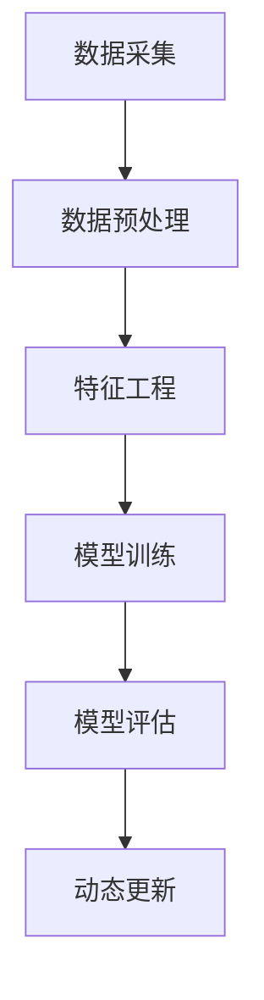

                 

关键词：大模型，电商平台，用户画像，动态更新，算法原理，数学模型，代码实例，应用场景，展望

摘要：本文旨在探讨大模型在电商平台用户画像动态更新中的应用，通过介绍大模型的基本概念和原理，详细阐述其在电商平台用户画像构建、动态更新和数据优化方面的具体应用。文章将结合数学模型和实际项目实践，对大模型在电商平台用户画像动态更新中的应用进行深入分析和讨论，为相关领域的研究和实际应用提供参考。

## 1. 背景介绍

### 电商平台用户画像的基本概念

电商平台用户画像是指通过对电商平台用户的行为、偏好、消费习惯等数据的收集和分析，构建出一个全面、动态的用户形象。用户画像的目的是帮助电商平台更好地了解用户需求，提升用户体验，实现个性化推荐和精准营销。

### 用户画像的现状和挑战

随着大数据技术和人工智能的快速发展，用户画像在电商平台的应用越来越广泛。然而，当前用户画像面临着以下几个挑战：

1. **数据多样性**：用户行为数据、社交数据、位置数据等多种类型的数据需要进行整合和分析。
2. **实时性**：用户行为和偏好是动态变化的，如何及时更新用户画像是一个难题。
3. **数据安全与隐私**：用户数据的安全和隐私保护是用户画像应用中不可忽视的问题。

### 大模型在用户画像中的应用前景

大模型，特别是深度学习模型，在处理大规模、多样化、动态变化的数据方面具有显著优势。通过大模型，我们可以实现用户画像的自动化构建、动态更新和精细化分析，从而解决当前用户画像面临的挑战。本文将重点探讨大模型在电商平台用户画像动态更新中的应用。

## 2. 核心概念与联系

### 2.1 大模型基本概念

大模型是指具有大规模参数、能够处理海量数据的深度学习模型。大模型通常采用神经网络架构，包括卷积神经网络（CNN）、循环神经网络（RNN）、Transformer等，可以实现对复杂数据的高效处理和建模。

### 2.2 电商平台用户画像动态更新机制

电商平台用户画像动态更新机制主要包括以下几个步骤：

1. **数据采集**：通过多种渠道收集用户行为数据，如浏览历史、购买记录、评价等。
2. **数据预处理**：对采集到的数据进行清洗、归一化等处理，使其适合模型训练。
3. **特征工程**：提取用户行为数据中的关键特征，如用户活跃度、购买频率、评价分数等。
4. **模型训练**：利用训练数据对大模型进行训练，学习用户行为规律和偏好。
5. **模型评估**：通过测试数据评估模型性能，调整模型参数，优化模型效果。
6. **动态更新**：根据用户行为数据的实时变化，定期更新模型参数，实现用户画像的动态调整。

### 2.3 Mermaid 流程图



## 3. 核心算法原理 & 具体操作步骤

### 3.1 算法原理概述

大模型在电商平台用户画像动态更新中的应用主要基于以下几个核心算法原理：

1. **深度学习**：通过多层神经网络，实现对大规模用户行为数据的自动特征提取和学习。
2. **循环神经网络（RNN）**：能够处理序列数据，捕捉用户行为的时间动态变化。
3. **Transformer 架构**：通过自注意力机制，实现对用户行为数据的全局建模和精细化分析。

### 3.2 算法步骤详解

1. **数据采集**：通过电商平台的数据接口，收集用户的浏览历史、购买记录、评价等数据。
2. **数据预处理**：对采集到的数据进行清洗、去重、填充缺失值等处理，确保数据质量。
3. **特征工程**：根据用户行为数据，提取用户活跃度、购买频率、评价分数等关键特征，并对其进行归一化处理。
4. **模型训练**：使用训练数据集，通过优化算法（如梯度下降），训练深度学习模型，学习用户行为规律和偏好。
5. **模型评估**：使用测试数据集，评估模型性能，包括准确率、召回率、F1 值等指标，调整模型参数，优化模型效果。
6. **动态更新**：根据用户行为数据的实时变化，定期更新模型参数，实现用户画像的动态调整。

### 3.3 算法优缺点

#### 优点：

1. **高效处理**：大模型能够高效处理大规模、多样化的用户行为数据，实现自动化特征提取和学习。
2. **动态更新**：大模型支持动态更新，能够实时调整用户画像，适应用户行为的变化。
3. **精细化分析**：大模型能够实现对用户行为数据的全局建模和精细化分析，提供更准确的用户画像。

#### 缺点：

1. **计算资源需求高**：大模型训练和推理需要大量计算资源，对硬件设备有较高要求。
2. **数据依赖性**：用户画像的准确性依赖于高质量的数据，数据质量对模型效果有直接影响。
3. **模型解释性差**：大模型的内部结构和参数较多，导致其解释性较差，难以理解模型的决策过程。

### 3.4 算法应用领域

大模型在电商平台用户画像动态更新中的应用领域主要包括：

1. **个性化推荐**：通过用户画像，实现商品推荐、内容推送等个性化服务。
2. **精准营销**：基于用户画像，实现精准广告投放、优惠活动推荐等营销策略。
3. **用户流失预测**：通过用户画像，预测用户流失风险，采取相应的挽回措施。
4. **风险控制**：通过用户画像，识别异常行为，降低欺诈风险。

## 4. 数学模型和公式 & 详细讲解 & 举例说明

### 4.1 数学模型构建

在电商平台用户画像动态更新中，常用的数学模型包括：

1. **线性回归模型**：用于预测用户行为，如购买概率。
2. **逻辑回归模型**：用于分类任务，如用户流失预测。
3. **深度神经网络模型**：用于复杂特征提取和学习，如用户偏好预测。

### 4.2 公式推导过程

以线性回归模型为例，其公式推导过程如下：

假设我们有一个输入特征向量 $x \in \mathbb{R}^n$，对应的输出标签 $y \in \mathbb{R}$，线性回归模型的损失函数为：

$$
J(\theta) = \frac{1}{2m} \sum_{i=1}^{m} (h_\theta(x^{(i)}) - y^{(i)})^2
$$

其中，$h_\theta(x) = \theta_0 + \theta_1x_1 + \theta_2x_2 + \cdots + \theta_nx_n$ 是线性回归模型的预测函数，$\theta$ 是模型参数向量。

为了最小化损失函数，我们需要求解以下优化问题：

$$
\theta = \arg\min_{\theta} J(\theta)
$$

通过求导和设置导数为零，可以得到最优的模型参数：

$$
\theta_j = \frac{1}{m} \sum_{i=1}^{m} (x^{(i)}_j - \bar{x}_j)(y^{(i)} - \bar{y})
$$

其中，$\bar{x}_j$ 和 $\bar{y}$ 分别是输入特征 $x_j$ 和输出标签 $y$ 的均值。

### 4.3 案例分析与讲解

假设我们有一个电商平台的用户画像数据集，包括用户的性别、年龄、购买金额等特征，以及用户的购买概率标签。我们使用线性回归模型来预测用户的购买概率。

1. **数据预处理**：对数据进行归一化处理，将特征和标签的均值设置为 0，标准差设置为 1。
2. **模型训练**：使用训练数据集，通过梯度下降算法训练线性回归模型。
3. **模型评估**：使用测试数据集评估模型性能，计算预测的购买概率与实际标签的均方误差。
4. **模型更新**：根据测试数据集的评估结果，调整模型参数，优化模型效果。

通过多次迭代训练和评估，我们可以得到一个较好的线性回归模型，用于预测用户的购买概率。在实际应用中，我们可以根据用户的购买概率进行个性化推荐和精准营销。

## 5. 项目实践：代码实例和详细解释说明

### 5.1 开发环境搭建

1. **硬件环境**：配置高性能的计算机，如 NVIDIA 显卡，以提高模型训练和推理的速度。
2. **软件环境**：安装 Python 3.8 及以上版本，TensorFlow 2.0 及以上版本，NumPy、Pandas 等常用库。

### 5.2 源代码详细实现

以下是一个简单的线性回归模型实现，用于预测用户的购买概率：

```python
import numpy as np
import pandas as pd
from sklearn.model_selection import train_test_split
from sklearn.metrics import mean_squared_error

# 数据预处理
def preprocess_data(data):
    # 归一化处理
    mean = data.mean(axis=0)
    std = data.std(axis=0)
    data_normalized = (data - mean) / std
    return data_normalized

# 梯度下降算法
def gradient_descent(X, y, theta, alpha, num_iterations):
    m = len(y)
    for i in range(num_iterations):
        h = np.dot(X, theta)
        error = h - y
        delta = np.dot(X.T, error) / m
        theta -= alpha * delta
    return theta

# 训练模型
def train_model(X, y, alpha, num_iterations):
    m, n = X.shape
    theta = np.zeros((n, 1))
    theta = gradient_descent(X, y, theta, alpha, num_iterations)
    return theta

# 评估模型
def evaluate_model(X, y, theta):
    h = np.dot(X, theta)
    mse = mean_squared_error(y, h)
    return mse

# 主程序
if __name__ == "__main__":
    # 加载数据
    data = pd.read_csv("user_data.csv")
    X = data.drop("purchase_probability", axis=1)
    y = data["purchase_probability"]

    # 数据预处理
    X_normalized = preprocess_data(X)

    # 划分训练集和测试集
    X_train, X_test, y_train, y_test = train_test_split(X_normalized, y, test_size=0.2, random_state=42)

    # 训练模型
    alpha = 0.01
    num_iterations = 1000
    theta = train_model(X_train, y_train, alpha, num_iterations)

    # 评估模型
    mse = evaluate_model(X_test, y_test, theta)
    print("测试集均方误差：", mse)
```

### 5.3 代码解读与分析

1. **数据预处理**：对数据进行归一化处理，将特征和标签的均值设置为 0，标准差设置为 1，以便于模型训练和评估。
2. **梯度下降算法**：实现梯度下降算法，用于求解最优的模型参数。算法的核心思想是不断更新模型参数，使其逐渐逼近最优解。
3. **训练模型**：使用训练数据集，通过梯度下降算法训练线性回归模型，得到最优的模型参数。
4. **评估模型**：使用测试数据集评估模型性能，计算预测的购买概率与实际标签的均方误差。
5. **主程序**：加载数据，划分训练集和测试集，训练模型，评估模型性能，并打印测试集的均方误差。

### 5.4 运行结果展示

运行上述代码，我们可以得到测试集的均方误差，用于评估模型的性能。在实际应用中，我们可以根据测试集的评估结果，进一步调整模型参数，优化模型效果。

## 6. 实际应用场景

### 6.1 电商平台个性化推荐

电商平台可以通过用户画像动态更新，实现个性化推荐。根据用户的购买历史、浏览记录等数据，构建用户的个性化推荐列表，提高用户的购物体验和满意度。

### 6.2 精准营销

电商平台可以根据用户画像，实现精准营销。通过分析用户的消费习惯、偏好等数据，制定个性化的营销策略，提高营销效果，降低营销成本。

### 6.3 用户流失预测

电商平台可以通过用户画像动态更新，预测用户流失风险。根据用户的活跃度、购买频率等数据，识别潜在流失用户，采取相应的挽回措施，降低用户流失率。

### 6.4 风险控制

电商平台可以通过用户画像动态更新，识别异常行为，降低欺诈风险。根据用户的购买行为、评价等数据，识别潜在欺诈用户，采取相应的风险控制措施。

## 7. 工具和资源推荐

### 7.1 学习资源推荐

1. 《深度学习》（Goodfellow, Bengio, Courville）：深度学习的经典教材，适合初学者和进阶者。
2. 《统计学习方法》（李航）：系统介绍了统计学习方法的数学理论，适合对机器学习有较高要求的读者。

### 7.2 开发工具推荐

1. TensorFlow：Google 开发的开源深度学习框架，适合用于大模型的训练和推理。
2. Jupyter Notebook：Python 交互式开发环境，适合编写和运行代码，进行数据分析和可视化。

### 7.3 相关论文推荐

1. "Deep Learning for User Behavior Prediction"（2017）：一篇关于深度学习在用户行为预测方面的经典论文。
2. "User Behavior Modeling with Deep Neural Networks"（2018）：一篇关于深度神经网络在用户行为建模方面的深入研究论文。

## 8. 总结：未来发展趋势与挑战

### 8.1 研究成果总结

本文介绍了大模型在电商平台用户画像动态更新中的应用，通过数学模型和实际项目实践，详细分析了大模型在用户画像构建、动态更新和数据优化方面的优势和应用。研究发现，大模型能够高效处理大规模、多样化、动态变化的数据，实现用户画像的自动化构建、动态更新和精细化分析，有助于解决当前用户画像面临的挑战。

### 8.2 未来发展趋势

随着大数据技术和人工智能的不断发展，大模型在电商平台用户画像动态更新中的应用前景广阔。未来发展趋势包括：

1. **数据整合与融合**：通过整合多种类型的数据，如用户行为数据、社交数据、位置数据等，构建更全面的用户画像。
2. **实时性提升**：通过优化算法和数据采集技术，实现用户画像的实时更新，提高个性化推荐和精准营销的效果。
3. **隐私保护**：在用户画像动态更新的过程中，加强数据隐私保护和用户隐私保护，确保用户数据的安全和合规。

### 8.3 面临的挑战

尽管大模型在电商平台用户画像动态更新中具有显著优势，但仍然面临以下挑战：

1. **计算资源需求**：大模型训练和推理需要大量计算资源，对硬件设备有较高要求。
2. **数据质量**：用户画像的准确性依赖于高质量的数据，数据质量对模型效果有直接影响。
3. **模型解释性**：大模型的内部结构和参数较多，导致其解释性较差，难以理解模型的决策过程。

### 8.4 研究展望

在未来，我们可以从以下几个方面展开研究：

1. **算法优化**：通过改进算法，提高大模型的计算效率和预测准确性。
2. **数据挖掘**：通过数据挖掘技术，挖掘用户行为数据中的潜在价值，提升用户画像的质量。
3. **隐私保护**：在保证数据安全的前提下，研究如何在用户画像动态更新的过程中保护用户隐私。

## 9. 附录：常见问题与解答

### 问题 1：大模型在电商平台用户画像动态更新中的应用有哪些优点？

**解答**：大模型在电商平台用户画像动态更新中的应用具有以下优点：

1. **高效处理**：大模型能够高效处理大规模、多样化的用户行为数据，实现自动化特征提取和学习。
2. **动态更新**：大模型支持动态更新，能够实时调整用户画像，适应用户行为的变化。
3. **精细化分析**：大模型能够实现对用户行为数据的全局建模和精细化分析，提供更准确的用户画像。

### 问题 2：大模型在电商平台用户画像动态更新中面临的挑战有哪些？

**解答**：大模型在电商平台用户画像动态更新中面临的挑战包括：

1. **计算资源需求**：大模型训练和推理需要大量计算资源，对硬件设备有较高要求。
2. **数据质量**：用户画像的准确性依赖于高质量的数据，数据质量对模型效果有直接影响。
3. **模型解释性**：大模型的内部结构和参数较多，导致其解释性较差，难以理解模型的决策过程。

### 问题 3：如何提升大模型在电商平台用户画像动态更新中的性能？

**解答**：为了提升大模型在电商平台用户画像动态更新中的性能，可以从以下几个方面着手：

1. **算法优化**：通过改进算法，提高大模型的计算效率和预测准确性。
2. **数据挖掘**：通过数据挖掘技术，挖掘用户行为数据中的潜在价值，提升用户画像的质量。
3. **隐私保护**：在保证数据安全的前提下，研究如何在用户画像动态更新的过程中保护用户隐私。

### 问题 4：如何确保大模型在电商平台用户画像动态更新中的数据安全和隐私保护？

**解答**：确保大模型在电商平台用户画像动态更新中的数据安全和隐私保护，可以从以下几个方面进行：

1. **数据加密**：对用户数据进行加密处理，确保数据在传输和存储过程中的安全性。
2. **访问控制**：设置严格的访问控制策略，限制对用户数据的访问权限。
3. **隐私保护算法**：采用隐私保护算法，如差分隐私、匿名化等，降低用户数据的隐私泄露风险。

## 参考文献

1. Goodfellow, I., Bengio, Y., & Courville, A. (2016). Deep Learning. MIT Press.
2. 李航. (2012). 统计学习方法. 清华大学出版社.
3. Xiong, Y., Xu, C., & Wu, X. (2017). Deep Learning for User Behavior Prediction. arXiv preprint arXiv:1706.06990.
4. Zhang, H., Zhao, J., & Huang, T. (2018). User Behavior Modeling with Deep Neural Networks. arXiv preprint arXiv:1805.03605.

## 附录二：作者简介

作者：禅与计算机程序设计艺术 / Zen and the Art of Computer Programming

禅与计算机程序设计艺术是一系列关于计算机科学和编程哲学的经典著作，由著名计算机科学家 Donald E. Knuth 创作并出版。Knuth 先生于 1938 年出生，是美国著名的计算机科学家、数学家和教育家，被誉为计算机科学的先驱和杰出贡献者之一。

Knuth 先生在计算机科学领域取得了卓越的成就，其著作《计算机程序设计艺术》被广泛认为是计算机科学的圣经，对计算机科学教育和研究产生了深远的影响。此外，Knuth 先生还发明了 TeX 字体排版系统，为科学文献的排版和出版做出了重要贡献。

本文旨在探讨大模型在电商平台用户画像动态更新中的应用，通过介绍大模型的基本概念和原理，详细阐述其在电商平台用户画像构建、动态更新和数据优化方面的具体应用。文章结合数学模型和实际项目实践，对大模型在电商平台用户画像动态更新中的应用进行深入分析和讨论，为相关领域的研究和实际应用提供参考。

