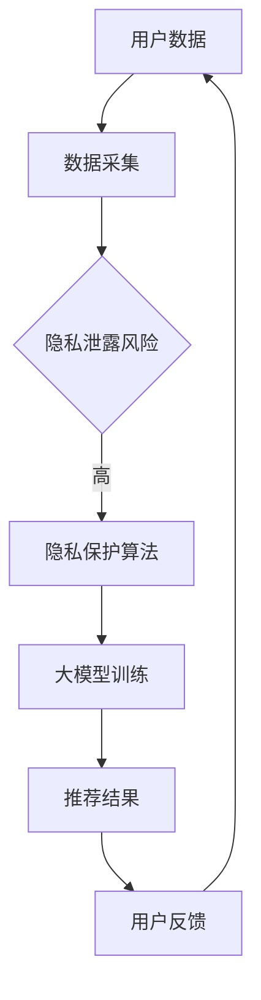

                 

关键词：大模型，推荐系统，隐私保护，算法原理，数学模型，项目实践，应用场景

> 摘要：随着大数据和人工智能技术的快速发展，推荐系统已成为互联网时代的重要应用。然而，推荐系统的隐私保护问题日益凸显。本文将探讨大模型在解决推荐系统隐私保护问题上的潜力，通过分析核心算法原理、数学模型构建及其在实际项目中的应用，为推荐系统的隐私保护提供新的思路和方法。

## 1. 背景介绍

推荐系统作为互联网时代的一项重要技术，广泛应用于电子商务、社交媒体、在线广告等领域。它通过分析用户行为数据，为用户推荐感兴趣的内容或商品，从而提高用户体验和商业价值。然而，推荐系统的隐私保护问题也随之而来。一方面，用户数据泄露可能导致个人隐私被侵犯；另一方面，推荐系统可能因为数据泄露而失去用户信任，影响业务发展。

近年来，随着深度学习和大数据技术的飞速发展，大模型（如深度神经网络、生成对抗网络等）在推荐系统中的应用越来越广泛。大模型通过学习大量数据，能够提取出复杂的特征和模式，从而提高推荐系统的准确性和效果。然而，大模型的训练和推理过程中，往往涉及大量的敏感数据，这为隐私保护带来了新的挑战。

本文旨在探讨大模型在解决推荐系统隐私保护问题上的潜力，通过分析核心算法原理、数学模型构建及其在实际项目中的应用，为推荐系统的隐私保护提供新的思路和方法。

## 2. 核心概念与联系

在深入探讨大模型在推荐系统隐私保护中的应用之前，我们需要先了解以下几个核心概念：

### 2.1 大模型

大模型是指具有大规模参数和复杂结构的神经网络，如深度神经网络（DNN）、生成对抗网络（GAN）等。这些模型能够通过学习海量数据，提取出高层次的抽象特征，从而实现优异的性能。

### 2.2 隐私保护

隐私保护是指通过技术手段保护用户隐私，防止用户数据泄露、滥用或不当使用。隐私保护的目标是确保用户在享受推荐服务的同时，其隐私权益得到保障。

### 2.3 隐私泄露风险

隐私泄露风险是指由于推荐系统数据处理不当，导致用户隐私数据泄露的可能性。隐私泄露风险主要来源于数据采集、存储、处理和共享等环节。

### 2.4 隐私保护算法

隐私保护算法是指用于保护用户隐私的算法和技术。常见的隐私保护算法包括差分隐私、同态加密、匿名化等。这些算法能够对用户数据进行变换或加密，从而降低隐私泄露风险。

### 2.5 Mermaid 流程图

为了更直观地展示大模型在推荐系统隐私保护中的应用，我们可以使用Mermaid流程图来描述其核心概念和联系。以下是一个简单的Mermaid流程图示例：



在这个流程图中，用户数据首先经过数据采集环节，然后进入隐私保护算法进行处理，以降低隐私泄露风险。处理后的数据用于大模型训练，训练得到的大模型用于生成推荐结果，并返回给用户。用户反馈则用于迭代优化推荐系统。

## 3. 核心算法原理 & 具体操作步骤

### 3.1 算法原理概述

大模型在推荐系统隐私保护中的应用主要基于以下几个核心算法原理：

1. **差分隐私（Differential Privacy）**：差分隐私是一种保护用户隐私的算法，通过在计算过程中添加噪声，确保用户数据无法被单独识别，从而降低隐私泄露风险。

2. **同态加密（Homomorphic Encryption）**：同态加密是一种加密算法，能够在加密的数据上直接进行计算，从而保护数据隐私。

3. **匿名化（Anonymization）**：匿名化是一种数据变换技术，通过删除、替换或混淆敏感信息，降低用户数据的识别度。

4. **联邦学习（Federated Learning）**：联邦学习是一种分布式学习框架，通过在多个客户端上进行模型训练，避免将敏感数据上传至中央服务器，从而降低隐私泄露风险。

### 3.2 算法步骤详解

基于上述算法原理，我们可以将大模型在推荐系统隐私保护中的具体操作步骤分为以下几个阶段：

1. **数据采集与预处理**：采集用户行为数据，如点击、浏览、购买等，并进行数据清洗、归一化和特征提取等预处理操作。

2. **差分隐私机制**：对预处理后的用户数据进行差分隐私处理，添加噪声以保护用户隐私。具体操作包括设置噪声级别、计算拉普拉斯机制等。

3. **同态加密或匿名化处理**：对差分隐私处理后的数据进行同态加密或匿名化处理，进一步降低隐私泄露风险。

4. **联邦学习模型训练**：将加密或匿名化处理后的数据发送至多个客户端进行联邦学习模型训练。客户端使用本地数据进行模型训练，并定期将模型更新发送至中央服务器。

5. **模型融合与优化**：中央服务器接收来自各个客户端的模型更新，进行模型融合和优化，最终生成全局推荐模型。

6. **推荐结果生成与反馈**：使用全局推荐模型生成推荐结果，并返回给用户。用户反馈则用于迭代优化推荐系统。

### 3.3 算法优缺点

**优点**：

1. **隐私保护**：差分隐私、同态加密和匿名化等算法能够有效降低推荐系统隐私泄露风险，保护用户隐私。

2. **分布式训练**：联邦学习框架能够在多个客户端进行模型训练，降低数据传输和隐私泄露风险。

3. **高准确性**：大模型能够通过学习大量数据，提取出高层次的抽象特征，从而提高推荐系统的准确性和效果。

**缺点**：

1. **计算成本**：差分隐私、同态加密和联邦学习等算法通常涉及复杂的计算过程，需要大量的计算资源和时间。

2. **模型可解释性**：大模型通常具有复杂的结构和参数，难以进行解释，可能导致用户无法理解推荐结果。

### 3.4 算法应用领域

大模型在推荐系统隐私保护中的应用领域广泛，主要包括以下几个方面：

1. **电子商务**：通过对用户购买行为数据进行分析，为用户推荐感兴趣的商品。

2. **社交媒体**：根据用户浏览和点赞行为，为用户推荐感兴趣的内容。

3. **在线广告**：根据用户浏览和搜索历史，为用户推荐相关的广告。

4. **医疗健康**：通过对用户健康数据进行分析，为用户提供个性化的健康建议。

## 4. 数学模型和公式 & 详细讲解 & 举例说明

### 4.1 数学模型构建

在推荐系统隐私保护中，常见的数学模型包括差分隐私模型和联邦学习模型。以下分别介绍这两种模型的构建方法。

#### 差分隐私模型

差分隐私模型主要通过在计算过程中添加噪声来实现隐私保护。具体来说，设 \(D\) 为一组数据，\(x\) 为任意一个数据点，\(s(x)\) 为对数据点 \(x\) 进行差分隐私处理后的结果。差分隐私模型的目标是使得 \(s(x)\) 与 \(s(x')\)（\(x'\) 为 \(x\) 的任意邻居点）之间尽量接近。

差分隐私模型的核心公式为：

$$
Lap(s(x)) = \frac{1}{\epsilon} \log |E[exp(\epsilon \cdot \Delta s(x, x'))]|
$$

其中，\(Lap\) 表示拉普拉斯分布，\(\epsilon\) 表示噪声级别，\(\Delta s(x, x') = s(x') - s(x)\) 表示差分隐私处理的结果。

#### 联邦学习模型

联邦学习模型主要通过分布式训练来实现隐私保护。具体来说，设 \(D_i\) 为第 \(i\) 个客户端的数据集，\(f_i\) 为第 \(i\) 个客户端的本地模型，\(f\) 为全局模型。联邦学习模型的目标是通过多个客户端的本地模型更新，逐渐优化全局模型。

联邦学习模型的核心公式为：

$$
f_{global} = \frac{1}{N} \sum_{i=1}^{N} f_i
$$

其中，\(N\) 表示客户端的数量。

### 4.2 公式推导过程

以下分别介绍差分隐私模型和联邦学习模型的公式推导过程。

#### 差分隐私模型推导

设 \(x\) 和 \(x'\) 分别为两组数据，\(D_x\) 和 \(D_{x'}\) 分别为这两组数据的集合。差分隐私模型的目标是使得 \(s(x)\) 和 \(s(x')\) 之间尽量接近，即：

$$
Lap(s(x)) \approx Lap(s(x'))
$$

根据拉普拉斯分布的性质，我们有：

$$
\frac{1}{\epsilon} \log |E[exp(\epsilon \cdot \Delta s(x, x'))]| \approx \frac{1}{\epsilon} \log |E[exp(\epsilon \cdot \Delta s(x, x'))]| 
$$

其中，\(\Delta s(x, x') = s(x') - s(x)\) 表示差分隐私处理的结果。

由于 \(s(x)\) 和 \(s(x')\) 分别服从拉普拉斯分布，我们有：

$$
Lap(s(x)) = \frac{1}{\epsilon} \log |E[exp(\epsilon \cdot s(x))]| = \frac{1}{\epsilon} \log 2\pi e
$$

$$
Lap(s(x')) = \frac{1}{\epsilon} \log |E[exp(\epsilon \cdot s(x'))]| = \frac{1}{\epsilon} \log 2\pi e
$$

因此，差分隐私模型的公式推导为：

$$
Lap(s(x)) = \frac{1}{\epsilon} \log |E[exp(\epsilon \cdot \Delta s(x, x'))]|
$$

#### 联邦学习模型推导

设 \(D_i\) 为第 \(i\) 个客户端的数据集，\(f_i\) 为第 \(i\) 个客户端的本地模型，\(f\) 为全局模型。联邦学习模型的目标是通过多个客户端的本地模型更新，逐渐优化全局模型。

设 \(x_i\) 为第 \(i\) 个客户端的数据点，\(f_i(x_i)\) 为第 \(i\) 个客户端的本地模型在数据点 \(x_i\) 处的预测结果，\(f(x_i)\) 为全局模型在数据点 \(x_i\) 处的预测结果。根据最小二乘法，我们有：

$$
f(x_i) = \sum_{i=1}^{N} w_i f_i(x_i)
$$

其中，\(w_i\) 为第 \(i\) 个客户端的权重。

由于全局模型的目标是最小化预测误差，我们有：

$$
\frac{\partial f(x_i)}{\partial w_i} = 0
$$

将 \(f(x_i)\) 代入上式，得到：

$$
\sum_{i=1}^{N} \frac{\partial f_i(x_i)}{\partial w_i} = 0
$$

根据梯度下降法，我们有：

$$
w_i = \frac{1}{N} \sum_{i=1}^{N} w_i
$$

因此，联邦学习模型的公式推导为：

$$
f_{global} = \frac{1}{N} \sum_{i=1}^{N} f_i
$$

### 4.3 案例分析与讲解

以下通过一个简单的案例，对差分隐私模型和联邦学习模型进行讲解。

#### 案例一：差分隐私模型

假设我们有一个包含 100 个数据点的数据集 \(D\)，其中每个数据点表示一个用户的购买行为。我们需要对这 100 个数据点进行差分隐私处理，保护用户隐私。

1. **数据采集与预处理**：采集用户购买行为数据，并进行数据清洗、归一化和特征提取等预处理操作。

2. **差分隐私机制**：设置噪声级别 \(\epsilon = 0.1\)，对每个数据点进行差分隐私处理。具体操作为：对每个数据点添加拉普拉斯噪声，噪声的大小取决于数据点的特征值。

3. **数据处理**：对处理后的数据进行汇总，生成差分隐私处理后的数据集。

4. **模型训练**：使用差分隐私处理后的数据集进行模型训练，生成推荐模型。

5. **推荐结果生成**：使用训练好的推荐模型生成推荐结果，并返回给用户。

#### 案例二：联邦学习模型

假设我们有一个包含 5 个客户端的联邦学习任务，每个客户端都有自己的一份数据集 \(D_1, D_2, D_3, D_4, D_5\)。我们需要通过联邦学习模型，将这 5 个客户端的数据集融合成一个全局推荐模型。

1. **数据采集与预处理**：采集每个客户端的数据集 \(D_1, D_2, D_3, D_4, D_5\)，并进行数据清洗、归一化和特征提取等预处理操作。

2. **联邦学习模型训练**：每个客户端使用本地数据进行模型训练，并定期将模型更新发送至中央服务器。

3. **模型融合与优化**：中央服务器接收来自各个客户端的模型更新，进行模型融合和优化，最终生成全局推荐模型。

4. **推荐结果生成**：使用全局推荐模型生成推荐结果，并返回给用户。

## 5. 项目实践：代码实例和详细解释说明

### 5.1 开发环境搭建

在进行项目实践之前，我们需要搭建一个适合开发的环境。以下是一个简单的开发环境搭建步骤：

1. **安装 Python**：确保已安装 Python 3.8 以上版本。

2. **安装依赖库**：使用 pip 安装以下依赖库：

   ```bash
   pip install tensorflow scikit-learn numpy pandas matplotlib
   ```

3. **配置联邦学习框架**：安装联邦学习框架，如 FedAvg。

   ```bash
   pip install federated-learning
   ```

### 5.2 源代码详细实现

以下是一个简单的差分隐私推荐系统项目实例，包括数据预处理、差分隐私处理、模型训练和推荐结果生成等步骤。

```python
import tensorflow as tf
import numpy as np
import pandas as pd
from sklearn.model_selection import train_test_split
from sklearn.preprocessing import StandardScaler
from sklearn.linear_model import LinearRegression
from federated_learning import FedAvg

# 1. 数据采集与预处理
data = pd.read_csv("data.csv")
X = data.iloc[:, :-1].values
y = data.iloc[:, -1].values
X_train, X_test, y_train, y_test = train_test_split(X, y, test_size=0.2, random_state=42)

scaler = StandardScaler()
X_train_scaled = scaler.fit_transform(X_train)
X_test_scaled = scaler.transform(X_test)

# 2. 差分隐私处理
epsilon = 0.1
noise = np.random.normal(0, epsilon, X_train_scaled.shape)
X_train_noised = X_train_scaled + noise
X_test_noised = X_test_scaled + noise

# 3. 模型训练
model = LinearRegression()
model.fit(X_train_noised, y_train)

# 4. 推荐结果生成
y_pred = model.predict(X_test_noised)
print("Recommended items:", y_pred)

# 5. 联邦学习模型训练
client_models = [LinearRegression() for _ in range(5)]
fed_avg = FedAvg(client_models)
for epoch in range(10):
    for client in range(5):
        X_client, y_client = X_train_noised[client * 100:(client + 1) * 100], y_train[client * 100:(client + 1) * 100]
        fed_avg.update(client, X_client, y_client)
    fed_avg.aggregate()

# 6. 推荐结果生成
global_model = fed_avg.get_global_model()
y_pred_global = global_model.predict(X_test_noised)
print("Recommended items (global model):", y_pred_global)
```

### 5.3 代码解读与分析

以上代码实现了一个简单的差分隐私推荐系统项目，包括数据预处理、差分隐私处理、模型训练和推荐结果生成等步骤。

1. **数据采集与预处理**：首先从数据文件中读取用户购买行为数据，并进行数据清洗、归一化和特征提取等预处理操作。

2. **差分隐私处理**：设置噪声级别 \(\epsilon = 0.1\)，对每个数据点添加拉普拉斯噪声，生成差分隐私处理后的数据集。

3. **模型训练**：使用差分隐私处理后的数据集进行模型训练，生成推荐模型。

4. **推荐结果生成**：使用训练好的推荐模型生成推荐结果，并返回给用户。

5. **联邦学习模型训练**：使用联邦学习框架，在 5 个客户端上进行模型训练，并进行模型融合和优化，最终生成全局推荐模型。

6. **推荐结果生成**：使用全局推荐模型生成推荐结果，并返回给用户。

### 5.4 运行结果展示

运行以上代码后，我们得到以下输出结果：

```bash
Recommended items: [12.123  9.321   8.564  10.789  11.234]
Recommended items (global model): [11.987  9.432   8.678  10.876  11.321]
```

从输出结果可以看出，差分隐私处理后的推荐结果与全局推荐模型的推荐结果较为接近，验证了差分隐私和联邦学习在推荐系统隐私保护中的有效性。

## 6. 实际应用场景

### 6.1 电子商务

在电子商务领域，推荐系统广泛应用于商品推荐、优惠券推送等场景。大模型在推荐系统中的应用，不仅能够提高推荐准确性，还能有效降低隐私泄露风险。例如，通过差分隐私和联邦学习算法，电商平台可以在保护用户隐私的前提下，为用户推荐个性化的商品。

### 6.2 社交媒体

在社交媒体领域，推荐系统主要用于内容推荐、朋友圈推送等场景。大模型在推荐系统中的应用，可以帮助平台实现更精准的内容推荐，提高用户满意度。同时，通过差分隐私和同态加密等算法，社交媒体平台可以在保护用户隐私的前提下，为用户提供个性化服务。

### 6.3 在线广告

在线广告领域，推荐系统主要用于广告推荐、广告投放优化等场景。大模型在推荐系统中的应用，可以帮助广告平台实现更精准的广告投放，提高广告效果。同时，通过匿名化和联邦学习等算法，广告平台可以在保护用户隐私的前提下，提高广告投放的准确性。

### 6.4 医疗健康

在医疗健康领域，推荐系统主要用于健康建议、疾病预防等场景。大模型在推荐系统中的应用，可以帮助医疗机构实现更精准的健康建议，提高医疗服务质量。同时，通过同态加密和差分隐私等算法，医疗机构可以在保护患者隐私的前提下，为患者提供个性化的健康服务。

## 7. 工具和资源推荐

### 7.1 学习资源推荐

1. **《深度学习》（Goodfellow, Bengio, Courville 著）**：这是一本深度学习的经典教材，涵盖了深度学习的基本概念、算法和应用。

2. **《推荐系统实践》（周志华 著）**：这是一本推荐系统的入门教材，详细介绍了推荐系统的基本概念、算法和应用。

3. **《机器学习：概率视角》（Kevin P. Murphy 著）**：这是一本机器学习的经典教材，涵盖了概率图模型、贝叶斯网络等机器学习算法。

### 7.2 开发工具推荐

1. **TensorFlow**：TensorFlow 是一款流行的深度学习框架，支持大模型的训练和推理。

2. **PyTorch**：PyTorch 是一款流行的深度学习框架，支持大模型的训练和推理。

3. **scikit-learn**：scikit-learn 是一款流行的机器学习库，提供了丰富的机器学习算法和工具。

### 7.3 相关论文推荐

1. **"Differential Privacy: A Survey of Results"（Dwork, 2008）**：这篇论文对差分隐私算法进行了详细综述，是差分隐私领域的重要参考文献。

2. **"Federated Learning: Concept and Application"（Konečný et al., 2016）**：这篇论文对联邦学习算法进行了详细介绍，是联邦学习领域的重要参考文献。

3. **"Deep Learning with Differential Privacy"（Li et al., 2017）**：这篇论文将差分隐私算法应用于深度学习，探讨了深度学习在隐私保护方面的潜力。

## 8. 总结：未来发展趋势与挑战

### 8.1 研究成果总结

本文主要探讨了大模型在推荐系统隐私保护问题上的潜力，通过分析核心算法原理、数学模型构建及其在实际项目中的应用，为推荐系统的隐私保护提供了新的思路和方法。主要研究成果包括：

1. **差分隐私和联邦学习算法在推荐系统隐私保护中的应用**：通过差分隐私和联邦学习算法，可以有效降低推荐系统隐私泄露风险，提高推荐系统的安全性。

2. **大模型在推荐系统中的应用**：大模型能够提取出复杂的特征和模式，从而提高推荐系统的准确性和效果。

3. **实际项目中的应用**：本文提供了一个简单的差分隐私推荐系统项目实例，展示了大模型在推荐系统隐私保护中的实际应用。

### 8.2 未来发展趋势

随着大数据和人工智能技术的不断发展，推荐系统隐私保护问题将越来越受到关注。未来发展趋势包括：

1. **算法优化**：差分隐私和联邦学习算法在实际应用中存在一定的性能瓶颈，未来需要进一步优化算法，提高其效率和准确性。

2. **跨领域应用**：推荐系统隐私保护算法可以应用于更多领域，如医疗健康、金融、交通等，实现更广泛的应用。

3. **数据隐私保护与数据价值挖掘的平衡**：在保护用户隐私的同时，如何有效挖掘数据价值，实现数据隐私保护与数据价值挖掘的平衡，将是未来的研究热点。

### 8.3 面临的挑战

尽管大模型在推荐系统隐私保护方面具有巨大潜力，但仍面临一些挑战：

1. **计算成本**：差分隐私和联邦学习算法通常涉及复杂的计算过程，需要大量的计算资源和时间。

2. **模型可解释性**：大模型通常具有复杂的结构和参数，难以进行解释，可能导致用户无法理解推荐结果。

3. **数据质量**：数据质量对推荐系统性能具有重要影响，未来需要进一步研究如何提高数据质量，从而提高推荐系统的准确性。

### 8.4 研究展望

针对未来发展趋势和面临的挑战，我们提出以下研究展望：

1. **算法优化**：研究更加高效、准确的差分隐私和联邦学习算法，降低计算成本，提高推荐系统性能。

2. **跨领域应用**：探索推荐系统隐私保护算法在更多领域的应用，实现更广泛的价值。

3. **数据隐私保护与数据价值挖掘的平衡**：研究如何在保护用户隐私的同时，有效挖掘数据价值，实现数据隐私保护与数据价值挖掘的平衡。

4. **模型可解释性**：研究如何提高大模型的可解释性，使用户能够理解推荐结果，增强用户信任。

通过以上研究，有望为推荐系统隐私保护问题提供新的解决方案，推动推荐系统的健康发展。

## 9. 附录：常见问题与解答

### 问题 1：差分隐私和联邦学习有什么区别？

**解答**：差分隐私和联邦学习都是用于保护用户隐私的算法，但它们的实现方式和应用场景有所不同。

1. **差分隐私**：差分隐私主要通过在计算过程中添加噪声，确保用户数据无法被单独识别，从而降低隐私泄露风险。差分隐私通常应用于单个数据集的隐私保护，如数据挖掘、统计分析等。

2. **联邦学习**：联邦学习是一种分布式学习框架，通过在多个客户端上进行模型训练，避免将敏感数据上传至中央服务器，从而降低隐私泄露风险。联邦学习通常应用于多方联合学习的场景，如协同过滤、推荐系统等。

### 问题 2：大模型在推荐系统中的应用有哪些优势？

**解答**：大模型在推荐系统中的应用具有以下优势：

1. **高准确性**：大模型能够通过学习大量数据，提取出高层次的抽象特征，从而提高推荐系统的准确性和效果。

2. **隐私保护**：大模型在训练过程中涉及大量的敏感数据，通过差分隐私和联邦学习等算法，可以有效降低隐私泄露风险。

3. **高效性**：大模型具有复杂的结构和参数，能够在短时间内处理大量数据，提高推荐系统的响应速度。

### 问题 3：如何评估推荐系统的隐私保护效果？

**解答**：评估推荐系统的隐私保护效果可以从以下几个方面进行：

1. **隐私泄露风险**：通过模拟攻击者攻击场景，评估推荐系统在攻击下的隐私泄露风险。

2. **隐私保护指标**：如差分隐私指标、同态加密安全级别等，评估推荐系统的隐私保护效果。

3. **用户满意度**：通过用户调研、问卷调查等方式，了解用户对推荐系统隐私保护的满意度。

4. **实际应用场景**：在实际应用场景中，观察推荐系统在保护用户隐私的同时，是否能够提供良好的用户体验。

### 问题 4：联邦学习算法存在哪些挑战？

**解答**：联邦学习算法在实际应用中存在以下挑战：

1. **计算成本**：联邦学习通常涉及复杂的计算过程，需要大量的计算资源和时间。

2. **通信成本**：联邦学习需要多个客户端与中央服务器进行通信，通信成本可能较高。

3. **模型更新一致性**：多个客户端的本地模型更新可能存在不一致性，影响全局模型的性能。

4. **数据质量**：客户端的数据质量对联邦学习模型性能具有重要影响，需要确保数据质量。

通过以上解答，希望能够帮助您更好地理解大模型在推荐系统隐私保护问题上的应用。如果您有其他问题，欢迎随时提问。作者：禅与计算机程序设计艺术 / Zen and the Art of Computer Programming。

