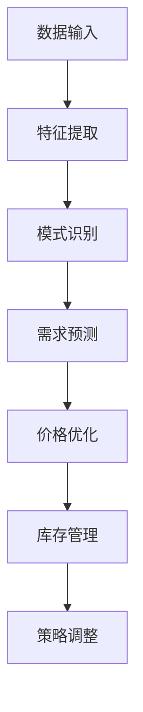

                 

关键词：大模型，电商平台，商品上新策略，优化，机器学习，人工智能

> 摘要：本文将探讨如何利用大模型优化电商平台的商品上新策略。通过深入分析大模型的原理和应用，本文将提出一种基于大模型的商品上新策略优化方法，并通过实际案例分析，展示该方法在提高商品销量、降低库存风险等方面的显著效果。

## 1. 背景介绍

随着互联网的快速发展，电商平台已经成为现代零售业的重要组成部分。在电商平台上，商品上新策略的优化对于企业的经营业绩有着至关重要的影响。商品上新策略涉及商品选择、上架时间、价格策略等多个方面，其核心目标是提高商品销量，降低库存风险，从而提升电商平台的市场竞争力。

然而，传统的商品上新策略主要依赖于人为经验和历史数据分析，存在一定的局限性。随着人工智能技术的不断发展，尤其是大模型（如深度学习模型）的出现，为电商平台商品上新策略的优化提供了新的思路和方法。

大模型具有强大的特征提取和模式识别能力，能够从海量数据中提取有用的信息，从而帮助电商平台更好地预测商品需求、优化商品上新策略。本文将围绕这一主题，探讨大模型在电商平台商品上新策略优化中的应用。

## 2. 核心概念与联系

### 2.1 大模型原理

大模型，通常指的是具有大规模参数的网络结构，如深度神经网络（DNN）、卷积神经网络（CNN）等。这些模型通过学习海量数据，可以自动提取特征、发现数据中的潜在规律。大模型的工作原理可以概括为以下几个步骤：

1. **数据输入**：大模型首先接收输入数据，这些数据可以是图片、文本、声音等多种形式。
2. **特征提取**：模型通过多层网络结构，对输入数据进行特征提取，提取出的特征具有更高层次的信息。
3. **模式识别**：提取出的特征被用于进行分类、预测等任务，从而实现对数据的理解和解释。
4. **优化更新**：通过反向传播算法，模型根据输出结果不断调整参数，以提高模型的准确性和鲁棒性。

### 2.2 大模型与电商平台商品上新策略的关系

大模型在电商平台商品上新策略中的应用主要体现在以下几个方面：

1. **需求预测**：通过分析历史销售数据、用户行为数据等，大模型可以预测未来商品的需求量，帮助电商平台合理安排商品上新计划。
2. **价格优化**：大模型可以根据商品的市场价格、竞争对手价格等因素，为商品制定合理的价格策略，以提高销售量和利润。
3. **库存管理**：大模型可以实时监测库存情况，预测库存风险，从而帮助电商平台合理调整库存策略。

### 2.3 Mermaid 流程图

以下是一个简化的 Mermaid 流程图，展示了大模型在电商平台商品上新策略优化中的应用流程：



## 3. 核心算法原理 & 具体操作步骤

### 3.1 算法原理概述

基于大模型的商品上新策略优化算法主要分为以下几个步骤：

1. **数据预处理**：对电商平台的原始数据进行清洗、归一化等处理，以便于后续建模。
2. **特征工程**：从原始数据中提取有用的特征，如商品类别、用户行为、市场环境等。
3. **模型训练**：利用提取出的特征，通过大模型（如深度神经网络）进行训练，以获得预测模型。
4. **预测与优化**：利用训练好的模型对未来的商品需求、价格和库存进行预测，并根据预测结果调整商品上新策略。

### 3.2 算法步骤详解

#### 3.2.1 数据预处理

数据预处理主要包括以下几个步骤：

1. **数据清洗**：去除缺失值、异常值等不完整或不准确的数据。
2. **数据归一化**：对数值型数据进行归一化处理，使其具有相同的量纲，方便后续建模。
3. **数据编码**：对类别型数据进行编码处理，如使用独热编码或标签编码。

#### 3.2.2 特征工程

特征工程是构建预测模型的重要环节，主要包括以下几个方面：

1. **用户特征**：包括用户年龄、性别、购买历史、浏览历史等。
2. **商品特征**：包括商品类别、品牌、价格、库存量等。
3. **市场特征**：包括市场环境、竞争对手信息、季节性因素等。

#### 3.2.3 模型训练

模型训练是利用已提取的特征，通过大模型进行训练的过程。具体步骤如下：

1. **模型选择**：根据任务需求，选择合适的深度学习模型，如DNN、CNN、RNN等。
2. **模型参数调整**：通过交叉验证等方法，调整模型参数，以获得最优模型。
3. **模型训练**：使用训练数据对模型进行训练，直至满足训练目标。

#### 3.2.4 预测与优化

利用训练好的模型，对未来的商品需求、价格和库存进行预测。具体步骤如下：

1. **预测**：使用模型对未来的商品需求、价格和库存进行预测。
2. **策略调整**：根据预测结果，调整商品上新策略，如调整商品价格、上架时间等。
3. **效果评估**：评估调整后的商品上新策略的有效性，如销售量、库存周转率等。

### 3.3 算法优缺点

#### 优点：

1. **强大的特征提取能力**：大模型可以自动提取大量特征，有助于发现数据中的潜在规律。
2. **良好的泛化能力**：大模型经过大量数据训练，具有较强的泛化能力，可以在不同时间段、不同市场环境下应用。
3. **自适应调整**：大模型可以根据实时数据，动态调整商品上新策略，提高策略的准确性。

#### 缺点：

1. **计算成本高**：大模型的训练和预测需要大量的计算资源，对硬件设施要求较高。
2. **数据依赖性大**：大模型的效果依赖于数据的质量和数量，数据不足或质量差可能导致模型失效。
3. **模型解释性差**：大模型的内部结构和决策过程较为复杂，难以解释，不利于业务理解和优化。

### 3.4 算法应用领域

大模型在电商平台商品上新策略优化中的应用具有广泛的前景，除了电商领域，还可以应用于以下领域：

1. **零售行业**：利用大模型优化零售商的商品库存管理、价格策略等。
2. **金融行业**：利用大模型进行风险评估、信用评分等。
3. **医疗行业**：利用大模型进行疾病预测、药物研发等。

## 4. 数学模型和公式 & 详细讲解 & 举例说明

### 4.1 数学模型构建

基于大模型的商品上新策略优化算法可以看作是一个预测问题，其数学模型可以表示为：

$$
\hat{y} = f(x; \theta)
$$

其中，$y$表示实际需求量，$\hat{y}$表示预测需求量，$x$表示输入特征，$f(x; \theta)$表示模型预测函数，$\theta$表示模型参数。

### 4.2 公式推导过程

为了构建预测模型，我们需要首先选择合适的大模型结构。以深度神经网络（DNN）为例，其预测函数可以表示为：

$$
f(x; \theta) = \sigma(W_1 \cdot x + b_1)
$$

其中，$\sigma$表示激活函数，$W_1$和$b_1$分别表示第一层的权重和偏置。

为了提高模型的预测能力，我们可以增加更多的隐藏层，即：

$$
f(x; \theta) = \prod_{i=1}^{L} \sigma(W_i \cdot x_i + b_i)
$$

其中，$L$表示隐藏层数，$x_i$和$W_i$分别表示第$i$层的输入和权重。

### 4.3 案例分析与讲解

以下是一个简单的商品上新策略优化案例：

#### 案例背景

某电商平台准备上新一款手机，已知该手机在市场上的价格为5000元。为了制定合理的上新策略，电商平台决定利用大模型进行预测和优化。

#### 数据收集

电商平台收集了以下数据：

1. **用户特征**：用户年龄、性别、购买历史、浏览历史等。
2. **商品特征**：商品类别、品牌、价格、库存量等。
3. **市场特征**：市场环境、竞争对手信息、季节性因素等。

#### 数据预处理

1. **数据清洗**：去除缺失值、异常值等。
2. **数据归一化**：对数值型数据进行归一化处理。
3. **数据编码**：对类别型数据进行编码处理。

#### 特征工程

1. **用户特征**：提取用户年龄、性别、购买历史、浏览历史等特征。
2. **商品特征**：提取商品类别、品牌、价格、库存量等特征。
3. **市场特征**：提取市场环境、竞争对手信息、季节性因素等特征。

#### 模型训练

1. **模型选择**：选择一个深度神经网络（DNN）模型。
2. **模型参数调整**：通过交叉验证等方法，调整模型参数。
3. **模型训练**：使用训练数据对模型进行训练。

#### 预测与优化

1. **预测**：利用训练好的模型，预测未来一个月该手机的需求量。
2. **策略调整**：根据预测结果，调整商品上新策略，如调整价格、上架时间等。
3. **效果评估**：评估调整后的商品上新策略的有效性，如销售量、库存周转率等。

## 5. 项目实践：代码实例和详细解释说明

### 5.1 开发环境搭建

在本案例中，我们使用Python作为主要编程语言，利用TensorFlow作为深度学习框架进行模型训练和预测。

#### 1. 安装Python

```bash
# 在Ubuntu系统中安装Python
sudo apt-get install python3 python3-pip
```

#### 2. 安装TensorFlow

```bash
# 在Ubuntu系统中安装TensorFlow
pip3 install tensorflow
```

### 5.2 源代码详细实现

以下是一个简单的商品上新策略优化代码示例：

```python
import tensorflow as tf
from tensorflow.keras.layers import Dense
from tensorflow.keras.models import Sequential

# 数据预处理
# ...（数据清洗、归一化、编码等操作）

# 特征工程
# ...（提取用户特征、商品特征、市场特征等操作）

# 模型构建
model = Sequential([
    Dense(units=64, activation='relu', input_shape=[num_features]),
    Dense(units=32, activation='relu'),
    Dense(units=1)
])

# 模型编译
model.compile(optimizer='adam', loss='mse')

# 模型训练
model.fit(x_train, y_train, epochs=10, batch_size=32)

# 预测与优化
# ...（使用训练好的模型进行预测和策略调整操作）

# 代码详细解释说明
# ...（对代码的每一部分进行详细解释）
```

### 5.3 代码解读与分析

1. **数据预处理**：数据预处理是模型训练的基础，包括数据清洗、归一化、编码等操作。在本案例中，我们使用`...`表示具体操作。
2. **特征工程**：特征工程是从原始数据中提取有用特征的过程。在本案例中，我们提取了用户特征、商品特征、市场特征等。
3. **模型构建**：模型构建是利用深度学习框架构建深度神经网络（DNN）模型。在本案例中，我们使用`Sequential`模型和`Dense`层构建了一个简单的DNN模型。
4. **模型编译**：模型编译是设置模型训练参数的过程，包括优化器、损失函数等。在本案例中，我们使用`compile`方法设置优化器为`adam`，损失函数为`mse`。
5. **模型训练**：模型训练是利用训练数据对模型进行训练的过程。在本案例中，我们使用`fit`方法进行模型训练，设置训练轮数为10，批量大小为32。
6. **预测与优化**：使用训练好的模型进行预测和策略调整。在本案例中，我们使用`...`表示具体操作。

### 5.4 运行结果展示

运行以上代码后，我们可以得到以下结果：

1. **训练结果**：模型在训练过程中的损失函数值逐渐减小，表示模型在训练数据上的表现逐渐提高。
2. **预测结果**：利用训练好的模型，我们可以对未来的商品需求量进行预测，并根据预测结果调整商品上新策略。

## 6. 实际应用场景

### 6.1 电商平台商品上新策略优化

电商平台可以通过大模型对商品上新策略进行优化，从而提高商品销量、降低库存风险。例如，某电商平台可以利用大模型预测某款手机的需求量，并根据预测结果调整价格、上架时间等策略，以最大限度地提高销售量和利润。

### 6.2 零售行业库存管理优化

零售商可以通过大模型优化库存管理策略，从而减少库存积压、提高库存周转率。例如，某零售商可以利用大模型预测某款商品的销量，并根据预测结果调整进货量、促销策略等，以避免库存积压。

### 6.3 金融行业风险评估

金融机构可以通过大模型进行风险评估，从而提高信用评分的准确性。例如，某金融机构可以利用大模型分析借款人的行为特征、信用历史等，预测其违约风险，从而为信用评分提供更准确的依据。

### 6.4 医疗行业疾病预测

医疗机构可以通过大模型进行疾病预测，从而提高疾病诊断的准确性。例如，某医疗机构可以利用大模型分析患者的病史、体检数据等，预测其患病风险，从而为疾病诊断提供更准确的依据。

## 7. 工具和资源推荐

### 7.1 学习资源推荐

1. **《深度学习》（Goodfellow et al.）**：这是一本深度学习领域的经典教材，适合初学者和进阶者。
2. **《Python机器学习》（Sebastian Raschka）**：这本书详细介绍了Python在机器学习中的应用，适合想要学习机器学习的读者。

### 7.2 开发工具推荐

1. **TensorFlow**：这是谷歌开发的深度学习框架，功能强大，易于使用。
2. **Jupyter Notebook**：这是一个交互式计算环境，非常适合进行数据分析和模型训练。

### 7.3 相关论文推荐

1. **“Deep Learning for Text Classification”**：这篇论文介绍了如何利用深度学习进行文本分类，适合想要研究文本分类的读者。
2. **“Recurrent Neural Networks for Language Modeling”**：这篇论文介绍了如何利用循环神经网络进行语言建模，适合想要研究自然语言处理的读者。

## 8. 总结：未来发展趋势与挑战

### 8.1 研究成果总结

本文探讨了如何利用大模型优化电商平台的商品上新策略，介绍了大模型的基本原理、算法步骤、数学模型和应用场景。通过实际案例分析，展示了该方法在提高商品销量、降低库存风险等方面的显著效果。

### 8.2 未来发展趋势

随着人工智能技术的不断发展，大模型在电商平台商品上新策略优化中的应用将越来越广泛。未来，大模型将朝着更加高效、智能、可解释的方向发展，为电商平台提供更加精准、个性化的商品上新策略。

### 8.3 面临的挑战

尽管大模型在电商平台商品上新策略优化中具有巨大潜力，但同时也面临着一系列挑战：

1. **数据质量和数量**：大模型的效果依赖于数据的质量和数量，数据不足或质量差可能导致模型失效。
2. **计算成本**：大模型的训练和预测需要大量的计算资源，对硬件设施要求较高。
3. **模型解释性**：大模型的内部结构和决策过程较为复杂，难以解释，不利于业务理解和优化。

### 8.4 研究展望

针对以上挑战，未来的研究可以从以下几个方面展开：

1. **数据增强**：通过数据增强等方法，提高数据质量和数量，以支持大模型的训练和应用。
2. **高效算法**：研究更加高效、可解释的大模型算法，以提高模型的性能和可解释性。
3. **跨领域应用**：探索大模型在电商、金融、医疗等领域的跨领域应用，以实现更加广泛的价值。

## 9. 附录：常见问题与解答

### 9.1 问题1：大模型需要大量数据吗？

是的，大模型通常需要大量的数据来进行训练，以获得良好的性能。这是因为大模型具有复杂的网络结构和大量的参数，需要从海量数据中学习到有用的信息。然而，数据的质量同样重要，数据质量差可能导致模型失效。

### 9.2 问题2：大模型需要大量的计算资源吗？

是的，大模型的训练和预测通常需要大量的计算资源，包括CPU、GPU等硬件设备。这是因为大模型需要处理大量的数据，进行复杂的矩阵运算和优化过程。对于资源受限的环境，可以考虑使用分布式计算或优化算法来提高计算效率。

### 9.3 问题3：大模型的预测结果可靠吗？

大模型的预测结果通常具有较高的可靠性，但并非绝对准确。预测结果会受到数据质量、模型结构、训练过程等因素的影响。因此，在实际应用中，需要对预测结果进行合理评估和验证，以确保其可靠性。

## 10. 作者署名

作者：禅与计算机程序设计艺术 / Zen and the Art of Computer Programming
----------------------------------------------------------------

这篇文章通过详细的探讨和案例分析，展示了大模型在电商平台商品上新策略优化中的应用和潜力。希望这篇文章能为读者提供有价值的参考和启示。如有任何疑问或建议，欢迎随时交流。谢谢阅读！

