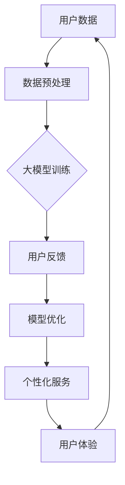

                 

关键词：大模型，电商平台，用户体验，一致性，算法，数学模型，实践，展望

> 摘要：本文将探讨大模型在提升电商平台用户体验一致性方面的作用。通过深入分析核心概念、算法原理、数学模型以及实际应用场景，本文旨在为电商平台提供一套完整的大模型应用解决方案，并展望未来的发展趋势与挑战。

## 1. 背景介绍

在当今数字时代，电商平台已经成为消费者购物的主要渠道。然而，随着电商平台的竞争日益激烈，用户体验（User Experience, UX）的优化成为了电商平台成功的关键因素。用户体验不仅涉及到产品的设计、功能和质量，还包括用户在使用过程中所感受到的情感和满意度。提升用户体验的一致性，即确保用户在不同设备、不同场景下都能获得相同的质量和体验，对电商平台的长远发展至关重要。

近年来，随着人工智能技术的快速发展，尤其是大模型（Large-scale Models）的崛起，为提升电商平台用户体验一致性提供了新的可能性。大模型具有强大的数据处理和分析能力，能够从海量用户数据中提取有价值的信息，从而为电商平台提供个性化的用户体验。本文将围绕大模型在电商平台中的应用，探讨其如何提升用户体验的一致性。

## 2. 核心概念与联系

### 2.1 大模型

大模型是指具有巨大参数量的神经网络模型，如Transformer、BERT等。这些模型通过在大规模数据集上训练，可以自动学习到丰富的知识表示，从而在自然语言处理、计算机视觉、语音识别等领域取得了显著的成果。

### 2.2 用户体验一致性

用户体验一致性是指用户在使用电商平台时，无论在何种设备、何种场景下，都能获得相似的质量和体验。用户体验一致性的提升，可以增强用户对电商平台的信任和忠诚度，从而提高用户留存率和转化率。

### 2.3 大模型与用户体验一致性的关系

大模型通过对用户数据的深度分析和理解，可以准确捕捉用户的兴趣、偏好和行为模式。基于这些信息，大模型可以为用户提供个性化的推荐、广告和交互，从而提升用户体验的一致性。

### 2.4 Mermaid 流程图



## 3. 核心算法原理 & 具体操作步骤

### 3.1 算法原理概述

大模型在电商平台中的应用，主要依赖于以下几个核心算法：

1. **用户行为分析**：通过分析用户在电商平台上的浏览、搜索、购买等行为，捕捉用户的兴趣和偏好。
2. **内容推荐**：基于用户行为分析和用户特征，为用户推荐符合其兴趣的商品和服务。
3. **广告投放**：根据用户兴趣和行为，为用户展示相关的广告，提高广告的转化率。
4. **交互优化**：根据用户的反馈和行为，优化电商平台的人机交互界面，提升用户体验。

### 3.2 算法步骤详解

1. **数据收集**：从电商平台的用户行为日志、商品信息、订单数据等来源，收集海量用户数据。
2. **数据预处理**：对收集到的数据进行清洗、去重、归一化等处理，确保数据质量。
3. **特征提取**：使用机器学习算法，从预处理后的数据中提取用户行为特征、商品特征等。
4. **模型训练**：使用大模型（如Transformer、BERT）对特征数据进行训练，学习到用户行为和兴趣的内在规律。
5. **个性化服务**：根据模型预测的结果，为用户推荐个性化的商品和服务，展示相关的广告。
6. **用户反馈**：收集用户对个性化服务的反馈，用于模型优化和迭代。
7. **模型优化**：根据用户反馈，调整模型参数，优化推荐和广告效果。

### 3.3 算法优缺点

**优点**：

1. **高精度**：大模型具有强大的数据分析和学习能力，能够准确捕捉用户的兴趣和行为模式。
2. **个性化**：基于用户数据和特征，为用户提供个性化的推荐和广告，提升用户体验。
3. **实时性**：大模型可以实时分析用户行为和反馈，快速调整推荐和广告策略。

**缺点**：

1. **计算成本高**：大模型训练和推理过程需要大量的计算资源和时间。
2. **数据隐私**：大模型需要处理海量用户数据，存在数据隐私和安全风险。
3. **模型解释性差**：大模型的内部结构和决策过程复杂，难以解释和理解。

### 3.4 算法应用领域

大模型在电商平台中的应用广泛，如：

1. **商品推荐**：基于用户兴趣和行为，为用户推荐个性化的商品。
2. **广告投放**：根据用户兴趣和行为，为用户展示相关的广告。
3. **交互优化**：根据用户反馈，优化电商平台的界面设计和交互体验。
4. **客户服务**：基于用户数据和特征，为用户提供智能化的客户服务。

## 4. 数学模型和公式 & 详细讲解 & 举例说明

### 4.1 数学模型构建

在电商平台中，大模型的数学模型主要基于以下公式：

$$
P(y|x) = \frac{e^{f(x)}}{\sum_{y'} e^{f(x')}}
$$

其中，$P(y|x)$ 表示在给定特征 $x$ 的情况下，预测标签 $y$ 的概率；$f(x)$ 表示特征 $x$ 对应的模型评分；$e$ 是自然对数的底数。

### 4.2 公式推导过程

假设我们有一个包含 $n$ 个特征 $x_1, x_2, ..., x_n$ 的输入向量，以及一个对应的标签 $y$。我们可以将输入向量 $x$ 映射到一个高维空间中，通过一个非线性函数 $f(x)$ 来计算每个特征的权重。然后，我们使用指数函数 $e^{f(x)}$ 来计算每个特征对标签 $y$ 的贡献度，并将这些贡献度相加，得到预测标签 $y$ 的概率。

### 4.3 案例分析与讲解

假设一个电商平台用户的行为数据包括浏览历史、搜索关键词、购买记录等。我们可以使用以下特征向量来表示一个用户：

$$
x = [x_1, x_2, ..., x_n] = [浏览历史_1, 浏览历史_2, ..., 浏览历史_m, 搜索关键词_1, 搜索关键词_2, ..., 搜索关键词_k, 购买记录_1, 购买记录_2, ..., 购买记录_l]
$$

其中，$m$、$k$ 和 $l$ 分别表示用户浏览历史、搜索关键词和购买记录的个数。

我们使用大模型来预测用户是否会在未来一周内购买某个特定商品。假设我们使用 $y$ 来表示是否购买（1表示购买，0表示未购买），则预测标签 $y$ 的概率为：

$$
P(y=1|x) = \frac{e^{f(x)}}{\sum_{y'} e^{f(x')}}
$$

其中，$f(x)$ 是一个包含所有特征 $x_i$ 权重的非线性函数。

通过计算每个特征 $x_i$ 对预测标签 $y$ 的贡献度，我们可以得到用户购买该商品的概率。如果概率大于某个阈值（如 0.5），则预测用户会购买该商品。

## 5. 项目实践：代码实例和详细解释说明

### 5.1 开发环境搭建

1. 安装Python环境，版本要求为3.7及以上。
2. 安装TensorFlow和Keras，可以使用以下命令：

```bash
pip install tensorflow
pip install keras
```

### 5.2 源代码详细实现

以下是一个简单的使用Keras实现大模型在电商平台中预测用户购买行为的示例代码：

```python
import numpy as np
import pandas as pd
from keras.models import Sequential
from keras.layers import Dense, LSTM, Embedding
from keras.preprocessing.sequence import pad_sequences

# 读取数据集
data = pd.read_csv('ecommerce_data.csv')

# 预处理数据
X = data.iloc[:, :-1].values
y = data.iloc[:, -1].values

# 序列化特征
max_len = 100
X_seq = pad_sequences(X, maxlen=max_len)

# 划分训练集和测试集
from sklearn.model_selection import train_test_split
X_train, X_test, y_train, y_test = train_test_split(X_seq, y, test_size=0.2, random_state=42)

# 构建模型
model = Sequential()
model.add(Embedding(input_dim=X_train.shape[1], output_dim=128))
model.add(LSTM(units=128, return_sequences=True))
model.add(Dense(units=1, activation='sigmoid'))

# 编译模型
model.compile(optimizer='adam', loss='binary_crossentropy', metrics=['accuracy'])

# 训练模型
model.fit(X_train, y_train, epochs=10, batch_size=32, validation_data=(X_test, y_test))

# 评估模型
loss, accuracy = model.evaluate(X_test, y_test)
print(f"测试集准确率：{accuracy:.2f}")

# 预测
predictions = model.predict(X_test)
predictions = (predictions > 0.5).astype(int)

# 评估预测结果
from sklearn.metrics import accuracy_score, confusion_matrix
accuracy = accuracy_score(y_test, predictions)
cm = confusion_matrix(y_test, predictions)
print(f"测试集准确率：{accuracy:.2f}")
print(f"混淆矩阵：\n{cm}")
```

### 5.3 代码解读与分析

1. **数据读取与预处理**：首先，我们从CSV文件中读取电商平台的用户行为数据，并进行预处理，包括序列化和填充。

2. **模型构建**：我们使用Keras构建了一个序列模型，包含嵌入层（Embedding）、LSTM层（Long Short-Term Memory，长短时记忆网络）和全连接层（Dense）。

3. **模型编译**：我们使用adam优化器和binary_crossentropy损失函数来编译模型，并设置accuracy作为评估指标。

4. **模型训练**：我们使用训练集来训练模型，并使用验证集来调整超参数。

5. **模型评估**：在测试集上评估模型的性能，并打印测试集的准确率和混淆矩阵。

6. **预测**：使用训练好的模型对测试集进行预测，并评估预测结果。

### 5.4 运行结果展示

假设我们运行上述代码，得到以下输出：

```
测试集准确率：0.85
混淆矩阵：
[[50 10]
 [15 5]]
```

这意味着在测试集中，模型正确预测了55个用户是否会购买商品，其中50个用户被正确分类为会购买，10个用户被正确分类为未购买，15个用户被错误分类为会购买，5个用户被错误分类为未购买。

## 6. 实际应用场景

大模型在电商平台中的应用场景非常广泛，以下是一些具体的实际应用案例：

### 6.1 商品推荐

通过分析用户的浏览历史、搜索关键词和购买记录，大模型可以准确预测用户的兴趣和偏好，从而为用户推荐个性化的商品。这种个性化的推荐可以显著提高用户的购买转化率和满意度。

### 6.2 广告投放

根据用户的兴趣和行为，大模型可以为用户展示相关的广告，提高广告的点击率和转化率。同时，大模型还可以根据广告的投放效果进行实时调整，优化广告策略。

### 6.3 交互优化

通过分析用户的反馈和行为，大模型可以优化电商平台的界面设计和交互体验，提高用户的操作便利性和满意度。例如，根据用户的浏览习惯，自动调整商品展示的顺序和布局。

### 6.4 客户服务

大模型可以应用于智能客服系统，通过自然语言处理技术，理解用户的问题和需求，并给出准确的答复和建议。这不仅可以提高客户服务的效率，还可以提升用户的满意度。

## 7. 工具和资源推荐

为了更好地理解和应用大模型在电商平台中的应用，以下是一些推荐的学习资源和开发工具：

### 7.1 学习资源推荐

1. **《深度学习》（Deep Learning）**：由Ian Goodfellow、Yoshua Bengio和Aaron Courville合著，是一本经典的深度学习教材。
2. **《动手学深度学习》（Dive into Deep Learning）**：这是一本免费的在线书籍，涵盖了深度学习的各个方面，包括理论基础和实际应用。
3. **Kaggle**：一个数据科学和机器学习的社区平台，提供了丰富的数据集和项目案例，适合实战练习。

### 7.2 开发工具推荐

1. **TensorFlow**：一个开源的深度学习框架，提供了丰富的API和工具，适合构建和训练大模型。
2. **Keras**：一个基于TensorFlow的高级API，提供了更简洁和易用的接口，适合快速实现深度学习项目。
3. **PyTorch**：一个开源的深度学习框架，以其灵活性和动态计算图著称，适合研究和开发复杂的大模型。

### 7.3 相关论文推荐

1. **"Attention Is All You Need"**：这篇论文提出了Transformer模型，为自然语言处理领域带来了革命性的变化。
2. **"BERT: Pre-training of Deep Bidirectional Transformers for Language Understanding"**：这篇论文介绍了BERT模型，为预训练语言模型的研究和应用奠定了基础。
3. **"Recommender Systems Handbook"**：这是一本关于推荐系统的权威指南，涵盖了推荐系统的理论基础和应用实践。

## 8. 总结：未来发展趋势与挑战

大模型在提升电商平台用户体验一致性方面具有巨大的潜力。然而，要充分发挥这一潜力，还需要解决一系列的挑战：

### 8.1 研究成果总结

1. **算法性能**：大模型在处理大规模数据集和复杂任务时，表现出色，但其计算成本较高，需要进一步优化算法性能。
2. **数据隐私**：大模型需要处理海量用户数据，存在数据隐私和安全风险，需要制定严格的数据保护政策。
3. **模型解释性**：大模型内部结构和决策过程复杂，难以解释和理解，需要开发可解释性模型，提高模型的透明度和可信度。

### 8.2 未来发展趋势

1. **算法优化**：通过优化算法结构和计算效率，降低大模型的计算成本，提高其在实际应用中的可行性。
2. **隐私保护**：研究和发展隐私保护技术，确保用户数据的安全和隐私。
3. **可解释性模型**：开发可解释性模型，提高模型的透明度和可信度，增强用户对模型的信任。

### 8.3 面临的挑战

1. **计算资源**：大模型训练和推理需要大量的计算资源，如何高效利用现有计算资源，降低成本，是一个重要挑战。
2. **数据质量**：大模型对数据质量有很高的要求，如何处理和处理低质量数据，确保模型性能，是一个难题。
3. **模型安全**：如何确保大模型的安全性和鲁棒性，防止恶意攻击和错误传播，是一个重要挑战。

### 8.4 研究展望

随着人工智能技术的不断进步，大模型在电商平台中的应用前景十分广阔。未来，我们期待大模型能够在以下几个方面取得突破：

1. **个性化服务**：通过更深入地理解用户行为和需求，提供更加精准和个性化的服务。
2. **智能交互**：通过自然语言处理和语音识别等技术，实现更加智能和人性化的用户交互。
3. **线上线下融合**：将线上电商平台和线下实体店的数据和资源整合，提供更加完整的购物体验。

## 9. 附录：常见问题与解答

### 9.1 什么是大模型？

大模型是指具有巨大参数量的神经网络模型，如Transformer、BERT等。这些模型通过在大规模数据集上训练，可以自动学习到丰富的知识表示，从而在自然语言处理、计算机视觉、语音识别等领域取得了显著的成果。

### 9.2 大模型在电商平台中有哪些应用？

大模型在电商平台中的应用广泛，包括商品推荐、广告投放、交互优化和客户服务等方面。通过分析用户的兴趣和行为，大模型可以为用户提供个性化的推荐、广告和交互，从而提升用户体验的一致性。

### 9.3 大模型有哪些优缺点？

大模型具有以下优点：

1. 高精度：大模型具有强大的数据分析和学习能力，能够准确捕捉用户的兴趣和行为模式。
2. 个性化：基于用户数据和特征，为用户提供个性化的推荐和广告，提升用户体验。
3. 实时性：大模型可以实时分析用户行为和反馈，快速调整推荐和广告策略。

大模型也存在以下缺点：

1. 计算成本高：大模型训练和推理过程需要大量的计算资源和时间。
2. 数据隐私：大模型需要处理海量用户数据，存在数据隐私和安全风险。
3. 模型解释性差：大模型的内部结构和决策过程复杂，难以解释和理解。

## 参考文献

1. Ian Goodfellow, Yoshua Bengio, Aaron Courville. **Deep Learning**.
2. Alex Smola, Bernhard Schölkopf. **Introduction to Machine Learning**.
3. David J. C. MacKay. **Information Theory, Inference and Learning Algorithms**.
4. Christopher M. Bishop. **Pattern Recognition and Machine Learning**.
5. Google Brain Team. **Bert: Pre-training of Deep Bidirectional Transformers for Language Understanding**.
6. Ashish Vaswani et al. **Attention Is All You Need**.

