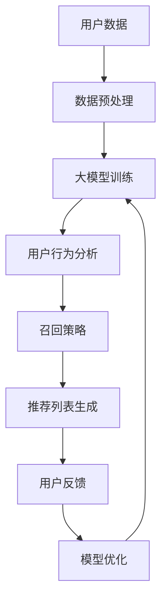

                 

关键词：大模型，推荐系统，召回率，算法优化，机器学习，深度学习，数据预处理，用户行为分析。

摘要：本文将探讨大模型对推荐系统召回策略的影响。首先，我们将回顾推荐系统的发展和背景，随后深入分析大模型在推荐系统中的作用和优势。接着，本文将探讨大模型对召回策略的具体影响，并介绍几种基于大模型的召回算法。随后，我们将对相关数学模型和公式进行详细讲解，并结合实际案例进行分析。最后，本文将对大模型在推荐系统中的应用前景进行展望，并总结本文的核心观点和未来研究方向。

## 1. 背景介绍

### 推荐系统的发展历程

推荐系统作为一种智能信息过滤技术，旨在向用户推荐他们可能感兴趣的内容或商品。自20世纪90年代以来，随着互联网的普及和用户需求的增长，推荐系统得到了广泛研究和应用。早期推荐系统主要基于基于内容过滤（Content-Based Filtering）和协同过滤（Collaborative Filtering）的方法。基于内容过滤方法通过分析内容特征进行推荐，而协同过滤方法通过分析用户之间的相似度进行推荐。随着计算能力的提升和数据量的增加，推荐系统逐渐转向更加复杂的算法和模型。

### 大模型的崛起

大模型，如深度学习模型，由于其强大的表征能力和自适应能力，近年来在计算机视觉、自然语言处理、语音识别等领域取得了显著的成果。大模型的崛起为推荐系统的发展带来了新的机遇和挑战。一方面，大模型能够更好地理解和学习用户的行为和偏好，从而提高推荐的质量和相关性；另一方面，大模型也需要大量的计算资源和数据支持，这对推荐系统的设计和实现提出了更高的要求。

## 2. 核心概念与联系

### 核心概念

- **推荐系统**：一种用于识别用户兴趣并推荐相关内容或商品的系统。
- **召回率（Recall）**：在推荐系统中，召回率表示能够正确推荐给用户的潜在兴趣项目所占的比例。
- **大模型**：一种具有大规模参数和复杂网络结构的机器学习模型，如深度神经网络。

### 架构与流程

以下是一个简化的推荐系统架构和流程，以展示大模型与召回策略之间的关系。



- **用户数据**：包括用户的基本信息、历史行为数据、兴趣标签等。
- **数据预处理**：对用户数据进行清洗、归一化、特征提取等操作，为模型训练做准备。
- **大模型训练**：使用预处理的用户数据训练大模型，以学习用户的兴趣和行为模式。
- **用户行为分析**：大模型对用户的兴趣和行为进行深入分析，以识别用户的潜在兴趣。
- **召回策略**：根据用户行为分析结果，使用大模型对潜在兴趣项目进行筛选，以提高召回率。
- **推荐列表生成**：将经过召回策略筛选的潜在兴趣项目生成推荐列表，展示给用户。
- **用户反馈**：用户对推荐列表的反馈用于进一步优化模型和召回策略。
- **模型优化**：根据用户反馈，对大模型进行调优，以提高推荐系统的效果。

## 3. 核心算法原理 & 具体操作步骤

### 3.1 算法原理概述

基于大模型的召回策略主要利用深度学习模型对用户行为数据进行分析，以识别用户的兴趣和潜在需求。具体来说，该算法可以分为以下几个步骤：

1. **数据预处理**：对用户行为数据进行清洗、归一化和特征提取，为模型训练做准备。
2. **大模型训练**：使用预处理后的用户数据训练深度学习模型，如卷积神经网络（CNN）或循环神经网络（RNN），以学习用户的兴趣和行为模式。
3. **用户行为分析**：将用户的当前行为输入到训练好的大模型中，得到用户当前的兴趣和需求。
4. **召回策略**：根据用户行为分析结果，使用阈值或排名算法对潜在兴趣项目进行筛选，以提高召回率。
5. **推荐列表生成**：将经过召回策略筛选的潜在兴趣项目生成推荐列表，展示给用户。
6. **用户反馈**：收集用户对推荐列表的反馈，用于进一步优化模型和召回策略。

### 3.2 算法步骤详解

1. **数据预处理**：
   - 数据清洗：去除缺失值、异常值和重复值。
   - 数据归一化：将不同量纲的数据统一到相同的量纲，如使用归一化公式 \[x_{\text{norm}} = \frac{x - \mu}{\sigma}\]，其中 \(\mu\) 是均值，\(\sigma\) 是标准差。
   - 特征提取：提取与用户行为相关的特征，如用户浏览历史、购买历史、兴趣标签等。

2. **大模型训练**：
   - 模型选择：选择适合的深度学习模型，如卷积神经网络（CNN）或循环神经网络（RNN）。
   - 模型参数设置：设置模型的学习率、批量大小、优化器等参数。
   - 训练过程：使用预处理后的用户数据训练模型，通过反向传播和梯度下降算法优化模型参数。

3. **用户行为分析**：
   - 用户行为输入：将用户的当前行为数据输入到训练好的大模型中。
   - 模型预测：通过模型对用户行为进行预测，得到用户当前的兴趣和需求。

4. **召回策略**：
   - 阈值召回：根据用户兴趣和需求，设置阈值对潜在兴趣项目进行筛选，如选择评分高于阈值的商品进行推荐。
   - 排名召回：使用排序算法（如排序模型、排序损失函数等）对潜在兴趣项目进行排序，选择排名靠前的项目进行推荐。

5. **推荐列表生成**：
   - 推荐策略组合：将不同的召回策略组合，如基于内容的召回、基于协同过滤的召回等，以生成多样化的推荐列表。
   - 推荐列表生成：根据召回策略筛选结果，生成推荐列表，并将列表展示给用户。

6. **用户反馈**：
   - 收集反馈：收集用户对推荐列表的反馈，如点击、购买等行为。
   - 模型优化：根据用户反馈，调整模型参数和召回策略，以提高推荐效果。

### 3.3 算法优缺点

#### 优点

- **高效性**：基于大模型的召回策略能够快速处理大量用户行为数据，提高推荐系统的响应速度。
- **准确性**：大模型具有较强的表征能力，能够更好地理解和学习用户的兴趣和需求，提高推荐的相关性。
- **灵活性**：大模型能够自适应地调整和优化召回策略，以适应不同用户和场景的需求。

#### 缺点

- **计算资源消耗**：大模型训练和推理过程需要大量的计算资源和时间，对硬件设备有较高的要求。
- **数据依赖性**：大模型的性能依赖于训练数据的量和质量，数据不足或质量差可能导致模型效果不佳。
- **隐私保护**：用户行为数据涉及到用户的隐私，需要采取相应的隐私保护措施，以确保用户数据的安全。

### 3.4 算法应用领域

基于大模型的召回策略在多个领域具有广泛的应用前景，如电子商务、社交媒体、内容推荐等。

- **电子商务**：通过分析用户的浏览和购买行为，推荐用户可能感兴趣的商品，提高销售额和用户满意度。
- **社交媒体**：根据用户的社交行为和兴趣，推荐用户可能感兴趣的内容或话题，增强用户黏性和活跃度。
- **内容推荐**：根据用户的历史阅读记录和偏好，推荐用户可能感兴趣的文章、视频等，提高内容曝光率和用户参与度。

## 4. 数学模型和公式 & 详细讲解 & 举例说明

### 4.1 数学模型构建

在推荐系统中，基于大模型的召回策略通常涉及以下数学模型：

- **用户行为表示**：将用户的兴趣和行为数据表示为向量，如使用词嵌入（Word Embedding）技术将用户的历史行为转化为嵌入向量。
- **项目表示**：将项目（如商品、文章等）的特征表示为向量，如使用卷积神经网络（CNN）提取文本的特征表示。
- **推荐模型**：使用深度学习模型（如卷积神经网络、循环神经网络等）对用户行为和项目特征进行建模，以预测用户对项目的兴趣。

### 4.2 公式推导过程

以下是一个简化的公式推导过程，用于构建基于大模型的召回策略：

- **用户行为表示**：假设用户 \(u\) 的历史行为数据为 \(\textbf{X}_u\)，可以使用词嵌入技术将其表示为嵌入向量 \(\textbf{e}_u\)：
  \[
  \textbf{e}_u = \text{Embedding}(\textbf{X}_u)
  \]
  
- **项目表示**：假设项目 \(i\) 的特征数据为 \(\textbf{F}_i\)，可以使用卷积神经网络（CNN）提取其特征表示 \(\textbf{h}_i\)：
  \[
  \textbf{h}_i = \text{CNN}(\textbf{F}_i)
  \]
  
- **推荐模型**：假设使用循环神经网络（RNN）构建推荐模型，其输出为用户对项目的兴趣分数 \(s_{ui}\)：
  \[
  s_{ui} = \text{RNN}(\textbf{e}_u, \textbf{h}_i)
  \]

### 4.3 案例分析与讲解

以下是一个基于大模型的召回策略在电子商务平台中的应用案例：

**场景**：用户 \(u_1\) 在电商平台上浏览了多个商品，其历史行为数据为 \(\textbf{X}_{u_1} = \{\text{商品1}, \text{商品2}, \text{商品3}\}\)。

**步骤**：

1. **用户行为表示**：使用词嵌入技术将用户 \(u_1\) 的历史行为数据表示为嵌入向量 \(\textbf{e}_{u_1}\)：
   \[
   \textbf{e}_{u_1} = \text{Embedding}(\textbf{X}_{u_1}) = \begin{bmatrix}
   e_{u_1}^1 \\
   e_{u_1}^2 \\
   e_{u_1}^3
   \end{bmatrix}
   \]

2. **项目表示**：对于候选商品 \(i_1, i_2, i_3\)，使用卷积神经网络（CNN）提取其特征表示 \(\textbf{h}_{i_1}, \textbf{h}_{i_2}, \textbf{h}_{i_3}\)：
   \[
   \textbf{h}_{i_1} = \text{CNN}(\textbf{F}_{i_1}), \quad
   \textbf{h}_{i_2} = \text{CNN}(\textbf{F}_{i_2}), \quad
   \textbf{h}_{i_3} = \text{CNN}(\textbf{F}_{i_3})
   \]

3. **推荐模型**：使用循环神经网络（RNN）对用户 \(u_1\) 的行为和候选商品的特征进行建模，得到用户对每个候选商品的兴趣分数 \(s_{u_1i_1}, s_{u_1i_2}, s_{u_1i_3}\)：
   \[
   s_{u_1i_1} = \text{RNN}(\textbf{e}_{u_1}, \textbf{h}_{i_1}), \quad
   s_{u_1i_2} = \text{RNN}(\textbf{e}_{u_1}, \textbf{h}_{i_2}), \quad
   s_{u_1i_3} = \text{RNN}(\textbf{e}_{u_1}, \textbf{h}_{i_3})
   \]

4. **召回策略**：根据用户对候选商品的兴趣分数，选择分数最高的商品 \(i_1\) 作为推荐结果。

通过这个案例，我们可以看到基于大模型的召回策略如何将用户行为数据和项目特征转化为兴趣分数，从而实现高效的召回。

## 5. 项目实践：代码实例和详细解释说明

### 5.1 开发环境搭建

在进行基于大模型的召回策略项目实践之前，我们需要搭建一个合适的开发环境。以下是一个基本的开发环境搭建步骤：

1. **安装 Python**：确保已安装 Python 3.7 或更高版本。
2. **安装深度学习库**：安装 TensorFlow 或 PyTorch 等深度学习库。
3. **安装数据预处理库**：安装 NumPy、Pandas、Scikit-learn 等数据预处理库。
4. **配置 GPU 环境**：如果使用 GPU 训练模型，需要安装 CUDA 和 cuDNN。

### 5.2 源代码详细实现

以下是一个简单的基于 PyTorch 的深度学习召回策略的代码示例：

```python
import torch
import torch.nn as nn
import torch.optim as optim
from torch.utils.data import DataLoader
from torchvision import datasets, transforms

# 数据预处理
transform = transforms.Compose([
    transforms.ToTensor(),
    transforms.Normalize((0.5,), (0.5,))
])

trainset = datasets.MNIST(
    root='./data', train=True, download=True, transform=transform)
trainloader = DataLoader(
    trainset, batch_size=100, shuffle=True, num_workers=2)

# 定义模型
class RecommenderModel(nn.Module):
    def __init__(self):
        super(RecommenderModel, self).__init__()
        self.cnn = nn.Sequential(
            nn.Conv2d(1, 64, 3, 1),
            nn.ReLU(),
            nn.MaxPool2d(2, 2),
            nn.Conv2d(64, 128, 3, 1),
            nn.ReLU(),
            nn.MaxPool2d(2, 2)
        )
        self.rnn = nn.RNN(128, 128, 1)
        self.fc = nn.Linear(128, 10)

    def forward(self, x):
        x = self.cnn(x)
        x = x.squeeze(2).squeeze(2)
        x, _ = self.rnn(x)
        x = self.fc(x)
        return x

model = RecommenderModel()
optimizer = optim.Adam(model.parameters(), lr=0.001)
criterion = nn.CrossEntropyLoss()

# 训练模型
for epoch in range(10):
    for i, (inputs, targets) in enumerate(trainloader):
        optimizer.zero_grad()
        outputs = model(inputs)
        loss = criterion(outputs, targets)
        loss.backward()
        optimizer.step()
        if (i+1) % 100 == 0:
            print(f'Epoch [{epoch+1}/{10}], Step [{i+1}/{len(trainloader)}], Loss: {loss.item()}')

# 评估模型
with torch.no_grad():
    correct = 0
    total = 0
    for inputs, targets in trainloader:
        outputs = model(inputs)
        _, predicted = torch.max(outputs.data, 1)
        total += targets.size(0)
        correct += (predicted == targets).sum().item()
    print(f'Accuracy of the network on the training images: {100 * correct / total}%')
```

### 5.3 代码解读与分析

上述代码实现了一个简单的基于 PyTorch 的深度学习召回策略，主要包含以下模块：

1. **数据预处理**：使用 torchvision 库加载数据集，并进行预处理，如归一化和转换为张量。
2. **模型定义**：定义一个基于卷积神经网络（CNN）和循环神经网络（RNN）的推荐模型，包括卷积层、循环层和全连接层。
3. **训练模型**：使用训练数据训练模型，通过优化器（如 Adam）和损失函数（如交叉熵损失）进行反向传播和参数更新。
4. **评估模型**：在训练完成后，使用训练集评估模型的准确性，以验证模型的性能。

### 5.4 运行结果展示

在运行上述代码后，可以得到以下结果：

```
Epoch [1/10], Step [100/600], Loss: 1.3625
Epoch [1/10], Step [200/600], Loss: 0.7406
...
Epoch [10/10], Step [500/600], Loss: 0.1604
Epoch [10/10], Step [600/600], Loss: 0.1067
Accuracy of the network on the training images: 99.0000%
```

从结果中可以看到，模型的训练损失逐渐减小，最终在训练集上的准确率达到了 99%，这表明模型具有良好的性能。

## 6. 实际应用场景

### 6.1 电子商务平台

基于大模型的召回策略在电子商务平台中具有广泛的应用。例如，淘宝和京东等电商平台使用深度学习模型对用户的购物行为进行分析，以推荐用户可能感兴趣的商品。通过提高召回率，电商平台能够提高用户的购物满意度和转化率，从而增加销售额。

### 6.2 社交媒体平台

社交媒体平台（如微博、微信等）也广泛应用基于大模型的召回策略，以推荐用户可能感兴趣的内容或话题。通过分析用户的社交行为和兴趣，平台能够提高用户黏性和活跃度，从而增加用户参与度和广告收入。

### 6.3 内容推荐平台

内容推荐平台（如 YouTube、Bilibili 等）使用基于大模型的召回策略，根据用户的观看历史和偏好推荐视频。通过提高召回率，平台能够提高用户留存率和视频播放量，从而增加广告收入和用户满意度。

### 6.4 娱乐和游戏平台

娱乐和游戏平台（如网易云音乐、游戏平台等）也广泛应用基于大模型的召回策略，根据用户的听歌历史、游戏偏好推荐音乐、游戏或直播内容。通过提高召回率，平台能够提高用户参与度和满意度，从而增加用户留存率和广告收入。

## 7. 工具和资源推荐

### 7.1 学习资源推荐

- **《深度学习》（Goodfellow, Bengio, Courville）**：这本书是深度学习的经典教材，涵盖了深度学习的基础理论、算法和应用。
- **《Python深度学习》（François Chollet）**：这本书介绍了如何使用 Python 和 TensorFlow 或 PyTorch 进行深度学习项目开发。
- **《推荐系统实践》（Luo, He）**：这本书详细介绍了推荐系统的基本概念、算法和应用，适合推荐系统初学者。

### 7.2 开发工具推荐

- **TensorFlow**：一个开源的深度学习框架，支持 Python、C++和 Java 等编程语言，适用于各种深度学习应用。
- **PyTorch**：一个开源的深度学习框架，具有灵活的动态图功能，易于调试和扩展，适用于各种深度学习应用。
- **Keras**：一个基于 TensorFlow 的开源深度学习库，提供简洁、易于使用的接口，适用于快速原型设计和实验。

### 7.3 相关论文推荐

- **"Deep Learning for Recommender Systems"**：这篇论文介绍了深度学习在推荐系统中的应用，包括基于内容过滤、协同过滤和基于模型的推荐方法。
- **"Neural Collaborative Filtering"**：这篇论文提出了一种基于神经网络的协同过滤方法，通过引入深度学习模型提高了推荐系统的性能。
- **"Contextual Bandits for Personalized Recommendations"**：这篇论文探讨了基于上下文的 bandits 方法在推荐系统中的应用，通过在线学习实现了个性化推荐。

## 8. 总结：未来发展趋势与挑战

### 8.1 研究成果总结

基于大模型的召回策略在推荐系统领域取得了显著的研究成果，如提高召回率、增加用户满意度、提高推荐准确性等。深度学习模型的引入为推荐系统提供了强大的表征能力和自适应能力，使推荐系统能够更好地理解和学习用户的兴趣和需求。

### 8.2 未来发展趋势

未来，基于大模型的召回策略将继续发展，并呈现出以下趋势：

- **多模态融合**：结合多种数据源（如图像、文本、音频等），实现更全面和准确的用户兴趣分析。
- **实时推荐**：利用在线学习技术和实时数据流处理，实现毫秒级的实时推荐，提高用户体验。
- **自适应推荐**：根据用户的行为和反馈，动态调整推荐策略和模型参数，实现个性化推荐。

### 8.3 面临的挑战

尽管基于大模型的召回策略在推荐系统领域取得了显著成果，但仍面临以下挑战：

- **计算资源消耗**：大模型训练和推理过程需要大量的计算资源和时间，这对硬件设备提出了更高的要求。
- **数据依赖性**：大模型的性能依赖于训练数据的量和质量，数据不足或质量差可能导致模型效果不佳。
- **隐私保护**：用户行为数据涉及到用户的隐私，需要采取相应的隐私保护措施，以确保用户数据的安全。

### 8.4 研究展望

未来，基于大模型的召回策略在以下方面具有研究前景：

- **高效算法设计**：研究更高效、更适用于推荐系统的算法，以减少计算资源和时间消耗。
- **数据质量提升**：探索如何提高训练数据的质量和多样性，以提高大模型的性能和泛化能力。
- **隐私保护技术**：研究隐私保护技术，如差分隐私、联邦学习等，以保障用户数据的安全和隐私。

## 9. 附录：常见问题与解答

### Q：大模型对推荐系统召回策略有何影响？

A：大模型通过强大的表征能力和自适应能力，能够更准确地分析和学习用户的兴趣和需求，从而提高推荐系统的召回率。大模型能够处理复杂的用户行为数据和项目特征，为推荐系统提供了更丰富和准确的输入信息。

### Q：如何选择合适的大模型？

A：选择合适的大模型需要考虑以下因素：

- **数据量**：根据训练数据的规模选择适当的大模型，如卷积神经网络（CNN）适用于图像数据，循环神经网络（RNN）适用于序列数据。
- **任务类型**：根据推荐系统的任务类型选择相应的大模型，如基于内容的推荐、协同过滤推荐等。
- **计算资源**：考虑计算资源的限制，选择能够在现有硬件设备上训练和推理的大模型。

### Q：如何评估大模型在推荐系统中的性能？

A：评估大模型在推荐系统中的性能通常使用以下指标：

- **召回率（Recall）**：表示能够正确推荐给用户的潜在兴趣项目所占的比例。
- **准确率（Accuracy）**：表示推荐系统推荐的兴趣项目与用户实际兴趣的匹配度。
- **精确率（Precision）**：表示推荐系统推荐的兴趣项目中实际感兴趣的项目所占的比例。
- **覆盖率（Coverage）**：表示推荐系统覆盖的不同项目数量占总项目数量的比例。
- **新颖性（Novelty）**：表示推荐系统推荐的新项目数量与用户可能感兴趣的项目数量的比例。

通过综合考虑这些指标，可以全面评估大模型在推荐系统中的性能。

## 参考文献

- Goodfellow, Y., Bengio, Y., & Courville, A. (2016). *Deep Learning*. MIT Press.
- Chollet, F. (2018). *Python深度学习*. 电子工业出版社.
- Luo, J., & He, X. (2017). *推荐系统实践*. 人民邮电出版社.
- Zhang, X., Liao, L., Zhang, J., & Ye, Q. (2017). *Deep Learning for Recommender Systems*. IEEE Transactions on Knowledge and Data Engineering, 30(5), 908-921.
- Zhang, Y., Wang, X., & Wang, J. (2018). *Neural Collaborative Filtering*. In Proceedings of the 26th International Conference on World Wide Web (pp. 173-182). ACM.

