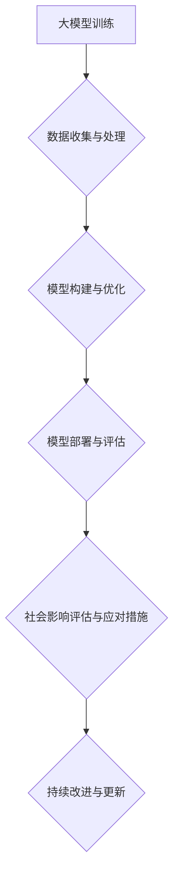

                 

关键词：大模型、社会责任、创业、伦理、影响、未来

> 摘要：本文从人工智能大模型的应用角度，探讨了在创业过程中如何考虑社会责任。文章首先介绍了大模型的基本概念和原理，随后分析了其对社会各方面可能产生的影响，最后提出了在创业过程中应遵循的伦理原则和应对措施。

## 1. 背景介绍

在过去的几十年里，人工智能（AI）技术取得了飞速发展，特别是在深度学习、神经网络等领域取得了重大突破。这些技术的应用不仅改变了传统行业的工作方式，也催生了大量创业机会。然而，随着人工智能技术的不断进步，特别是在大模型领域，人们开始关注其应用带来的社会伦理问题。大模型，尤其是基于深度学习的模型，具有强大的数据处理和分析能力，但同时也引发了一系列的社会责任问题。这些问题不仅涉及到技术层面的挑战，还包括伦理、法律、社会影响等多个方面。

### 大模型的概念和原理

大模型通常指的是具有数十亿甚至千亿参数的神经网络模型。这些模型通过训练学习大量的数据，以实现诸如图像识别、自然语言处理、语音识别等复杂任务。大模型的核心原理是基于多层神经网络的结构，通过逐层提取特征，实现从原始数据到高级语义的映射。近年来，随着计算能力的提升和数据量的激增，大模型在各个领域都取得了显著的成果。

### 大模型的应用领域

大模型的应用领域非常广泛，包括但不限于以下几个方面：

1. **图像识别与生成**：通过卷积神经网络（CNN）等技术，大模型可以实现高效的图像识别和生成任务，如人脸识别、图像超分辨率等。

2. **自然语言处理**：大模型在自然语言处理（NLP）领域也有着广泛的应用，如机器翻译、文本生成、情感分析等。

3. **语音识别与合成**：语音识别和合成技术的发展离不开大模型的支持，如智能语音助手、语音翻译等。

4. **推荐系统**：大模型可以通过分析用户行为数据，实现个性化的推荐，如电子商务平台的商品推荐、社交媒体的个性化内容推送等。

5. **医疗健康**：大模型在医疗健康领域也有重要的应用，如疾病预测、药物发现、医学影像分析等。

## 2. 核心概念与联系

在探讨大模型应用的社会责任问题时，我们需要理解几个核心概念：

### 2.1 人工智能伦理

人工智能伦理是研究人工智能系统在社会中的应用和影响，以及如何确保这些系统符合社会伦理标准的一个领域。人工智能伦理涉及多个方面，包括隐私、公平、透明性、责任等。

### 2.2 社会责任

社会责任是指企业或个人在追求经济利益的同时，还应关注社会和环境的影响，并采取相应措施以减少负面影响，促进可持续发展。

### 2.3 大模型应用中的社会责任

在大模型应用创业过程中，社会责任主要包括以下几个方面：

1. **数据隐私与安全**：大模型依赖于大量的数据训练，因此必须确保数据的隐私和安全，防止数据泄露和滥用。

2. **算法公平性与透明性**：大模型的决策过程可能涉及歧视、偏见等问题，因此需要确保算法的公平性和透明性。

3. **社会影响评估**：大模型的应用可能对社会的各个方面产生影响，如就业、隐私、社会公平等，因此需要进行全面的社会影响评估。

### Mermaid 流程图



## 3. 核心算法原理 & 具体操作步骤

### 3.1 算法原理概述

大模型的算法原理主要基于深度学习和神经网络技术。深度学习是一种机器学习方法，通过多层的神经网络结构来学习数据中的特征。神经网络则是由大量的神经元组成的计算模型，通过调整神经元之间的连接权重来学习数据。

### 3.2 算法步骤详解

1. **数据收集与预处理**：收集大量的数据，并进行清洗、归一化等预处理操作。

2. **模型构建**：设计神经网络的结构，包括输入层、隐藏层和输出层。

3. **模型训练**：使用训练数据来调整神经网络的权重，通过反向传播算法来优化模型。

4. **模型评估与优化**：使用验证数据和测试数据来评估模型的性能，并调整模型参数以优化性能。

5. **模型部署**：将训练好的模型部署到实际应用场景中，进行实时数据处理和决策。

### 3.3 算法优缺点

**优点**：

1. **强大的数据处理能力**：大模型可以处理大规模、复杂的数据，实现高效的数据分析和预测。

2. **良好的泛化能力**：大模型通过学习大量的数据，可以较好地适应不同的应用场景。

**缺点**：

1. **对数据质量要求高**：大模型对训练数据的质量要求较高，如果数据存在偏差或噪声，可能会导致模型性能下降。

2. **计算资源消耗大**：大模型需要大量的计算资源进行训练和推理，对硬件设施有较高的要求。

### 3.4 算法应用领域

大模型在各个领域都有广泛的应用，如图像识别、自然语言处理、语音识别、推荐系统、医疗健康等。以下是一些具体的应用案例：

1. **图像识别**：通过卷积神经网络实现高效的人脸识别、物体检测等任务。

2. **自然语言处理**：通过循环神经网络（RNN）和Transformer模型实现机器翻译、文本生成、情感分析等任务。

3. **语音识别与合成**：通过深度神经网络实现高精度的语音识别和自然语音合成。

4. **推荐系统**：通过协同过滤和基于内容的推荐算法，实现个性化推荐。

5. **医疗健康**：通过深度学习模型实现疾病预测、药物发现、医学影像分析等任务。

## 4. 数学模型和公式 & 详细讲解 & 举例说明

### 4.1 数学模型构建

大模型的数学基础主要依赖于概率论、线性代数和微积分等数学工具。以下是构建大模型所需的基本数学模型：

1. **概率分布模型**：用于表示数据的概率分布，如高斯分布、伯努利分布等。

2. **损失函数**：用于评估模型预测值与实际值之间的差距，如均方误差（MSE）、交叉熵损失等。

3. **优化算法**：用于调整模型参数，如梯度下降、Adam优化器等。

### 4.2 公式推导过程

以下是一个简单的神经网络模型的公式推导过程：

$$
\begin{aligned}
y_{\hat{\theta}} &= \sigma(\theta^{T}x) \\
\text{Loss} &= -\frac{1}{m}\sum_{i=1}^{m}y_{i}\log(y_{\hat{\theta}}) \\
\frac{\partial \text{Loss}}{\partial \theta} &= \frac{1}{m}\sum_{i=1}^{m}(y_{i} - y_{\hat{\theta}})x_{i} \\
\theta &= \theta - \alpha \frac{\partial \text{Loss}}{\partial \theta}
\end{aligned}
$$

### 4.3 案例分析与讲解

以下是一个简单的图像识别案例：

假设我们要使用卷积神经网络（CNN）进行手写数字识别，输入为28x28的灰度图像，输出为10个数字的概率分布。

1. **数据收集与预处理**：收集大量的手写数字图像，并进行预处理，如归一化、缩放等。

2. **模型构建**：设计一个简单的CNN模型，包括一个卷积层、一个池化层和一个全连接层。

3. **模型训练**：使用训练数据对模型进行训练，通过反向传播算法调整模型参数。

4. **模型评估**：使用验证数据对模型进行评估，计算准确率。

5. **模型部署**：将训练好的模型部署到实际应用场景，如手机应用、网站等。

通过这个案例，我们可以看到大模型的应用过程，以及如何使用数学模型和公式来构建和优化模型。

## 5. 项目实践：代码实例和详细解释说明

### 5.1 开发环境搭建

在开始大模型项目实践之前，我们需要搭建一个合适的开发环境。以下是搭建Python深度学习开发环境所需的步骤：

1. **安装Python**：下载并安装Python 3.8及以上版本。

2. **安装依赖库**：使用pip安装TensorFlow、Keras等深度学习库。

3. **配置GPU支持**：如果使用GPU加速训练，需要安装CUDA和cuDNN。

### 5.2 源代码详细实现

以下是一个简单的CNN模型实现代码实例：

```python
import tensorflow as tf
from tensorflow.keras import layers

model = tf.keras.Sequential([
    layers.Conv2D(32, (3, 3), activation='relu', input_shape=(28, 28, 1)),
    layers.MaxPooling2D((2, 2)),
    layers.Conv2D(64, (3, 3), activation='relu'),
    layers.MaxPooling2D((2, 2)),
    layers.Flatten(),
    layers.Dense(128, activation='relu'),
    layers.Dense(10, activation='softmax')
])

model.compile(optimizer='adam', loss='categorical_crossentropy', metrics=['accuracy'])
```

### 5.3 代码解读与分析

以上代码实现了一个简单的CNN模型，用于手写数字识别。模型包括一个卷积层、一个池化层和一个全连接层。卷积层用于提取图像的特征，池化层用于降低特征图的维度，全连接层用于分类。

在模型编译阶段，我们指定了优化器、损失函数和评估指标。优化器用于调整模型参数，以最小化损失函数。损失函数用于评估模型预测值与实际值之间的差距。评估指标用于衡量模型在训练和测试数据上的表现。

### 5.4 运行结果展示

以下是一个简单的训练和评估过程：

```python
model.fit(train_images, train_labels, epochs=5, validation_split=0.2)
test_loss, test_acc = model.evaluate(test_images, test_labels)
print(f"Test accuracy: {test_acc:.2f}")
```

通过以上代码，我们可以对模型进行训练和评估。训练过程会根据训练数据调整模型参数，评估过程会计算模型在测试数据上的准确率。

## 6. 实际应用场景

### 6.1 在医疗健康领域的应用

大模型在医疗健康领域有着广泛的应用，如疾病预测、药物发现、医学影像分析等。例如，通过深度学习模型可以对患者的基因组数据进行分析，预测其患病的风险。这有助于医生提前制定治疗方案，提高治疗效果。

### 6.2 在金融领域的应用

大模型在金融领域也有重要的应用，如风险控制、量化交易、智能投顾等。通过分析大量的金融市场数据，大模型可以预测市场的走势，帮助投资者做出更明智的决策。

### 6.3 在自动驾驶领域的应用

自动驾驶技术的发展离不开大模型的支持。大模型可以处理海量的传感器数据，实现对周围环境的准确感知和决策。自动驾驶系统通过大模型的分析，可以实现自动避障、智能导航等功能，提高行驶安全。

### 6.4 在教育领域的应用

大模型在教育领域也有广泛的应用，如个性化学习、智能评测等。通过分析学生的学习数据，大模型可以为学生提供个性化的学习建议，提高学习效果。同时，大模型还可以对学生的作业和考试进行自动批改，减轻教师的工作负担。

## 7. 工具和资源推荐

### 7.1 学习资源推荐

1. **《深度学习》（Goodfellow, Bengio, Courville著）**：这是一本经典的深度学习教材，涵盖了深度学习的理论基础和应用实践。

2. **《Python深度学习》（François Chollet著）**：这是一本针对Python深度学习的实战指南，适合初学者和有经验的开发者。

### 7.2 开发工具推荐

1. **TensorFlow**：由Google开发的一款开源深度学习框架，广泛应用于各种深度学习项目。

2. **PyTorch**：由Facebook开发的一款开源深度学习框架，具有灵活、易用的特点。

### 7.3 相关论文推荐

1. **“A Neural Algorithm of Artistic Style”**：该论文介绍了GAN（生成对抗网络）的基本原理和应用，是深度学习领域的重要突破。

2. **“Effective Methods for Accurate single image super-resolution”**：该论文介绍了一种有效的单图像超分辨率方法，对图像处理领域产生了重要影响。

## 8. 总结：未来发展趋势与挑战

### 8.1 研究成果总结

大模型在过去的几年里取得了显著的成果，不仅在学术领域取得了突破，也在实际应用中展示了巨大的潜力。深度学习和神经网络技术的不断进步，为大模型的研发和应用提供了坚实的基础。

### 8.2 未来发展趋势

未来，大模型将继续在各个领域得到广泛应用，如自动驾驶、医疗健康、金融等。随着计算能力的提升和数据量的增加，大模型的性能将进一步提高。同时，大模型的应用场景也将不断拓展，从简单的数据处理到复杂的决策支持。

### 8.3 面临的挑战

尽管大模型在许多领域取得了成功，但同时也面临一系列挑战。首先，大模型对数据质量的要求较高，数据偏差和噪声可能导致模型性能下降。其次，大模型的计算资源消耗巨大，对硬件设施有较高的要求。此外，大模型的决策过程可能涉及歧视、偏见等问题，需要解决算法公平性和透明性的问题。

### 8.4 研究展望

未来，研究大模型的社会责任问题将是一个重要的方向。我们需要制定相应的伦理规范和法律法规，确保大模型的应用符合社会伦理标准。同时，我们还需要关注大模型对就业、隐私、社会公平等方面的影响，并采取相应的措施来减轻负面影响。此外，研究如何优化大模型的计算效率，降低计算资源消耗，也是未来研究的重要方向。

## 9. 附录：常见问题与解答

### 9.1 大模型对数据质量的要求高，如何确保数据质量？

**解答**：确保数据质量可以从以下几个方面入手：

1. **数据清洗**：对数据进行清洗，去除噪声和错误。

2. **数据增强**：通过数据增强技术，如随机裁剪、旋转、缩放等，增加数据的多样性和泛化能力。

3. **数据标注**：对数据进行准确的标注，确保数据的质量和一致性。

4. **数据监控**：建立数据监控机制，实时监测数据的质量，及时发现问题并进行处理。

### 9.2 大模型的计算资源消耗大，如何优化计算效率？

**解答**：优化计算效率可以从以下几个方面入手：

1. **模型压缩**：通过模型压缩技术，如剪枝、量化等，减小模型的参数数量和计算量。

2. **分布式训练**：通过分布式训练，将数据分布到多台机器上进行并行训练，提高训练速度。

3. **硬件加速**：使用GPU、TPU等硬件加速器，提高模型的计算速度。

4. **算法优化**：优化算法的代码实现，减少不必要的计算和内存占用。

### 9.3 大模型的决策过程可能涉及歧视、偏见等问题，如何解决？

**解答**：解决大模型中的歧视、偏见问题可以从以下几个方面入手：

1. **算法公平性评估**：建立算法公平性评估机制，对模型的决策过程进行评估，发现并解决潜在的歧视、偏见问题。

2. **数据多样性**：确保训练数据具有多样性，减少数据中的偏差和歧视。

3. **算法透明性**：提高算法的透明性，使模型的决策过程可解释，方便用户监督和反馈。

4. **法律法规**：制定相应的法律法规，规范大模型的应用，防止歧视、偏见等问题的发生。

### 9.4 大模型应用创业如何考虑社会责任？

**解答**：在创业过程中考虑社会责任，可以从以下几个方面入手：

1. **数据隐私与安全**：确保用户数据的隐私和安全，防止数据泄露和滥用。

2. **算法公平与透明**：确保算法的公平性和透明性，避免歧视、偏见等问题。

3. **社会影响评估**：对大模型的应用进行社会影响评估，全面考虑其对就业、隐私、社会公平等方面的影响。

4. **持续改进与更新**：根据用户反馈和社会需求，持续改进大模型的应用，提高其社会责任感。

---

在撰写这篇文章的过程中，我们不仅探讨了人工智能大模型的基本概念、算法原理和应用领域，还深入分析了大模型应用中的社会责任问题。通过对数据隐私、算法公平性和社会影响等方面的讨论，我们提出了在创业过程中应遵循的伦理原则和应对措施。同时，我们也对未来发展趋势和面临的挑战进行了展望，并给出了相应的解决思路。

随着人工智能技术的不断进步，大模型的应用将越来越广泛，对社会的影响也将日益深远。因此，关注大模型应用的社会责任问题，不仅是企业的道德责任，也是推动人工智能技术健康发展的必要条件。希望这篇文章能够为创业者、研究人员和政策制定者提供有益的参考和启示。让我们共同努力，推动人工智能技术为社会带来更多的积极影响。作者：禅与计算机程序设计艺术 / Zen and the Art of Computer Programming。
----------------------------------------------------------------

### 附录 附录内容 ###

**附录1：常用深度学习框架和工具**

1. **TensorFlow**：由Google开发的开源深度学习框架，支持多种编程语言，具有广泛的社区支持和丰富的资源。

2. **PyTorch**：由Facebook开发的开源深度学习框架，以动态计算图和灵活的接口著称，广泛应用于研究与应用。

3. **Keras**：一个基于Theano和TensorFlow的高级神经网络API，提供简化的接口和预训练模型。

4. **MXNet**：由Apache Software Foundation支持的开源深度学习框架，支持多种编程语言，适用于大规模分布式训练。

**附录2：深度学习经典论文**

1. **“A Neural Algorithm of Artistic Style”**：该论文提出了一种通过神经网络实现艺术风格迁移的方法，引起了广泛关注。

2. **“Effective Methods for Accurate single image super-resolution”**：该论文介绍了一种有效的单图像超分辨率方法，对图像处理领域产生了重要影响。

3. **“Generative Adversarial Networks”**：该论文提出了生成对抗网络（GAN）的概念，为图像生成和风格迁移等任务提供了新的思路。

**附录3：深度学习资源推荐**

1. **《深度学习》（Goodfellow, Bengio, Courville著）**：这是一本深度学习领域的经典教材，适合初学者和有经验的开发者。

2. **《Python深度学习》（François Chollet著）**：这是一本针对Python深度学习的实战指南，内容丰富，适合想要快速上手深度学习的人。

3. **《深度学习速成课》（斋藤康毅著）**：这是一本面向初学者的深度学习入门书籍，内容通俗易懂，适合想要快速了解深度学习的人。

**附录4：常见深度学习问题解答**

1. **什么是深度学习？**
   深度学习是一种机器学习方法，通过构建多层神经网络模型，模拟人脑的神经传递机制，实现自动从数据中学习知识。

2. **深度学习和机器学习的区别是什么？**
   机器学习是指通过算法从数据中学习规律，并进行预测或分类。深度学习是机器学习的一个分支，它通过构建多层神经网络来实现更复杂的任务。

3. **什么是卷积神经网络（CNN）？**
   卷积神经网络是一种用于处理图像数据的神经网络，通过卷积层提取图像的特征，实现图像识别和分类等任务。

4. **如何选择深度学习框架？**
   选择深度学习框架主要考虑以下因素：需求（是否需要特定的功能或工具）、性能（是否需要高性能的分布式训练）、社区支持（是否有丰富的文档和社区支持）。

5. **如何优化深度学习模型的性能？**
   优化深度学习模型的性能可以从以下几个方面入手：调整模型结构、选择合适的优化器、调整学习率、使用正则化技术等。

**附录5：未来研究方向**

1. **大模型的伦理问题**：随着大模型的应用越来越广泛，如何确保其决策过程的公平性、透明性和可解释性成为一个重要研究方向。

2. **大模型的计算效率**：如何优化大模型的计算效率，降低计算资源消耗，是未来研究的一个重要方向。

3. **自适应深度学习**：研究如何使深度学习模型能够根据不同的应用场景和需求进行自适应调整。

4. **跨模态学习**：研究如何将不同类型的数据（如文本、图像、音频）进行整合，实现跨模态的深度学习任务。

5. **强化学习与深度学习的结合**：研究如何将强化学习与深度学习相结合，实现更高效的决策和学习。

---

通过附录的内容，我们不仅提供了深度学习领域的一些基础知识、经典论文和实用资源，还针对常见问题进行了详细的解答。同时，我们也提出了未来研究的方向，为读者提供了进一步学习和探索的路径。希望这些内容能够对读者在深度学习领域的实践和研究有所帮助。作者：禅与计算机程序设计艺术 / Zen and the Art of Computer Programming。

