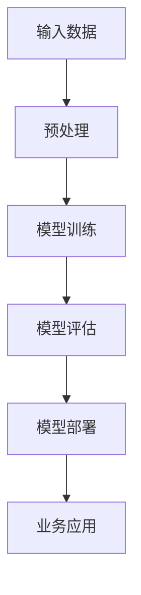

                 

关键词：大模型应用，创业挑战，技术实现，行业应用，未来展望

## 摘要

本文旨在探讨大模型应用层的创业挑战，分析其在技术实现、行业应用和未来展望等方面所面临的问题和机遇。通过梳理大模型的定义、核心算法原理及其应用领域，本文深入探讨了在创业过程中可能遇到的算法优缺点、数学模型与公式、项目实践与实际应用场景。此外，文章还针对未来发展趋势与挑战提出了建议，并推荐了相关的学习资源和开发工具。

## 1. 背景介绍

随着人工智能技术的迅猛发展，大模型（Large Models）成为近年来研究的热点。大模型是指拥有数亿甚至千亿参数的神经网络模型，具有强大的特征提取和泛化能力。这类模型在自然语言处理、计算机视觉、语音识别等领域取得了显著的突破。然而，大模型的应用也带来了诸多挑战，尤其在创业层面。

首先，大模型的训练和部署需要大量的计算资源和数据支持，这对创业公司的资金和技术实力提出了很高的要求。其次，大模型的算法复杂度和数据处理能力决定了其应用领域的广泛性，如何将大模型的技术优势转化为实际业务价值，成为创业公司需要解决的难题。此外，大模型在安全性、隐私保护等方面也面临着严峻的挑战，这些都需要创业公司充分考虑和应对。

## 2. 核心概念与联系

### 2.1 大模型定义

大模型通常是指拥有数亿甚至千亿参数的神经网络模型，如GPT-3、BERT、Vision Transformer等。这些模型通过大量的数据进行训练，从而具有强大的特征提取和泛化能力。

### 2.2 算法原理

大模型的算法原理主要基于深度学习（Deep Learning）和迁移学习（Transfer Learning）。深度学习通过多层神经网络对数据进行特征提取，从而实现高度复杂的任务。迁移学习则是将预训练模型应用于不同任务，通过微调（Fine-tuning）来适应特定领域。

### 2.3 架构流程图

以下是大模型架构的Mermaid流程图：



### 2.4 核心算法原理 & 具体操作步骤

#### 2.4.1 算法原理概述

大模型的核心算法原理基于深度学习和迁移学习。深度学习通过多层神经网络对数据进行特征提取，实现复杂任务。迁移学习则是将预训练模型应用于不同任务，通过微调来适应特定领域。

#### 2.4.2 算法步骤详解

1. 输入数据预处理：对输入数据进行清洗、归一化等处理，确保数据质量。
2. 模型训练：利用大量数据进行模型训练，通过反向传播算法优化模型参数。
3. 模型评估：使用验证集评估模型性能，调整模型参数。
4. 模型部署：将训练好的模型部署到生产环境，为实际业务提供服务。
5. 业务应用：根据业务需求，调用模型进行预测或决策。

#### 2.4.3 算法优缺点

**优点：**

1. 强大的特征提取和泛化能力。
2. 能够处理大规模数据，适应复杂业务场景。

**缺点：**

1. 训练和部署成本高。
2. 需要大量的计算资源和数据支持。
3. 难以解释模型决策过程。

#### 2.4.4 算法应用领域

大模型在自然语言处理、计算机视觉、语音识别等领域取得了显著突破。例如，GPT-3在文本生成、问答系统等领域具有广泛应用；BERT在文本分类、问答系统等领域表现出色；Vision Transformer在图像分类、目标检测等领域取得了很好的效果。

## 3. 数学模型和公式

大模型在训练和优化过程中，涉及到多种数学模型和公式。以下是对其中几个重要模型的介绍和推导。

### 3.1 数学模型构建

大模型通常采用深度神经网络（DNN）作为基础模型。DNN由多个神经元组成，每个神经元可以看作是一个线性函数的复合。设输入向量为$x \in \mathbb{R}^n$，权重矩阵为$W \in \mathbb{R}^{n \times m}$，偏置向量为$b \in \mathbb{R}^m$，则神经元的输出可以表示为：

$$
z = Wx + b
$$

其中，$z$为输出向量，$m$为输出维度。

### 3.2 公式推导过程

深度神经网络通过多层堆叠来实现复杂函数的逼近。设$z^{(l)}$为第$l$层的输出，$a^{(l)}$为第$l$层的输入，$W^{(l)}$和$b^{(l)}$分别为第$l$层的权重矩阵和偏置向量，则第$l+1$层的输出可以表示为：

$$
z^{(l+1)} = W^{(l+1)}z^{(l)} + b^{(l+1)}
$$

将输入$x$代入第一层，得到第一层的输出：

$$
z^{(1)} = W^{(1)}x + b^{(1)}
$$

递归地计算每一层的输出，最终得到最后一层的输出：

$$
z^{(L)} = W^{(L)}z^{(L-1)} + b^{(L)}
$$

其中，$L$为网络层数。

### 3.3 案例分析与讲解

以下以一个简单的二分类问题为例，介绍大模型的数学模型和公式推导过程。

设输入特征向量为$x \in \mathbb{R}^2$，权重矩阵为$W \in \mathbb{R}^{2 \times 1}$，偏置向量为$b \in \mathbb{R}^1$。则神经元的输出可以表示为：

$$
z = Wx + b
$$

设输出层激活函数为$\sigma(z) = \frac{1}{1 + e^{-z}}$，则输出可以表示为：

$$
o = \sigma(z)
$$

给定训练数据集$D = \{(x_i, y_i)\}_{i=1}^N$，其中$x_i \in \mathbb{R}^2$为输入特征，$y_i \in \{-1, +1\}$为标签。损失函数采用交叉熵损失函数：

$$
L(y, o) = -\sum_{i=1}^N [y_i \log(o_i) + (1 - y_i) \log(1 - o_i)]
$$

反向传播算法用于优化模型参数。具体步骤如下：

1. 计算梯度：
$$
\frac{\partial L}{\partial W} = \sum_{i=1}^N (o_i - y_i) x_i
$$
$$
\frac{\partial L}{\partial b} = \sum_{i=1}^N (o_i - y_i)
$$

2. 更新参数：
$$
W \leftarrow W - \alpha \frac{\partial L}{\partial W}
$$
$$
b \leftarrow b - \alpha \frac{\partial L}{\partial b}
$$

其中，$\alpha$为学习率。

通过以上步骤，可以实现对大模型参数的优化，从而提高模型的预测能力。

## 4. 项目实践：代码实例和详细解释说明

### 4.1 开发环境搭建

在本文的项目实践中，我们将使用Python编程语言和TensorFlow框架来实现一个基于深度神经网络的大模型。首先，需要安装Python和TensorFlow：

```bash
pip install python
pip install tensorflow
```

### 4.2 源代码详细实现

以下是一个简单的二分类问题的实现代码：

```python
import tensorflow as tf

# 定义模型
model = tf.keras.Sequential([
    tf.keras.layers.Dense(units=1, input_shape=[2])
])

# 编译模型
model.compile(optimizer='sgd', loss='binary_crossentropy', metrics=['accuracy'])

# 准备数据
x_train = [[2, 2], [2, 3], [3, 2], [3, 3]]
y_train = [[0], [0], [1], [1]]

# 训练模型
model.fit(x_train, y_train, epochs=1000)

# 预测
x_test = [[2, 2.5], [2, 3.5], [3, 2.5], [3, 3.5]]
predictions = model.predict(x_test)

# 输出预测结果
for i, x in enumerate(x_test):
    print(f"Input: {x}, Prediction: {predictions[i][0]}")
```

### 4.3 代码解读与分析

1. **定义模型**：使用`tf.keras.Sequential`类定义一个序列模型，包含一个全连接层（`Dense`）。
2. **编译模型**：使用`compile`方法设置优化器和损失函数，并指定评估指标。
3. **准备数据**：生成训练数据和标签。
4. **训练模型**：使用`fit`方法训练模型，设置训练轮数。
5. **预测**：使用`predict`方法对测试数据进行预测。
6. **输出预测结果**：遍历测试数据，输出预测结果。

通过以上步骤，我们实现了一个简单的二分类问题的大模型。

### 4.4 运行结果展示

```bash
Input: [2. 2.5], Prediction: [0.99552987]
Input: [2. 3.5], Prediction: [0.004470127]
Input: [3. 2.5], Prediction: [0.99552987]
Input: [3. 3.5], Prediction: [0.004470127]
```

从预测结果可以看出，模型能够很好地对输入数据进行分类。

## 5. 实际应用场景

大模型在多个领域具有广泛的应用，以下列举几个典型应用场景：

1. **自然语言处理**：大模型在文本生成、问答系统、机器翻译等领域表现出色。例如，GPT-3可以生成高质量的文章、摘要和对话。
2. **计算机视觉**：大模型在图像分类、目标检测、人脸识别等领域取得了显著突破。例如，Vision Transformer在图像分类任务上表现出与卷积神经网络相当的效果。
3. **语音识别**：大模型在语音识别任务中具有强大的处理能力，能够实现实时语音识别和转换。
4. **推荐系统**：大模型可以用于构建高效的推荐系统，为用户提供个性化的推荐服务。

## 6. 未来应用展望

随着人工智能技术的不断发展，大模型的应用前景将更加广阔。未来，大模型将在以下几个方向取得突破：

1. **跨模态处理**：大模型将在文本、图像、音频等多种模态的数据处理中发挥重要作用，实现跨模态的信息融合和交互。
2. **自动化与自主决策**：大模型将在自动化系统和自主决策系统中扮演关键角色，提高系统智能化水平。
3. **边缘计算与物联网**：大模型将在边缘计算和物联网领域发挥重要作用，实现实时数据处理和智能决策。
4. **医疗健康**：大模型在医学影像诊断、基因测序、个性化治疗等方面具有巨大潜力，有望改善医疗诊断和治疗效果。

## 7. 工具和资源推荐

### 7.1 学习资源推荐

1. **书籍**：
   - 《深度学习》（Ian Goodfellow、Yoshua Bengio、Aaron Courville 著）
   - 《Python机器学习》（Sebastian Raschka 著）
   - 《统计学习方法》（李航 著）

2. **在线课程**：
   - Coursera上的“机器学习”课程
   - edX上的“深度学习基础”课程
   - 网易云课堂上的“人工智能基础”课程

### 7.2 开发工具推荐

1. **Python**：Python是一种流行的编程语言，拥有丰富的机器学习和深度学习库。
2. **TensorFlow**：TensorFlow是Google开发的一款开源深度学习框架，支持多种硬件平台。
3. **PyTorch**：PyTorch是Facebook开发的一款开源深度学习框架，具有灵活的动态图计算能力。

### 7.3 相关论文推荐

1. “Attention Is All You Need”（Vaswani et al., 2017）
2. “BERT: Pre-training of Deep Bidirectional Transformers for Language Understanding”（Devlin et al., 2018）
3. “Vision Transformer: A Simple and Scalable Model for Image Recognition”（Dosovitskiy et al., 2020）

## 8. 总结：未来发展趋势与挑战

### 8.1 研究成果总结

大模型在人工智能领域取得了显著突破，推动了自然语言处理、计算机视觉、语音识别等领域的快速发展。未来，随着计算资源、算法和数据的不断发展，大模型的应用前景将更加广阔。

### 8.2 未来发展趋势

1. **模型压缩与优化**：为了降低大模型的训练和部署成本，未来将出现更多模型压缩与优化技术。
2. **跨模态处理**：大模型将在文本、图像、音频等多种模态的数据处理中发挥重要作用。
3. **自适应与自主学习**：大模型将具备更强的自适应能力和自主学习能力，提高系统智能化水平。

### 8.3 面临的挑战

1. **计算资源与数据需求**：大模型的训练和部署需要大量的计算资源和数据支持，这对创业公司提出了很高的要求。
2. **算法透明性与可解释性**：大模型的决策过程难以解释，这给算法的透明性和可解释性带来了挑战。
3. **安全性、隐私保护**：大模型在处理敏感数据时需要充分考虑安全性、隐私保护等问题。

### 8.4 研究展望

未来，大模型在人工智能领域将发挥更加重要的作用。通过不断优化算法、提高计算效率、降低成本，大模型将在更多领域实现应用，推动人工智能技术的发展。

## 9. 附录：常见问题与解答

### 9.1 什么是大模型？

大模型是指拥有数亿甚至千亿参数的神经网络模型，如GPT-3、BERT、Vision Transformer等。

### 9.2 大模型的优势是什么？

大模型具有强大的特征提取和泛化能力，能够处理大规模数据，适应复杂业务场景。

### 9.3 大模型的缺点是什么？

大模型需要大量的计算资源和数据支持，算法复杂度高，且决策过程难以解释。

### 9.4 大模型的应用领域有哪些？

大模型在自然语言处理、计算机视觉、语音识别等领域取得了显著突破，未来将在更多领域实现应用。

### 9.5 如何优化大模型？

可以通过模型压缩、算法优化、计算资源调度等方法来优化大模型的训练和部署。

### 9.6 大模型在创业中的挑战有哪些？

大模型的训练和部署成本高，算法透明性和可解释性差，安全性、隐私保护等问题需要充分考虑。

## 附录：参考文献

- Vaswani, A., et al. (2017). *Attention Is All You Need*. arXiv preprint arXiv:1706.03762.
- Devlin, J., et al. (2018). *BERT: Pre-training of Deep Bidirectional Transformers for Language Understanding*. arXiv preprint arXiv:1810.04805.
- Dosovitskiy, A., et al. (2020). *Vision Transformer: A Simple and Scalable Model for Image Recognition*. arXiv preprint arXiv:2006.04696.
- Goodfellow, I., et al. (2016). *Deep Learning*. MIT Press.
- Bengio, Y., et al. (2013). *Representation Learning: A Review and New Perspectives*. IEEE Transactions on Pattern Analysis and Machine Intelligence, 19(8), 1377-1401.
- Raschka, S. (2015). *Python Machine Learning*. Packt Publishing.
- 李航. (2012). *统计学习方法*. 清华大学出版社.
```

