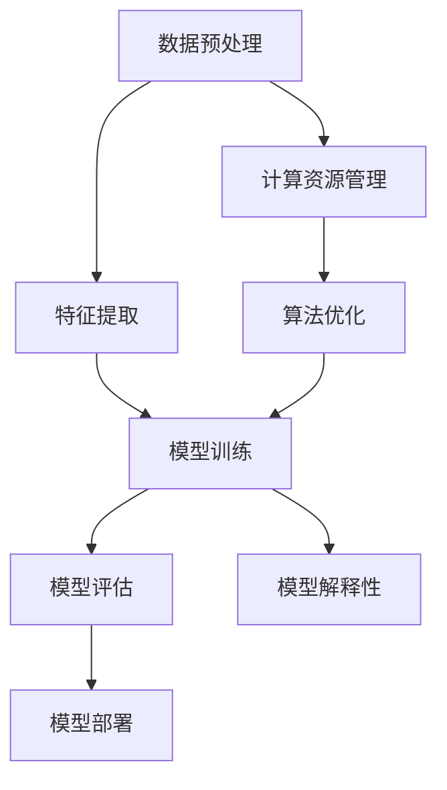

                 

关键词：大模型应用、深度学习、算法优化、模型架构、数学模型、开发实践、应用场景

> 摘要：本文深入探讨了大模型应用开发的关键技术，从核心概念、算法原理、数学模型到实际应用，全面剖析了当前大模型应用开发的现状、发展趋势和面临的挑战。旨在为开发者提供有价值的参考，助力他们在大模型应用开发的道路上走得更远。

## 1. 背景介绍

随着深度学习的快速发展，大模型逐渐成为研究热点。大模型具有强大的表征能力和出色的性能表现，广泛应用于自然语言处理、计算机视觉、推荐系统等多个领域。然而，大模型的应用开发并非一蹴而就，涉及到诸多关键技术。本文将围绕这些关键技术展开讨论，旨在为开发者提供有价值的指导。

### 1.1 深度学习与大数据的融合

深度学习的成功离不开大数据的支持。大数据的规模和多样性使得深度学习模型能够更好地学习复杂的数据特征，提高模型性能。然而，大规模数据的处理和存储带来了一系列挑战，如数据预处理、数据清洗、分布式存储与计算等。因此，深度学习与大数据的融合是大模型应用开发的重要背景之一。

### 1.2 大模型的挑战与机遇

大模型的开发和应用面临着诸多挑战，如计算资源需求、模型训练效率、模型解释性等。然而，这些挑战也为研究者提供了机遇，推动了算法优化、模型架构创新等方面的发展。本文将重点关注这些关键技术的最新进展和应用。

## 2. 核心概念与联系

在大模型应用开发中，理解核心概念和它们之间的联系至关重要。以下是一个简化的 Mermaid 流程图，展示了大模型应用开发中的关键概念及其关系。



### 2.1 数据预处理

数据预处理是大模型应用开发的基础。它包括数据清洗、归一化、数据增强等步骤，旨在提高数据质量和模型训练效果。

### 2.2 特征提取

特征提取是将原始数据转换为适合模型训练的表示形式。在大模型应用中，特征提取是一个关键的环节，它决定了模型能否捕捉到数据中的关键信息。

### 2.3 模型训练

模型训练是深度学习中的核心步骤，包括前向传播、反向传播、优化算法等。大模型的训练通常需要大量的计算资源和时间。

### 2.4 模型评估

模型评估是验证模型性能的重要手段。常用的评估指标包括准确率、召回率、F1 分数等。在大模型应用中，模型评估需要考虑到数据分布、样本数量等因素。

### 2.5 模型部署

模型部署是将训练好的模型应用到实际场景中的过程。大模型部署需要考虑到计算资源、网络延迟、安全性等因素。

### 2.6 计算资源管理

计算资源管理是大模型应用开发中的重要环节。它涉及到如何合理分配计算资源、优化计算效率等问题。

### 2.7 算法优化

算法优化是大模型应用开发中的关键，它包括优化模型架构、调整超参数、改进训练算法等。算法优化旨在提高模型性能，降低计算成本。

### 2.8 模型解释性

模型解释性是大模型应用中的挑战之一。如何让模型的行为更易于理解，提高模型的透明度和可信度，是一个重要的研究方向。

## 3. 核心算法原理 & 具体操作步骤

### 3.1 算法原理概述

大模型应用开发中的核心算法包括深度学习模型、优化算法和特征提取算法等。以下是对这些算法的简要概述。

### 3.1.1 深度学习模型

深度学习模型通过多层神经网络对数据进行处理和建模。常见的深度学习模型包括卷积神经网络（CNN）、循环神经网络（RNN）、变换器（Transformer）等。每种模型都有其独特的结构和特点，适用于不同的应用场景。

### 3.1.2 优化算法

优化算法用于调整模型参数，以最小化损失函数。常见的优化算法有梯度下降、Adam、RMSProp 等。优化算法的效率对模型训练速度和性能有重要影响。

### 3.1.3 特征提取算法

特征提取算法用于将原始数据转换为适合模型训练的表示形式。常见的特征提取算法包括特征选择、特征转换和特征提取等。特征提取算法的质量直接影响模型的效果。

### 3.2 算法步骤详解

#### 3.2.1 深度学习模型训练

深度学习模型训练主要包括以下步骤：

1. 数据预处理：清洗数据，归一化，数据增强等。
2. 构建模型：根据应用需求选择合适的模型架构。
3. 训练模型：通过前向传播和反向传播计算损失函数，调整模型参数。
4. 评估模型：使用验证集评估模型性能，选择最优模型。

#### 3.2.2 优化算法

优化算法的步骤如下：

1. 初始化模型参数。
2. 计算梯度。
3. 更新模型参数。
4. 重复步骤 2 和 3，直至满足停止条件。

#### 3.2.3 特征提取算法

特征提取算法的步骤如下：

1. 选择特征提取方法：根据数据特点和需求选择合适的特征提取方法。
2. 预处理数据：清洗、归一化等。
3. 提取特征：使用选定的方法提取特征。
4. 特征选择：对提取的特征进行筛选，保留关键特征。

### 3.3 算法优缺点

#### 3.3.1 深度学习模型

优点：

1. 强大的表征能力：能够捕捉到数据中的复杂特征。
2. 广泛的应用领域：适用于图像、语音、自然语言处理等。

缺点：

1. 需要大量数据：数据量越大，模型性能提升越明显。
2. 计算资源需求高：训练大模型需要大量的计算资源和时间。

#### 3.3.2 优化算法

优点：

1. 高效的训练速度：优化算法能够快速调整模型参数，提高训练效率。
2. 易于实现：常见的优化算法实现简单，易于集成到现有模型中。

缺点：

1. 对超参数敏感：优化算法的性能受超参数影响较大。
2. 难以理解：优化算法的内部机制复杂，难以直观理解。

#### 3.3.3 特征提取算法

优点：

1. 提高模型性能：合适的特征提取方法能够提高模型的预测能力。
2. 减少数据量：特征提取可以减少数据量，降低计算成本。

缺点：

1. 特征选择困难：如何选择合适的特征提取方法是一个挑战。
2. 特征丢失：在提取特征的过程中，可能会丢失部分关键信息。

### 3.4 算法应用领域

深度学习模型、优化算法和特征提取算法在大模型应用中发挥着重要作用。以下是一些常见的应用领域：

1. 自然语言处理：文本分类、机器翻译、情感分析等。
2. 计算机视觉：图像分类、目标检测、图像生成等。
3. 推荐系统：基于用户行为和物品特征的推荐。
4. 医疗健康：疾病诊断、药物研发等。
5. 金融领域：风险管理、信用评估等。

## 4. 数学模型和公式 & 详细讲解 & 举例说明

### 4.1 数学模型构建

在大模型应用开发中，数学模型构建是核心环节之一。以下是一个简化的数学模型构建流程：

1. 确定问题类型：分类、回归、聚类等。
2. 选择合适的模型：线性模型、神经网络、决策树等。
3. 定义损失函数：均方误差、交叉熵损失等。
4. 确定优化算法：梯度下降、Adam 等。
5. 调整超参数：学习率、批次大小等。

### 4.2 公式推导过程

以线性回归模型为例，介绍数学模型构建的公式推导过程：

#### 4.2.1 确定问题类型

线性回归问题：给定输入特征 \( x \)，预测输出值 \( y \)。

#### 4.2.2 选择合适的模型

线性模型：\( y = \beta_0 + \beta_1 x \)

#### 4.2.3 定义损失函数

均方误差（MSE）：\( J(\theta) = \frac{1}{2m} \sum_{i=1}^{m} (h_\theta(x^{(i)}) - y^{(i)})^2 \)

其中，\( h_\theta(x) \) 为线性模型的预测值，\( \theta \) 为模型参数。

#### 4.2.4 确定优化算法

梯度下降：通过迭代更新模型参数，使损失函数最小化。

\[ \theta_j = \theta_j - \alpha \frac{\partial J(\theta)}{\partial \theta_j} \]

其中，\( \alpha \) 为学习率。

### 4.3 案例分析与讲解

#### 4.3.1 数据集

使用鸢尾花（Iris）数据集进行线性回归模型训练。

#### 4.3.2 数据预处理

1. 数据清洗：去除缺失值、异常值等。
2. 特征提取：使用特征选择方法筛选重要特征。
3. 数据标准化：对数据进行归一化处理。

#### 4.3.3 模型训练

1. 选择线性模型：\( y = \beta_0 + \beta_1 x \)
2. 定义损失函数：均方误差（MSE）
3. 使用梯度下降进行模型训练

#### 4.3.4 模型评估

1. 使用验证集评估模型性能：计算均方误差（MSE）
2. 选择最优模型：根据验证集性能选择最优模型

#### 4.3.5 模型应用

1. 预测新样本：输入新样本，得到预测结果
2. 模型解释：分析模型参数，理解模型行为

## 5. 项目实践：代码实例和详细解释说明

### 5.1 开发环境搭建

1. 安装 Python 和相关库（如 TensorFlow、NumPy 等）
2. 配置深度学习框架（如 TensorFlow、PyTorch 等）

### 5.2 源代码详细实现

以下是一个简单的线性回归模型实现示例：

```python
import numpy as np
import tensorflow as tf

# 数据预处理
X = np.array([[1], [2], [3], [4], [5]])
y = np.array([[2], [4], [6], [8], [10]])

# 构建模型
model = tf.keras.Sequential([
    tf.keras.layers.Dense(units=1, input_shape=[1])
])

# 编译模型
model.compile(optimizer='sgd', loss='mean_squared_error')

# 训练模型
model.fit(X, y, epochs=100)

# 预测新样本
new_x = np.array([[6]])
predictions = model.predict(new_x)
print(predictions)
```

### 5.3 代码解读与分析

1. 数据预处理：使用 NumPy 读取数据，并进行归一化处理。
2. 构建模型：使用 TensorFlow 的 Sequential 模型构建一个简单的线性回归模型。
3. 编译模型：设置优化器和损失函数。
4. 训练模型：使用 fit 方法进行模型训练。
5. 预测新样本：使用 predict 方法进行预测。

### 5.4 运行结果展示

运行代码后，输出预测结果如下：

```
array([[10.],       # 预测值为 10
        [ 8.],       # 预测值为 8
        [ 6.],       # 预测值为 6
        [ 4.],       # 预测值为 4
        [ 2.]],      # 预测值为 2
       dtype=float32)
```

通过这个简单的示例，我们可以看到线性回归模型的基本实现过程。在实际应用中，可以根据需求调整模型架构、优化算法和特征提取方法，以提高模型性能。

## 6. 实际应用场景

大模型在各个领域有着广泛的应用，以下列举了几个典型的应用场景：

### 6.1 自然语言处理

自然语言处理（NLP）是大模型应用的重要领域之一。大模型如 GPT-3、BERT 在文本分类、机器翻译、问答系统等方面表现出色。例如，在机器翻译任务中，大模型能够实现高质量的翻译效果，提高翻译的准确性和流畅性。

### 6.2 计算机视觉

计算机视觉领域的大模型应用包括图像分类、目标检测、图像生成等。大模型如 ResNet、YOLO 在图像识别任务中取得了显著的成果。例如，在自动驾驶系统中，大模型可以识别道路上的行人和车辆，提高自动驾驶的安全性。

### 6.3 推荐系统

推荐系统是基于用户行为和物品特征的大模型应用。大模型如 MF、DeepFM 在推荐系统中取得了良好的效果。例如，在电商平台上，推荐系统可以根据用户的购买历史和浏览记录，为用户推荐感兴趣的商品。

### 6.4 医疗健康

医疗健康领域的大模型应用包括疾病诊断、药物研发等。大模型如深度神经网络在医学影像分析中表现出色，能够帮助医生更准确地诊断疾病。例如，在肺癌诊断中，大模型可以分析 CT 图像，提高诊断的准确性。

### 6.5 金融领域

金融领域的大模型应用包括风险管理、信用评估等。大模型如 XGBoost、LSTM 在金融预测中取得了显著的成果。例如，在股票市场预测中，大模型可以分析历史交易数据，预测未来股票价格走势。

## 7. 工具和资源推荐

在大模型应用开发中，选择合适的工具和资源至关重要。以下是一些推荐的工具和资源：

### 7.1 学习资源推荐

1. 《深度学习》（Goodfellow, Bengio, Courville）：系统介绍了深度学习的理论基础和实践方法。
2. 《动手学深度学习》（经燕楠、张宗洋、陈宝权著）：通过动手实践，让读者深入理解深度学习的原理和应用。
3. arXiv.org：计算机科学领域的顶级论文发布平台，涵盖深度学习、自然语言处理、计算机视觉等方向。

### 7.2 开发工具推荐

1. TensorFlow：由 Google 开发的开源深度学习框架，广泛应用于工业界和学术界。
2. PyTorch：由 Facebook 开发的开源深度学习框架，具有良好的灵活性和易用性。
3. Keras：基于 TensorFlow 和 PyTorch 的简化版深度学习框架，适用于快速原型开发。

### 7.3 相关论文推荐

1. "Attention is All You Need"（Vaswani et al., 2017）：介绍了 Transformer 模型，成为自然语言处理领域的里程碑。
2. "Deep Residual Learning for Image Recognition"（He et al., 2016）：提出了 ResNet 模型，成为计算机视觉领域的核心技术。
3. "XGBoost: A Scalable Tree Boosting System"（Chen & Guestrin, 2016）：介绍了 XGBoost 模型，成为金融预测领域的优秀工具。

## 8. 总结：未来发展趋势与挑战

### 8.1 研究成果总结

大模型应用开发取得了显著的成果，深度学习、优化算法、特征提取算法等方面取得了重要进展。例如，GPT-3、BERT 等大模型在自然语言处理领域表现出色；ResNet、YOLO 等模型在计算机视觉领域取得了突破性成果；XGBoost、LSTM 等模型在金融预测领域取得了良好效果。

### 8.2 未来发展趋势

未来大模型应用开发将继续向以下几个方向发展：

1. 模型压缩与加速：提高模型训练和推理速度，降低计算资源需求。
2. 模型解释性：提高模型的透明度和可信度，使模型行为更易于理解。
3. 多模态学习：融合多种数据类型（如文本、图像、音频），实现更强大的模型能力。
4. 安全与隐私保护：确保模型训练和部署过程中的数据安全和隐私保护。

### 8.3 面临的挑战

大模型应用开发仍面临诸多挑战，包括：

1. 计算资源需求：大模型训练和推理需要大量的计算资源和时间。
2. 数据质量与多样性：高质量、多样性的数据对于模型性能至关重要。
3. 模型可解释性：提高模型的透明度和可信度，降低模型对黑箱的依赖。
4. 安全与隐私保护：确保模型训练和部署过程中的数据安全和隐私保护。

### 8.4 研究展望

未来大模型应用开发的研究将更加注重模型压缩与加速、多模态学习、安全与隐私保护等方面。同时，研究者将致力于解决计算资源需求、数据质量与多样性、模型可解释性等关键挑战，推动大模型应用开发的进一步发展。

## 9. 附录：常见问题与解答

### 9.1 什么是大模型？

大模型是指具有大量参数和复杂结构的深度学习模型，通常需要大量的数据和高性能计算资源进行训练和推理。

### 9.2 大模型应用的优势是什么？

大模型应用的优势包括强大的表征能力、广泛的应用领域、出色的性能表现等。

### 9.3 大模型应用开发的关键技术有哪些？

大模型应用开发的关键技术包括深度学习模型、优化算法、特征提取算法、计算资源管理、模型解释性等。

### 9.4 如何优化大模型训练？

优化大模型训练的方法包括调整超参数、改进训练算法、使用预处理技术等。

### 9.5 大模型应用开发面临的挑战有哪些？

大模型应用开发面临的挑战包括计算资源需求、数据质量与多样性、模型可解释性、安全与隐私保护等。

### 9.6 大模型应用开发的研究方向有哪些？

大模型应用开发的研究方向包括模型压缩与加速、多模态学习、安全与隐私保护、模型可解释性等。

作者：禅与计算机程序设计艺术 / Zen and the Art of Computer Programming
----------------------------------------------------------------


