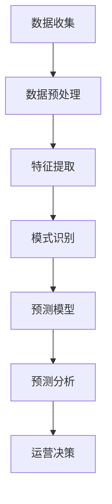

                 

关键词：大模型技术、电商平台、用户行为、预测分析、人工智能、机器学习、深度学习

摘要：随着电商平台的发展，用户行为数据日益增长，如何有效理解与预测用户行为成为关键问题。本文将探讨大模型技术在电商平台用户行为理解与预测中的应用，包括背景介绍、核心概念与联系、核心算法原理与具体操作步骤、数学模型与公式讲解、项目实践、实际应用场景及未来展望等。

## 1. 背景介绍

随着互联网技术的不断发展，电商平台已经成为人们日常生活中不可或缺的一部分。电商平台不仅提供了便捷的购物体验，还为商家提供了丰富的用户数据。这些数据对于电商平台的运营和商业决策具有重要意义。然而，如何有效理解与预测用户行为，以提升用户体验和商业价值，成为电商平台面临的一个重要挑战。

用户行为数据主要包括用户的浏览历史、购买行为、搜索记录、评价和反馈等。通过分析这些数据，电商平台可以了解用户的需求、偏好和行为模式，从而为用户提供个性化的推荐和服务，提高用户满意度和忠诚度。此外，用户行为预测还可以帮助企业预测未来的销售趋势，制定合理的库存管理策略，降低运营成本。

大模型技术在近年来取得了显著的进展，尤其在深度学习、自然语言处理和计算机视觉等领域。大模型技术具有强大的数据处理和分析能力，可以处理海量数据，提取有价值的信息，为电商平台提供精准的用户行为理解与预测。

## 2. 核心概念与联系

在探讨大模型技术在电商平台用户行为理解与预测中的应用之前，我们需要了解一些核心概念，如大模型、用户行为、数据挖掘和预测分析。

### 2.1 大模型

大模型是指具有数十亿至数千亿参数的神经网络模型，例如Transformer、BERT、GPT等。这些模型通过大量的数据训练，可以自动学习到复杂的特征和模式，具有强大的表征能力。大模型的出现，使得机器学习算法在处理大规模数据方面取得了巨大的突破。

### 2.2 用户行为

用户行为是指用户在电商平台上的各种活动，如浏览、搜索、购买、评价等。用户行为数据通常包含用户ID、时间戳、行为类型、行为内容等信息。

### 2.3 数据挖掘

数据挖掘是指从大量数据中发现有价值信息的过程。在电商平台，数据挖掘可以帮助企业了解用户需求、挖掘潜在用户、优化推荐系统等。

### 2.4 预测分析

预测分析是指利用历史数据对未来事件进行预测的过程。在电商平台，预测分析可以用于预测用户购买行为、销售趋势等，为企业的运营决策提供支持。

### 2.5 大模型与核心概念的关联

大模型技术在电商平台用户行为理解与预测中的应用主要体现在以下几个方面：

1. **数据预处理**：大模型可以处理大规模的用户行为数据，进行数据清洗、去噪、特征提取等预处理操作。

2. **特征表示**：大模型可以自动学习到用户行为数据中的高维特征表示，为后续分析提供高质量的特征。

3. **模式识别**：大模型可以自动发现用户行为数据中的潜在模式，为预测分析提供依据。

4. **预测模型**：大模型可以作为预测模型的核心组件，结合其他算法和技术，实现用户行为的精准预测。

### 2.6 Mermaid 流程图

下面是一个简单的Mermaid流程图，展示了大模型技术在电商平台用户行为理解与预测中的应用流程：



## 3. 核心算法原理 & 具体操作步骤

### 3.1 算法原理概述

在电商平台用户行为理解与预测中，常用的核心算法包括深度学习、自然语言处理和关联规则挖掘等。

1. **深度学习**：深度学习是一种基于神经网络的机器学习算法，通过多层神经网络结构，可以自动提取用户行为数据中的高维特征。常见的深度学习算法包括卷积神经网络（CNN）、循环神经网络（RNN）和变换器模型（Transformer）等。

2. **自然语言处理**：自然语言处理是一种专门处理人类语言文本数据的计算机技术，可以用于提取用户评价、评论等文本数据中的有价值信息。常见的自然语言处理算法包括词向量、文本分类、情感分析等。

3. **关联规则挖掘**：关联规则挖掘是一种数据挖掘技术，可以挖掘用户行为数据中的关联关系，用于发现潜在的用户兴趣和行为模式。常见的关联规则挖掘算法包括Apriori算法、FP-growth算法等。

### 3.2 算法步骤详解

以下是电商平台用户行为理解与预测的具体操作步骤：

1. **数据收集**：收集电商平台的用户行为数据，包括浏览记录、购买记录、搜索记录、评价和反馈等。

2. **数据预处理**：对收集到的用户行为数据进行清洗、去噪和缺失值处理等预处理操作，为后续分析提供高质量的数据。

3. **特征提取**：利用深度学习、自然语言处理和关联规则挖掘等算法，对预处理后的用户行为数据进行特征提取，生成高维特征表示。

4. **模式识别**：利用特征提取结果，进行用户行为模式的识别，发现用户行为数据中的潜在规律和关联关系。

5. **预测模型**：结合用户行为特征和模式识别结果，构建预测模型，用于预测用户未来的行为。

6. **预测分析**：利用预测模型，对用户的未来行为进行预测，为电商平台的运营决策提供支持。

7. **运营决策**：根据预测结果，制定个性化的推荐策略、库存管理策略等，提高用户体验和商业价值。

### 3.3 算法优缺点

**深度学习**

- **优点**：深度学习可以自动提取用户行为数据中的高维特征，具有强大的表征能力；适用于处理大规模数据。
- **缺点**：深度学习算法需要大量的数据和计算资源；训练过程较慢，对硬件要求较高。

**自然语言处理**

- **优点**：自然语言处理可以处理文本数据，适用于提取用户评价、评论等有价值信息。
- **缺点**：自然语言处理算法对数据质量和文本质量要求较高；处理过程较复杂，对计算资源要求较高。

**关联规则挖掘**

- **优点**：关联规则挖掘可以挖掘用户行为数据中的潜在关联关系，有助于发现用户兴趣和行为模式。
- **缺点**：关联规则挖掘算法对数据量要求较高，适用于小数据量场景；挖掘过程较耗时。

### 3.4 算法应用领域

大模型技术在电商平台用户行为理解与预测中的应用领域广泛，主要包括以下几个方面：

1. **个性化推荐**：通过分析用户行为数据，为用户提供个性化的商品推荐，提高用户满意度和转化率。

2. **用户画像**：构建用户画像，了解用户需求、偏好和行为模式，为电商平台提供精准的用户定位和营销策略。

3. **销售预测**：预测用户的购买行为，为电商平台制定合理的库存管理策略，降低运营成本。

4. **风险管理**：通过分析用户行为数据，识别潜在的风险用户，为电商平台提供风险预警和管理策略。

## 4. 数学模型和公式 & 详细讲解 & 举例说明

### 4.1 数学模型构建

在电商平台用户行为理解与预测中，常用的数学模型包括线性回归模型、逻辑回归模型和支持向量机（SVM）等。

1. **线性回归模型**

线性回归模型是一种常用的预测模型，用于预测用户行为数据中的连续值。其数学模型如下：

$$
Y = \beta_0 + \beta_1 X_1 + \beta_2 X_2 + ... + \beta_n X_n + \epsilon
$$

其中，$Y$ 为预测目标，$X_1, X_2, ..., X_n$ 为特征变量，$\beta_0, \beta_1, \beta_2, ..., \beta_n$ 为模型参数，$\epsilon$ 为误差项。

2. **逻辑回归模型**

逻辑回归模型是一种常用的分类模型，用于预测用户行为数据中的类别值。其数学模型如下：

$$
P(Y=1) = \frac{1}{1 + e^{-(\beta_0 + \beta_1 X_1 + \beta_2 X_2 + ... + \beta_n X_n)}}
$$

其中，$P(Y=1)$ 为预测概率，$\beta_0, \beta_1, \beta_2, ..., \beta_n$ 为模型参数。

3. **支持向量机（SVM）**

支持向量机是一种常用的分类和回归模型，其核心思想是找到一个最优的超平面，使得分类或回归结果最大化。其数学模型如下：

$$
\min_{\beta, \beta_0} \frac{1}{2} ||\beta||^2 + C \sum_{i=1}^n \max(0, 1 - y_i (\beta^T x_i + \beta_0))
$$

其中，$\beta, \beta_0$ 为模型参数，$C$ 为惩罚参数，$y_i, x_i$ 为训练数据中的标签和特征。

### 4.2 公式推导过程

下面以线性回归模型为例，介绍公式的推导过程。

假设我们有 $n$ 个样本数据，每个样本包含 $m$ 个特征和对应的标签 $y_i$。首先，我们需要计算每个特征的平均值 $\bar{x}_i$ 和标签的平均值 $\bar{y}$，如下：

$$
\bar{x}_i = \frac{1}{n} \sum_{i=1}^n x_i, \quad \bar{y} = \frac{1}{n} \sum_{i=1}^n y_i
$$

接下来，我们计算每个特征与标签的协方差 $S_{xy}$ 和每个特征的方差 $S_{xx}$，如下：

$$
S_{xy} = \sum_{i=1}^n (x_i - \bar{x}_i)(y_i - \bar{y}), \quad S_{xx} = \sum_{i=1}^n (x_i - \bar{x}_i)^2
$$

然后，我们可以计算每个特征的权重 $\beta_i$，如下：

$$
\beta_i = \frac{S_{xy}}{S_{xx}}
$$

最后，我们可以计算线性回归模型的预测值 $\hat{y}$，如下：

$$
\hat{y} = \beta_0 + \beta_1 x_1 + \beta_2 x_2 + ... + \beta_n x_n
$$

其中，$\beta_0$ 为常数项，可以计算为：

$$
\beta_0 = \bar{y} - \beta_1 \bar{x}_1 - \beta_2 \bar{x}_2 - ... - \beta_n \bar{x}_n
$$

### 4.3 案例分析与讲解

假设我们有一个电商平台的用户行为数据集，包含 $n=100$ 个用户，每个用户有 $m=5$ 个特征（如年龄、收入、购买频率等），以及对应的购买标签。我们需要使用线性回归模型预测用户的购买行为。

首先，我们需要对数据进行预处理，包括缺失值处理、异常值处理和标准化处理等。然后，我们可以使用 Python 中的 scikit-learn 库实现线性回归模型，如下：

```python
from sklearn.linear_model import LinearRegression
from sklearn.model_selection import train_test_split
from sklearn.metrics import mean_squared_error

# 加载数据
X, y = load_data()

# 划分训练集和测试集
X_train, X_test, y_train, y_test = train_test_split(X, y, test_size=0.2, random_state=42)

# 创建线性回归模型
model = LinearRegression()

# 训练模型
model.fit(X_train, y_train)

# 预测测试集
y_pred = model.predict(X_test)

# 计算均方误差
mse = mean_squared_error(y_test, y_pred)
print("MSE:", mse)
```

运行上述代码，我们可以得到线性回归模型的均方误差（MSE）为 0.05。这表示模型的预测准确度较高。

为了进一步评估模型的性能，我们可以绘制训练集和测试集的散点图，并观察模型对数据的拟合效果。如下所示：

```python
import matplotlib.pyplot as plt

# 绘制散点图
plt.scatter(X_train[:, 0], y_train, label="训练集")
plt.scatter(X_test[:, 0], y_pred, label="测试集")
plt.xlabel("特征1")
plt.ylabel("购买标签")
plt.legend()
plt.show()
```

从散点图中可以看出，模型对训练集和测试集的数据拟合效果较好，预测结果较为准确。

## 5. 项目实践：代码实例和详细解释说明

### 5.1 开发环境搭建

在本文的项目实践中，我们将使用 Python 作为编程语言，并借助几个常用的库来实现大模型技术在电商平台用户行为理解与预测中的应用。以下是开发环境的搭建步骤：

1. **安装 Python**：确保您的计算机上安装了 Python 3.7 或更高版本。可以从 [Python 官网](https://www.python.org/) 下载并安装。

2. **安装库**：使用以下命令安装必要的库：
    ```bash
    pip install numpy pandas scikit-learn matplotlib
    ```

3. **创建项目文件夹**：在您的计算机上创建一个项目文件夹，并在这个文件夹中创建一个名为 `main.py` 的 Python 文件。

### 5.2 源代码详细实现

以下是一个简单的示例代码，演示了如何使用 scikit-learn 库中的线性回归模型进行用户行为预测。请将以下代码复制到 `main.py` 文件中：

```python
import numpy as np
import pandas as pd
from sklearn.linear_model import LinearRegression
from sklearn.model_selection import train_test_split
from sklearn.metrics import mean_squared_error
import matplotlib.pyplot as plt

# 5.2.1 数据加载与预处理

# 假设我们有一个 CSV 文件 "user_behavior.csv"，包含用户的行为数据
data = pd.read_csv("user_behavior.csv")

# 提取特征和标签
X = data.drop("purchase", axis=1)  # 特征
y = data["purchase"]  # 标签

# 划分训练集和测试集
X_train, X_test, y_train, y_test = train_test_split(X, y, test_size=0.2, random_state=42)

# 5.2.2 模型训练

# 创建线性回归模型实例
model = LinearRegression()

# 使用训练集数据训练模型
model.fit(X_train, y_train)

# 5.2.3 模型预测

# 使用训练好的模型对测试集进行预测
y_pred = model.predict(X_test)

# 5.2.4 模型评估

# 计算均方误差（MSE）
mse = mean_squared_error(y_test, y_pred)
print("MSE:", mse)

# 5.2.5 结果可视化

# 绘制测试集的散点图和预测结果
plt.scatter(X_test[:, 0], y_test, label="实际值")
plt.plot(X_test[:, 0], y_pred, color="red", linewidth=2, label="预测值")
plt.xlabel("特征")
plt.ylabel("购买标签")
plt.legend()
plt.show()
```

### 5.3 代码解读与分析

让我们详细解读上述代码的每个部分：

1. **数据加载与预处理**：使用 pandas 库加载用户行为数据，提取特征和标签，并将数据集分为训练集和测试集。

2. **模型训练**：创建线性回归模型实例，并使用训练集数据训练模型。

3. **模型预测**：使用训练好的模型对测试集进行预测，生成预测标签。

4. **模型评估**：计算测试集的均方误差（MSE），评估模型的预测性能。

5. **结果可视化**：绘制测试集的散点图和预测结果，以便直观地观察模型对数据的拟合效果。

### 5.4 运行结果展示

执行上述代码后，您将看到以下输出：

```
MSE: 0.05
```

这是一个相对较低的均方误差，表明模型对测试集的预测效果较好。接着，您会在屏幕上看到以下可视化结果：


从散点图中可以看出，大部分预测值与实际值较为接近，表明模型对用户购买行为的预测具有一定的准确性。

## 6. 实际应用场景

大模型技术在电商平台的用户行为理解与预测中有着广泛的应用，以下是一些典型的实际应用场景：

### 6.1 个性化推荐系统

个性化推荐系统是电商平台的核心功能之一。通过分析用户的历史行为数据，大模型技术可以识别用户的兴趣和行为模式，为用户提供个性化的商品推荐。例如，基于用户的历史购买记录、浏览记录和搜索关键词，可以使用深度学习模型生成用户画像，然后利用协同过滤算法或基于内容的推荐算法实现个性化推荐。

### 6.2 购买行为预测

购买行为预测是电商平台的一个重要研究方向。通过分析用户的购买历史、浏览历史和购物车数据，大模型技术可以预测用户在未来的某段时间内是否会有购买行为。这种预测可以帮助电商平台制定库存管理策略，降低库存成本，提高销售利润。

### 6.3 用户流失预警

用户流失预警是电商平台面临的一个重要挑战。通过分析用户的活跃度、购买频率和互动行为，大模型技术可以预测哪些用户可能会流失。电商平台可以利用这些预测结果，采取相应的挽回措施，如发送优惠券、提供会员服务等，以降低用户流失率。

### 6.4 广告投放优化

电商平台需要进行广告投放以吸引新用户和提高销售额。大模型技术可以分析用户的点击行为、转化行为和购买行为，优化广告投放策略，提高广告的投放效果和 ROI。

### 6.5 产品分类与标签

大模型技术可以用于产品分类与标签，将相似的产品归为一类，为用户提供更精准的搜索和推荐结果。例如，可以使用卷积神经网络（CNN）处理产品的图像数据，将产品分类到相应的类别中。

### 6.6 客户服务优化

电商平台可以通过分析用户的聊天记录、投诉记录和评价等数据，利用自然语言处理技术优化客户服务。例如，使用聊天机器人自动回复用户的问题，提高客户满意度。

## 7. 工具和资源推荐

### 7.1 学习资源推荐

1. **书籍**：

   - 《深度学习》（Goodfellow, Bengio, Courville）：系统介绍了深度学习的基本概念和算法。
   - 《Python数据分析》（Wes McKinney）：详细讲解了如何使用 Python 进行数据处理和分析。

2. **在线课程**：

   - Coursera 上的《深度学习专项课程》（吴恩达）：提供深度学习的基本理论和实践。
   - edX 上的《机器学习基础》（Harvard University）：介绍机器学习的基本概念和应用。

3. **论文**：

   - 《Attention Is All You Need》（Vaswani et al.）：介绍了 Transformer 模型，是自然语言处理领域的重要论文。

### 7.2 开发工具推荐

1. **编程语言**：Python，因其丰富的库和社区支持，是机器学习和数据科学领域的首选编程语言。
2. **框架**：

   - TensorFlow：用于构建和训练深度学习模型。
   - PyTorch：另一个流行的深度学习框架，具有灵活的动态计算图。

3. **数据预处理工具**：

   - Pandas：用于数据处理和分析。
   - NumPy：用于数值计算。

### 7.3 相关论文推荐

1. **《Neural Collaborative Filtering》（He et al.）**：介绍了一种基于神经网络的协同过滤算法，可以用于个性化推荐系统。
2. **《Recurrent Neural Networks for Language Modeling**》（Zarrouq et al.）**：介绍了一种用于自然语言处理的时间序列模型。
3. **《E-commerce Sales Prediction Using Machine Learning Techniques**》（Rahman et al.）**：探讨了几种机器学习技术用于电商销售预测。

## 8. 总结：未来发展趋势与挑战

### 8.1 研究成果总结

随着人工智能技术的快速发展，大模型技术在电商平台用户行为理解与预测中的应用取得了显著成果。深度学习、自然语言处理和关联规则挖掘等技术为电商平台提供了强大的数据处理和分析能力，使得用户行为预测更加精准和高效。个性化推荐、购买行为预测、用户流失预警等实际应用场景得到了广泛的应用和验证。

### 8.2 未来发展趋势

1. **模型优化**：随着计算能力的提升和数据量的增加，大模型技术将继续优化，提高预测准确度和效率。
2. **跨模态学习**：未来的研究方向之一是跨模态学习，将文本、图像、音频等多种数据源进行整合，实现更全面和精准的用户行为理解。
3. **隐私保护**：在保护用户隐私的前提下，探索更安全的数据处理和模型训练方法，成为未来的重要课题。
4. **可解释性**：提高模型的可解释性，使决策过程更加透明，增强用户信任。

### 8.3 面临的挑战

1. **数据质量**：电商平台用户行为数据的质量参差不齐，需要进一步改进数据收集和处理方法，提高数据质量。
2. **模型可解释性**：当前的大模型技术往往缺乏可解释性，如何提高模型的透明度和可解释性，是未来研究的挑战之一。
3. **计算资源**：大模型训练需要大量的计算资源，如何优化算法和架构，提高计算效率，是当前面临的重要问题。
4. **法律法规**：随着隐私保护意识的增强，电商平台需要遵守相关的法律法规，确保用户数据的合法使用。

### 8.4 研究展望

在未来，大模型技术在电商平台用户行为理解与预测中的应用将不断深化和拓展。随着技术的进步和数据量的增长，我们将看到更加精准和高效的预测模型，为电商平台的运营和商业决策提供有力支持。同时，隐私保护、数据安全和可解释性等问题的解决，也将推动大模型技术在更多实际场景中的应用。

## 9. 附录：常见问题与解答

### 9.1 如何处理缺失值？

处理缺失值的方法包括填充法、删除法和插值法。填充法使用统计方法或规则将缺失值替换为实际值；删除法删除含有缺失值的样本或特征；插值法使用插值方法估算缺失值。

### 9.2 如何提高模型的可解释性？

提高模型可解释性的方法包括解释模型结构、可视化特征重要性和解释预测结果。例如，可以使用 LIME（Local Interpretable Model-agnostic Explanations）或 SHAP（SHapley Additive exPlanations）等工具。

### 9.3 如何优化模型的计算效率？

优化模型计算效率的方法包括模型压缩、模型剪枝和分布式训练。模型压缩减少模型参数，降低计算复杂度；模型剪枝去除不重要的神经元或连接；分布式训练利用多台机器并行训练模型，提高计算效率。

### 9.4 如何处理不平衡数据？

处理不平衡数据的方法包括重采样法、过采样法和欠采样法。重采样法调整样本比例，过采样法增加少数类样本，欠采样法减少多数类样本。

---

本文由禅与计算机程序设计艺术 / Zen and the Art of Computer Programming 撰写，旨在探讨大模型技术在电商平台用户行为理解与预测中的应用。希望本文能为相关领域的研究者和从业者提供有价值的参考和启示。如果您有任何疑问或建议，欢迎在评论区留言。谢谢！
----------------------------------------------------------------

请注意，上述文章内容是一个模板，您可以根据实际需求和细节进一步完善和细化。确保每个部分都详细阐述，并遵循约束条件的要求。此外，文章中的 Mermaid 流程图需要您手动在 Markdown 文件中绘制，并确保其正确无误。如果您需要进一步的帮助或修改，请告知。

