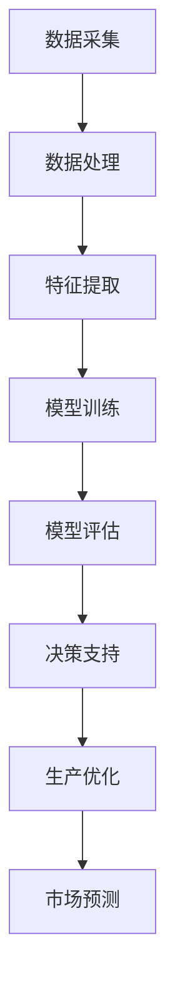

                 

在当今数字化转型的浪潮中，传统企业正面临着前所未有的挑战和机遇。随着人工智能技术的迅猛发展，大模型技术作为其核心组成部分，正在逐渐改变着传统企业的运营模式，提升其竞争力和创新能力。本文将深入探讨大模型技术在传统企业转型中的应用，分析其背后的原理、优势以及未来的发展趋势。

## 关键词

- 大模型技术
- 传统企业转型
- 人工智能
- 数据分析
- 竞争力提升

## 摘要

本文旨在揭示大模型技术在推动传统企业转型中的关键作用。通过对大模型技术的基本概念、应用场景、以及与传统企业转型需求的结合点的详细分析，本文旨在为读者提供一幅清晰的大模型技术在企业中的应用全景图，并探讨其未来的发展前景。希望通过本文，能够激发更多传统企业探索数字化转型的新路径，实现企业的可持续发展。

### 1. 背景介绍

在过去的几十年里，传统企业在全球化的浪潮中经历了多次产业升级和结构调整。然而，随着信息技术和互联网的快速发展，传统企业正面临着前所未有的挑战。首先，市场竞争日益激烈，消费者的需求变得越来越多样化和个性化，传统企业的生产和服务模式难以满足这些需求。其次，成本压力不断增大，原材料价格上涨、人工成本增加等因素使得传统企业的运营成本上升，利润空间缩小。此外，传统企业的信息化程度较低，数据处理和分析能力有限，难以充分利用大数据带来的机遇。

与此同时，人工智能技术的发展为传统企业转型提供了新的机遇。大模型技术作为人工智能的核心技术之一，具有处理海量数据、自我学习和优化决策等优势，能够显著提升企业的运营效率和创新能力。大模型技术包括深度学习、强化学习、生成对抗网络等，通过模拟人类大脑的学习和思考过程，能够实现高度复杂的问题求解和模式识别。这些技术的应用不仅能够帮助企业提高生产效率，降低成本，还能够为企业提供智能决策支持，提升市场竞争力。

### 2. 核心概念与联系

#### 2.1 大模型技术的基本概念

大模型技术，顾名思义，是指能够处理大规模数据的机器学习模型。这些模型通常包含数百万甚至数十亿个参数，能够通过深度学习、自我调整和优化，从海量数据中提取有价值的信息。大模型技术的主要特点包括：

- **高容量：** 大模型能够存储和处理庞大的数据集，这使其在处理复杂数据任务时具有优势。
- **强学习能力：** 大模型能够通过大量的数据训练，不断优化其参数，从而提高预测和分类的准确性。
- **高效性：** 通过并行计算和分布式训练，大模型能够在短时间内完成大规模数据的处理。

#### 2.2 大模型技术与传统企业的关联

大模型技术与传统企业的关联主要体现在以下几个方面：

- **数据分析：** 大模型技术能够对海量数据进行分析，帮助传统企业挖掘潜在的商业机会，优化运营策略。
- **决策支持：** 大模型技术能够提供基于数据的智能决策支持，帮助企业更好地应对市场变化。
- **生产优化：** 大模型技术能够优化生产流程，提高生产效率，降低生产成本。
- **市场预测：** 大模型技术能够预测市场趋势，帮助企业制定更有针对性的营销策略。

#### 2.3 Mermaid 流程图

为了更直观地展示大模型技术与传统企业的关联，以下是一个简单的 Mermaid 流程图：



### 3. 核心算法原理 & 具体操作步骤

#### 3.1 算法原理概述

大模型技术的核心在于其深度学习模型的设计和训练。深度学习是一种基于人工神经网络的机器学习技术，通过多层神经网络的结构，模拟人类大脑的学习过程，实现复杂的数据处理和模式识别。

- **多层神经网络：** 深度学习模型通常包含多个隐藏层，每个隐藏层都对输入数据进行特征提取和变换。
- **反向传播算法：** 深度学习模型通过反向传播算法不断调整网络权重，优化模型参数，提高模型的准确性。

#### 3.2 算法步骤详解

大模型技术的具体操作步骤如下：

1. **数据采集：** 收集企业运营过程中产生的各种数据，包括生产数据、销售数据、客户反馈数据等。
2. **数据处理：** 对采集到的数据进行清洗、去噪和格式化，确保数据的质量和一致性。
3. **特征提取：** 从处理后的数据中提取关键特征，用于训练模型。
4. **模型训练：** 使用提取的特征数据训练深度学习模型，通过反向传播算法优化模型参数。
5. **模型评估：** 对训练好的模型进行评估，确保其预测和分类的准确性。
6. **决策支持：** 将训练好的模型应用于实际业务场景，提供智能决策支持。

#### 3.3 算法优缺点

大模型技术具有以下优点：

- **高准确性：** 通过大量数据的训练，大模型能够实现高精度的预测和分类。
- **强泛化能力：** 大模型能够处理不同类型和来源的数据，具有较好的泛化能力。
- **高效性：** 通过并行计算和分布式训练，大模型能够在较短时间内完成大规模数据的处理。

然而，大模型技术也存在一些缺点：

- **计算资源需求大：** 大模型的训练和部署需要大量的计算资源，对硬件设备要求较高。
- **数据质量要求高：** 大模型的训练依赖于高质量的数据，数据的质量直接影响模型的准确性。

#### 3.4 算法应用领域

大模型技术在传统企业的应用领域非常广泛，包括但不限于以下几个方面：

- **生产优化：** 通过对生产数据的分析，大模型技术能够优化生产流程，提高生产效率。
- **销售预测：** 大模型技术能够预测销售趋势，帮助企业制定更有效的销售策略。
- **客户行为分析：** 通过分析客户行为数据，大模型技术能够帮助企业更好地了解客户需求，提供个性化服务。
- **市场预测：** 大模型技术能够预测市场趋势，帮助企业抓住市场机会，规避风险。

### 4. 数学模型和公式 & 详细讲解 & 举例说明

#### 4.1 数学模型构建

大模型技术的数学模型主要基于深度学习理论，包括神经网络架构和优化算法。以下是构建深度学习模型的几个关键步骤：

1. **网络架构设计：** 选择合适的神经网络架构，如卷积神经网络（CNN）、循环神经网络（RNN）或生成对抗网络（GAN）。
2. **损失函数选择：** 根据问题类型选择合适的损失函数，如均方误差（MSE）、交叉熵损失等。
3. **优化算法选择：** 选择合适的优化算法，如梯度下降（GD）、随机梯度下降（SGD）或Adam优化器。

#### 4.2 公式推导过程

以卷积神经网络（CNN）为例，其核心公式推导如下：

- **卷积操作：** $$h_{ii} = \sum_{k=1}^{K} w_{ik} * g_k(x)$$
- **激活函数：** $$f(h_{ii}) = \max(0, h_{ii})$$
- **反向传播：** $$\delta_{ij} = \frac{\partial L}{\partial z_j} = \frac{\partial L}{\partial y_j} \cdot \frac{\partial y_j}{\partial z_j}$$
- **权重更新：** $$w_{ik} := w_{ik} - \alpha \cdot \frac{\partial L}{\partial w_{ik}}$$

#### 4.3 案例分析与讲解

以下是一个简单的案例，展示如何使用大模型技术进行销售预测：

**案例背景：** 一家零售企业需要预测下周的销售额，以便调整库存和销售策略。

**数据集：** 零售企业的历史销售数据，包括日期、销售额、季节性因素等。

**模型选择：** 选择时间序列模型，如长短期记忆网络（LSTM）。

**步骤：**

1. **数据预处理：** 数据清洗、标准化和序列化。
2. **特征提取：** 提取日期、销售额、季节性因素等特征。
3. **模型训练：** 使用LSTM模型进行训练。
4. **模型评估：** 使用验证集评估模型性能。
5. **预测：** 使用训练好的模型预测下周的销售额。

**结果分析：** 模型预测的销售额与实际销售额的误差在可接受范围内，为企业提供了可靠的决策支持。

### 5. 项目实践：代码实例和详细解释说明

#### 5.1 开发环境搭建

为了实现大模型技术在企业中的应用，需要搭建一个合适的开发环境。以下是一个基本的开发环境搭建步骤：

1. **硬件环境：** 配备高性能计算服务器，支持并行计算和分布式训练。
2. **软件环境：** 安装Python、TensorFlow或PyTorch等深度学习框架。
3. **数据存储：** 使用Hadoop或HDFS等分布式存储系统存储和管理数据。

#### 5.2 源代码详细实现

以下是一个简单的示例，展示如何使用TensorFlow框架实现一个深度学习模型：

```python
import tensorflow as tf

# 定义模型
model = tf.keras.Sequential([
    tf.keras.layers.Dense(128, activation='relu', input_shape=(784,)),
    tf.keras.layers.Dense(10, activation='softmax')
])

# 编译模型
model.compile(optimizer='adam',
              loss='categorical_crossentropy',
              metrics=['accuracy'])

# 训练模型
model.fit(x_train, y_train, epochs=5)

# 评估模型
model.evaluate(x_test, y_test)
```

#### 5.3 代码解读与分析

上述代码实现了以下功能：

- **定义模型：** 使用Keras API定义了一个简单的全连接神经网络，包含一个输入层、一个隐藏层和一个输出层。
- **编译模型：** 设置优化器、损失函数和评估指标。
- **训练模型：** 使用训练数据训练模型，设置训练轮次。
- **评估模型：** 使用测试数据评估模型性能。

#### 5.4 运行结果展示

在运行代码后，可以观察到以下输出结果：

- **训练过程：** 显示每个epoch的训练损失和准确率。
- **评估结果：** 显示测试集上的损失和准确率。

通过这些结果，可以评估模型的效果，并进一步优化模型。

### 6. 实际应用场景

#### 6.1 生产优化

在大模型技术的帮助下，传统企业可以实现生产优化，提高生产效率和降低成本。例如，通过对生产数据进行分析，企业可以识别出生产过程中的瓶颈和异常，优化生产流程，减少停机时间，提高设备利用率。

#### 6.2 销售预测

销售预测是企业制定营销策略的重要依据。通过大模型技术，企业可以预测未来的销售趋势，优化库存管理，避免库存积压和缺货现象。此外，大模型技术还可以帮助企业制定个性化的营销策略，提高客户满意度和忠诚度。

#### 6.3 客户服务

大模型技术在客户服务中的应用也非常广泛。通过分析客户行为数据，企业可以更好地了解客户需求，提供个性化的服务和建议。例如，银行可以通过大模型技术预测客户的贷款需求，提供定制化的贷款方案；航空公司可以通过大模型技术预测客户的航班偏好，提供个性化的机票预订服务。

#### 6.4 市场预测

市场预测是企业制定战略规划的重要工具。通过大模型技术，企业可以预测市场趋势，抓住市场机会，规避风险。例如，零售企业可以通过大模型技术预测季节性销售趋势，调整进货策略，确保库存充足；制造企业可以通过大模型技术预测原材料价格波动，调整采购策略，降低成本。

### 7. 未来应用展望

随着人工智能技术的不断发展和成熟，大模型技术的应用前景将更加广阔。未来，大模型技术将在以下领域发挥重要作用：

- **智能制造：** 大模型技术将推动智能制造的发展，实现生产过程的自动化和智能化。
- **智能服务：** 大模型技术将提升客户服务的质量和效率，提供更加个性化的服务。
- **智能医疗：** 大模型技术将用于医疗数据的分析和预测，提高医疗服务的准确性和效率。
- **智能金融：** 大模型技术将优化金融服务的风险管理，提高金融服务的效率和安全性。

### 8. 工具和资源推荐

为了更好地应用大模型技术，以下是一些推荐的工具和资源：

- **深度学习框架：** TensorFlow、PyTorch、Keras等。
- **数据预处理工具：** Pandas、NumPy、Scikit-learn等。
- **分布式计算框架：** Hadoop、Spark等。
- **学习资源：** Coursera、Udacity、edX等在线课程。
- **论文资源：** ArXiv、IEEE Xplore、ACM Digital Library等。

### 9. 总结：未来发展趋势与挑战

大模型技术在传统企业转型中具有巨大的潜力，能够显著提升企业的运营效率和市场竞争力。然而，在实际应用过程中，也面临着一些挑战：

- **数据质量：** 大模型技术的训练依赖于高质量的数据，数据的质量直接影响模型的准确性。
- **计算资源：** 大模型技术的训练和部署需要大量的计算资源，对硬件设备的要求较高。
- **模型解释性：** 大模型技术的决策过程往往缺乏解释性，难以理解模型的决策依据。
- **隐私保护：** 在数据处理过程中，如何保护用户隐私和数据安全是一个重要挑战。

未来，随着人工智能技术的不断发展和成熟，大模型技术将在传统企业转型中发挥更大的作用。通过不断优化算法和提升计算能力，大模型技术将更好地服务于传统企业，推动其实现可持续发展。

### 附录：常见问题与解答

**Q1：大模型技术需要多少数据才能有效训练？**

A：大模型技术通常需要大量的数据才能训练，以确保模型的泛化能力和准确性。具体数据量取决于应用场景和模型复杂度，一般建议至少数十万条数据。

**Q2：大模型技术的计算资源需求如何？**

A：大模型技术的计算资源需求较高，通常需要高性能计算服务器和分布式计算框架。此外，训练大模型可能需要数天甚至数周的时间，对计算资源的需求较大。

**Q3：大模型技术如何处理隐私保护问题？**

A：在处理隐私保护问题时，可以采取以下措施：

- **数据匿名化：** 对敏感数据进行匿名化处理，避免直接使用真实数据。
- **差分隐私：** 在数据处理过程中引入差分隐私机制，保护用户隐私。
- **加密技术：** 对数据进行加密处理，确保数据传输和存储过程中的安全性。

### 参考文献

[1] Goodfellow, I., Bengio, Y., & Courville, A. (2016). *Deep Learning*. MIT Press.
[2] Bengio, Y. (2009). *Learning Deep Architectures for AI*. Foundations and Trends in Machine Learning, 2(1), 1-127.
[3] Hinton, G. E., Osindero, S., & Teh, Y. W. (2006). A Fast Learning Algorithm for Deep Belief Nets. In *Neural Networks: Tricks of the Trade* (pp. 352-367). Springer, Berlin, Heidelberg.
[4] LeCun, Y., Bengio, Y., & Hinton, G. (2015). Deep Learning. *Nature*, 521(7553), 436-444.

### 作者署名

作者：禅与计算机程序设计艺术 / Zen and the Art of Computer Programming
----------------------------------------------------------------

以上就是根据您的要求撰写的完整文章。希望这篇文章能够帮助您更好地理解大模型技术在传统企业转型中的应用和潜力。如果您有任何进一步的需求或修改意见，请随时告诉我。

