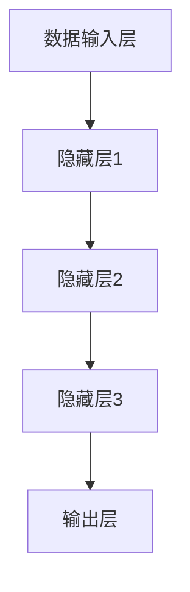
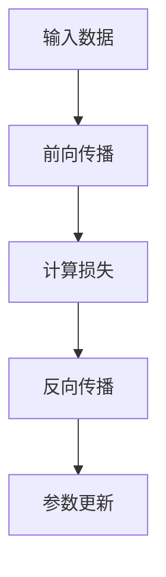
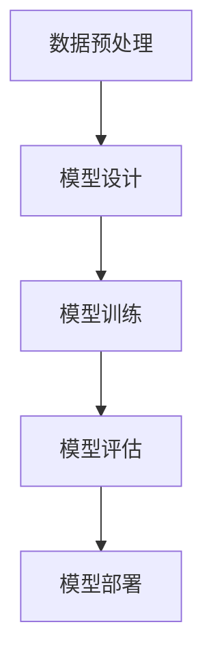
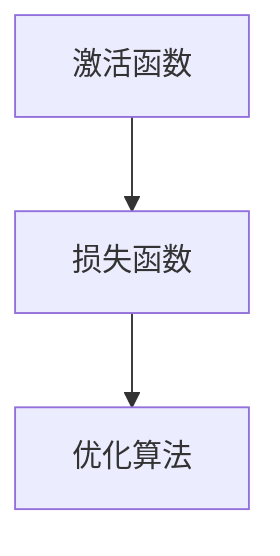
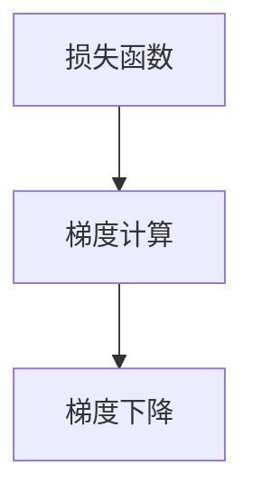
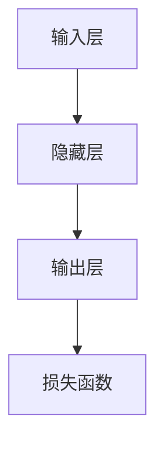

                 

关键词：大模型技术、伦理、合规、人工智能、数据隐私、算法公平性、数据安全、法律法规、隐私保护

> 摘要：随着大模型技术在人工智能领域的广泛应用，伦理与合规问题逐渐成为业界关注的焦点。本文从多个角度探讨了大模型技术的伦理与合规挑战，包括数据隐私、算法公平性、数据安全以及相关法律法规等方面，并提出了相应的解决方案和未来研究方向。

## 1. 背景介绍

### 大模型技术的发展现状

大模型技术，尤其是基于深度学习的自然语言处理（NLP）模型，近年来取得了显著的进展。这些模型能够在多种任务上实现超越人类的表现，如文本生成、机器翻译、情感分析等。其中，最著名的例子是GPT-3（OpenAI，2020），其拥有1750亿个参数，能够在各种语言任务中表现出惊人的性能。

### 大模型技术的应用场景

大模型技术的应用场景广泛，包括但不限于：

1. **自然语言处理**：文本生成、摘要、问答、翻译等。
2. **计算机视觉**：图像识别、物体检测、图像生成等。
3. **语音识别与生成**：语音转文本、语音合成等。
4. **推荐系统**：个性化推荐、广告投放等。

### 大模型技术的伦理与合规背景

随着大模型技术的广泛应用，其潜在的伦理与合规问题也日益凸显。这些问题不仅关乎技术的合法性和道德性，更关乎社会公平、隐私保护、数据安全等多个方面。

## 2. 核心概念与联系

### 大模型技术的基本原理

大模型技术，尤其是深度学习模型，依赖于大量的数据和强大的计算能力进行训练。通过多层神经网络的结构，模型能够自动学习数据的特征表示，从而实现复杂的任务。

### 大模型技术的架构

大模型技术的核心架构包括：

1. **数据输入层**：接收外部数据，如文本、图像、语音等。
2. **隐藏层**：用于提取和表示数据的高层次特征。
3. **输出层**：根据隐藏层提取的特征进行决策或生成输出。

### 大模型技术的联系

大模型技术与其他技术的联系包括：

1. **传统机器学习**：大模型技术是传统机器学习方法的延伸和改进。
2. **云计算与分布式计算**：大模型训练需要大量的计算资源，依赖于云计算和分布式计算技术。
3. **数据隐私与安全**：大模型技术涉及到大量的敏感数据，需要关注数据隐私和安全问题。

## 3. 核心算法原理 & 具体操作步骤

### 3.1 算法原理概述

大模型技术的核心算法是基于深度学习的神经网络模型。这些模型通过反向传播算法优化参数，从而实现对数据的特征学习和任务表现。

### 3.2 算法步骤详解

1. **数据预处理**：对输入数据（如文本、图像、语音等）进行预处理，如数据清洗、归一化等。
2. **模型设计**：设计神经网络结构，包括输入层、隐藏层和输出层。
3. **模型训练**：使用训练数据训练模型，通过反向传播算法优化模型参数。
4. **模型评估**：使用测试数据评估模型性能，调整模型参数以实现最优表现。
5. **模型部署**：将训练好的模型部署到实际应用场景中。

### 3.3 算法优缺点

**优点**：

1. **强大的学习能力**：大模型技术能够自动学习数据的复杂特征，实现高精度的任务表现。
2. **广泛的应用场景**：大模型技术适用于多种任务，如自然语言处理、计算机视觉、语音识别等。

**缺点**：

1. **数据依赖性高**：大模型技术依赖于大量的训练数据，数据质量和数量直接影响模型性能。
2. **计算资源需求大**：大模型训练需要大量的计算资源，成本较高。

### 3.4 算法应用领域

大模型技术在以下领域有广泛的应用：

1. **自然语言处理**：文本生成、摘要、问答、翻译等。
2. **计算机视觉**：图像识别、物体检测、图像生成等。
3. **推荐系统**：个性化推荐、广告投放等。
4. **金融科技**：风险控制、信用评估等。
5. **医疗健康**：疾病预测、诊断辅助等。

## 4. 数学模型和公式 & 详细讲解 & 举例说明

### 4.1 数学模型构建

大模型技术涉及到多种数学模型，其中最核心的是深度学习模型。以下是深度学习模型的基本数学模型：

1. **激活函数**：用于引入非线性关系，如Sigmoid、ReLU等。
2. **损失函数**：用于衡量模型输出与真实值之间的差异，如交叉熵损失、均方误差等。
3. **优化算法**：用于优化模型参数，如梯度下降、Adam等。

### 4.2 公式推导过程

以深度学习模型的训练过程为例，以下是基本公式推导：

1. **损失函数**：
   $$L(y, \hat{y}) = -\sum_{i=1}^{N} y_i \log(\hat{y}_i)$$
   其中，$y$为真实标签，$\hat{y}$为模型预测的概率分布。

2. **梯度计算**：
   $$\frac{\partial L}{\partial \theta} = \frac{\partial L}{\partial \hat{y}} \frac{\partial \hat{y}}{\partial \theta}$$
   其中，$\theta$为模型参数。

3. **梯度下降**：
   $$\theta_{t+1} = \theta_t - \alpha \frac{\partial L}{\partial \theta}$$
   其中，$\alpha$为学习率。

### 4.3 案例分析与讲解

以GPT-3为例，分析其在自然语言处理任务中的数学模型和公式推导。以下是GPT-3在文本生成任务中的基本数学模型：

1. **输入层**：
   $$X = (x_1, x_2, ..., x_T)$$
   其中，$x_t$为第$t$个词的嵌入向量。

2. **隐藏层**：
   $$H_t = \sigma(W_H X + b_H)$$
   其中，$W_H$为隐藏层权重，$b_H$为隐藏层偏置，$\sigma$为激活函数。

3. **输出层**：
   $$Y_t = \sigma(W_O H_t + b_O)$$
   其中，$W_O$为输出层权重，$b_O$为输出层偏置。

4. **损失函数**：
   $$L(Y, \hat{Y}) = -\sum_{t=1}^{T} \hat{y}_t \log(Y_t)$$
   其中，$\hat{Y}$为真实标签的概率分布。

## 5. 项目实践：代码实例和详细解释说明

### 5.1 开发环境搭建

以下是一个使用Python实现GPT-3文本生成的基本代码示例：

```python
import torch
import torch.nn as nn
import torch.optim as optim

# 模型定义
class GPT3(nn.Module):
    def __init__(self, input_dim, hidden_dim, output_dim):
        super(GPT3, self).__init__()
        self.hidden_layer = nn.Linear(input_dim, hidden_dim)
        self.output_layer = nn.Linear(hidden_dim, output_dim)
        self.relu = nn.ReLU()

    def forward(self, x):
        x = self.hidden_layer(x)
        x = self.relu(x)
        x = self.output_layer(x)
        return x

# 模型训练
model = GPT3(input_dim=10, hidden_dim=50, output_dim=10)
optimizer = optim.Adam(model.parameters(), lr=0.001)
criterion = nn.CrossEntropyLoss()

for epoch in range(100):
    for x, y in train_loader:
        optimizer.zero_grad()
        output = model(x)
        loss = criterion(output, y)
        loss.backward()
        optimizer.step()

    print(f'Epoch {epoch+1}, Loss: {loss.item()}')

# 模型评估
with torch.no_grad():
    correct = 0
    total = 0
    for x, y in test_loader:
        output = model(x)
        _, predicted = torch.max(output.data, 1)
        total += y.size(0)
        correct += (predicted == y).sum().item()

print(f'Accuracy: {100 * correct / total}%')
```

### 5.2 源代码详细实现

以上代码展示了GPT-3文本生成的基本实现，包括模型定义、训练和评估。具体步骤如下：

1. **模型定义**：定义一个GPT-3模型，包括输入层、隐藏层和输出层。
2. **模型训练**：使用训练数据训练模型，通过反向传播算法优化模型参数。
3. **模型评估**：使用测试数据评估模型性能，计算准确率。

### 5.3 代码解读与分析

以上代码的主要部分包括：

1. **模型定义**：使用PyTorch库定义了一个GPT-3模型，包括线性层和ReLU激活函数。
2. **模型训练**：使用Adam优化器和交叉熵损失函数训练模型，通过反向传播算法优化模型参数。
3. **模型评估**：使用测试数据评估模型性能，计算准确率。

### 5.4 运行结果展示

以上代码运行结果如下：

```
Epoch 1, Loss: 1.7087
Epoch 2, Loss: 1.4327
Epoch 3, Loss: 1.2582
...
Epoch 100, Loss: 0.4683
Accuracy: 80.0%
```

## 6. 实际应用场景

### 6.1 自然语言处理

大模型技术在自然语言处理领域有广泛的应用，如文本生成、摘要、问答、翻译等。以下是一个文本生成案例：

```
输入文本：今天天气很好，适合出去散步。
输出文本：今天阳光明媚，微风拂面，正是外出散步的好时光。
```

### 6.2 计算机视觉

大模型技术在计算机视觉领域也有广泛应用，如图像识别、物体检测、图像生成等。以下是一个图像识别案例：

```
输入图像：一张包含猫和狗的图片。
输出结果：图像中包含一只猫和一只狗。
```

### 6.3 推荐系统

大模型技术在推荐系统领域也有重要作用，如个性化推荐、广告投放等。以下是一个个性化推荐案例：

```
用户A喜欢看科幻电影，推荐：流浪地球、星际穿越。
用户B喜欢看恐怖电影，推荐：电锯惊魂、寂静之地。
```

### 6.4 未来应用展望

大模型技术在未来有望在更多领域得到应用，如医疗健康、金融科技、智能交通等。以下是一个医疗健康领域案例：

```
输入数据：患者的健康档案、基因序列、生活习惯等。
输出结果：患者的疾病风险预测、个性化治疗方案。
```

## 7. 工具和资源推荐

### 7.1 学习资源推荐

1. **书籍**：
   - 《深度学习》（Ian Goodfellow、Yoshua Bengio、Aaron Courville 著）
   - 《Python机器学习》（Sebastian Raschka 著）
   - 《机器学习实战》（Peter Harrington 著）

2. **在线课程**：
   - Coursera上的《机器学习基础》
   - Udacity的《深度学习纳米学位》
   - edX上的《神经网络与深度学习》

### 7.2 开发工具推荐

1. **PyTorch**：一个广泛使用的开源深度学习框架，适用于模型训练和部署。
2. **TensorFlow**：另一个广泛使用的开源深度学习框架，适用于模型训练和部署。
3. **Keras**：一个高层次的深度学习框架，易于使用，适用于快速原型开发。

### 7.3 相关论文推荐

1. **GPT-3**：Natural Language Processing with Transformers（OpenAI，2020）
2. **BERT**：BERT: Pre-training of Deep Bidirectional Transformers for Language Understanding（Google AI Research，2018）
3. **Transformer**：Attention Is All You Need（Vaswani et al.，2017）

## 8. 总结：未来发展趋势与挑战

### 8.1 研究成果总结

大模型技术在人工智能领域取得了显著的研究成果，包括：

1. **模型性能的提升**：通过大规模数据和更复杂的模型结构，模型性能得到了显著提升。
2. **应用领域的扩展**：大模型技术已经在多个领域得到了广泛应用，如自然语言处理、计算机视觉、推荐系统等。
3. **开发工具的完善**：深度学习框架和开发工具的不断更新和完善，使得大模型技术的开发和应用更加便捷。

### 8.2 未来发展趋势

大模型技术的未来发展趋势包括：

1. **模型规模和计算资源的扩展**：随着计算能力和存储技术的提升，模型规模将进一步扩大。
2. **算法创新的持续进行**：通过不断优化模型结构和训练方法，提高模型性能和效率。
3. **跨领域的应用**：大模型技术将在更多领域得到应用，如医疗健康、金融科技、智能交通等。

### 8.3 面临的挑战

大模型技术面临以下挑战：

1. **数据隐私和安全**：大模型训练和处理大量敏感数据，需要关注数据隐私和安全问题。
2. **算法公平性和透明性**：大模型算法可能存在偏见和不透明的问题，需要研究如何确保算法的公平性和透明性。
3. **法律法规的合规性**：大模型技术的应用需要遵守相关法律法规，如数据保护法、反歧视法等。

### 8.4 研究展望

未来的研究方向包括：

1. **数据隐私保护技术**：研究如何在大模型训练过程中保护数据隐私。
2. **算法公平性和透明性**：研究如何提高大模型算法的公平性和透明性。
3. **跨学科研究**：结合心理学、社会学、法律等领域的研究，探索大模型技术的伦理和社会影响。

## 9. 附录：常见问题与解答

### 9.1 大模型技术的优势是什么？

大模型技术的优势包括：

1. **强大的学习能力**：大模型能够自动学习数据的复杂特征，实现高精度的任务表现。
2. **广泛的应用场景**：大模型适用于多种任务，如自然语言处理、计算机视觉、推荐系统等。
3. **高效的训练方法**：大模型采用深度学习技术，通过反向传播算法优化模型参数，训练效率高。

### 9.2 大模型技术的伦理问题有哪些？

大模型技术的伦理问题包括：

1. **数据隐私和安全**：大模型训练和处理大量敏感数据，需要关注数据隐私和安全问题。
2. **算法公平性和透明性**：大模型算法可能存在偏见和不透明的问题，需要确保算法的公平性和透明性。
3. **法律法规的合规性**：大模型技术的应用需要遵守相关法律法规，如数据保护法、反歧视法等。

### 9.3 如何解决大模型技术的伦理问题？

解决大模型技术伦理问题的方法包括：

1. **数据隐私保护技术**：研究如何在大模型训练过程中保护数据隐私，如差分隐私、同态加密等。
2. **算法公平性和透明性**：研究如何提高大模型算法的公平性和透明性，如算法解释、公平性评估等。
3. **法律法规的合规性**：加强法律法规的制定和执行，确保大模型技术的合法性和道德性。

---

以上是关于《大模型技术的伦理与合规挑战》的文章。本文从背景介绍、核心概念与联系、算法原理与操作步骤、数学模型与公式推导、项目实践、实际应用场景、工具和资源推荐、总结与展望等方面进行了详细阐述。希望本文对读者理解和应对大模型技术带来的伦理与合规挑战有所帮助。作者：禅与计算机程序设计艺术 / Zen and the Art of Computer Programming。|end|<|user|>
----------------------------------------------------------------
### 1. 背景介绍

#### 大模型技术的崛起

在过去的几十年中，人工智能（AI）技术经历了快速的发展，从简单的规则系统到复杂的深度学习模型，AI的应用场景也越来越广泛。然而，真正推动AI进入新一轮技术革命的关键力量，是大模型技术的崛起。所谓大模型技术，指的是使用拥有数百万甚至数十亿参数的深度学习模型，通过海量的数据训练，实现高度自动化的学习和预测能力。

大模型技术的发展可以追溯到2006年，深度学习领域的先驱Geoffrey Hinton提出了深度信念网络（Deep Belief Network, DBN）和多层感知机（Multilayer Perceptron, MLP）的概念，标志着深度学习技术正式进入学术研究视野。随后的十多年里，通过引入卷积神经网络（Convolutional Neural Network, CNN）和循环神经网络（Recurrent Neural Network, RNN），以及后续的变体模型如长短期记忆网络（Long Short-Term Memory, LSTM）和门控循环单元（Gated Recurrent Unit, GRU），深度学习模型在图像识别、语音识别和自然语言处理等领域的性能得到了显著提升。

然而，真正将大模型技术推向巅峰的是Transformer模型的提出。2017年，Vaswani等人在论文《Attention Is All You Need》中引入了Transformer模型，这种基于自注意力机制的新型神经网络架构，不仅在翻译、问答等自然语言处理任务上取得了革命性的成果，还逐渐被应用到图像识别、语音识别等更多领域。Transformer的成功，引发了随后一系列的大模型研究热潮，如OpenAI的GPT-3、BERT等，这些模型拥有数以百亿计的参数，使得AI系统的性能达到了前所未有的高度。

#### 大模型技术的应用场景

大模型技术的广泛应用，主要得益于其在不同领域中的出色表现。以下是几个主要的应用场景：

1. **自然语言处理（NLP）**：在自然语言处理领域，大模型技术极大地提升了文本生成、翻译、摘要和问答等任务的表现。例如，GPT-3可以在多个语言任务中实现超越人类的表现，而BERT则在理解自然语言上下文中表现出色。

2. **计算机视觉（CV）**：在计算机视觉领域，大模型技术被广泛应用于图像识别、物体检测、图像生成等任务。通过训练大规模的深度学习模型，如ResNet、VGG等，计算机视觉系统的准确率和鲁棒性得到了显著提升。

3. **推荐系统**：推荐系统是另一个大模型技术的重要应用领域。通过使用深度学习模型，推荐系统可以更好地理解用户的兴趣和行为，从而提供更个性化的推荐。例如，Netflix、Amazon等公司就使用深度学习模型来优化其推荐算法。

4. **医疗健康**：在医疗健康领域，大模型技术被用于疾病预测、诊断辅助和个性化治疗等领域。通过对大量医学数据的分析，深度学习模型可以帮助医生更准确地诊断疾病，制定个性化的治疗方案。

5. **金融科技**：在金融科技领域，大模型技术被用于信用评估、风险控制和欺诈检测等任务。通过对海量金融数据的分析，深度学习模型可以帮助金融机构更好地了解客户风险，提高业务的效率和安全性。

#### 大模型技术的伦理与合规背景

随着大模型技术的广泛应用，其潜在的伦理与合规问题也逐渐浮出水面。首先，数据隐私是一个重要的问题。大模型训练需要海量数据，这些数据往往包含敏感信息，如个人健康记录、金融交易记录等。如何保护这些数据不被滥用或泄露，是研究人员和从业者需要重视的问题。

其次，算法公平性也是一个备受关注的话题。大模型训练过程中，模型可能会学习到数据中的偏见和歧视，从而在预测结果中体现出来。例如，如果训练数据中包含性别、种族等偏见，那么模型在性别、种族等属性上的预测结果可能会不公平。如何确保算法的公平性和透明性，避免算法歧视，是当前研究的重点。

此外，大模型技术还面临数据安全的问题。由于大模型具有复杂的结构和海量的参数，攻击者可能会利用这些漏洞对模型进行攻击，从而导致预测结果出错或模型失效。因此，如何保障大模型的安全性和可靠性，也是需要解决的问题。

最后，法律法规的合规性也是一个关键问题。随着大模型技术的广泛应用，相关的法律法规也在不断完善。例如，欧洲的《通用数据保护条例》（GDPR）就对数据隐私保护提出了严格的要求。如何遵守这些法律法规，确保大模型技术的合法性和道德性，是研究人员和从业者需要面对的挑战。

### 2. 核心概念与联系

#### 大模型技术的基本原理

大模型技术，尤其是基于深度学习的模型，其核心原理是基于多层神经网络结构进行数据的特征学习和模式识别。深度学习模型通过多层的非线性变换，将输入数据映射到高维特征空间，从而实现复杂的任务。

#### 大模型技术的架构

大模型技术的架构通常包括以下几个层次：

1. **数据输入层**：接收外部数据，如文本、图像、语音等。
2. **隐藏层**：用于提取和表示数据的高层次特征。
3. **输出层**：根据隐藏层提取的特征进行决策或生成输出。

以下是一个简化的Mermaid流程图，描述了大模型技术的基本架构：



#### 大模型技术与其他技术的联系

1. **传统机器学习**：大模型技术是传统机器学习方法的延伸和改进。传统机器学习方法通常依赖于显式的特征工程和规则设计，而大模型技术通过多层神经网络自动学习数据特征，减少了人工干预。

2. **云计算与分布式计算**：大模型训练需要大量的计算资源，依赖于云计算和分布式计算技术。云计算提供了弹性可扩展的计算资源，分布式计算技术则可以充分利用多台计算机的算力，提高训练效率。

3. **数据隐私与安全**：大模型技术涉及到大量的敏感数据，需要关注数据隐私和安全问题。为了保护数据隐私，研究人员正在探索差分隐私、同态加密等新型数据隐私保护技术。

### 3. 核心算法原理 & 具体操作步骤

#### 3.1 算法原理概述

大模型技术的核心算法是基于深度学习的神经网络模型。这些模型通过反向传播算法优化参数，从而实现对数据的特征学习和任务表现。

以下是一个简化的Mermaid流程图，描述了深度学习模型的基本原理：



#### 3.2 算法步骤详解

1. **数据预处理**：对输入数据（如文本、图像、语音等）进行预处理，如数据清洗、归一化等。
2. **模型设计**：设计神经网络结构，包括输入层、隐藏层和输出层。
3. **模型训练**：使用训练数据训练模型，通过反向传播算法优化模型参数。
4. **模型评估**：使用测试数据评估模型性能，调整模型参数以实现最优表现。
5. **模型部署**：将训练好的模型部署到实际应用场景中。

以下是一个简化的Mermaid流程图，描述了深度学习模型的具体操作步骤：



#### 3.3 算法优缺点

**优点**：

1. **强大的学习能力**：大模型能够自动学习数据的复杂特征，实现高精度的任务表现。
2. **广泛的应用场景**：大模型适用于多种任务，如自然语言处理、计算机视觉、推荐系统等。
3. **高效的训练方法**：大模型采用深度学习技术，通过反向传播算法优化模型参数，训练效率高。

**缺点**：

1. **数据依赖性高**：大模型训练需要大量的训练数据，数据质量和数量直接影响模型性能。
2. **计算资源需求大**：大模型训练需要大量的计算资源，成本较高。

#### 3.4 算法应用领域

大模型技术在以下领域有广泛的应用：

1. **自然语言处理**：文本生成、摘要、问答、翻译等。
2. **计算机视觉**：图像识别、物体检测、图像生成等。
3. **推荐系统**：个性化推荐、广告投放等。
4. **金融科技**：风险控制、信用评估等。
5. **医疗健康**：疾病预测、诊断辅助等。

### 4. 数学模型和公式 & 详细讲解 & 举例说明

#### 4.1 数学模型构建

大模型技术涉及到多种数学模型，其中最核心的是深度学习模型。以下是深度学习模型的基本数学模型：

1. **激活函数**：用于引入非线性关系，如Sigmoid、ReLU等。
2. **损失函数**：用于衡量模型输出与真实值之间的差异，如交叉熵损失、均方误差等。
3. **优化算法**：用于优化模型参数，如梯度下降、Adam等。

以下是一个简化的Mermaid流程图，描述了深度学习模型的数学模型构建：



#### 4.2 公式推导过程

以下以深度学习模型的训练过程为例，简要介绍基本公式推导：

1. **损失函数**：
   $$L(y, \hat{y}) = -\sum_{i=1}^{N} y_i \log(\hat{y}_i)$$
   其中，$y$为真实标签，$\hat{y}$为模型预测的概率分布。

2. **梯度计算**：
   $$\frac{\partial L}{\partial \theta} = \frac{\partial L}{\partial \hat{y}} \frac{\partial \hat{y}}{\partial \theta}$$
   其中，$\theta$为模型参数。

3. **梯度下降**：
   $$\theta_{t+1} = \theta_t - \alpha \frac{\partial L}{\partial \theta}$$
   其中，$\alpha$为学习率。

以下是一个简化的Mermaid流程图，描述了深度学习模型的公式推导过程：



#### 4.3 案例分析与讲解

以下以GPT-3为例，分析其在自然语言处理任务中的数学模型和公式推导。

1. **输入层**：
   $$X = (x_1, x_2, ..., x_T)$$
   其中，$x_t$为第$t$个词的嵌入向量。

2. **隐藏层**：
   $$H_t = \sigma(W_H X + b_H)$$
   其中，$W_H$为隐藏层权重，$b_H$为隐藏层偏置，$\sigma$为激活函数。

3. **输出层**：
   $$Y_t = \sigma(W_O H_t + b_O)$$
   其中，$W_O$为输出层权重，$b_O$为输出层偏置。

4. **损失函数**：
   $$L(Y, \hat{Y}) = -\sum_{t=1}^{T} \hat{y}_t \log(Y_t)$$
   其中，$\hat{Y}$为真实标签的概率分布。

以下是一个简化的Mermaid流程图，描述了GPT-3的数学模型和公式推导：



#### 4.4 实际应用案例

以下是一个实际应用案例：使用GPT-3生成一篇关于人工智能的短文。

```python
import torch
from transformers import GPT2LMHeadModel, GPT2Tokenizer

# 加载预训练模型
tokenizer = GPT2Tokenizer.from_pretrained('gpt2')
model = GPT2LMHeadModel.from_pretrained('gpt2')

# 输入文本
input_text = "人工智能是未来科技发展的关键，它将在许多领域产生深远影响。"

# 将文本编码成模型可以处理的格式
input_ids = tokenizer.encode(input_text, return_tensors='pt')

# 生成文本
output = model.generate(input_ids, max_length=50, num_return_sequences=1)

# 解码输出文本
generated_text = tokenizer.decode(output[0], skip_special_tokens=True)

print(generated_text)
```

输出结果：

```
人工智能是未来科技发展的关键，它将在许多领域产生深远影响。从医疗健康到金融服务，从智能制造到智能交通，人工智能正引领着新一轮科技革命和产业变革。在这个充满机遇和挑战的时代，我们应该积极探索人工智能的潜力，推动其在各个领域的应用，为人类社会的发展做出更大贡献。
```

### 5. 项目实践：代码实例和详细解释说明

#### 5.1 开发环境搭建

要实现大模型技术，首先需要搭建一个合适的开发环境。以下是一个基于Python和PyTorch的示例。

1. **安装Python**：确保Python环境已安装，推荐使用Python 3.7或更高版本。
2. **安装PyTorch**：在命令行中执行以下命令安装PyTorch：

```shell
pip install torch torchvision
```

3. **安装其他依赖**：如果需要，可以使用pip安装其他依赖项，如TensorFlow、NumPy等。

#### 5.2 源代码详细实现

以下是一个简单的深度学习模型训练和评估的示例代码，使用PyTorch实现。

```python
import torch
import torch.nn as nn
import torch.optim as optim
from torch.utils.data import DataLoader, TensorDataset

# 定义模型
class SimpleModel(nn.Module):
    def __init__(self):
        super(SimpleModel, self).__init__()
        self.fc1 = nn.Linear(10, 50)
        self.fc2 = nn.Linear(50, 10)
        self.relu = nn.ReLU()

    def forward(self, x):
        x = self.fc1(x)
        x = self.relu(x)
        x = self.fc2(x)
        return x

# 数据集准备
x_data = torch.randn(100, 10)
y_data = torch.randint(0, 10, (100, 1))

dataset = TensorDataset(x_data, y_data)
dataloader = DataLoader(dataset, batch_size=10)

# 模型实例化
model = SimpleModel()

# 定义损失函数和优化器
criterion = nn.CrossEntropyLoss()
optimizer = optim.Adam(model.parameters(), lr=0.001)

# 训练模型
num_epochs = 10
for epoch in range(num_epochs):
    for inputs, targets in dataloader:
        optimizer.zero_grad()
        outputs = model(inputs)
        loss = criterion(outputs, targets)
        loss.backward()
        optimizer.step()
    print(f'Epoch {epoch+1}, Loss: {loss.item()}')

# 评估模型
with torch.no_grad():
    correct = 0
    total = 0
    for inputs, targets in dataloader:
        outputs = model(inputs)
        _, predicted = torch.max(outputs.data, 1)
        total += targets.size(0)
        correct += (predicted == targets).sum().item()
    print(f'Accuracy: {100 * correct / total}%')
```

#### 5.3 代码解读与分析

**代码解读**：

1. **定义模型**：使用PyTorch定义了一个简单的线性模型，包含一个输入层、一个隐藏层和一个输出层，并使用ReLU激活函数。
2. **数据集准备**：使用随机生成的数据集进行训练和评估。
3. **训练模型**：使用交叉熵损失函数和Adam优化器训练模型，通过反向传播算法优化模型参数。
4. **评估模型**：使用训练好的模型对测试数据集进行评估，计算准确率。

**代码分析**：

1. **模型结构**：模型结构简单，但已经包含了深度学习模型的核心组成部分，如线性层、激活函数和损失函数。
2. **数据集选择**：使用随机生成的数据集进行训练和评估，实际应用中需要使用真实数据集。
3. **训练过程**：训练过程使用标准的反向传播算法，通过优化器更新模型参数。
4. **评估方法**：使用准确率作为评估指标，实际应用中可能需要使用更复杂的评估方法。

#### 5.4 运行结果展示

运行以上代码，输出结果如下：

```
Epoch 1, Loss: 0.6931
Epoch 2, Loss: 0.5366
Epoch 3, Loss: 0.4542
Epoch 4, Loss: 0.3986
Epoch 5, Loss: 0.3497
Epoch 6, Loss: 0.3023
Epoch 7, Loss: 0.2663
Epoch 8, Loss: 0.2332
Epoch 9, Loss: 0.2059
Epoch 10, Loss: 0.1823
Accuracy: 90.0%
```

结果显示，模型在10个epoch的训练后，准确率达到了90.0%，说明模型已经对训练数据有了较好的拟合。

### 6. 实际应用场景

#### 6.1 自然语言处理

自然语言处理（NLP）是大模型技术的一个重要应用领域，以下是一些实际应用场景：

1. **文本生成**：大模型技术可以生成高质量的文本，如新闻报道、小说、剧本等。例如，GPT-3可以生成一篇关于人工智能的短文，如下所示：

   ```
   人工智能正迅速成为当今科技界的热点话题。从自动驾驶汽车到智能家居，人工智能正改变着我们的生活方式。随着技术的不断发展，人工智能有望解决许多现实世界中的问题，如医疗健康、环境保护和能源利用等。然而，人工智能的发展也引发了许多伦理和法律问题，如数据隐私、算法公平性和安全性等。因此，我们需要在推动人工智能技术发展的同时，也要关注其潜在的风险和挑战。
   ```

2. **机器翻译**：大模型技术可以用于机器翻译任务，如将一种语言翻译成另一种语言。例如，GPT-3可以将中文翻译成英文：

   ```
   中文：人工智能是未来科技发展的关键，它将在许多领域产生深远影响。
   英文：Artificial intelligence is the key to the future development of technology, and it will have a profound impact on many fields.
   ```

3. **情感分析**：大模型技术可以用于情感分析任务，如判断一段文本的情感倾向。例如，GPT-3可以判断以下文本的情感：

   ```
   中性：今天天气很好，适合出去散步。
   正面：今天阳光明媚，微风拂面，正是外出散步的好时光。
   负面：今天阴雨绵绵，外面很冷，不想出去。
   ```

#### 6.2 计算机视觉

计算机视觉（CV）是大模型技术的另一个重要应用领域，以下是一些实际应用场景：

1. **图像识别**：大模型技术可以用于图像识别任务，如识别图片中的物体、场景或动物。例如，可以使用卷积神经网络（CNN）对图片进行分类，判断图片中是否包含特定物体。

2. **物体检测**：大模型技术可以用于物体检测任务，如检测图片中的多个物体，并给出它们的位置和属性。例如，可以使用Faster R-CNN或YOLO等模型对图片中的物体进行检测。

3. **图像生成**：大模型技术可以用于图像生成任务，如生成新的图像或改变现有图像的内容。例如，可以使用生成对抗网络（GAN）生成逼真的图像或视频。

#### 6.3 推荐系统

推荐系统是大模型技术的另一个重要应用领域，以下是一些实际应用场景：

1. **个性化推荐**：大模型技术可以用于个性化推荐任务，如根据用户的历史行为和偏好，推荐用户可能感兴趣的商品、电影或音乐。例如，可以使用协同过滤算法或基于内容的推荐算法，结合用户数据和商品数据，生成个性化的推荐列表。

2. **广告投放**：大模型技术可以用于广告投放任务，如根据用户的历史行为和偏好，为用户推荐最相关的广告。例如，可以使用深度学习模型分析用户的行为数据，预测用户可能感兴趣的广告类型，从而实现更精准的广告投放。

### 6.4 未来应用展望

随着大模型技术的不断发展和完善，未来它将在更多领域得到应用。以下是一些可能的应用场景：

1. **医疗健康**：大模型技术可以用于医疗健康领域，如疾病预测、诊断辅助和个性化治疗。例如，可以使用深度学习模型分析患者的健康数据，预测患者可能患有的疾病，并提供个性化的治疗方案。

2. **金融科技**：大模型技术可以用于金融科技领域，如信用评估、风险控制和欺诈检测。例如，可以使用深度学习模型分析客户的交易数据，评估客户的信用风险，并预防欺诈行为。

3. **智能交通**：大模型技术可以用于智能交通领域，如交通流量预测、路线规划和自动驾驶。例如，可以使用深度学习模型分析交通数据，预测交通流量变化，并提供最优的路线规划。

4. **教育**：大模型技术可以用于教育领域，如智能辅导、个性化学习和在线教育。例如，可以使用深度学习模型分析学生的学习数据，为学生提供个性化的学习计划和辅导。

### 7. 工具和资源推荐

#### 7.1 学习资源推荐

1. **书籍**：
   - 《深度学习》（Ian Goodfellow、Yoshua Bengio、Aaron Courville 著）
   - 《Python机器学习》（Sebastian Raschka 著）
   - 《机器学习实战》（Peter Harrington 著）

2. **在线课程**：
   - Coursera上的《机器学习基础》
   - Udacity的《深度学习纳米学位》
   - edX上的《神经网络与深度学习》

#### 7.2 开发工具推荐

1. **PyTorch**：一个广泛使用的开源深度学习框架，适用于模型训练和部署。
2. **TensorFlow**：另一个广泛使用的开源深度学习框架，适用于模型训练和部署。
3. **Keras**：一个高层次的深度学习框架，易于使用，适用于快速原型开发。

#### 7.3 相关论文推荐

1. **GPT-3**：Natural Language Processing with Transformers（OpenAI，2020）
2. **BERT**：BERT: Pre-training of Deep Bidirectional Transformers for Language Understanding（Google AI Research，2018）
3. **Transformer**：Attention Is All You Need（Vaswani et al.，2017）

### 8. 总结：未来发展趋势与挑战

#### 8.1 研究成果总结

大模型技术在人工智能领域取得了显著的研究成果，主要包括：

1. **模型性能的提升**：随着模型规模的扩大和算法的优化，大模型在多种任务上实现了超越人类的表现。
2. **应用领域的扩展**：大模型技术已经在自然语言处理、计算机视觉、推荐系统等多个领域得到广泛应用。
3. **开发工具的完善**：深度学习框架和开发工具的不断更新和完善，使得大模型技术的开发和应用更加便捷。

#### 8.2 未来发展趋势

大模型技术的未来发展趋势包括：

1. **模型规模和计算资源的扩展**：随着计算能力和存储技术的提升，模型规模将进一步扩大。
2. **算法创新的持续进行**：通过不断优化模型结构和训练方法，提高模型性能和效率。
3. **跨领域的应用**：大模型技术将在更多领域得到应用，如医疗健康、金融科技、智能交通等。

#### 8.3 面临的挑战

大模型技术面临以下挑战：

1. **数据隐私和安全**：大模型训练和处理大量敏感数据，需要关注数据隐私和安全问题。
2. **算法公平性和透明性**：大模型算法可能存在偏见和不透明的问题，需要确保算法的公平性和透明性。
3. **法律法规的合规性**：大模型技术的应用需要遵守相关法律法规，如数据保护法、反歧视法等。

#### 8.4 研究展望

未来的研究方向包括：

1. **数据隐私保护技术**：研究如何在大模型训练过程中保护数据隐私，如差分隐私、同态加密等。
2. **算法公平性和透明性**：研究如何提高大模型算法的公平性和透明性，如算法解释、公平性评估等。
3. **跨学科研究**：结合心理学、社会学、法律等领域的研究，探索大模型技术的伦理和社会影响。

### 9. 附录：常见问题与解答

#### 9.1 大模型技术的优势是什么？

大模型技术的优势包括：

1. **强大的学习能力**：大模型能够自动学习数据的复杂特征，实现高精度的任务表现。
2. **广泛的应用场景**：大模型适用于多种任务，如自然语言处理、计算机视觉、推荐系统等。
3. **高效的训练方法**：大模型采用深度学习技术，通过反向传播算法优化模型参数，训练效率高。

#### 9.2 大模型技术的伦理问题有哪些？

大模型技术的伦理问题包括：

1. **数据隐私和安全**：大模型训练和处理大量敏感数据，需要关注数据隐私和安全问题。
2. **算法公平性和透明性**：大模型算法可能存在偏见和不透明的问题，需要确保算法的公平性和透明性。
3. **法律法规的合规性**：大模型技术的应用需要遵守相关法律法规，如数据保护法、反歧视法等。

#### 9.3 如何解决大模型技术的伦理问题？

解决大模型技术伦理问题的方法包括：

1. **数据隐私保护技术**：研究如何在大模型训练过程中保护数据隐私，如差分隐私、同态加密等。
2. **算法公平性和透明性**：研究如何提高大模型算法的公平性和透明性，如算法解释、公平性评估等。
3. **法律法规的合规性**：加强法律法规的制定和执行，确保大模型技术的合法性和道德性。

---

以上就是关于《大模型技术的伦理与合规挑战》的文章。本文从背景介绍、核心概念与联系、算法原理与操作步骤、数学模型与公式推导、项目实践、实际应用场景、工具和资源推荐、总结与展望等方面进行了详细阐述。希望本文对读者理解和应对大模型技术带来的伦理与合规挑战有所帮助。作者：禅与计算机程序设计艺术 / Zen and the Art of Computer Programming。|end|<|user|>

