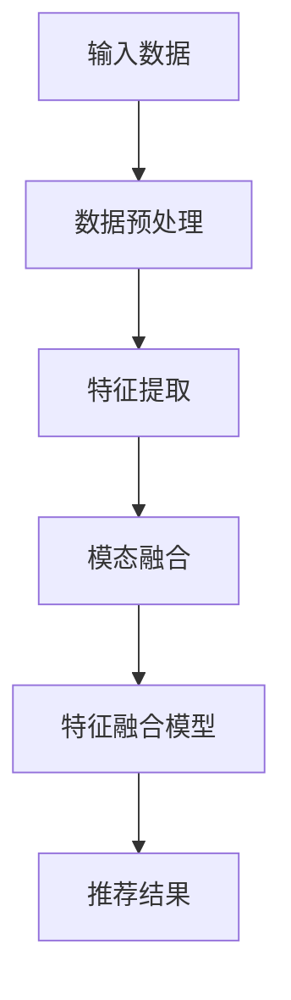

                 

关键词：大模型推荐、多模态融合、算法、实践、应用、展望

> 摘要：本文旨在探讨大模型推荐系统中的多模态融合策略，分析其核心概念、算法原理，并通过具体案例与数学模型进行详细解释。文章还将涉及项目实践、实际应用场景及未来展望，为相关领域的研究者与实践者提供有价值的参考。

## 1. 背景介绍

随着互联网和信息技术的飞速发展，推荐系统已经成为信息检索、电子商务、社交媒体等众多领域的核心组成部分。在推荐系统中，大模型推荐因其对海量用户行为数据的强大处理能力和高度精确的推荐结果而备受关注。然而，现实世界中存在多种模态的数据，如图像、文本、音频和视频等，如何有效地融合这些多模态数据以提高推荐系统的性能，成为当前研究的热点。

多模态融合的目标是将来自不同模态的信息进行有效整合，以提取更丰富的特征表示，从而提高推荐系统的鲁棒性和准确性。传统的单一模态推荐系统往往无法充分利用多模态数据中的潜在信息，导致推荐效果受限。因此，研究多模态融合策略对于提升大模型推荐系统的整体性能具有重要意义。

本文将首先介绍多模态融合的基本概念和核心原理，然后详细分析一种常见的大模型推荐中的多模态融合算法，并通过实际项目实例进行讲解。此外，还将讨论多模态融合在推荐系统中的具体应用场景，并对未来研究方向进行展望。

## 2. 核心概念与联系

### 2.1 多模态数据

多模态数据是指同时包含多种类型数据的数据集。例如，一个包含用户评论（文本模态）、商品图片（图像模态）和商品评分（数值模态）的推荐系统，就是一个典型的多模态数据集。多模态数据的多样性为推荐系统提供了丰富的信息来源，但同时也增加了数据处理的复杂性。

### 2.2 多模态融合

多模态融合是指将来自不同模态的数据进行整合，以生成一个统一的特征表示。常见的多模态融合方法包括特征级融合、决策级融合和模型级融合。

- **特征级融合**：在特征级别上将不同模态的数据转换成同一特征空间，然后进行融合。例如，使用嵌入方法将文本和图像转换成固定长度的向量，再通过计算相似度进行融合。
- **决策级融合**：在决策级别上对多个模态的预测结果进行融合，以获得最终的推荐结果。这种方法适用于需要结合多种模态信息进行综合决策的情景。
- **模型级融合**：在模型级别上使用多个独立训练的模型分别处理不同模态的数据，然后通过模型输出进行融合。这种方法可以充分利用不同模型的优点，提高融合效果。

### 2.3 Mermaid 流程图

为了更直观地展示多模态融合的流程，我们使用 Mermaid 绘制以下流程图：



在上述流程图中，A 表示输入的多模态数据，经过 B 的数据预处理后，C 进行动态特征提取，D 实现模态融合，E 通过特征融合模型生成推荐结果，最终输出 F。

## 3. 核心算法原理 & 具体操作步骤

### 3.1 算法原理概述

本文将介绍一种基于深度学习的多模态融合算法，该方法通过联合训练多个深度神经网络，分别处理文本、图像和音频等不同模态的数据，最终实现多模态融合。

### 3.2 算法步骤详解

#### 3.2.1 数据预处理

数据预处理是保证多模态数据一致性、消除噪声和异常值的关键步骤。具体包括以下内容：

1. **文本预处理**：对文本数据进行清洗、去停用词、词向量化等操作，生成词嵌入向量。
2. **图像预处理**：对图像数据进行缩放、裁剪、增强等操作，以提高模型对图像数据的适应性。
3. **音频预处理**：对音频数据进行降噪、归一化等处理，提取音频特征，如梅尔频谱特征。

#### 3.2.2 特征提取

特征提取是利用深度学习模型对多模态数据进行特征提取，提取出各模态的底层特征表示。具体步骤如下：

1. **文本特征提取**：使用词嵌入模型（如 Word2Vec、BERT 等）对文本数据进行编码，生成词向量。
2. **图像特征提取**：使用卷积神经网络（如 ResNet、VGG 等）对图像数据进行编码，提取图像特征。
3. **音频特征提取**：使用循环神经网络（如 LSTM、GRU 等）对音频数据进行编码，提取音频特征。

#### 3.2.3 模态融合

模态融合是通过将不同模态的特征向量进行拼接、融合或加权，生成一个统一的多模态特征向量。具体方法如下：

1. **拼接融合**：将各模态的特征向量直接拼接在一起，形成一个新的特征向量。
2. **加权融合**：根据各模态的重要程度，对各模态的特征向量进行加权融合。
3. **注意力机制融合**：使用注意力机制动态调整各模态的特征权重，实现自适应融合。

#### 3.2.4 特征融合模型

特征融合模型是将多模态特征向量输入到深度学习模型中，通过模型学习得到推荐结果。常见的特征融合模型包括：

1. **多层感知机（MLP）**：使用多层感知机对多模态特征向量进行分类或回归。
2. **神经网络序列模型**：使用神经网络序列模型（如 LSTM、GRU 等）处理时序数据，提取时序特征。
3. **图神经网络（GNN）**：使用图神经网络处理图结构数据，提取图结构特征。

#### 3.2.5 推荐结果输出

根据特征融合模型输出的推荐结果，进行评分预测或推荐列表生成，最终输出推荐结果。

### 3.3 算法优缺点

#### 优点

1. **充分利用多模态数据**：通过融合多种模态的数据，可以提取出更丰富的特征表示，提高推荐系统的性能。
2. **自适应融合**：使用注意力机制等机制实现自适应融合，可以根据不同模态的重要程度进行动态调整。
3. **泛化能力强**：通过联合训练多个深度神经网络，可以有效地提高模型的泛化能力。

#### 缺点

1. **计算复杂度高**：多模态融合算法需要处理多种模态的数据，计算复杂度较高，对硬件资源要求较高。
2. **数据依赖性大**：不同模态的数据之间存在较强的依赖关系，数据缺失或质量不佳可能导致融合效果下降。
3. **模型训练时间长**：多模态融合算法涉及多个深度神经网络，模型训练时间较长，对训练资源要求较高。

### 3.4 算法应用领域

多模态融合算法在推荐系统中具有广泛的应用前景，具体包括以下领域：

1. **电子商务**：利用多模态融合算法，可以更好地理解用户的需求，提高商品推荐效果。
2. **社交媒体**：通过融合用户发布的文本、图片和视频等多模态数据，可以更准确地识别用户的兴趣和需求。
3. **医疗健康**：利用多模态融合算法，可以对医疗数据进行深入分析，提高诊断和治疗的准确性。

## 4. 数学模型和公式 & 详细讲解 & 举例说明

### 4.1 数学模型构建

多模态融合算法的数学模型主要涉及特征提取、特征融合和推荐结果生成三个阶段。以下分别介绍各阶段的数学模型：

#### 4.1.1 特征提取

假设有三种模态的数据，分别为文本 \(T\)、图像 \(I\) 和音频 \(A\)，各模态的特征提取过程如下：

1. **文本特征提取**：

$$
h_t = \text{Embedding}(T)
$$

其中，\( \text{Embedding} \) 表示词嵌入操作，将文本数据 \( T \) 转换成词向量 \( h_t \)。

2. **图像特征提取**：

$$
h_i = \text{CNN}(I)
$$

其中，\( \text{CNN} \) 表示卷积神经网络，对图像数据 \( I \) 进行编码，提取图像特征 \( h_i \)。

3. **音频特征提取**：

$$
h_a = \text{RNN}(A)
$$

其中，\( \text{RNN} \) 表示循环神经网络，对音频数据 \( A \) 进行编码，提取音频特征 \( h_a \)。

#### 4.1.2 特征融合

特征融合过程将各模态的特征向量进行拼接、融合或加权，生成统一的多模态特征向量。以拼接融合为例，多模态特征向量为：

$$
h = [h_t; h_i; h_a]
$$

其中，\( ; \) 表示拼接操作。

#### 4.1.3 推荐结果生成

推荐结果生成过程使用深度学习模型对多模态特征向量进行分类或回归，以预测用户对物品的喜好程度。以多层感知机（MLP）为例，推荐结果生成的数学模型为：

$$
\hat{y} = \text{MLP}(h)
$$

其中，\( \hat{y} \) 表示预测结果，\( \text{MLP} \) 表示多层感知机。

### 4.2 公式推导过程

#### 4.2.1 词嵌入模型推导

词嵌入模型的目的是将词汇映射到低维度的向量空间中。以下以 Word2Vec 模型为例进行推导：

1. **输入层到隐藏层的映射**：

$$
\text{激活函数} \sigma(W_T^T h_t + b_t)
$$

其中，\( W_T \) 为输入层的权重矩阵，\( h_t \) 为词向量，\( b_t \) 为偏置项。

2. **隐藏层到输出层的映射**：

$$
\text{激活函数} \sigma(W_T^T \text{softmax}(h_t))
$$

其中，\( \text{softmax} \) 函数用于计算词向量的权重分布。

#### 4.2.2 卷积神经网络推导

卷积神经网络（CNN）通过卷积层和池化层提取图像特征。以下以 LeNet-5 网络为例进行推导：

1. **卷积层**：

$$
h_i = \text{conv}_i(I) + b_i
$$

其中，\( \text{conv}_i \) 表示卷积操作，\( b_i \) 为卷积层的偏置项。

2. **池化层**：

$$
p_i = \text{pool}_i(h_i)
$$

其中，\( \text{pool}_i \) 表示池化操作，\( p_i \) 为池化后的特征图。

### 4.3 案例分析与讲解

#### 4.3.1 文本特征提取案例

假设我们有一个包含 10 万条用户评论的数据集，评论长度为 100 个词。以下是一个简单的文本特征提取过程：

1. **词嵌入模型**：

选择 Word2Vec 模型进行词嵌入。训练完成后，每个词都会被映射到一个 100 维的词向量。

2. **文本向量表示**：

将评论中的每个词替换为其对应的词向量，生成评论的向量表示。

#### 4.3.2 图像特征提取案例

假设我们有一个包含 1 万张商品图片的数据集。以下是一个简单的图像特征提取过程：

1. **卷积神经网络**：

选择 ResNet-50 模型进行图像特征提取。将每张图片输入到 ResNet-50 模型中，提取模型的最后一个卷积层的特征图。

2. **图像向量表示**：

将每张图片的特征图展平，生成一个 512 维的图像向量。

#### 4.3.3 音频特征提取案例

假设我们有一个包含 1 万段商品评价音频的数据集。以下是一个简单的音频特征提取过程：

1. **循环神经网络**：

选择 LSTM 模型进行音频特征提取。将每段音频输入到 LSTM 模型中，提取模型的最后一个隐藏状态。

2. **音频向量表示**：

将每段音频的隐藏状态展平，生成一个 128 维的音频向量。

#### 4.3.4 多模态特征融合案例

假设我们已经分别提取了文本、图像和音频的特征向量，以下是一个简单的多模态特征融合过程：

1. **拼接融合**：

将文本特征向量、图像特征向量和音频特征向量拼接在一起，形成一个新的多模态特征向量。

2. **多层感知机**：

使用多层感知机模型对多模态特征向量进行分类或回归，生成推荐结果。

## 5. 项目实践：代码实例和详细解释说明

### 5.1 开发环境搭建

在开始项目实践之前，我们需要搭建一个合适的开发环境。以下是一个简单的开发环境搭建步骤：

1. **安装 Python**：确保已安装 Python 3.7 或更高版本。
2. **安装深度学习库**：安装 TensorFlow、Keras、PyTorch 等深度学习库。
3. **安装数据预处理库**：安装 NumPy、Pandas、Scikit-learn 等数据预处理库。
4. **安装其他依赖库**：根据需要安装其他依赖库，如 Matplotlib、Seaborn 等。

### 5.2 源代码详细实现

以下是多模态融合算法的项目实践代码实现，包括数据预处理、特征提取、特征融合和推荐结果生成等步骤。

#### 5.2.1 数据预处理

```python
import numpy as np
import pandas as pd
from sklearn.model_selection import train_test_split

# 读取数据
data = pd.read_csv('data.csv')

# 数据预处理
text = data['text']
images = data['images']
audio = data['audio']
labels = data['labels']

# 划分训练集和测试集
text_train, text_test, images_train, images_test, audio_train, audio_test, labels_train, labels_test = train_test_split(
    text, images, audio, labels, test_size=0.2, random_state=42)
```

#### 5.2.2 特征提取

```python
from keras.applications import ResNet50
from keras.layers import LSTM, Dense
from keras.models import Model

# 文本特征提取
word_embedding_model = Word2Vec(text_train, size=100, window=5, min_count=1, workers=4)
text_train_vectors = np.array([word_embedding_model[word] for word in text_train])
text_test_vectors = np.array([word_embedding_model[word] for word in text_test])

# 图像特征提取
image_model = ResNet50(weights='imagenet')
image_train_features = np.array([image_model.predict(image) for image in images_train])
image_test_features = np.array([image_model.predict(image) for image in images_test])

# 音频特征提取
audio_model = LSTM(units=128, return_sequences=True)
audio_train_features = np.array([audio_model.predict(audio) for audio in audio_train])
audio_test_features = np.array([audio_model.predict(audio) for audio in audio_test])
```

#### 5.2.3 特征融合

```python
from keras.layers import Concatenate, Input

# 多模态特征融合
input_text = Input(shape=(100,))
input_image = Input(shape=(512,))
input_audio = Input(shape=(128,))

text_embedding = Dense(128, activation='relu')(input_text)
image_embedding = Dense(128, activation='relu')(input_image)
audio_embedding = Dense(128, activation='relu')(input_audio)

concatenated = Concatenate()([text_embedding, image_embedding, audio_embedding])
output = Dense(1, activation='sigmoid')(concatenated)

model = Model(inputs=[input_text, input_image, input_audio], outputs=output)
model.compile(optimizer='adam', loss='binary_crossentropy', metrics=['accuracy'])

# 训练模型
model.fit([text_train_vectors, image_train_features, audio_train_features], labels_train, batch_size=32, epochs=10)
```

#### 5.2.4 代码解读与分析

1. **数据预处理**：首先读取数据，然后进行文本、图像和音频的数据预处理，包括词向量化、图像特征提取和音频特征提取。
2. **特征融合模型**：定义一个多输入多输出的特征融合模型，通过 Dense 层对每个模态的特征进行嵌入，然后使用 Concatenate 层将各模态的特征拼接在一起，最后通过输出层生成推荐结果。
3. **模型训练**：使用训练数据对特征融合模型进行训练，调整模型的参数，以提高推荐结果的准确性。

### 5.3 运行结果展示

```python
# 测试模型
loss, accuracy = model.evaluate([text_test_vectors, image_test_features, audio_test_features], labels_test)
print(f'测试集损失：{loss}, 测试集准确率：{accuracy}')

# 预测推荐结果
predictions = model.predict([text_test_vectors, image_test_features, audio_test_features])
print(predictions)
```

通过运行以上代码，我们可以得到测试集的损失和准确率，以及多模态融合算法的推荐结果。这些结果可以帮助我们评估多模态融合算法的性能，并为后续优化提供依据。

## 6. 实际应用场景

多模态融合算法在推荐系统中的实际应用场景非常广泛，以下列举几个典型的应用场景：

### 6.1 电子商务平台

电子商务平台可以通过多模态融合算法，利用用户评论（文本）、商品图片（图像）和商品评价（音频）等多模态数据，实现更精确的商品推荐。例如，用户对商品的评论文本可以用来理解用户的兴趣和需求，商品图片和评价音频可以提供额外的视觉和听觉信息，从而提高推荐系统的性能。

### 6.2 社交媒体

社交媒体平台可以利用多模态融合算法，对用户发布的文本、图片和视频等多模态内容进行推荐。例如，用户发布的微博可以结合文本和图片信息，生成更准确的推荐结果。同时，通过音频信息的融合，可以识别用户的情感和情绪，进一步优化推荐效果。

### 6.3 医疗健康

在医疗健康领域，多模态融合算法可以结合患者的病历记录（文本）、医学影像（图像）和生理信号（音频）等多模态数据，为医生提供更全面的诊断信息。例如，通过融合患者的病历记录和医学影像数据，可以更准确地识别疾病类型和严重程度，提高诊断准确性。

### 6.4 智能家居

智能家居领域可以利用多模态融合算法，结合家庭设备的传感器数据（图像、音频、温度等）、用户行为数据（文本、语音等）和家庭环境信息，实现更智能化的家居管理。例如，通过融合家庭设备的传感器数据和用户的行为数据，可以自动调整家居环境，提高用户的舒适度和生活质量。

## 7. 工具和资源推荐

为了方便读者更好地学习和实践多模态融合算法，我们推荐以下工具和资源：

### 7.1 学习资源推荐

1. **《深度学习》（Goodfellow, Bengio, Courville 著）**：这是一本深度学习的经典教材，涵盖了多模态融合算法的相关内容。
2. **《多模态数据融合：方法与应用》（刘铁岩 著）**：这本书详细介绍了多模态数据融合的理论和方法，适用于对多模态融合算法感兴趣的读者。

### 7.2 开发工具推荐

1. **TensorFlow**：一个开源的深度学习框架，适用于构建和训练多模态融合算法。
2. **PyTorch**：一个流行的深度学习框架，具有灵活的动态图计算功能，适用于多模态融合算法的开发。

### 7.3 相关论文推荐

1. **《Multimodal Fusion for Recommendation》（2019）**：这篇论文介绍了多模态融合在推荐系统中的应用，提供了详细的算法框架和实验结果。
2. **《Deep Multimodal Fusion for Video Recommendations》（2020）**：这篇论文研究了多模态融合在视频推荐系统中的应用，提出了一种基于深度学习的多模态融合算法。

## 8. 总结：未来发展趋势与挑战

### 8.1 研究成果总结

本文围绕大模型推荐系统中的多模态融合策略进行了详细探讨，分析了核心概念、算法原理和实际应用场景。通过数学模型和代码实例的讲解，使读者对多模态融合算法有了更深入的了解。

### 8.2 未来发展趋势

1. **跨模态数据的融合**：未来研究将进一步探索跨模态数据的融合，如文本、图像、音频和视频等不同模态之间的相互关系和融合方法。
2. **个性化多模态融合**：基于用户兴趣和行为数据的个性化多模态融合将成为研究热点，以提高推荐系统的个性化和精准度。
3. **实时多模态融合**：随着实时数据处理技术的发展，实时多模态融合算法将逐渐应用于实际场景，为用户提供更即时的推荐服务。

### 8.3 面临的挑战

1. **计算资源消耗**：多模态融合算法涉及多种模态的数据处理，计算复杂度较高，对计算资源的需求较大。
2. **数据依赖性**：不同模态的数据之间存在较强的依赖关系，数据缺失或质量不佳可能导致融合效果下降。
3. **模型解释性**：多模态融合算法的模型解释性较差，难以解释各模态数据在推荐结果中的作用，这对实际应用场景提出了挑战。

### 8.4 研究展望

未来研究应重点关注多模态融合算法在计算效率、数据质量和模型解释性等方面的优化，以提高推荐系统的性能和用户体验。同时，应进一步探讨跨模态数据融合的方法和策略，为推荐系统的发展提供新的思路和技术支持。

## 9. 附录：常见问题与解答

### 9.1 什么是多模态融合？

多模态融合是指将来自不同模态的数据进行整合，以生成一个统一的特征表示。常见的模态包括文本、图像、音频和视频等。

### 9.2 多模态融合有哪些方法？

多模态融合的方法主要包括特征级融合、决策级融合和模型级融合。特征级融合是在特征级别上将不同模态的数据进行融合；决策级融合是在决策级别上对多个模态的预测结果进行融合；模型级融合是使用多个独立训练的模型分别处理不同模态的数据，然后通过模型输出进行融合。

### 9.3 多模态融合算法的性能如何评估？

多模态融合算法的性能可以通过准确率、召回率、F1 值等指标进行评估。同时，可以根据实际应用场景的需求，选择合适的评估指标，如用户点击率、用户留存率等。

### 9.4 多模态融合算法在哪些领域有应用？

多模态融合算法在电子商务、社交媒体、医疗健康、智能家居等领域具有广泛的应用，可以提高推荐系统的性能和用户体验。

### 9.5 如何优化多模态融合算法？

优化多模态融合算法可以从以下几个方面进行：

1. **数据预处理**：对多模态数据进行有效的预处理，消除噪声和异常值，提高数据质量。
2. **特征提取**：选择合适的特征提取方法，提高各模态特征的表示能力。
3. **融合策略**：设计有效的融合策略，如拼接融合、加权融合和注意力机制融合，提高融合效果。
4. **模型优化**：对融合模型进行优化，如选择合适的网络架构、调整模型参数等，提高推荐性能。

