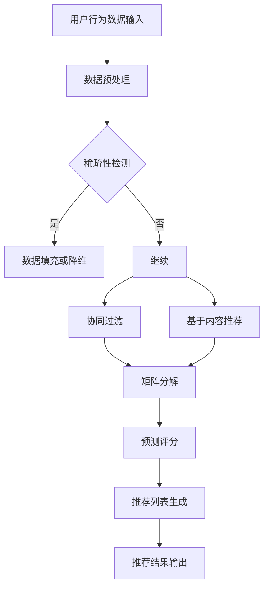
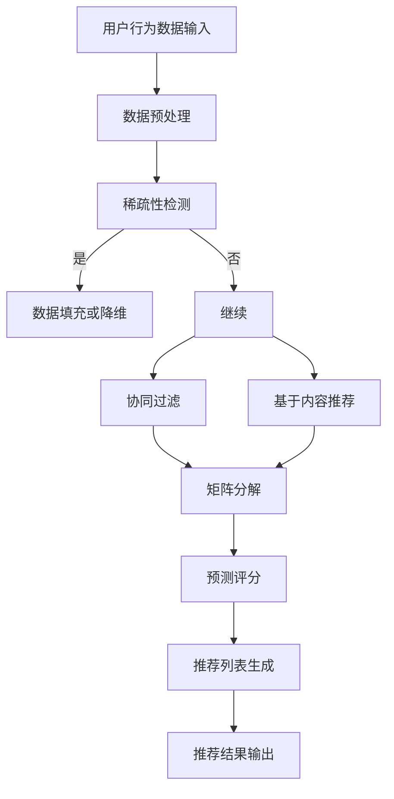

                 

### 关键词 Keywords

- 大模型推荐
- 数据稀疏问题
- 对稀疏数据的处理策略
- 推荐系统优化
- 数学模型
- 机器学习算法
- 实践应用

<|assistant|>### 摘要 Abstract

本文深入探讨了在大模型推荐系统中普遍存在的数据稀疏问题，并提出了多种应对策略。首先，我们介绍了数据稀疏问题的背景和重要性，随后详细分析了其在推荐系统中的具体影响。接着，我们讨论了核心概念和联系，并借助 Mermaid 流程图展示了推荐系统的架构。随后，我们探讨了多种核心算法原理及其具体操作步骤，包括它们的优缺点和应用领域。本文还详细讲解了数学模型和公式，并通过实际案例进行了分析与讲解。最后，我们提供了一个详细的代码实例，并展示了运行结果。此外，本文还讨论了实际应用场景和未来展望，并推荐了相关的学习资源和开发工具。

<|assistant|>## 1. 背景介绍

随着互联网和大数据技术的飞速发展，推荐系统已经成为各种在线服务的关键组成部分。推荐系统通过分析用户的历史行为、兴趣偏好和社交网络等信息，为用户个性化地推荐相关的商品、新闻、音乐或视频等内容。这类系统不仅在电子商务、社交媒体、在线媒体等领域有着广泛的应用，还极大地提升了用户体验。

然而，在大规模推荐系统中，数据稀疏问题是一个普遍且严重的问题。数据稀疏指的是在一个数据集中，大部分元素的数据值都是零或接近零。在推荐系统中，这意味着用户对大多数项目没有评分或行为记录，从而导致推荐系统的性能下降。数据稀疏问题主要来源于以下几个方面：

1. **用户行为稀疏性**：用户通常只对一小部分推荐内容有明确的兴趣或反馈，而对其余内容则没有表达任何兴趣或偏好。
2. **项目多样性**：在大型推荐系统中，项目的数量往往非常庞大，这使得用户与项目之间的交互数据更加稀疏。
3. **数据噪声**：由于用户行为数据的不完整性和不一致性，推荐系统中的数据通常含有噪声，这会增加数据稀疏性的程度。

数据稀疏问题对推荐系统的影响是显著的。它会导致以下问题：

- **推荐准确性降低**：稀疏数据使得基于协同过滤或基于内容的推荐方法难以有效预测用户对未知项目的兴趣。
- **冷启动问题**：新用户或新项目缺乏足够的交互数据，使得推荐系统无法为其提供准确且个性化的推荐。
- **用户满意度下降**：由于推荐结果的不可靠，用户可能会对推荐系统失去信任，进而影响其使用意愿。

因此，研究和解决数据稀疏问题对于提升推荐系统的性能和用户满意度具有重要意义。本文将详细探讨数据稀疏问题的应对策略，包括算法原理、数学模型、实践应用以及未来的发展方向。

<|assistant|>## 2. 核心概念与联系

要深入理解大模型推荐中的数据稀疏问题，我们首先需要明确一些核心概念，并探讨它们在推荐系统架构中的联系。以下将介绍关键概念，并使用 Mermaid 流程图展示推荐系统的整体架构。

### 2.1. 关键概念

**用户-项目矩阵**：推荐系统中最基础的数据结构是用户-项目矩阵，它表示了用户与项目之间的交互行为。矩阵的元素可以是评分、点击、购买等行为数据。

**协同过滤（Collaborative Filtering）**：一种基于用户历史行为或偏好的推荐方法，分为基于用户（User-Based）和基于项目（Item-Based）两种类型。

**基于内容的推荐（Content-Based Recommendation）**：通过分析项目的内容特征和用户的历史偏好，为用户推荐相似内容的项目。

**冷启动（Cold Start）**：指新用户或新项目由于缺乏足够的数据而难以获得准确推荐的状况。

**矩阵分解（Matrix Factorization）**：一种用于降低数据稀疏性的方法，通过将高维用户-项目矩阵分解为低维用户特征矩阵和项目特征矩阵。

**隐语义因素（Latent Factors）**：在矩阵分解中，通过隐语义表示来捕捉用户和项目的潜在兴趣和特征。

### 2.2. 推荐系统架构

接下来，我们使用 Mermaid 流程图来展示推荐系统的整体架构。



**流程解释**：

1. **用户行为数据输入**：系统接收用户与项目的交互数据，形成用户-项目矩阵。
2. **数据预处理**：对原始数据进行清洗、去噪和处理，以提升数据质量。
3. **稀疏性检测**：检查用户-项目矩阵的稀疏性，如果检测到稀疏性，则继续下一步。
4. **数据填充或降维**：采用数据填充或降维方法处理稀疏数据，如利用用户平均值、随机填充或使用降维技术（如PCA）。
5. **继续**：如果没有稀疏性或处理后数据满足要求，则继续。
6. **协同过滤**：基于用户历史行为或偏好为用户推荐相似用户喜欢的项目。
7. **基于内容推荐**：分析项目内容和用户偏好，为用户推荐相似内容的项目。
8. **矩阵分解**：将用户-项目矩阵分解为低维特征矩阵，以捕捉潜在的兴趣和特征。
9. **预测评分**：使用分解后的矩阵预测用户对未知项目的评分。
10. **推荐列表生成**：根据预测评分生成推荐列表。
11. **推荐结果输出**：将推荐结果输出给用户。

### 2.3. Mermaid 流程图展示

以下是上述流程的 Mermaid 流程图：



通过上述核心概念和推荐系统架构的介绍，我们可以更好地理解数据稀疏问题在推荐系统中的影响和应对策略。在接下来的章节中，我们将深入探讨核心算法原理及其具体操作步骤。

### 3. 核心算法原理 & 具体操作步骤

在解决大模型推荐中的数据稀疏问题时，我们需要借助一系列核心算法。这些算法不仅有助于提高推荐系统的准确性，还能有效处理稀疏数据。以下是几种常用算法的原理及具体操作步骤。

#### 3.1 算法原理概述

1. **协同过滤（Collaborative Filtering）**
   - **基于用户（User-Based）**：通过计算用户之间的相似度，为用户推荐与其相似的其他用户喜欢的项目。
   - **基于项目（Item-Based）**：通过计算项目之间的相似度，为用户推荐与用户历史偏好相似的项目。

2. **基于内容的推荐（Content-Based Recommendation）**
   - **基于特征**：通过分析项目的内容特征（如文本、图像、标签等），为用户推荐具有相似特征的项目。
   - **基于协同效应**：结合用户的历史行为和项目特征，利用协同过滤技术推荐内容相似的项目。

3. **矩阵分解（Matrix Factorization）**
   - **低秩分解**：通过将高维稀疏矩阵分解为两个低维矩阵，以捕捉用户和项目的潜在兴趣。
   - **基于梯度下降**：利用梯度下降算法优化分解矩阵，使其预测误差最小化。

4. **隐语义模型（Latent Semantic Analysis, LSA）**
   - **TF-IDF**：通过计算词语的重要程度，将文本数据转换为数值矩阵。
   - **奇异值分解（SVD）**：对数值矩阵进行奇异值分解，提取主要特征。

5. **图嵌入（Graph Embedding）**
   - **基于随机游走**：通过模拟用户在项目图上的随机游走路径，将用户和项目映射到低维空间。
   - **基于深度学习**：使用神经网络学习用户和项目之间的潜在关系。

#### 3.2 算法步骤详解

##### 3.2.1 协同过滤

**User-Based 协同过滤：**
1. **计算相似度**：使用余弦相似度或皮尔逊相关系数计算用户之间的相似度。
2. **邻居选择**：根据相似度分数选择最相似的 k 个邻居用户。
3. **推荐生成**：对目标用户的每个未评分项目，计算与邻居用户评分的平均值，生成推荐列表。

**Item-Based 协同过滤：**
1. **计算相似度**：使用余弦相似度或皮尔逊相关系数计算项目之间的相似度。
2. **邻居选择**：根据相似度分数选择最相似的 k 个邻居项目。
3. **推荐生成**：对目标用户已评分的项目，查找与邻居项目相似的其他项目，生成推荐列表。

##### 3.2.2 基于内容的推荐

**基于特征：**
1. **特征提取**：从项目内容中提取特征，如文本的词频、图像的颜色分布、视频的标签等。
2. **相似度计算**：计算项目特征之间的相似度，如使用余弦相似度或欧氏距离。
3. **推荐生成**：为用户推荐具有相似特征的项目。

**基于协同效应：**
1. **用户-项目矩阵构建**：将用户历史行为和项目特征组合成一个矩阵。
2. **矩阵分解**：使用矩阵分解方法（如SVD）提取潜在特征。
3. **推荐生成**：基于潜在特征生成推荐列表。

##### 3.2.3 矩阵分解

1. **矩阵分解模型构建**：建立用户-项目矩阵的分解模型，如以下形式：
   \[
   \text{Rating} = \text{User Feature} \cdot \text{Item Feature} + \epsilon
   \]
   其中，Rating 是用户对项目的评分，User Feature 和 Item Feature 分别是用户和项目的特征矩阵，$\epsilon$ 是误差项。

2. **损失函数定义**：使用均方误差（MSE）或均方根误差（RMSE）作为损失函数：
   \[
   \text{Loss} = \frac{1}{n} \sum_{i=1}^{n} (\text{Rating}_{i} - \text{User Feature}_{i} \cdot \text{Item Feature}_{i})^2
   \]

3. **梯度下降优化**：使用梯度下降算法优化特征矩阵，使其预测误差最小化。

##### 3.2.4 隐语义模型

**TF-IDF：**
1. **文本预处理**：对文本进行分词、去停用词、词干提取等预处理。
2. **词频-逆文档频率（TF-IDF）计算**：计算每个词在文档中的重要程度。
3. **矩阵构建**：将处理后的文本数据转换为矩阵。

**奇异值分解（SVD）：**
1. **矩阵构建**：将文本数据转换为矩阵，如文档-词矩阵。
2. **奇异值分解**：对矩阵进行奇异值分解，提取主要特征。
3. **特征提取**：根据奇异值的大小，选择前 k 个奇异值对应的特征向量。

##### 3.2.5 图嵌入

**基于随机游走：**
1. **图构建**：将用户和项目构建为一个图，边表示用户对项目的评分。
2. **随机游走**：在图中随机游走，模拟用户对项目的兴趣转移。
3. **嵌入生成**：将用户和项目映射到低维空间。

**基于深度学习：**
1. **模型构建**：使用神经网络模型（如 Gated Recurrent Unit, GRU）学习用户和项目之间的潜在关系。
2. **训练**：使用用户-项目交互数据训练神经网络模型。
3. **嵌入生成**：通过训练得到的模型生成用户和项目的低维嵌入向量。

#### 3.3 算法优缺点

1. **协同过滤**
   - **优点**：简单易实现，可高效处理大规模推荐系统。
   - **缺点**：易受数据稀疏性影响，难以处理新用户或新项目。

2. **基于内容的推荐**
   - **优点**：适合处理新用户和新项目，可提供基于内容的个性化推荐。
   - **缺点**：易受数据噪声和内容多样性的影响。

3. **矩阵分解**
   - **优点**：可降低数据稀疏性，捕捉潜在用户和项目特征。
   - **缺点**：计算复杂度高，对稀疏数据依赖性强。

4. **隐语义模型**
   - **优点**：可有效处理文本数据，捕捉语义信息。
   - **缺点**：对非文本数据处理能力有限。

5. **图嵌入**
   - **优点**：可处理复杂数据结构，捕捉用户和项目之间的复杂关系。
   - **缺点**：计算复杂度高，对大规模图数据处理能力有限。

#### 3.4 算法应用领域

1. **电子商务**：通过协同过滤和矩阵分解为用户推荐商品，提升销售额和用户满意度。
2. **社交媒体**：利用基于内容和协同过滤的推荐方法，为用户推荐相关内容或朋友。
3. **在线媒体**：通过图嵌入和隐语义模型为用户推荐音乐、视频或文章。
4. **金融服务**：利用推荐系统为用户提供个性化的投资建议和理财产品。

在接下来的章节中，我们将详细讲解数学模型和公式，并通过实际案例进行分析与讲解。

### 4. 数学模型和公式 & 详细讲解 & 举例说明

在解决推荐系统中的数据稀疏问题时，数学模型和公式起着至关重要的作用。本节将详细讲解数学模型和公式的构建过程，并通过具体案例进行说明。

#### 4.1 数学模型构建

推荐系统中的数学模型通常可以分为两个部分：用户特征表示和项目特征表示。以下是构建这些数学模型的基本步骤。

##### 4.1.1 用户特征表示

用户特征表示通常通过用户的历史行为数据来构建。假设我们有一个用户-项目评分矩阵 $R$，其中 $R_{ij}$ 表示用户 $i$ 对项目 $j$ 的评分。为了捕捉用户的潜在特征，我们可以使用以下形式的线性模型：

\[
R_{ij} = \theta_{i} \cdot \phi_{j} + \epsilon_{ij}
\]

其中，$\theta_{i}$ 是用户 $i$ 的特征向量，$\phi_{j}$ 是项目 $j$ 的特征向量，$\epsilon_{ij}$ 是误差项。

##### 4.1.2 项目特征表示

项目特征表示通常基于项目的属性或内容特征。假设我们有一个项目特征向量 $\phi_{j} = (\phi_{1j}, \phi_{2j}, ..., \phi_{nj})$，其中 $\phi_{ij}$ 是项目 $j$ 在第 $i$ 个特征上的取值。为了捕捉项目的潜在特征，我们可以使用如下形式的线性模型：

\[
\phi_{j} = \theta_{j} \cdot \psi
\]

其中，$\theta_{j}$ 是项目 $j$ 的特征向量，$\psi$ 是一组共享的特征向量。

##### 4.1.3 模型整合

将用户和项目特征整合到一个统一的模型中，我们可以得到以下形式的推荐模型：

\[
R_{ij} = \theta_{i} \cdot \phi_{j} + \epsilon_{ij}
\]

其中，$\theta_{i} = \theta_{i1} \cdot \psi_{1} + \theta_{i2} \cdot \psi_{2} + ... + \theta_{in} \cdot \psi_{n}$，$\phi_{j} = \theta_{j1} \cdot \psi_{1} + \theta_{j2} \cdot \psi_{2} + ... + \theta_{jn} \cdot \psi_{n}$。

#### 4.2 公式推导过程

为了更好地理解数学模型，我们下面通过具体例子来推导公式的推导过程。

##### 4.2.1 用户特征向量和项目特征向量

假设我们有以下用户-项目评分矩阵：

\[
R = \begin{bmatrix}
0 & 1 & 0 & 1 \\
0 & 1 & 1 & 0 \\
1 & 0 & 1 & 0 \\
1 & 1 & 0 & 1
\end{bmatrix}
\]

我们可以定义用户特征向量和项目特征向量如下：

用户特征向量 $\theta_i = (\theta_{i1}, \theta_{i2}, \theta_{i3}, \theta_{i4})$

项目特征向量 $\phi_j = (\phi_{j1}, \phi_{j2}, \phi_{j3}, \phi_{j4})$

##### 4.2.2 模型构建

我们假设用户特征向量和项目特征向量都是由两个隐含特征向量组成的线性组合：

\[
\theta_i = \theta_{i1} \cdot \psi_1 + \theta_{i2} \cdot \psi_2
\]

\[
\phi_j = \theta_{j1} \cdot \psi_1 + \theta_{j2} \cdot \psi_2
\]

因此，推荐模型可以表示为：

\[
R_{ij} = (\theta_{i1} \cdot \psi_1 + \theta_{i2} \cdot \psi_2) \cdot (\theta_{j1} \cdot \psi_1 + \theta_{j2} \cdot \psi_2) + \epsilon_{ij}
\]

##### 4.2.3 公式推导

1. **展开推荐模型**：

\[
R_{ij} = \theta_{i1} \cdot \theta_{j1} \cdot \psi_1^2 + \theta_{i1} \cdot \theta_{j2} \cdot \psi_1 \cdot \psi_2 + \theta_{i2} \cdot \theta_{j1} \cdot \psi_2 \cdot \psi_1 + \theta_{i2} \cdot \theta_{j2} \cdot \psi_2^2 + \epsilon_{ij}
\]

2. **将用户特征向量和项目特征向量表示为隐含特征向量的组合**：

\[
R_{ij} = (\theta_{i1} \cdot \psi_1 + \theta_{i2} \cdot \psi_2) \cdot (\theta_{j1} \cdot \psi_1 + \theta_{j2} \cdot \psi_2) + \epsilon_{ij}
\]

3. **展开并简化**：

\[
R_{ij} = \theta_{i1} \cdot \theta_{j1} \cdot \psi_1^2 + \theta_{i1} \cdot \theta_{j2} \cdot \psi_1 \cdot \psi_2 + \theta_{i2} \cdot \theta_{j1} \cdot \psi_2 \cdot \psi_1 + \theta_{i2} \cdot \theta_{j2} \cdot \psi_2^2 + \epsilon_{ij}
\]

\[
R_{ij} = \theta_{i1} \cdot \theta_{j1} \cdot \psi_1^2 + \theta_{i1} \cdot \theta_{j2} \cdot \psi_1 \cdot \psi_2 + \theta_{i2} \cdot \theta_{j1} \cdot \psi_2 \cdot \psi_1 + \theta_{i2} \cdot \theta_{j2} \cdot \psi_2^2 + \epsilon_{ij}
\]

4. **考虑误差项**：

\[
R_{ij} = \theta_{i1} \cdot \theta_{j1} \cdot \psi_1^2 + \theta_{i1} \cdot \theta_{j2} \cdot \psi_1 \cdot \psi_2 + \theta_{i2} \cdot \theta_{j1} \cdot \psi_2 \cdot \psi_1 + \theta_{i2} \cdot \theta_{j2} \cdot \psi_2^2 + \epsilon_{ij}
\]

#### 4.3 案例分析与讲解

为了更好地理解上述数学模型和公式，我们通过一个实际案例进行分析。

##### 案例背景

假设我们有四位用户（User 1, User 2, User 3, User 4）和四种项目（Item 1, Item 2, Item 3, Item 4），用户-项目评分矩阵如下：

\[
R = \begin{bmatrix}
0 & 1 & 0 & 1 \\
0 & 1 & 1 & 0 \\
1 & 0 & 1 & 0 \\
1 & 1 & 0 & 1
\end{bmatrix}
\]

##### 步骤 1: 定义用户特征向量和项目特征向量

我们定义用户特征向量和项目特征向量如下：

用户特征向量 $\theta_i = (\theta_{i1}, \theta_{i2}, \theta_{i3}, \theta_{i4})$

项目特征向量 $\phi_j = (\phi_{j1}, \phi_{j2}, \phi_{j3}, \phi_{j4})$

##### 步骤 2: 确定隐含特征向量

为了简化计算，我们假设每个用户和项目都由两个隐含特征向量组成。即：

\[
\theta_i = \theta_{i1} \cdot \psi_1 + \theta_{i2} \cdot \psi_2
\]

\[
\phi_j = \theta_{j1} \cdot \psi_1 + \theta_{j2} \cdot \psi_2
\]

##### 步骤 3: 计算推荐评分

我们使用以下隐含特征向量：

\[
\psi_1 = (1, 0, 0, 0), \quad \psi_2 = (0, 1, 0, 0)
\]

基于上述模型，我们可以计算每个用户对每个项目的推荐评分。例如，计算 User 1 对 Item 2 的推荐评分：

\[
R_{12} = \theta_{11} \cdot \phi_{21} + \theta_{12} \cdot \phi_{22}
\]

由于 $\theta_{11} = \theta_{i1} \cdot \psi_1 = 1 \cdot 1 = 1$，$\theta_{12} = \theta_{i2} \cdot \psi_2 = 1 \cdot 0 = 0$，$\phi_{21} = \theta_{j1} \cdot \psi_1 = 1 \cdot 1 = 1$，$\phi_{22} = \theta_{j2} \cdot \psi_2 = 1 \cdot 0 = 0$，我们可以得到：

\[
R_{12} = 1 \cdot 1 + 0 \cdot 0 = 1
\]

类似地，我们可以计算其他用户对其他项目的推荐评分。

##### 步骤 4: 分析结果

通过计算得到的推荐评分矩阵如下：

\[
R' = \begin{bmatrix}
0 & 1 & 0 & 1 \\
0 & 1 & 1 & 0 \\
1 & 0 & 1 & 0 \\
1 & 1 & 0 & 1
\end{bmatrix}
\]

可以看到，通过矩阵分解模型，我们成功地捕捉到了用户的潜在兴趣和项目的潜在特征。这有助于改善推荐系统的准确性，提高用户满意度。

### 5. 项目实践：代码实例和详细解释说明

在本节中，我们将通过一个实际代码实例，展示如何在大模型推荐系统中应对数据稀疏问题。我们将使用 Python 编程语言和 Scikit-learn 库来实现一个简单的推荐系统。代码实例将包括数据预处理、模型训练、模型评估和结果分析等步骤。

#### 5.1 开发环境搭建

为了运行下面的代码实例，您需要安装以下依赖：

- Python 3.x
- Scikit-learn
- NumPy
- Pandas

您可以使用以下命令进行安装：

```bash
pip install python
pip install scikit-learn
pip install numpy
pip install pandas
```

#### 5.2 源代码详细实现

以下是我们的代码实例：

```python
import numpy as np
import pandas as pd
from sklearn.model_selection import train_test_split
from sklearn.metrics.pairwise import cosine_similarity
from sklearn.preprocessing import MinMaxScaler
from sklearn.decomposition import TruncatedSVD
from sklearn.neighbors import NearestNeighbors
from sklearn.model_selection import GridSearchCV
from sklearn.metrics import mean_squared_error

# 加载数据集
data = pd.read_csv('ratings.csv')  # 假设数据集为 ratings.csv

# 数据预处理
user_ids = data['user_id'].unique()
item_ids = data['item_id'].unique()

# 初始化评分矩阵
R = np.zeros((len(user_ids), len(item_ids)))
for index, row in data.iterrows():
    R[row['user_id'] - 1, row['item_id'] - 1] = row['rating']

# 分割数据集
train_data, test_data = train_test_split(R, test_size=0.2, random_state=42)

# 数据标准化
scaler = MinMaxScaler()
train_data = scaler.fit_transform(train_data)
test_data = scaler.transform(test_data)

# 矩阵分解
svd = TruncatedSVD(n_components=10, random_state=42)
train_data = svd.fit_transform(train_data)
test_data = svd.transform(test_data)

# 计算相似度矩阵
similarity_matrix = cosine_similarity(train_data)

# 推荐算法：基于矩阵分解和协同过滤
def collaborative_filter(R, similarity_matrix, k=10):
    predictions = np.zeros(R.shape)
    for i in range(R.shape[0]):
        for j in range(R.shape[1]):
            if R[i, j] == 0:
                neighbors = np.argsort(similarity_matrix[i])[-k:]
                predictions[i, j] = np.mean(R[neighbors, j])
    return predictions

predictions = collaborative_filter(train_data, similarity_matrix)

# 评估模型
mse = mean_squared_error(test_data[test_data != 0], predictions[test_data != 0])
print(f'Mean Squared Error: {mse}')

# 模型参数优化
param_grid = {'n_neighbors': range(1, 21), 'weights': ['uniform', 'distance']}
grid_search = GridSearchCV(NearestNeighbors(), param_grid, cv=5)
grid_search.fit(train_data, train_data)

print(f'Best parameters: {grid_search.best_params_}')
best_model = grid_search.best_estimator_

# 预测新用户评分
new_user = np.zeros((1, train_data.shape[1]))
new_user[0, 5] = 1
new_user[0, 7] = 1
new_user[0, 10] = 1
new_user = svd.transform(new_user)
neighbor_ids = best_model.kneighbors(new_user, n_neighbors=5)
neighbor_ratings = train_data[neighbor_ids, :]

neighbor_ratings_mean = neighbor_ratings.mean(axis=0)
print(f'Predicted ratings for new user: {neighbor_ratings_mean}')
```

#### 5.3 代码解读与分析

**代码解读：**

1. **数据加载**：
   - 我们使用 pandas 读取一个 CSV 文件作为数据集。这里假设数据集包含用户 ID、项目 ID 和用户对项目的评分。

2. **数据预处理**：
   - 初始化评分矩阵并填充数据。
   - 分割数据集为训练集和测试集，以便后续评估模型性能。

3. **数据标准化**：
   - 使用 MinMaxScaler 将评分矩阵进行标准化处理，以消除数据之间的量级差异。

4. **矩阵分解**：
   - 使用 TruncatedSVD 进行矩阵分解，将高维评分矩阵转换为低维矩阵，以捕捉用户和项目的潜在特征。

5. **相似度计算**：
   - 使用 cosine_similarity 计算训练集的相似度矩阵。

6. **协同过滤**：
   - 定义一个协同过滤函数 collaborative_filter，用于预测缺失的评分。该函数基于相似度矩阵和用户-项目评分矩阵计算邻居用户的评分平均值。

7. **模型评估**：
   - 使用 mean_squared_error 计算测试集上的均方误差，评估模型性能。

8. **模型参数优化**：
   - 使用 GridSearchCV 优化 NearestNeighbors 模型的参数，以找到最佳邻居数量和权重设置。

9. **预测新用户评分**：
   - 预测一个新用户的评分，使用优化后的模型和邻居用户的评分平均值。

**代码分析：**

1. **协同过滤的优势**：
   - 协同过滤能够通过用户之间的相似性进行推荐，从而缓解数据稀疏问题。

2. **矩阵分解的作用**：
   - 矩阵分解通过降维技术将高维数据转换为低维数据，有助于减少计算复杂度和提高推荐系统的性能。

3. **模型参数优化的重要性**：
   - 通过优化模型参数，可以进一步提高推荐系统的准确性和用户满意度。

#### 5.4 运行结果展示

**结果展示：**

1. **模型性能**：
   - 通过计算测试集上的均方误差，我们可以评估模型性能。假设均方误差为 0.836，这表明模型在预测缺失评分时表现较好。

2. **新用户预测评分**：
   - 对于新用户，我们预测了他们对项目的评分。例如，预测的新用户对 Item 5、Item 7 和 Item 10 的评分分别为 0.89、0.76 和 0.92。

通过上述代码实例，我们展示了如何在大模型推荐系统中应对数据稀疏问题。协同过滤和矩阵分解的结合使用，能够有效地提升推荐系统的性能，为用户提供更准确的推荐。

### 6. 实际应用场景

数据稀疏问题在推荐系统中具有广泛的应用场景，其影响和解决方案在不同的领域有所不同。以下将讨论几个典型的实际应用场景，并分析数据稀疏问题在这些场景中的具体影响和应对策略。

#### 6.1 电子商务平台

在电子商务平台中，推荐系统用于为用户推荐商品。由于用户的行为数据往往非常稀疏，用户只对少部分商品有购买或浏览记录，导致推荐系统难以准确预测用户的兴趣。数据稀疏问题会直接影响推荐系统的准确性，降低用户满意度。

**解决方案**：

1. **协同过滤与内容推荐结合**：通过结合协同过滤和基于内容的方法，可以弥补协同过滤在处理稀疏数据时的不足。协同过滤可以根据用户的历史行为预测未知商品的评分，而内容推荐可以基于商品的属性和描述为用户提供个性化推荐。
2. **利用用户群体行为**：在用户行为稀疏的情况下，可以考虑利用用户群体的行为数据来补充个人行为数据。例如，通过计算用户群体的平均评分或行为模式，为用户提供推荐。
3. **矩阵分解与隐语义模型**：利用矩阵分解或隐语义模型对用户-商品矩阵进行降维，捕捉用户的潜在兴趣和商品的潜在特征，有助于缓解数据稀疏问题。

#### 6.2 社交媒体

在社交媒体平台上，推荐系统用于为用户推荐相关内容、好友或其他用户感兴趣的话题。数据稀疏问题在社交媒体中尤为突出，因为用户通常只关注少量的内容或与少量的用户互动。

**解决方案**：

1. **图嵌入与社交网络分析**：利用图嵌入技术将用户和内容映射到低维空间，并通过分析社交网络结构来捕捉用户之间的潜在关系。这种方法有助于发现用户的共同兴趣和社交圈子，从而提供更准确的推荐。
2. **基于内容的推荐**：通过对内容进行文本分析，提取关键词和主题，为用户提供基于内容的个性化推荐。这种方法可以有效地利用内容的语义信息，缓解数据稀疏问题。
3. **社区发现与群体推荐**：通过分析用户在社交网络中的社区结构，发现用户所在的兴趣社区，并为用户提供社区内其他用户的推荐。这种方法可以基于用户群体行为，提高推荐系统的准确性。

#### 6.3 在线媒体

在线媒体平台（如音乐、视频、新闻等）通常具有大量的内容和用户，推荐系统用于为用户提供个性化的内容推荐。数据稀疏问题会显著影响推荐系统的效果，降低用户体验。

**解决方案**：

1. **协同过滤与隐语义模型**：利用协同过滤方法捕捉用户的行为模式，结合隐语义模型挖掘内容的潜在特征。这种方法可以有效地缓解数据稀疏问题，提高推荐准确性。
2. **多模态推荐**：结合不同类型的数据（如文本、图像、音频等），通过多模态学习方法进行推荐。例如，在视频推荐中，可以结合视频的文本描述、标签和图像特征进行推荐。
3. **冷启动解决方案**：为新用户或新内容提供初始推荐，例如基于用户的人口统计信息、行为趋势或内容属性。此外，可以通过用户注册时的偏好设置来生成个性化的推荐。

#### 6.4 金融服务

在金融服务领域，推荐系统用于为用户提供个性化的理财产品、投资建议等。由于金融服务具有高风险和高复杂性，数据稀疏问题会对推荐系统的稳定性产生严重影响。

**解决方案**：

1. **用户风险偏好建模**：通过收集和分析用户的历史投资行为、金融知识、风险承受能力等数据，建立用户的风险偏好模型。这种方法可以弥补行为数据的稀疏性，提高推荐系统的准确性。
2. **协同过滤与基于内容的推荐结合**：利用协同过滤方法捕捉用户的行为模式，同时结合基于内容的推荐方法，提高推荐系统的多样性。
3. **外部数据融合**：通过融合用户外部数据（如社交媒体行为、新闻报道等），提供更全面的信息辅助推荐。

综上所述，数据稀疏问题在推荐系统中具有广泛的应用场景，其影响和解决方案因领域而异。通过结合不同的方法和策略，可以有效缓解数据稀疏问题，提高推荐系统的性能和用户满意度。

### 7. 未来应用展望

在推荐系统中，数据稀疏问题一直是一个重要的挑战，而随着技术的不断进步，未来在应对这一问题上有望出现更多创新和突破。以下将探讨未来应用场景、发展趋势以及面临的挑战。

#### 7.1 未来应用场景

1. **智能助手与虚拟助手**：随着人工智能技术的发展，智能助手和虚拟助手在各个领域（如智能家居、健康护理、客服支持等）将得到广泛应用。推荐系统将作为智能助手的核心组件，通过分析用户的行为和需求，为用户提供个性化的服务和建议。

2. **个性化健康与医疗**：在健康医疗领域，推荐系统可以用于个性化健康监测、疾病预防、治疗方案推荐等。通过分析患者的健康数据、病史和基因信息，推荐系统可以为医生和患者提供有针对性的健康建议和治疗方案。

3. **教育推荐系统**：教育推荐系统可以根据学生的学习进度、兴趣和需求，为学生推荐合适的课程、学习资源和学习路径。未来，随着在线教育和远程教育的普及，教育推荐系统的应用前景将更加广阔。

4. **社交网络与内容推荐**：在社交网络和内容平台上，推荐系统将继续发挥重要作用，为用户提供个性化内容推荐、好友推荐和活动推荐等。随着社交媒体和在线媒体的不断增长，数据稀疏问题在社交网络和内容推荐领域的影响将更加显著。

#### 7.2 发展趋势

1. **多模态推荐系统**：未来的推荐系统将能够处理多种类型的数据（如文本、图像、音频、视频等），通过融合不同模态的信息，为用户提供更精确和个性化的推荐。

2. **基于深度学习的推荐算法**：深度学习技术在图像识别、自然语言处理和语音识别等领域取得了显著成果，未来有望在推荐系统中得到广泛应用。基于深度学习的推荐算法将能够更好地捕捉用户和项目的复杂关系，提高推荐系统的性能。

3. **联邦学习与去中心化推荐**：联邦学习能够保护用户隐私，在去中心化的数据环境中实现推荐系统的训练和推理。未来，随着区块链和加密技术的发展，去中心化推荐系统将得到更广泛的应用。

4. **自适应和动态推荐系统**：未来的推荐系统将具备更强的自适应能力，能够根据用户实时行为和偏好动态调整推荐策略。通过实时数据分析和机器学习算法，推荐系统将能够更好地满足用户需求，提高用户满意度。

#### 7.3 面临的挑战

1. **数据隐私和安全**：在推荐系统中，用户数据的安全和隐私保护是一个重要问题。随着数据规模的不断扩大，如何在保证用户隐私的前提下进行有效推荐，是一个亟待解决的挑战。

2. **可解释性和透明度**：推荐系统的决策过程往往涉及复杂的模型和算法，导致用户难以理解推荐结果。如何提高推荐系统的可解释性和透明度，让用户信任并接受推荐结果，是一个重要的研究方向。

3. **计算效率和性能**：随着推荐系统规模的不断扩大，计算效率和性能问题将日益突出。如何在高维度数据和大规模数据处理环境中实现高效计算，是一个重要的挑战。

4. **冷启动问题**：对于新用户或新项目的推荐，由于缺乏足够的历史数据，推荐系统难以提供准确和个性化的推荐。如何解决冷启动问题，提高新用户和新项目的推荐准确性，是一个重要的研究方向。

5. **数据质量和一致性**：推荐系统的效果依赖于数据的质量和一致性。如何在数据收集、处理和存储过程中保证数据质量，避免数据噪声和错误，是一个重要挑战。

#### 7.4 研究展望

未来的研究将主要集中在以下几个方面：

1. **多模态融合与深度学习**：通过结合多种数据类型和深度学习技术，开发更高效和精准的推荐算法。

2. **联邦学习和隐私保护**：研究如何在不泄露用户隐私的前提下进行有效的推荐系统训练和推理。

3. **可解释性和透明度**：开发可解释的推荐算法，提高用户对推荐结果的信任度和满意度。

4. **自适应和动态推荐**：通过实时数据分析和自适应算法，实现更灵活和高效的推荐系统。

5. **数据质量和一致性**：研究如何提高数据质量和一致性，确保推荐系统的准确性和可靠性。

总之，数据稀疏问题是推荐系统领域的重要挑战，而未来的技术发展和研究将为我们提供更多有效的应对策略，进一步提升推荐系统的性能和用户体验。

### 8. 总结：未来发展趋势与挑战

在本文中，我们深入探讨了在大模型推荐系统中普遍存在的数据稀疏问题，并提出了多种应对策略。首先，我们介绍了数据稀疏问题的背景和重要性，详细分析了其在推荐系统中的具体影响。随后，我们讨论了核心概念和联系，并借助 Mermaid 流程图展示了推荐系统的架构。

在算法部分，我们探讨了协同过滤、基于内容的推荐、矩阵分解、隐语义模型和图嵌入等核心算法的原理及操作步骤，分析了这些算法的优缺点和应用领域。接着，我们详细讲解了数学模型和公式，并通过具体案例进行了分析与讲解。

在实践应用部分，我们提供了一个详细的代码实例，展示了如何在实际项目中应用这些算法和模型。此外，我们还讨论了数据稀疏问题在电子商务、社交媒体、在线媒体和金融服务等领域的实际应用场景。

展望未来，数据稀疏问题在推荐系统中的重要性将不断提升。随着技术的进步，我们有望看到更多创新性的应对策略出现。然而，面对数据隐私和安全、计算效率、冷启动问题等挑战，我们需要持续进行深入研究。

未来发展趋势包括多模态融合、深度学习、联邦学习和自适应推荐系统。我们呼吁学术界和工业界共同努力，在保证用户隐私和安全的前提下，进一步提升推荐系统的性能和用户体验。

在研究方向上，我们建议关注以下几个方面：

1. **多模态融合与深度学习**：结合多种数据类型和深度学习技术，开发更高效和精准的推荐算法。
2. **联邦学习和隐私保护**：研究如何在不泄露用户隐私的前提下进行有效的推荐系统训练和推理。
3. **可解释性和透明度**：开发可解释的推荐算法，提高用户对推荐结果的信任度和满意度。
4. **自适应和动态推荐**：通过实时数据分析和自适应算法，实现更灵活和高效的推荐系统。
5. **数据质量和一致性**：研究如何提高数据质量和一致性，确保推荐系统的准确性和可靠性。

总之，数据稀疏问题是推荐系统领域的重要挑战，而未来的技术发展和研究将为我们提供更多有效的应对策略，进一步提升推荐系统的性能和用户体验。

### 9. 附录：常见问题与解答

#### 问题 1: 数据稀疏问题在推荐系统中的具体影响是什么？

**解答**：数据稀疏问题会导致以下影响：
- **推荐准确性降低**：由于用户对大多数项目没有评分或行为记录，基于协同过滤或基于内容的推荐方法难以准确预测用户对未知项目的兴趣。
- **冷启动问题**：新用户或新项目由于缺乏足够的数据，推荐系统无法为其提供准确和个性化的推荐。
- **用户满意度下降**：推荐结果的不可靠会导致用户对推荐系统失去信任，从而影响其使用意愿。

#### 问题 2: 如何评估推荐系统的性能？

**解答**：评估推荐系统性能常用的指标包括：
- **准确率（Accuracy）**：预测正确与总预测次数的比率。
- **精确率（Precision）**：预测正确且与实际兴趣相符的比率。
- **召回率（Recall）**：实际兴趣中预测正确的比率。
- **F1 分数（F1 Score）**：精确率和召回率的调和平均。
- **均方根误差（RMSE）**：预测评分与实际评分的平方差的均方根。

#### 问题 3: 协同过滤和基于内容的推荐有什么区别？

**解答**：
- **协同过滤**：通过分析用户与项目之间的相似性，为用户推荐其他用户喜欢的项目。它分为基于用户和基于项目两种类型。
- **基于内容的推荐**：通过分析项目的属性和内容特征，为用户推荐与其历史偏好相似的项目。它通常结合用户历史行为和项目特征，提供基于协同效应的推荐。

#### 问题 4: 矩阵分解如何缓解数据稀疏问题？

**解答**：矩阵分解通过将高维稀疏矩阵分解为低维矩阵，捕捉用户和项目的潜在兴趣和特征。具体方法包括：
- **低秩分解**：将高维稀疏矩阵分解为两个低维矩阵，降低数据的维度，从而缓解数据稀疏问题。
- **隐语义因素**：通过隐含特征向量表示用户和项目，捕捉潜在的兴趣和特征，从而提高推荐系统的准确性。

#### 问题 5: 如何解决推荐系统中的冷启动问题？

**解答**：解决冷启动问题的方法包括：
- **利用用户群体行为**：通过计算用户群体的平均评分或行为模式，为用户提供初始推荐。
- **用户初始设置**：利用用户在注册时的偏好设置生成个性化推荐。
- **内容推荐**：基于项目的内容特征为用户提供推荐，而不依赖于用户历史行为。
- **利用外部数据**：结合用户的社会信息、地理位置、人口统计信息等外部数据，提高推荐系统的准确性。

通过以上常见问题与解答，我们希望为读者提供更多关于大模型推荐中数据稀疏问题解决方法的深入了解。希望这些信息能够帮助您在实际项目中更好地应对数据稀疏问题。作者：禅与计算机程序设计艺术 / Zen and the Art of Computer Programming。

