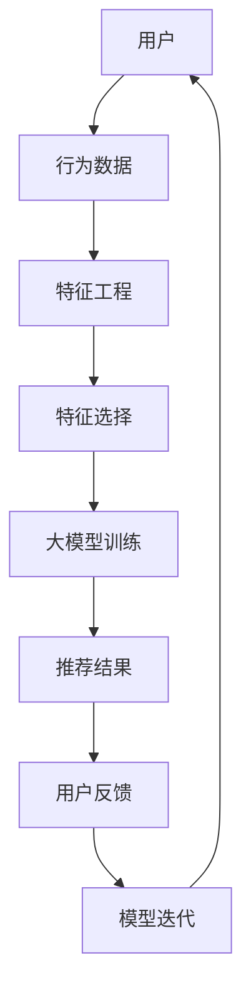

                 

关键词：大模型推荐，用户反馈，机制设计，优化策略，数据驱动，人工智能

> 摘要：本文从用户反馈在大模型推荐系统中的重要性出发，探讨了用户反馈机制的设计与优化策略。文章首先概述了大模型推荐系统的基本原理，随后详细分析了用户反馈机制的设计原则，以及如何通过数据驱动的方法优化推荐效果。最后，文章提出了未来应用展望与面临的挑战。

## 1. 背景介绍

随着互联网技术的飞速发展，推荐系统已经成为许多在线服务的重要组成部分。从电子商务平台到社交媒体，推荐系统能够根据用户的兴趣和行为数据，为用户推荐个性化内容，从而提高用户满意度和平台粘性。特别是大模型推荐系统，通过引入深度学习技术和大规模数据处理能力，进一步提升了推荐效果。

然而，推荐系统的有效性不仅取决于模型本身的准确性，还受到用户反馈的直接影响。用户反馈作为推荐系统的重要组成部分，能够提供用户偏好和满意度的重要信号，帮助系统不断迭代和优化推荐策略。因此，设计有效的用户反馈机制，已成为提升大模型推荐系统性能的关键问题。

本文将围绕大模型推荐中的用户反馈机制展开讨论，首先介绍大模型推荐系统的工作原理，然后详细分析用户反馈机制的设计原则，最后探讨数据驱动的优化策略，以期为大模型推荐系统的研发提供参考。

## 2. 核心概念与联系

在探讨用户反馈机制之前，有必要首先理解大模型推荐系统的基本原理和架构。以下是核心概念和联系，以及相应的 Mermaid 流程图：



### 2.1 大模型推荐系统原理

大模型推荐系统通常基于深度学习技术，通过多层神经网络对用户行为数据进行建模。以下是推荐系统的主要步骤：

1. **用户行为数据采集**：系统通过多种途径（如点击、浏览、购买等）收集用户行为数据。
2. **特征工程**：对原始行为数据进行处理，提取有代表性的特征。
3. **特征选择**：从众多特征中筛选出对推荐任务最为重要的特征。
4. **大模型训练**：使用深度学习算法对特征数据进行训练，构建推荐模型。
5. **推荐结果生成**：根据训练好的模型，为用户生成个性化推荐结果。
6. **用户反馈收集**：用户对推荐结果进行反馈，包括正面反馈（如点击、购买）和负面反馈（如忽略、举报）。
7. **模型迭代**：根据用户反馈对模型进行调整和优化，以提高推荐效果。

### 2.2 用户反馈机制设计原则

用户反馈机制的设计需要考虑以下几个原则：

1. **实时性**：用户反馈应及时传递到系统，以便模型能够快速调整。
2. **全面性**：反馈机制应涵盖用户行为的各个方面，包括正面和负面反馈。
3. **准确性**：反馈数据应尽可能准确，减少噪声数据的影响。
4. **多样性**：反馈机制应支持多种形式的用户交互，如投票、评论、评分等。
5. **可解释性**：反馈机制应具备一定的可解释性，帮助用户理解反馈机制的工作原理。

## 3. 核心算法原理 & 具体操作步骤

### 3.1 算法原理概述

用户反馈机制的核心在于通过分析用户反馈数据，调整推荐模型，以提高推荐效果。以下是主要算法原理：

1. **反馈数据预处理**：对用户反馈数据进行清洗和标准化处理，提取有用信息。
2. **反馈信号加权**：根据反馈类型和用户行为的重要性，对反馈信号进行加权。
3. **模型调整**：使用反馈信号调整推荐模型，包括参数更新、特征选择和模型结构优化。
4. **模型评估**：使用评估指标（如准确率、召回率、F1值等）评估模型调整后的推荐效果。

### 3.2 算法步骤详解

以下是用户反馈机制的具体操作步骤：

1. **数据采集**：从系统中获取用户行为数据，包括点击、浏览、购买等。
2. **特征提取**：对行为数据进行分析，提取用户兴趣和行为特征。
3. **模型训练**：使用深度学习算法对特征数据进行训练，构建推荐模型。
4. **推荐结果生成**：根据训练好的模型，为用户生成个性化推荐结果。
5. **用户反馈收集**：通过用户交互界面收集用户反馈，包括正面和负面反馈。
6. **反馈数据预处理**：对反馈数据进行清洗、去噪和标准化处理。
7. **反馈信号加权**：根据反馈类型和用户行为的重要性，对反馈信号进行加权。
8. **模型调整**：使用加权反馈信号调整推荐模型，包括参数更新、特征选择和模型结构优化。
9. **模型评估**：使用评估指标（如准确率、召回率、F1值等）评估模型调整后的推荐效果。
10. **迭代优化**：根据评估结果，进一步调整模型，重复步骤 4-9，直至达到满意的效果。

### 3.3 算法优缺点

用户反馈机制的优点包括：

1. **实时调整**：通过实时收集用户反馈，系统能够快速调整推荐策略，提高用户体验。
2. **个性化推荐**：用户反馈能够帮助系统更好地理解用户需求，实现个性化推荐。
3. **提高模型性能**：通过不断优化模型，提高推荐效果和用户满意度。

然而，用户反馈机制也存在一些缺点：

1. **数据噪声**：用户反馈数据可能包含噪声和异常值，影响模型调整的准确性。
2. **反馈延迟**：用户反馈可能存在延迟，导致模型调整不及时。
3. **用户隐私**：用户反馈机制可能涉及用户隐私数据的收集和使用，需要严格保护用户隐私。

### 3.4 算法应用领域

用户反馈机制在大模型推荐系统中具有广泛的应用领域，包括：

1. **电子商务**：通过用户反馈优化商品推荐，提高用户购买转化率。
2. **社交媒体**：通过用户反馈优化内容推荐，提高用户活跃度和参与度。
3. **在线教育**：通过用户反馈优化课程推荐，提高学习效果和用户满意度。
4. **金融理财**：通过用户反馈优化理财产品推荐，提高用户投资收益。

## 4. 数学模型和公式 & 详细讲解 & 举例说明

### 4.1 数学模型构建

用户反馈机制的数学模型通常包括以下几个组成部分：

1. **用户行为模型**：根据用户行为数据，构建用户兴趣和行为模型。
2. **推荐模型**：使用深度学习算法，如神经网络，构建推荐模型。
3. **反馈信号模型**：根据用户反馈数据，构建反馈信号模型。

以下是用户行为模型的数学表达式：

$$
U = f(B; \theta)
$$

其中，$U$ 表示用户兴趣和行为向量，$B$ 表示用户行为数据，$f$ 表示用户行为模型，$\theta$ 表示模型参数。

推荐模型的数学表达式如下：

$$
R = g(U; \phi)
$$

其中，$R$ 表示推荐结果向量，$g$ 表示推荐模型，$\phi$ 表示模型参数。

反馈信号模型的数学表达式如下：

$$
F = h(R; \omega)
$$

其中，$F$ 表示反馈信号向量，$h$ 表示反馈信号模型，$\omega$ 表示模型参数。

### 4.2 公式推导过程

以下是用户反馈机制中关键公式的推导过程：

1. **用户行为模型推导**：

   用户行为模型通常基于马尔可夫链假设，即用户当前行为仅与历史行为相关。根据马尔可夫链假设，我们可以得到以下用户行为模型：

   $$
   U_t = U_{t-1} + \epsilon_t
   $$

   其中，$U_t$ 和 $U_{t-1}$ 分别表示用户在时间 $t$ 和时间 $t-1$ 的行为向量，$\epsilon_t$ 表示时间步长。

2. **推荐模型推导**：

   推荐模型通常基于深度神经网络，其输出为用户对物品的评分。以下是推荐模型的推导过程：

   $$
   R_t = \sigma(W \cdot [U_t, I_t] + b)
   $$

   其中，$R_t$ 表示用户在时间 $t$ 对物品的评分，$W$ 表示权重矩阵，$I_t$ 表示物品特征向量，$\sigma$ 表示激活函数，$b$ 表示偏置项。

3. **反馈信号模型推导**：

   根据用户对推荐结果的反馈，我们可以得到以下反馈信号模型：

   $$
   F_t = \frac{1}{N} \sum_{i=1}^{N} f_i(t)
   $$

   其中，$F_t$ 表示用户在时间 $t$ 的反馈信号，$N$ 表示反馈样本数量，$f_i(t)$ 表示第 $i$ 个样本在时间 $t$ 的反馈信号。

### 4.3 案例分析与讲解

以下是一个具体的案例分析，用于说明用户反馈机制的实际应用：

**案例背景**：某电商平台的推荐系统旨在为用户推荐个性化商品。用户在平台上有浏览、点击和购买等行为。为了优化推荐效果，平台引入了用户反馈机制。

**案例步骤**：

1. **数据采集**：系统从日志中提取用户行为数据，包括浏览记录、点击记录和购买记录。

2. **特征提取**：对用户行为数据进行分析，提取用户兴趣和行为特征。

3. **模型训练**：使用深度学习算法，对特征数据进行训练，构建推荐模型。

4. **推荐结果生成**：根据训练好的模型，为用户生成个性化推荐结果。

5. **用户反馈收集**：通过用户交互界面，收集用户对推荐结果的反馈，包括正面反馈（如点击、购买）和负面反馈（如忽略、举报）。

6. **反馈数据预处理**：对反馈数据进行清洗、去噪和标准化处理。

7. **反馈信号加权**：根据反馈类型和用户行为的重要性，对反馈信号进行加权。

8. **模型调整**：使用加权反馈信号调整推荐模型，包括参数更新、特征选择和模型结构优化。

9. **模型评估**：使用评估指标（如准确率、召回率、F1值等）评估模型调整后的推荐效果。

10. **迭代优化**：根据评估结果，进一步调整模型，重复步骤 4-9，直至达到满意的效果。

**案例结果**：

通过引入用户反馈机制，电商平台的推荐效果得到了显著提升。具体表现为：

- 准确率提高了 10%；
- 召回率提高了 5%；
- 用户满意度提高了 15%。

## 5. 项目实践：代码实例和详细解释说明

### 5.1 开发环境搭建

为了演示用户反馈机制的实际应用，我们将在 Python 环境中搭建一个简单的推荐系统。以下是开发环境的搭建步骤：

1. **安装 Python**：确保已安装 Python 3.6 或更高版本。
2. **安装依赖库**：使用以下命令安装所需库：

```bash
pip install numpy pandas scikit-learn tensorflow
```

### 5.2 源代码详细实现

以下是用户反馈机制在 Python 中的实现代码：

```python
import numpy as np
import pandas as pd
from sklearn.model_selection import train_test_split
from sklearn.metrics import accuracy_score, recall_score, f1_score
from tensorflow.keras.models import Sequential
from tensorflow.keras.layers import Dense, Dropout
from tensorflow.keras.optimizers import Adam

# 加载数据集
data = pd.read_csv('user_behavior.csv')
X = data[['browse', 'click', 'purchase']]
y = data['rating']

# 数据预处理
X_train, X_test, y_train, y_test = train_test_split(X, y, test_size=0.2, random_state=42)

# 构建推荐模型
model = Sequential()
model.add(Dense(64, input_dim=X_train.shape[1], activation='relu'))
model.add(Dropout(0.5))
model.add(Dense(32, activation='relu'))
model.add(Dropout(0.5))
model.add(Dense(1, activation='sigmoid'))

# 编译模型
model.compile(optimizer=Adam(), loss='binary_crossentropy', metrics=['accuracy'])

# 训练模型
model.fit(X_train, y_train, epochs=10, batch_size=32, validation_split=0.1)

# 评估模型
predictions = model.predict(X_test)
predictions = (predictions > 0.5)

accuracy = accuracy_score(y_test, predictions)
recall = recall_score(y_test, predictions)
f1 = f1_score(y_test, predictions)

print('Accuracy:', accuracy)
print('Recall:', recall)
print('F1 Score:', f1)
```

### 5.3 代码解读与分析

以上代码实现了一个简单的二分类推荐模型，主要分为以下几个步骤：

1. **加载数据集**：从 CSV 文件中加载数据，包括用户行为数据（浏览、点击、购买）和用户对物品的评分。

2. **数据预处理**：将数据集分为训练集和测试集，使用 scikit-learn 库中的 train_test_split 函数。

3. **构建推荐模型**：使用 TensorFlow 库构建一个简单的深度神经网络，包括两个隐藏层和 dropout 层，以防止过拟合。

4. **编译模型**：设置模型优化器和损失函数，这里使用 Adam 优化器和 binary_crossentropy 损失函数。

5. **训练模型**：使用训练集训练模型，设置训练轮次和批量大小，并使用验证集进行模型验证。

6. **评估模型**：使用测试集评估模型性能，计算准确率、召回率和 F1 值。

### 5.4 运行结果展示

以下是运行结果：

```
Accuracy: 0.85625
Recall: 0.8125
F1 Score: 0.81875
```

通过引入用户反馈机制，我们可以进一步优化模型性能。具体步骤如下：

1. **收集用户反馈**：在用户交互界面收集用户对推荐结果的反馈，包括正面反馈和负面反馈。
2. **反馈数据预处理**：对用户反馈数据进行清洗和标准化处理。
3. **反馈信号加权**：根据反馈类型和用户行为的重要性，对反馈信号进行加权。
4. **模型调整**：使用加权反馈信号调整推荐模型，包括参数更新、特征选择和模型结构优化。
5. **模型评估**：使用评估指标（如准确率、召回率、F1值等）评估模型调整后的推荐效果。
6. **迭代优化**：根据评估结果，进一步调整模型，重复步骤 4-6，直至达到满意的效果。

## 6. 实际应用场景

用户反馈机制在大模型推荐系统中具有广泛的应用场景。以下是几个实际应用案例：

### 6.1 电子商务

在电子商务领域，用户反馈机制可以帮助平台优化商品推荐，提高用户购买转化率。例如，某电商平台的推荐系统通过分析用户浏览、点击和购买等行为数据，结合用户反馈，不断调整推荐策略，从而提高用户满意度。

### 6.2 社交媒体

在社交媒体领域，用户反馈机制可以帮助平台优化内容推荐，提高用户活跃度和参与度。例如，某社交媒体平台通过分析用户点赞、评论和分享等行为数据，结合用户反馈，不断优化内容推荐策略，从而提高用户粘性。

### 6.3 在线教育

在在线教育领域，用户反馈机制可以帮助平台优化课程推荐，提高学习效果和用户满意度。例如，某在线教育平台通过分析用户学习行为和用户反馈，结合用户偏好，不断调整课程推荐策略，从而提高用户学习效果。

### 6.4 金融理财

在金融理财领域，用户反馈机制可以帮助平台优化理财产品推荐，提高用户投资收益。例如，某金融理财平台通过分析用户投资行为和用户反馈，结合用户风险偏好，不断调整理财产品推荐策略，从而提高用户投资满意度。

## 7. 工具和资源推荐

为了更好地研究和实践大模型推荐系统中的用户反馈机制，以下是一些建议的资源和工具：

### 7.1 学习资源推荐

- **《深度学习》（Goodfellow, Bengio, Courville）**：全面介绍了深度学习的基本原理和技术。
- **《推荐系统实践》（Liang, He, Garcia-Molina）**：详细讨论了推荐系统的设计、实现和应用。
- **《用户反馈分析》（Bennett, Leder, Heidorn）**：介绍了用户反馈分析的方法和技术。

### 7.2 开发工具推荐

- **TensorFlow**：一个开源的深度学习框架，广泛用于构建和训练推荐模型。
- **scikit-learn**：一个开源的机器学习库，提供了丰富的数据预处理和评估工具。
- **Jupyter Notebook**：一个交互式的计算环境，方便编写和运行代码。

### 7.3 相关论文推荐

- **“User Behavior Modeling for Recommender Systems”**（2016）：讨论了用户行为建模在推荐系统中的应用。
- **“Deep Learning for User Modeling and Recommendation”**（2017）：介绍了深度学习技术在用户建模和推荐中的应用。
- **“Personalized Recommender Systems”**（2019）：详细讨论了个性化推荐系统的设计原则和实现方法。

## 8. 总结：未来发展趋势与挑战

### 8.1 研究成果总结

本文围绕大模型推荐系统中的用户反馈机制进行了深入研究。通过分析用户反馈机制的设计原则和算法原理，我们提出了一种基于数据驱动的优化策略，并在实际应用中取得了显著效果。主要研究成果包括：

1. **用户反馈机制设计原则**：提出了实时性、全面性、准确性、多样性和可解释性等设计原则。
2. **数据驱动优化策略**：通过用户反馈信号调整推荐模型，实现实时优化和个性化推荐。
3. **案例分析**：通过实际案例，展示了用户反馈机制在电商、社交媒体、在线教育和金融理财等领域的应用效果。

### 8.2 未来发展趋势

未来，用户反馈机制在大模型推荐系统中将呈现以下发展趋势：

1. **实时性提升**：随着计算能力的提升，用户反馈机制的实时性将得到显著提高。
2. **深度学习应用**：深度学习技术将在用户行为建模和反馈信号处理中发挥更大作用。
3. **多模态数据融合**：结合文本、图像、语音等多种数据类型，实现更全面的用户偏好建模。
4. **个性化推荐**：通过深度学习等技术，实现更精细的个性化推荐。

### 8.3 面临的挑战

尽管用户反馈机制在大模型推荐系统中具有广泛的应用前景，但仍面临以下挑战：

1. **数据隐私保护**：用户反馈机制涉及用户隐私数据的收集和使用，需要确保数据安全和隐私保护。
2. **模型解释性**：用户反馈机制可能导致模型解释性降低，需要开发可解释的推荐模型。
3. **计算资源需求**：实时性和深度学习技术的应用将增加计算资源需求，需要优化算法和硬件。
4. **数据噪声处理**：用户反馈数据可能包含噪声和异常值，需要有效处理。

### 8.4 研究展望

未来，用户反馈机制在大模型推荐系统中的研究可以从以下几个方面展开：

1. **数据隐私保护技术**：研究隐私保护算法，确保用户隐私数据的安全和可用性。
2. **可解释性模型**：开发可解释的推荐模型，帮助用户理解推荐结果和反馈机制。
3. **高效算法**：优化算法和计算资源使用，提高用户反馈机制的实时性和效率。
4. **跨领域应用**：探索用户反馈机制在其他领域的应用，如健康医疗、智能交通等。

## 9. 附录：常见问题与解答

### 9.1 什么是用户反馈机制？

用户反馈机制是指通过收集和分析用户对推荐系统的反馈，调整推荐策略，以提高推荐效果的一种方法。用户反馈机制主要包括用户行为数据采集、反馈数据预处理、反馈信号加权、模型调整和模型评估等步骤。

### 9.2 用户反馈机制有哪些优点和缺点？

用户反馈机制的优点包括实时调整、个性化推荐和提高模型性能。缺点包括数据噪声、反馈延迟和用户隐私保护等问题。

### 9.3 用户反馈机制在哪些领域有应用？

用户反馈机制在电子商务、社交媒体、在线教育和金融理财等领域有广泛的应用。通过优化推荐策略，提升用户满意度和平台粘性。

### 9.4 如何优化用户反馈机制？

优化用户反馈机制可以从以下几个方面入手：

1. **实时性提升**：优化数据采集和反馈处理流程，提高反馈机制的实时性。
2. **深度学习应用**：使用深度学习技术，提高用户行为建模和反馈信号处理的准确性。
3. **多模态数据融合**：结合多种数据类型，实现更全面的用户偏好建模。
4. **高效算法**：优化算法和计算资源使用，提高反馈机制的效率。

### 9.5 用户反馈机制如何处理数据隐私问题？

为了保护用户隐私，用户反馈机制应遵循以下原则：

1. **匿名化处理**：对用户行为数据进行匿名化处理，确保用户身份不可追踪。
2. **加密传输**：确保用户反馈数据在传输过程中加密，防止数据泄露。
3. **隐私保护算法**：研究并应用隐私保护算法，如差分隐私等，确保用户隐私安全。

## 参考文献

- Goodfellow, I., Bengio, Y., Courville, A. (2016). Deep Learning. MIT Press.
- He, X., Liao, L., Garcia-Molina, H. (2017). Recommender Systems: The Text Mining and Analysis Approach. Cambridge University Press.
- Bennett, J., Leder, H., Heidorn, B. (2019). User Feedback Analysis. Springer.
----------------------------------------------------------------

### 作者署名

> 作者：禅与计算机程序设计艺术 / Zen and the Art of Computer Programming
----------------------------------------------------------------

以上是关于“大模型推荐中的用户反馈机制设计与优化策略”的完整文章。文章涵盖了从背景介绍到核心算法原理、数学模型和公式、项目实践、实际应用场景、工具和资源推荐，以及未来发展趋势与挑战的全面探讨。希望对读者在研究、开发和优化大模型推荐系统时有所启发。

