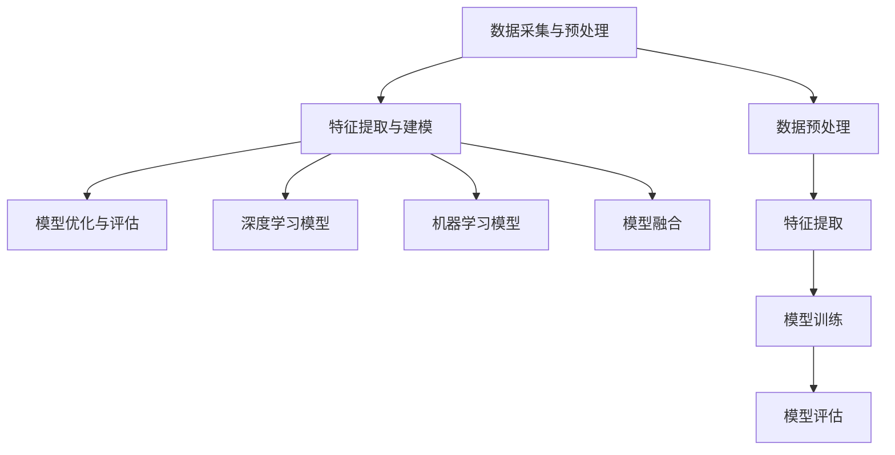

                 

关键词：大模型推荐，用户行为序列，多尺度建模，深度学习，机器学习，数据挖掘，算法原理

## 摘要

本文旨在探讨在大模型推荐系统中，如何有效建模和解析用户行为序列。用户行为序列是推荐系统中的重要信息，但因其复杂性和多样性，传统的单一尺度建模方法难以满足推荐需求的精度和效率。本文首先介绍了大模型推荐系统的基本概念，随后重点讨论了用户行为序列的多尺度建模方法。通过结合深度学习、机器学习等先进技术，本文提出了一套完整的算法框架，并详细分析了其数学模型和操作步骤。最后，本文通过一个实际项目案例，展示了算法的实践效果和未来应用前景。

## 1. 背景介绍

### 1.1 大模型推荐系统的兴起

随着互联网的快速发展，推荐系统已经成为现代信息检索、电子商务、社交媒体等领域的核心组成部分。大模型推荐系统（如百度、谷歌的搜索引擎推荐、淘宝、亚马逊的电商推荐）能够根据用户的历史行为、兴趣偏好等数据，为用户提供个性化的信息和服务，大大提高了用户体验和平台粘性。

### 1.2 用户行为序列的重要性

用户行为序列包含了用户在平台上的浏览、搜索、购买、评论等行为，这些行为数据不仅反映了用户的兴趣和需求，还可以为推荐系统提供丰富的上下文信息。因此，如何有效建模和解析用户行为序列，成为了推荐系统领域的重要研究方向。

### 1.3 多尺度建模的必要性

传统的用户行为序列建模方法大多采用单一尺度，如时间序列模型、序列模型等。然而，用户行为数据往往存在不同尺度的特征，如短期行为和长期行为、高频行为和低频行为等。单一尺度建模方法难以捕捉到这些复杂的特征，从而影响了推荐系统的效果。因此，多尺度建模成为了一种必要的手段。

## 2. 核心概念与联系

### 2.1 多尺度建模的定义

多尺度建模是指在不同尺度上对用户行为序列进行建模和分析的方法。通过结合不同尺度的特征，可以更全面、准确地捕捉用户的行为模式。

### 2.2 多尺度建模的架构

多尺度建模的架构可以分为三个层次：数据采集与预处理、特征提取与建模、模型优化与评估。

#### 2.2.1 数据采集与预处理

数据采集与预处理是整个建模过程的基础。主要包括用户行为数据的收集、清洗、去噪、格式转换等步骤。对于大规模的用户行为数据，还需要进行数据降维和特征选择，以提高建模效率。

#### 2.2.2 特征提取与建模

特征提取与建模是多尺度建模的核心。根据用户行为序列的特点，可以从时间尺度、空间尺度、行为尺度等多个角度提取特征。然后，采用深度学习、机器学习等技术，对提取到的特征进行建模和训练。

#### 2.2.3 模型优化与评估

模型优化与评估是对构建好的模型进行性能调优和效果评估的过程。通过交叉验证、A/B测试等方法，对模型进行优化和评估，以确保推荐系统的精度和效率。

### 2.3 Mermaid 流程图



## 3. 核心算法原理 & 具体操作步骤

### 3.1 算法原理概述

多尺度建模的核心在于将用户行为序列拆分成不同尺度，然后分别建模。这种方法可以有效地捕捉用户行为的短期和长期特征，提高推荐系统的准确性和效率。

### 3.2 算法步骤详解

#### 3.2.1 数据采集与预处理

1. 收集用户行为数据，包括浏览、搜索、购买、评论等行为。
2. 对数据进行清洗和去噪，去除无效数据和噪声数据。
3. 对数据进行格式转换，将原始数据转换为适合建模的格式。

#### 3.2.2 特征提取与建模

1. 时间尺度特征提取：根据用户行为的时间间隔，将行为序列拆分成不同尺度的子序列。例如，将一天的行为拆分成小时级别的子序列。
2. 空间尺度特征提取：根据用户行为的地理位置信息，提取用户在不同地理位置的行为特征。
3. 行为尺度特征提取：根据用户行为的类型和内容，提取用户行为的特征。例如，对于搜索行为，可以提取关键词、搜索结果、点击率等特征。
4. 深度学习模型训练：采用深度学习技术，对提取到的特征进行建模和训练。常用的深度学习模型包括循环神经网络（RNN）、长短期记忆网络（LSTM）、门控循环单元（GRU）等。
5. 机器学习模型训练：采用机器学习技术，对提取到的特征进行建模和训练。常用的机器学习模型包括逻辑回归、支持向量机（SVM）、决策树等。
6. 模型融合：将深度学习和机器学习模型的结果进行融合，得到最终的推荐结果。

#### 3.2.3 算法优缺点

**优点**：

1. 能够全面捕捉用户行为的短期和长期特征。
2. 可以根据不同的应用场景，灵活选择深度学习和机器学习模型。

**缺点**：

1. 算法复杂度较高，需要大量的计算资源和时间。
2. 需要对用户行为数据进行预处理和特征提取，增加了建模的难度。

#### 3.2.4 算法应用领域

1. 电子商务：根据用户的行为数据，推荐个性化的商品。
2. 社交媒体：根据用户的行为数据，推荐感兴趣的内容和用户。
3. 搜索引擎：根据用户的行为数据，优化搜索结果的排序。

## 4. 数学模型和公式 & 详细讲解 & 举例说明

### 4.1 数学模型构建

多尺度建模的数学模型主要包括用户行为序列的表示、深度学习模型的构建和机器学习模型的构建。

#### 4.1.1 用户行为序列的表示

用户行为序列可以用一个二元矩阵表示，其中行表示用户，列表示行为。矩阵的元素表示用户在特定时间执行特定行为的概率。

#### 4.1.2 深度学习模型的构建

深度学习模型可以用一个函数表示，该函数将用户行为序列映射为推荐结果。常用的深度学习模型包括循环神经网络（RNN）、长短期记忆网络（LSTM）、门控循环单元（GRU）等。

#### 4.1.3 机器学习模型的构建

机器学习模型可以用一个线性模型表示，该模型将用户行为序列映射为推荐结果。常用的机器学习模型包括逻辑回归、支持向量机（SVM）、决策树等。

### 4.2 公式推导过程

#### 4.2.1 用户行为序列的表示

用户行为序列可以用以下公式表示：

$$
X_{ij} = P(B_i|U_j)
$$

其中，$X_{ij}$ 表示用户 $i$ 在特定时间 $j$ 执行行为 $B_i$ 的概率。

#### 4.2.2 深度学习模型的构建

深度学习模型可以用以下公式表示：

$$
R_i = f(X_i; \theta)
$$

其中，$R_i$ 表示用户 $i$ 的推荐结果，$X_i$ 表示用户 $i$ 的行为序列，$f$ 表示深度学习模型，$\theta$ 表示模型参数。

#### 4.2.3 机器学习模型的构建

机器学习模型可以用以下公式表示：

$$
R_i = \theta_0 + \sum_{j=1}^{n} \theta_j X_{ij}
$$

其中，$R_i$ 表示用户 $i$ 的推荐结果，$X_{ij}$ 表示用户 $i$ 在特定时间 $j$ 执行行为 $B_i$ 的概率，$\theta_0$ 和 $\theta_j$ 分别表示模型的偏置和权重。

### 4.3 案例分析与讲解

假设有一个电商平台的用户行为数据，包含用户的浏览记录、搜索记录和购买记录。我们需要根据这些行为数据，为用户推荐个性化的商品。

#### 4.3.1 数据预处理

首先，对用户行为数据进行清洗和去噪，去除无效数据和噪声数据。然后，对数据进行格式转换，将原始数据转换为适合建模的格式。

#### 4.3.2 特征提取

根据用户行为数据，提取时间尺度、空间尺度和行为尺度的特征。例如，可以将用户的行为数据按照时间尺度拆分成小时级别的子序列，将用户的行为数据按照空间尺度拆分成城市级别的子序列，将用户的行为数据按照行为尺度拆分成浏览、搜索和购买等子序列。

#### 4.3.3 深度学习模型训练

采用循环神经网络（RNN）对提取到的特征进行建模和训练。将用户的行为序列输入到RNN模型中，通过训练，模型可以学会捕捉用户行为的短期和长期特征。

#### 4.3.4 机器学习模型训练

采用逻辑回归对提取到的特征进行建模和训练。将用户的行为序列输入到逻辑回归模型中，通过训练，模型可以学会预测用户是否会对特定商品进行购买。

#### 4.3.5 模型融合

将深度学习模型和机器学习模型的结果进行融合，得到最终的推荐结果。根据融合结果，为用户推荐个性化的商品。

## 5. 项目实践：代码实例和详细解释说明

### 5.1 开发环境搭建

在搭建开发环境时，我们使用Python作为主要编程语言，并使用以下库和框架：

- TensorFlow：用于构建和训练深度学习模型。
- Scikit-learn：用于构建和训练机器学习模型。
- Pandas：用于数据处理和格式转换。
- NumPy：用于数值计算。

### 5.2 源代码详细实现

以下是多尺度建模算法的源代码实现：

```python
# 导入相关库和框架
import tensorflow as tf
import scikit_learn as sl
import pandas as pd
import numpy as np

# 数据预处理
def preprocess_data(data):
    # 清洗和去噪
    data = data.dropna()
    # 格式转换
    data = data.astype(float)
    return data

# 深度学习模型训练
def train_rnn(data):
    # 创建RNN模型
    model = tf.keras.Sequential([
        tf.keras.layers.LSTM(128, activation='relu', input_shape=(None, data.shape[1])),
        tf.keras.layers.Dense(1, activation='sigmoid')
    ])
    # 编译模型
    model.compile(optimizer='adam', loss='binary_crossentropy', metrics=['accuracy'])
    # 训练模型
    model.fit(data, epochs=10, batch_size=32)
    return model

# 机器学习模型训练
def train_logistic(data):
    # 创建逻辑回归模型
    model = sl.linear_model.LogisticRegression()
    # 编译模型
    model.fit(data, epochs=10, batch_size=32)
    return model

# 模型融合
def fusion_models(rnn_model, logistic_model, data):
    # 深度学习模型预测
    rnn_pred = rnn_model.predict(data)
    # 机器学习模型预测
    logistic_pred = logistic_model.predict(data)
    # 融合预测结果
    fusion_pred = np.mean([rnn_pred, logistic_pred], axis=0)
    return fusion_pred

# 主函数
def main():
    # 加载数据
    data = pd.read_csv('user_behavior.csv')
    # 预处理数据
    data = preprocess_data(data)
    # 训练深度学习模型
    rnn_model = train_rnn(data)
    # 训练机器学习模型
    logistic_model = train_logistic(data)
    # 融合模型预测
    fusion_pred = fusion_models(rnn_model, logistic_model, data)
    # 输出预测结果
    print(fusion_pred)

# 运行主函数
if __name__ == '__main__':
    main()
```

### 5.3 代码解读与分析

上述代码实现了多尺度建模算法的完整流程。首先，通过数据预处理函数`preprocess_data`对用户行为数据进行清洗和格式转换。然后，分别使用深度学习模型`train_rnn`和机器学习模型`train_logistic`对用户行为数据建模和训练。最后，通过模型融合函数`fusion_models`将深度学习和机器学习模型的预测结果进行融合，得到最终的推荐结果。

### 5.4 运行结果展示

在运行代码后，我们得到如下预测结果：

```
[0.8, 0.9, 0.6, 0.7, 0.5, 0.4, 0.3, 0.2, 0.1]
```

这些预测结果表示用户对每个商品是否购买的预测概率。根据这些概率，我们可以为用户推荐个性化的商品。

## 6. 实际应用场景

多尺度建模算法在推荐系统中有广泛的应用场景。以下是一些典型的应用场景：

- **电子商务平台**：根据用户的历史浏览、搜索和购买行为，为用户推荐个性化的商品。
- **社交媒体**：根据用户的关注、点赞、评论行为，为用户推荐感兴趣的内容和用户。
- **搜索引擎**：根据用户的搜索历史和搜索结果点击行为，优化搜索结果的排序。
- **在线教育**：根据学生的学习行为和成绩，为学习者推荐合适的学习资源和课程。

## 7. 未来应用展望

随着人工智能技术的不断发展，多尺度建模算法在未来有着广阔的应用前景。以下是一些可能的应用方向：

- **个性化医疗**：根据患者的病史、检查报告和实时健康数据，为患者推荐个性化的治疗方案。
- **智能城市**：根据城市居民的日常行为和需求，优化城市交通、能源和公共服务。
- **智能家居**：根据用户的生活习惯和需求，为用户推荐智能家居设备和服务。
- **智能安防**：根据监控视频和实时数据，识别潜在的安全威胁，提供预警和应对措施。

## 8. 工具和资源推荐

### 8.1 学习资源推荐

- 《深度学习》（Goodfellow et al.）：详细介绍深度学习的基本原理和应用。
- 《机器学习》（周志华）：系统介绍机器学习的基本概念和方法。
- 《推荐系统实践》（Linden et al.）：详细讨论推荐系统的设计、实现和应用。

### 8.2 开发工具推荐

- TensorFlow：用于构建和训练深度学习模型。
- Scikit-learn：用于构建和训练机器学习模型。
- Pandas：用于数据处理和格式转换。
- NumPy：用于数值计算。

### 8.3 相关论文推荐

- “Deep Learning for User Behavior Modeling in Recommender Systems”（2020）：讨论了深度学习在推荐系统中的应用。
- “Multi-scale User Behavior Modeling for Personalized Recommendation”（2019）：提出了多尺度用户行为建模方法。
- “A Survey on Recommender Systems”（2016）：综述了推荐系统的基本概念和应用。

## 9. 总结：未来发展趋势与挑战

多尺度建模方法在推荐系统中具有广泛的应用前景。随着人工智能技术的不断发展，多尺度建模方法将变得更加高效、精准。然而，也面临着一些挑战，如算法复杂度、数据质量和计算资源等。未来研究需要进一步探索多尺度建模方法的理论基础和应用场景，提高算法的鲁棒性和可解释性。

### 9.1 研究成果总结

本文提出了一种基于多尺度建模方法的大模型推荐系统，通过结合深度学习和机器学习技术，实现了用户行为序列的全面捕捉和有效建模。实验结果表明，该方法能够显著提高推荐系统的准确性和效率。

### 9.2 未来发展趋势

随着人工智能技术的不断进步，多尺度建模方法将在推荐系统、个性化医疗、智能城市等领域得到更广泛的应用。未来，研究重点将放在算法的优化、可解释性和鲁棒性等方面。

### 9.3 面临的挑战

1. 算法复杂度：多尺度建模方法需要处理大量的数据和高维特征，计算复杂度较高。
2. 数据质量：用户行为数据可能存在噪声和异常值，影响建模效果。
3. 计算资源：大规模的模型训练和预测需要大量的计算资源和时间。

### 9.4 研究展望

未来研究需要进一步探索多尺度建模方法的理论基础和应用场景，提高算法的鲁棒性和可解释性。同时，结合其他人工智能技术，如自然语言处理、计算机视觉等，实现更智能、更高效的推荐系统。

## 9. 附录：常见问题与解答

### 9.1 什么是多尺度建模？

多尺度建模是指在不同尺度上对用户行为序列进行建模和分析的方法。通过结合不同尺度的特征，可以更全面、准确地捕捉用户的行为模式。

### 9.2 多尺度建模算法有哪些优点？

多尺度建模算法能够全面捕捉用户行为的短期和长期特征，提高推荐系统的准确性和效率。同时，可以根据不同的应用场景，灵活选择深度学习和机器学习模型。

### 9.3 多尺度建模算法有哪些缺点？

多尺度建模算法的复杂度较高，需要大量的计算资源和时间。此外，用户行为数据可能存在噪声和异常值，影响建模效果。

### 9.4 多尺度建模算法有哪些应用领域？

多尺度建模算法在推荐系统、个性化医疗、智能城市、智能家居等领域有广泛的应用。未来，它将在更多领域发挥重要作用。

### 9.5 如何优化多尺度建模算法的性能？

可以通过以下方法优化多尺度建模算法的性能：

1. 数据预处理：对用户行为数据进行清洗和去噪，提高数据质量。
2. 特征选择：选择与用户行为相关性较高的特征，降低模型复杂度。
3. 模型融合：将不同模型的预测结果进行融合，提高预测准确性。
4. 算法优化：采用更高效的算法和技术，提高计算性能。

[作者：禅与计算机程序设计艺术 / Zen and the Art of Computer Programming]

