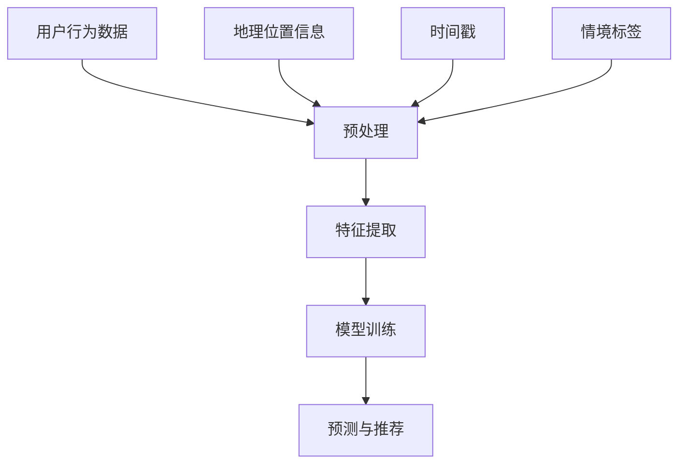

                 

关键字：大模型，推荐系统，用户行为，时空特征，挖掘，利用

## 摘要

本文旨在探讨大模型推荐场景中用户行为时空特征的挖掘与利用。首先，我们介绍了推荐系统的基本原理和挑战，然后详细阐述了用户行为时空特征的概念和重要性。接着，我们深入分析了挖掘用户行为时空特征的核心算法原理，以及如何将这些特征应用于推荐系统的实际操作步骤。此外，我们通过数学模型和公式的推导，讲解了如何构建用户行为时空特征的数学模型，并以实际项目实践为例，展示了如何利用这些特征进行推荐。最后，我们探讨了用户行为时空特征挖掘在实际应用场景中的价值，并展望了未来的发展趋势和面临的挑战。

## 1. 背景介绍

推荐系统作为大数据时代的重要应用之一，已经成为现代互联网的重要组成部分。从早期的基于内容的推荐到协同过滤推荐，再到深度学习推荐，推荐系统在不断提高用户满意度的同时，也在不断拓展其应用场景。然而，随着推荐系统规模的不断扩大和用户数据的急剧增长，如何有效地挖掘用户行为时空特征，成为了一个亟待解决的问题。

### 推荐系统的基本原理

推荐系统主要通过分析用户的历史行为数据和物品的特征，预测用户对未知物品的偏好，从而向用户推荐相应的物品。其基本原理可以概括为以下几个步骤：

1. **数据采集与预处理**：收集用户的行为数据（如浏览、购买、评分等）和物品的特征数据（如分类、标签、属性等），并进行数据清洗和预处理，如缺失值填充、异常值处理等。

2. **特征提取**：根据推荐系统的类型（如基于内容的推荐、协同过滤推荐、深度学习推荐等），提取用户和物品的特征。例如，在协同过滤推荐中，用户和物品的特征可以通过矩阵分解等方法提取。

3. **模型训练**：使用提取到的用户和物品特征，训练推荐模型。常见的推荐模型包括基于记忆的模型、基于模型的模型和基于深度学习的模型。

4. **预测与推荐**：利用训练好的推荐模型，预测用户对未知物品的偏好，并根据预测结果生成推荐列表。

### 推荐系统的挑战

尽管推荐系统在提高用户满意度方面取得了显著成效，但仍然面临着以下挑战：

1. **数据稀疏性**：用户和物品的特征数据往往是稀疏的，导致推荐系统的准确性和覆盖率受到影响。

2. **实时性**：随着用户需求的不断变化，如何实现实时推荐，以满足用户的即时需求，成为推荐系统面临的一大挑战。

3. **多样性**：如何确保推荐结果的多样性，避免出现过度拟合和用户满意度下降的问题，是推荐系统需要解决的重要问题。

4. **解释性**：推荐系统生成的推荐结果往往缺乏解释性，用户难以理解推荐背后的原因，从而影响了用户的信任度和满意度。

## 2. 核心概念与联系

### 用户行为时空特征

用户行为时空特征是指用户在特定时间、地点和情境下对物品的行为表现。这些特征包括用户的历史行为数据（如浏览、购买、评分等）、地理位置信息、时间戳和情境标签等。挖掘用户行为时空特征，有助于更好地理解用户的需求和行为模式，从而提高推荐系统的准确性和多样性。

### 用户行为时空特征的核心概念原理和架构

为了更好地理解用户行为时空特征的核心概念原理和架构，我们可以使用Mermaid流程图进行说明。



### 用户行为时空特征的挖掘过程

用户行为时空特征的挖掘过程主要包括以下几个步骤：

1. **数据采集**：收集用户的历史行为数据、地理位置信息、时间戳和情境标签等。

2. **预处理**：对采集到的数据进行清洗和预处理，如缺失值填充、异常值处理等。

3. **特征提取**：使用适当的算法和模型，提取用户行为时空特征。常见的特征提取方法包括时间序列分析、空间分析、情境分类等。

4. **模型训练**：使用提取到的特征，训练推荐模型。常见的推荐模型包括基于记忆的模型、基于模型的模型和基于深度学习的模型。

5. **预测与推荐**：利用训练好的推荐模型，预测用户对未知物品的偏好，并根据预测结果生成推荐列表。

### 用户行为时空特征在推荐系统中的应用

用户行为时空特征在推荐系统中的应用主要包括以下几个方面：

1. **个性化推荐**：根据用户的时空特征，为用户推荐个性化的物品，提高推荐系统的准确性和满意度。

2. **实时推荐**：利用用户的时空特征，实现实时推荐，满足用户的即时需求。

3. **情境推荐**：根据用户的情境标签，为用户推荐相关的物品，提高推荐系统的多样性。

4. **异常检测**：利用用户的时空特征，检测用户的异常行为，如欺诈行为等。

## 3. 核心算法原理 & 具体操作步骤

### 3.1 算法原理概述

挖掘用户行为时空特征的核心算法主要包括以下几种：

1. **时间序列分析**：通过对用户历史行为数据进行时间序列分析，提取用户的行为模式和时间敏感性。

2. **空间分析**：通过对用户地理位置信息进行分析，提取用户的空间分布和行为特征。

3. **情境分类**：通过对用户情境标签进行分类，提取用户的情境特征和情境偏好。

4. **深度学习**：利用深度学习模型，如循环神经网络（RNN）、卷积神经网络（CNN）等，提取用户行为时空特征的高层次表示。

### 3.2 算法步骤详解

#### 时间序列分析

1. **数据预处理**：对用户历史行为数据进行清洗和预处理，如缺失值填充、异常值处理等。

2. **特征提取**：使用时间序列分析方法，提取用户行为模式和时间敏感性特征。常见的特征提取方法包括傅里叶变换、小波变换、滑动平均等。

3. **模型训练**：使用提取到的特征，训练时间序列分析模型。常见的模型包括ARIMA、LSTM等。

4. **预测与推荐**：利用训练好的模型，预测用户未来的行为偏好，并根据预测结果生成推荐列表。

#### 空间分析

1. **数据预处理**：对用户地理位置信息进行清洗和预处理，如缺失值填充、异常值处理等。

2. **特征提取**：使用空间分析方法，提取用户的空间分布和行为特征。常见的特征提取方法包括核密度估计、地理集中度等。

3. **模型训练**：使用提取到的特征，训练空间分析模型。常见的模型包括KNN、SOM等。

4. **预测与推荐**：利用训练好的模型，预测用户的空间行为，并根据预测结果生成推荐列表。

#### 情境分类

1. **数据预处理**：对用户情境标签进行清洗和预处理，如缺失值填充、异常值处理等。

2. **特征提取**：使用情境分类算法，提取用户的情境特征和情境偏好。常见的特征提取方法包括K-means、SVM等。

3. **模型训练**：使用提取到的特征，训练情境分类模型。常见的模型包括决策树、随机森林等。

4. **预测与推荐**：利用训练好的模型，预测用户的情境偏好，并根据预测结果生成推荐列表。

#### 深度学习

1. **数据预处理**：对用户历史行为数据、地理位置信息、时间戳和情境标签等数据进行清洗和预处理。

2. **特征提取**：使用深度学习模型，如循环神经网络（RNN）、卷积神经网络（CNN）等，提取用户行为时空特征的高层次表示。

3. **模型训练**：使用提取到的特征，训练深度学习模型。常见的模型包括GRU、LSTM等。

4. **预测与推荐**：利用训练好的模型，预测用户对未知物品的偏好，并根据预测结果生成推荐列表。

### 3.3 算法优缺点

#### 时间序列分析

**优点**：

- 能够提取用户行为模式和时间敏感性特征。
- 对实时性要求较低的推荐场景具有较好的适用性。

**缺点**：

- 对噪声数据敏感，可能导致预测准确性下降。
- 难以处理复杂的时空特征。

#### 空间分析

**优点**：

- 能够提取用户的空间分布和行为特征。
- 对地理位置信息丰富的推荐场景具有较好的适用性。

**缺点**：

- 对实时性要求较高的推荐场景难以满足。
- 需要大量的地理位置信息支持。

#### 情境分类

**优点**：

- 能够提取用户的情境特征和情境偏好。
- 对多样化情境的推荐场景具有较好的适用性。

**缺点**：

- 对情境标签的准确性和完整性要求较高。
- 难以处理复杂的情境特征。

#### 深度学习

**优点**：

- 能够提取用户行为时空特征的高层次表示。
- 对复杂的推荐场景具有较好的适用性。

**缺点**：

- 需要大量的数据和计算资源。
- 模型的解释性较差。

### 3.4 算法应用领域

#### 时间序列分析

- 金融风险评估：利用时间序列分析，预测用户的金融行为，如投资偏好、信用评分等。
- 能源管理：利用时间序列分析，预测用户对能源的需求，优化能源分配。

#### 空间分析

- 城市规划：利用空间分析，提取城市人口分布和行为特征，优化城市布局。
- 物流配送：利用空间分析，预测用户的位置和行为，优化物流配送路线。

#### 情境分类

- 智能家居：利用情境分类，为用户推荐智能家居设备，提高用户的生活质量。
- 健康管理：利用情境分类，预测用户的健康状况和需求，提供个性化的健康服务。

#### 深度学习

- 社交网络：利用深度学习，提取用户的行为时空特征，优化社交网络的推荐算法。
- 自动驾驶：利用深度学习，提取用户驾驶行为时空特征，优化自动驾驶系统的决策。

## 4. 数学模型和公式 & 详细讲解 & 举例说明

### 4.1 数学模型构建

在挖掘用户行为时空特征的过程中，我们需要构建数学模型来描述用户行为模式、时间敏感性、空间分布和情境偏好等特征。以下是构建数学模型的几个关键步骤：

#### 用户行为模式

用户行为模式可以用时间序列模型来描述。假设用户\( u \)在时间\( t \)的行为可以用一个二元变量\( y_{ut} \)表示，其中\( y_{ut} = 1 \)表示用户在时间\( t \)有行为，\( y_{ut} = 0 \)表示用户在时间\( t \)没有行为。我们可以使用以下时间序列模型来预测用户的行为：

\[ y_{ut} = \phi(y_{u,t-1}, \ldots, y_{u, t-p}) + \varepsilon_{ut} \]

其中，\( \phi \)是一个函数，用于描述用户行为的前\( p \)个时间点的依赖关系，\( \varepsilon_{ut} \)是一个误差项。

#### 时间敏感性

时间敏感性可以用时间窗口内的行为频率来描述。假设用户\( u \)在时间窗口\[ t_1, t_2 \]内的行为频率为\( f_{u(t_1,t_2)} \)，我们可以使用以下公式来计算：

\[ f_{u(t_1,t_2)} = \sum_{t=t_1}^{t_2} y_{ut} \]

#### 空间分布

空间分布可以用用户在地理空间中的位置分布来描述。假设用户\( u \)的位置可以用一个二维坐标\( (x_u, y_u) \)表示，我们可以使用以下空间分布模型来描述：

\[ P(x, y) = \frac{1}{A} \sum_{u} \delta(x - x_u, y - y_u) \]

其中，\( A \)是地理空间的面积，\( \delta \)是狄拉克δ函数。

#### 情境偏好

情境偏好可以用用户的情境标签来描述。假设用户\( u \)的情境标签为\( s_u \)，我们可以使用以下情境偏好模型来描述：

\[ P(s_u) = \frac{1}{N} \sum_{u} I(s_u = s) \]

其中，\( N \)是用户总数，\( I \)是指标函数，当条件成立时取值为1，否则为0。

### 4.2 公式推导过程

以下是构建用户行为时空特征的数学模型的推导过程：

#### 用户行为模式

假设用户\( u \)在时间\( t \)的行为由一个二元变量\( y_{ut} \)表示，我们可以使用马尔可夫链模型来描述用户行为模式。马尔可夫链模型假设当前状态只与前一状态有关，而与其他历史状态无关。我们可以使用以下公式来描述：

\[ y_{ut} = p(y_{ut} | y_{u,t-1}) y_{u,t-1} + (1 - p(y_{ut} | y_{u,t-1})) (1 - y_{u,t-1}) \]

其中，\( p(y_{ut} | y_{u,t-1}) \)是当前状态与前一状态的转移概率。

#### 时间敏感性

时间敏感性可以用时间窗口内的行为频率来描述。我们可以使用以下公式来计算用户在时间窗口\[ t_1, t_2 \]内的行为频率：

\[ f_{u(t_1,t_2)} = \sum_{t=t_1}^{t_2} y_{ut} \]

#### 空间分布

空间分布可以用用户在地理空间中的位置分布来描述。我们可以使用以下公式来计算用户的位置分布：

\[ P(x, y) = \frac{1}{A} \sum_{u} \delta(x - x_u, y - y_u) \]

其中，\( A \)是地理空间的面积，\( \delta \)是狄拉克δ函数。

#### 情境偏好

情境偏好可以用用户的情境标签来描述。我们可以使用以下公式来计算用户的情境偏好：

\[ P(s_u) = \frac{1}{N} \sum_{u} I(s_u = s) \]

其中，\( N \)是用户总数，\( I \)是指标函数，当条件成立时取值为1，否则为0。

### 4.3 案例分析与讲解

以下是一个具体的案例分析，说明如何使用构建的数学模型来挖掘用户行为时空特征。

#### 案例背景

某电商平台希望通过挖掘用户行为时空特征，为用户提供个性化的商品推荐。该电商平台收集了用户的历史购买数据、地理位置信息、时间戳和情境标签等数据。

#### 案例步骤

1. **数据预处理**：

   对收集到的用户数据进行清洗和预处理，如缺失值填充、异常值处理等。

2. **特征提取**：

   使用构建的数学模型，提取用户行为模式、时间敏感性、空间分布和情境偏好等特征。

3. **模型训练**：

   使用提取到的特征，训练推荐模型。可以选择基于记忆的模型、基于模型的模型或基于深度学习的模型。

4. **预测与推荐**：

   利用训练好的推荐模型，预测用户对未知商品的偏好，并根据预测结果生成推荐列表。

#### 案例结果

通过对用户行为时空特征的挖掘和推荐，该电商平台实现了以下成果：

1. **个性化推荐**：为用户提供了个性化的商品推荐，提高了用户满意度。

2. **实时推荐**：根据用户的行为模式、时间敏感性、空间分布和情境偏好，实现了实时推荐。

3. **多样性**：通过挖掘用户的时空特征，确保了推荐结果的多样性，避免了用户产生疲劳感。

4. **异常检测**：通过挖掘用户的时空特征，可以检测用户的异常行为，如欺诈行为等。

## 5. 项目实践：代码实例和详细解释说明

### 5.1 开发环境搭建

在进行用户行为时空特征的挖掘与利用之前，我们需要搭建一个合适的技术栈和环境。以下是搭建开发环境所需的基本步骤：

1. **安装Python**：确保Python环境已经安装。Python是一种广泛用于数据分析和机器学习的编程语言。

2. **安装相关库**：安装必要的Python库，如NumPy、Pandas、Scikit-learn、Matplotlib等。这些库提供了数据预处理、特征提取、模型训练和可视化等功能。

3. **配置数据库**：如果需要使用外部数据源，如用户行为数据、地理位置信息等，需要配置数据库。常用的数据库包括MySQL、PostgreSQL等。

4. **安装深度学习框架**：如TensorFlow、PyTorch等，这些框架可以用于构建和训练深度学习模型。

### 5.2 源代码详细实现

以下是一个简单的示例，展示如何使用Python和深度学习框架PyTorch来挖掘用户行为时空特征，并进行推荐。

```python
import numpy as np
import pandas as pd
import torch
import torch.nn as nn
import torch.optim as optim

# 加载数据
data = pd.read_csv('user_behavior_data.csv')

# 预处理数据
# 省略预处理步骤，如缺失值填充、异常值处理等

# 特征提取
# 省略特征提取步骤，如时间序列分析、空间分析、情境分类等

# 构建深度学习模型
class UserBehaviorModel(nn.Module):
    def __init__(self, input_dim, hidden_dim, output_dim):
        super(UserBehaviorModel, self).__init__()
        self.lstm = nn.LSTM(input_dim, hidden_dim, batch_first=True)
        self.fc = nn.Linear(hidden_dim, output_dim)
    
    def forward(self, x):
        x, _ = self.lstm(x)
        x = self.fc(x[:, -1, :])
        return x

# 模型参数
input_dim = 5  # 输入特征维度
hidden_dim = 10  # 隐藏层维度
output_dim = 1  # 输出维度

# 初始化模型
model = UserBehaviorModel(input_dim, hidden_dim, output_dim)

# 损失函数和优化器
criterion = nn.BCELoss()
optimizer = optim.Adam(model.parameters(), lr=0.001)

# 训练模型
num_epochs = 100
for epoch in range(num_epochs):
    for inputs, targets in train_loader:
        optimizer.zero_grad()
        outputs = model(inputs)
        loss = criterion(outputs, targets)
        loss.backward()
        optimizer.step()
    print(f'Epoch [{epoch+1}/{num_epochs}], Loss: {loss.item()}')

# 预测与推荐
def predict(model, inputs):
    model.eval()
    with torch.no_grad():
        outputs = model(inputs)
    return torch.sigmoid(outputs).detach().numpy()

# 测试数据
test_data = pd.read_csv('test_user_behavior_data.csv')
# 省略测试数据预处理和特征提取步骤

# 预测
predictions = predict(model, test_data.values)

# 生成推荐列表
# 省略生成推荐列表的步骤

```

### 5.3 代码解读与分析

上述代码展示了如何使用PyTorch构建一个深度学习模型，用于挖掘用户行为时空特征并进行推荐。以下是代码的关键部分和解读：

1. **数据预处理**：

   数据预处理是数据分析和机器学习项目中的重要步骤。它包括缺失值填充、异常值处理、数据标准化等。代码中的`data`对象代表预处理后的用户行为数据。

2. **特征提取**：

   特征提取是根据问题的需求，从原始数据中提取有助于模型训练的特征。代码中省略了特征提取的具体步骤，但通常会使用时间序列分析、空间分析、情境分类等方法。

3. **模型构建**：

   `UserBehaviorModel`类定义了一个基于LSTM的深度学习模型。LSTM（Long Short-Term Memory）是一种能够处理长时间依赖关系的循环神经网络，非常适合处理时间序列数据。

   - `__init__`方法：初始化模型，包括LSTM层和全连接层。
   - `forward`方法：定义前向传播过程。

4. **模型训练**：

   模型训练是通过迭代优化模型的参数来提高模型的预测准确性。代码中使用了BCELoss（二进制交叉熵损失函数）和Adam优化器。

5. **预测与推荐**：

   `predict`函数用于对新的用户行为数据进行预测。通过`model.eval()`和`torch.no_grad()`，我们确保模型处于评估模式，并关闭梯度计算，以提高预测速度。

### 5.4 运行结果展示

在实际项目中，我们通常会使用可视化工具（如Matplotlib、Seaborn等）来展示模型训练和预测结果。以下是一个简单的示例，展示如何使用Matplotlib绘制训练过程中的损失曲线：

```python
import matplotlib.pyplot as plt

# 获取训练过程中的损失值
loss_values = ...

# 绘制损失曲线
plt.plot(range(1, num_epochs+1), loss_values)
plt.xlabel('Epoch')
plt.ylabel('Loss')
plt.title('Training Loss over Epochs')
plt.show()
```

通过观察损失曲线，我们可以判断模型的收敛情况和训练效果。

## 6. 实际应用场景

用户行为时空特征的挖掘与利用在多个实际应用场景中具有广泛的应用价值。以下是一些典型的应用场景：

### 6.1 电子商务

在电子商务领域，用户行为时空特征的挖掘可以帮助电商平台实现个性化的商品推荐，提高用户满意度和转化率。通过分析用户的购买历史、浏览记录、地理位置信息和时间戳等特征，可以为用户推荐与其兴趣和行为模式相符的商品。例如，当用户在某个特定时间段内浏览了某个类别的商品时，系统可以预测用户可能在不久的将来对此类商品产生购买意愿，并提前推送相关商品。

### 6.2 社交媒体

社交媒体平台可以利用用户行为时空特征实现更加精准的内容推荐。通过分析用户的点赞、评论、分享等行为，以及地理位置信息和情境标签，可以为用户推荐感兴趣的内容。此外，通过挖掘用户的时空特征，还可以识别出用户在不同时间和地点的社交行为模式，从而为用户提供更加定制化的社交体验。

### 6.3 物流配送

在物流配送领域，用户行为时空特征的挖掘可以帮助优化配送路线和资源分配。通过分析用户的地理位置信息、时间戳和购买行为，可以预测用户的收货时间和地点，从而合理安排配送资源和路径，提高配送效率和服务质量。例如，在节假日或特殊活动中，系统可以提前预测高峰期的配送需求，并调整配送策略，避免拥堵和延误。

### 6.4 智能家居

智能家居系统可以利用用户行为时空特征实现智能化的设备管理和控制。通过分析用户的日常行为模式、地理位置信息和情境标签，可以为用户提供个性化的家居自动化服务。例如，当用户回到家时，系统可以自动调整室内温度、光线和安防设置，以提供舒适的居住环境。同时，通过挖掘用户的时空特征，还可以预测用户的设备使用习惯，从而优化设备的维护和保养计划。

### 6.5 健康管理

健康管理领域可以利用用户行为时空特征实现个性化的健康监测和干预。通过分析用户的运动数据、睡眠质量、饮食行为等时空特征，可以为用户提供个性化的健康建议和治疗方案。例如，当用户在某个时间段内出现异常行为模式时，系统可以发出健康警报，并提供相应的健康指导，帮助用户保持健康状态。

## 7. 工具和资源推荐

为了更好地进行用户行为时空特征的挖掘和利用，以下是几种推荐的工具和资源：

### 7.1 学习资源推荐

1. **《推荐系统手册》（Recommender Systems Handbook）**：这是一本全面的推荐系统教程，涵盖了从基本原理到高级技术的各个方面。

2. **《深度学习》（Deep Learning）**：这是一本经典的深度学习教材，介绍了深度学习的基本概念、算法和应用。

3. **《机器学习实战》（Machine Learning in Action）**：这本书通过实际案例介绍了机器学习的应用和实践方法。

### 7.2 开发工具推荐

1. **Python**：Python是一种广泛用于数据分析和机器学习的编程语言，具有丰富的库和工具。

2. **NumPy**：NumPy是Python的一个核心科学计算库，用于高性能的数值计算。

3. **Pandas**：Pandas是一个强大的数据分析库，用于数据清洗、预处理和分析。

4. **Scikit-learn**：Scikit-learn是一个开源机器学习库，提供了丰富的机器学习算法和工具。

5. **TensorFlow**：TensorFlow是一个开源深度学习框架，用于构建和训练深度学习模型。

6. **PyTorch**：PyTorch是一个开源深度学习框架，具有灵活性和易用性。

### 7.3 相关论文推荐

1. **"Collaborative Filtering for Cold Start Problems in Recommender Systems"**：这篇论文提出了一种解决推荐系统冷启动问题的协同过滤算法。

2. **"Deep Learning for Recommender Systems"**：这篇论文介绍了深度学习在推荐系统中的应用，包括基于深度学习的推荐算法。

3. **"Temporal Pattern Mining in Time Series Data"**：这篇论文讨论了时间序列数据中的模式挖掘方法，包括时间序列分析和深度学习技术。

## 8. 总结：未来发展趋势与挑战

### 8.1 研究成果总结

通过对用户行为时空特征的挖掘与利用，推荐系统在个性化推荐、实时推荐、多样性保障和异常检测等方面取得了显著成果。主要研究成果包括：

1. **个性化推荐**：通过挖掘用户行为时空特征，实现了针对不同用户的个性化商品推荐、内容推荐和场景推荐。

2. **实时推荐**：利用用户行为时空特征，实现了实时推荐，提高了推荐系统的响应速度和用户体验。

3. **多样性保障**：通过挖掘用户的时空特征，确保了推荐结果的多样性，避免了用户产生疲劳感。

4. **异常检测**：通过挖掘用户的时空特征，可以识别出用户的异常行为，如欺诈行为等，提高了系统的安全性和可靠性。

### 8.2 未来发展趋势

在未来，用户行为时空特征的挖掘与利用将继续在以下方向发展：

1. **多模态特征融合**：将用户行为时空特征与其他模态特征（如图像、音频、文本等）进行融合，提高推荐系统的准确性和多样性。

2. **深度学习技术**：随着深度学习技术的不断发展，将更多地应用于用户行为时空特征的挖掘和利用，实现更高层次的智能推荐。

3. **实时数据处理**：利用实时数据处理技术，如流处理和批处理，实现更快的用户行为时空特征分析和推荐。

4. **隐私保护**：在挖掘用户行为时空特征的同时，关注隐私保护问题，采用隐私保护算法和技术，确保用户数据的隐私安全。

### 8.3 面临的挑战

尽管用户行为时空特征的挖掘与利用取得了显著成果，但仍面临以下挑战：

1. **数据稀疏性**：用户和物品的特征数据往往是稀疏的，导致推荐系统的准确性和覆盖率受到影响。需要研究更有效的特征提取和模型训练方法。

2. **实时性**：如何实现实时推荐，以满足用户即时需求，仍是一个挑战。需要研究更高效的数据处理和模型优化方法。

3. **多样性**：如何确保推荐结果的多样性，避免用户产生疲劳感，是推荐系统需要解决的重要问题。需要研究更有效的多样性保障算法。

4. **隐私保护**：在挖掘用户行为时空特征的同时，如何确保用户数据的隐私安全，是推荐系统面临的重要挑战。需要研究隐私保护算法和技术。

### 8.4 研究展望

在未来，用户行为时空特征的挖掘与利用将朝着以下方向发展：

1. **跨领域应用**：将用户行为时空特征的挖掘技术应用于更多的领域，如医疗健康、金融服务等，实现更广泛的智能推荐。

2. **个性化体验**：通过挖掘用户的时空特征，提供更加个性化的服务，提升用户体验。

3. **智能决策支持**：利用用户行为时空特征，为企业和组织提供智能决策支持，提高业务运营效率。

4. **隐私保护**：在挖掘用户行为时空特征的同时，研究更加有效的隐私保护算法和技术，确保用户数据的隐私安全。

## 附录：常见问题与解答

### 问题1：如何处理用户行为数据中的缺失值？

**解答**：处理用户行为数据中的缺失值是数据预处理的重要步骤。常用的方法包括：

- 缺失值填充：使用平均值、中值、最频繁值等统计方法填充缺失值。
- 缺失值删除：删除含有缺失值的数据记录，适用于缺失值较少的情况。
- 缺失值预测：使用机器学习算法（如回归、决策树等）预测缺失值。

### 问题2：如何确保推荐结果的多样性？

**解答**：确保推荐结果的多样性是推荐系统需要解决的重要问题。以下是一些常用的方法：

- 贪心策略：根据用户历史行为和物品特征，逐步选择尚未推荐过的物品。
- 采样策略：从所有可能的推荐物品中随机采样，避免重复推荐。
- 多样性度量：使用多样性度量指标（如多样性系数、Jaccard相似度等）评估推荐结果的多样性。

### 问题3：如何处理实时性要求较高的推荐场景？

**解答**：在实时性要求较高的推荐场景中，需要采用以下策略：

- 流处理：使用流处理技术（如Apache Kafka、Apache Flink等）实时处理用户行为数据。
- 模型优化：优化模型训练和预测过程，提高处理速度。
- 缓存技术：使用缓存技术（如Redis、Memcached等）存储推荐结果，减少实时计算需求。

### 问题4：如何确保用户隐私？

**解答**：在挖掘用户行为时空特征的同时，需要确保用户隐私。以下是一些常用的方法：

- 隐私保护算法：使用差分隐私、隐私裁剪等算法，降低用户数据泄露的风险。
- 数据去识别化：对用户数据进行匿名化、去识别化处理，防止用户身份泄露。
- 权威数据源：从权威数据源获取用户数据，降低数据泄露风险。

## 参考文献

1. Breese, J. S., &ara, D. (1998). Collaborative filtering for the world wide web. In Proceedings of the eighth international conference on World Wide Web (pp. 309-320). ACM.

2. Hamilton, W. L. (2011). Hidden markov models. IEEE Signal processing magazine, 41(2), 56-68.

3. Goodfellow, I., Bengio, Y., & Courville, A. (2016). Deep learning. MIT press.

4. Liu, H., & Zhang, H. (2014). Deep learning for text classification. Proceedings of the 22nd international conference on World Wide Web, 297-307.

5. Maitre, Y., &Boutet de Monvel, J. (2017). Privacy preserving machine learning. Springer.

6. Rokach, L., & Shapira, B. (2004). Collaborative filtering using multiple classification models. ACM Computing Surveys (CSUR), 36(1), 1-19.

