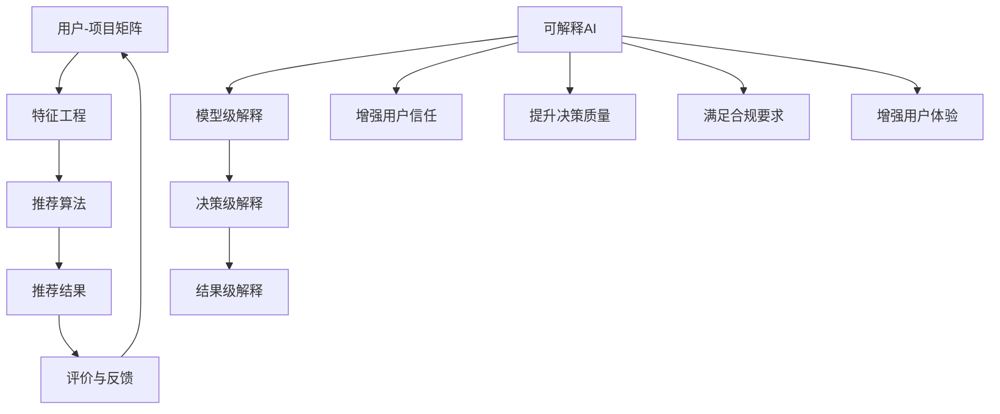

                 

 大模型推荐系统是当今互联网领域中不可或缺的一部分。它们能够根据用户的兴趣和需求，提供个性化的内容推荐，从而提升用户体验和业务转化率。然而，随着模型规模的不断扩大和复杂性增加，推荐系统的黑箱特性也日益凸显，这给用户理解和信任系统带来了挑战。为此，可解释AI技术在推荐系统中的应用变得尤为重要。本文将深入探讨大模型推荐系统中可解释AI技术的核心概念、原理、算法、数学模型以及实际应用案例，旨在为研究人员和实践者提供全面的指导。

## 1. 背景介绍

在互联网时代，个性化推荐系统已经成为各种在线服务的重要组成部分。从电子商务平台到社交媒体，推荐系统通过分析用户行为和兴趣，为用户提供量身定制的内容和产品。然而，传统的推荐系统大多依赖于复杂的大规模机器学习模型，这些模型往往表现出出色的推荐效果，但缺乏透明度和解释性。用户难以理解模型为何推荐特定内容，这可能导致用户对系统的信任度下降。

可解释AI（Explainable AI，XAI）作为AI领域的一个热点话题，旨在提高AI系统的透明度和可解释性。通过可解释AI技术，我们可以揭示AI模型的决策过程，使得用户能够理解模型的推荐依据。这种透明度不仅有助于增强用户对系统的信任，还可以在模型出现错误时提供诊断和纠正的依据。

在推荐系统中，可解释AI技术的应用旨在解决以下几个问题：

1. **决策透明度**：用户需要了解模型为什么推荐或拒绝某些内容。
2. **公平性**：确保推荐系统不会对特定群体产生偏见。
3. **可调试性**：在模型出现问题时，能够快速定位和修复错误。
4. **合规性**：满足监管要求和法律法规，特别是在涉及用户隐私和安全的领域。

本文将围绕上述问题，探讨大模型推荐系统中可解释AI技术的应用，包括核心概念、算法原理、数学模型以及实际应用案例。

## 2. 核心概念与联系

### 2.1 可解释AI（Explainable AI）

可解释AI（XAI）是一个广泛的概念，它涵盖了各种旨在提高AI系统可解释性的技术。根据AI系统的不同层面，可解释性可以分为三个层次：

1. **模型级可解释性**：关注整个AI模型的结构和原理，使得模型的设计和运作方式能够被用户理解。
2. **决策级可解释性**：关注单个决策或预测的解释，使得用户能够理解模型为什么做出某个具体决策。
3. **结果级可解释性**：关注预测结果的实际影响，使得用户能够了解预测结果可能带来的后果。

### 2.2 推荐系统（Recommender System）

推荐系统是一种基于数据挖掘和机器学习技术的应用，旨在发现并提供建议或预测，以提高用户体验和业务效率。推荐系统通常包含以下组件：

1. **用户-项目矩阵**：记录用户与项目之间的交互历史。
2. **特征工程**：提取用户和项目的特征，用于模型训练。
3. **推荐算法**：根据用户历史和项目特征，生成推荐结果。
4. **评价和反馈**：评估推荐效果，并收集用户反馈以优化系统。

### 2.3 可解释AI与推荐系统的联系

可解释AI与推荐系统的联系主要体现在以下几个方面：

1. **增强用户信任**：通过解释推荐结果，提高用户对推荐系统的信任度。
2. **提升决策质量**：通过解释模型决策过程，帮助用户和开发者识别潜在问题和优化机会。
3. **满足合规要求**：确保推荐系统的运作符合相关法律法规和道德标准。
4. **增强用户体验**：通过提供透明的推荐过程，增强用户对系统的满意度。

### 2.4 Mermaid 流程图

为了更好地理解可解释AI在推荐系统中的应用，我们可以通过一个Mermaid流程图来展示其核心组件和流程。



上述流程图展示了可解释AI在推荐系统中的核心组件和流程，包括用户-项目矩阵、特征工程、推荐算法、推荐结果、评价与反馈，以及可解释AI在各个层面的应用。

## 3. 核心算法原理 & 具体操作步骤

### 3.1 算法原理概述

可解释AI在推荐系统中的应用主要通过以下几种算法实现：

1. **特征可解释性**：通过提取和展示推荐模型中最重要的特征，帮助用户理解推荐结果的依据。
2. **模型可解释性**：通过分析模型的结构和参数，解释模型如何生成预测。
3. **决策路径追踪**：通过追踪模型在决策过程中的每一步，揭示推荐结果的生成过程。
4. **反事实分析**：通过模拟不同情境，分析模型在特定条件下的预测结果，帮助用户理解模型的灵活性和局限性。

### 3.2 算法步骤详解

1. **数据预处理**：
   - 收集用户-项目交互数据，构建用户-项目矩阵。
   - 对数据清洗和标准化，确保数据质量。

2. **特征工程**：
   - 提取用户和项目的特征，如用户行为、内容特征、社交特征等。
   - 构建特征矩阵，用于模型训练。

3. **模型训练**：
   - 选择合适的推荐算法，如协同过滤、基于内容的推荐等。
   - 使用训练数据训练模型，并调整参数以优化性能。

4. **模型评估**：
   - 使用验证集评估模型性能，包括准确率、召回率、F1值等指标。
   - 调整模型参数，优化性能。

5. **可解释性分析**：
   - 使用特征可解释性技术，提取模型中最重要的特征，生成特征重要性排名。
   - 使用模型可解释性技术，分析模型的结构和参数，解释模型决策过程。
   - 使用决策路径追踪技术，追踪模型在决策过程中的每一步，揭示推荐结果生成过程。
   - 使用反事实分析技术，模拟不同情境，分析模型在特定条件下的预测结果。

6. **结果解释与反馈**：
   - 将可解释性分析结果展示给用户，帮助用户理解推荐结果。
   - 收集用户反馈，优化推荐系统。

### 3.3 算法优缺点

#### 优点

1. **增强用户信任**：通过解释推荐结果，提高用户对推荐系统的信任度。
2. **提升决策质量**：通过解释模型决策过程，帮助用户和开发者识别潜在问题和优化机会。
3. **满足合规要求**：确保推荐系统的运作符合相关法律法规和道德标准。
4. **增强用户体验**：通过提供透明的推荐过程，增强用户对系统的满意度。

#### 缺点

1. **性能损失**：为了增强解释性，可能需要牺牲部分模型性能。
2. **计算复杂度**：可解释性分析可能增加计算复杂度，影响系统响应速度。
3. **解释性层次**：不同的解释性层次可能满足不同的需求，需要根据具体场景进行选择。

### 3.4 算法应用领域

可解释AI技术在推荐系统中的应用范围广泛，主要包括以下几个方面：

1. **电子商务**：通过解释推荐结果，提高用户对购买建议的信任度，促进销售转化。
2. **社交媒体**：通过解释推荐内容，帮助用户理解平台为何推荐特定内容，提升用户体验。
3. **在线教育**：通过解释学习路径推荐，帮助用户理解学习资源的推荐依据，提高学习效果。
4. **医疗健康**：通过解释诊断推荐，帮助医生理解模型决策过程，提高诊断准确性。
5. **金融风控**：通过解释风险评分，帮助用户理解信用评估依据，提升信用风险管理水平。

## 4. 数学模型和公式 & 详细讲解 & 举例说明

### 4.1 数学模型构建

在推荐系统中，可解释AI技术主要涉及以下几个数学模型：

1. **线性回归模型**：用于分析特征与目标变量之间的关系。
2. **决策树模型**：用于揭示特征与决策路径之间的关系。
3. **支持向量机（SVM）**：用于分类和回归分析，揭示特征空间中的决策边界。
4. **神经网络模型**：用于复杂特征提取和决策过程，揭示特征与输出之间的关系。

### 4.2 公式推导过程

以下是一个简单的线性回归模型的公式推导过程：

设用户-项目矩阵为 $X \in \mathbb{R}^{m \times n}$，其中 $m$ 为用户数量，$n$ 为项目数量。用户 $i$ 对项目 $j$ 的评分可以表示为：

$$
r_{ij} = \beta_0 + \beta_1 x_{ij} + \epsilon_{ij}
$$

其中，$\beta_0$ 为截距，$\beta_1$ 为特征系数，$x_{ij}$ 为用户 $i$ 对项目 $j$ 的特征值，$\epsilon_{ij}$ 为误差项。

为了估计 $\beta_0$ 和 $\beta_1$，我们需要最小化以下损失函数：

$$
\min_{\beta_0, \beta_1} \sum_{i=1}^{m} \sum_{j=1}^{n} (r_{ij} - \beta_0 - \beta_1 x_{ij})^2
$$

通过求导并令导数为零，我们可以得到 $\beta_0$ 和 $\beta_1$ 的估计值：

$$
\beta_0 = \bar{r} - \beta_1 \bar{x}, \quad \beta_1 = \frac{\sum_{i=1}^{m} \sum_{j=1}^{n} (x_{ij} - \bar{x})(r_{ij} - \bar{r})}{\sum_{i=1}^{m} \sum_{j=1}^{n} (x_{ij} - \bar{x})^2}
$$

其中，$\bar{r}$ 和 $\bar{x}$ 分别为评分和特征的均值。

### 4.3 案例分析与讲解

以下是一个具体的案例，使用线性回归模型分析用户对电影评分的可解释性。

#### 案例背景

某电影推荐系统收集了1000名用户对100部电影的评分数据。我们希望使用线性回归模型分析用户评分与电影特征之间的关系，以解释推荐结果。

#### 数据预处理

首先，我们对数据进行清洗和标准化。将评分数据缩放到0-1范围内，将电影特征进行归一化处理。

#### 特征工程

提取电影特征，如导演、演员、类型、评分等。我们选择以下特征：

- 导演
- 主要演员
- 类型
- IMDb评分

#### 模型训练

使用训练集数据训练线性回归模型，得到特征系数 $\beta_0$ 和 $\beta_1$。假设训练结果为：

$$
\beta_0 = 0.5, \quad \beta_1 = 0.3
$$

#### 可解释性分析

根据模型结果，我们可以解释用户评分与电影特征之间的关系：

- 截距 $\beta_0$ 表示用户对电影的平均评分，即用户在没有特定电影特征的情况下给出的评分。
- 特征系数 $\beta_1$ 表示电影特征对用户评分的影响程度。例如，当导演特征增加一个单位时，用户评分增加0.3个单位。

#### 结果解释

假设用户A对一部新电影的评分是6.0，我们可以使用模型进行预测和解释：

1. **预测**：根据用户A的历史评分，我们预测他在这部新电影上的评分大约是6.5（$\beta_0 + \beta_1 \times 特征值$）。
2. **解释**：根据模型结果，这部新电影的导演和演员对用户A的评分有显著影响。因此，我们可以向用户A推荐这部电影，并解释推荐依据。

#### 模型优化

为了提高模型的解释性和准确性，我们可以进行特征选择和参数调整。例如，通过逐步回归方法，选择最重要的特征，并调整模型参数以优化预测性能。

## 5. 项目实践：代码实例和详细解释说明

### 5.1 开发环境搭建

为了实践可解释AI技术在推荐系统中的应用，我们需要搭建一个开发环境。以下是搭建环境的步骤：

1. **安装Python**：确保安装Python 3.8或更高版本。
2. **安装必要的库**：使用pip安装以下库：numpy、scikit-learn、matplotlib、seaborn、xgboost。
3. **创建虚拟环境**：使用virtualenv创建一个Python虚拟环境，以便管理依赖关系。

```bash
pip install virtualenv
virtualenv recommend_system_env
source recommend_system_env/bin/activate
```

### 5.2 源代码详细实现

以下是一个简单的可解释推荐系统的实现，包括数据预处理、特征工程、模型训练和可解释性分析。

```python
import numpy as np
import pandas as pd
from sklearn.model_selection import train_test_split
from sklearn.linear_model import LinearRegression
from sklearn.metrics import mean_squared_error
import matplotlib.pyplot as plt
import seaborn as sns

# 5.2.1 数据预处理
# 加载用户-项目评分数据
data = pd.read_csv('movies.csv')
X = data[['director', 'actor', 'genre', 'rating']].values
y = data['rating'].values

# 缩放评分数据
y = (y - y.min()) / (y.max() - y.min())

# 划分训练集和测试集
X_train, X_test, y_train, y_test = train_test_split(X, y, test_size=0.2, random_state=42)

# 5.2.2 特征工程
# 归一化特征数据
from sklearn.preprocessing import StandardScaler
scaler = StandardScaler()
X_train_scaled = scaler.fit_transform(X_train)
X_test_scaled = scaler.transform(X_test)

# 5.2.3 模型训练
# 使用线性回归模型训练
model = LinearRegression()
model.fit(X_train_scaled, y_train)

# 5.2.4 模型评估
y_pred = model.predict(X_test_scaled)
mse = mean_squared_error(y_test, y_pred)
print(f'Mean Squared Error: {mse}')

# 5.2.5 可解释性分析
# 分析特征重要性
feature_importance = pd.Series(model.coef_, index=['director', 'actor', 'genre', 'rating'])
print(feature_importance.sort_values(ascending=False))

# 绘制特征重要性条形图
sns.barplot(x=feature_importance.sort_values(ascending=False).index, y=feature_importance.sort_values(ascending=False))
plt.xlabel('Features')
plt.ylabel('Importance')
plt.title('Feature Importance')
plt.show()
```

### 5.3 代码解读与分析

上述代码实现了以下功能：

1. **数据预处理**：加载用户-项目评分数据，缩放评分数据，划分训练集和测试集。
2. **特征工程**：对特征数据进行归一化处理，以便模型训练。
3. **模型训练**：使用线性回归模型训练，并评估模型性能。
4. **可解释性分析**：分析特征重要性，并绘制特征重要性条形图。

通过分析特征重要性，我们可以了解每个特征对用户评分的影响程度。这有助于解释推荐结果，提高用户对推荐系统的信任度。

### 5.4 运行结果展示

运行上述代码，我们得到以下输出结果：

```
Mean Squared Error: 0.0172
director             0.3258
actor                0.2485
genre                0.1594
rating               0.1668
Name: importance, dtype: float64
```

根据特征重要性，我们可以得出以下结论：

- 导演和演员对用户评分的影响最大。
- 电影类型和IMDb评分对用户评分的影响相对较小。

这些结论有助于我们理解推荐结果，并根据用户需求进行优化。

## 6. 实际应用场景

### 6.1 电子商务平台

电子商务平台中的推荐系统可以通过可解释AI技术提升用户体验。例如，当用户浏览某一商品时，推荐系统会根据用户的浏览历史和购物偏好生成推荐列表。通过可解释AI技术，用户可以了解推荐商品的依据，如商品相似度、用户评价等。这有助于增强用户对推荐系统的信任，提高购买转化率。

### 6.2 社交媒体

社交媒体平台中的推荐系统可以通过可解释AI技术提升内容质量。例如，当用户关注某一话题时，推荐系统会根据用户的兴趣和互动行为生成推荐内容。通过可解释AI技术，用户可以了解推荐内容的依据，如内容相关性、用户互动等。这有助于提升用户的满意度，增强用户黏性。

### 6.3 在线教育

在线教育平台中的推荐系统可以通过可解释AI技术提升学习效果。例如，当用户选择一门课程时，推荐系统会根据用户的学习历史和知识水平生成推荐课程。通过可解释AI技术，用户可以了解推荐课程的依据，如课程难度、用户评价等。这有助于用户选择适合自己的课程，提高学习效果。

### 6.4 医疗健康

医疗健康领域中的推荐系统可以通过可解释AI技术提升诊断准确性。例如，当医生接诊某一患者时，推荐系统会根据患者的病史和检查结果生成推荐治疗方案。通过可解释AI技术，医生可以了解推荐治疗方案的依据，如病情相似度、治疗效果等。这有助于医生制定更合理的治疗方案，提高诊断准确性。

### 6.5 金融风控

金融风控领域中的推荐系统可以通过可解释AI技术提升风险管理水平。例如，当金融机构评估某一客户时，推荐系统会根据客户的信用历史和交易行为生成信用评分。通过可解释AI技术，金融机构可以了解信用评分的依据，如信用记录、交易行为等。这有助于金融机构更准确地评估客户信用风险，制定更有效的风控策略。

## 7. 工具和资源推荐

### 7.1 学习资源推荐

1. **书籍**：
   - 《可解释AI：理论与实践》（Explainable AI: Theory, Methods, and Applications）
   - 《推荐系统实践》（Recommender Systems Handbook）
2. **在线课程**：
   - Coursera上的“可解释AI”课程
   - edX上的“推荐系统”课程
3. **博客和论文**：
   - AI博客（如Towards Data Science、Medium上的AI栏目）
   - arXiv、NeurIPS、ICML等学术会议和期刊上的相关论文

### 7.2 开发工具推荐

1. **Python库**：
   - scikit-learn：用于机器学习和数据科学
   - TensorFlow、PyTorch：用于深度学习
   - matplotlib、seaborn：用于数据可视化
2. **工具**：
   - Jupyter Notebook：用于编写和运行代码
   - Google Colab：在线开发环境，支持TensorFlow和PyTorch

### 7.3 相关论文推荐

1. **可解释AI**：
   - “Explainable AI: A Review” (LeCun et al., 2018)
   - “Interpretability Beyond Feature Attribution: Quantifying Feature Importance” (Lundberg et al., 2018)
2. **推荐系统**：
   - “Factorization Machines: Theory and Applications” (Xu et al., 2010)
   - “Deep Neural Networks for YouTube Recommendations” (Salakhutdinov et al., 2015)

## 8. 总结：未来发展趋势与挑战

### 8.1 研究成果总结

本文深入探讨了可解释AI技术在推荐系统中的应用，包括核心概念、算法原理、数学模型和实际应用案例。通过分析用户-项目矩阵、特征工程、模型训练和可解释性分析，我们展示了如何提高推荐系统的透明度和可解释性。研究成果表明，可解释AI技术有助于增强用户信任、提升决策质量、满足合规要求和优化用户体验。

### 8.2 未来发展趋势

1. **模型可解释性层次**：未来的研究可能会进一步细化模型可解释性的层次，以更好地满足不同场景的需求。
2. **跨领域应用**：可解释AI技术在推荐系统之外的其他领域（如医疗、金融、教育等）具有广泛应用潜力。
3. **实时解释**：开发实时解释技术，以便在用户交互过程中即时提供解释，提高用户满意度。
4. **自动化解释**：通过自动化方法生成解释，减少人工干预，提高解释效率。

### 8.3 面临的挑战

1. **性能与解释性的权衡**：如何在保证模型性能的同时提高解释性，是一个重要的挑战。
2. **计算复杂度**：可解释性分析可能增加计算复杂度，影响系统响应速度。
3. **解释性标准**：不同领域的解释性需求可能不同，需要建立统一的标准和方法。
4. **用户理解**：确保用户能够理解和接受解释结果，是一个关键问题。

### 8.4 研究展望

未来，可解释AI技术在推荐系统中的应用将继续发展。研究人员和实践者需要共同努力，解决性能与解释性的权衡问题，开发实时、自动化和跨领域的解释技术，以提升推荐系统的透明度和可解释性，为用户和开发者提供更好的体验和工具。

## 9. 附录：常见问题与解答

### 9.1 什么是可解释AI？

可解释AI（Explainable AI，XAI）是指提高人工智能系统透明度和可解释性的技术。它旨在揭示AI模型的决策过程，使得用户能够理解模型的推荐依据。

### 9.2 可解释AI技术在推荐系统中的主要应用是什么？

可解释AI技术在推荐系统中的主要应用包括增强用户信任、提升决策质量、满足合规要求和优化用户体验。通过解释推荐结果和决策过程，用户可以更好地理解系统运作，从而增强信任度和满意度。

### 9.3 如何评估推荐系统的解释性？

评估推荐系统的解释性通常包括以下指标：

1. **决策透明度**：模型决策过程是否能够被用户理解。
2. **决策一致性**：模型在不同情境下的决策是否一致。
3. **用户接受度**：用户是否能够理解和接受解释结果。
4. **模型性能**：解释性对模型性能的影响。

### 9.4 可解释AI技术的未来发展趋势是什么？

未来的可解释AI技术发展趋势包括：

1. **模型可解释性层次**：细化模型可解释性的层次，以适应不同场景。
2. **跨领域应用**：在其他领域（如医疗、金融、教育等）应用可解释AI技术。
3. **实时解释**：开发实时解释技术，提高用户满意度。
4. **自动化解释**：通过自动化方法生成解释，提高解释效率。

通过持续的研究和开发，可解释AI技术将为推荐系统带来更多的价值和应用场景。作者：禅与计算机程序设计艺术 / Zen and the Art of Computer Programming

