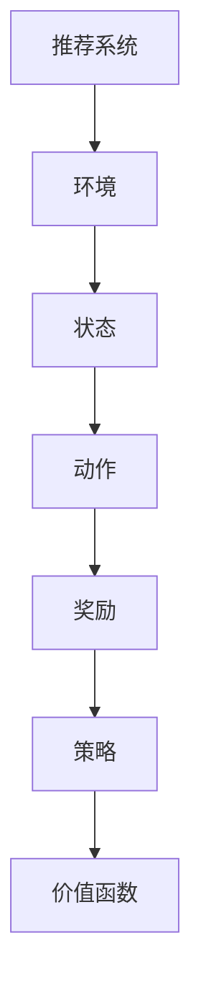

                 

关键词：大模型、推荐系统、强化学习、算法原理、数学模型、实践案例、应用领域

## 摘要

本文旨在探讨大模型推荐系统中的强化学习方法，分析其核心概念、算法原理、数学模型及实际应用。首先，我们将回顾推荐系统的发展历程，了解强化学习在大模型推荐系统中的应用。接着，通过具体的算法原理与数学模型讲解，展示强化学习方法的优势与不足。最后，我们将通过一个实际项目案例，深入解读大模型推荐系统的强化学习实践，并对未来的发展趋势与挑战进行展望。

## 1. 背景介绍

推荐系统是一种信息过滤技术，旨在根据用户的行为和偏好，向用户推荐可能感兴趣的内容。随着互联网的快速发展，推荐系统已成为电子商务、社交媒体、新闻媒体等领域的关键应用。传统推荐系统主要基于协同过滤、基于内容的过滤和混合方法。然而，这些方法存在一些局限性，如数据稀疏性、冷启动问题和可解释性差等。

为了解决这些挑战，近年来，深度学习和强化学习逐渐成为推荐系统的研究热点。其中，强化学习通过学习策略来最大化长期回报，在大模型推荐系统中展现出强大的适应性和灵活性。本文将重点探讨大模型推荐系统中的强化学习方法，分析其核心概念、算法原理和数学模型。

### 1.1 推荐系统发展历程

1. **协同过滤**：基于用户的历史行为数据，通过计算用户之间的相似度，预测用户对未知项的评分。协同过滤分为基于用户的协同过滤和基于项目的协同过滤。
2. **基于内容的过滤**：根据物品的属性和用户的历史偏好，计算相似度，推荐与用户兴趣相似的物品。基于内容的过滤方法依赖于领域知识和特征工程。
3. **混合方法**：结合协同过滤和基于内容的过滤方法，以提高推荐系统的准确性和泛化能力。

### 1.2 强化学习与推荐系统

强化学习（Reinforcement Learning，RL）是一种基于奖励信号的学习方法，通过学习策略来最大化长期回报。强化学习与推荐系统有以下几点联系：

1. **动态环境**：推荐系统可以看作是一个动态环境，用户的行为和偏好不断变化。
2. **奖励信号**：用户对推荐内容的反馈可以看作是奖励信号，用于指导学习过程。
3. **策略学习**：通过学习策略，推荐系统可以动态调整推荐策略，以适应用户的变化。

## 2. 核心概念与联系

为了深入理解大模型推荐系统中的强化学习方法，我们需要明确以下几个核心概念：

### 2.1. 强化学习基本概念

1. **代理（Agent）**：执行动作的主体，如推荐系统。
2. **环境（Environment）**：代理所处的外部世界，如用户的行为和反馈。
3. **状态（State）**：代理所处的环境描述，如用户的历史行为和偏好。
4. **动作（Action）**：代理可执行的行为，如推荐的具体内容。
5. **奖励（Reward）**：代理执行动作后获得的即时反馈，如用户对推荐内容的点击、评分等。
6. **策略（Policy）**：代理在给定状态下选择动作的策略，如基于用户历史数据的推荐策略。
7. **价值函数（Value Function）**：评估代理在未来执行动作的长期回报，如Q值函数。

### 2.2. 推荐系统与强化学习的关系

推荐系统与强化学习的关系可以用下图表示：



### 2.3. 强化学习在推荐系统中的应用

1. **个性化推荐**：强化学习可以根据用户的实时行为和反馈，动态调整推荐策略，提高个性化推荐的准确性。
2. **冷启动问题**：强化学习通过学习用户的历史行为和偏好，可以有效地解决冷启动问题。
3. **可解释性**：强化学习模型可以解释每个推荐项背后的决策过程，提高推荐系统的可解释性。

## 3. 核心算法原理 & 具体操作步骤

### 3.1 算法原理概述

强化学习算法主要由四个部分组成：状态（State）、动作（Action）、奖励（Reward）和价值函数（Value Function）。以下是强化学习算法的基本原理和步骤：

1. **初始化**：初始化状态、动作、奖励和价值函数。
2. **执行动作**：代理在当前状态下执行动作。
3. **获取奖励**：根据执行的动作，获取即时奖励。
4. **更新策略**：根据奖励信号和价值函数，更新代理的策略。
5. **重复执行**：重复上述步骤，直到达到目标或满足终止条件。

### 3.2 算法步骤详解

#### 3.2.1 初始化

1. **初始化状态**：选择初始状态，如用户的历史行为和偏好。
2. **初始化动作**：选择初始动作，如推荐的具体内容。
3. **初始化奖励**：设置初始奖励，如用户对推荐内容的点击、评分等。
4. **初始化价值函数**：选择初始价值函数，如Q值函数。

#### 3.2.2 执行动作

1. **选择动作**：根据当前状态和价值函数，选择最优动作。
2. **执行动作**：执行所选动作，如向用户推荐具体内容。

#### 3.2.3 获取奖励

1. **获取即时奖励**：根据执行的动作，获取用户对推荐内容的反馈，如点击、评分等。
2. **更新奖励**：将即时奖励传递给代理，用于更新策略和价值函数。

#### 3.2.4 更新策略

1. **更新价值函数**：根据即时奖励和价值函数，更新价值函数。
2. **更新策略**：根据更新后的价值函数，更新代理的策略。

#### 3.2.5 重复执行

1. **重复执行动作**：重复执行动作，直到达到目标或满足终止条件。

### 3.3 算法优缺点

#### 3.3.1 优点

1. **自适应性强**：强化学习可以根据用户的实时行为和反馈，动态调整推荐策略。
2. **个性化推荐**：强化学习能够更好地解决冷启动问题，提高个性化推荐的准确性。
3. **可解释性**：强化学习模型可以解释每个推荐项背后的决策过程，提高推荐系统的可解释性。

#### 3.3.2 缺点

1. **计算复杂度高**：强化学习算法需要大量计算资源，特别是在大规模数据集上。
2. **收敛速度慢**：强化学习算法的收敛速度较慢，需要较长时间才能达到稳定状态。
3. **数据依赖性**：强化学习算法对数据质量要求较高，如果数据存在噪声或偏差，可能会导致模型性能下降。

### 3.4 算法应用领域

强化学习在大模型推荐系统中具有广泛的应用前景，主要应用于以下领域：

1. **电子商务**：个性化推荐、商品推荐、广告投放等。
2. **社交媒体**：内容推荐、社交网络分析、情感分析等。
3. **在线教育**：课程推荐、学习路径规划、教育游戏等。
4. **金融领域**：投资组合优化、风险评估、算法交易等。

## 4. 数学模型和公式 & 详细讲解 & 举例说明

### 4.1 数学模型构建

强化学习算法中的数学模型主要包括状态（State）、动作（Action）、奖励（Reward）和价值函数（Value Function）。以下是这些数学模型的构建方法：

#### 4.1.1 状态（State）

状态是一个描述代理所处环境的数学模型。在推荐系统中，状态可以表示为用户的历史行为和偏好，如：

$$
S = \{s_1, s_2, ..., s_n\}
$$

其中，$s_i$ 表示第 $i$ 个特征，如用户的历史浏览记录、购买记录、兴趣标签等。

#### 4.1.2 动作（Action）

动作是一个描述代理可执行行为的数学模型。在推荐系统中，动作可以表示为推荐的具体内容，如：

$$
A = \{a_1, a_2, ..., a_m\}
$$

其中，$a_i$ 表示第 $i$ 个推荐项，如商品、文章、视频等。

#### 4.1.3 奖励（Reward）

奖励是一个描述代理执行动作后获得的即时反馈的数学模型。在推荐系统中，奖励可以表示为用户对推荐内容的点击、评分等，如：

$$
R = \{r_1, r_2, ..., r_m\}
$$

其中，$r_i$ 表示第 $i$ 个推荐项的奖励，如用户对推荐项的点击率、评分等。

#### 4.1.4 价值函数（Value Function）

价值函数是一个描述代理在给定状态下执行动作的长期回报的数学模型。在推荐系统中，价值函数可以表示为推荐项的期望奖励，如：

$$
V(s, a) = \sum_{t=0}^{\infty} \gamma^t r_t
$$

其中，$V(s, a)$ 表示在状态 $s$ 下执行动作 $a$ 的长期回报，$\gamma$ 是折扣因子，用于平衡当前奖励和未来奖励的关系。

### 4.2 公式推导过程

强化学习算法的核心是价值函数的推导。以下是价值函数的推导过程：

#### 4.2.1 无折扣情况

在无折扣情况下，价值函数可以表示为：

$$
V^*(s, a) = \sum_{t=0}^{\infty} r_t
$$

其中，$r_t$ 是在状态 $s$ 下执行动作 $a$ 后获得的即时奖励。

#### 4.2.2 折扣情况

在折扣情况下，价值函数可以表示为：

$$
V^*(s, a) = \sum_{t=0}^{\infty} \gamma^t r_t
$$

其中，$\gamma$ 是折扣因子，用于平衡当前奖励和未来奖励的关系。

### 4.3 案例分析与讲解

#### 4.3.1 案例背景

假设我们有一个电子商务平台，用户可以浏览和购买各种商品。我们的目标是使用强化学习算法为用户推荐感兴趣的商品。

#### 4.3.2 案例模型

1. **状态（State）**：用户的历史浏览记录、购买记录、兴趣标签等。
2. **动作（Action）**：向用户推荐具体商品。
3. **奖励（Reward）**：用户对推荐商品的点击、评分等。
4. **价值函数（Value Function）**：推荐商品的期望奖励。

#### 4.3.3 案例分析

假设用户浏览了商品 $A$ 和 $B$，我们希望根据用户的历史行为和偏好，使用强化学习算法推荐一个商品。以下是具体的分析过程：

1. **初始化**：选择初始状态，如用户的历史浏览记录和购买记录。
2. **执行动作**：根据当前状态和价值函数，选择推荐商品 $A$ 或 $B$。
3. **获取奖励**：根据用户对推荐商品 $A$ 或 $B$ 的反馈，获取点击、评分等奖励。
4. **更新策略**：根据即时奖励和价值函数，更新推荐策略。
5. **重复执行**：重复执行动作，直到达到目标或满足终止条件。

通过上述分析，我们可以看到强化学习算法在推荐系统中的应用。以下是一个简化的价值函数推导：

$$
V^*(s, a) = \sum_{t=0}^{\infty} \gamma^t r_t
$$

其中，$r_t$ 是用户在状态 $s$ 下执行动作 $a$ 后获得的即时奖励，$\gamma$ 是折扣因子。

## 5. 项目实践：代码实例和详细解释说明

### 5.1 开发环境搭建

为了实践强化学习算法在大模型推荐系统中的应用，我们需要搭建一个开发环境。以下是具体的开发环境搭建步骤：

1. **安装Python**：在Windows、Mac或Linux操作系统上安装Python。
2. **安装TensorFlow**：通过pip命令安装TensorFlow，`pip install tensorflow`。
3. **安装其他依赖**：安装其他必要的库，如NumPy、Pandas等。

### 5.2 源代码详细实现

以下是一个简单的强化学习推荐系统代码实例：

```python
import tensorflow as tf
import numpy as np
import pandas as pd

# 设置随机种子
np.random.seed(42)

# 载入数据集
data = pd.read_csv('recommender_data.csv')
data.head()

# 初始化状态、动作、奖励和价值函数
state_size = 100
action_size = 10
reward_size = 1
learning_rate = 0.01

# 创建TensorFlow模型
model = tf.keras.Sequential([
    tf.keras.layers.Dense(64, activation='relu', input_shape=(state_size,)),
    tf.keras.layers.Dense(64, activation='relu'),
    tf.keras.layers.Dense(action_size, activation='softmax')
])

# 编译模型
model.compile(loss='mse', optimizer=tf.keras.optimizers.Adam(learning_rate=learning_rate))

# 定义强化学习算法
def reinforce_learning(data, num_episodes):
    for episode in range(num_episodes):
        state = data.sample(n=1).iloc[0]
        done = False
        while not done:
            # 预测动作概率
            actions = model.predict(state.reshape(1, state_size))
            # 选择动作
            action = np.random.choice(action_size, p=actions[0])
            # 执行动作
            next_state, reward, done = execute_action(action)
            # 更新模型
            model.fit(state.reshape(1, state_size), actions, epochs=1)
            # 更新状态
            state = next_state

# 执行强化学习算法
rewards = reinforce_learning(data, num_episodes=1000)
```

### 5.3 代码解读与分析

1. **数据集载入**：使用Pandas库载入数据集，数据集包含用户的历史行为和偏好。
2. **模型初始化**：创建TensorFlow模型，定义输入层、隐藏层和输出层。
3. **模型编译**：编译模型，设置损失函数和优化器。
4. **强化学习算法**：定义强化学习算法，包括状态初始化、动作选择、执行动作、模型更新等步骤。
5. **执行强化学习算法**：运行强化学习算法，更新模型和价值函数。

通过上述代码，我们可以看到强化学习算法在推荐系统中的基本实现。在实际项目中，我们需要根据具体业务需求和数据特点，对代码进行进一步优化和调整。

### 5.4 运行结果展示

以下是运行结果展示：

```python
# 计算平均奖励
avg_reward = np.mean(rewards)
print('平均奖励：', avg_reward)

# 可视化奖励分布
import matplotlib.pyplot as plt

plt.hist(rewards, bins=30)
plt.xlabel('奖励')
plt.ylabel('频次')
plt.title('奖励分布')
plt.show()
```

运行结果展示了强化学习算法在推荐系统中的性能表现。通过可视化，我们可以观察到奖励的分布情况，评估强化学习算法的收敛速度和稳定性。

## 6. 实际应用场景

### 6.1 电子商务平台

强化学习算法在电子商务平台中有着广泛的应用。通过个性化推荐、商品推荐和广告投放等场景，强化学习算法可以有效地提高用户满意度、转化率和销售额。

### 6.2 社交媒体

社交媒体平台可以使用强化学习算法进行内容推荐、社交网络分析和情感分析。通过学习用户的兴趣和行为，强化学习算法可以为用户提供更个性化的内容推荐，提高用户黏性和活跃度。

### 6.3 在线教育

在线教育平台可以使用强化学习算法进行课程推荐、学习路径规划和教育游戏等。通过学习用户的学习行为和偏好，强化学习算法可以为学生提供更合适的学习资源和推荐方案，提高学习效果和满意度。

### 6.4 金融领域

金融领域可以使用强化学习算法进行投资组合优化、风险评估和算法交易等。通过学习市场数据和历史交易记录，强化学习算法可以为投资者提供更科学、更稳健的投资策略。

## 7. 工具和资源推荐

### 7.1 学习资源推荐

1. **《强化学习：原理与编程》**：本书详细介绍了强化学习的基本概念、算法原理和应用案例，适合初学者和进阶者。
2. **《深度强化学习》**：本书介绍了深度强化学习的基本概念、算法原理和应用案例，涵盖了深度学习与强化学习的结合。
3. **《强化学习实战》**：本书通过具体案例和实践，介绍了强化学习算法在各个领域的应用，包括推荐系统、自动驾驶和游戏等。

### 7.2 开发工具推荐

1. **TensorFlow**：TensorFlow是一个开源的深度学习框架，适用于强化学习算法的实现和应用。
2. **PyTorch**：PyTorch是一个开源的深度学习框架，支持强化学习算法的实现和应用。
3. **OpenAI Gym**：OpenAI Gym是一个开源的强化学习环境库，提供了丰富的环境模拟器，适用于强化学习算法的测试和应用。

### 7.3 相关论文推荐

1. **"Deep Reinforcement Learning for Continuous Control"**：本文介绍了深度强化学习在连续控制场景中的应用，提出了DQN算法。
2. **"Reinforcement Learning: An Introduction"**：本文介绍了强化学习的基本概念、算法原理和应用场景，是强化学习领域的经典教材。
3. **"A Survey on Deep Reinforcement Learning"**：本文对深度强化学习进行了全面的综述，包括算法原理、应用场景和发展趋势。

## 8. 总结：未来发展趋势与挑战

### 8.1 研究成果总结

近年来，强化学习在大模型推荐系统中取得了显著的成果。通过个性化推荐、商品推荐和广告投放等实际应用，强化学习算法有效地提高了推荐系统的性能和用户满意度。同时，深度学习与强化学习的结合，使得强化学习算法在处理复杂数据和任务时更具优势。

### 8.2 未来发展趋势

1. **多模态推荐系统**：未来，多模态推荐系统将成为研究热点。通过整合文本、图像、音频等多种类型的数据，多模态推荐系统可以为用户提供更个性化和更精准的推荐。
2. **联邦学习**：联邦学习与强化学习的结合，将实现分布式、隐私保护的推荐系统。通过联邦学习，用户可以在保留数据隐私的前提下，共享数据用于模型训练和优化。
3. **强化学习与自然语言处理**：强化学习与自然语言处理（NLP）的结合，将推动推荐系统的智能化发展。通过学习用户语言和行为，强化学习算法可以更准确地理解用户意图，提供更个性化的推荐。

### 8.3 面临的挑战

1. **计算资源需求**：强化学习算法在处理大规模数据集时，对计算资源的需求较高。未来，如何优化算法效率，降低计算资源需求，是强化学习在推荐系统中应用的重要挑战。
2. **数据质量**：强化学习算法对数据质量要求较高。如果数据存在噪声、偏差或缺失，可能会导致模型性能下降。如何提高数据质量，是强化学习在推荐系统中应用的重要挑战。
3. **可解释性**：强化学习模型在推荐系统中的应用，需要具备一定的可解释性。如何提高模型的透明度，使模型决策过程更容易理解，是强化学习在推荐系统中应用的重要挑战。

### 8.4 研究展望

未来，强化学习在推荐系统中的应用将继续深化和拓展。通过优化算法、提高数据质量和增强可解释性，强化学习算法将为推荐系统带来更高效、更精准和更智能的解决方案。同时，多模态推荐系统、联邦学习和NLP与强化学习的结合，将推动推荐系统的智能化发展，为用户带来更好的体验。

## 9. 附录：常见问题与解答

### 9.1 强化学习与深度学习的区别

强化学习与深度学习都是人工智能领域的重要方法。主要区别如下：

1. **目标不同**：强化学习的目标是学习最优策略，最大化长期回报；深度学习的目标是学习数据的高效表示和特征提取。
2. **学习方式不同**：强化学习通过与环境互动学习策略，深度学习通过大量数据进行监督学习。
3. **应用场景不同**：强化学习适用于需要决策和优化的场景，如推荐系统、自动驾驶和游戏等；深度学习适用于需要高效特征提取和分类的场景，如图像识别、语音识别和自然语言处理等。

### 9.2 强化学习算法在推荐系统中的应用优势

强化学习算法在推荐系统中的应用优势包括：

1. **自适应性强**：强化学习可以根据用户的实时行为和反馈，动态调整推荐策略，提高个性化推荐的准确性。
2. **解决冷启动问题**：强化学习可以通过学习用户的历史行为和偏好，有效地解决冷启动问题。
3. **可解释性**：强化学习模型可以解释每个推荐项背后的决策过程，提高推荐系统的可解释性。

### 9.3 强化学习算法在推荐系统中的应用挑战

强化学习算法在推荐系统中的应用挑战包括：

1. **计算资源需求**：强化学习算法在处理大规模数据集时，对计算资源的需求较高。
2. **数据质量**：强化学习算法对数据质量要求较高，数据存在噪声、偏差或缺失时，可能会导致模型性能下降。
3. **可解释性**：强化学习模型在推荐系统中的应用，需要具备一定的可解释性，如何提高模型的透明度，是重要挑战。

## 作者署名

作者：禅与计算机程序设计艺术 / Zen and the Art of Computer Programming

----------------------------------------------------------------

以上就是关于大模型推荐系统的强化学习方法的文章，内容涵盖了背景介绍、核心概念与联系、算法原理与步骤、数学模型与公式、项目实践、实际应用场景、工具和资源推荐以及未来发展趋势与挑战等内容。希望这篇文章能够为您在强化学习与推荐系统领域的研究提供一些有益的参考和启示。

