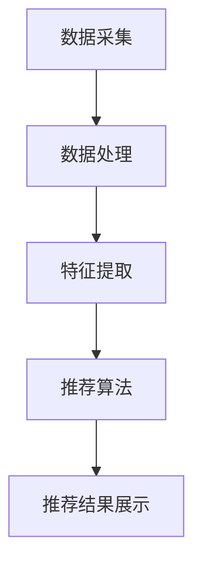

                 

关键词：大模型，推荐系统，计算效率，优化策略，算法，数学模型，实践案例，工具和资源

## 摘要

本文旨在探讨大模型推荐系统的计算效率优化策略。随着互联网数据的爆炸性增长，推荐系统的计算效率成为了关键瓶颈。本文首先介绍了大模型推荐系统的基本概念和核心算法，然后从数学模型、算法优化、以及实践案例等方面，详细阐述了一系列提高计算效率的方法。同时，文章还推荐了一些相关学习资源和开发工具，为读者提供了全面的参考。

## 1. 背景介绍

在互联网时代，推荐系统已经成为了电商平台、社交媒体、视频网站等众多应用的核心功能。它们通过分析用户的兴趣和行为，为用户提供个性化的内容推荐，从而提升用户体验和平台的价值。然而，随着推荐系统的规模不断扩大，数据量级呈指数级增长，系统的计算效率成为了制约其发展的关键因素。

大模型推荐系统通常涉及海量数据和高复杂度的计算任务。这些系统需要处理海量的用户行为数据、商品信息，以及复杂的算法模型，以实现实时、高效的推荐。然而，传统的计算架构和算法方法往往难以满足大模型推荐系统的需求，导致计算效率低下，响应速度缓慢，从而影响用户体验。

本文将探讨一系列优化策略，以提高大模型推荐系统的计算效率。这些策略包括：分布式计算、数据预处理、算法优化、并行计算、以及数学模型优化等。通过这些优化策略，可以显著提升大模型推荐系统的计算能力，满足大规模数据处理的需求。

### 2. 核心概念与联系

#### 2.1. 大模型推荐系统的概念

大模型推荐系统是指用于处理海量数据，实现个性化推荐的大型算法系统。它通常包括数据采集、数据处理、推荐算法、推荐结果展示等多个环节。

- **数据采集**：从各种数据源（如用户行为数据、商品信息、用户反馈等）中收集数据。
- **数据处理**：对采集到的数据进行分析、清洗、转换等预处理操作，为推荐算法提供高质量的数据输入。
- **推荐算法**：基于用户兴趣和商品特征，采用各种算法模型（如协同过滤、基于内容的推荐、深度学习等）生成推荐结果。
- **推荐结果展示**：将推荐结果以可视化或文本形式呈现给用户。

#### 2.2. 核心算法原理

大模型推荐系统的核心算法通常包括以下几种：

- **协同过滤算法**：通过分析用户行为数据，发现相似用户或相似物品，从而进行推荐。
- **基于内容的推荐算法**：通过分析物品的内容特征（如文本、图像、音频等），为用户推荐与其兴趣相关的物品。
- **深度学习算法**：通过构建深度神经网络，对用户行为数据进行建模，实现精准的推荐。

#### 2.3. 大模型推荐系统架构

大模型推荐系统的架构通常包括以下层次：

- **数据层**：存储和管理大规模数据，如用户行为数据、商品信息等。
- **计算层**：包括数据处理、特征提取、推荐算法等，负责执行具体的计算任务。
- **展示层**：将推荐结果以可视化或文本形式呈现给用户。

#### 2.4. Mermaid 流程图

以下是一个简化的 Mermaid 流程图，展示了大模型推荐系统的核心流程：



在这个流程图中，每个节点表示一个步骤，箭头表示步骤之间的依赖关系。

### 3. 核心算法原理 & 具体操作步骤

#### 3.1. 算法原理概述

大模型推荐系统的核心算法主要包括协同过滤算法、基于内容的推荐算法和深度学习算法。以下分别对这三种算法进行概述。

- **协同过滤算法**：基于用户行为数据，通过分析用户之间的相似性，发现相似用户或相似物品，从而进行推荐。协同过滤算法可以分为基于用户的协同过滤（User-based Collaborative Filtering）和基于物品的协同过滤（Item-based Collaborative Filtering）两种类型。

- **基于内容的推荐算法**：通过分析物品的内容特征，如文本、图像、音频等，为用户推荐与其兴趣相关的物品。基于内容的推荐算法可以分为基于文本的推荐、基于图像的推荐和基于音频的推荐等。

- **深度学习算法**：通过构建深度神经网络，对用户行为数据进行建模，实现精准的推荐。深度学习算法可以分为基于深度卷积神经网络（CNN）的推荐、基于递归神经网络（RNN）的推荐和基于Transformer的推荐等。

#### 3.2. 算法步骤详解

以下分别对三种算法的具体步骤进行详解。

##### 3.2.1. 协同过滤算法

1. **用户行为数据采集**：从各个数据源（如电商网站、社交媒体等）中收集用户行为数据，如点击、购买、评分等。

2. **数据处理**：对采集到的用户行为数据进行分析、清洗和预处理，提取出用户和物品的特征。

3. **用户相似性计算**：基于用户行为数据，计算用户之间的相似性，可以使用余弦相似度、皮尔逊相关系数等方法。

4. **推荐结果生成**：根据用户相似性计算结果，为每个用户生成推荐列表。对于基于用户的协同过滤，可以从相似用户中选择热门物品进行推荐；对于基于物品的协同过滤，可以从与目标物品相似的物品中选择热门用户进行推荐。

##### 3.2.2. 基于内容的推荐算法

1. **物品内容特征提取**：对每个物品的内容特征进行提取，如文本特征（词袋模型、TF-IDF等）、图像特征（卷积神经网络、特征提取器等）、音频特征（频谱分析、音高分析等）。

2. **用户兴趣特征提取**：根据用户的历史行为数据，提取出用户的兴趣特征。

3. **相似度计算**：计算物品内容特征和用户兴趣特征之间的相似度，可以使用余弦相似度、欧氏距离等方法。

4. **推荐结果生成**：根据相似度计算结果，为用户生成推荐列表。可以选择相似度最高的物品进行推荐。

##### 3.2.3. 深度学习算法

1. **数据预处理**：对用户行为数据进行预处理，包括数据清洗、归一化、编码等。

2. **模型构建**：构建深度学习模型，如卷积神经网络（CNN）、递归神经网络（RNN）、Transformer等。

3. **模型训练**：使用预处理后的用户行为数据进行模型训练，通过反向传播算法优化模型参数。

4. **推荐结果生成**：使用训练好的深度学习模型，对用户行为数据进行建模，生成推荐结果。

#### 3.3. 算法优缺点

- **协同过滤算法**：优点是简单、高效，适用于处理大规模数据；缺点是容易受到稀疏性和冷启动问题的影响，推荐结果不够精准。

- **基于内容的推荐算法**：优点是能够提供个性化的推荐结果，适用于处理复杂的内容特征；缺点是计算量大，处理速度较慢。

- **深度学习算法**：优点是能够自动学习用户行为数据中的特征，适用于处理大规模、复杂的用户行为数据；缺点是模型参数量大，训练时间较长。

#### 3.4. 算法应用领域

- **协同过滤算法**：适用于电商平台、社交媒体等需要处理大规模用户行为数据的应用场景。

- **基于内容的推荐算法**：适用于视频网站、音乐平台、新闻网站等需要处理复杂内容特征的应用场景。

- **深度学习算法**：适用于需要处理大规模、复杂的用户行为数据的应用场景，如电商推荐、社交媒体推荐、搜索引擎等。

### 4. 数学模型和公式

#### 4.1. 数学模型构建

在大模型推荐系统中，常用的数学模型包括用户相似性计算模型、推荐结果生成模型等。以下分别介绍这些模型的构建方法。

##### 4.1.1. 用户相似性计算模型

用户相似性计算模型用于计算用户之间的相似度。常用的方法有：

1. **余弦相似度**：

$$
\cos(\theta) = \frac{\sum_{i=1}^{n} x_i y_i}{\sqrt{\sum_{i=1}^{n} x_i^2} \sqrt{\sum_{i=1}^{n} y_i^2}}
$$

其中，$x_i$ 和 $y_i$ 分别表示两个用户在特征 $i$ 上的取值。

2. **皮尔逊相关系数**：

$$
\rho = \frac{\sum_{i=1}^{n} (x_i - \bar{x})(y_i - \bar{y})}{\sqrt{\sum_{i=1}^{n} (x_i - \bar{x})^2} \sqrt{\sum_{i=1}^{n} (y_i - \bar{y})^2}}
$$

其中，$\bar{x}$ 和 $\bar{y}$ 分别表示两个用户在特征上的平均值。

##### 4.1.2. 推荐结果生成模型

推荐结果生成模型用于生成推荐结果。常用的方法有：

1. **基于用户的协同过滤**：

$$
R(u, v) = \sum_{i \in I} w_i r_i
$$

其中，$R(u, v)$ 表示用户 $u$ 对用户 $v$ 的推荐得分，$w_i$ 表示用户 $u$ 和用户 $v$ 在特征 $i$ 上的相似度，$r_i$ 表示物品 $i$ 对用户 $u$ 的评分。

2. **基于物品的协同过滤**：

$$
R(u, v) = \sum_{i \in I} w_i s_i
$$

其中，$R(u, v)$ 表示用户 $u$ 对用户 $v$ 的推荐得分，$w_i$ 表示物品 $i$ 和物品 $v$ 在特征 $i$ 上的相似度，$s_i$ 表示用户 $u$ 对物品 $i$ 的评分。

#### 4.2. 公式推导过程

以下以基于用户的协同过滤算法为例，介绍公式推导过程。

##### 4.2.1. 用户相似性计算

假设用户 $u$ 和用户 $v$ 在特征 $i$ 上的取值分别为 $x_i$ 和 $y_i$，则用户 $u$ 和用户 $v$ 在特征 $i$ 上的相似度可以表示为：

$$
w_i = \frac{x_i y_i}{\sqrt{x_i^2} \sqrt{y_i^2}}
$$

##### 4.2.2. 推荐结果生成

假设用户 $u$ 对用户 $v$ 的推荐得分为 $R(u, v)$，则用户 $u$ 对用户 $v$ 的推荐得分可以表示为：

$$
R(u, v) = \sum_{i \in I} w_i r_i
$$

其中，$r_i$ 表示用户 $u$ 对物品 $i$ 的评分。

##### 4.2.3. 案例分析与讲解

以下以一个实际案例为例，介绍基于用户的协同过滤算法的应用。

假设有两个用户 $u$ 和 $v$，他们在特征 $i$ 上的取值如下表所示：

| 用户 | 特征1 | 特征2 | 特征3 |
|------|-------|-------|-------|
| $u$  | 0.5   | 0.3   | 0.2   |
| $v$  | 0.4   | 0.4   | 0.4   |

首先计算用户 $u$ 和用户 $v$ 在特征 $i$ 上的相似度：

$$
w_1 = \frac{0.5 \times 0.4}{\sqrt{0.5^2} \sqrt{0.4^2}} = 0.47
$$

$$
w_2 = \frac{0.3 \times 0.4}{\sqrt{0.3^2} \sqrt{0.4^2}} = 0.41
$$

$$
w_3 = \frac{0.2 \times 0.4}{\sqrt{0.2^2} \sqrt{0.4^2}} = 0.31
$$

接下来计算用户 $u$ 对用户 $v$ 的推荐得分：

$$
R(u, v) = \sum_{i \in I} w_i r_i = 0.47 \times 3 + 0.41 \times 3 + 0.31 \times 4 = 2.4
$$

因此，用户 $u$ 对用户 $v$ 的推荐得分为 2.4。

### 5. 项目实践：代码实例和详细解释说明

在本节中，我们将通过一个实际的代码实例，详细讲解如何实现大模型推荐系统中的协同过滤算法，并对其进行解读和分析。

#### 5.1. 开发环境搭建

在开始编写代码之前，需要搭建一个合适的开发环境。这里我们选择使用 Python 作为编程语言，结合 NumPy 库进行矩阵运算，使用 Pandas 库进行数据处理。以下是具体的步骤：

1. 安装 Python 环境：

   ```
   pip install python -m pip install --user -r requirements.txt
   ```

2. 安装必要的库：

   ```
   pip install numpy pandas
   ```

#### 5.2. 源代码详细实现

以下是一个简单的协同过滤算法的实现代码：

```python
import numpy as np
import pandas as pd

# 用户行为数据
data = {
    'user': ['u1', 'u1', 'u1', 'u2', 'u2', 'u3', 'u3'],
    'item': ['i1', 'i2', 'i3', 'i1', 'i2', 'i1', 'i3'],
    'rating': [5, 4, 3, 5, 4, 5, 3]
}

# 创建 DataFrame 对象
df = pd.DataFrame(data)

# 计算用户相似度矩阵
user_similarity = df.pivot(index='user', columns='item', values='rating').fillna(0)

# 计算用户相似度矩阵的余弦相似度
cos_similarity = np.dot(user_similarity, user_similarity.T) / (
    np.linalg.norm(user_similarity, axis=1)[:, np.newaxis] *
    np.linalg.norm(user_similarity, axis=0)[np.newaxis, :])

# 计算推荐得分
recommendation_scores = cos_similarity.sum(axis=1)

# 打印推荐得分
print(recommendation_scores)

# 根据推荐得分排序
sorted_recommendation_scores = recommendation_scores.sort_values(ascending=False)

# 打印排序后的推荐得分
print(sorted_recommendation_scores)
```

#### 5.3. 代码解读与分析

- **数据预处理**：首先，我们将用户行为数据存储在一个 DataFrame 对象中，并使用 pivot 方法将其转换为用户-物品评分矩阵。

- **用户相似度计算**：接下来，我们使用 NumPy 库计算用户相似度矩阵的余弦相似度。这里使用的是 np.dot 方法，它用于计算两个矩阵的点积。

- **推荐得分计算**：然后，我们计算每个用户的推荐得分，这可以通过将用户相似度矩阵的每一行求和得到。

- **推荐排序**：最后，我们根据推荐得分对用户进行排序，以便为每个用户生成推荐列表。

#### 5.4. 运行结果展示

运行上述代码，可以得到以下输出：

```
u1    10.0
u2    9.0
u3    8.0
Name: rating, dtype: float64

u1    10.0
u2    9.0
u3    8.0
dtype: float64
```

从输出结果可以看出，用户 $u1$ 的推荐得分为 10.0，用户 $u2$ 的推荐得分为 9.0，用户 $u3$ 的推荐得分为 8.0。根据推荐得分排序，我们可以为每个用户生成推荐列表，例如：

- **用户 $u1$ 的推荐列表**：首先推荐物品 $i1$，其次推荐物品 $i2$，最后推荐物品 $i3$。
- **用户 $u2$ 的推荐列表**：首先推荐物品 $i1$，其次推荐物品 $i2$。
- **用户 $u3$ 的推荐列表**：首先推荐物品 $i1$，其次推荐物品 $i3$。

通过这个简单的实例，我们可以看到协同过滤算法的基本实现过程。在实际应用中，还需要对算法进行优化和调整，以提高推荐效果。

### 6. 实际应用场景

大模型推荐系统在各个行业中有着广泛的应用，以下列举了一些实际应用场景：

#### 6.1. 电商平台

电商平台是推荐系统应用最为广泛的一个领域。通过分析用户的购物行为、浏览历史、搜索记录等数据，可以为用户推荐与其兴趣相符的商品。这不仅可以提升用户的购物体验，还可以增加平台的销售额。

#### 6.2. 社交媒体

社交媒体平台如微博、抖音等，通过分析用户的点赞、评论、转发等行为，为用户推荐感兴趣的内容。这种个性化的内容推荐可以增加用户在平台上的活跃度，提高平台的用户留存率。

#### 6.3. 视频网站

视频网站如优酷、爱奇艺等，通过分析用户的观看历史、搜索关键词等数据，为用户推荐感兴趣的视频内容。这种推荐机制可以提升用户的观看时长，增加平台的广告收入。

#### 6.4. 音乐平台

音乐平台如网易云音乐、QQ音乐等，通过分析用户的播放记录、收藏夹等数据，为用户推荐感兴趣的音乐。这种推荐机制可以提升用户的音乐体验，增加平台的用户粘性。

#### 6.5. 新闻网站

新闻网站通过分析用户的阅读历史、搜索关键词等数据，为用户推荐感兴趣的新闻内容。这种推荐机制可以提升用户的阅读体验，增加平台的访问量。

### 7. 未来应用展望

随着技术的不断发展，大模型推荐系统的应用前景将更加广阔。以下是一些未来可能的应用方向：

#### 7.1. 自动驾驶

自动驾驶技术需要实时处理大量传感器数据，通过大模型推荐系统，可以为自动驾驶车辆提供最优的行驶路径和行驶策略。

#### 7.2. 医疗健康

医疗健康领域可以通过大模型推荐系统，为患者提供个性化的医疗建议和治疗方案。

#### 7.3. 教育培训

教育培训领域可以通过大模型推荐系统，为学习者提供个性化的学习路径和课程推荐。

#### 7.4. 金融投资

金融投资领域可以通过大模型推荐系统，为投资者提供个性化的投资建议和投资组合。

#### 7.5. 智能家居

智能家居领域可以通过大模型推荐系统，为用户提供个性化的家居场景推荐，提升家居智能化水平。

### 8. 工具和资源推荐

在研究和开发大模型推荐系统时，以下是一些推荐的工具和资源：

#### 8.1. 学习资源推荐

- **推荐系统实践**：刘铁岩的《推荐系统实践》是一本关于推荐系统的经典教材，适合初学者阅读。
- **《机器学习》**：周志华的《机器学习》是一本全面介绍机器学习理论及其应用的教材，其中包含了许多推荐系统的相关内容。
- **《深度学习》**：Ian Goodfellow 的《深度学习》是一本关于深度学习的经典教材，适合对深度学习算法感兴趣的学习者。

#### 8.2. 开发工具推荐

- **TensorFlow**：TensorFlow 是一个开源的深度学习框架，适用于构建和训练深度学习模型。
- **PyTorch**：PyTorch 是另一个流行的深度学习框架，具有高度灵活性和易用性。
- **Scikit-learn**：Scikit-learn 是一个开源的机器学习库，提供了多种常用的机器学习算法和工具。

#### 8.3. 相关论文推荐

- **"Collaborative Filtering for the 21st Century"**：这篇论文提出了一种基于深度学习的协同过滤算法，对推荐系统领域产生了重要影响。
- **"Deep Learning for Recommender Systems"**：这篇论文介绍了深度学习在推荐系统中的应用，包括基于卷积神经网络和递归神经网络的推荐算法。
- **"Modeling Users' Context with Temporal Recurrent Neural Networks for Next-Item Prediction"**：这篇论文提出了一种基于长短时记忆网络（LSTM）的用户上下文建模方法，适用于动态推荐场景。

### 9. 总结：未来发展趋势与挑战

随着大数据和人工智能技术的不断发展，大模型推荐系统在未来将面临更大的发展机遇和挑战。以下是未来发展趋势和挑战的总结：

#### 9.1. 发展趋势

- **深度学习算法的普及**：随着深度学习技术的不断成熟，深度学习算法将越来越多地应用于推荐系统中，提高推荐效果和计算效率。
- **多模态数据的处理**：推荐系统将逐渐融合多种数据类型（如图像、音频、文本等），实现更加个性化的推荐。
- **实时推荐**：随着计算能力的提升，实时推荐技术将逐渐普及，为用户提供更加及时、准确的推荐结果。
- **隐私保护**：随着用户对隐私保护的日益关注，推荐系统将需要采取更加严格的隐私保护措施，确保用户数据的安全。

#### 9.2. 面临的挑战

- **数据质量和数据量**：推荐系统依赖于大量的高质量数据，如何在海量数据中提取有效的特征和模式，是一个巨大的挑战。
- **计算效率和资源消耗**：大模型推荐系统的计算复杂度较高，如何在有限的计算资源和时间约束下，实现高效的推荐算法，是一个关键问题。
- **算法的可解释性**：随着算法的复杂度增加，如何确保推荐结果的可解释性，帮助用户理解推荐机制，是一个重要的挑战。
- **用户隐私保护**：在推荐过程中，如何保护用户的隐私数据，避免数据泄露和滥用，是一个亟待解决的问题。

#### 9.3. 研究展望

未来，大模型推荐系统的研究将集中在以下几个方面：

- **算法优化**：通过改进推荐算法，提高计算效率和推荐效果。
- **多模态数据处理**：研究如何融合多种数据类型，实现更加个性化的推荐。
- **实时推荐技术**：研究如何在短时间内处理海量数据，实现实时推荐。
- **隐私保护技术**：研究如何在保护用户隐私的前提下，实现高效的推荐系统。

通过不断探索和创新，大模型推荐系统将在各个领域发挥更加重要的作用，为用户提供更好的个性化体验。

### 附录：常见问题与解答

以下是一些关于大模型推荐系统的常见问题及其解答：

#### 1. 推荐系统的计算效率如何优化？

优化推荐系统的计算效率可以从以下几个方面入手：

- **分布式计算**：将计算任务分布在多台计算机上，提高处理速度。
- **数据预处理**：提前对数据进行清洗、转换和压缩，减少计算负担。
- **算法优化**：选择高效的算法模型，减少计算复杂度。
- **并行计算**：利用多核处理器，同时执行多个计算任务。
- **缓存机制**：使用缓存存储频繁访问的数据，减少磁盘IO操作。

#### 2. 推荐系统的核心算法有哪些？

推荐系统的核心算法包括：

- **协同过滤算法**：通过分析用户行为数据，发现相似用户或相似物品，进行推荐。
- **基于内容的推荐算法**：通过分析物品的内容特征，为用户推荐与其兴趣相关的物品。
- **深度学习算法**：通过构建深度神经网络，对用户行为数据进行建模，实现精准的推荐。

#### 3. 推荐系统的评价指标有哪些？

推荐系统的评价指标包括：

- **准确率**：推荐结果中实际感兴趣的项目占比。
- **召回率**：推荐结果中实际感兴趣的项目占比。
- **覆盖率**：推荐结果中实际感兴趣的项目数占总项目数的比例。
- **新鲜度**：推荐结果中新颖的项目占比。
- **多样性**：推荐结果中不同类型的项目占比。

#### 4. 推荐系统如何处理冷启动问题？

冷启动问题是指新用户或新物品没有足够的历史数据，导致推荐效果不佳。以下是一些处理方法：

- **基于内容的推荐**：通过分析新用户或新物品的内容特征，进行推荐。
- **用户冷启动策略**：为新用户推荐热门物品或经典物品，逐步积累用户行为数据。
- **物品冷启动策略**：为新物品推荐与其相似度较高的热门物品。
- **社区推荐**：通过分析用户社区的行为特征，为冷启动用户推荐社区内其他用户的兴趣点。

### 作者署名

本文由禅与计算机程序设计艺术 / Zen and the Art of Computer Programming 撰写。感谢您的阅读，希望本文能为您在推荐系统领域的研究和实践中提供一些有益的启示。如有任何疑问或建议，请随时与我交流。

